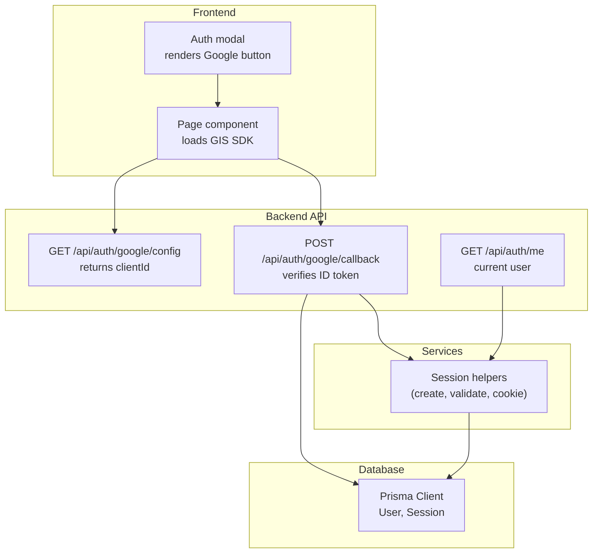
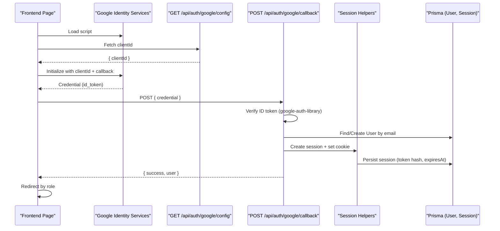
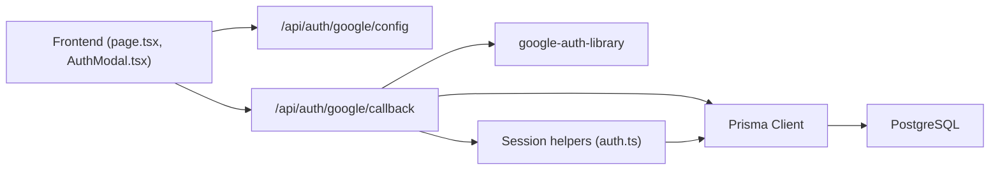

# OAuth Integration

<cite>
**Referenced Files in This Document**
- [route.ts](file://app/api/auth/google/callback/route.ts)
- [route.ts](file://app/api/auth/google/config/route.ts)
- [auth.ts](file://lib/auth.ts)
- [schema.prisma](file://prisma/schema.prisma)
- [page.tsx](file://app/page.tsx)
- [AuthModal.tsx](file://app/components/AuthModal.tsx)
- [route.ts](file://app/api/auth/me/route.ts)
- [06-security.md](file://docs/03-architecture/06-security.md)
- [03-authentication-decision.md](file://docs/02-requirements/03-authentication-decision.md)
</cite>

## Table of Contents
1. [Introduction](#introduction)
2. [Project Structure](#project-structure)
3. [Core Components](#core-components)
4. [Architecture Overview](#architecture-overview)
5. [Detailed Component Analysis](#detailed-component-analysis)
6. [Dependency Analysis](#dependency-analysis)
7. [Performance Considerations](#performance-considerations)
8. [Troubleshooting Guide](#troubleshooting-guide)
9. [Conclusion](#conclusion)
10. [Appendices](#appendices)

## Introduction
This document explains PETIVA’s Google OAuth integration, focusing on the end-to-end flow from client-side sign-in to server-side token verification, session creation, and user profile synchronization with the local database. It also covers configuration steps for Google Cloud Console, error handling strategies, account linking considerations, extensibility to other providers, and security best practices.

## Project Structure
The OAuth implementation spans a small set of focused files:
- Frontend initialization and Google Identity Services (GIS) setup
- Server endpoints for Google OAuth callback and client configuration
- Session management utilities
- Database schema for users and sessions

**Diagram sources**
- [page.tsx:35-82](file://app/page.tsx#L35-L82)
- [AuthModal.tsx:55-69](file://app/components/AuthModal.tsx#L55-L69)
- [route.ts:3-7](file://app/api/auth/google/config/route.ts#L3-L7)
- [route.ts:6-97](file://app/api/auth/google/callback/route.ts#L6-L97)
- [route.ts:4-32](file://app/api/auth/me/route.ts#L4-L32)
- [auth.ts:23-97](file://lib/auth.ts#L23-L97)
- [schema.prisma:30-66](file://prisma/schema.prisma#L30-L66)

**Section sources**
- [page.tsx:35-128](file://app/page.tsx#L35-L128)
- [AuthModal.tsx:55-69](file://app/components/AuthModal.tsx#L55-L69)
- [route.ts:3-7](file://app/api/auth/google/config/route.ts#L3-L7)
- [route.ts:6-97](file://app/api/auth/google/callback/route.ts#L6-L97)
- [route.ts:4-32](file://app/api/auth/me/route.ts#L4-L32)
- [auth.ts:23-97](file://lib/auth.ts#L23-L97)
- [schema.prisma:30-66](file://prisma/schema.prisma#L30-L66)

## Core Components
- Google Identity Services initialization and callback wiring on the frontend
- Server-side ID token verification using google-auth-library
- Session creation and secure cookie setting
- User lookup or creation based on verified email
- Current user retrieval via session validation

Key responsibilities:
- Frontend loads the Google SDK, initializes it with the backend-provided clientId, and invokes the callback with the credential
- Backend verifies the credential, extracts user identity, ensures a user record exists, creates a session, and sets an HttpOnly cookie
- Subsequent requests can retrieve the current user by validating the session cookie

**Section sources**
- [page.tsx:55-82](file://app/page.tsx#L55-L82)
- [page.tsx:84-111](file://app/page.tsx#L84-L111)
- [AuthModal.tsx:55-69](file://app/components/AuthModal.tsx#L55-L69)
- [route.ts:6-97](file://app/api/auth/google/callback/route.ts#L6-L97)
- [auth.ts:23-97](file://lib/auth.ts#L23-L97)

## Architecture Overview
The OAuth flow uses Google’s Sign In With Google (SIWG) one-tap flow:
1. The page dynamically loads the Google Identity Services script
2. The page fetches the clientId from the backend config endpoint
3. The Google button triggers a credential issuance by Google
4. The frontend sends the credential to the backend callback endpoint
5. The backend verifies the ID token, finds or creates the user, creates a session, and sets a secure cookie
6. The frontend redirects to the appropriate dashboard based on role

**Diagram sources**
- [page.tsx:55-82](file://app/page.tsx#L55-L82)
- [page.tsx:84-111](file://app/page.tsx#L84-L111)
- [route.ts:3-7](file://app/api/auth/google/config/route.ts#L3-L7)
- [route.ts:6-97](file://app/api/auth/google/callback/route.ts#L6-L97)
- [auth.ts:23-97](file://lib/auth.ts#L23-L97)
- [schema.prisma:30-66](file://prisma/schema.prisma#L30-L66)

## Detailed Component Analysis

### Google Sign-In Button and Callback Handling
- The page dynamically injects the Google Identity Services script and initializes it with the clientId obtained from the backend
- The AuthModal renders the Google button and wires the callback to send the credential to the backend
- On successful authentication, the frontend redirects to the appropriate dashboard based on the returned user role

Implementation highlights:
- Dynamic script loading and initialization
- Rendering the Google button inside the modal
- Sending the credential to the callback endpoint and handling success/failure states

**Section sources**
- [page.tsx:55-82](file://app/page.tsx#L55-L82)
- [page.tsx:84-111](file://app/page.tsx#L84-L111)
- [AuthModal.tsx:55-69](file://app/components/AuthModal.tsx#L55-L69)

### Server-Side Token Verification and User Sync
- The callback endpoint validates the incoming credential:
  - In development, a mock token path is supported for faster iteration
  - In production, the ID token is verified against the configured clientId
- The verified payload provides email and name fields used to locate or create a user
- After ensuring a user exists, a session is created and a secure cookie is set

Data flow:
- Extract credential from request body
- Verify ID token using google-auth-library
- Resolve or create user by email
- Generate session token, persist session, set cookie
- Return minimal user info to the client

**Section sources**
- [route.ts:6-97](file://app/api/auth/google/callback/route.ts#L6-L97)
- [auth.ts:23-97](file://lib/auth.ts#L23-L97)
- [schema.prisma:30-66](file://prisma/schema.prisma#L30-L66)

### Session Management and Cookie Security
- Sessions are stored with hashed tokens and expiration timestamps
- Validation checks expiration and supports sliding window extension
- Cookies are HttpOnly, Secure in production, SameSite=Lax, scoped to root path

Security notes:
- Plaintext token is only in the cookie; the database stores a SHA-256 hash
- Expired sessions are cleaned up automatically during validation

**Section sources**
- [auth.ts:23-97](file://lib/auth.ts#L23-L97)
- [schema.prisma:55-66](file://prisma/schema.prisma#L55-L66)
- [03-authentication-decision.md:88-90](file://docs/02-requirements/03-authentication-decision.md#L88-L90)

### Current User Endpoint
- The /api/auth/me endpoint reads the session cookie, validates it, and returns the authenticated user if present
- Used by the frontend to determine initial routing and auth state

**Section sources**
- [route.ts:4-32](file://app/api/auth/me/route.ts#L4-L32)
- [auth.ts:100-107](file://lib/auth.ts#L100-L107)

### Configuration Endpoint
- Exposes the Google clientId to the frontend for initializing the Google Identity Services client
- Ensures the client ID is sourced from environment variables

**Section sources**
- [route.ts:3-7](file://app/api/auth/google/config/route.ts#L3-L7)

## Dependency Analysis
- Frontend depends on Google Identity Services SDK and the backend’s config and callback endpoints
- Backend depends on google-auth-library for ID token verification and Prisma for data access
- Session helpers encapsulate token generation, hashing, persistence, and cookie management
- Database schema defines User and Session entities with relationships and indexes

**Diagram sources**
- [page.tsx:55-82](file://app/page.tsx#L55-L82)
- [AuthModal.tsx:55-69](file://app/components/AuthModal.tsx#L55-L69)
- [route.ts:3-7](file://app/api/auth/google/config/route.ts#L3-L7)
- [route.ts:6-97](file://app/api/auth/google/callback/route.ts#L6-L97)
- [auth.ts:23-97](file://lib/auth.ts#L23-L97)
- [schema.prisma:30-66](file://prisma/schema.prisma#L30-L66)

**Section sources**
- [page.tsx:55-111](file://app/page.tsx#L55-L111)
- [AuthModal.tsx:55-69](file://app/components/AuthModal.tsx#L55-L69)
- [route.ts:3-7](file://app/api/auth/google/config/route.ts#L3-L7)
- [route.ts:6-97](file://app/api/auth/google/callback/route.ts#L6-L97)
- [auth.ts:23-97](file://lib/auth.ts#L23-L97)
- [schema.prisma:30-66](file://prisma/schema.prisma#L30-L66)

## Performance Considerations
- ID token verification is a single network call to Google’s public key endpoints; ensure timeouts and retries are handled appropriately at the library level
- Session validation performs indexed lookups by tokenHash; keep queries minimal and leverage existing indexes
- Avoid unnecessary re-renders of the Google button; render once per modal open lifecycle
- Use environment-specific logic (mock vs. real) to speed up development without impacting production performance

[No sources needed since this section provides general guidance]

## Troubleshooting Guide
Common issues and resolutions:
- Missing or invalid credential: Ensure the Google button is properly initialized and that the callback receives a valid id_token
- Misconfigured clientId: Verify that the backend’s GOOGLE_CLIENT_ID matches the Google Cloud Console project settings
- Invalid token payload: Confirm that the audience matches the clientId and that the token has not expired
- Network errors: Handle fetch failures gracefully and surface user-friendly messages
- Session not set: Check that the callback successfully creates a session and sets the cookie with correct flags

Error handling in code:
- The callback returns structured error responses for missing credentials, invalid payloads, and unexpected exceptions
- The current user endpoint returns a clear unauthorized response when no valid session is present

**Section sources**
- [route.ts:10-15](file://app/api/auth/google/callback/route.ts#L10-L15)
- [route.ts:29-49](file://app/api/auth/google/callback/route.ts#L29-L49)
- [route.ts:90-96](file://app/api/auth/google/callback/route.ts#L90-L96)
- [route.ts:7-11](file://app/api/auth/me/route.ts#L7-L11)

## Conclusion
PETIVA’s Google OAuth integration leverages Google’s Sign In With Google for a streamlined user experience, with robust server-side verification and secure session management. The design separates concerns across frontend initialization, backend verification, and database operations, enabling maintainability and scalability. Security measures include HttpOnly cookies, token hashing, and strict audience validation. Extending to additional providers follows similar patterns: initialize provider SDK, verify tokens server-side, synchronize user profiles, and manage sessions consistently.

[No sources needed since this section summarizes without analyzing specific files]

## Appendices

### Google Cloud Console Setup Checklist
- Create an OAuth consent screen with appropriate scopes (e.g., email, profile)
- Configure OAuth 2.0 Client IDs for Web application
- Add authorized redirect URIs if using server-side flows; for SIWG one-tap, ensure your domain is allowed
- Set the GOOGLE_CLIENT_ID environment variable on the server

[No sources needed since this section provides general guidance]

### Extending to Additional Providers (Facebook, Apple)
Patterns to follow:
- Frontend: Initialize the provider’s SDK and obtain an access token or ID token
- Backend: Validate the token using the provider’s official libraries or APIs
- User sync: Map provider identifiers to local user records; handle account linking if a user already exists with another provider
- Session management: Reuse existing session helpers to create and manage sessions uniformly

[No sources needed since this section provides general guidance]

### Security Considerations
- State parameter validation: For server-side authorization code flows, validate state to prevent CSRF
- Nonce usage: For ID tokens, validate nonce to mitigate replay attacks where applicable
- Audience validation: Ensure the token’s audience matches your clientId
- Token storage: Store only hashed session tokens in the database; keep plaintext tokens in secure HttpOnly cookies
- Rate limiting and monitoring: Protect sensitive endpoints against abuse and monitor failed attempts

**Section sources**
- [06-security.md:7-13](file://docs/03-architecture/06-security.md#L7-L13)
- [03-authentication-decision.md:88-90](file://docs/02-requirements/03-authentication-decision.md#L88-L90)