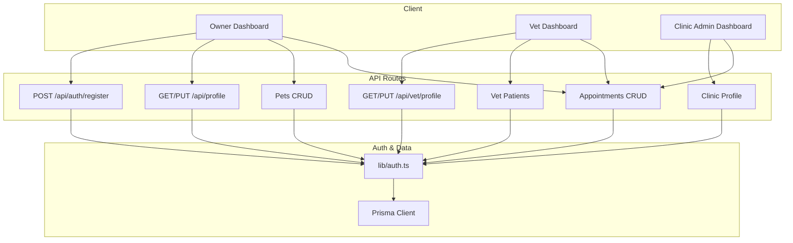
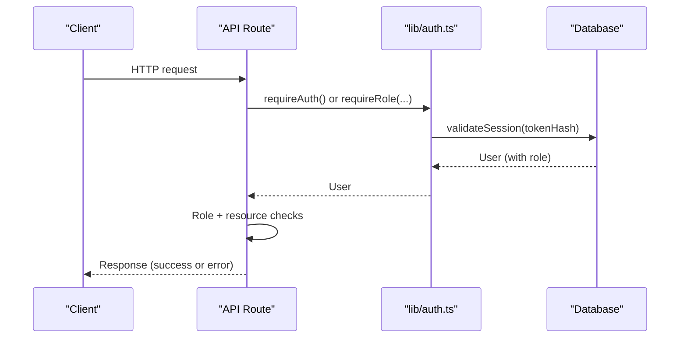
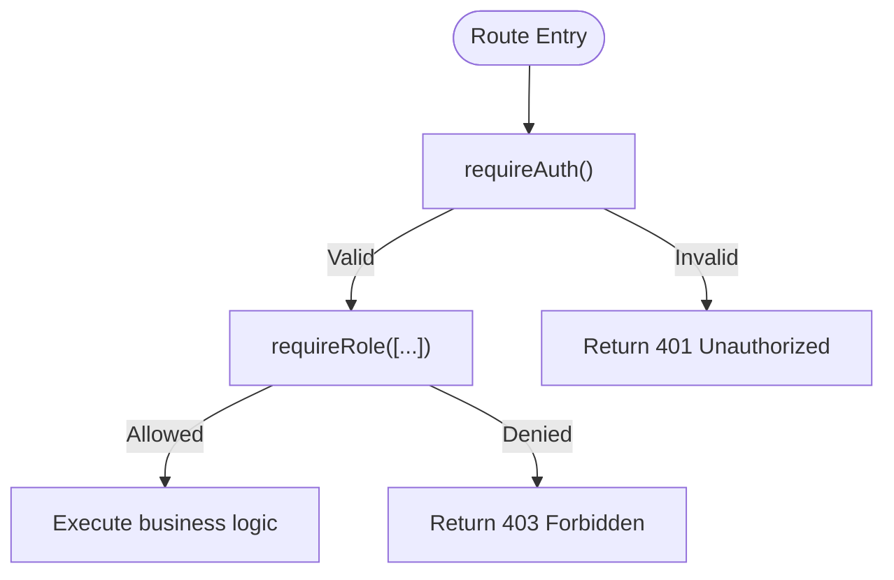
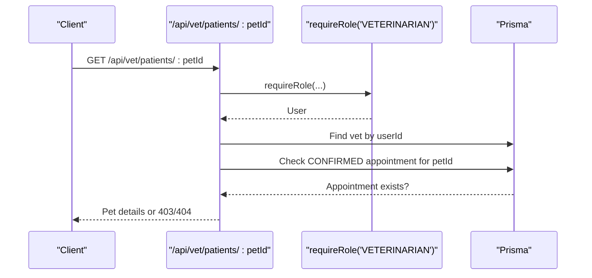
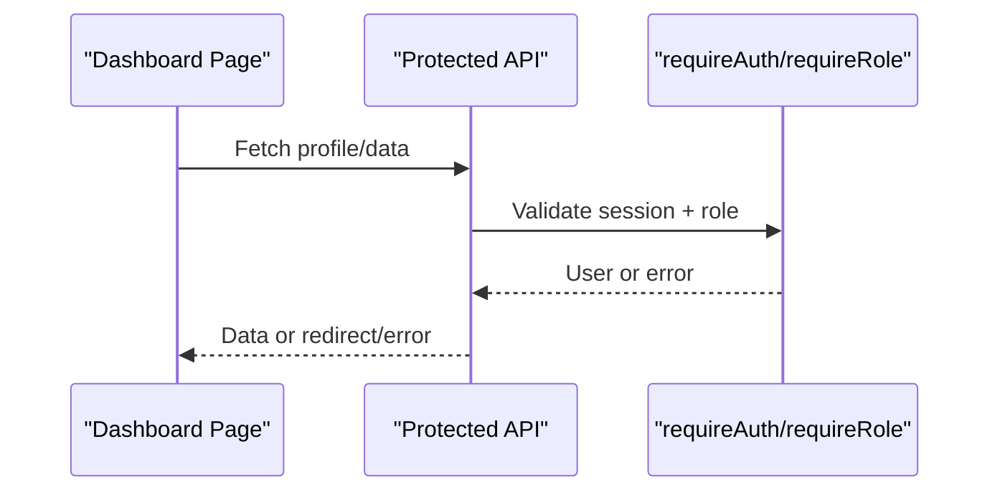
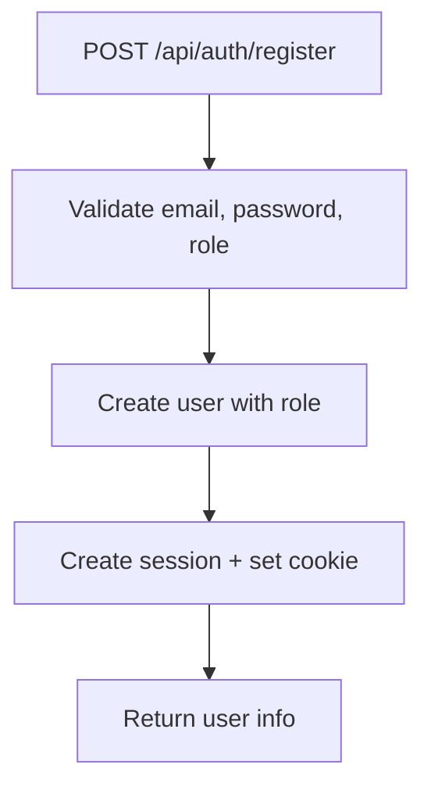
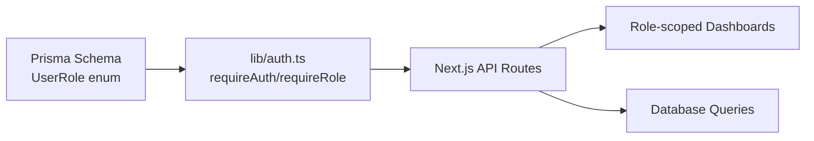

# Role-Based Access Control

<cite>
**Referenced Files in This Document**
- [schema.prisma](file://prisma/schema.prisma)
- [auth.ts](file://lib/auth.ts)
- [register/route.ts](file://app/api/auth/register/route.ts)
- [profile/route.ts](file://app/api/profile/route.ts)
- [vet/profile/route.ts](file://app/api/vet/profile/route.ts)
- [pets/route.ts](file://app/api/pets/route.ts)
- [pets/[petId]/route.ts](file://app/api/pets/[petId]/route.ts)
- [appointments/route.ts](file://app/api/appointments/route.ts)
- [clinic/profile/route.ts](file://app/api/clinic/profile/route.ts)
- [vet/patients/route.ts](file://app/api/vet/patients/route.ts)
- [vet/patients/[petId]/route.ts](file://app/api/vet/patients/[petId]/route.ts)
- [dashboard/page.tsx (Owner)](file://app/dashboard/page.tsx)
- [dashboard/page.tsx (Clinic Admin)](file://app/clinic/dashboard/page.tsx)
- [dashboard/page.tsx (Veterinarian)](file://app/vet/dashboard/page.tsx)
- [authentication-decision.md](file://docs/02-requirements/03-authentication-decision.md)
</cite>

## Table of Contents
1. Introduction
2. Project Structure
3. Core Components
4. Architecture Overview
5. Detailed Component Analysis
6. Dependency Analysis
7. Performance Considerations
8. Troubleshooting Guide
9. Conclusion
10. Appendices

## Introduction
This document explains PETIVA’s role-based access control (RBAC) system, covering the four supported roles, their permissions and responsibilities, authorization middleware, API route protection, dashboard protections, UI role-specific elements, role assignment during registration and profile updates, guidance for extending roles and permissions, and common RBAC patterns and anti-patterns within this codebase.

## Project Structure
PETIVA implements RBAC using:
- A Prisma schema that defines roles and core entities
- Server-side authentication and authorization helpers
- Next.js API routes that enforce role checks and resource ownership
- Role-scoped dashboards that gate features based on user role

**Diagram sources**
- [auth.ts:99-124](file://lib/auth.ts#L99-L124)
- [register/route.ts:6-78](file://app/api/auth/register/route.ts#L6-L78)
- [profile/route.ts:6-82](file://app/api/profile/route.ts#L6-L82)
- [vet/profile/route.ts:6-100](file://app/api/vet/profile/route.ts#L6-L100)
- [pets/route.ts:6-69](file://app/api/pets/route.ts#L6-L69)
- [appointments/route.ts:7-143](file://app/api/appointments/route.ts#L7-L143)
- [clinic/profile/route.ts:5-95](file://app/api/clinic/profile/route.ts#L5-L95)
- [vet/patients/route.ts:6-71](file://app/api/vet/patients/route.ts#L6-L71)

**Section sources**
- [schema.prisma:9-14](file://prisma/schema.prisma#L9-L14)
- [auth.ts:99-124](file://lib/auth.ts#L99-L124)
- [authentication-decision.md:94-118](file://docs/02-requirements/03-authentication-decision.md#L94-L118)

## Core Components
- Roles and data model: The UserRole enum defines PET_OWNER, VETERINARIAN, CLINIC_ADMIN, and PLATFORM_ADMIN. Users carry a role field and optional clinic association for admins.
- Authentication helpers: getCurrentUser reads session cookies, validates sessions, and returns the authenticated User. requireAuth enforces login; requireRole enforces role membership.
- Authorization patterns:
  - Role-based gating via requireRole at route entry points
  - Resource-level ownership checks (e.g., pet.ownerId)
  - Contextual consent checks (e.g., vet can access a pet only with a confirmed appointment)

**Section sources**
- [schema.prisma:9-14](file://prisma/schema.prisma#L9-L14)
- [schema.prisma:30-53](file://prisma/schema.prisma#L30-L53)
- [auth.ts:99-124](file://lib/auth.ts#L99-L124)

## Architecture Overview
The authorization pipeline separates authentication from authorization:
- Authentication resolves identity from a secure HttpOnly cookie, validates the session, and loads the User.
- Authorization uses requireRole for coarse-grained access and fine-grained checks (ownership, appointment consent) to protect resources.

**Diagram sources**
- [auth.ts:46-75](file://lib/auth.ts#L46-L75)
- [auth.ts:99-124](file://lib/auth.ts#L99-L124)
- [authentication-decision.md:94-118](file://docs/02-requirements/03-authentication-decision.md#L94-L118)

## Detailed Component Analysis

### Roles and Responsibilities
- Pet Owner
  - Owns pets and personal health records
  - Books appointments for owned pets
  - Views own appointments and AI assistant features
- Veterinarian
  - Manages assigned patients (pets with confirmed appointments)
  - Updates medical records and appointment status
  - Views clinic associations and schedules
- Clinic Admin
  - Manages clinic profile and associated veterinarians
  - Views clinic-wide appointments
- Platform Admin
  - Reserved for platform-level administration (user management, vet verification, moderation, audit logs)
  - Not enforced in current routes beyond role presence

**Section sources**
- [schema.prisma:9-14](file://prisma/schema.prisma#L9-L14)
- [01-project-blueprint.md:207-280](file://docs/01-product/01-project-blueprint.md#L207-L280)

### Permission Matrix
- Pets
  - Pet Owner: Create, Read, Update, Delete own pets
  - Veterinarian: Read only when authorized by confirmed appointment
  - Clinic Admin: No direct pet ownership; read via clinic context where applicable
  - Platform Admin: Not implemented in current routes
- Appointments
  - Pet Owner: Create requests for own pets; view own appointments
  - Veterinarian: View assigned appointments; update status (confirm/cancel)
  - Clinic Admin: View clinic-wide appointments
  - Platform Admin: Not implemented in current routes
- Medical Records
  - Veterinarian: Create/read for authorized patients
  - Pet Owner: Read own pet history via timeline endpoints
  - Clinic Admin: Read via clinic context where applicable
  - Platform Admin: Not implemented in current routes
- Clinic Data
  - Clinic Admin: Read/update clinic profile
  - Others: Restricted

**Section sources**
- [pets/route.ts:6-69](file://app/api/pets/route.ts#L6-L69)
- [pets/[petId]/route.ts:6-141](file://app/api/pets/[petId]/route.ts#L6-L141)
- [appointments/route.ts:7-143](file://app/api/appointments/route.ts#L7-L143)
- [vet/patients/route.ts:6-71](file://app/api/vet/patients/route.ts#L6-L71)
- [vet/patients/[petId]/route.ts:6-80](file://app/api/vet/patients/[petId]/route.ts#L6-L80)
- [clinic/profile/route.ts:5-95](file://app/api/clinic/profile/route.ts#L5-L95)

### Authorization Middleware Implementation
- Session validation: Hashes token, looks up session, checks expiration, and optionally extends session near expiry.
- requireAuth: Throws UNAUTHENTICATED if no valid session.
- requireRole: Throws FORBIDDEN if user role is not allowed.

**Diagram sources**
- [auth.ts:46-75](file://lib/auth.ts#L46-L75)
- [auth.ts:99-124](file://lib/auth.ts#L99-L124)

**Section sources**
- [auth.ts:46-75](file://lib/auth.ts#L46-L75)
- [auth.ts:99-124](file://lib/auth.ts#L99-L124)

### API Route Examples and Patterns
- Role checks at route boundaries
  - Veterinarian-only endpoints use requireRole('VETERINARIAN')
  - Clinic admin endpoints check role === 'CLINIC_ADMIN'
- Resource ownership checks
  - Pet endpoints verify pet.ownerId === user.id before allowing read/update/delete
- Consent-based access for vets
  - Vet patient endpoints require a CONFIRMED appointment between vet and pet

**Diagram sources**
- [vet/patients/[petId]/route.ts:6-80](file://app/api/vet/patients/[petId]/route.ts#L6-L80)
- [vet/patients/route.ts:6-71](file://app/api/vet/patients/route.ts#L6-L71)
- [auth.ts:117-124](file://lib/auth.ts#L117-L124)

**Section sources**
- [vet/patients/route.ts:6-71](file://app/api/vet/patients/route.ts#L6-L71)
- [vet/patients/[petId]/route.ts:6-80](file://app/api/vet/patients/[petId]/route.ts#L6-L80)
- [clinic/profile/route.ts:5-95](file://app/api/clinic/profile/route.ts#L5-L95)
- [pets/[petId]/route.ts:6-141](file://app/api/pets/[petId]/route.ts#L6-L141)

### Protecting Dashboard Pages
- Owner dashboard calls protected APIs (/api/profile, /api/pets, /api/appointments) and redirects on failure.
- Clinic admin dashboard gates access to clinic endpoints and shows clinic-specific navigation.
- Veterinarian dashboard gates access to vet endpoints and displays vet-only actions.

**Diagram sources**
- [dashboard/page.tsx (Owner):46-96](file://app/dashboard/page.tsx#L46-L96)
- [dashboard/page.tsx (Clinic Admin):38-82](file://app/clinic/dashboard/page.tsx#L38-L82)
- [dashboard/page.tsx (Veterinarian):43-84](file://app/vet/dashboard/page.tsx#L43-L84)

**Section sources**
- [dashboard/page.tsx (Owner):46-96](file://app/dashboard/page.tsx#L46-L96)
- [dashboard/page.tsx (Clinic Admin):38-82](file://app/clinic/dashboard/page.tsx#L38-L82)
- [dashboard/page.tsx (Veterinarian):43-84](file://app/vet/dashboard/page.tsx#L43-L84)

### Creating Role-Specific UI Elements
- Owner UI: Shows My Pets, Book Appointment, AI Assistant, Profile.
- Veterinarian UI: Shows Appointments, Patients, Health Records, Clinic, Profile.
- Clinic Admin UI: Shows Dashboard, Appointments, Veterinarians, Clinic Profile.

These are driven by fetching role-scoped endpoints and rendering conditional sections based on responses and role.

**Section sources**
- [dashboard/page.tsx (Owner):382-759](file://app/dashboard/page.tsx#L382-L759)
- [dashboard/page.tsx (Veterinarian):219-702](file://app/vet/dashboard/page.tsx#L219-L702)
- [dashboard/page.tsx (Clinic Admin):156-545](file://app/clinic/dashboard/page.tsx#L156-L545)

### Role Assignment During Registration and Profile Updates
- Registration accepts a role field validated against UserRole enum and creates the user with that role.
- Profile endpoints allow updating non-role fields (name, phone). Role changes are not exposed through these endpoints.

**Diagram sources**
- [register/route.ts:6-78](file://app/api/auth/register/route.ts#L6-L78)
- [schema.prisma:9-14](file://prisma/schema.prisma#L9-L14)

**Section sources**
- [register/route.ts:6-78](file://app/api/auth/register/route.ts#L6-L78)
- [profile/route.ts:6-82](file://app/api/profile/route.ts#L6-L82)
- [vet/profile/route.ts:6-100](file://app/api/vet/profile/route.ts#L6-L100)

### Adding New Roles and Custom Permissions
- Add a new value to the UserRole enum in the Prisma schema and run migrations.
- Extend requireRole usage in API routes to include the new role where appropriate.
- Introduce fine-grained permission checks (e.g., resource-level permissions) by adding helper functions that combine role checks with contextual rules (ownership, consent).
- Update dashboards to render role-specific features conditionally.

**Section sources**
- [schema.prisma:9-14](file://prisma/schema.prisma#L9-L14)
- [auth.ts:117-124](file://lib/auth.ts#L117-L124)

### Complex Authorization Logic Guidance
- Combine role checks with resource-level policies:
  - Ownership: Ensure user.id matches owner fields (e.g., pet.ownerId)
  - Consent: For vets, require a CONFIRMED appointment linking vet and pet
  - Scope: For clinic admins, scope queries by clinicId
- Centralize policy checks in reusable helpers to avoid duplication and ensure consistency across routes.

**Section sources**
- [pets/[petId]/route.ts:6-141](file://app/api/pets/[petId]/route.ts#L6-L141)
- [vet/patients/[petId]/route.ts:6-80](file://app/api/vet/patients/[petId]/route.ts#L6-L80)
- [appointments/route.ts:7-143](file://app/api/appointments/route.ts#L7-L143)

### Common RBAC Patterns and Anti-Patterns
Patterns
- Enforce authentication first, then authorization at each route boundary
- Use requireRole for coarse-grained checks and explicit ownership/consent checks for fine-grained control
- Scope queries by tenant/context (e.g., clinicId) for multi-tenant scenarios

Anti-patterns
- Relying solely on client-side role checks without server enforcement
- Exposing role mutation endpoints unintentionally
- Hardcoding role strings instead of using enums and centralized checks
- Skipping resource-level checks after role checks

**Section sources**
- [auth.ts:99-124](file://lib/auth.ts#L99-L124)
- [appointment creation flow:84-110](file://app/api/appointments/route.ts#L84-L110)
- [vet patient access flow:15-26](file://app/api/vet/patients/[petId]/route.ts#L15-L26)

## Dependency Analysis

**Diagram sources**
- [schema.prisma:9-14](file://prisma/schema.prisma#L9-L14)
- [auth.ts:99-124](file://lib/auth.ts#L99-L124)

**Section sources**
- [schema.prisma:9-14](file://prisma/schema.prisma#L9-L14)
- [auth.ts:99-124](file://lib/auth.ts#L99-L124)

## Performance Considerations
- Minimize N+1 queries by including related entities in Prisma queries where needed (already used in several routes).
- Cache frequently accessed, low-changability data (e.g., clinics) on the client side after initial load.
- Avoid excessive role checks inside tight loops; compute once per request.
- Use indexes already defined on key relations (e.g., ownerId, vetId, dateTime) to optimize query performance.

[No sources needed since this section provides general guidance]

## Troubleshooting Guide
- 401 Unauthorized: Indicates missing or invalid session. Verify cookie presence and session validity.
- 403 Forbidden: Indicates insufficient role or failed resource check (e.g., not pet owner, no confirmed appointment).
- 404 Not Found: Missing entity (e.g., vet profile not found, clinic not found).
- Input validation errors: Ensure required fields are present and correctly typed.

Common fixes
- Confirm the correct role is set during registration
- Ensure clinicId is set for clinic admins before accessing clinic endpoints
- Verify that vet-pet relationships have CONFIRMED appointments before vet access

**Section sources**
- [profile/route.ts:22-33](file://app/api/profile/route.ts#L22-L33)
- [vet/profile/route.ts:36-47](file://app/api/vet/profile/route.ts#L36-L47)
- [clinic/profile/route.ts:35-46](file://app/api/clinic/profile/route.ts#L35-L46)
- [vet/patients/[petId]/route.ts:58-73](file://app/api/vet/patients/[petId]/route.ts#L58-L73)

## Conclusion
PETIVA’s RBAC combines clear role definitions, robust session-based authentication, and layered authorization checks (role-based plus resource-level) to protect sensitive operations. The existing implementation covers core workflows for owners, veterinarians, and clinic admins, with a foundation ready for platform admin capabilities and future role expansion.

[No sources needed since this section summarizes without analyzing specific files]

## Appendices

### Appendix A: Role-to-Endpoint Mapping Summary
- Pet Owner
  - POST /api/auth/register (create account)
  - GET/PUT /api/profile
  - GET/POST /api/pets
  - GET/PUT/DELETE /api/pets/:id
  - GET/POST /api/appointments
- Veterinarian
  - GET/PUT /api/vet/profile
  - GET /api/vet/patients
  - GET /api/vet/patients/:id
  - GET/PUT /api/appointments
- Clinic Admin
  - GET/PUT /api/clinic/profile
  - GET /api/appointments (clinic-scoped)
- Platform Admin
  - Not enforced in current routes; reserved for future administrative features

**Section sources**
- [register/route.ts:6-78](file://app/api/auth/register/route.ts#L6-L78)
- [profile/route.ts:6-82](file://app/api/profile/route.ts#L6-L82)
- [vet/profile/route.ts:6-100](file://app/api/vet/profile/route.ts#L6-L100)
- [pets/route.ts:6-69](file://app/api/pets/route.ts#L6-L69)
- [pets/[petId]/route.ts:6-141](file://app/api/pets/[petId]/route.ts#L6-L141)
- [appointments/route.ts:7-143](file://app/api/appointments/route.ts#L7-L143)
- [clinic/profile/route.ts:5-95](file://app/api/clinic/profile/route.ts#L5-L95)
- [vet/patients/route.ts:6-71](file://app/api/vet/patients/route.ts#L6-L71)
- [vet/patients/[petId]/route.ts:6-80](file://app/api/vet/patients/[petId]/route.ts#L6-L80)