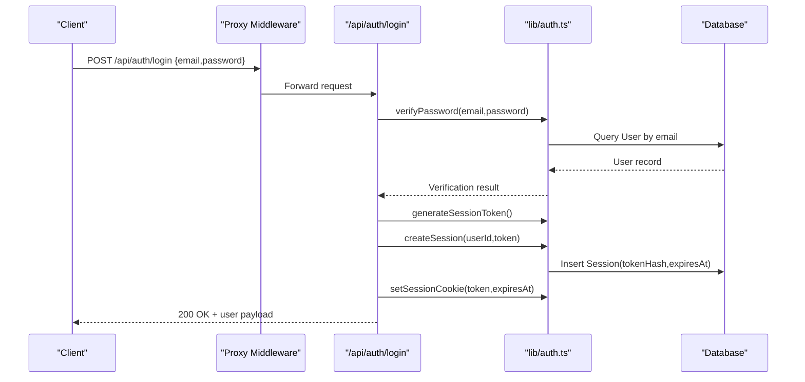
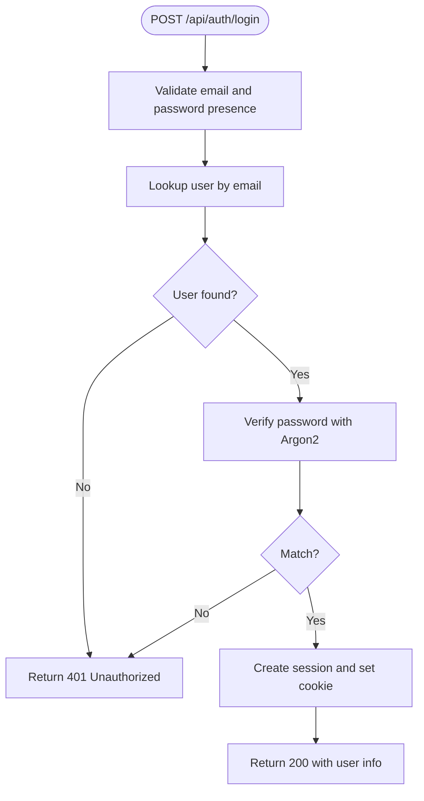
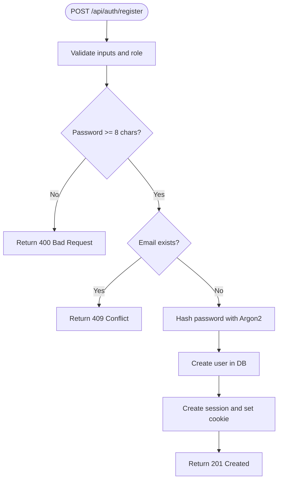
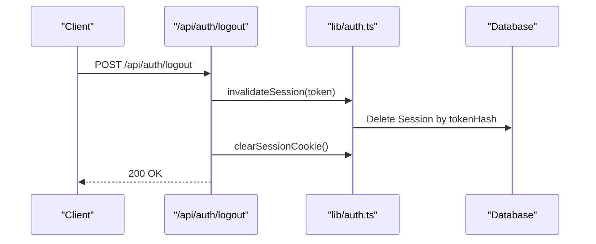
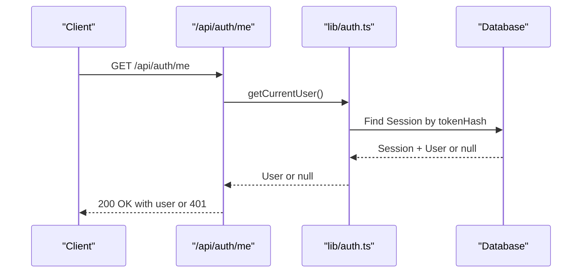
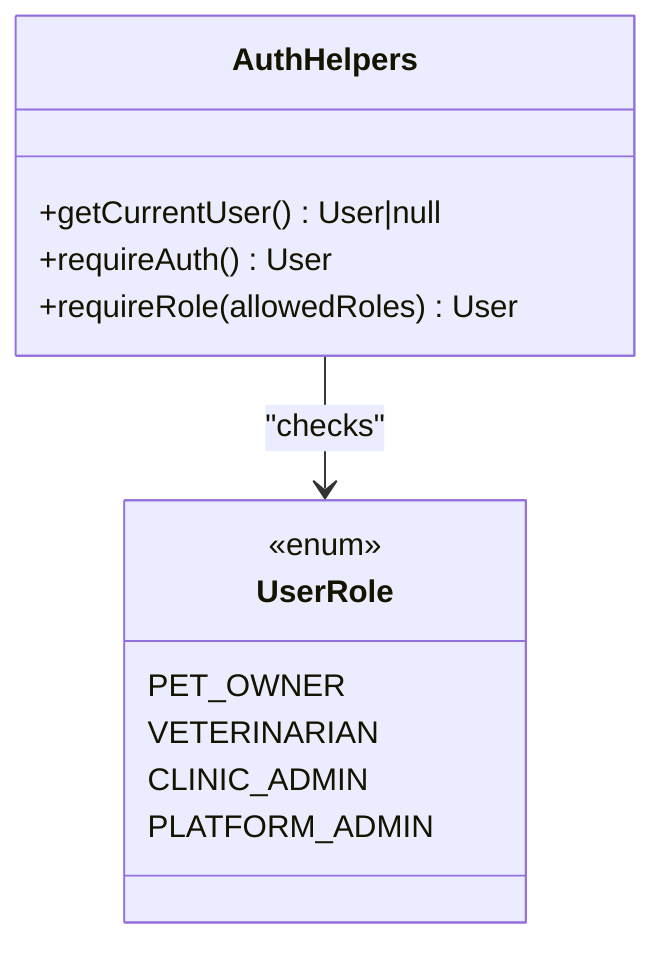
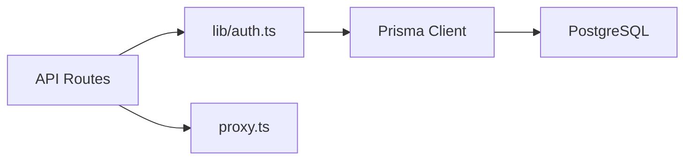

# Security Considerations

<cite>
**Referenced Files in This Document**
- [auth.ts](file://lib/auth.ts)
- [login route.ts](file://app/api/auth/login/route.ts)
- [register route.ts](file://app/api/auth/register/route.ts)
- [logout route.ts](file://app/api/auth/logout/route.ts)
- [me route.ts](file://app/api/auth/me/route.ts)
- [schema.prisma](file://prisma/schema.prisma)
- [db.ts](file://lib/db.ts)
- [security.md](file://docs/03-architecture/06-security.md)
- [authentication-decision.md](file://docs/02-requirements/03-authentication-decision.md)
- [proxy.ts](file://proxy.ts)
- [next.config.ts](file://next.config.ts)
</cite>

## Table of Contents
1. Introduction
2. Project Structure
3. Core Components
4. Architecture Overview
5. Detailed Component Analysis
6. Dependency Analysis
7. Performance Considerations
8. Troubleshooting Guide
9. Conclusion
10. Appendices

## Introduction
This document provides comprehensive security guidance for PETIVA’s authentication and authorization system. It covers password hashing with Argon2, secure cookie configuration, session management, input validation, protection against common vulnerabilities (SQL injection, XSS, CSRF, brute force), rate limiting considerations, secure development practices, compliance considerations for sensitive pet health data, incident response procedures, and monitoring strategies.

## Project Structure
The authentication and authorization logic is implemented across server-side API routes and shared utilities:
- Shared auth utilities handle password hashing, token generation/validation, session storage, and cookie management.
- API routes implement login, registration, logout, and current user retrieval.
- The Prisma schema defines the User, Session, and related models used by the auth flow.
- A proxy middleware enforces basic path-based access control at the routing edge.
- Architecture documentation outlines RBAC, consent-based access, and high-level security posture.

```mermaid
graph TB
Client["Client Browser"] --> Proxy["Next.js Proxy Middleware"]
Proxy --> LoginAPI["/api/auth/login"]
Proxy --> RegisterAPI["/api/auth/register"]
Proxy --> LogoutAPI["/api/auth/logout"]
Proxy --> MeAPI["/api/auth/me"]
LoginAPI --> AuthLib["lib/auth.ts"]
RegisterAPI --> AuthLib
LogoutAPI --> AuthLib
MeAPI --> AuthLib
AuthLib --> DB["Prisma Client (PostgreSQL)"]
DB --> Schema["Schema Models: User, Session"]
```

**Diagram sources**
- [proxy.ts:9-23](file://proxy.ts#L9-L23)
- [login route.ts:5-48](file://app/api/auth/login/route.ts#L5-L48)
- [register route.ts:6-68](file://app/api/auth/register/route.ts#L6-L68)
- [logout route.ts:5-16](file://app/api/auth/logout/route.ts#L5-L16)
- [me route.ts:4-23](file://app/api/auth/me/route.ts#L4-L23)
- [auth.ts:10-97](file://lib/auth.ts#L10-L97)
- [schema.prisma:30-66](file://prisma/schema.prisma#L30-L66)

**Section sources**
- [proxy.ts:9-23](file://proxy.ts#L9-L23)
- [auth.ts:10-97](file://lib/auth.ts#L10-L97)
- [schema.prisma:30-66](file://prisma/schema.prisma#L30-L66)

## Core Components
- Password hashing and verification using Argon2id to protect stored credentials.
- Secure session tokens generated cryptographically and hashed before storage.
- Database-backed sessions with expiration and sliding window extension.
- HTTP-only, SameSite=Lax cookies set conditionally secure in production.
- Role-based access control helpers to enforce authorization boundaries.

Key implementation references:
- Password hashing and verification: [hashPassword, verifyPassword:11-21](file://lib/auth.ts#L11-L21)
- Token generation and hashing: [generateSessionToken, hashSessionToken:24-30](file://lib/auth.ts#L24-L30)
- Session lifecycle: [createSession, validateSession, invalidateSession:33-80](file://lib/auth.ts#L33-L80)
- Cookie handling: [setSessionCookie, clearSessionCookie:83-97](file://lib/auth.ts#L83-L97)
- Authorization helpers: [getCurrentUser, requireAuth, requireRole:100-124](file://lib/auth.ts#L100-L124)

**Section sources**
- [auth.ts:11-124](file://lib/auth.ts#L11-L124)
- [schema.prisma:30-66](file://prisma/schema.prisma#L30-L66)

## Architecture Overview
PETIVA uses session-based authentication with secure cookies and database-backed sessions. Requests are intercepted by a proxy that protects certain paths. Protected API endpoints rely on shared auth utilities to validate sessions and enforce roles.

**Diagram sources**
- [proxy.ts:9-23](file://proxy.ts#L9-L23)
- [login route.ts:5-48](file://app/api/auth/login/route.ts#L5-L48)
- [auth.ts:24-97](file://lib/auth.ts#L24-L97)
- [schema.prisma:30-66](file://prisma/schema.prisma#L30-L66)

**Section sources**
- [proxy.ts:9-23](file://proxy.ts#L9-L23)
- [login route.ts:5-48](file://app/api/auth/login/route.ts#L5-L48)
- [auth.ts:24-97](file://lib/auth.ts#L24-L97)

## Detailed Component Analysis

### Authentication Flow (Login)
- Input validation ensures required fields are present.
- User lookup by email; generic error messages avoid user enumeration.
- Password verification via Argon2.
- On success, a secure session is created and a cookie is set.

**Diagram sources**
- [login route.ts:5-48](file://app/api/auth/login/route.ts#L5-L48)
- [auth.ts:11-21](file://lib/auth.ts#L11-L21)
- [auth.ts:24-97](file://lib/auth.ts#L24-L97)

**Section sources**
- [login route.ts:5-48](file://app/api/auth/login/route.ts#L5-L48)
- [auth.ts:11-21](file://lib/auth.ts#L11-L21)

### Registration Flow
- Validates required fields and role enum.
- Enforces minimum password length.
- Prevents duplicate emails.
- Hashes password with Argon2 and creates user.
- Establishes a session and sets a secure cookie.

**Diagram sources**
- [register route.ts:6-68](file://app/api/auth/register/route.ts#L6-L68)
- [auth.ts:11-21](file://lib/auth.ts#L11-L21)
- [auth.ts:24-97](file://lib/auth.ts#L24-L97)

**Section sources**
- [register route.ts:6-68](file://app/api/auth/register/route.ts#L6-L68)

### Logout Flow
- Invalidates the active session in the database.
- Clears the session cookie from the client.

**Diagram sources**
- [logout route.ts:5-16](file://app/api/auth/logout/route.ts#L5-L16)
- [auth.ts:77-97](file://lib/auth.ts#L77-L97)

**Section sources**
- [logout route.ts:5-16](file://app/api/auth/logout/route.ts#L5-L16)
- [auth.ts:77-97](file://lib/auth.ts#L77-L97)

### Current User Endpoint
- Reads the session cookie and validates it.
- Returns minimal user profile if authenticated; otherwise returns 401.

**Diagram sources**
- [me route.ts:4-23](file://app/api/auth/me/route.ts#L4-L23)
- [auth.ts:100-107](file://lib/auth.ts#L100-L107)

**Section sources**
- [me route.ts:4-23](file://app/api/auth/me/route.ts#L4-L23)
- [auth.ts:100-107](file://lib/auth.ts#L100-L107)

### Authorization and RBAC
- Role-based access control is enforced via helper functions that assert authentication and role membership.
- Architecture design includes consent-based access for veterinarians tied to confirmed appointments.

**Diagram sources**
- [auth.ts:100-124](file://lib/auth.ts#L100-L124)
- [schema.prisma:9-14](file://prisma/schema.prisma#L9-L14)

**Section sources**
- [auth.ts:100-124](file://lib/auth.ts#L100-L124)
- [schema.prisma:9-14](file://prisma/schema.prisma#L9-L14)

## Dependency Analysis
- API routes depend on shared auth utilities for cryptographic operations and session management.
- Auth utilities depend on Prisma client configured via environment variables for database connectivity.
- Proxy middleware intercepts protected paths and enforces basic authentication checks at the routing layer.

**Diagram sources**
- [login route.ts:1-48](file://app/api/auth/login/route.ts#L1-L48)
- [register route.ts:1-68](file://app/api/auth/register/route.ts#L1-L68)
- [logout route.ts:1-16](file://app/api/auth/logout/route.ts#L1-L16)
- [me route.ts:1-23](file://app/api/auth/me/route.ts#L1-L23)
- [auth.ts:1-124](file://lib/auth.ts#L1-L124)
- [db.ts:1-33](file://lib/db.ts#L1-L33)
- [proxy.ts:9-23](file://proxy.ts#L9-L23)

**Section sources**
- [db.ts:1-33](file://lib/db.ts#L1-L33)
- [proxy.ts:9-23](file://proxy.ts#L9-L23)
- [auth.ts:1-124](file://lib/auth.ts#L1-L124)

## Performance Considerations
- Session validation performs indexed lookups by tokenHash; ensure indexes exist to maintain sub-millisecond query times under load.
- Sliding window expiration extends sessions near expiry, reducing re-authentication frequency while maintaining security bounds.
- Avoid excessive logging of sensitive payloads; log only necessary metadata for performance and privacy.

[No sources needed since this section provides general guidance]

## Troubleshooting Guide
Common issues and mitigations:
- Missing or invalid inputs: Ensure required fields are validated early in each route to return appropriate 4xx errors.
- Authentication failures: Generic error messages prevent user enumeration; verify logs for internal errors without exposing details.
- Session not found or expired: Validate session existence and expiration; clean up expired sessions proactively.
- Cookie misconfiguration: Confirm httpOnly, secure, sameSite, and expires attributes are set correctly per environment.

Operational references:
- Input validation and error responses: [login route:5-31](file://app/api/auth/login/route.ts#L5-L31), [register route:6-30](file://app/api/auth/register/route.ts#L6-L30)
- Session cleanup and expiration handling: [validateSession:46-75](file://lib/auth.ts#L46-L75)
- Cookie clearing on logout: [logout route:5-16](file://app/api/auth/logout/route.ts#L5-L16)

**Section sources**
- [login route.ts:5-31](file://app/api/auth/login/route.ts#L5-L31)
- [register route.ts:6-30](file://app/api/auth/register/route.ts#L6-L30)
- [auth.ts:46-75](file://lib/auth.ts#L46-L75)
- [logout route.ts:5-16](file://app/api/auth/logout/route.ts#L5-L16)

## Conclusion
PETIVA’s authentication and authorization system implements strong security controls including Argon2 password hashing, secure session cookies, database-backed sessions with expiration, and role-based access control. While additional protections such as explicit HTTPS enforcement, comprehensive input sanitization, CSRF mitigation, and rate limiting are recommended, the current foundation provides a solid base for securing sensitive pet health data.

[No sources needed since this section summarizes without analyzing specific files]

## Appendices

### Security Measures and Vulnerability Protections
- Password hashing: Use Argon2id for all password hashing and verification.
  - Reference: [hashPassword, verifyPassword:11-21](file://lib/auth.ts#L11-L21)
- Secure cookies: Set httpOnly, secure (in production), sameSite=Lax, and appropriate expiration.
  - Reference: [setSessionCookie:83-92](file://lib/auth.ts#L83-L92)
- HTTPS enforcement: Configure your deployment platform to enforce HTTPS and redirect HTTP to HTTPS.
  - Note: Not currently defined in Next config; add at reverse proxy or hosting layer.
- Input validation: Validate and sanitize all inputs at API boundaries; reject invalid roles and enforce password policies.
  - Reference: [register route validation:6-30](file://app/api/auth/register/route.ts#L6-L30)
- SQL injection prevention: Use parameterized queries via Prisma; avoid string concatenation in SQL.
  - Reference: [Prisma usage in routes:16-18](file://app/api/auth/login/route.ts#L16-L18)
- XSS mitigation: Render user-provided content safely on the frontend; avoid unsafe HTML injection.
- CSRF protection: Use SameSite cookies and consider anti-CSRF tokens for state-changing requests.
  - Reference: [sameSite setting](file://lib/auth.ts#L88)
- Brute force protection: Implement rate limiting on login and registration endpoints.
  - Recommendation: Add IP-based or account-based throttling at the API layer.

**Section sources**
- [auth.ts:11-21](file://lib/auth.ts#L11-L21)
- [auth.ts:83-92](file://lib/auth.ts#L83-L92)
- [register route.ts:6-30](file://app/api/auth/register/route.ts#L6-L30)
- [login route.ts:16-18](file://app/api/auth/login/route.ts#L16-L18)

### Session Security Details
- Session storage: Plaintext token in HttpOnly cookie; hashed token stored in database.
  - Reference: [token generation and hashing:24-30](file://lib/auth.ts#L24-L30)
- Expiration and sliding window: Sessions expire after a fixed duration and extend when nearing expiry.
  - Reference: [validateSession:46-75](file://lib/auth.ts#L46-L75)
- Session fixation prevention: Generate new tokens on login and invalidate old sessions on logout.
  - Reference: [createSession, invalidateSession:33-80](file://lib/auth.ts#L33-L80)

**Section sources**
- [auth.ts:24-80](file://lib/auth.ts#L24-L80)

### Rate Limiting Guidelines
- Implement sliding-window rate limiting for login and registration endpoints to mitigate credential stuffing and brute force attacks.
- Apply similar limits to other sensitive endpoints (e.g., password reset, multi-factor enrollment).
- Track attempts per IP and per account; enforce progressive delays and temporary blocks.

[No sources needed since this section provides general guidance]

### Security Headers and Sanitization
- Security headers: Configure Content-Security-Policy, X-Content-Type-Options, Referrer-Policy, Strict-Transport-Security at the reverse proxy or framework level.
- Input sanitization: Strip or escape dangerous characters; validate types and lengths; reject unexpected values.
- Output encoding: Encode data rendered in UI to prevent XSS.

[No sources needed since this section provides general guidance]

### Compliance Considerations for Sensitive Pet Health Data
- Data minimization: Only collect and process necessary health data; avoid storing unnecessary PII.
- Access controls: Enforce RBAC and consent-based access for veterinary records.
  - Reference: [RBAC and consent design:16-48](file://docs/03-architecture/06-security.md#L16-L48)
- Audit logging: Record sensitive actions (access, modifications) with timestamps and actor IDs.
  - Reference: [AuditLog model:298-311](file://prisma/schema.prisma#L298-L311)
- Secrets management: Store secrets in environment variables; never commit credentials to code.
  - Reference: [Architecture note on secrets:60-63](file://docs/03-architecture/06-security.md#L60-L63)

**Section sources**
- [security.md:16-48](file://docs/03-architecture/06-security.md#L16-L48)
- [schema.prisma:298-311](file://prisma/schema.prisma#L298-L311)
- [security.md:60-63](file://docs/03-architecture/06-security.md#L60-L63)

### Incident Response and Monitoring
- Incident response: Define procedures for detecting, containing, eradicating, and recovering from security incidents; notify affected users as required.
- Monitoring: Log failed login attempts, access denials, and suspicious activities; alert on anomalies.
  - Reference: [Audit logging events:81-89](file://docs/03-architecture/06-security.md#L81-L89)
- Forensics: Preserve logs and artifacts; analyze timelines to understand scope and impact.

**Section sources**
- [security.md:81-89](file://docs/03-architecture/06-security.md#L81-L89)

### Development Practices and Testing
- Secure development: Follow least privilege, validate all inputs, use secure defaults, and review dependencies regularly.
- Security testing: Perform static analysis, dependency scanning, and penetration testing; include unit tests for auth flows.
- Vulnerability assessment: Regularly assess endpoints for injection, XSS, CSRF, and broken access control.

[No sources needed since this section provides general guidance]

### Environment and Configuration Notes
- Database connection: Configured via environment variables; connection pooling differs between dev and prod.
  - Reference: [db.ts:1-33](file://lib/db.ts#L1-L33)
- Next.js configuration: Currently minimal; add security-related settings as needed.
  - Reference: [next.config.ts:1-8](file://next.config.ts#L1-L8)

**Section sources**
- [db.ts:1-33](file://lib/db.ts#L1-L33)
- [next.config.ts:1-8](file://next.config.ts#L1-L8)