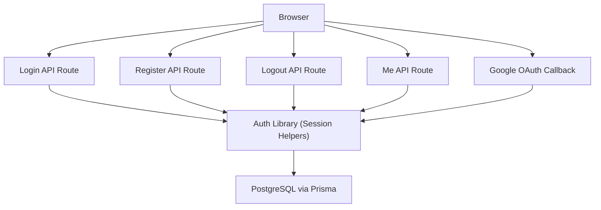
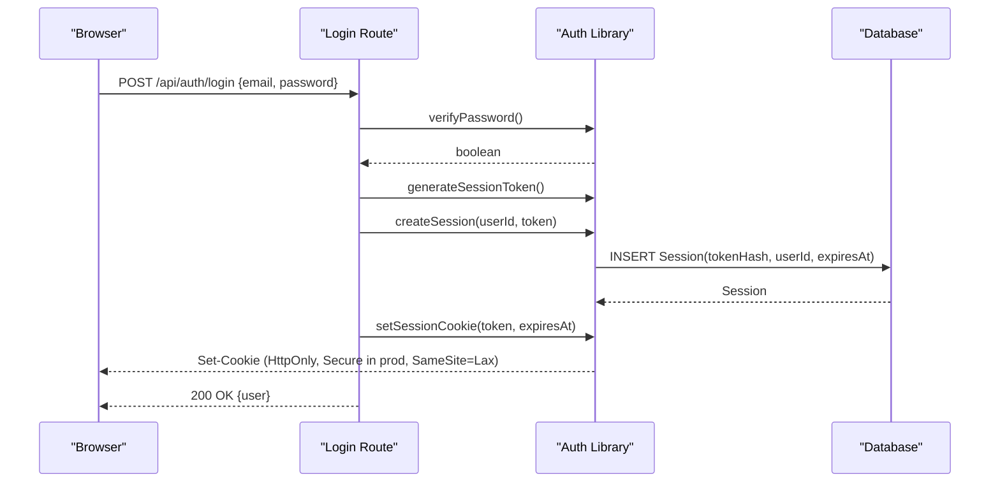
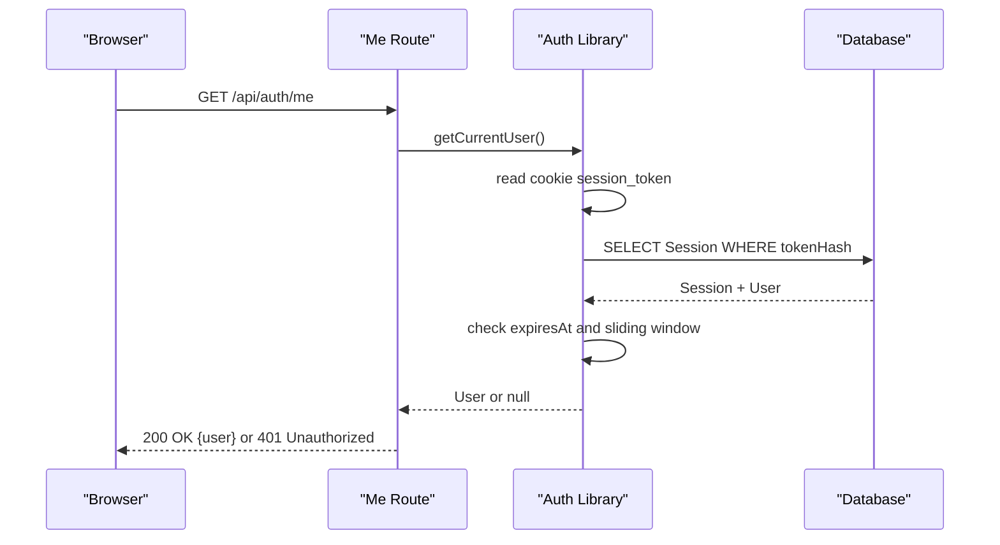
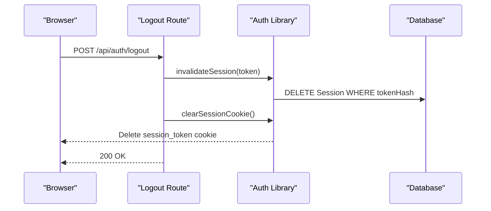
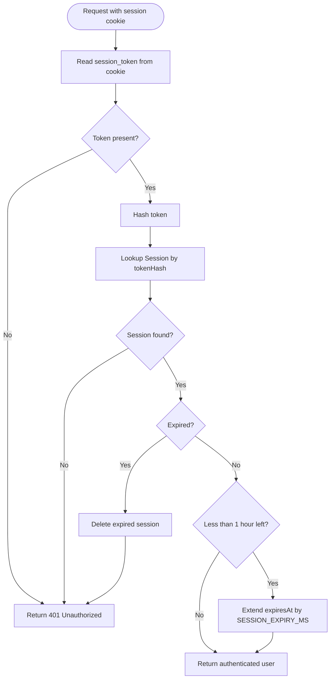
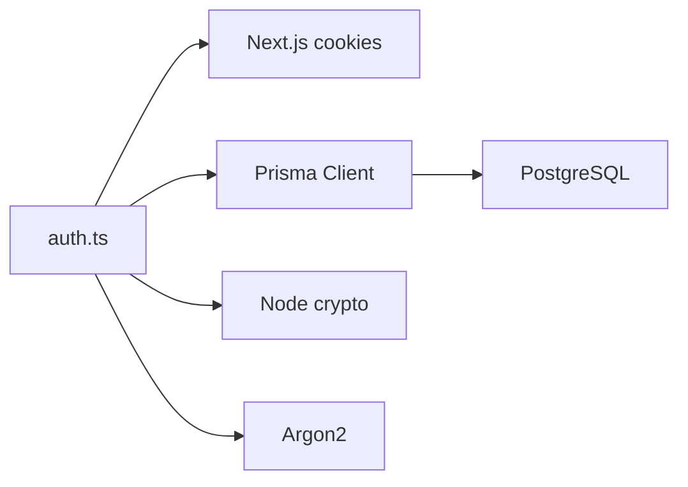

# Session Management

<cite>
**Referenced Files in This Document**
- [auth.ts](file://lib/auth.ts)
- [login route.ts](file://app/api/auth/login/route.ts)
- [logout route.ts](file://app/api/auth/logout/route.ts)
- [me route.ts](file://app/api/auth/me/route.ts)
- [register route.ts](file://app/api/auth/register/route.ts)
- [google callback route.ts](file://app/api/auth/google/callback/route.ts)
- [google config route.ts](file://app/api/auth/google/config/route.ts)
- [schema.prisma](file://prisma/schema.prisma)
- [db.ts](file://lib/db.ts)
</cite>

## Table of Contents
1. [Introduction](#introduction)
2. [Project Structure](#project-structure)
3. [Core Components](#core-components)
4. [Architecture Overview](#architecture-overview)
5. [Detailed Component Analysis](#detailed-component-analysis)
6. [Dependency Analysis](#dependency-analysis)
7. [Performance Considerations](#performance-considerations)
8. [Troubleshooting Guide](#troubleshooting-guide)
9. [Conclusion](#conclusion)
10. [Appendices](#appendices)

## Introduction
This document explains PETIVA’s session management system. It covers secure cookie-based sessions, cryptographic token generation, database-backed session storage, automatic expiration with sliding-window extension, and the full lifecycle from login to logout or timeout. It also documents how server-side helpers validate sessions on each request, the security properties of cookies, and guidance for production deployments.

## Project Structure
The session system is implemented across a small set of focused files:
- Authentication utilities and session helpers live in a single library module.
- API routes handle login, registration, logout, and current user retrieval.
- Google OAuth integration creates sessions after successful identity verification.
- The database schema defines the Session model used to persist sessions.
- Database configuration provides a Prisma client instance used by all modules.

**Diagram sources**
- [login route.ts:5-58](file://app/api/auth/login/route.ts#L5-L58)
- [register route.ts:6-78](file://app/api/auth/register/route.ts#L6-L78)
- [logout route.ts:5-25](file://app/api/auth/logout/route.ts#L5-L25)
- [me route.ts:4-33](file://app/api/auth/me/route.ts#L4-L33)
- [google callback route.ts:6-98](file://app/api/auth/google/callback/route.ts#L6-L98)
- [auth.ts:23-124](file://lib/auth.ts#L23-L124)
- [db.ts:1-33](file://lib/db.ts#L1-L33)

**Section sources**
- [auth.ts:1-124](file://lib/auth.ts#L1-L124)
- [login route.ts:1-58](file://app/api/auth/login/route.ts#L1-L58)
- [register route.ts:1-78](file://app/api/auth/register/route.ts#L1-L78)
- [logout route.ts:1-25](file://app/api/auth/logout/route.ts#L1-L25)
- [me route.ts:1-33](file://app/api/auth/me/route.ts#L1-L33)
- [google callback route.ts:1-98](file://app/api/auth/google/callback/route.ts#L1-L98)
- [schema.prisma:30-66](file://prisma/schema.prisma#L30-L66)
- [db.ts:1-33](file://lib/db.ts#L1-L33)

## Core Components
- Token generation and hashing: cryptographically secure random tokens are generated server-side and hashed before storage.
- Session persistence: sessions are stored in PostgreSQL with hashed tokens, user association, and expiration timestamps.
- Cookie handling: secure, HTTP-only cookies with SameSite policy and environment-aware Secure flag.
- Validation helpers: functions to retrieve the current user from the cookie and enforce authentication/authorization.
- API endpoints: login, register, logout, and me endpoints orchestrate session creation, validation, and destruction.

Key implementation references:
- Token generation and hashing: [generateSessionToken:24-26](file://lib/auth.ts#L24-L26), [hashSessionToken:28-30](file://lib/auth.ts#L28-L30)
- Session CRUD: [createSession:33-44](file://lib/auth.ts#L33-L44), [validateSession:46-75](file://lib/auth.ts#L46-L75), [invalidateSession:77-80](file://lib/auth.ts#L77-L80)
- Cookie helpers: [setSessionCookie:83-92](file://lib/auth.ts#L83-L92), [clearSessionCookie:94-97](file://lib/auth.ts#L94-L97)
- Auth helpers: [getCurrentUser:100-107](file://lib/auth.ts#L100-L107), [requireAuth:109-115](file://lib/auth.ts#L109-L115), [requireRole:117-124](file://lib/auth.ts#L117-L124)

**Section sources**
- [auth.ts:23-124](file://lib/auth.ts#L23-L124)

## Architecture Overview
The session architecture follows a stateless client with server-side authoritative validation:
- On login or registration, a secure token is created and stored as an HTTP-only cookie. A corresponding session record is persisted in the database with a hashed token and expiration time.
- On protected requests, the server reads the cookie, validates the session against the database, and returns the authenticated user context.
- On logout, the session is invalidated and the cookie is cleared.
- Sliding-window expiration extends active sessions when they approach expiry.

**Diagram sources**
- [login route.ts:5-58](file://app/api/auth/login/route.ts#L5-L58)
- [auth.ts:23-92](file://lib/auth.ts#L23-L92)
- [schema.prisma:55-66](file://prisma/schema.prisma#L55-L66)

**Diagram sources**
- [me route.ts:4-33](file://app/api/auth/me/route.ts#L4-L33)
- [auth.ts:100-107](file://lib/auth.ts#L100-L107)
- [auth.ts:46-75](file://lib/auth.ts#L46-L75)

**Diagram sources**
- [logout route.ts:5-25](file://app/api/auth/logout/route.ts#L5-L25)
- [auth.ts:77-97](file://lib/auth.ts#L77-L97)

## Detailed Component Analysis

### Session Token Generation and Storage
- Tokens are generated using a cryptographically secure random source and converted to a hex string.
- Only the hash of the token is stored in the database; the plaintext token remains only in the client cookie.
- The Session model includes unique indexing on the token hash and an index on expiresAt for efficient lookups and cleanup.

References:
- Token generation: [generateSessionToken:24-26](file://lib/auth.ts#L24-L26)
- Token hashing: [hashSessionToken:28-30](file://lib/auth.ts#L28-L30)
- Session model: [Session:55-66](file://prisma/schema.prisma#L55-L66)

**Section sources**
- [auth.ts:23-30](file://lib/auth.ts#L23-L30)
- [schema.prisma:55-66](file://prisma/schema.prisma#L55-L66)

### Session Lifecycle
- Creation:
  - Login: verifies credentials, generates token, persists session, sets cookie.
  - Registration: hashes password, creates user, generates token, persists session, sets cookie.
  - Google OAuth: verifies external credential, finds or creates user, generates token, persists session, sets cookie.
- Validation:
  - Each protected request reads the cookie, hashes the token, and queries the database for a matching session.
  - Expired sessions are deleted automatically during validation.
  - Sliding-window extension refreshes the expiration if less than one hour remains.
- Destruction:
  - Logout invalidates the session in the database and clears the cookie.

References:
- Login flow: [POST /api/auth/login:5-58](file://app/api/auth/login/route.ts#L5-L58)
- Registration flow: [POST /api/auth/register:6-78](file://app/api/auth/register/route.ts#L6-L78)
- Google OAuth flow: [POST /api/auth/google/callback:6-98](file://app/api/auth/google/callback/route.ts#L6-L98)
- Validation and expiration: [validateSession:46-75](file://lib/auth.ts#L46-L75)
- Logout flow: [POST /api/auth/logout:5-25](file://app/api/auth/logout/route.ts#L5-L25)

**Diagram sources**
- [auth.ts:46-75](file://lib/auth.ts#L46-L75)

**Section sources**
- [login route.ts:5-58](file://app/api/auth/login/route.ts#L5-L58)
- [register route.ts:6-78](file://app/api/auth/register/route.ts#L6-L78)
- [google callback route.ts:6-98](file://app/api/auth/google/callback/route.ts#L6-L98)
- [auth.ts:46-75](file://lib/auth.ts#L46-L75)
- [logout route.ts:5-25](file://app/api/auth/logout/route.ts#L5-L25)

### Session Security Measures
- HTTP-only cookies prevent client-side script access to the session token.
- Secure flag is enabled in production to ensure cookies are only sent over HTTPS.
- SameSite=Lax mitigates CSRF risks for cross-site requests while allowing top-level navigations.
- Token hashing ensures that even if the database is compromised, attackers cannot directly reuse session tokens.
- Passwords are hashed using a strong algorithm before storage.

References:
- Cookie flags: [setSessionCookie:83-92](file://lib/auth.ts#L83-L92)
- Password hashing: [hashPassword:11-13](file://lib/auth.ts#L11-L13)
- Token hashing: [hashSessionToken:28-30](file://lib/auth.ts#L28-L30)

**Section sources**
- [auth.ts:11-13](file://lib/auth.ts#L11-L13)
- [auth.ts:28-30](file://lib/auth.ts#L28-L30)
- [auth.ts:83-92](file://lib/auth.ts#L83-L92)

### Session Persistence Across Page Reloads and Browser Closures
- The session cookie includes an explicit expiration timestamp derived from the stored session’s expiresAt.
- As long as the browser retains the cookie until its expiration, page reloads and temporary closures preserve the session.
- If the browser is closed before expiration, the cookie may be retained depending on browser behavior and cookie settings; otherwise, it will be removed at close.
- Device changes do not share cookies; a new device requires re-authentication.

References:
- Expiration setting: [setSessionCookie:83-92](file://lib/auth.ts#L83-L92)
- Session expiration model: [Session.expiresAt:55-66](file://prisma/schema.prisma#L55-L66)

**Section sources**
- [auth.ts:83-92](file://lib/auth.ts#L83-L92)
- [schema.prisma:55-66](file://prisma/schema.prisma#L55-L66)

### Checking Session Validity and Enforcing Access
- Server-side helper functions provide consistent checks:
  - Retrieve current user from cookie: [getCurrentUser:100-107](file://lib/auth.ts#L100-L107)
  - Require authentication: [requireAuth:109-115](file://lib/auth.ts#L109-L115)
  - Require specific roles: [requireRole:117-124](file://lib/auth.ts#L117-L124)
- Protected endpoints can call these helpers to enforce authorization.

Example usage patterns:
- Reading current user: [GET /api/auth/me:4-33](file://app/api/auth/me/route.ts#L4-L33)
- Role-gated logic: use [requireRole:117-124](file://lib/auth.ts#L117-L124) in any route handler.

**Section sources**
- [auth.ts:100-124](file://lib/auth.ts#L100-L124)
- [me route.ts:4-33](file://app/api/auth/me/route.ts#L4-L33)

### Extending Session Lifetimes
- Sessions automatically extend when validated within the last hour of their lifetime (sliding window).
- To explicitly extend a session, trigger a protected request that calls validation; this refreshes the expiration timestamp.

References:
- Sliding window extension: [validateSession:65-72](file://lib/auth.ts#L65-L72)

**Section sources**
- [auth.ts:65-72](file://lib/auth.ts#L65-L72)

### Custom Session Behaviors
- You can implement custom behaviors by composing existing helpers:
  - Create a new endpoint that calls [getCurrentUser:100-107](file://lib/auth.ts#L100-L107) to read the session and perform additional actions.
  - Use [requireAuth:109-115](file://lib/auth.ts#L109-L115) or [requireRole:117-124](file://lib/auth.ts#L117-L124) to enforce access control in custom handlers.
  - For custom cookie policies, wrap [setSessionCookie:83-92](file://lib/auth.ts#L83-L92) or [clearSessionCookie:94-97](file://lib/auth.ts#L94-L97) with your own logic.

**Section sources**
- [auth.ts:83-124](file://lib/auth.ts#L83-L124)

## Dependency Analysis
The session system depends on:
- Next.js headers for cookie access.
- Prisma client for database operations.
- Node crypto for token generation and hashing.
- Argon2 for password hashing.

**Diagram sources**
- [auth.ts:1-6](file://lib/auth.ts#L1-L6)
- [db.ts:1-33](file://lib/db.ts#L1-L33)

**Section sources**
- [auth.ts:1-6](file://lib/auth.ts#L1-L6)
- [db.ts:1-33](file://lib/db.ts#L1-L33)

## Performance Considerations
- Every protected request performs a database lookup by tokenHash. Ensure the index on tokenHash exists (it does in the schema) to keep queries fast.
- Sliding-window updates occur only when near expiration, minimizing write load.
- In production, connection pooling is configured to reduce overhead.

Recommendations:
- Monitor database query latency for session lookups.
- Consider background cleanup jobs to purge expired sessions periodically.
- Cache frequently accessed user profiles if needed, but always validate sessions server-side.

[No sources needed since this section provides general guidance]

## Troubleshooting Guide
Common issues and resolutions:
- 401 Unauthorized on protected endpoints:
  - Missing or expired session cookie. Verify cookie presence and expiration.
  - Expired session in database: validation deletes expired entries automatically.
- Login failures:
  - Invalid email/password combination or missing password hash for the user.
- Logout not working:
  - Ensure the logout endpoint is called and the cookie is cleared.
- Google OAuth errors:
  - Missing or misconfigured Google client ID.
  - Invalid or unverified credential payload.

Relevant references:
- Error responses in login: [login route error handling:9-32](file://app/api/auth/login/route.ts#L9-L32)
- Error responses in logout: [logout route error handling:17-23](file://app/api/auth/logout/route.ts#L17-L23)
- Error responses in me: [me route error handling:7-12](file://app/api/auth/me/route.ts#L7-L12)
- Google config: [google config route:3-7](file://app/api/auth/google/config/route.ts#L3-L7)
- Google callback validation: [google callback route:21-54](file://app/api/auth/google/callback/route.ts#L21-L54)

**Section sources**
- [login route.ts:9-32](file://app/api/auth/login/route.ts#L9-L32)
- [logout route.ts:17-23](file://app/api/auth/logout/route.ts#L17-L23)
- [me route.ts:7-12](file://app/api/auth/me/route.ts#L7-L12)
- [google config route.ts:3-7](file://app/api/auth/google/config/route.ts#L3-L7)
- [google callback route.ts:21-54](file://app/api/auth/google/callback/route.ts#L21-L54)

## Conclusion
PETIVA implements a secure, database-backed session system using HTTP-only cookies and cryptographic token hashing. Sessions are created on login, registration, and Google OAuth success, validated on every protected request, and destroyed on logout or expiration. Sliding-window expiration improves usability while maintaining security. For production, ensure HTTPS is enforced, environment variables are correctly set, and monitoring is in place for session-related performance and errors.

[No sources needed since this section summarizes without analyzing specific files]

## Appendices

### API Endpoints Summary
- POST /api/auth/login: authenticates user, creates session, sets cookie.
- POST /api/auth/register: creates user, creates session, sets cookie.
- POST /api/auth/logout: invalidates session, clears cookie.
- GET /api/auth/me: returns current user based on session.
- POST /api/auth/google/callback: verifies Google credential, creates session, sets cookie.
- GET /api/auth/google/config: returns Google client ID configuration.

**Section sources**
- [login route.ts:5-58](file://app/api/auth/login/route.ts#L5-L58)
- [register route.ts:6-78](file://app/api/auth/register/route.ts#L6-L78)
- [logout route.ts:5-25](file://app/api/auth/logout/route.ts#L5-L25)
- [me route.ts:4-33](file://app/api/auth/me/route.ts#L4-L33)
- [google callback route.ts:6-98](file://app/api/auth/google/callback/route.ts#L6-L98)
- [google config route.ts:3-7](file://app/api/auth/google/config/route.ts#L3-L7)