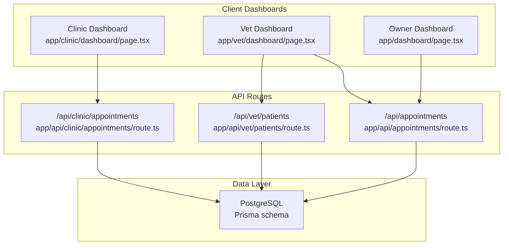
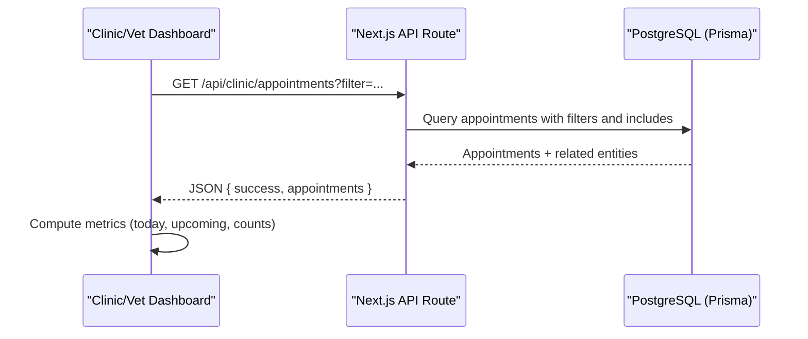
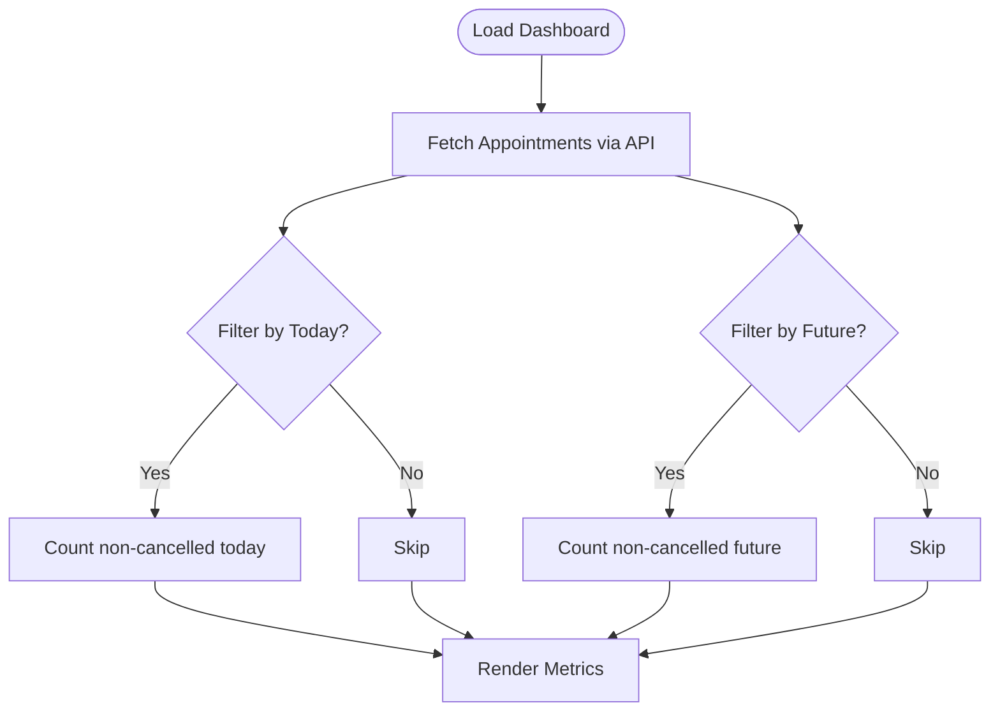
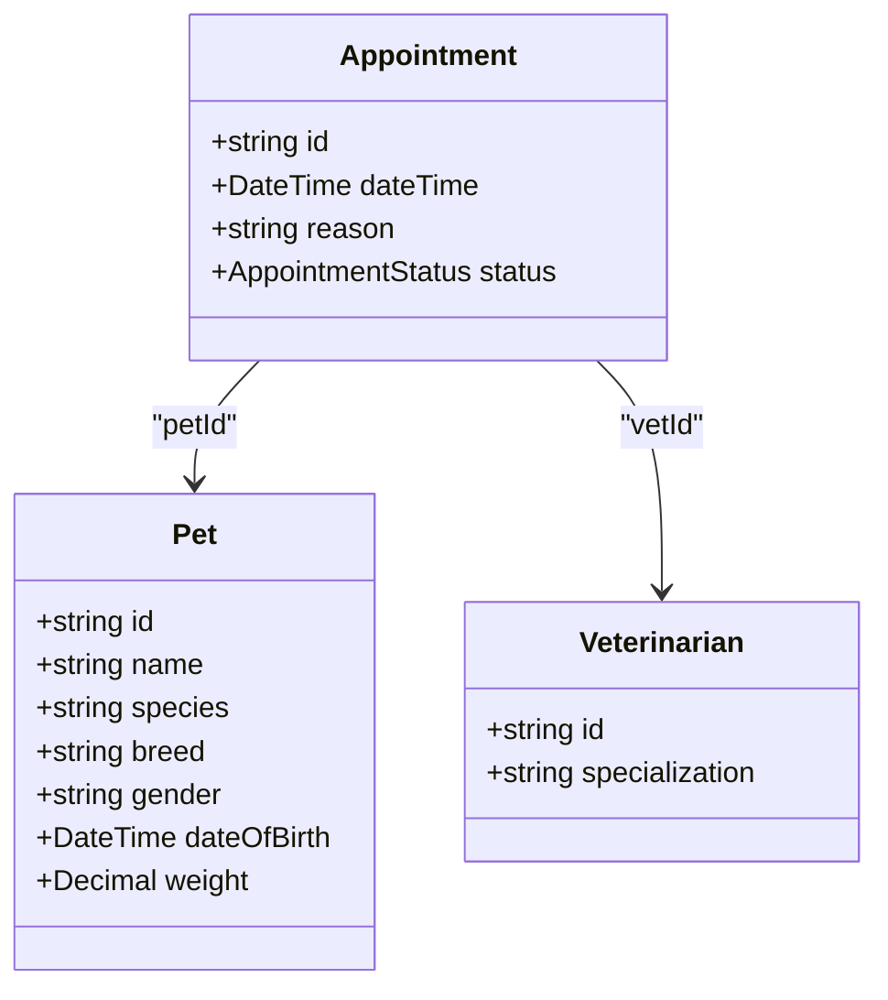
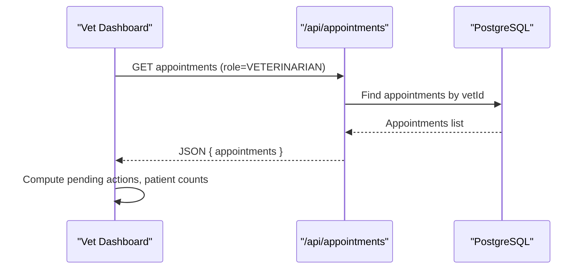
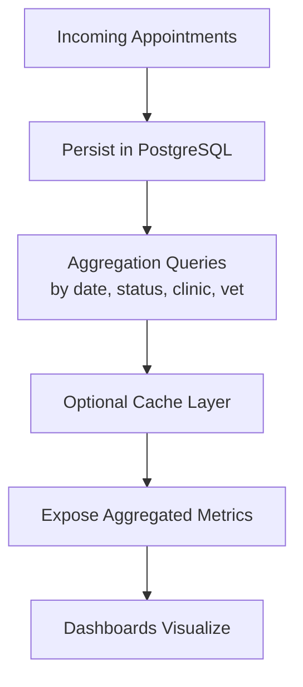
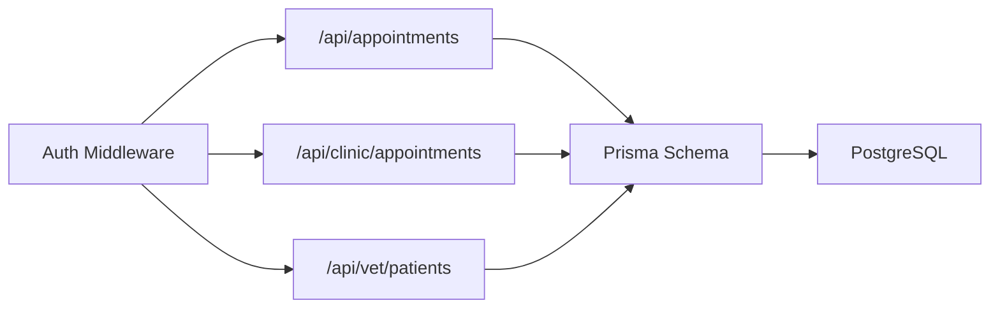
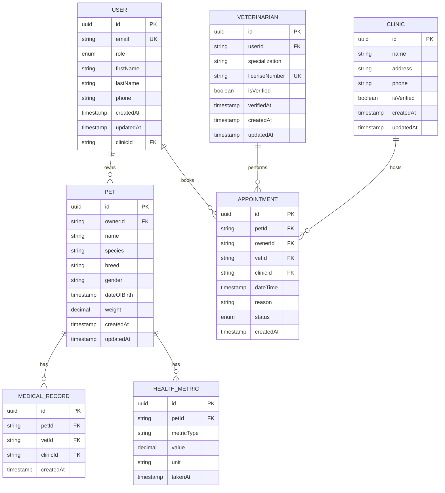

# Analytics & Reporting

<cite>
**Referenced Files in This Document**
- [app/clinic/dashboard/page.tsx](file://app/clinic/dashboard/page.tsx)
- [app/vet/dashboard/page.tsx](file://app/vet/dashboard/page.tsx)
- [app/dashboard/page.tsx](file://app/dashboard/page.tsx)
- [app/api/appointments/route.ts](file://app/api/appointments/route.ts)
- [app/api/clinic/appointments/route.ts](file://app/api/clinic/appointments/route.ts)
- [app/api/vet/patients/route.ts](file://app/api/vet/patients/route.ts)
- [prisma/schema.prisma](file://prisma/schema.prisma)
</cite>

## Table of Contents
1. Introduction
2. Project Structure
3. Core Components
4. Architecture Overview
5. Detailed Component Analysis
6. Dependency Analysis
7. Performance Considerations
8. Troubleshooting Guide
9. Conclusion
10. Appendices

## Introduction
This document describes the Clinic Analytics and Reporting system for PETIVA, focusing on how appointment data, patient volume, and staff productivity are collected and visualized across clinic and veterinarian dashboards. It explains current capabilities, identifies gaps (e.g., revenue tracking, export formats, automated scheduling), and proposes concrete implementation strategies for real-time analytics, historical trend analysis, comparative reporting across clinics, privacy safeguards, performance optimization, and integration with external business intelligence tools.

## Project Structure
The analytics and reporting features are primarily implemented via:
- Next.js client-side dashboards that fetch and render metrics from API endpoints
- Server-side API routes that query the database using Prisma and return structured JSON
- A relational data model that captures appointments, pets, owners, veterinarians, and clinics

**Diagram sources**
- [app/clinic/dashboard/page.tsx:38-82](file://app/clinic/dashboard/page.tsx#L38-L82)
- [app/vet/dashboard/page.tsx:42-84](file://app/vet/dashboard/page.tsx#L42-L84)
- [app/dashboard/page.tsx:46-96](file://app/dashboard/page.tsx#L46-L96)
- [app/api/appointments/route.ts:7-67](file://app/api/appointments/route.ts#L7-L67)
- [app/api/clinic/appointments/route.ts:5-84](file://app/api/clinic/appointments/route.ts#L5-L84)
- [app/api/vet/patients/route.ts:6-57](file://app/api/vet/patients/route.ts#L6-L57)
- [prisma/schema.prisma:164-182](file://prisma/schema.prisma#L164-L182)

**Section sources**
- [app/clinic/dashboard/page.tsx:38-82](file://app/clinic/dashboard/page.tsx#L38-L82)
- [app/vet/dashboard/page.tsx:42-84](file://app/vet/dashboard/page.tsx#L42-L84)
- [app/dashboard/page.tsx:46-96](file://app/dashboard/page.tsx#L46-L96)
- [app/api/appointments/route.ts:7-67](file://app/api/appointments/route.ts#L7-L67)
- [app/api/clinic/appointments/route.ts:5-84](file://app/api/clinic/appointments/route.ts#L5-L84)
- [app/api/vet/patients/route.ts:6-57](file://app/api/vet/patients/route.ts#L6-L57)
- [prisma/schema.prisma:164-182](file://prisma/schema.prisma#L164-L182)

## Core Components
- Clinic dashboard displays operational metrics such as today’s appointments, upcoming appointments, number of associated veterinarians, and clinic identity. Filtering by status is supported via a dedicated API endpoint.
- Veterinarian dashboard shows daily workload, upcoming appointments, patients under care, and pending actions. It also supports updating appointment statuses and viewing patient histories.
- Owner dashboard provides personal views including upcoming appointments and recent health activity timelines.

Key metrics currently available:
- Appointment statistics: counts for today, upcoming, and filtered statuses; cancellation state is tracked via status values.
- Patient volume: counts of unique patients per vet based on confirmed appointments.
- Staff productivity indicators: pending actions count and patient load per vet.

Missing or not yet implemented:
- Revenue tracking with service-based breakdowns
- Demographic analysis beyond pet species/breed/gender
- Export formats (PDF, CSV, Excel)
- Automated report scheduling
- Comparative multi-clinic analytics

**Section sources**
- [app/clinic/dashboard/page.tsx:270-300](file://app/clinic/dashboard/page.tsx#L270-L300)
- [app/vet/dashboard/page.tsx:354-386](file://app/vet/dashboard/page.tsx#L354-L386)
- [app/api/clinic/appointments/route.ts:23-54](file://app/api/clinic/appointments/route.ts#L23-L54)
- [app/api/vet/patients/route.ts:21-57](file://app/api/vet/patients/route.ts#L21-L57)
- [prisma/schema.prisma:164-182](file://prisma/schema.prisma#L164-L182)

## Architecture Overview
The analytics pipeline follows a client-server pattern:
- Client dashboards fetch data from role-scoped API endpoints
- API endpoints enforce authentication and authorization, then query the database using Prisma
- Responses include related entities (pets, owners, vets, clinics) to enable rich UI rendering

**Diagram sources**
- [app/api/clinic/appointments/route.ts:5-84](file://app/api/clinic/appointments/route.ts#L5-L84)
- [app/clinic/dashboard/page.tsx:84-99](file://app/clinic/dashboard/page.tsx#L84-L99)

**Section sources**
- [app/api/clinic/appointments/route.ts:5-84](file://app/api/clinic/appointments/route.ts#L5-L84)
- [app/clinic/dashboard/page.tsx:84-99](file://app/clinic/dashboard/page.tsx#L84-L99)

## Detailed Component Analysis

### Appointment Statistics Collection and Visualization
- Data source: Appointment model with fields for dateTime, reason, and status. Statuses include REQUESTED, CONFIRMED, COMPLETED, CANCELLED, NO_SHOW.
- Clinic dashboard computes:
  - Today’s appointments: filter by date and exclude cancelled
  - Upcoming appointments: future dates excluding cancelled
- Vet dashboard computes similar metrics and adds:
  - Pending actions: count of REQUESTED appointments
  - Patients under care: derived from confirmed appointments

**Diagram sources**
- [app/clinic/dashboard/page.tsx:151-155](file://app/clinic/dashboard/page.tsx#L151-L155)
- [app/vet/dashboard/page.tsx:211-215](file://app/vet/dashboard/page.tsx#L211-L215)
- [app/api/clinic/appointments/route.ts:23-54](file://app/api/clinic/appointments/route.ts#L23-L54)

**Section sources**
- [app/clinic/dashboard/page.tsx:151-155](file://app/clinic/dashboard/page.tsx#L151-L155)
- [app/vet/dashboard/page.tsx:211-215](file://app/vet/dashboard/page.tsx#L211-L215)
- [app/api/clinic/appointments/route.ts:23-54](file://app/api/clinic/appointments/route.ts#L23-L54)
- [prisma/schema.prisma:164-182](file://prisma/schema.prisma#L164-L182)

### Patient Volume Metrics and Demographics
- Current capability: Vet dashboard lists unique patients under care based on confirmed appointments, including pet details and owner contact info.
- Demographic fields available in schema: species, breed, gender, dateOfBirth, weight. These can be used for basic demographic analysis.

**Diagram sources**
- [prisma/schema.prisma:68-88](file://prisma/schema.prisma#L68-L88)
- [prisma/schema.prisma:90-105](file://prisma/schema.prisma#L90-L105)
- [prisma/schema.prisma:164-182](file://prisma/schema.prisma#L164-L182)

**Section sources**
- [app/api/vet/patients/route.ts:21-57](file://app/api/vet/patients/route.ts#L21-L57)
- [prisma/schema.prisma:68-88](file://prisma/schema.prisma#L68-L88)

### Staff Productivity Reports
- Current indicators:
  - Pending actions per vet (REQUESTED appointments)
  - Patients under care per vet (unique pets with CONFIRMED appointments)
- Extensibility points:
  - Add completion rate (COMPLETED vs total)
  - Track average time-to-confirm
  - Measure no-show rates using NO_SHOW status

**Diagram sources**
- [app/api/appointments/route.ts:23-37](file://app/api/appointments/route.ts#L23-L37)
- [app/vet/dashboard/page.tsx:354-386](file://app/vet/dashboard/page.tsx#L354-L386)

**Section sources**
- [app/api/appointments/route.ts:23-37](file://app/api/appointments/route.ts#L23-L37)
- [app/vet/dashboard/page.tsx:354-386](file://app/vet/dashboard/page.tsx#L354-L386)

### Data Aggregation Strategies
- Real-time analytics:
  - Client-side filtering and counting on fetched datasets (e.g., today vs upcoming)
  - Role-scoped queries ensure only relevant data is returned
- Historical trend analysis:
  - Use dateTime fields and status history to compute trends over time
  - Aggregate by day/week/month at the API layer for efficiency
- Comparative reporting across clinics:
  - Extend clinic-scoped endpoints to support multi-clinic aggregation when user has platform admin role
  - Group by clinicId and compute per-clinic KPIs

[No sources needed since this diagram shows conceptual workflow, not actual code structure]

### Report Generation System
Current state:
- No built-in export functionality (PDF, CSV, Excel)
- No automated scheduling for reports

Recommended implementation:
- Add server-side export endpoints:
  - CSV: stream rows directly from Prisma results
  - Excel: generate .xlsx using a library like exceljs
  - PDF: render charts and tables using a PDF generator
- Support custom date ranges via query parameters
- Implement scheduled jobs (e.g., cron-like tasks) to email or store periodic reports

[No sources needed since this section provides general guidance]

### Common Analytical Workflows
- Monthly performance summaries:
  - Aggregate appointment counts, completion rates, cancellation rates by month
  - Present in dashboards and downloadable reports
- Seasonal trends:
  - Group by month/season to identify patterns in volume and reasons
- Comparative clinic performance:
  - Compare KPIs across clinics (volume, cancellation rates, pending actions)
- Operational bottlenecks:
  - Identify high no-show rates, long wait times, or low confirmation rates

[No sources needed since this section provides general guidance]

## Dependency Analysis
The analytics components depend on:
- Authentication and role checks in API routes
- Prisma models for Appointment, Pet, Veterinarian, Clinic, User
- Client-side logic for computing metrics and rendering dashboards

**Diagram sources**
- [app/api/appointments/route.ts:7-67](file://app/api/appointments/route.ts#L7-L67)
- [app/api/clinic/appointments/route.ts:5-84](file://app/api/clinic/appointments/route.ts#L5-L84)
- [app/api/vet/patients/route.ts:6-57](file://app/api/vet/patients/route.ts#L6-L57)
- [prisma/schema.prisma:164-182](file://prisma/schema.prisma#L164-L182)

**Section sources**
- [app/api/appointments/route.ts:7-67](file://app/api/appointments/route.ts#L7-L67)
- [app/api/clinic/appointments/route.ts:5-84](file://app/api/clinic/appointments/route.ts#L5-L84)
- [app/api/vet/patients/route.ts:6-57](file://app/api/vet/patients/route.ts#L6-L57)
- [prisma/schema.prisma:164-182](file://prisma/schema.prisma#L164-L182)

## Performance Considerations
- Indexing:
  - Ensure indexes on frequently queried fields: vetId, dateTime, ownerId, petId, clinicId
  - The schema already defines useful indexes on Appointment
- Pagination and limits:
  - For large datasets, add pagination to API responses to reduce payload size
- Aggregation at the database level:
  - Move heavy computations to SQL/Prisma to minimize client-side processing
- Caching:
  - Consider caching aggregated metrics for short intervals to reduce DB load
- Streaming exports:
  - For CSV/Excel generation, stream results to avoid memory spikes

[No sources needed since this section provides general guidance]

## Troubleshooting Guide
Common issues and resolutions:
- Unauthorized access:
  - Ensure users are authenticated and have appropriate roles before accessing endpoints
- Missing clinic association:
  - Clinic admin must have an associated clinicId; otherwise, requests will fail
- Double booking prevention:
  - Appointment creation enforces conflict checks; handle conflicts gracefully in UI
- Data consistency:
  - Use transactions for operations that modify multiple records to maintain integrity

**Section sources**
- [app/api/appointments/route.ts:93-110](file://app/api/appointments/route.ts#L93-L110)
- [app/api/clinic/appointments/route.ts:16-21](file://app/api/clinic/appointments/route.ts#L16-L21)

## Conclusion
PETIVA’s current analytics foundation provides essential appointment and patient metrics through role-scoped APIs and interactive dashboards. To fully realize the Clinic Analytics and Reporting system, implement revenue tracking, advanced demographic analysis, export capabilities, automated scheduling, and multi-clinic comparative reporting. Adopt database-level aggregations, caching, and streaming exports to optimize performance for large datasets. Integrate with external BI tools via standardized APIs and exported datasets while maintaining strict data privacy controls.

## Appendices

### Data Model Reference

**Diagram sources**
- [prisma/schema.prisma:30-53](file://prisma/schema.prisma#L30-L53)
- [prisma/schema.prisma:68-88](file://prisma/schema.prisma#L68-L88)
- [prisma/schema.prisma:90-105](file://prisma/schema.prisma#L90-L105)
- [prisma/schema.prisma:107-119](file://prisma/schema.prisma#L107-L119)
- [prisma/schema.prisma:164-182](file://prisma/schema.prisma#L164-L182)
- [prisma/schema.prisma:133-146](file://prisma/schema.prisma#L133-L146)
- [prisma/schema.prisma:236-244](file://prisma/schema.prisma#L236-L244)