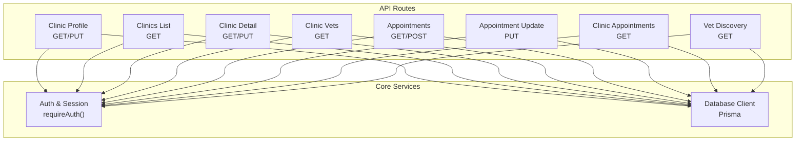
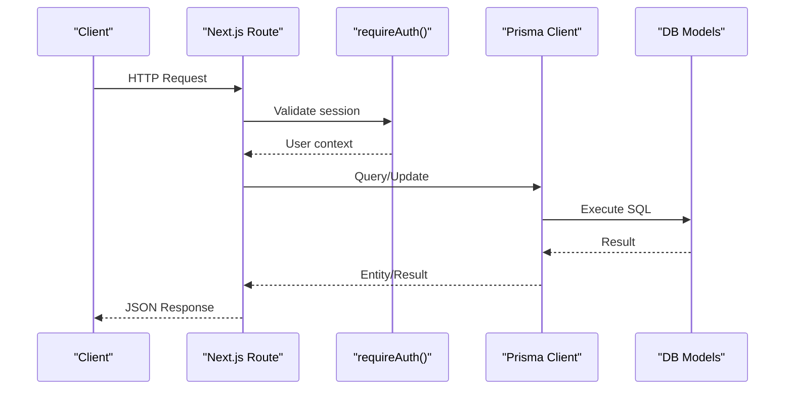
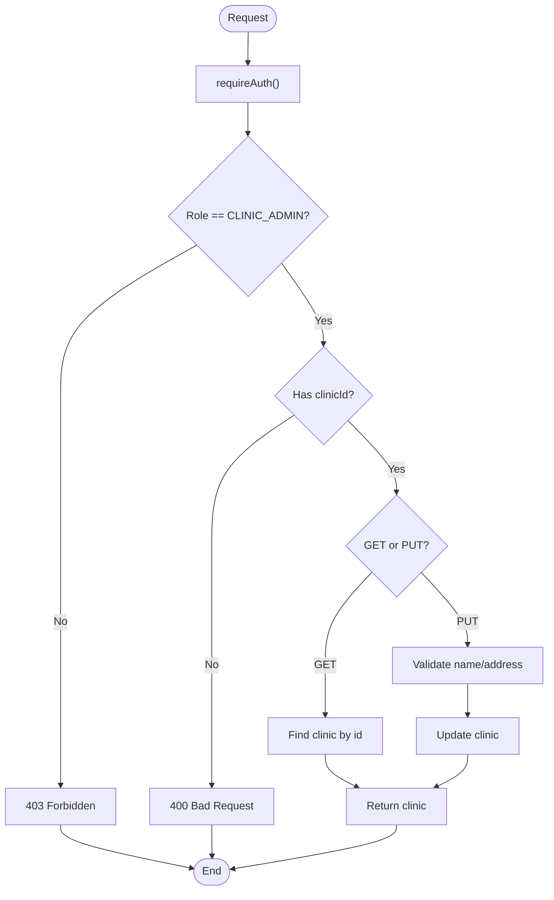
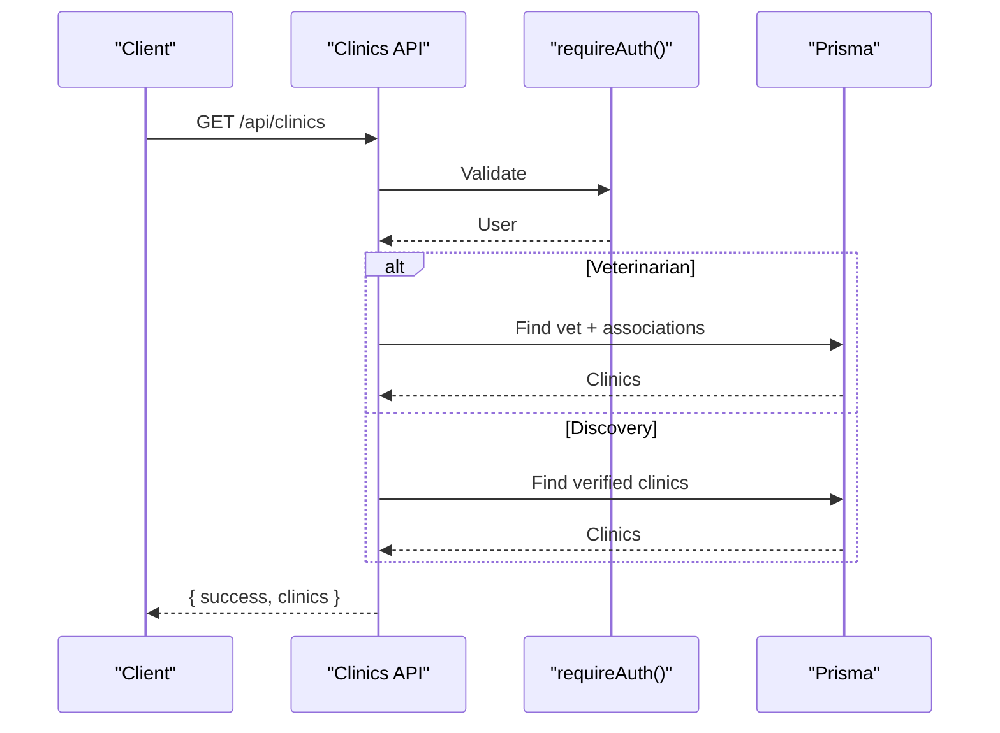
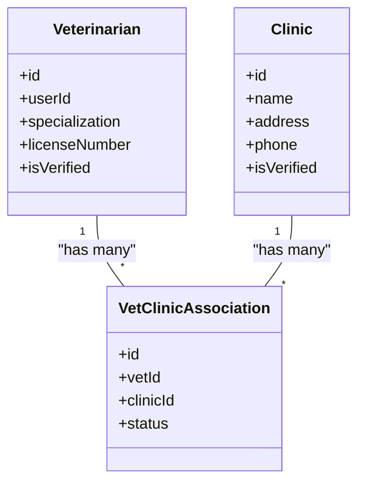
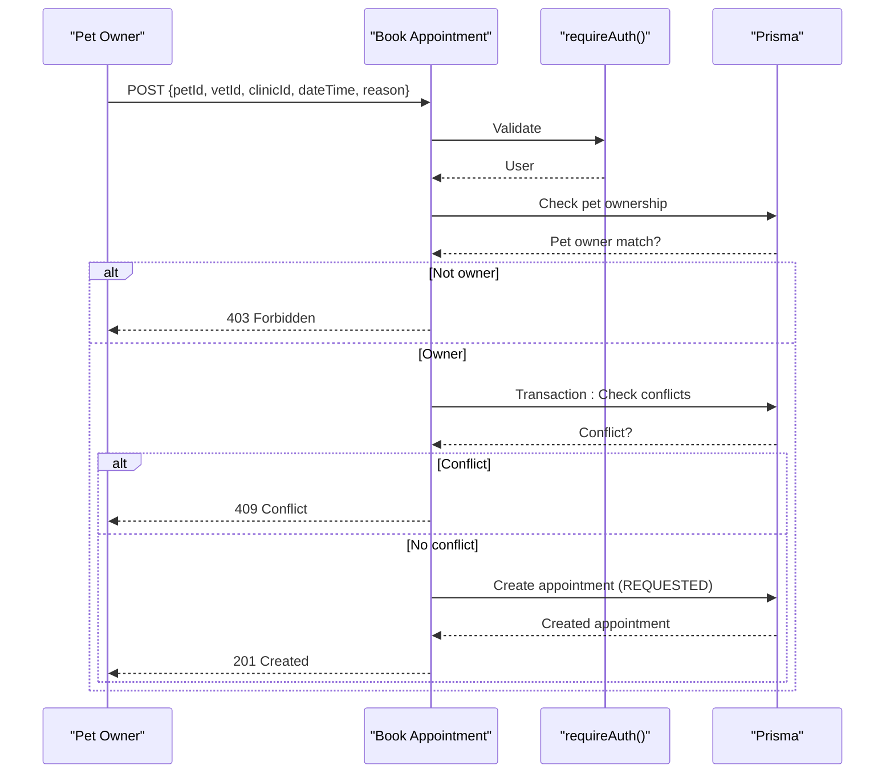
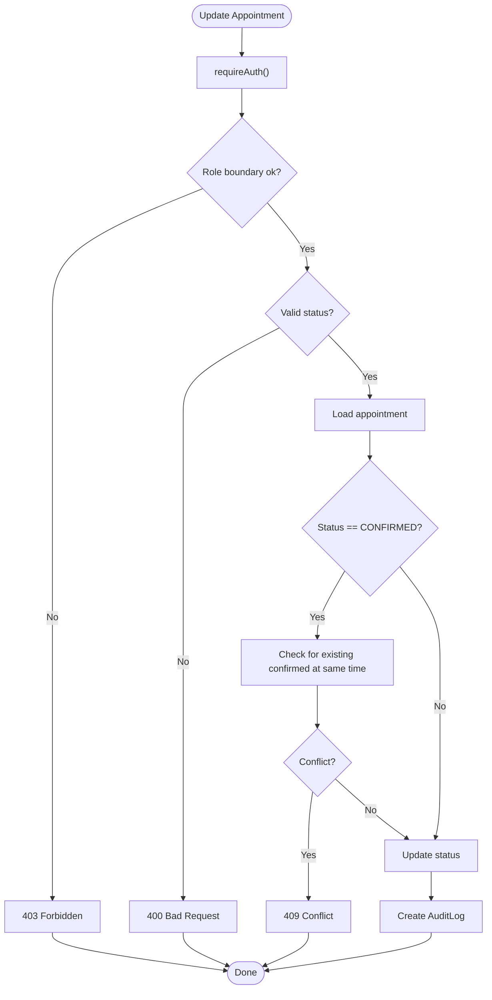
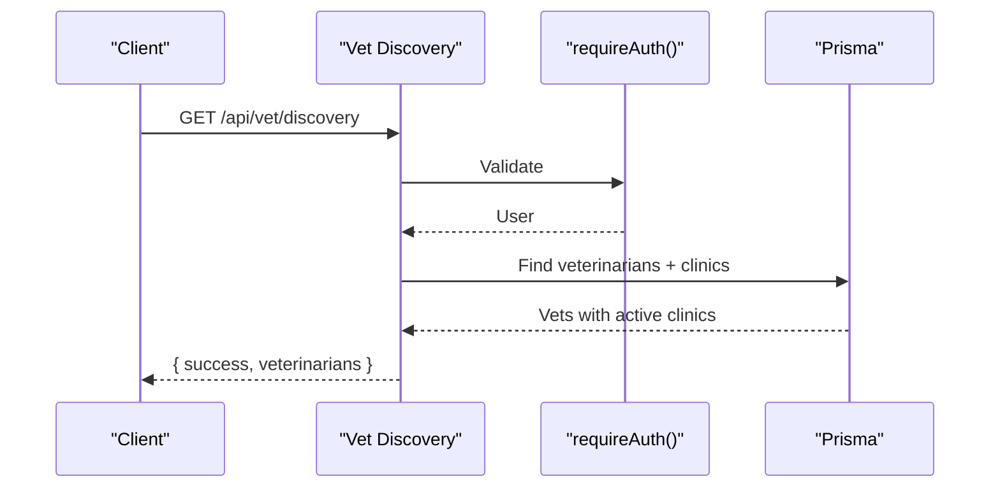
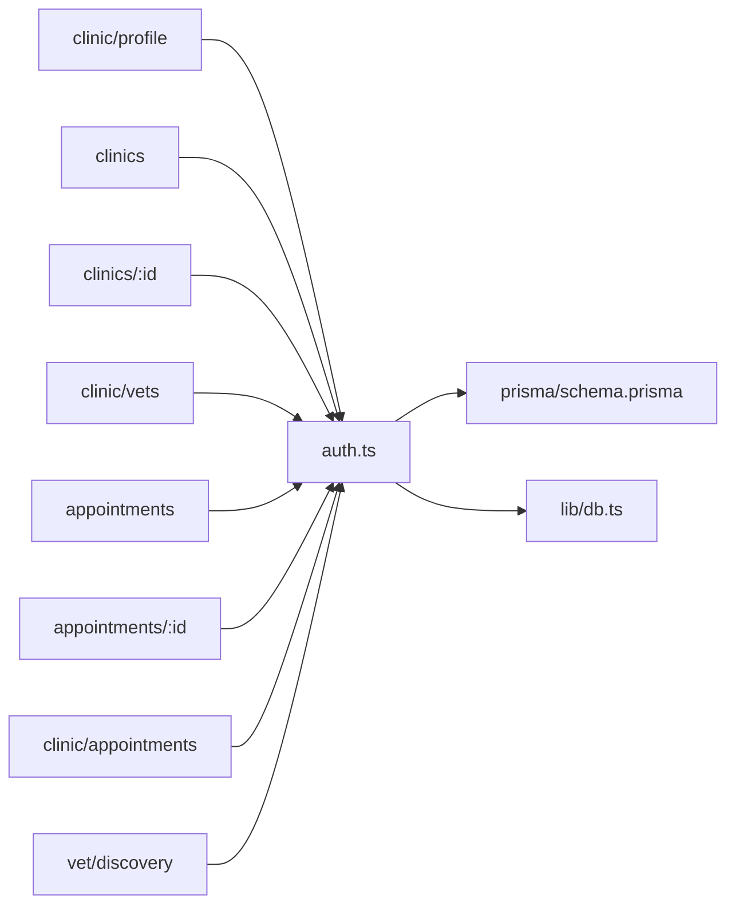

# Clinic Management

<cite>
**Referenced Files in This Document**
- [schema.prisma](file://prisma/schema.prisma)
- [auth.ts](file://lib/auth.ts)
- [db.ts](file://lib/db.ts)
- [clinic_profile_route.ts](file://app/api/clinic/profile/route.ts)
- [clinic_vets_route.ts](file://app/api/clinic/vets/route.ts)
- [clinics_list_route.ts](file://app/api/clinics/route.ts)
- [clinic_detail_route.ts](file://app/api/clinics/[clinicId]/route.ts)
- [clinic_vets_by_id_route.ts](file://app/api/clinics/[clinicId]/vets/route.ts)
- [appointments_list_route.ts](file://app/api/appointments/route.ts)
- [appointment_update_route.ts](file://app/api/appointments/[appointmentId]/route.ts)
- [clinic_appointments_route.ts](file://app/api/clinic/appointments/route.ts)
- [vet_discovery_route.ts](file://app/api/vet/discovery/route.ts)
- [database_design.md](file://docs/03-architecture/02-database-design.md)
- [api_specification.md](file://docs/03-architecture/03-api-specification.md)
</cite>

## Table of Contents
1. Introduction
2. Project Structure
3. Core Components
4. Architecture Overview
5. Detailed Component Analysis
6. Dependency Analysis
7. Performance Considerations
8. Troubleshooting Guide
9. Conclusion

## Introduction
This document explains the Clinic Management system within PETIVA, focusing on clinic administration, staff management, vet-clinic associations, appointment workflows, discovery features, and operational analytics. It covers data models, API endpoints, authorization rules, validation constraints, and security considerations, with diagrams to illustrate key flows.

## Project Structure
The Clinic Management functionality is implemented as a set of Next.js API routes backed by Prisma and PostgreSQL. Key areas:
- Clinic profile and listing endpoints for administrators and discovery
- Vet association endpoints for managing veterinarians at clinics
- Appointment booking and management endpoints supporting multiple roles
- Vet discovery endpoint for browsing available practitioners and their clinics
- Authentication and session management utilities
- Database schema defining entities and relationships

**Diagram sources**
- [clinic_profile_route.ts:1-95](file://app/api/clinic/profile/route.ts#L1-L95)
- [clinics_list_route.ts:1-49](file://app/api/clinics/route.ts#L1-L49)
- [clinic_detail_route.ts:1-84](file://app/api/clinics/[clinicId]/route.ts#L1-L84)
- [clinic_vets_by_id_route.ts:1-56](file://app/api/clinics/[clinicId]/vets/route.ts#L1-L56)
- [appointments_list_route.ts:1-143](file://app/api/appointments/route.ts#L1-L143)
- [appointment_update_route.ts:1-119](file://app/api/appointments/[appointmentId]/route.ts#L1-L119)
- [clinic_appointments_route.ts:1-98](file://app/api/clinic/appointments/route.ts#L1-L98)
- [vet_discovery_route.ts:1-60](file://app/api/vet/discovery/route.ts#L1-L60)
- [auth.ts:1-125](file://lib/auth.ts#L1-L125)
- [db.ts:1-33](file://lib/db.ts#L1-L33)

**Section sources**
- [schema.prisma:1-312](file://prisma/schema.prisma#L1-L312)
- [api_specification.md:1-259](file://docs/03-architecture/03-api-specification.md#L1-L259)

## Core Components
- Clinic Administration
  - Read/update clinic profile (name, address, phone) restricted to CLINIC_ADMIN associated with a clinic
  - List verified clinics for discovery; list clinics associated with authenticated users
  - Fetch or edit a specific clinic by ID with role checks
- Staff Management
  - List veterinarians associated with a clinic, including specialization, license, verification status, and user details
- Vet-Clinic Association
  - Many-to-many mapping via VetClinicAssociation with status lifecycle (PENDING, ACTIVE, INACTIVE)
- Appointment Management
  - Book appointments with pet ownership validation and double-booking prevention
  - Role-based updates to confirm/cancel/complete appointments with audit logging
  - Clinic-admin view of appointments with filters (ALL, TODAY, UPCOMING, etc.)
- Vet Discovery
  - Browse all veterinarians with active clinic associations and contact details
- Security and Data Integrity
  - Centralized authentication and session handling
  - Role-based authorization per endpoint
  - Audit logs for critical actions

**Section sources**
- [clinic_profile_route.ts:1-95](file://app/api/clinic/profile/route.ts#L1-L95)
- [clinics_list_route.ts:1-49](file://app/api/clinics/route.ts#L1-L49)
- [clinic_detail_route.ts:1-84](file://app/api/clinics/[clinicId]/route.ts#L1-L84)
- [clinic_vets_route.ts:1-65](file://app/api/clinic/vets/route.ts#L1-L65)
- [clinic_vets_by_id_route.ts:1-56](file://app/api/clinics/[clinicId]/vets/route.ts#L1-L56)
- [appointments_list_route.ts:1-143](file://app/api/appointments/route.ts#L1-L143)
- [appointment_update_route.ts:1-119](file://app/api/appointments/[appointmentId]/route.ts#L1-L119)
- [clinic_appointments_route.ts:1-98](file://app/api/clinic/appointments/route.ts#L1-L98)
- [vet_discovery_route.ts:1-60](file://app/api/vet/discovery/route.ts#L1-L60)
- [auth.ts:1-125](file://lib/auth.ts#L1-L125)
- [schema.prisma:1-312](file://prisma/schema.prisma#L1-L312)

## Architecture Overview
The system uses a layered architecture:
- API Layer: Next.js route handlers enforce authentication and authorization, validate inputs, and orchestrate business logic
- Service Layer: Reusable auth/session helpers and database client abstraction
- Data Layer: Prisma ORM over PostgreSQL with well-defined models and indexes

**Diagram sources**
- [auth.ts:109-125](file://lib/auth.ts#L109-L125)
- [db.ts:1-33](file://lib/db.ts#L1-L33)
- [schema.prisma:1-312](file://prisma/schema.prisma#L1-L312)

## Detailed Component Analysis

### Clinic Profile Management
- Purpose: Allow clinic administrators to read and update clinic profile fields (name, address, phone).
- Authorization: Requires CLINIC_ADMIN role and an associated clinicId on the user.
- Validation: Name and address are required for updates.
- Behavior: GET returns the associated clinic; PUT updates only permitted fields.

**Diagram sources**
- [clinic_profile_route.ts:1-95](file://app/api/clinic/profile/route.ts#L1-L95)
- [auth.ts:109-125](file://lib/auth.ts#L109-L125)

**Section sources**
- [clinic_profile_route.ts:1-95](file://app/api/clinic/profile/route.ts#L1-L95)
- [schema.prisma:107-119](file://prisma/schema.prisma#L107-L119)

### Clinic Listing and Discovery
- Purpose: Provide lists of clinics for discovery and for authenticated users’ contexts.
- Behavior:
  - GET /api/clinics: If user is VETERINARIAN, return clinics associated with them; otherwise return verified clinics for discovery.
  - GET /api/clinics/[clinicId]: Fetch a specific clinic by ID.
  - PUT /api/clinics/[clinicId]: Edit clinic profile for CLINIC_ADMIN or PLATFORM_ADMIN.

**Diagram sources**
- [clinics_list_route.ts:1-49](file://app/api/clinics/route.ts#L1-L49)
- [clinic_detail_route.ts:1-84](file://app/api/clinics/[clinicId]/route.ts#L1-L84)
- [auth.ts:109-125](file://lib/auth.ts#L109-L125)

**Section sources**
- [clinics_list_route.ts:1-49](file://app/api/clinics/route.ts#L1-L49)
- [clinic_detail_route.ts:1-84](file://app/api/clinics/[clinicId]/route.ts#L1-L84)
- [schema.prisma:107-119](file://prisma/schema.prisma#L107-L119)

### Staff Management and Vet-Clinic Associations
- Purpose: Manage veterinarians associated with a clinic and expose vet profiles with specializations and verification status.
- Behavior:
  - GET /api/clinic/vets: Lists vets associated with the admin’s clinic, including user details and association status.
  - GET /api/clinics/[clinicId]/vets: Lists vets for a given clinic (authenticated).
- Data Model: VetClinicAssociation links Veterinarian and Clinic with status PENDING/ACTIVE/INACTIVE.

**Diagram sources**
- [schema.prisma:90-131](file://prisma/schema.prisma#L90-L131)
- [clinic_vets_route.ts:1-65](file://app/api/clinic/vets/route.ts#L1-L65)
- [clinic_vets_by_id_route.ts:1-56](file://app/api/clinics/[clinicId]/vets/route.ts#L1-L56)

**Section sources**
- [clinic_vets_route.ts:1-65](file://app/api/clinic/vets/route.ts#L1-L65)
- [clinic_vets_by_id_route.ts:1-56](file://app/api/clinics/[clinicId]/vets/route.ts#L1-L56)
- [schema.prisma:90-131](file://prisma/schema.prisma#L90-L131)

### Appointment Booking and Management
- Purpose: Enable pet owners to book appointments and allow vets/admins to manage them.
- Key Behaviors:
  - POST /api/appointments: Validates pet ownership, prevents double-booking using a transactional check, creates appointment with REQUESTED status.
  - GET /api/appointments: Returns appointments filtered by role (PET_OWNER, VETERINARIAN, CLINIC_ADMIN).
  - PUT /api/appointments/[appointmentId]: Role-based transitions with conflict checks on CONFIRMED and audit logging.
  - GET /api/clinic/appointments: Admin-only view with filters (ALL, TODAY, UPCOMING, COMPLETED, CANCELLED, REQUESTED, CONFIRMED).

**Diagram sources**
- [appointments_list_route.ts:69-143](file://app/api/appointments/route.ts#L69-L143)
- [auth.ts:109-125](file://lib/auth.ts#L109-L125)

**Diagram sources**
- [appointment_update_route.ts:1-119](file://app/api/appointments/[appointmentId]/route.ts#L1-L119)
- [schema.prisma:298-311](file://prisma/schema.prisma#L298-L311)

**Section sources**
- [appointments_list_route.ts:1-143](file://app/api/appointments/route.ts#L1-L143)
- [appointment_update_route.ts:1-119](file://app/api/appointments/[appointmentId]/route.ts#L1-L119)
- [clinic_appointments_route.ts:1-98](file://app/api/clinic/appointments/route.ts#L1-L98)
- [schema.prisma:164-182](file://prisma/schema.prisma#L164-L182)

### Vet Discovery
- Purpose: Allow authenticated users to browse available veterinarians and their active clinic associations.
- Behavior: Returns vet profiles with user details and active clinics.

**Diagram sources**
- [vet_discovery_route.ts:1-60](file://app/api/vet/discovery/route.ts#L1-L60)
- [auth.ts:109-125](file://lib/auth.ts#L109-L125)

**Section sources**
- [vet_discovery_route.ts:1-60](file://app/api/vet/discovery/route.ts#L1-L60)
- [schema.prisma:90-131](file://prisma/schema.prisma#L90-L131)

### Operational Analytics (Current Capabilities)
- Appointment statistics: Available via role-scoped queries (owner, vet, clinic admin) and filters for clinic admins.
- Patient volume metrics: Derivable from appointment counts per vet/clinic/time windows.
- Staff productivity reports: Derivable from appointment counts and statuses per veterinarian.
- Revenue tracking: Not implemented in current endpoints/models; would require adding pricing/revenue fields and reporting endpoints.

Note: The current implementation provides foundational data access for analytics; advanced reporting can be built on top of these endpoints.

**Section sources**
- [appointments_list_route.ts:1-143](file://app/api/appointments/route.ts#L1-L143)
- [clinic_appointments_route.ts:1-98](file://app/api/clinic/appointments/route.ts#L1-L98)

## Dependency Analysis
Key dependencies and relationships:
- API routes depend on:
  - Authentication helper (requireAuth) for session validation
  - Prisma client for data access
- Data model dependencies:
  - User, Veterinarian, Clinic, VetClinicAssociation, Appointment, AuditLog
- External services:
  - PostgreSQL via Prisma Pg adapter

**Diagram sources**
- [auth.ts:1-125](file://lib/auth.ts#L1-L125)
- [db.ts:1-33](file://lib/db.ts#L1-L33)
- [schema.prisma:1-312](file://prisma/schema.prisma#L1-L312)
- [clinic_profile_route.ts:1-95](file://app/api/clinic/profile/route.ts#L1-L95)
- [clinics_list_route.ts:1-49](file://app/api/clinics/route.ts#L1-L49)
- [clinic_detail_route.ts:1-84](file://app/api/clinics/[clinicId]/route.ts#L1-L84)
- [clinic_vets_route.ts:1-65](file://app/api/clinic/vets/route.ts#L1-L65)
- [appointments_list_route.ts:1-143](file://app/api/appointments/route.ts#L1-L143)
- [appointment_update_route.ts:1-119](file://app/api/appointments/[appointmentId]/route.ts#L1-L119)
- [clinic_appointments_route.ts:1-98](file://app/api/clinic/appointments/route.ts#L1-L98)
- [vet_discovery_route.ts:1-60](file://app/api/vet/discovery/route.ts#L1-L60)

**Section sources**
- [schema.prisma:1-312](file://prisma/schema.prisma#L1-L312)
- [auth.ts:1-125](file://lib/auth.ts#L1-L125)
- [db.ts:1-33](file://lib/db.ts#L1-L33)

## Performance Considerations
- Use indexes:
  - Appointment indices on vetId+dateTime, ownerId, petId improve query performance for filtering and listing.
- Minimize N+1 queries:
  - Include related entities selectively in API responses to reduce round trips.
- Transactions:
  - Double-booking checks use transactions to ensure consistency during creation.
- Pagination:
  - Consider adding pagination for large appointment or clinic lists to reduce payload size.
- Connection pooling:
  - Production uses a pooled connection via Prisma Pg adapter for scalability.

[No sources needed since this section provides general guidance]

## Troubleshooting Guide
Common issues and resolutions:
- Unauthorized access:
  - Ensure a valid session cookie exists; requireAuth throws UNAUTHENTICATED if missing/expired.
- Forbidden operations:
  - Verify user role matches endpoint requirements (e.g., CLINIC_ADMIN for clinic edits).
- Missing clinic association:
  - CLINIC_ADMIN must have clinicId set; otherwise requests return BAD_REQUEST.
- Double-booking conflicts:
  - Confirmed or requested slots may already be taken; adjust time or choose another vet.
- Invalid appointment status:
  - Only allowed enum values are accepted; correct the status before updating.
- Audit log gaps:
  - Ensure write paths create AuditLog entries for critical state changes.

**Section sources**
- [auth.ts:109-125](file://lib/auth.ts#L109-L125)
- [clinic_profile_route.ts:1-95](file://app/api/clinic/profile/route.ts#L1-L95)
- [appointments_list_route.ts:69-143](file://app/api/appointments/route.ts#L69-L143)
- [appointment_update_route.ts:1-119](file://app/api/appointments/[appointmentId]/route.ts#L1-L119)

## Conclusion
The Clinic Management system provides robust administrative capabilities for clinic profiles, staff management, vet-clinic associations, and appointment workflows, with strong role-based security and auditability. While comprehensive analytics are partially supported through appointment data, revenue tracking and advanced reporting can be extended by adding relevant data models and endpoints. The design emphasizes data integrity, clear authorization boundaries, and scalable database interactions.

[No sources needed since this section summarizes without analyzing specific files]