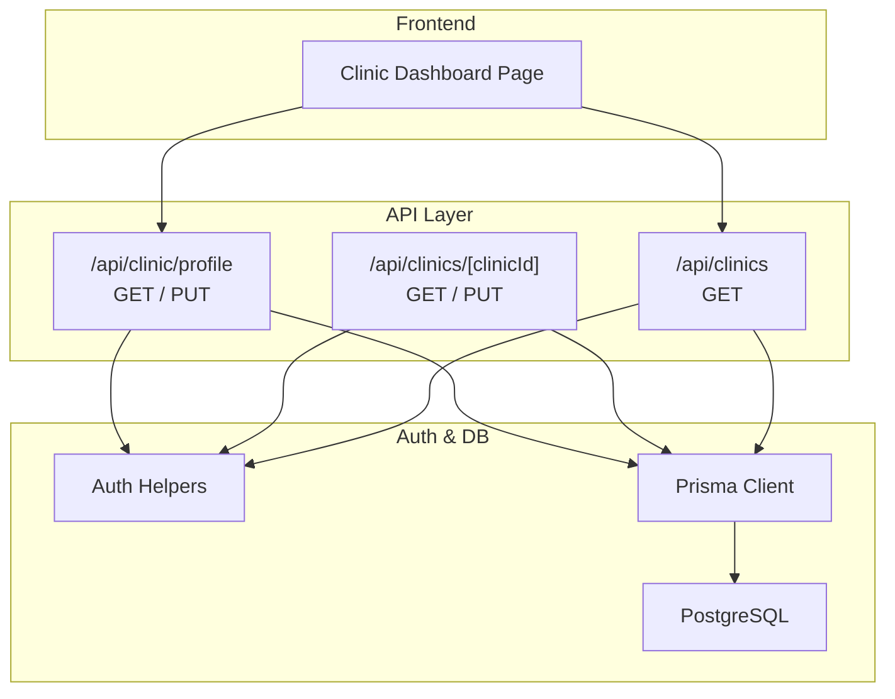
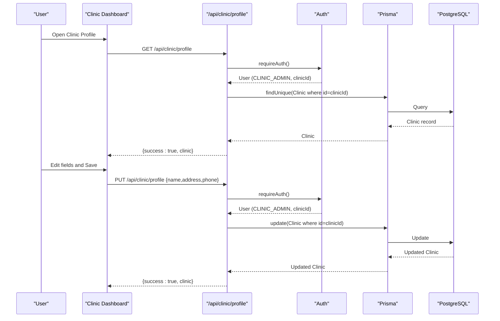
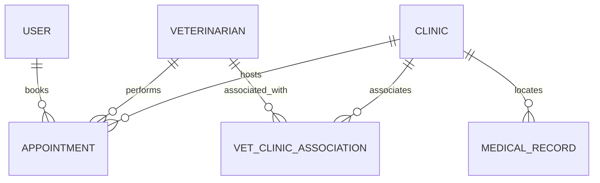
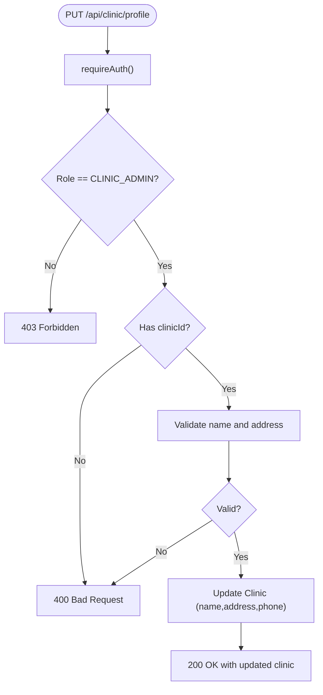
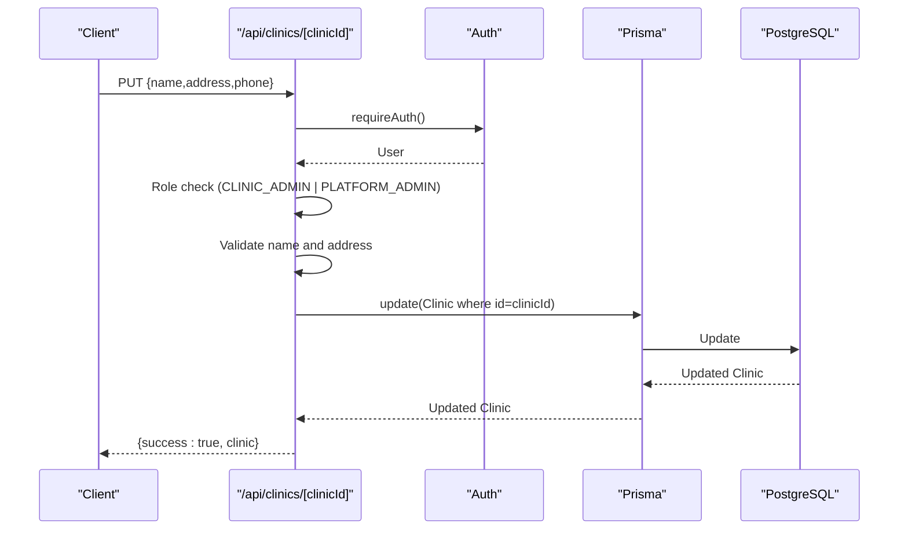
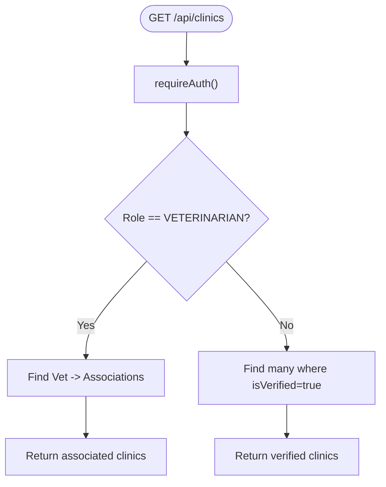
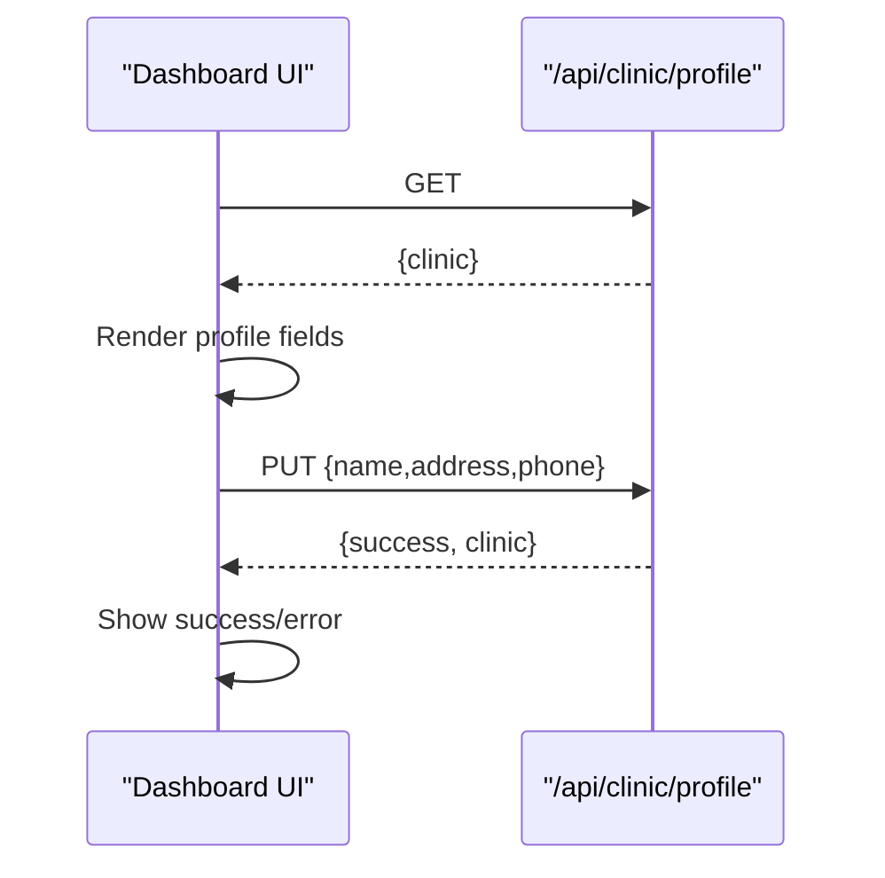
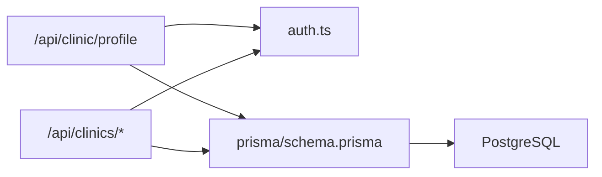

# Clinic Profile Management

<cite>
**Referenced Files in This Document**
- [schema.prisma](file://prisma/schema.prisma)
- [02-database-design.md](file://docs/03-architecture/02-database-design.md)
- [route.ts (clinic profile)](file://app/api/clinic/profile/route.ts)
- [route.ts (clinics by id)](file://app/api/clinics/[clinicId]/route.ts)
- [route.ts (clinics list)](file://app/api/clinics/route.ts)
- [auth.ts](file://lib/auth.ts)
- [db.ts](file://lib/db.ts)
- [page.tsx (clinic dashboard)](file://app/clinic/dashboard/page.tsx)
- [06-security.md](file://docs/03-architecture/06-security.md)
</cite>

## Table of Contents
1. Introduction
2. Project Structure
3. Core Components
4. Architecture Overview
5. Detailed Component Analysis
6. Dependency Analysis
7. Performance Considerations
8. Troubleshooting Guide
9. Conclusion

## Introduction
This document explains the Clinic Profile Management system in PETIVA, focusing on how clinic profiles are created, edited, and managed. It covers basic information fields (name, address, phone), verification status, role-based access control, data model structure, validation rules enforced by APIs, and the current UI workflow for updating clinic details. It also outlines security considerations and data integrity measures present in the codebase. Where features such as operating hours, service offerings, image uploads, and SEO fields are not yet implemented, this document clearly indicates their absence and suggests safe next steps.

## Project Structure
The Clinic Profile Management functionality is implemented across:
- API routes for reading and updating clinic profiles
- A Prisma schema defining the Clinic entity and related relationships
- A clinic dashboard page that provides an admin interface to view and edit clinic profile fields
- Authentication and authorization helpers used by all endpoints

**Diagram sources**
- [page.tsx (clinic dashboard):38-82](file://app/clinic/dashboard/page.tsx#L38-L82)
- [route.ts (clinic profile):5-47](file://app/api/clinic/profile/route.ts#L5-L47)
- [route.ts (clinics by id):6-38](file://app/api/clinics/[clinicId]/route.ts#L6-L38)
- [route.ts (clinics list):6-48](file://app/api/clinics/route.ts#L6-L48)
- [auth.ts:109-125](file://lib/auth.ts#L109-L125)
- [db.ts:1-33](file://lib/db.ts#L1-L33)

**Section sources**
- [page.tsx (clinic dashboard):38-82](file://app/clinic/dashboard/page.tsx#L38-L82)
- [route.ts (clinic profile):5-95](file://app/api/clinic/profile/route.ts#L5-L95)
- [route.ts (clinics by id):6-84](file://app/api/clinics/[clinicId]/route.ts#L6-L84)
- [route.ts (clinics list):6-48](file://app/api/clinics/route.ts#L6-L48)
- [auth.ts:109-125](file://lib/auth.ts#L109-L125)
- [db.ts:1-33](file://lib/db.ts#L1-L33)

## Core Components
- Clinic data model: The Clinic entity stores name, address, phone, and a verification flag. It participates in relationships with appointments, medical records, and vet associations.
- Profile API: Provides GET and PUT for the authenticated clinic’s profile, enforcing CLINIC_ADMIN role and association checks.
- Public discovery API: Lists verified clinics for discovery when appropriate.
- Admin dashboard: Presents a simple form to update clinic name, address, and phone; calls the profile API to persist changes.

Key responsibilities:
- Enforce authentication and role-based authorization before any write operation
- Validate required fields at the API layer
- Persist updates via Prisma to PostgreSQL
- Return consistent success/error responses

**Section sources**
- [schema.prisma:107-119](file://prisma/schema.prisma#L107-L119)
- [route.ts (clinic profile):5-95](file://app/api/clinic/profile/route.ts#L5-L95)
- [route.ts (clinics list):6-48](file://app/api/clinics/route.ts#L6-L48)
- [page.tsx (clinic dashboard):475-545](file://app/clinic/dashboard/page.tsx#L475-L545)

## Architecture Overview
The clinic profile management follows a standard Next.js API route pattern with server-side auth and Prisma ORM.

**Diagram sources**
- [route.ts (clinic profile):5-95](file://app/api/clinic/profile/route.ts#L5-L95)
- [auth.ts:109-125](file://lib/auth.ts#L109-L125)
- [db.ts:1-33](file://lib/db.ts#L1-L33)
- [page.tsx (clinic dashboard):101-129](file://app/clinic/dashboard/page.tsx#L101-L129)

## Detailed Component Analysis

### Data Model: Clinic and Related Entities
- Clinic fields: id, name, address, phone, isVerified, timestamps.
- Relationships:
  - Appointments reference clinicId
  - Medical records can reference clinicId
  - Vet-Clinic associations link Veterinarians to Clinics
  - Users can be associated as clinic admins via clinicId

**Diagram sources**
- [schema.prisma:30-119](file://prisma/schema.prisma#L30-L119)
- [02-database-design.md:10-41](file://docs/03-architecture/02-database-design.md#L10-L41)

**Section sources**
- [schema.prisma:107-119](file://prisma/schema.prisma#L107-L119)
- [02-database-design.md:85-104](file://docs/03-architecture/02-database-design.md#L85-L104)

### API: Read and Update Clinic Profile
- GET /api/clinic/profile:
  - Requires authentication and CLINIC_ADMIN role
  - Ensures user has an associated clinicId
  - Returns the clinic record for that clinicId
- PUT /api/clinic/profile:
  - Requires authentication and CLINIC_ADMIN role
  - Validates name and address presence
  - Updates only name, address, and phone fields

**Diagram sources**
- [route.ts (clinic profile):49-95](file://app/api/clinic/profile/route.ts#L49-L95)

**Section sources**
- [route.ts (clinic profile):5-95](file://app/api/clinic/profile/route.ts#L5-L95)

### API: Fetch and Edit Clinic by ID
- GET /api/clinics/[clinicId]:
  - Requires authentication
  - Returns clinic if found
- PUT /api/clinics/[clinicId]:
  - Requires authentication
  - Allows CLINIC_ADMIN or PLATFORM_ADMIN roles
  - Validates name and address
  - Updates clinic fields

**Diagram sources**
- [route.ts (clinics by id):40-84](file://app/api/clinics/[clinicId]/route.ts#L40-L84)

**Section sources**
- [route.ts (clinics by id):6-84](file://app/api/clinics/[clinicId]/route.ts#L6-L84)

### API: List Clinics for Discovery
- GET /api/clinics:
  - For VETERINARIAN users: returns clinics associated via VetClinicAssociation
  - Otherwise: returns verified clinics ordered by name

**Diagram sources**
- [route.ts (clinics list):6-48](file://app/api/clinics/route.ts#L6-L48)

**Section sources**
- [route.ts (clinics list):6-48](file://app/api/clinics/route.ts#L6-L48)

### Frontend: Clinic Profile UI Workflow
- Loads current clinic profile from /api/clinic/profile
- Displays editable fields for name, address, and phone
- Submits updates via PUT /api/clinic/profile
- Shows success or error messages based on response

**Diagram sources**
- [page.tsx (clinic dashboard):38-82](file://app/clinic/dashboard/page.tsx#L38-L82)
- [page.tsx (clinic dashboard):101-129](file://app/clinic/dashboard/page.tsx#L101-L129)
- [page.tsx (clinic dashboard):475-545](file://app/clinic/dashboard/page.tsx#L475-L545)

**Section sources**
- [page.tsx (clinic dashboard):38-82](file://app/clinic/dashboard/page.tsx#L38-L82)
- [page.tsx (clinic dashboard):101-129](file://app/clinic/dashboard/page.tsx#L101-L129)
- [page.tsx (clinic dashboard):475-545](file://app/clinic/dashboard/page.tsx#L475-L545)

## Dependency Analysis
- API routes depend on:
  - Authentication helper for session validation and role checks
  - Prisma client configured for PostgreSQL
- Clinic entity depends on:
  - Appointment references
  - MedicalRecord references
  - VetClinicAssociation join table
  - Optional User association for clinic admins

**Diagram sources**
- [route.ts (clinic profile):1-95](file://app/api/clinic/profile/route.ts#L1-L95)
- [route.ts (clinics by id):1-84](file://app/api/clinics/[clinicId]/route.ts#L1-L84)
- [auth.ts:109-125](file://lib/auth.ts#L109-L125)
- [db.ts:1-33](file://lib/db.ts#L1-L33)
- [schema.prisma:107-119](file://prisma/schema.prisma#L107-L119)

**Section sources**
- [route.ts (clinic profile):1-95](file://app/api/clinic/profile/route.ts#L1-L95)
- [route.ts (clinics by id):1-84](file://app/api/clinics/[clinicId]/route.ts#L1-L84)
- [auth.ts:109-125](file://lib/auth.ts#L109-L125)
- [db.ts:1-33](file://lib/db.ts#L1-L33)
- [schema.prisma:107-119](file://prisma/schema.prisma#L107-L119)

## Performance Considerations
- Database queries are minimal and targeted:
  - Single row fetch/update per clinic operation
  - Indexed lookups via primary keys and foreign keys
- Avoid unnecessary joins:
  - Clinic reads do not eagerly load unrelated relations unless needed
- Session handling:
  - Sliding expiration reduces re-authentication overhead while maintaining security

[No sources needed since this section provides general guidance]

## Troubleshooting Guide
Common issues and resolutions:
- Unauthorized access:
  - Ensure a valid session cookie exists and is not expired
  - Confirm the user is authenticated before calling profile endpoints
- Forbidden access:
  - Only CLINIC_ADMIN (and PLATFORM_ADMIN for specific endpoints) can modify clinic data
  - Verify the user’s role and associated clinicId
- Missing clinic association:
  - If a CLINIC_ADMIN lacks a clinicId, profile updates will fail with a bad request
- Validation errors:
  - Name and address are required for profile updates; ensure they are provided

**Section sources**
- [route.ts (clinic profile):5-95](file://app/api/clinic/profile/route.ts#L5-L95)
- [route.ts (clinics by id):40-84](file://app/api/clinics/[clinicId]/route.ts#L40-L84)
- [auth.ts:109-125](file://lib/auth.ts#L109-L125)

## Conclusion
The Clinic Profile Management system currently supports secure read/write operations for core clinic identity fields (name, address, phone) with robust authentication and role-based authorization. The data model centers around the Clinic entity with clear relationships to appointments, medical records, and vet associations. While advanced features like operating hours, services, images, and SEO fields are not yet implemented, the existing architecture provides a solid foundation to extend these capabilities safely. Security practices include session-based auth, RBAC enforcement, and private storage policies for files.

[No sources needed since this section summarizes without analyzing specific files]