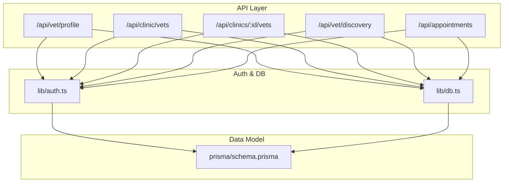
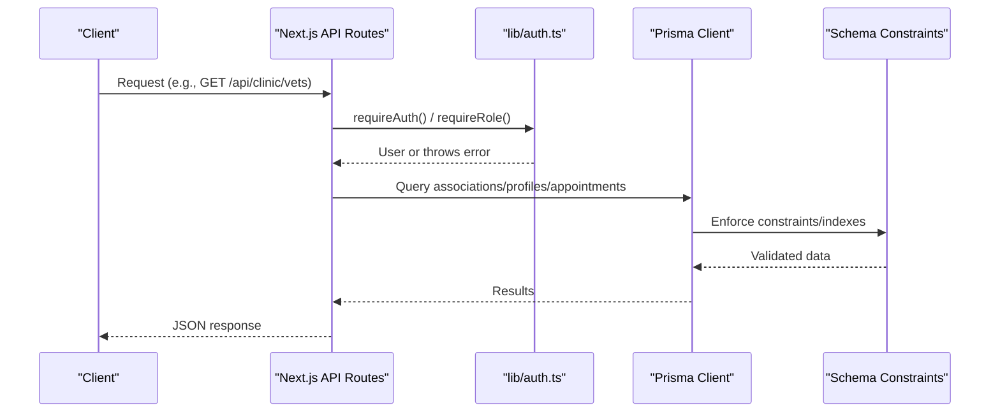
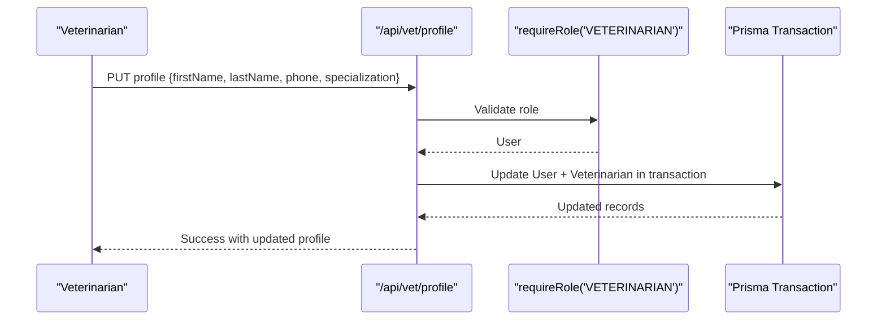
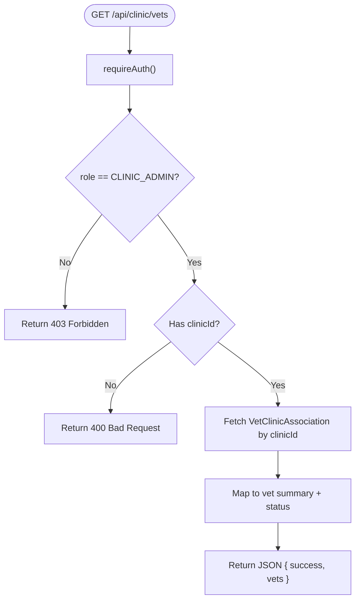
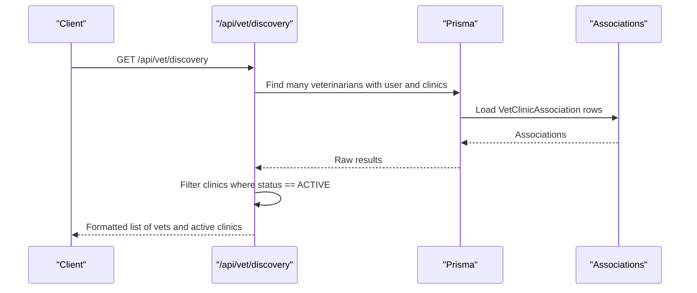
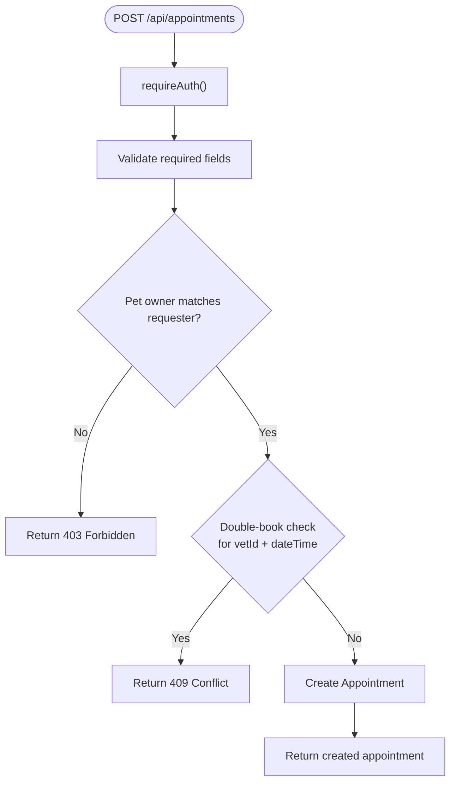
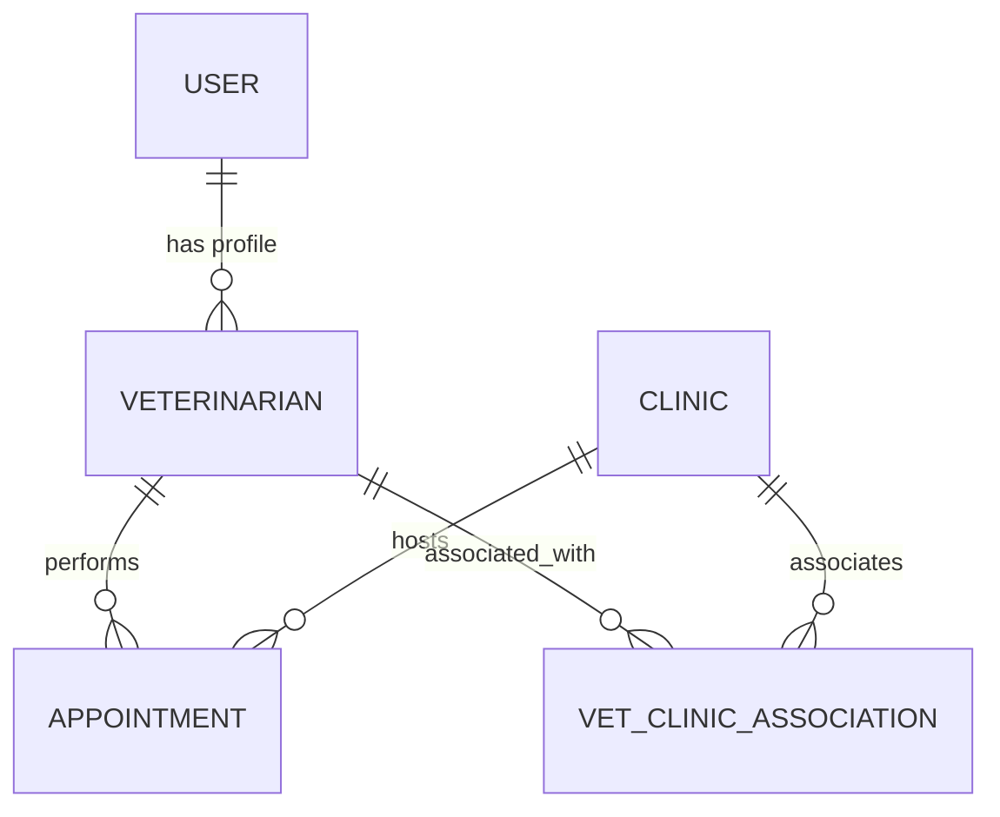
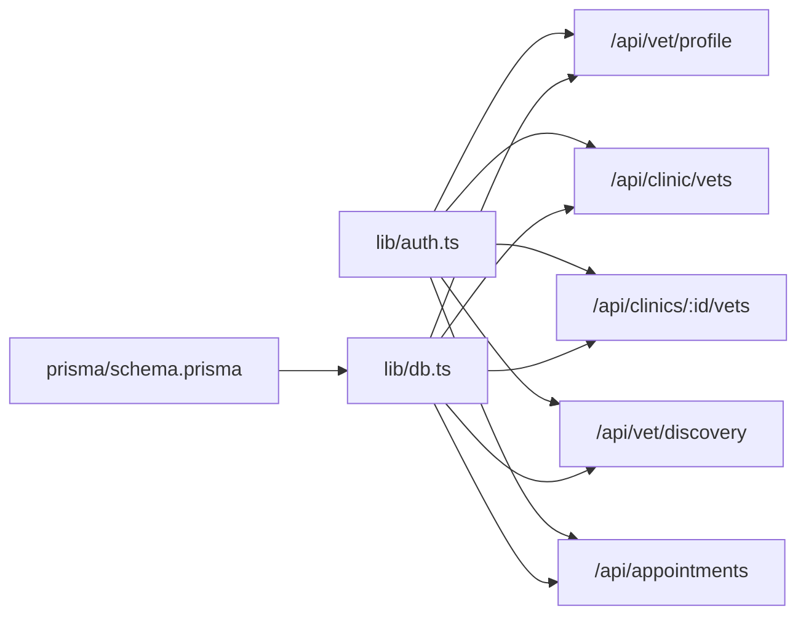

# Staff Management

<cite>
**Referenced Files in This Document**
- [schema.prisma](file://prisma/schema.prisma)
- [auth.ts](file://lib/auth.ts)
- [db.ts](file://lib/db.ts)
- [route.ts (clinic vets)](file://app/api/clinic/vets/route.ts)
- [route.ts (clinics by id vets)](file://app/api/clinics/[clinicId]/vets/route.ts)
- [route.ts (vet profile)](file://app/api/vet/profile/route.ts)
- [route.ts (appointments)](file://app/api/appointments/route.ts)
- [route.ts (vet discovery)](file://app/api/vet/discovery/route.ts)
- [database-design.md](file://docs/03-architecture/02-database-design.md)
- [api-specification.md](file://docs/03-architecture/03-api-specification.md)
</cite>

## Table of Contents
1. Introduction
2. Project Structure
3. Core Components
4. Architecture Overview
5. Detailed Component Analysis
6. Dependency Analysis
7. Performance Considerations
8. Troubleshooting Guide
9. Conclusion

## Introduction
This document explains the Staff Management system for PETIVA with a focus on veterinarian staff administration. It covers vet profile creation and management, specialization assignment, verification status tracking, clinic association workflows, appointment-based availability signaling, and administrative operations for adding and managing vets at clinics. It also outlines data validation rules, business constraints, and compliance considerations grounded in the implemented schema and API endpoints.

## Project Structure
The staff management features are implemented across:
- Data model definitions in Prisma schema
- Authentication and authorization helpers
- REST API routes for vet profiles, clinic-vet associations, vet discovery, and appointments
- Documentation describing database design and API contracts

**Diagram sources**
- [schema.prisma:9-14](file://prisma/schema.prisma#L9-L14)
- [schema.prisma:30-53](file://prisma/schema.prisma#L30-L53)
- [schema.prisma:90-131](file://prisma/schema.prisma#L90-L131)
- [route.ts (vet profile):1-48](file://app/api/vet/profile/route.ts#L1-L48)
- [route.ts (clinic vets):1-65](file://app/api/clinic/vets/route.ts#L1-L65)
- [route.ts (clinics by id vets):1-56](file://app/api/clinics/[clinicId]/vets/route.ts#L1-L56)
- [route.ts (vet discovery):1-60](file://app/api/vet/discovery/route.ts#L1-L60)
- [route.ts (appointments):1-143](file://app/api/appointments/route.ts#L1-L143)
- [auth.ts:109-124](file://lib/auth.ts#L109-L124)
- [db.ts:1-33](file://lib/db.ts#L1-L33)

**Section sources**
- [schema.prisma:9-14](file://prisma/schema.prisma#L9-L14)
- [schema.prisma:30-53](file://prisma/schema.prisma#L30-L53)
- [schema.prisma:90-131](file://prisma/schema.prisma#L90-L131)
- [route.ts (vet profile):1-48](file://app/api/vet/profile/route.ts#L1-L48)
- [route.ts (clinic vets):1-65](file://app/api/clinic/vets/route.ts#L1-L65)
- [route.ts (clinics by id vets):1-56](file://app/api/clinics/[clinicId]/vets/route.ts#L1-L56)
- [route.ts (vet discovery):1-60](file://app/api/vet/discovery/route.ts#L1-L60)
- [route.ts (appointments):1-143](file://app/api/appointments/route.ts#L1-L143)
- [auth.ts:109-124](file://lib/auth.ts#L109-L124)
- [db.ts:1-33](file://lib/db.ts#L1-L33)

## Core Components
- Veterinarian Profile Management: Read and update professional details and specialization for authenticated veterinarians.
- Clinic-Vet Association: List and manage relationships between clinics and veterinarians, including association status.
- Vet Discovery: Browse verified veterinarians and their active clinic associations.
- Appointment-Based Availability Signaling: Use appointment bookings to infer time-slot occupancy and support scheduling workflows.
- Authentication and Authorization: Enforce role-based access for staff-related operations.

Key capabilities:
- Vet profile retrieval and updates for VETERINARIAN users
- Clinic administrators can list associated vets for their clinic
- Vet discovery endpoint returns only ACTIVE clinic associations
- Appointment creation enforces ownership and prevents double-booking

**Section sources**
- [route.ts (vet profile):1-100](file://app/api/vet/profile/route.ts#L1-L100)
- [route.ts (clinic vets):1-65](file://app/api/clinic/vets/route.ts#L1-L65)
- [route.ts (clinics by id vets):1-56](file://app/api/clinics/[clinicId]/vets/route.ts#L1-L56)
- [route.ts (vet discovery):1-60](file://app/api/vet/discovery/route.ts#L1-L60)
- [route.ts (appointments):1-143](file://app/api/appointments/route.ts#L1-L143)
- [schema.prisma:90-131](file://prisma/schema.prisma#L90-L131)

## Architecture Overview
The staff management architecture centers on role-based APIs backed by a relational data model. Authentication is enforced via session cookies and role checks. Data integrity is maintained through Prisma schema constraints and transactional checks where needed.

**Diagram sources**
- [auth.ts:109-124](file://lib/auth.ts#L109-L124)
- [route.ts (clinic vets):1-65](file://app/api/clinic/vets/route.ts#L1-L65)
- [route.ts (vet profile):1-48](file://app/api/vet/profile/route.ts#L1-L48)
- [route.ts (appointments):1-143](file://app/api/appointments/route.ts#L1-L143)
- [schema.prisma:90-131](file://prisma/schema.prisma#L90-L131)

## Detailed Component Analysis

### Veterinarian Profile Management
- Purpose: Allow veterinarians to read and update their professional profile fields such as name, phone, and specialization.
- Access Control: Requires VETERINARIAN role; returns 403 for unauthorized roles.
- Data Updates: Uses a database transaction to atomically update both User and Veterinarian records.

**Diagram sources**
- [route.ts (vet profile):50-99](file://app/api/vet/profile/route.ts#L50-L99)
- [auth.ts:117-124](file://lib/auth.ts#L117-L124)
- [schema.prisma:30-53](file://prisma/schema.prisma#L30-L53)
- [schema.prisma:90-105](file://prisma/schema.prisma#L90-L105)

**Section sources**
- [route.ts (vet profile):1-100](file://app/api/vet/profile/route.ts#L1-L100)
- [schema.prisma:30-53](file://prisma/schema.prisma#L30-L53)
- [schema.prisma:90-105](file://prisma/schema.prisma#L90-L105)

### Clinic-Vet Association and Listing
- Purpose: Enable clinic administrators to view all veterinarians associated with their clinic, including vet details and association status.
- Access Control: Requires CLINIC_ADMIN role and an associated clinicId.
- Data Returned: Vet identifiers, specialization, license number, verification status, personal details, and association status.

**Diagram sources**
- [route.ts (clinic vets):5-65](file://app/api/clinic/vets/route.ts#L5-L65)
- [schema.prisma:107-131](file://prisma/schema.prisma#L107-L131)

**Section sources**
- [route.ts (clinic vets):1-65](file://app/api/clinic/vets/route.ts#L1-L65)
- [schema.prisma:107-131](file://prisma/schema.prisma#L107-L131)

### Vet Discovery and Active Clinic Filtering
- Purpose: Provide a browsable list of veterinarians and their active clinic associations.
- Behavior: Filters associations to include only ACTIVE status when returning clinic information.

**Diagram sources**
- [route.ts (vet discovery):1-60](file://app/api/vet/discovery/route.ts#L1-L60)
- [schema.prisma:121-131](file://prisma/schema.prisma#L121-L131)

**Section sources**
- [route.ts (vet discovery):1-60](file://app/api/vet/discovery/route.ts#L1-L60)
- [schema.prisma:121-131](file://prisma/schema.prisma#L121-L131)

### Appointment-Based Availability Signaling
- Purpose: Support scheduling workflows by creating appointments that indicate vet availability and prevent double-booking.
- Validation: Ensures pet ownership and checks for conflicts within the same time slot using a transaction.

**Diagram sources**
- [route.ts (appointments):69-143](file://app/api/appointments/route.ts#L69-L143)
- [schema.prisma:164-182](file://prisma/schema.prisma#L164-L182)

**Section sources**
- [route.ts (appointments):1-143](file://app/api/appointments/route.ts#L1-L143)
- [schema.prisma:164-182](file://prisma/schema.prisma#L164-L182)

### Data Model Relationships for Staff Management
The core entities involved in staff management are:
- User: Base identity and role
- Veterinarian: Professional profile linked to a User
- Clinic: Practice location
- VetClinicAssociation: Many-to-many mapping with status
- Appointment: Links vet, clinic, and time slots

**Diagram sources**
- [schema.prisma:30-53](file://prisma/schema.prisma#L30-L53)
- [schema.prisma:90-131](file://prisma/schema.prisma#L90-L131)
- [schema.prisma:164-182](file://prisma/schema.prisma#L164-L182)
- [database-design.md:9-41](file://docs/03-architecture/02-database-design.md#L9-L41)

**Section sources**
- [schema.prisma:30-53](file://prisma/schema.prisma#L30-L53)
- [schema.prisma:90-131](file://prisma/schema.prisma#L90-L131)
- [schema.prisma:164-182](file://prisma/schema.prisma#L164-L182)
- [database-design.md:9-41](file://docs/03-architecture/02-database-design.md#L9-L41)

## Dependency Analysis
- Authentication dependency: All staff-related endpoints rely on requireAuth or requireRole from lib/auth.ts to enforce session validity and role checks.
- Database dependency: All endpoints use prisma client configured in lib/db.ts to interact with PostgreSQL via Prisma ORM.
- Schema constraints: Unique indexes and foreign keys ensure data integrity for vet licenses, associations, and appointments.

**Diagram sources**
- [auth.ts:109-124](file://lib/auth.ts#L109-L124)
- [db.ts:1-33](file://lib/db.ts#L1-L33)
- [schema.prisma:9-14](file://prisma/schema.prisma#L9-L14)
- [schema.prisma:30-53](file://prisma/schema.prisma#L30-L53)
- [schema.prisma:90-131](file://prisma/schema.prisma#L90-L131)
- [schema.prisma:164-182](file://prisma/schema.prisma#L164-L182)

**Section sources**
- [auth.ts:109-124](file://lib/auth.ts#L109-L124)
- [db.ts:1-33](file://lib/db.ts#L1-L33)
- [schema.prisma:9-14](file://prisma/schema.prisma#L9-L14)
- [schema.prisma:30-53](file://prisma/schema.prisma#L30-L53)
- [schema.prisma:90-131](file://prisma/schema.prisma#L90-L131)
- [schema.prisma:164-182](file://prisma/schema.prisma#L164-L182)

## Performance Considerations
- Indexing: Appointments are indexed by vetId and dateTime to optimize conflict checks and listing queries.
- Transactions: Double-booking prevention uses a transaction to avoid race conditions during concurrent booking attempts.
- Selective Includes: Endpoints fetch only necessary fields to reduce payload size and improve response times.
- Session Sliding Expiration: Sessions extend automatically near expiry to reduce re-authentication overhead.

[No sources needed since this section provides general guidance]

## Troubleshooting Guide
Common issues and resolutions:
- Unauthorized access: Ensure the user is authenticated and has the required role (e.g., CLINIC_ADMIN for clinic vet listing).
- Missing clinic association: Clinic admins must have a clinicId set; otherwise, requests return a bad request.
- Duplicate license numbers: The Veterinarian model enforces unique licenseNumber; duplicates will fail at the database level.
- Double-booking conflicts: Appointment creation checks for existing REQUESTED or CONFIRMED appointments at the same time slot; resolve by selecting another time or vet.
- Profile not found: Veterinarian profile endpoints return NOT_FOUND if no profile exists for the authenticated user.

**Section sources**
- [route.ts (clinic vets):5-65](file://app/api/clinic/vets/route.ts#L5-L65)
- [route.ts (vet profile):1-48](file://app/api/vet/profile/route.ts#L1-L48)
- [route.ts (appointments):69-143](file://app/api/appointments/route.ts#L69-L143)
- [schema.prisma:90-105](file://prisma/schema.prisma#L90-L105)
- [schema.prisma:164-182](file://prisma/schema.prisma#L164-L182)

## Conclusion
PETIVA’s Staff Management system provides robust mechanisms for veterinarian profile management, clinic-vet associations, vet discovery, and appointment-driven scheduling. Role-based authentication and schema constraints ensure secure and consistent operations. While primary/associate/consultant role distinctions are not explicitly modeled in the current schema, the association status and role-based endpoints enable foundational workflows for clinic staff administration. Future enhancements can introduce explicit role types within associations and expand availability scheduling with dedicated working hours and time-off tracking.

[No sources needed since this section summarizes without analyzing specific files]