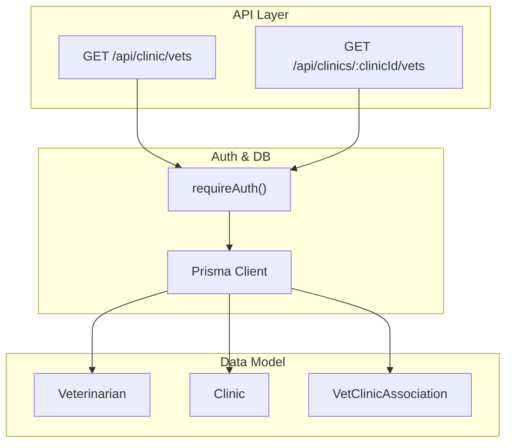
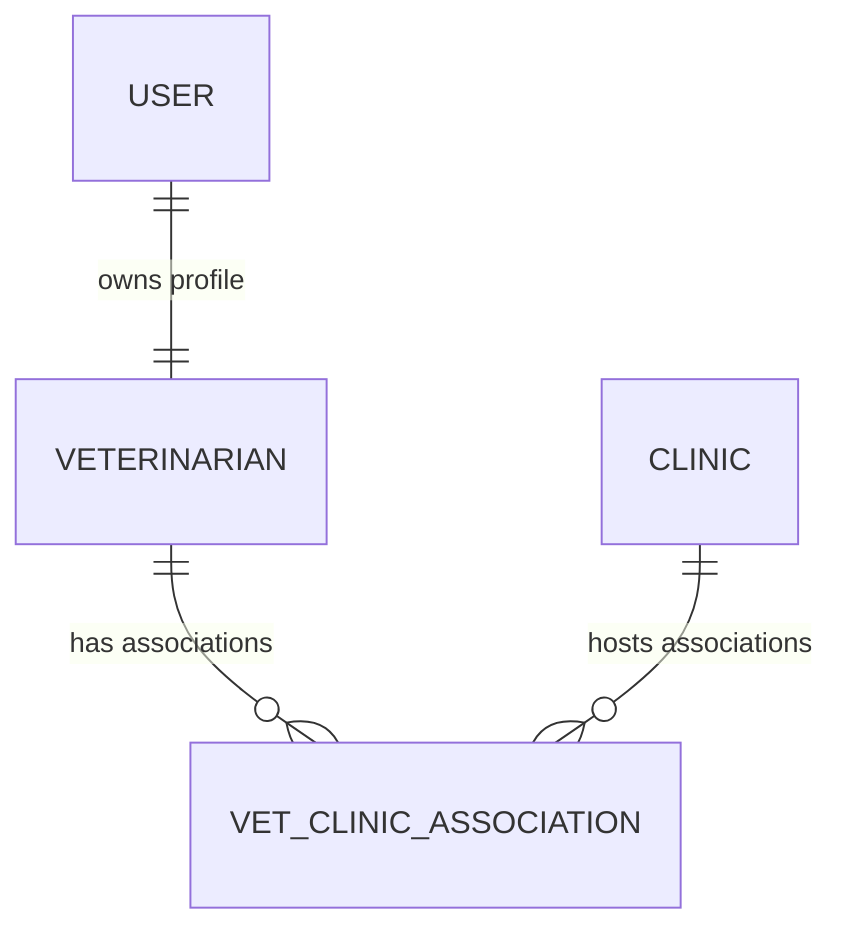
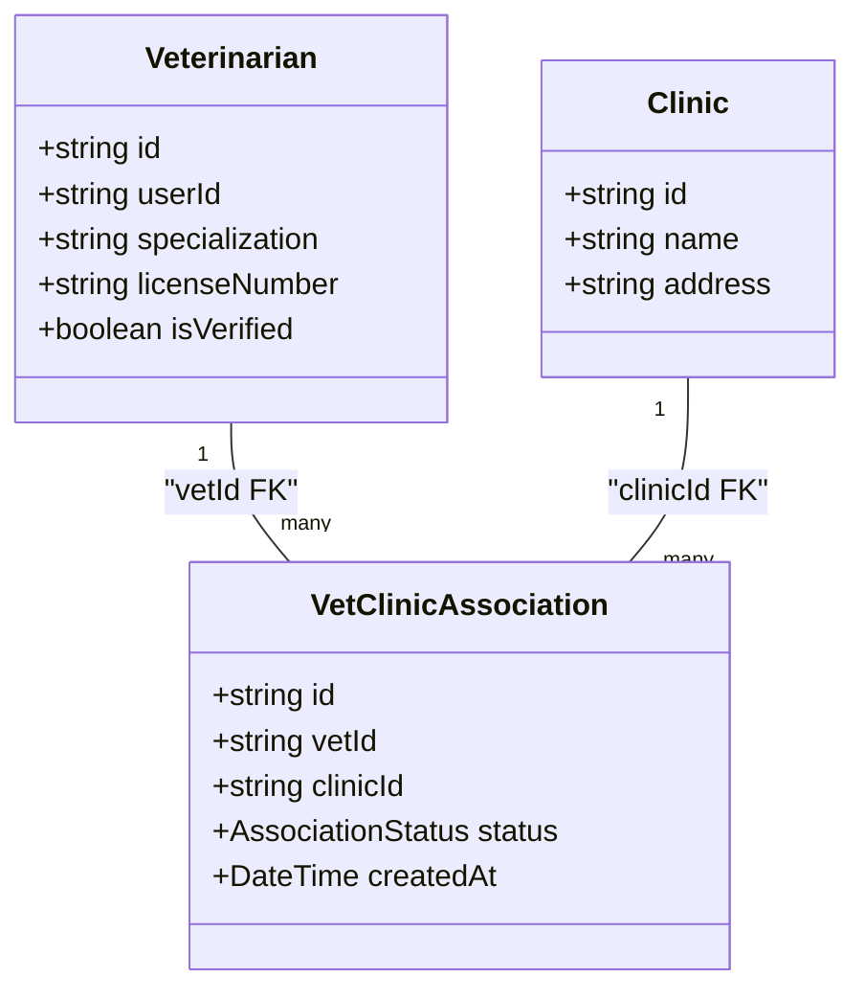
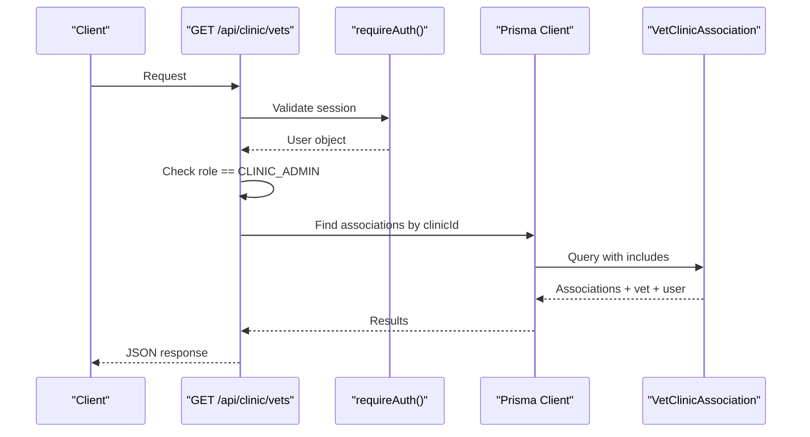
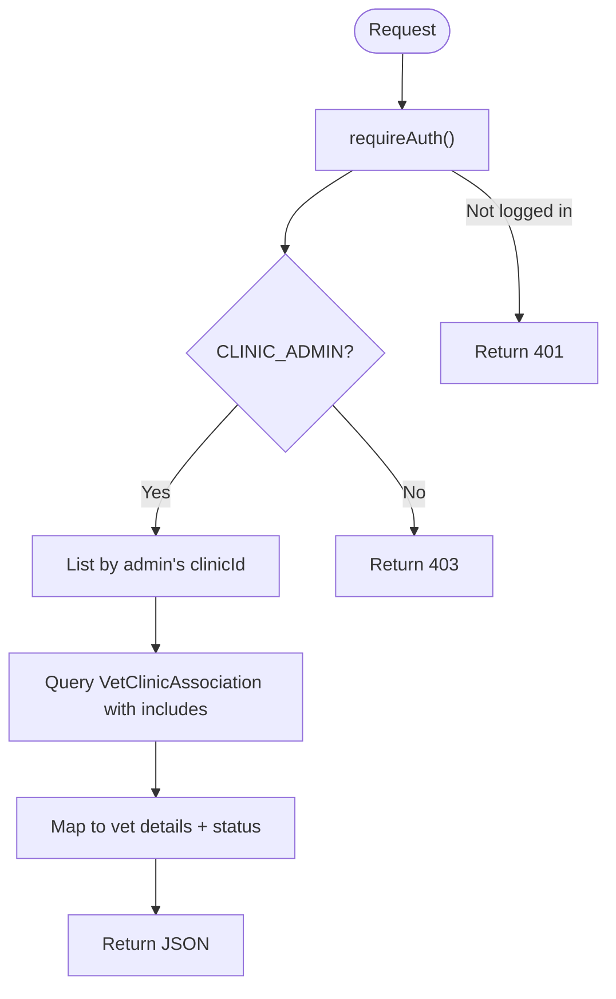
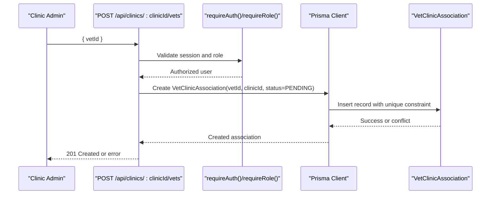
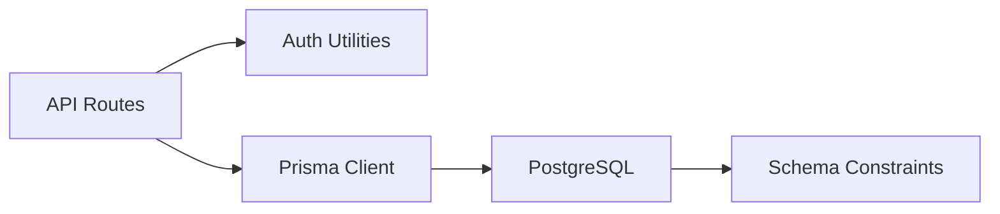

# Vet-Clinic Associations

<cite>
**Referenced Files in This Document**
- [schema.prisma](file://prisma/schema.prisma)
- [database-design.md](file://docs/03-architecture/02-database-design.md)
- [api-specification.md](file://docs/03-architecture/03-api-specification.md)
- [route.ts (clinic vets)](file://app/api/clinic/vets/route.ts)
- [route.ts (clinics by id vets)](file://app/api/clinics/[clinicId]/vets/route.ts)
- [auth.ts](file://lib/auth.ts)
- [db.ts](file://lib/db.ts)
- [migration.sql](file://prisma/migrations/20260825091722_init/migration.sql)
</cite>

## Table of Contents
1. [Introduction](#introduction)
2. [Project Structure](#project-structure)
3. [Core Components](#core-components)
4. [Architecture Overview](#architecture-overview)
5. [Detailed Component Analysis](#detailed-component-analysis)
6. [Dependency Analysis](#dependency-analysis)
7. [Performance Considerations](#performance-considerations)
8. [Troubleshooting Guide](#troubleshooting-guide)
9. [Conclusion](#conclusion)
10. [Appendices](#appendices)

## Introduction
This document explains the Vet-Clinic Association system within PETIVA, focusing on how veterinarians are associated with clinics, how access control is enforced, and how data integrity is maintained. It covers the association data model, constraints, workflows for assigning and managing roles, and performance considerations for complex queries. It also outlines audit logging and reporting capabilities relevant to clinic staffing analysis.

## Project Structure
The Vet-Clinic Association feature spans:
- Data model definitions in Prisma schema
- API endpoints for listing and associating vets with clinics
- Authentication and authorization utilities
- Database configuration and migrations

**Diagram sources**
- [route.ts (clinic vets):5-51](file://app/api/clinic/vets/route.ts#L5-L51)
- [route.ts (clinics by id vets):6-42](file://app/api/clinics/[clinicId]/vets/route.ts#L6-L42)
- [auth.ts:109-124](file://lib/auth.ts#L109-L124)
- [schema.prisma:90-131](file://prisma/schema.prisma#L90-L131)

**Section sources**
- [schema.prisma:90-131](file://prisma/schema.prisma#L90-L131)
- [route.ts (clinic vets):5-51](file://app/api/clinic/vets/route.ts#L5-L51)
- [route.ts (clinics by id vets):6-42](file://app/api/clinics/[clinicId]/vets/route.ts#L6-L42)
- [auth.ts:109-124](file://lib/auth.ts#L109-L124)

## Core Components
- Veterinarian profile and verification state
- Clinic entity representing a practice location
- VetClinicAssociation join table linking vets to clinics with status tracking
- Role-based access control via user roles and session validation
- API endpoints to list clinic-associated vets

Key responsibilities:
- Enforce that only authenticated users can access vet lists
- Restrict clinic-specific operations to clinic administrators
- Provide vet details including specialization, license number, verification status, and association status

**Section sources**
- [schema.prisma:90-131](file://prisma/schema.prisma#L90-L131)
- [route.ts (clinic vets):5-51](file://app/api/clinic/vets/route.ts#L5-L51)
- [route.ts (clinics by id vets):6-42](file://app/api/clinics/[clinicId]/vets/route.ts#L6-L42)
- [auth.ts:109-124](file://lib/auth.ts#L109-L124)

## Architecture Overview
The system uses a many-to-many relationship between Veterinarian and Clinic through VetClinicAssociation. Access control is enforced at the API layer using role checks and session validation. Queries include vet profiles and user details to present comprehensive information.

**Diagram sources**
- [schema.prisma:90-131](file://prisma/schema.prisma#L90-L131)

**Section sources**
- [database-design.md:96-104](file://docs/03-architecture/02-database-design.md#L96-L104)
- [schema.prisma:90-131](file://prisma/schema.prisma#L90-L131)

## Detailed Component Analysis

### Data Model and Relationships
- Veterinarian: Represents a practitioner with unique license number and verification state.
- Clinic: Represents a practice location.
- VetClinicAssociation: Join table with composite unique constraint on (vetId, clinicId), ensuring one association per vet-clinic pair. Status indicates PENDING, ACTIVE, or INACTIVE.

Constraints and integrity:
- Unique composite index prevents duplicate associations.
- Foreign keys cascade deletes to maintain referential integrity.

**Diagram sources**
- [schema.prisma:90-131](file://prisma/schema.prisma#L90-L131)

**Section sources**
- [schema.prisma:90-131](file://prisma/schema.prisma#L90-L131)
- [database-design.md:96-104](file://docs/03-architecture/02-database-design.md#L96-L104)

### Role-Based Permissions and Access Control
- requireAuth(): Ensures the request has a valid session; throws UNAUTHENTICATED if not logged in.
- requireRole(): Validates that the current user’s role matches allowed roles; throws FORBIDDEN otherwise.
- Clinic admin enforcement: The GET /api/clinic/vets endpoint explicitly checks for CLINIC_ADMIN and ensures the admin has an associated clinicId before querying associations.

**Diagram sources**
- [route.ts (clinic vets):5-51](file://app/api/clinic/vets/route.ts#L5-L51)
- [auth.ts:109-124](file://lib/auth.ts#L109-L124)

**Section sources**
- [auth.ts:109-124](file://lib/auth.ts#L109-L124)
- [route.ts (clinic vets):5-51](file://app/api/clinic/vets/route.ts#L5-L51)

### Listing Associated Vets
Two endpoints provide vet listings:
- GET /api/clinic/vets: Restricted to CLINIC_ADMIN with a linked clinicId; returns all associations for that clinic.
- GET /api/clinics/:clinicId/vets: Requires authentication; returns associations for the specified clinic.

Both endpoints return vet details including specialization, license number, verification status, and user name/email, along with association status.

**Diagram sources**
- [route.ts (clinic vets):5-51](file://app/api/clinic/vets/route.ts#L5-L51)
- [route.ts (clinics by id vets):6-42](file://app/api/clinics/[clinicId]/vets/route.ts#L6-L42)

**Section sources**
- [route.ts (clinic vets):5-51](file://app/api/clinic/vets/route.ts#L5-L51)
- [route.ts (clinics by id vets):6-42](file://app/api/clinics/[clinicId]/vets/route.ts#L6-L42)

### Assigning Vets to Clinics (Workflow)
According to the API specification:
- POST /api/clinics/:clinicId/vets associates a vet with a clinic.
- Authorization requires CLINIC_ADMIN or platform admin.
- Request body includes vetId.

Note: The current codebase exposes GET endpoints for listing; assignment logic is documented but not implemented in the examined files.

**Diagram sources**
- [api-specification.md:179-189](file://docs/03-architecture/03-api-specification.md#L179-L189)
- [schema.prisma:121-131](file://prisma/schema.prisma#L121-L131)

**Section sources**
- [api-specification.md:179-189](file://docs/03-architecture/03-api-specification.md#L179-L189)
- [schema.prisma:121-131](file://prisma/schema.prisma#L121-L131)

### Managing Role Changes Within Clinics
Current implementation does not define clinic-level roles such as primary vet, associate vet, or consultant. The association model tracks status (PENDING, ACTIVE, INACTIVE) but not role granularity. To support role-based permissions within each clinic:
- Extend VetClinicAssociation with a role field (e.g., PRIMARY_VET, ASSOCIATE_VET, CONSULTANT).
- Add validation to ensure at most one PRIMARY_VET per clinic.
- Update APIs to enforce role-based access when reading/writing clinic resources.

[No sources needed since this section proposes enhancements beyond current implementation]

### Handling Vet Departures or Transfers
- To remove a vet from a clinic: Delete the VetClinicAssociation row for that vetId and clinicId.
- To transfer a vet’s primary role: Update the role field (once added) and adjust constraints accordingly.
- Cascade delete behavior ensures referential integrity when related entities are removed.

**Section sources**
- [schema.prisma:121-131](file://prisma/schema.prisma#L121-L131)

### Common Scenarios
- Adding a vet to multiple clinics with different roles:
  - Create separate VetClinicAssociation entries per clinic.
  - Once role fields are added, assign appropriate roles per clinic.
- Promoting associate vets to primary positions:
  - Update the role field for the specific clinic association.
  - Enforce uniqueness constraints to prevent multiple primaries per clinic.
- Revoking clinic access when vets leave:
  - Delete the association or set status to INACTIVE depending on policy.

[No sources needed since these scenarios describe usage patterns based on the existing model]

## Dependency Analysis
The Vet-Clinic Association feature depends on:
- Authentication utilities for session validation and role checks
- Prisma client configured for PostgreSQL with connection pooling
- Database schema defining relationships and constraints

**Diagram sources**
- [db.ts:1-33](file://lib/db.ts#L1-L33)
- [auth.ts:109-124](file://lib/auth.ts#L109-L124)
- [schema.prisma:121-131](file://prisma/schema.prisma#L121-L131)

**Section sources**
- [db.ts:1-33](file://lib/db.ts#L1-L33)
- [auth.ts:109-124](file://lib/auth.ts#L109-L124)
- [schema.prisma:121-131](file://prisma/schema.prisma#L121-L131)

## Performance Considerations
- Indexes:
  - Composite unique index on (vetId, clinicId) prevents duplicates and speeds up lookups.
  - Additional indexes exist for Appointment and MedicalRecordVersion to optimize common queries.
- Query optimization:
  - Use selective includes to fetch only necessary related data (e.g., vet.user fields).
  - Filter by clinicId early to reduce result sets.
- Connection pooling:
  - Production uses a dedicated pool; development reuses global instances to avoid hot-reload overhead.

Recommendations:
- Add indexes on frequently filtered fields (e.g., status) if needed.
- Paginate large vet lists to reduce payload size.
- Cache read-heavy clinic staff lists where appropriate.

**Section sources**
- [schema.prisma:121-131](file://prisma/schema.prisma#L121-L131)
- [migration.sql:305-324](file://prisma/migrations/20260825091722_init/migration.sql#L305-L324)
- [db.ts:10-29](file://lib/db.ts#L10-L29)

## Troubleshooting Guide
Common issues and resolutions:
- 401 Unauthorized:
  - Cause: Missing or invalid session token.
  - Resolution: Ensure login flow sets session cookie; verify requireAuth() usage.
- 403 Forbidden:
  - Cause: Insufficient role (e.g., non-CLINIC_ADMIN accessing clinic-only endpoints).
  - Resolution: Verify user role and clinic association; use requireRole() where appropriate.
- Duplicate association errors:
  - Cause: Attempting to create a second association for the same vetId and clinicId.
  - Resolution: Update existing association instead of creating a new one.
- Missing clinicId for admin:
  - Cause: Clinic admin without an associated clinic.
  - Resolution: Ensure admin user has clinicId set before listing or managing vets.

**Section sources**
- [route.ts (clinic vets):5-21](file://app/api/clinic/vets/route.ts#L5-L21)
- [auth.ts:109-124](file://lib/auth.ts#L109-L124)
- [schema.prisma:121-131](file://prisma/schema.prisma#L121-L131)

## Conclusion
PETIVA’s Vet-Clinic Association system provides a robust foundation for linking veterinarians to clinics with clear constraints and access controls. While the current model supports multi-clinic assignments and status tracking, it does not yet implement clinic-level roles (primary, associate, consultant). Extending the association model with role fields and enforcing constraints will enable finer-grained permissions and streamlined workflows for promotions, transfers, and departures. Audit logging and reporting can be built atop the existing structure to support staffing analysis and compliance.

## Appendices

### API Endpoints Summary
- GET /api/clinic/vets: Lists vets associated with the admin’s clinic (CLINIC_ADMIN only).
- GET /api/clinics/:clinicId/vets: Lists vets associated with a specific clinic (authenticated).
- POST /api/clinics/:clinicId/vets: Associates a vet with a clinic (CLINIC_ADMIN or platform admin).

**Section sources**
- [route.ts (clinic vets):5-51](file://app/api/clinic/vets/route.ts#L5-L51)
- [route.ts (clinics by id vets):6-42](file://app/api/clinics/[clinicId]/vets/route.ts#L6-L42)
- [api-specification.md:179-189](file://docs/03-architecture/03-api-specification.md#L179-L189)

### Audit Logging and Reporting
- AuditLog table captures sensitive operations with timestamps, actor IDs, and payloads.
- For association changes, log actions such as granting or revoking clinic access.
- Reporting:
  - Staffing analysis: Count active associations per clinic, track status transitions over time.
  - Compliance: Review audit logs for unauthorized attempts and corrective actions.

**Section sources**
- [schema.prisma:298-311](file://prisma/schema.prisma#L298-L311)
- [database-design.md:439-448](file://docs/03-architecture/02-database-design.md#L439-L448)