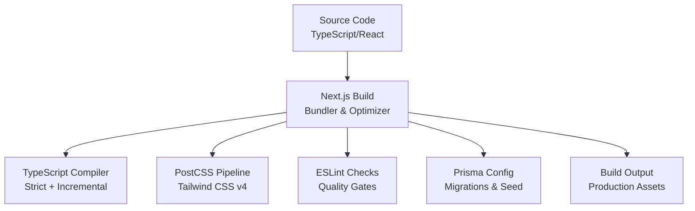
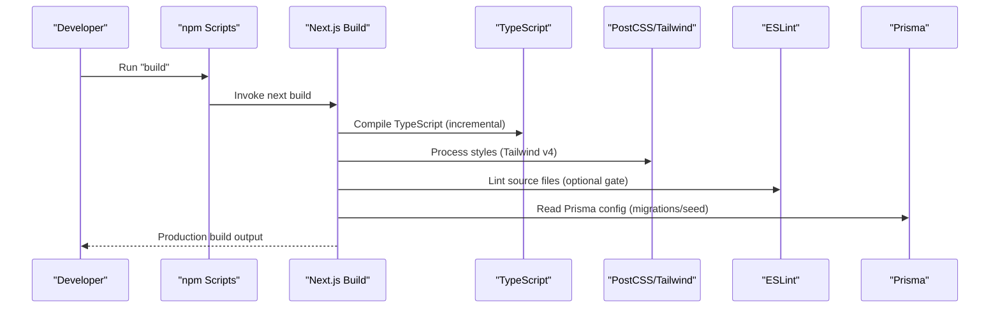
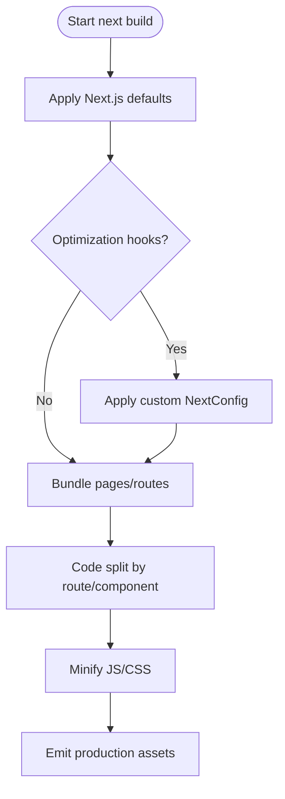
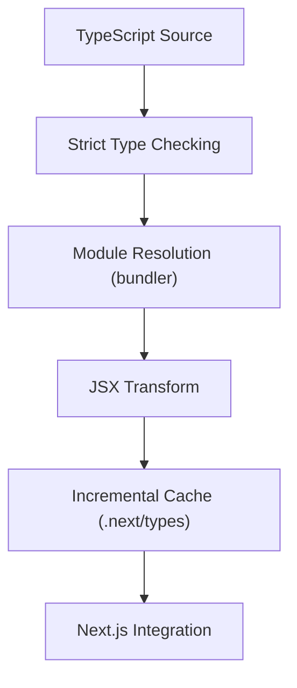
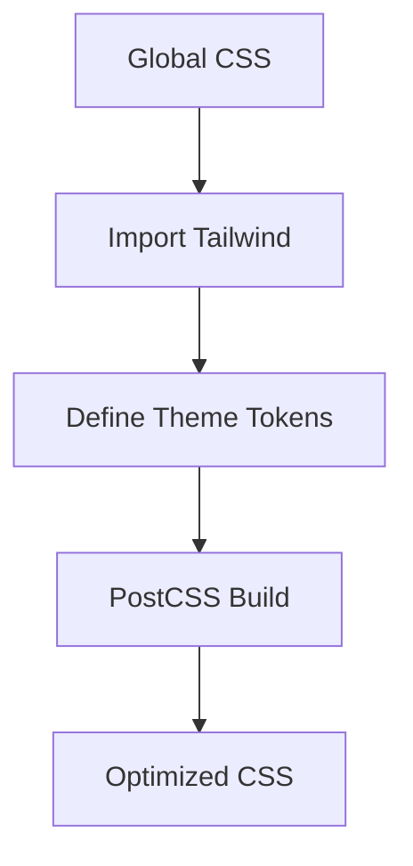
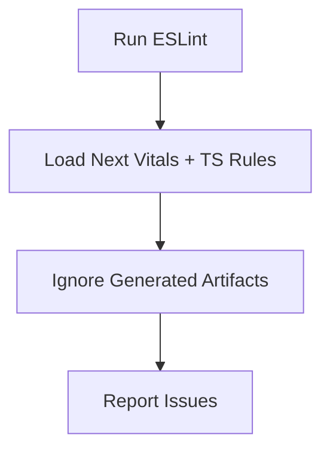
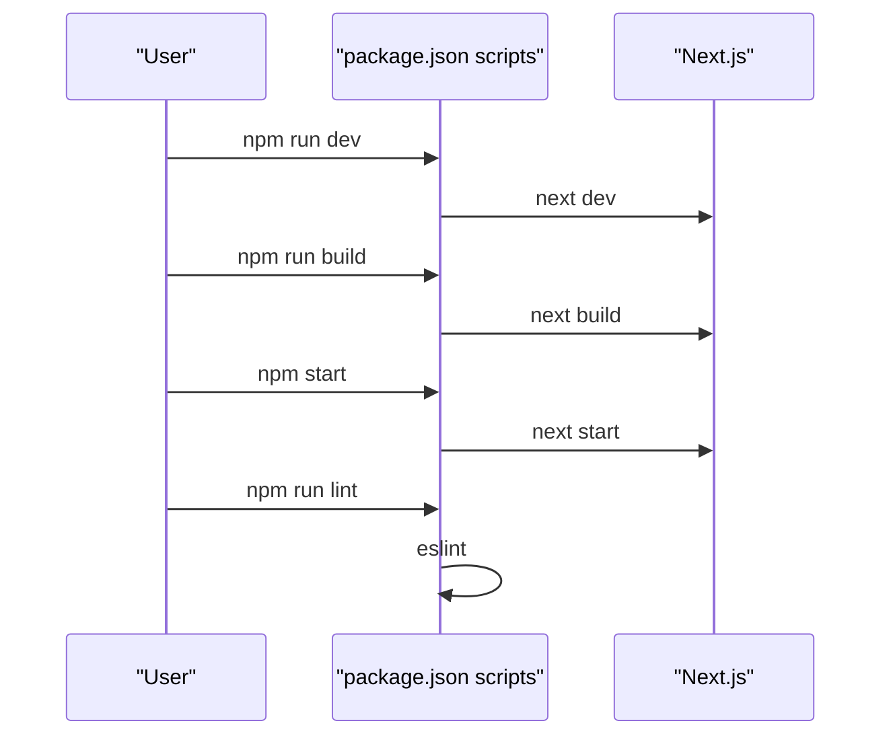
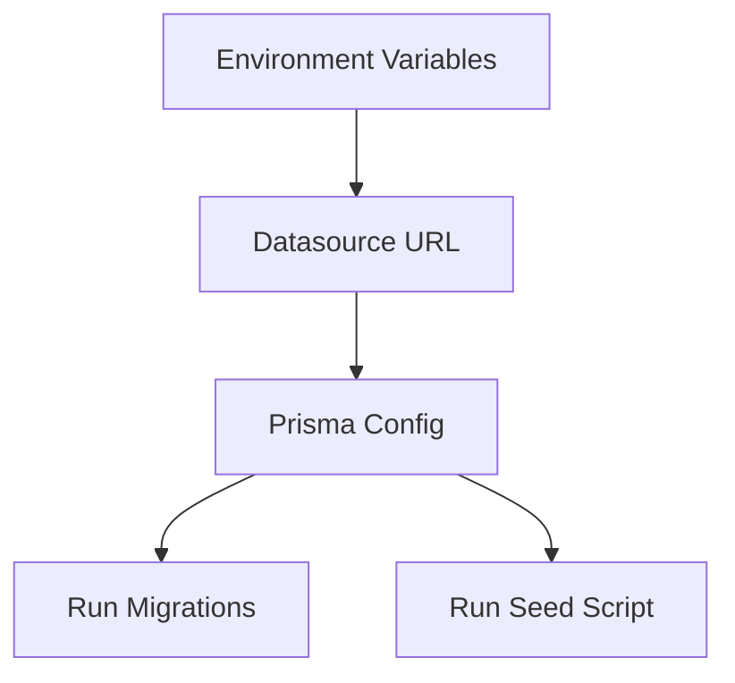
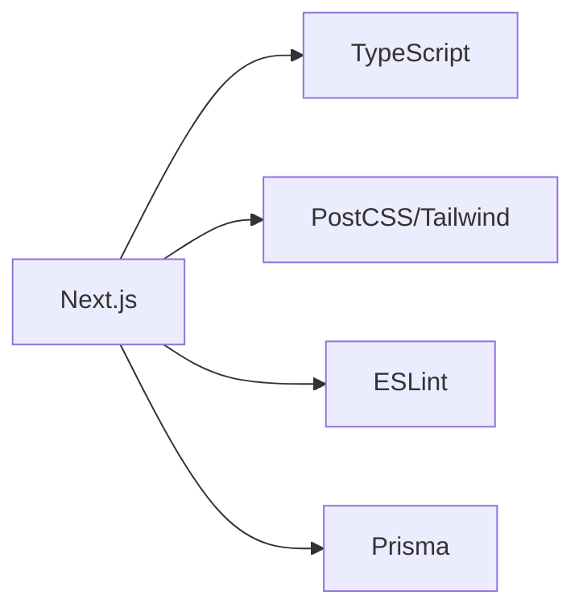

# Build Process & Optimization

<cite>
**Referenced Files in This Document**
- [package.json](file://package.json)
- [next.config.ts](file://next.config.ts)
- [tsconfig.json](file://tsconfig.json)
- [postcss.config.mjs](file://postcss.config.mjs)
- [eslint.config.mjs](file://eslint.config.mjs)
- [globals.css](file://app/globals.css)
- [prisma.config.ts](file://prisma.config.ts)
</cite>

## Table of Contents
1. [Introduction](#introduction)
2. [Project Structure](#project-structure)
3. [Core Components](#core-components)
4. [Architecture Overview](#architecture-overview)
5. [Detailed Component Analysis](#detailed-component-analysis)
6. [Dependency Analysis](#dependency-analysis)
7. [Performance Considerations](#performance-considerations)
8. [Troubleshooting Guide](#troubleshooting-guide)
9. [Conclusion](#conclusion)
10. [Appendices](#appendices)

## Introduction
This document explains the PETIVA build process and optimization strategies for a Next.js application. It covers bundling, code splitting, asset optimization, TypeScript compilation, PostCSS processing for Tailwind CSS v4, ESLint configuration, and build scripts. It also provides guidance on performance techniques (image optimization, font loading), bundle size analysis, debugging build issues, optimizing build times, and configuring different build profiles for various deployment targets.

## Project Structure
The project uses a modern Next.js setup with:
- A minimal Next.js configuration file for future extensibility
- TypeScript compilation configured for strict mode and incremental builds
- PostCSS pipeline integrated with Tailwind CSS v4
- ESLint configured using Next’s recommended configs
- Prisma configuration for database migrations and seeding

**Diagram sources**
- [next.config.ts:1-8](file://next.config.ts#L1-L8)
- [tsconfig.json:1-35](file://tsconfig.json#L1-L35)
- [postcss.config.mjs:1-8](file://postcss.config.mjs#L1-L8)
- [eslint.config.mjs:1-19](file://eslint.config.mjs#L1-L19)
- [prisma.config.ts:1-16](file://prisma.config.ts#L1-L16)

**Section sources**
- [next.config.ts:1-8](file://next.config.ts#L1-L8)
- [tsconfig.json:1-35](file://tsconfig.json#L1-L35)
- [postcss.config.mjs:1-8](file://postcss.config.mjs#L1-L8)
- [eslint.config.mjs:1-19](file://eslint.config.mjs#L1-L19)
- [prisma.config.ts:1-16](file://prisma.config.ts#L1-L16)

## Core Components
- Build scripts: Development, production, linting, and server start commands are defined in package.json.
- Next.js configuration: An empty NextConfig object is exported, enabling Next.js defaults and leaving room for custom optimizations.
- TypeScript settings: Strict mode, ES target, module resolution via bundler, JSX transform, path aliases, and incremental compilation.
- PostCSS pipeline: Tailwind CSS v4 plugin is registered to process styles during build.
- ESLint configuration: Uses Next’s core web vitals and TypeScript rules; ignores generated/build artifacts.
- Prisma configuration: Defines schema location, migration directory, seed script, and datasource URL from environment.

Key responsibilities:
- package.json orchestrates dev, build, start, and lint workflows.
- next.config.ts is the central place to add bundling and runtime optimizations.
- tsconfig.json ensures type safety and fast incremental builds.
- postcss.config.mjs integrates Tailwind CSS v4 into the build.
- eslint.config.mjs enforces code quality and performance-related rules.
- prisma.config.ts configures database tooling used at build time for migrations/seeding.

**Section sources**
- [package.json:1-35](file://package.json#L1-L35)
- [next.config.ts:1-8](file://next.config.ts#L1-L8)
- [tsconfig.json:1-35](file://tsconfig.json#L1-L35)
- [postcss.config.mjs:1-8](file://postcss.config.mjs#L1-L8)
- [eslint.config.mjs:1-19](file://eslint.config.mjs#L1-L19)
- [prisma.config.ts:1-16](file://prisma.config.ts#L1-L16)

## Architecture Overview
The build flow integrates TypeScript, Next.js bundling, PostCSS/Tailwind, and ESLint checks before producing optimized assets.

**Diagram sources**
- [package.json:5-10](file://package.json#L5-L10)
- [next.config.ts:1-8](file://next.config.ts#L1-L8)
- [tsconfig.json:1-35](file://tsconfig.json#L1-L35)
- [postcss.config.mjs:1-8](file://postcss.config.mjs#L1-L8)
- [eslint.config.mjs:1-19](file://eslint.config.mjs#L1-L19)
- [prisma.config.ts:1-16](file://prisma.config.ts#L1-L16)

## Detailed Component Analysis

### Next.js Build Configuration and Bundling
- Current state: The Next.js configuration exports an empty config object, relying on Next.js defaults for bundling, code splitting, and optimizations.
- Recommended enhancements:
  - Enable image optimization and configure remote patterns if images are hosted externally.
  - Configure webpack or Turbopack options for advanced control (e.g., chunk splitting, minification).
  - Set environment-specific behavior via Next.js env variables and config flags.
  - Add experimental features cautiously (e.g., Turbopack) to improve build speed where appropriate.

**Diagram sources**
- [next.config.ts:1-8](file://next.config.ts#L1-L8)

**Section sources**
- [next.config.ts:1-8](file://next.config.ts#L1-L8)

### TypeScript Compilation Settings
- Target and modules: Targets ES2017 with esnext module resolution via bundler, suitable for modern environments.
- Strictness: Strict mode enabled for robust type checking.
- Incremental builds: Enabled to speed up rebuilds during development.
- Path aliases: Root-level alias @ maps to the project root for cleaner imports.
- JSX: React JSX transform configured for efficient rendering.

**Diagram sources**
- [tsconfig.json:1-35](file://tsconfig.json#L1-L35)

**Section sources**
- [tsconfig.json:1-35](file://tsconfig.json#L1-L35)

### PostCSS Processing for Tailwind CSS v4
- PostCSS pipeline includes the Tailwind CSS v4 plugin to generate utility classes and theme variables.
- Global styles import Tailwind and define theme tokens for background, foreground, and fonts.

**Diagram sources**
- [postcss.config.mjs:1-8](file://postcss.config.mjs#L1-L8)
- [globals.css:1-20](file://app/globals.css#L1-L20)

**Section sources**
- [postcss.config.mjs:1-8](file://postcss.config.mjs#L1-L8)
- [globals.css:1-20](file://app/globals.css#L1-L20)

### ESLint Configuration for Code Quality
- Uses Next’s recommended configurations for core web vitals and TypeScript.
- Ignores generated directories such as .next and build outputs to avoid noise.

**Diagram sources**
- [eslint.config.mjs:1-19](file://eslint.config.mjs#L1-L19)

**Section sources**
- [eslint.config.mjs:1-19](file://eslint.config.mjs#L1-L19)

### Build Scripts and Workflows
- Development: Starts Next.js dev server with hot reloading.
- Production: Runs Next.js build to produce optimized assets.
- Start: Serves the built application.
- Lint: Executes ESLint to enforce code quality.

**Diagram sources**
- [package.json:5-10](file://package.json#L5-L10)

**Section sources**
- [package.json:5-10](file://package.json#L5-L10)

### Prisma Configuration for Build-Time Database Tasks
- Schema and migrations paths are explicitly set.
- Seed script is configured to run after migrations.
- Datasource URL is read from environment variables.

**Diagram sources**
- [prisma.config.ts:1-16](file://prisma.config.ts#L1-L16)

**Section sources**
- [prisma.config.ts:1-16](file://prisma.config.ts#L1-L16)

## Dependency Analysis
The build depends on:
- Next.js for bundling, routing, and optimizations
- TypeScript for type-safe compilation
- PostCSS and Tailwind CSS v4 for styling
- ESLint for code quality
- Prisma for database schema and migrations

**Diagram sources**
- [package.json:11-33](file://package.json#L11-L33)
- [next.config.ts:1-8](file://next.config.ts#L1-L8)
- [tsconfig.json:1-35](file://tsconfig.json#L1-L35)
- [postcss.config.mjs:1-8](file://postcss.config.mjs#L1-L8)
- [eslint.config.mjs:1-19](file://eslint.config.mjs#L1-L19)
- [prisma.config.ts:1-16](file://prisma.config.ts#L1-L16)

**Section sources**
- [package.json:11-33](file://package.json#L11-L33)

## Performance Considerations
- Image optimization: Use Next.js Image component and configure external image domains/patterns in Next.js config when needed. Prefer modern formats (WebP/AVIF) and responsive sizes.
- Font loading strategies: Preload critical fonts, use font-display swap, and leverage Next.js font optimization APIs to minimize layout shifts.
- Bundle size analysis: Use Next.js built-in bundle analysis or third-party tools to identify large dependencies and tree-shake unused code.
- Code splitting: Rely on Next.js automatic route-based splitting; consider dynamic imports for heavy components.
- Asset optimization: Compress images and fonts; remove unused CSS via Tailwind’s purge strategy (handled automatically in v4).
- Build caching: Leverage incremental TypeScript builds and Next.js cache to speed up repeated builds.

[No sources needed since this section provides general guidance]

## Troubleshooting Guide
Common build issues and resolutions:
- TypeScript errors: Fix type errors reported by the compiler; ensure strict mode compliance and correct path aliases.
- PostCSS/Tailwind issues: Verify that global CSS imports Tailwind and that PostCSS plugin is correctly configured.
- ESLint failures: Address reported violations; confirm ignore patterns exclude generated files.
- Environment variables: Ensure DATABASE_URL and other required env vars are set for Prisma tasks.
- Build hangs or slow builds: Check for large dependencies, enable incremental builds, and consider Turbopack for faster builds if applicable.

**Section sources**
- [tsconfig.json:1-35](file://tsconfig.json#L1-L35)
- [postcss.config.mjs:1-8](file://postcss.config.mjs#L1-L8)
- [eslint.config.mjs:1-19](file://eslint.config.mjs#L1-L19)
- [prisma.config.ts:1-16](file://prisma.config.ts#L1-L16)

## Conclusion
PETIVA’s build system leverages Next.js defaults with TypeScript, PostCSS/Tailwind v4, and ESLint to deliver a robust, maintainable, and performant application. The current Next.js configuration is intentionally minimal, providing a clear extension point for adding bundling optimizations, image/font handling, and environment-specific profiles. By following the recommendations above, you can further optimize build times, reduce bundle sizes, and tailor builds for different deployment targets.

[No sources needed since this section summarizes without analyzing specific files]

## Appendices

### Build Profiles and Deployment Targets
- Development: Use npm run dev for fast feedback with hot reloading.
- Staging/Production: Use npm run build followed by npm start to serve optimized assets.
- Custom profiles: Extend package.json scripts to include environment-specific flags (e.g., CI vs local) and integrate linters or analyzers as needed.

**Section sources**
- [package.json:5-10](file://package.json#L5-L10)