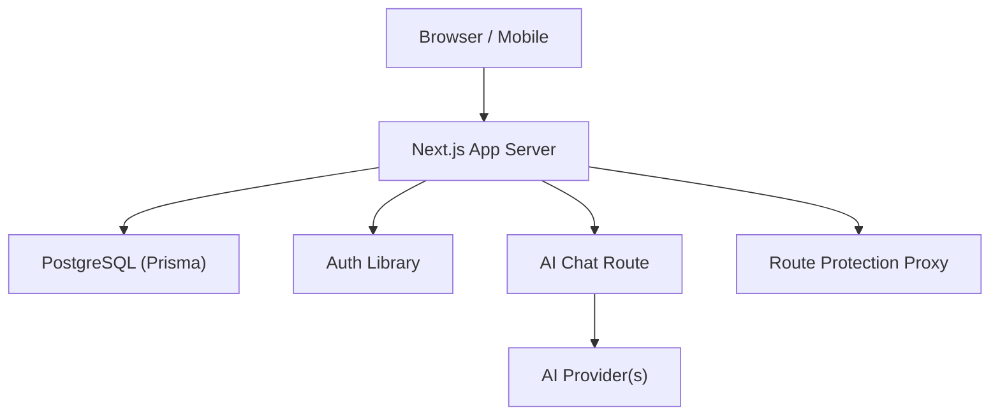
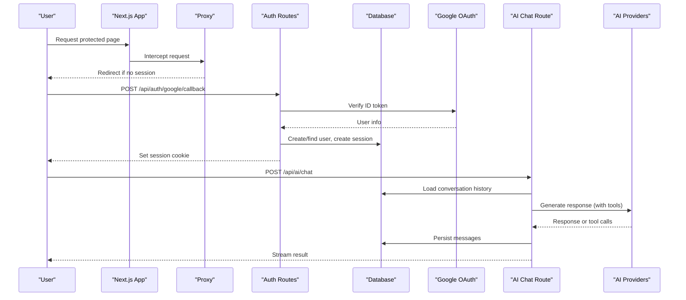
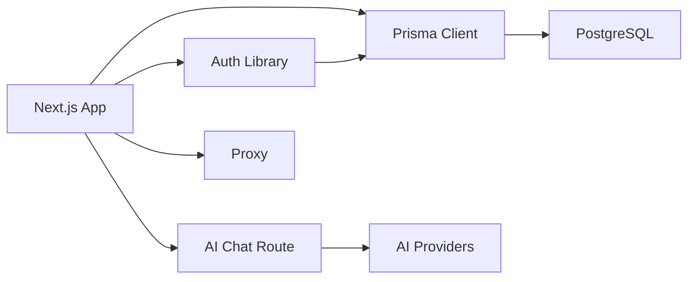
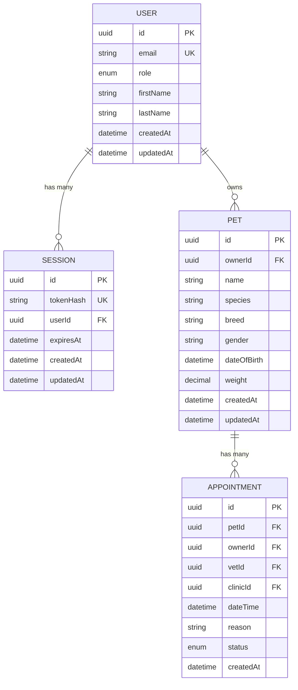
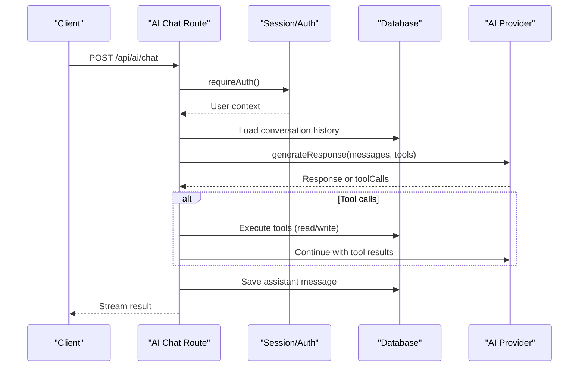

# Configuration & Deployment

<cite>
**Referenced Files in This Document**
- [next.config.ts](file://next.config.ts)
- [package.json](file://package.json)
- [tsconfig.json](file://tsconfig.json)
- [lib/db.ts](file://lib/db.ts)
- [prisma.config.ts](file://prisma.config.ts)
- [prisma/schema.prisma](file://prisma/schema.prisma)
- [lib/auth.ts](file://lib/auth.ts)
- [app/api/auth/google/config/route.ts](file://app/api/auth/google/config/route.ts)
- [app/api/auth/google/callback/route.ts](file://app/api/auth/google/callback/route.ts)
- [app/api/auth/login/route.ts](file://app/api/auth/login/route.ts)
- [proxy.ts](file://proxy.ts)
- [lib/ai.ts](file://lib/ai.ts)
- [app/api/ai/chat/route.ts](file://app/api/ai/chat/route.ts)
</cite>

## Table of Contents
1. Introduction
2. Project Structure
3. Core Components
4. Architecture Overview
5. Detailed Component Analysis
6. Dependency Analysis
7. Performance Considerations
8. Troubleshooting Guide
9. Conclusion
10. Appendices

## Introduction
This document provides comprehensive guidance for configuring and deploying the PETIVA application across development, staging, and production environments. It covers environment variables (database, Google OAuth, AI providers), Next.js build configuration, containerization, cloud deployment strategies, API proxying, CORS/security headers, monitoring/logging, troubleshooting, scaling, and security hardening. The content is grounded in the repository’s current configuration and code paths.

## Project Structure
The project is a Next.js application using Prisma with PostgreSQL. Authentication uses session cookies and supports Google OAuth. AI capabilities are provided via configurable providers through a unified interface. A middleware-like proxy enforces route-level authentication.

**Diagram sources**
- [lib/db.ts:1-33](file://lib/db.ts#L1-L33)
- [lib/auth.ts:1-125](file://lib/auth.ts#L1-L125)
- [lib/ai.ts:1-140](file://lib/ai.ts#L1-L140)
- [app/api/ai/chat/route.ts:1-349](file://app/api/ai/chat/route.ts#L1-L349)
- [proxy.ts:1-35](file://proxy.ts#L1-L35)

**Section sources**
- [package.json:1-35](file://package.json#L1-L35)
- [next.config.ts:1-8](file://next.config.ts#L1-L8)
- [tsconfig.json:1-35](file://tsconfig.json#L1-L35)

## Core Components
- Database connection and client initialization with Prisma and pg pool
- Session-based authentication with secure cookie handling
- Google OAuth integration for sign-in
- AI chat orchestration with provider selection and tool execution
- Route protection proxy for protected pages
- Build and runtime configuration for Next.js and TypeScript

Key responsibilities:
- lib/db.ts: Creates a pooled database client tailored for production vs development
- lib/auth.ts: Password hashing, session creation/validation, cookie management, role enforcement
- app/api/auth/*: Login and Google OAuth endpoints
- lib/ai.ts + app/api/ai/chat/route.ts: AI conversation flow, tool execution, streaming responses
- proxy.ts: Protects sensitive routes at the edge
- next.config.ts + package.json + tsconfig.json: Build/runtime settings

**Section sources**
- [lib/db.ts:1-33](file://lib/db.ts#L1-L33)
- [lib/auth.ts:1-125](file://lib/auth.ts#L1-L125)
- [app/api/auth/google/config/route.ts:1-8](file://app/api/auth/google/config/route.ts#L1-L8)
- [app/api/auth/google/callback/route.ts:1-98](file://app/api/auth/google/callback/route.ts#L1-L98)
- [app/api/auth/login/route.ts:1-58](file://app/api/auth/login/route.ts#L1-L58)
- [lib/ai.ts:1-140](file://lib/ai.ts#L1-L140)
- [app/api/ai/chat/route.ts:1-349](file://app/api/ai/chat/route.ts#L1-L349)
- [proxy.ts:1-35](file://proxy.ts#L1-L35)
- [next.config.ts:1-8](file://next.config.ts#L1-L8)
- [package.json:1-35](file://package.json#L1-L35)
- [tsconfig.json:1-35](file://tsconfig.json#L1-L35)

## Architecture Overview
The system follows a server-side rendering and API route model with Next.js. Data access is centralized through Prisma to PostgreSQL. Authentication is handled via sessions stored in the database and secured cookies. AI features are abstracted behind a provider interface, enabling fallback strategies. Route protection ensures unauthenticated users cannot access protected areas.

**Diagram sources**
- [proxy.ts:1-35](file://proxy.ts#L1-L35)
- [app/api/auth/google/callback/route.ts:1-98](file://app/api/auth/google/callback/route.ts#L1-L98)
- [lib/auth.ts:1-125](file://lib/auth.ts#L1-L125)
- [app/api/ai/chat/route.ts:1-349](file://app/api/ai/chat/route.ts#L1-L349)
- [lib/ai.ts:1-140](file://lib/ai.ts#L1-L140)

## Detailed Component Analysis

### Environment Configuration
- Database
  - Connection string is read from an environment variable and used by both Prisma CLI and runtime client.
  - In production, a dedicated connection pool is created; in development, global reuse avoids hot-reload issues.
- Google OAuth
  - Client ID is exposed via a config endpoint for the frontend.
  - Backend verifies tokens using the configured client ID and creates sessions upon successful login.
- AI Providers
  - Provider selection is controlled by an environment variable; default behavior includes fallback logic.
  - OpenRouter requires an API key and optional model override.
- Application Settings
  - Next.js configuration file exists for future customizations.
  - TypeScript compiler options include strict mode and path aliases.

Environment variables referenced:
- DATABASE_URL
- GOOGLE_CLIENT_ID
- OPENROUTER_API_KEY
- OPENROUTER_MODEL
- BOOKING_ASSISTANT_PROVIDER
- NODE_ENV

**Section sources**
- [lib/db.ts:1-33](file://lib/db.ts#L1-L33)
- [prisma.config.ts:1-16](file://prisma.config.ts#L1-L16)
- [app/api/auth/google/config/route.ts:1-8](file://app/api/auth/google/config/route.ts#L1-L8)
- [app/api/auth/google/callback/route.ts:1-98](file://app/api/auth/google/callback/route.ts#L1-L98)
- [lib/ai.ts:1-140](file://lib/ai.ts#L1-L140)
- [next.config.ts:1-8](file://next.config.ts#L1-L8)
- [tsconfig.json:1-35](file://tsconfig.json#L1-L35)

### Build Process Configuration (Next.js)
- Scripts: Development, build, start, lint commands are defined.
- Next.js config: Currently minimal; can be extended for optimizations, asset handling, and custom webpack rules.
- TypeScript: Strict compilation, module resolution set to bundler, path alias @/* mapped to root.

Recommendations when extending:
- Enable compression and image optimization as needed.
- Configure asset prefixes for CDN usage.
- Add custom webpack plugins for advanced builds.

**Section sources**
- [package.json:1-35](file://package.json#L1-L35)
- [next.config.ts:1-8](file://next.config.ts#L1-L8)
- [tsconfig.json:1-35](file://tsconfig.json#L1-L35)

### Deployment Strategies
- Containerization
  - Use a multi-stage Dockerfile to build the Next.js app and run a lightweight production image.
  - Ensure environment variables are injected at runtime (DATABASE_URL, GOOGLE_CLIENT_ID, OPENROUTER_API_KEY, etc.).
  - Expose port 3000 and configure health checks.
- Cloud Platforms
  - Vercel: Deploy directly; set environment variables in platform settings.
  - AWS: Run on ECS/Fargate or App Runner; configure load balancer, secrets manager, and RDS.
  - Azure: Use App Service or Container Instances; configure Application Insights for monitoring.
- CI/CD Pipeline
  - Lint and type-check on PRs.
  - Build and test stages.
  - Push images to registry and deploy to target environment.
  - Run migrations before starting the service.

[No sources needed since this section provides general guidance]

### Proxy Configuration, CORS, and Security Headers
- Route Protection
  - A proxy intercepts requests to protected paths and redirects unauthenticated users to login.
- CORS
  - Not explicitly configured in the repository; add middleware or per-route headers if cross-origin access is required.
- Security Headers
  - Not explicitly configured; consider adding HSTS, CSP, X-Frame-Options, Referrer-Policy, and Content-Security-Policy via middleware or reverse proxy.

**Section sources**
- [proxy.ts:1-35](file://proxy.ts#L1-L35)

### Monitoring and Logging
- Logging
  - Console logging is used throughout auth and AI flows; centralize logs in production using a structured logger.
- Error Tracking
  - Integrate error tracking (e.g., Sentry) to capture exceptions in API routes and server components.
- Performance Monitoring
  - Use platform metrics (Vercel/AWS/Azure) and APM tools to track latency and errors.
- Analytics
  - Add analytics SDKs for user interactions and funnel tracking.

[No sources needed since this section provides general guidance]

### Scaling Considerations
- Database
  - Use connection pooling (already implemented in production).
  - Add read replicas and query optimization based on indexes present in schema.
- Caching
  - Implement caching for AI responses and frequently accessed data using Redis or in-memory caches where appropriate.
- Horizontal Scaling
  - Run multiple instances behind a load balancer; ensure stateless sessions backed by the database.

[No sources needed since this section provides general guidance]

### Security Hardening
- SSL/TLS
  - Terminate TLS at the reverse proxy or platform level; enforce HTTPS.
- Input Validation
  - Validate all inputs in API routes; sanitize user-provided data.
- Vulnerability Scanning
  - Integrate dependency scanning in CI pipelines.
- Secrets Management
  - Store secrets in environment variables or secret managers; never commit them.

[No sources needed since this section provides general guidance]

## Dependency Analysis
The following diagram shows core runtime dependencies between modules and external services.

**Diagram sources**
- [lib/db.ts:1-33](file://lib/db.ts#L1-L33)
- [lib/auth.ts:1-125](file://lib/auth.ts#L1-L125)
- [lib/ai.ts:1-140](file://lib/ai.ts#L1-L140)
- [app/api/ai/chat/route.ts:1-349](file://app/api/ai/chat/route.ts#L1-L349)
- [proxy.ts:1-35](file://proxy.ts#L1-L35)

**Section sources**
- [package.json:1-35](file://package.json#L1-L35)

## Performance Considerations
- Database
  - Leverage existing indexes on Appointment, MedicalRecordVersion, AuditLog, and other high-traffic tables.
  - Avoid N+1 queries by selecting only necessary fields and using eager loading where appropriate.
- AI Requests
  - Limit context window size and implement retries/backoff for provider calls.
  - Cache frequent lookups (e.g., pet profiles) when safe.
- Next.js
  - Enable incremental static regeneration for static pages where applicable.
  - Optimize images and fonts; use CDN for assets.

[No sources needed since this section provides general guidance]

## Troubleshooting Guide
Common issues and resolutions:
- Database connectivity
  - Ensure DATABASE_URL is correctly set and reachable from the deployment environment.
  - Verify Prisma migrations have been applied before starting the app.
- Google OAuth failures
  - Confirm GOOGLE_CLIENT_ID is set and matches the authorized redirect URIs.
  - Check token verification steps and error responses in the callback route.
- AI provider errors
  - Validate OPENROUTER_API_KEY and model configuration.
  - Inspect provider-specific error messages and adjust fallback strategy if needed.
- Route protection redirects
  - Ensure session cookie is set and not blocked by browser policies.
  - Verify protected paths match those defined in the proxy matcher.

**Section sources**
- [lib/db.ts:1-33](file://lib/db.ts#L1-L33)
- [prisma.config.ts:1-16](file://prisma.config.ts#L1-L16)
- [app/api/auth/google/callback/route.ts:1-98](file://app/api/auth/google/callback/route.ts#L1-L98)
- [lib/ai.ts:1-140](file://lib/ai.ts#L1-L140)
- [proxy.ts:1-35](file://proxy.ts#L1-L35)

## Conclusion
PETIVA is configured with a robust foundation for secure authentication, scalable database access, and flexible AI integrations. By setting environment variables appropriately, leveraging the existing session and AI abstractions, and applying recommended security and performance practices, the application can be reliably deployed across development, staging, and production environments.

[No sources needed since this section summarizes without analyzing specific files]

## Appendices

### Data Model Overview
The schema defines core entities including User, Pet, Veterinarian, Clinic, Appointment, and related models, along with indexes to support efficient queries.

**Diagram sources**
- [prisma/schema.prisma:30-66](file://prisma/schema.prisma#L30-L66)
- [prisma/schema.prisma:68-88](file://prisma/schema.prisma#L68-L88)
- [prisma/schema.prisma:164-182](file://prisma/schema.prisma#L164-L182)

### AI Chat Flow

**Diagram sources**
- [app/api/ai/chat/route.ts:1-349](file://app/api/ai/chat/route.ts#L1-L349)
- [lib/auth.ts:1-125](file://lib/auth.ts#L1-L125)
- [lib/ai.ts:1-140](file://lib/ai.ts#L1-L140)