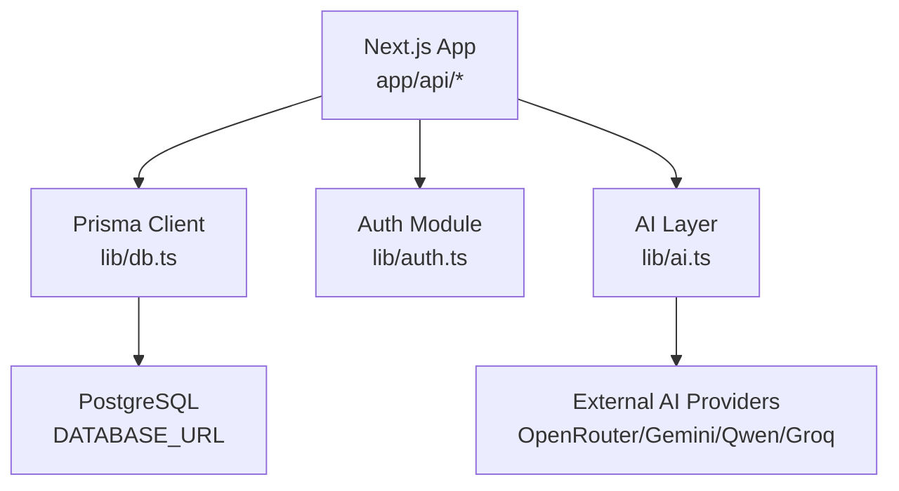
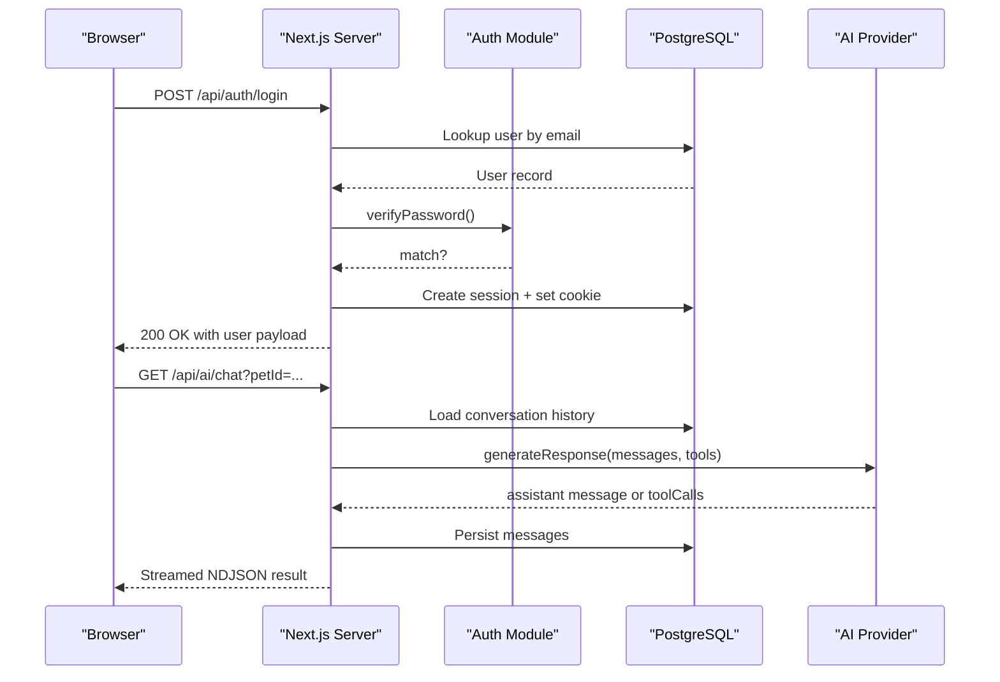
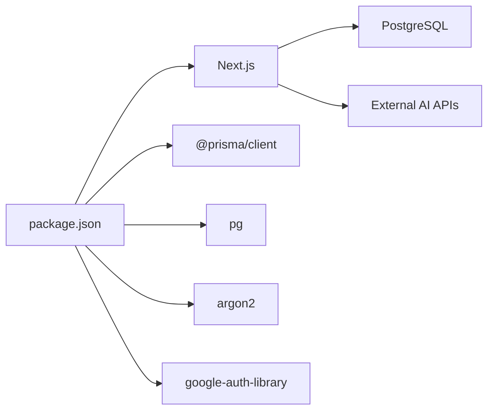
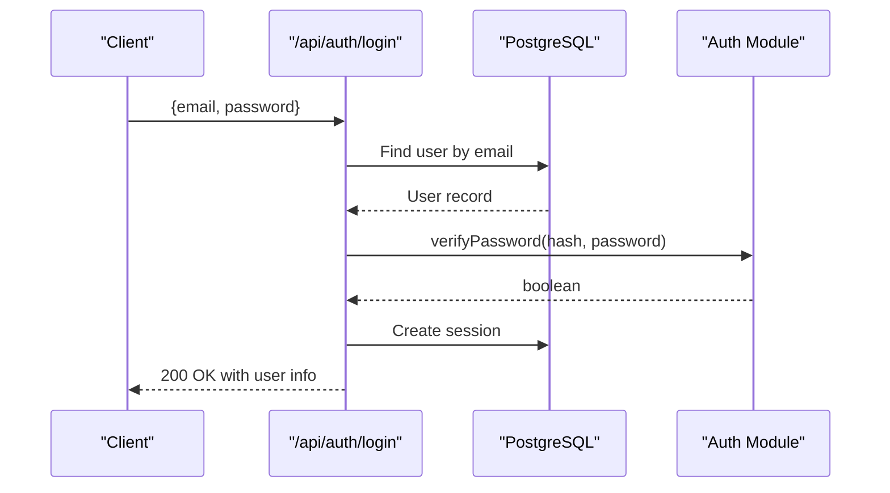
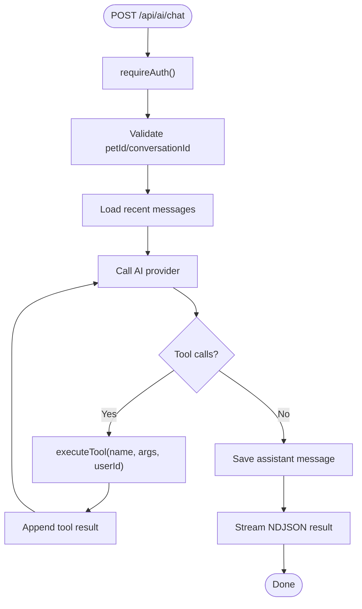

# Deployment Strategies

<cite>
**Referenced Files in This Document**
- [package.json](file://package.json)
- [next.config.ts](file://next.config.ts)
- [README.md](file://README.md)
- [prisma/schema.prisma](file://prisma/schema.prisma)
- [lib/db.ts](file://lib/db.ts)
- [lib/auth.ts](file://lib/auth.ts)
- [app/api/auth/login/route.ts](file://app/api/auth/login/route.ts)
- [lib/ai.ts](file://lib/ai.ts)
- [app/api/ai/chat/route.ts](file://app/api/ai/chat/route.ts)
- [prisma/migrations/20260825091722_init/migration.sql](file://prisma/migrations/20260825091722_init/migration.sql)
</cite>

## Table of Contents
1. Introduction
2. Project Structure
3. Core Components
4. Architecture Overview
5. Detailed Component Analysis
6. Dependency Analysis
7. Performance Considerations
8. Troubleshooting Guide
9. Conclusion
10. Appendices

## Introduction
This document provides deployment strategies for PETIVA, a Next.js application with PostgreSQL-backed services and AI-driven features. It covers containerization (Docker), environment-specific configuration, orchestration (Docker Compose), cloud platform options (Vercel frontend; AWS/Azure backend), CI/CD pipelines, database migrations, environment variable management, rollback procedures, and production monitoring/logging.

## Project Structure
PETIVA is a Next.js app using the App Router with server-side API routes under app/api. Data access uses Prisma with a PostgreSQL database. Authentication is implemented via secure cookies and database sessions. AI capabilities are provided through external providers with tool-based integrations.

**Diagram sources**
- [lib/db.ts:1-33](file://lib/db.ts#L1-L33)
- [lib/auth.ts:1-125](file://lib/auth.ts#L1-L125)
- [lib/ai.ts:1-412](file://lib/ai.ts#L1-L412)
- [app/api/ai/chat/route.ts:1-349](file://app/api/ai/chat/route.ts#L1-L349)

**Section sources**
- [package.json:1-35](file://package.json#L1-L35)
- [next.config.ts:1-8](file://next.config.ts#L1-L8)
- [README.md:1-37](file://README.md#L1-L37)

## Core Components
- Database layer: Prisma client configured to use a connection pool in production and a global singleton in development to avoid hot-reload issues.
- Authentication: Secure session cookies, hashed tokens stored in DB, role-based guards.
- AI integration: Provider abstraction with fallbacks and tool execution backed by Prisma queries.
- API routes: REST endpoints for auth and AI chat, including streaming responses.

Key implementation references:
- Database connection pooling and environment branching: [lib/db.ts:1-33]
- Session creation, validation, cookie handling: [lib/auth.ts:1-125]
- Login flow and response shaping: [app/api/auth/login/route.ts:1-58]
- AI provider selection and tool execution: [lib/ai.ts:1-412]
- Chat endpoint with streaming and tool orchestration: [app/api/ai/chat/route.ts:1-349]

**Section sources**
- [lib/db.ts:1-33](file://lib/db.ts#L1-L33)
- [lib/auth.ts:1-125](file://lib/auth.ts#L1-L125)
- [app/api/auth/login/route.ts:1-58](file://app/api/auth/login/route.ts#L1-L58)
- [lib/ai.ts:1-412](file://lib/ai.ts#L1-L412)
- [app/api/ai/chat/route.ts:1-349](file://app/api/ai/chat/route.ts#L1-L349)

## Architecture Overview
The runtime architecture centers on a single Next.js process that serves both UI and API. In production, it connects to a managed PostgreSQL instance and calls external AI APIs. The data model is defined in Prisma schema and migrated via Prisma Migrate.

**Diagram sources**
- [app/api/auth/login/route.ts:1-58](file://app/api/auth/login/route.ts#L1-L58)
- [lib/auth.ts:1-125](file://lib/auth.ts#L1-L125)
- [lib/ai.ts:1-412](file://lib/ai.ts#L1-L412)
- [app/api/ai/chat/route.ts:1-349](file://app/api/ai/chat/route.ts#L1-L349)

## Detailed Component Analysis

### Containerization with Docker
- Build strategy: Use multi-stage builds to separate dependency installation, build, and runtime.
  - Stage 1: Install dependencies and run Next.js build.
  - Stage 2: Minimal runtime image with only production artifacts.
- Environment variables required at runtime:
  - DATABASE_URL: PostgreSQL connection string.
  - OPENROUTER_API_KEY, OPENROUTER_MODEL: AI provider credentials and model selection.
  - BOOKING_ASSISTANT_PROVIDER: Selects active AI provider.
  - NODE_ENV: Set to production for optimized behavior.
- Production considerations:
  - Connection pooling enabled in production via PrismaPg adapter.
  - Secure cookie flags applied when NODE_ENV is production.

References:
- Runtime env usage: [lib/db.ts:10-13], [lib/auth.ts:83-91], [lib/ai.ts:32-39], [lib/ai.ts:110]
- Build/start scripts: [package.json:5-9]

**Section sources**
- [lib/db.ts:10-13](file://lib/db.ts#L10-L13)
- [lib/auth.ts:83-91](file://lib/auth.ts#L83-L91)
- [lib/ai.ts:32-39](file://lib/ai.ts#L32-L39)
- [lib/ai.ts:110](file://lib/ai.ts#L110)
- [package.json:5-9](file://package.json#L5-L9)

### Environment-Specific Configuration
- Development vs production:
  - Database client initialization differs to prevent multiple pools in dev and enable pooling in prod.
  - Cookie security toggled based on NODE_ENV.
  - AI provider selection via environment variable.
- Recommended practice:
  - Store secrets in platform secret managers (e.g., Vercel, AWS Secrets Manager).
  - Validate required env vars at startup and fail fast if missing.

References:
- Env branching: [lib/db.ts:10-29]
- Secure cookies: [lib/auth.ts:83-91]
- AI provider config: [lib/ai.ts:32-39], [lib/ai.ts:110]

**Section sources**
- [lib/db.ts:10-29](file://lib/db.ts#L10-L29)
- [lib/auth.ts:83-91](file://lib/auth.ts#L83-L91)
- [lib/ai.ts:32-39](file://lib/ai.ts#L32-L39)
- [lib/ai.ts:110](file://lib/ai.ts#L110)

### Container Orchestration with Docker Compose
- Services:
  - next-app: Next.js production server.
  - postgres: Managed database service for local/dev or staging.
- Networking:
  - Expose Postgres internally; do not expose Next.js port directly unless behind a reverse proxy.
- Health checks:
  - Ensure Next.js depends on Postgres being healthy before starting.
- Secrets:
  - Inject DATABASE_URL and AI keys via compose secrets or host environment.

No direct file mapping needed for this conceptual section.

### Cloud Platform Deployment

#### Vercel (Frontend Hosting)
- Native support for Next.js with automatic builds and deployments.
- Configure environment variables in Vercel dashboard.
- Domain and preview deployments supported out-of-the-box.

Reference:
- Vercel deployment note: [README.md:32-37]

**Section sources**
- [README.md:32-37](file://README.md#L32-L37)

#### AWS (Backend Infrastructure)
- Compute: Run Next.js on EC2 or ECS/Fargate behind ALB.
- Database: Amazon RDS for PostgreSQL.
- Storage: S3 for documents referenced by the Document model’s ossKey field.
- Security: IAM roles, KMS encryption, security groups, WAF.
- Scaling: Auto Scaling Groups or ECS task scaling; RDS read replicas if needed.

No direct file mapping needed for this conceptual section.

#### Azure Alternatives
- Compute: Azure App Service or Azure Container Instances for Next.js.
- Database: Azure Database for PostgreSQL.
- Storage: Azure Blob Storage for documents.
- Monitoring: Application Insights for performance and error tracking.

No direct file mapping needed for this conceptual section.

### CI/CD Pipeline
- Stages:
  - Lint and type-check.
  - Unit/integration tests.
  - Build Next.js artifact.
  - Push Docker image to registry (if containerized).
  - Deploy to target platform (Vercel, AWS, Azure).
- Environments:
  - Separate environments for staging and production with distinct secrets.
- Rollback:
  - Keep previous deployment artifacts/images tagged.
  - Use platform-native rollbacks or redeploy previous version.

No direct file mapping needed for this conceptual section.

### Database Migration Strategy
- Schema definition: Prisma schema defines all models and relations.
- Migrations:
  - Generate migration SQL from schema changes.
  - Apply migrations during deployment or as a pre-start step.
- Backward compatibility:
  - Prefer additive changes first; avoid destructive changes without careful planning.
- Rollback:
  - Maintain migration history; revert by applying prior migration or restoring backups if necessary.

References:
- Schema: [prisma/schema.prisma:1-312]
- Initial migration SQL: [prisma/migrations/20260825091722_init/migration.sql:1-409]

**Section sources**
- [prisma/schema.prisma:1-312](file://prisma/schema.prisma#L1-L312)
- [prisma/migrations/20260825091722_init/migration.sql:1-409](file://prisma/migrations/20260825091722_init/migration.sql#L1-L409)

### Environment Variable Management in Production
- Required variables:
  - DATABASE_URL: PostgreSQL connection string.
  - OPENROUTER_API_KEY, OPENROUTER_MODEL: AI provider configuration.
  - BOOKING_ASSISTANT_PROVIDER: Active AI provider selection.
  - NODE_ENV: Must be production.
- Best practices:
  - Use platform secret stores (Vercel, AWS Secrets Manager, Azure Key Vault).
  - Rotate secrets regularly and audit access.
  - Validate presence at startup and fail fast if missing.

References:
- Env usage in code: [lib/db.ts:8-13], [lib/auth.ts:83-91], [lib/ai.ts:32-39], [lib/ai.ts:110]

**Section sources**
- [lib/db.ts:8-13](file://lib/db.ts#L8-L13)
- [lib/auth.ts:83-91](file://lib/auth.ts#L83-L91)
- [lib/ai.ts:32-39](file://lib/ai.ts#L32-L39)
- [lib/ai.ts:110](file://lib/ai.ts#L110)

### Rollback Procedures
- Application rollback:
  - Re-deploy previous Docker image or artifact tag.
  - On Vercel, revert to previous deployment.
- Database rollback:
  - If migration failed, restore from snapshot and re-run safe migrations.
  - For non-destructive changes, apply inverse migration carefully.
- AI provider rollback:
  - Switch BOOKING_ASSISTANT_PROVIDER to a known-good provider.

No direct file mapping needed for this conceptual section.

### Monitoring and Logging
- Error tracking:
  - Integrate Sentry for frontend and backend errors.
  - Capture unhandled exceptions in API routes and stream handlers.
- Performance monitoring:
  - Use platform metrics (Vercel Analytics, AWS CloudWatch, Azure Monitor).
  - Track API latency, error rates, and database query performance.
- Centralized logging:
  - Aggregate logs into a centralized system (e.g., CloudWatch Logs, Azure Monitor Logs, ELK).
  - Include correlation IDs per request for traceability.

No direct file mapping needed for this conceptual section.

## Dependency Analysis
Runtime dependencies include Next.js, Prisma, PostgreSQL driver, and optional AI provider SDKs. The app depends on environment variables for database and AI connectivity.

**Diagram sources**
- [package.json:11-22](file://package.json#L11-L22)

**Section sources**
- [package.json:11-22](file://package.json#L11-L22)

## Performance Considerations
- Database:
  - Use connection pooling in production (already configured).
  - Add indexes where appropriate; schema includes several indexes for common queries.
- Next.js:
  - Leverage static generation where possible; keep dynamic routes minimal.
  - Enable compression and caching headers appropriately.
- AI:
  - Limit context window size; current implementation caps recent messages.
  - Implement retries and timeouts for external AI calls.
- Observability:
  - Add request tracing and structured logging for high-cardinality paths.

References:
- Pooling: [lib/db.ts:10-13]
- Message cap: [app/api/ai/chat/route.ts:137-143]
- Indexes: [prisma/migrations/20260825091722_init/migration.sql:278-324]

**Section sources**
- [lib/db.ts:10-13](file://lib/db.ts#L10-L13)
- [app/api/ai/chat/route.ts:137-143](file://app/api/ai/chat/route.ts#L137-L143)
- [prisma/migrations/20260825091722_init/migration.sql:278-324](file://prisma/migrations/20260825091722_init/migration.sql#L278-L324)

## Troubleshooting Guide
Common issues and resolutions:
- Missing DATABASE_URL:
  - Ensure DATABASE_URL is set and reachable from the deployment environment.
- AI provider errors:
  - Verify OPENROUTER_API_KEY and model settings; check provider status.
  - Use fallback provider logic to maintain availability.
- Authentication failures:
  - Confirm cookie security flags align with deployment domain and HTTPS.
  - Check session expiration and token hashing logic.
- Streaming interruptions:
  - Handle stream close events gracefully; ensure resources are released.

References:
- Env requirements: [lib/db.ts:8-13], [lib/ai.ts:32-39]
- Auth cookie flags: [lib/auth.ts:83-91]
- Stream handling: [app/api/ai/chat/route.ts:194-224]

**Section sources**
- [lib/db.ts:8-13](file://lib/db.ts#L8-L13)
- [lib/ai.ts:32-39](file://lib/ai.ts#L32-L39)
- [lib/auth.ts:83-91](file://lib/auth.ts#L83-L91)
- [app/api/ai/chat/route.ts:194-224](file://app/api/ai/chat/route.ts#L194-L224)

## Conclusion
PETIVA can be deployed across multiple platforms with a consistent runtime profile driven by environment variables. Containerization ensures reproducibility, while cloud platforms provide scalable infrastructure. Robust CI/CD, migration strategies, and observability are essential for reliable production operations.

## Appendices

### End-to-End Login Flow

**Diagram sources**
- [app/api/auth/login/route.ts:1-58](file://app/api/auth/login/route.ts#L1-L58)
- [lib/auth.ts:1-125](file://lib/auth.ts#L1-L125)

### AI Chat Tool Execution Flow

**Diagram sources**
- [app/api/ai/chat/route.ts:68-349](file://app/api/ai/chat/route.ts#L68-L349)
- [lib/ai.ts:235-412](file://lib/ai.ts#L235-L412)