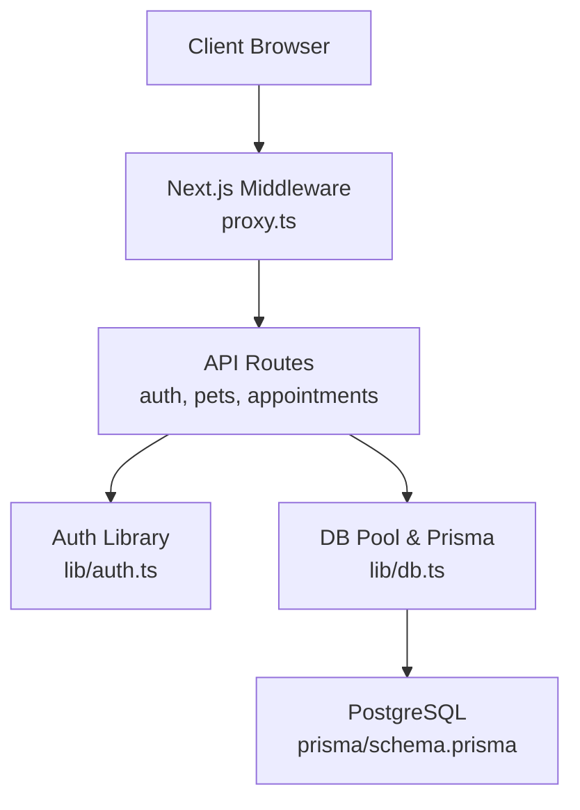
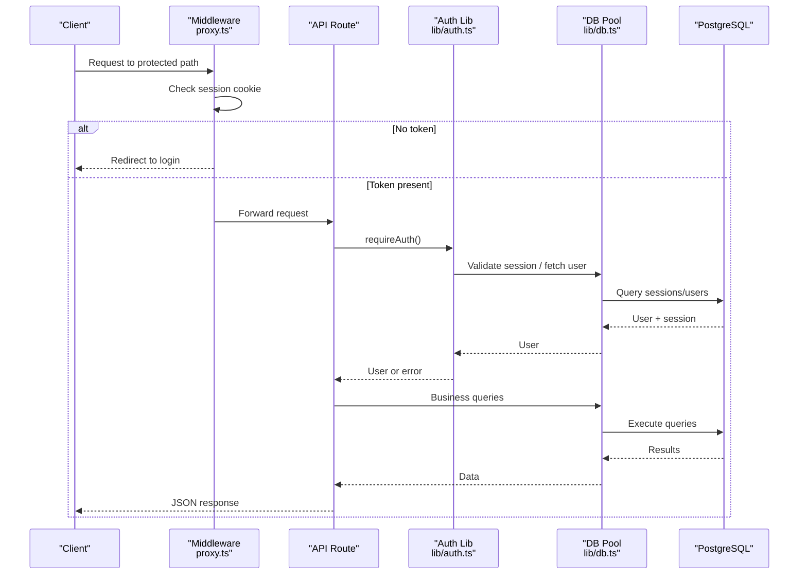
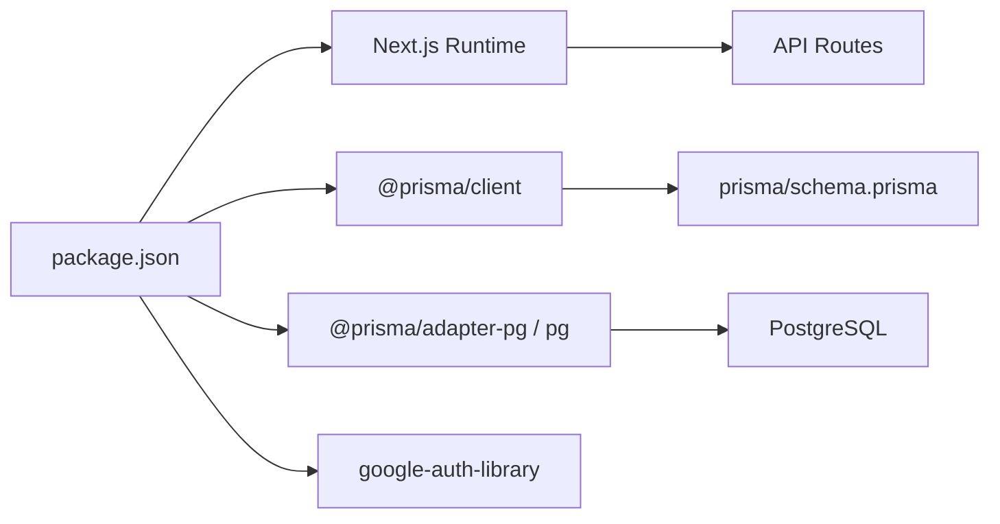
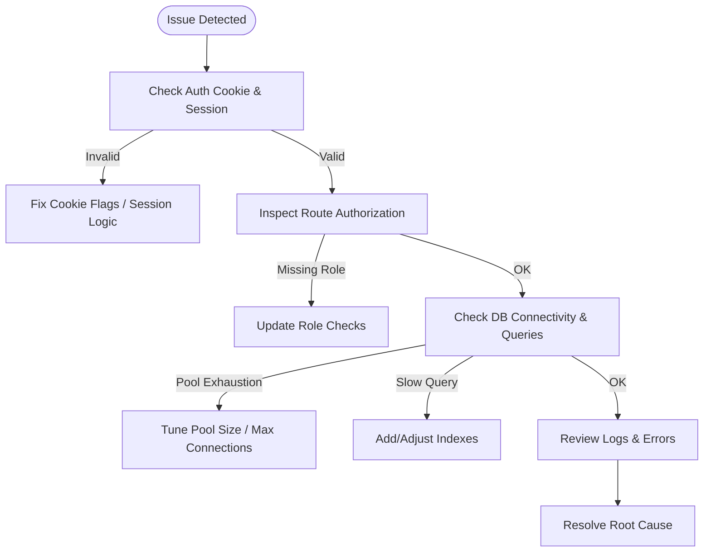

# Production Considerations & Monitoring

<cite>
**Referenced Files in This Document**
- [package.json](file://package.json)
- [next.config.ts](file://next.config.ts)
- [lib/db.ts](file://lib/db.ts)
- [lib/auth.ts](file://lib/auth.ts)
- [proxy.ts](file://proxy.ts)
- [app/api/auth/login/route.ts](file://app/api/auth/login/route.ts)
- [app/api/auth/register/route.ts](file://app/api/auth/register/route.ts)
- [app/api/auth/logout/route.ts](file://app/api/auth/logout/route.ts)
- [app/api/pets/route.ts](file://app/api/pets/route.ts)
- [app/api/appointments/route.ts](file://app/api/appointments/route.ts)
- [prisma/schema.prisma](file://prisma/schema.prisma)
- [docs/03-architecture/06-security.md](file://docs/03-architecture/06-security.md)
- [docs/03-architecture/05-alibaba-cloud-architecture.md](file://docs/03-architecture/05-alibaba-cloud-architecture.md)
- [docs/03-architecture/01-system-architecture.md](file://docs/03-architecture/01-system-architecture.md)
</cite>

## Table of Contents
1. Introduction
2. Project Structure
3. Core Components
4. Architecture Overview
5. Detailed Component Analysis
6. Dependency Analysis
7. Performance Considerations
8. Troubleshooting Guide
9. Conclusion
10. Appendices

## Introduction
This document provides production deployment considerations and monitoring setup for PETIVA, focusing on security hardening, performance optimization, monitoring and alerting, backup and disaster recovery, database maintenance, log rotation, scaling strategies, and troubleshooting techniques. It synthesizes the existing codebase patterns with recommended production practices to help operators run PETIVA reliably and securely at scale.

## Project Structure
PETIVA is a Next.js application using App Router API routes, Prisma ORM with PostgreSQL, and role-based access control. Security utilities are centralized in lib/auth.ts, database connections and pooling in lib/db.ts, and route-level protection via proxy.ts. The data model and indexes are defined in prisma/schema.prisma. Cloud architecture guidance references Alibaba Cloud services.

**Diagram sources**
- [proxy.ts:1-34](file://proxy.ts#L1-L34)
- [lib/auth.ts:1-125](file://lib/auth.ts#L1-L125)
- [lib/db.ts:1-33](file://lib/db.ts#L1-L33)
- [prisma/schema.prisma:1-312](file://prisma/schema.prisma#L1-L312)

**Section sources**
- [next.config.ts:1-8](file://next.config.ts#L1-L8)
- [package.json:1-35](file://package.json#L1-L35)
- [proxy.ts:1-34](file://proxy.ts#L1-L34)
- [lib/auth.ts:1-125](file://lib/auth.ts#L1-L125)
- [lib/db.ts:1-33](file://lib/db.ts#L1-L33)
- [prisma/schema.prisma:1-312](file://prisma/schema.prisma#L1-L312)

## Core Components
- Authentication and session management: Session tokens stored as HTTP-only cookies, hashed and validated server-side; sliding expiration; role checks.
- Database layer: Prisma client with pg connection pool; environment-aware initialization for production vs development.
- Route protection: Middleware-style proxy enforces authentication for protected paths.
- Data model: Robust schema with roles, sessions, medical records, appointments, audit logs, and indexes for performance.

Key implementation highlights:
- Secure cookie flags set in production (httpOnly, secure, sameSite).
- Password hashing with Argon2 and session token hashing with SHA-256.
- Transactional double-booking prevention for appointments.
- Role-based authorization and ownership checks in API routes.

**Section sources**
- [lib/auth.ts:1-125](file://lib/auth.ts#L1-L125)
- [lib/db.ts:1-33](file://lib/db.ts#L1-L33)
- [proxy.ts:1-34](file://proxy.ts#L1-L34)
- [app/api/appointments/route.ts:69-143](file://app/api/appointments/route.ts#L69-L143)
- [prisma/schema.prisma:30-66](file://prisma/schema.prisma#L30-L66)

## Architecture Overview
The runtime enforces authentication at the middleware boundary and validates permissions within each API route. Database interactions use Prisma with a pooled connection to PostgreSQL. Audit logging captures critical actions.

**Diagram sources**
- [proxy.ts:1-34](file://proxy.ts#L1-L34)
- [lib/auth.ts:1-125](file://lib/auth.ts#L1-L125)
- [lib/db.ts:1-33](file://lib/db.ts#L1-L33)
- [prisma/schema.prisma:1-312](file://prisma/schema.prisma#L1-L312)

**Section sources**
- [docs/03-architecture/01-system-architecture.md:101-142](file://docs/03-architecture/01-system-architecture.md#L101-L142)
- [docs/03-architecture/06-security.md:1-90](file://docs/03-architecture/06-security.md#L1-L90)

## Detailed Component Analysis

### Security Hardening
- SSL/TLS: Enforce HTTPS in production; ensure reverse proxy terminates TLS and forwards secure headers. Configure Next.js to trust upstream proxies if needed.
- CORS: Restrict allowed origins, methods, and headers to only trusted domains. Apply per-route where necessary.
- Security Headers: Set HSTS, X-Content-Type-Options, X-Frame-Options, Content-Security-Policy, Referrer-Policy, Permissions-Policy.
- Input Validation: Validate all inputs in API routes; enforce types, lengths, enums, and business rules before persistence.
- Vulnerability Scanning: Integrate dependency scanning (e.g., npm audit, SCA tools) into CI/CD; scan container images; patch dependencies regularly.

Evidence from code:
- Secure cookie configuration in production (httpOnly, secure, sameSite).
- Password hashing with Argon2 and session token hashing.
- RBAC enforcement and ownership checks in routes.
- Audit logging for sensitive operations.

**Section sources**
- [lib/auth.ts:82-92](file://lib/auth.ts#L82-L92)
- [app/api/auth/register/route.ts:6-31](file://app/api/auth/register/route.ts#L6-L31)
- [app/api/pets/route.ts:31-55](file://app/api/pets/route.ts#L31-L55)
- [docs/03-architecture/06-security.md:1-90](file://docs/03-architecture/06-security.md#L1-L90)

### Performance Optimization
- Database Query Optimization: Use Prisma select/include judiciously; leverage indexes defined in schema; paginate lists; avoid N+1 queries by batching or selecting related entities explicitly.
- Caching Strategies: Implement Redis for caching frequent reads (e.g., vet availability, clinic info); cache CDN for static assets and public pages; consider edge caching for read-heavy endpoints.
- Load Balancing: Place Next.js behind a load balancer; configure health checks; enable sticky sessions only if required by stateful components.
- Horizontal Scaling: Stateless app instances behind LB; externalize sessions to Redis if needed; ensure shared secrets via environment variables.

Evidence from code:
- Connection pooling with pg.Pool in production mode.
- Indexes on frequently queried fields (sessions, appointments, medical records).
- Transactional conflict detection for appointment booking.

**Section sources**
- [lib/db.ts:10-29](file://lib/db.ts#L10-L29)
- [prisma/schema.prisma:55-66](file://prisma/schema.prisma#L55-L66)
- [prisma/schema.prisma:164-182](file://prisma/schema.prisma#L164-L182)
- [app/api/appointments/route.ts:93-110](file://app/api/appointments/route.ts#L93-L110)

### Monitoring and Alerting
- Application Performance Monitoring (APM): Instrument requests with timing, trace IDs, and resource usage metrics; integrate with APM tooling.
- Error Tracking: Centralize error handling in API routes; capture stack traces, context, and user identifiers; forward to error tracking service.
- User Analytics: Track key events (login, pet creation, appointment booking) with privacy-preserving analytics.
- System Health Checks: Expose /health endpoint returning DB connectivity, queue status, and external service readiness.

Evidence from code:
- Structured console logs and audit logs for critical actions.
- Consistent error responses with codes and messages across routes.

**Section sources**
- [docs/03-architecture/01-system-architecture.md:144-151](file://docs/03-architecture/01-system-architecture.md#L144-L151)
- [app/api/auth/login/route.ts:50-56](file://app/api/auth/login/route.ts#L50-L56)
- [app/api/pets/route.ts:16-27](file://app/api/pets/route.ts#L16-L27)
- [app/api/appointments/route.ts:55-66](file://app/api/appointments/route.ts#L55-L66)

### Backup and Disaster Recovery
- Database Backups: Schedule automated backups for PostgreSQL; retain multiple generations; test restore procedures regularly.
- Object Storage Backups: Versioned OSS buckets; cross-region replication for critical documents.
- Configuration Backups: Store environment variables and secrets in a secure vault; back up Prisma migrations and seed scripts.
- Recovery Procedures: Define RTO/RPO; document runbooks for failover, data restoration, and incident escalation.

**Section sources**
- [docs/03-architecture/05-alibaba-cloud-architecture.md:29-54](file://docs/03-architecture/05-alibaba-cloud-architecture.md#L29-L54)

### Database Maintenance Tasks
- Index Management: Review slow queries and add or adjust indexes based on access patterns.
- Vacuum/Analyze: Schedule regular maintenance to keep statistics current and reclaim space.
- Migration Strategy: Apply Prisma migrations in CI/CD with zero-downtime practices; test migrations in staging first.
- Connection Limits: Monitor pool size and database max connections; tune pool settings under load.

**Section sources**
- [prisma/schema.prisma:55-66](file://prisma/schema.prisma#L55-L66)
- [prisma/schema.prisma:164-182](file://prisma/schema.prisma#L164-L182)
- [lib/db.ts:10-29](file://lib/db.ts#L10-L29)

### Log Rotation Strategies
- Centralized Logging: Ship logs to a cloud logging service; structure logs with timestamps, levels, and correlation IDs.
- Rotation Policies: Rotate local logs by size and age; archive older logs to object storage; define retention policies aligned with compliance needs.
- Sensitive Data: Ensure no secrets or PII are logged; sanitize payloads before emission.

**Section sources**
- [docs/03-architecture/01-system-architecture.md:144-151](file://docs/03-architecture/01-system-architecture.md#L144-L151)

### Scaling Considerations
- Traffic Handling: Scale horizontally with multiple Next.js instances behind a load balancer; use auto-scaling groups based on CPU/memory and request latency.
- Database Connection Pooling: Tune pool sizes per instance; monitor connection saturation; consider read replicas for heavy reads.
- Resource Optimization: Minimize payload sizes; enable compression; cache aggressively; offload heavy tasks to background jobs.

**Section sources**
- [lib/db.ts:10-29](file://lib/db.ts#L10-L29)
- [docs/03-architecture/05-alibaba-cloud-architecture.md:56-68](file://docs/03-architecture/05-alibaba-cloud-architecture.md#L56-L68)

## Dependency Analysis
PETIVA depends on Next.js runtime, Prisma ORM, PostgreSQL driver, and Google auth library. The build and start scripts are standard Next.js commands.

**Diagram sources**
- [package.json:11-22](file://package.json#L11-L22)
- [prisma/schema.prisma:1-7](file://prisma/schema.prisma#L1-L7)

**Section sources**
- [package.json:1-35](file://package.json#L1-L35)
- [next.config.ts:1-8](file://next.config.ts#L1-L8)

## Performance Considerations
- Optimize queries: Use selective includes, pagination, and proper ordering; avoid fetching unnecessary fields.
- Cache hot data: Implement Redis for frequently accessed data; use CDN for static assets and public content.
- Reduce payload size: Compress responses; trim fields not needed by clients.
- Monitor bottlenecks: Profile database queries and API latencies; identify slow endpoints and optimize accordingly.

[No sources needed since this section provides general guidance]

## Troubleshooting Guide
Common issues and debugging techniques:
- Authentication failures: Verify cookie flags (httpOnly, secure), session existence, and expiration logic; check middleware matching and redirects.
- Authorization errors: Confirm role checks and ownership validations in routes; inspect session validation flow.
- Database errors: Inspect connection pool exhaustion, query timeouts, and missing indexes; validate migration state.
- API errors: Review consistent error responses and logs; correlate with request IDs; escalate with full context.

**Section sources**
- [lib/auth.ts:46-75](file://lib/auth.ts#L46-L75)
- [proxy.ts:9-23](file://proxy.ts#L9-L23)
- [app/api/auth/login/route.ts:5-32](file://app/api/auth/login/route.ts#L5-L32)
- [app/api/pets/route.ts:6-27](file://app/api/pets/route.ts#L6-L27)
- [app/api/appointments/route.ts:6-66](file://app/api/appointments/route.ts#L6-L66)

## Conclusion
PETIVA’s codebase implements solid foundations for secure, scalable operation: robust authentication, role-based access, transactional safeguards, and a well-indexed data model. For production, complement these with hardened TLS/CORS/security headers, comprehensive monitoring and alerting, disciplined backup and recovery, proactive database maintenance, and scalable infrastructure patterns. Continuous security scanning and observability will ensure reliability and safety as traffic grows.

[No sources needed since this section summarizes without analyzing specific files]

## Appendices

### Appendix A: Security Checklist
- Enforce HTTPS and HSTS; restrict CORS to trusted origins.
- Set security headers (X-Content-Type-Options, X-Frame-Options, CSP, Referrer-Policy, Permissions-Policy).
- Validate and sanitize all inputs; enforce enums and constraints.
- Use strong password hashing (Argon2) and secure session cookies.
- Implement rate limiting on sensitive endpoints.
- Scan dependencies and container images regularly.

**Section sources**
- [lib/auth.ts:82-92](file://lib/auth.ts#L82-L92)
- [docs/03-architecture/06-security.md:1-90](file://docs/03-architecture/06-security.md#L1-L90)

### Appendix B: Monitoring Checklist
- APM integration for request tracing and performance metrics.
- Centralized structured logging with correlation IDs.
- Error tracking with contextual details and user scope.
- Health endpoints for liveness/readiness probes.
- Alerts for error rates, latency spikes, and resource saturation.

**Section sources**
- [docs/03-architecture/01-system-architecture.md:144-151](file://docs/03-architecture/01-system-architecture.md#L144-L151)

### Appendix C: Scaling Checklist
- Horizontal scaling with load balancer and auto-scaling policies.
- Database connection pool tuning and monitoring.
- Caching layers (Redis/CDN) for read-heavy workloads.
- Background job queues for non-critical tasks.

**Section sources**
- [lib/db.ts:10-29](file://lib/db.ts#L10-L29)
- [docs/03-architecture/05-alibaba-cloud-architecture.md:56-68](file://docs/03-architecture/05-alibaba-cloud-architecture.md#L56-L68)