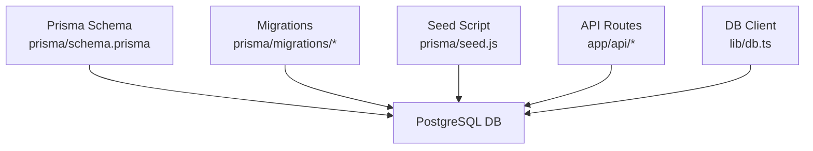
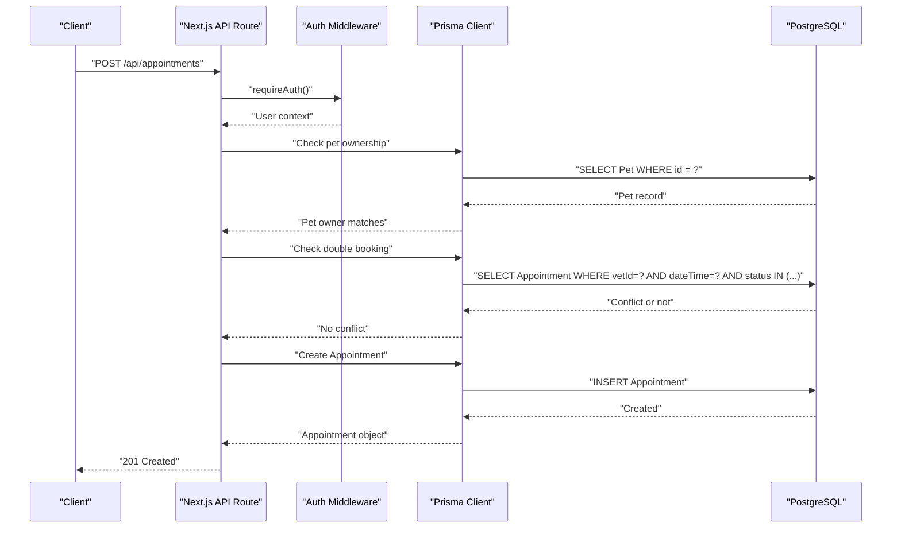
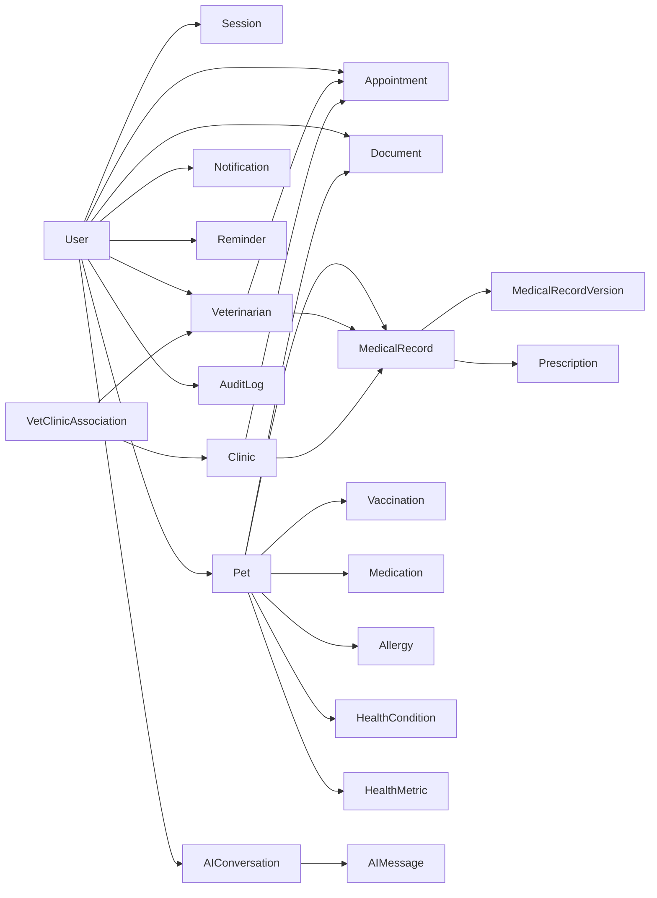

# Database Schema Design

<cite>
**Referenced Files in This Document**
- [schema.prisma](file://prisma/schema.prisma)
- [migration.sql (init)](file://prisma/migrations/20260825091722_init/migration.sql)
- [migration.sql (make password hash optional)](file://prisma/migrations/20260827095530_make_password_hash_optional/migration.sql)
- [migration.sql (add clinic admin relation)](file://prisma/migrations/20260827123510_add_clinic_admin_relation/migration.sql)
- [seed.js](file://prisma/seed.js)
- [db.ts](file://lib/db.ts)
- [appointments route](file://app/api/appointments/route.ts)
- [pets route](file://app/api/pets/route.ts)
- [register route](file://app/api/auth/register/route.ts)
</cite>

## Table of Contents
1. Introduction
2. Project Structure
3. Core Components
4. Architecture Overview
5. Detailed Component Analysis
6. Dependency Analysis
7. Performance Considerations
8. Troubleshooting Guide
9. Conclusion
10. Appendices

## Introduction
This document provides comprehensive data model documentation for the PETIVA database schema implemented with Prisma ORM on PostgreSQL. It details entity relationships, field definitions, constraints, indexing strategy, validation rules enforced at both database and application layers, data lifecycle management, security considerations, and migration strategies. The goal is to make the schema understandable for both technical and non-technical readers while providing precise references to source files.

## Project Structure
The database schema is defined in a single Prisma schema file and evolved through migrations. Seed scripts provide realistic sample data, and API routes demonstrate how entities are queried and created.



**Diagram sources**
- [schema.prisma:1-312](file://prisma/schema.prisma#L1-L312)
- [migration.sql (init):1-409](file://prisma/migrations/20260825091722_init/migration.sql#L1-L409)
- [seed.js:1-430](file://prisma/seed.js#L1-L430)
- [db.ts:1-33](file://lib/db.ts#L1-L33)
- [appointments route:1-143](file://app/api/appointments/route.ts#L1-L143)
- [pets route:1-69](file://app/api/pets/route.ts#L1-L69)
- [register route:1-78](file://app/api/auth/register/route.ts#L1-L78)

**Section sources**
- [schema.prisma:1-312](file://prisma/schema.prisma#L1-L312)
- [migration.sql (init):1-409](file://prisma/migrations/20260825091722_init/migration.sql#L1-L409)
- [db.ts:1-33](file://lib/db.ts#L1-L33)

## Core Components
The core domain entities include Users, Pets, MedicalRecords, Appointments, Clinics, and Veterinarians, along with supporting entities such as Sessions, Documents, Notifications, Reminders, AI conversations, and Audit logs.

Key design highlights:
- Role-based access via UserRole enum and user roles.
- Many-to-many relationship between Veterinarians and Clinics modeled by VetClinicAssociation.
- Versioned medical records using MedicalRecordVersion with current-version semantics.
- Robust referential integrity with cascading deletes where appropriate.
- Indexes on high-frequency query fields to optimize performance.

**Section sources**
- [schema.prisma:9-312](file://prisma/schema.prisma#L9-L312)
- [migration.sql (init):10-409](file://prisma/migrations/20260825091722_init/migration.sql#L10-L409)

## Architecture Overview
The system uses Prisma as an ORM over PostgreSQL. Migrations define the physical schema; seed data populates initial test scenarios; API routes perform CRUD operations with authorization checks and business validations.



**Diagram sources**
- [appointments route:69-143](file://app/api/appointments/route.ts#L69-L143)
- [db.ts:1-33](file://lib/db.ts#L1-L33)
- [migration.sql (init):119-131](file://prisma/migrations/20260825091722_init/migration.sql#L119-L131)

## Detailed Component Analysis

### Entity Relationship Model
The following diagram maps the primary entities and their relationships, including cardinality and key constraints.

```mermaid
erDiagram
USER {
string id PK
string email UK
string passwordHash
enum role
string firstName
string lastName
string phone
datetime createdAt
datetime updatedAt
string clinicId FK
}
SESSION {
string id PK
string tokenHash UK
string userId FK
datetime expiresAt
datetime createdAt
datetime updatedAt
}
PET {
string id PK
string ownerId FK
string name
string species
string breed
string gender
datetime dateOfBirth
decimal weight
datetime createdAt
datetime updatedAt
}
VETERINARIAN {
string id PK
string userId FK UK
string specialization
string licenseNumber UK
boolean isVerified
datetime verifiedAt
string verifiedById FK
datetime createdAt
datetime updatedAt
}
CLINIC {
string id PK
string name
string address
string phone
boolean isVerified
datetime createdAt
datetime updatedAt
}
VET_CLINIC_ASSOCIATION {
string id PK
string vetId FK
string clinicId FK
enum status
datetime createdAt
}
MEDICAL_RECORD {
string id PK
string petId FK
string vetId FK
string clinicId FK
datetime createdAt
}
MEDICAL_RECORD_VERSION {
string id PK
string recordId FK
string editorId FK
string symptoms
string diagnosis
string treatmentPlan
string notes
boolean isCurrent
datetime createdAt
}
APPOINTMENT {
string id PK
string petId FK
string ownerId FK
string vetId FK
string clinicId FK
datetime dateTime
string reason
enum status
datetime createdAt
}
PRESCRIPTION {
string id PK
string recordId FK
string medicationName
string dosage
string frequency
datetime startDate
datetime endDate
string instructions
}
VACCINATION {
string id PK
string petId FK
string vaccineName
datetime administeredDate
datetime dueDate
string vetName
}
MEDICATION {
string id PK
string petId FK
string medicationName
string dosage
string frequency
datetime startDate
datetime endDate
string status
}
ALLERGY {
string id PK
string petId FK
string allergen
string severity
datetime createdAt
}
HEALTH_CONDITION {
string id PK
string petId FK
string name
datetime onsetDate
string status
}
HEALTH_METRIC {
string id PK
string petId FK
string metricType
decimal value
string unit
datetime takenAt
}
DOCUMENT {
string id PK
string petId FK
string uploaderId FK
string ossKey
string fileName
string fileType
datetime createdAt
}
NOTIFICATION {
string id PK
string userId FK
string title
string message
boolean isRead
datetime createdAt
}
REMINDER {
string id PK
string userId FK
string title
datetime dueAt
boolean isCleared
datetime createdAt
}
AI_CONVERSATION {
string id PK
string userId FK
string petId
datetime createdAt
}
AI_MESSAGE {
string id PK
string conversationId FK
string role
string content
datetime createdAt
}
AUDIT_LOG {
string id PK
string userId FK
string action
string entity
string entityId
string payload
datetime timestamp
}
USER ||--o{ PET : "owns"
USER ||--|| VETERINARIAN : "has profile"
USER ||--o{ APPOINTMENT : "books as owner"
USER ||--o{ NOTIFICATION : "receives"
USER ||--o{ REMINDER : "receives"
USER ||--o{ AI_CONVERSATION : "has"
USER ||--o{ DOCUMENT : "uploads"
USER ||--o{ AUDIT_LOG : "performs"
USER ||--o{ MEDICAL_RECORD_VERSION : "edits"
USER ||--o{ SESSION : "has"
USER ||--o{ CLINIC : "administers (via clinicId)"
PET ||--o{ MEDICAL_RECORD : "has"
PET ||--o{ VACCINATION : "has"
PET ||--o{ MEDICATION : "has"
PET ||--o{ ALLERGY : "has"
PET ||--o{ HEALTH_CONDITION : "has"
PET ||--o{ HEALTH_METRIC : "has"
PET ||--o{ DOCUMENT : "has"
PET ||--o{ APPOINTMENT : "attends"
VETERINARIAN ||--o{ APPOINTMENT : "conducts"
VETERINARIAN ||--o{ MEDICAL_RECORD : "creates"
VETERINARIAN ||--o{ MEDICAL_RECORD_VERSION : "edits"
CLINIC ||--o{ APPOINTMENT : "hosts"
CLINIC ||--o{ MEDICAL_RECORD : "associated"
VET_CLINIC_ASSOCIATION }o--|| VETERINARIAN : "belongs to"
VET_CLINIC_ASSOCIATION }o--|| CLINIC : "belongs to"
MEDICAL_RECORD ||--o{ MEDICAL_RECORD_VERSION : "has versions"
MEDICAL_RECORD ||--o{ PRESCRIPTION : "has"
AI_CONVERSATION ||--o{ AI_MESSAGE : "contains"
```

**Diagram sources**
- [schema.prisma:30-312](file://prisma/schema.prisma#L30-L312)
- [migration.sql (init):10-409](file://prisma/migrations/20260825091722_init/migration.sql#L10-L409)

### Field Definitions, Types, Validation, and Constraints
Below is a concise summary of each core model’s fields, types, defaults, and constraints. For exact definitions, see the referenced lines.

- User
  - Fields: id (UUID), email (unique), passwordHash (optional after migration), role (enum), firstName, lastName, phone (optional), timestamps.
  - Relationships: pets, vetProfile, appointments, notifications, reminders, aiConversations, auditLogs, editedVersions, uploadedDocs, sessions, verifiedVets, clinic (optional).
  - Constraints: email unique; role from UserRole enum; onDelete SetNull for clinicId.
  - References: [schema.prisma:30-53], [migration.sql (init):11-23], [migration.sql (password optional):1-3]

- Session
  - Fields: id (UUID), tokenHash (unique), userId (FK), expiresAt, timestamps.
  - Indexes: userId, expiresAt.
  - Constraints: onDelete Cascade to User.
  - References: [schema.prisma:55-66], [migration.sql (init):26-35, 278-288]

- Pet
  - Fields: id (UUID), ownerId (FK), name, species, breed (optional), gender (optional), dateOfBirth (optional), weight (Decimal), timestamps.
  - Relationships: medicalRecords, vaccinations, medications, allergies, conditions, metrics, documents, appointments.
  - Constraints: onDelete Cascade to User.
  - References: [schema.prisma:68-88], [migration.sql (init):38-51, 329-330]

- Veterinarian
  - Fields: id (UUID), userId (unique FK), specialization (optional), licenseNumber (unique), isVerified (default false), verifiedAt (optional), verifiedById (optional FK), timestamps.
  - Relationships: clinics (via association), appointments, medicalRecords.
  - Constraints: onDelete Cascade to User; verifiedById onDelete SetNull.
  - References: [schema.prisma:90-105], [migration.sql (init):54-66, 332-336]

- Clinic
  - Fields: id (UUID), name, address, phone (optional), isVerified (default false), timestamps.
  - Relationships: vets (via association), appointments, medicalRecords, admins (via User.clinicId).
  - References: [schema.prisma:107-119], [migration.sql (init):69-79]

- VetClinicAssociation
  - Fields: id (UUID), vetId (FK), clinicId (FK), status (enum default PENDING), createdAt.
  - Constraints: unique(vetId, clinicId); onDelete Cascade to both sides.
  - References: [schema.prisma:121-131], [migration.sql (init):82-90, 297-297, 339-342]

- MedicalRecord
  - Fields: id (UUID), petId (FK), vetId (optional FK), clinicId (optional FK), createdAt.
  - Indexes: petId.
  - Relationships: versions, prescriptions.
  - References: [schema.prisma:133-146], [migration.sql (init):93-101, 299-300, 345-351]

- MedicalRecordVersion
  - Fields: id (UUID), recordId (FK), editorId (FK), symptoms, diagnosis, treatmentPlan, notes (optional), isCurrent (default true), createdAt.
  - Indexes: composite(recordId, isCurrent).
  - Relationships: linked to User.editor.
  - References: [schema.prisma:148-162], [migration.sql (init):104-116, 302-303, 354-357]

- Appointment
  - Fields: id (UUID), petId (FK), ownerId (FK), vetId (FK), clinicId (FK), dateTime, reason, status (enum default REQUESTED), createdAt.
  - Indexes: composite(vetId, dateTime), ownerId, petId.
  - References: [schema.prisma:164-182], [migration.sql (init):119-131, 305-312, 360-369]

- Prescription
  - Fields: id (UUID), recordId (FK), medicationName, dosage, frequency, startDate, endDate (optional), instructions (optional).
  - References: [schema.prisma:184-194], [migration.sql (init):134-145, 372-372]

- Vaccination, Medication, Allergy, HealthCondition, HealthMetric
  - All reference Pet via petId with onDelete Cascade.
  - HealthMetric includes metricType, value (Decimal), unit, takenAt.
  - References: [schema.prisma:196-244], [migration.sql (init):148-205, 375-387]

- Document
  - Fields: id (UUID), petId (FK), uploaderId (FK), ossKey, fileName, fileType, createdAt.
  - Indexes: petId.
  - References: [schema.prisma:246-258], [migration.sql (init):208-218, 314-315, 390-393]

- Notification, Reminder
  - Both reference User with onDelete Cascade.
  - References: [schema.prisma:260-278], [migration.sql (init):221-242, 396-399]

- AIConversation, AIMessage
  - Conversation references User and Pet; messages reference conversation.
  - References: [schema.prisma:280-296], [migration.sql (init):245-263, 401-405]

- AuditLog
  - Fields: id (UUID), userId (optional FK), action, entity, entityId, payload (JSON string), timestamp.
  - Indexes: userId, composite(entity, entityId), timestamp.
  - References: [schema.prisma:298-311], [migration.sql (init):266-276, 318-324, 407-409]

**Section sources**
- [schema.prisma:30-312](file://prisma/schema.prisma#L30-L312)
- [migration.sql (init):10-409](file://prisma/migrations/20260825091722_init/migration.sql#L10-L409)
- [migration.sql (password optional):1-3](file://prisma/migrations/20260827095530_make_password_hash_optional/migration.sql#L1-L3)
- [migration.sql (clinic admin relation):1-6](file://prisma/migrations/20260827123510_add_clinic_admin_relation/migration.sql#L1-L6)

### Indexing Strategy
Indexes are defined to optimize frequent queries:
- User.email: unique index for fast lookups and uniqueness enforcement.
- Session: indexes on userId and expiresAt for session retrieval and expiration cleanup.
- Veterinarian: unique indexes on userId and licenseNumber.
- VetClinicAssociation: unique composite on (vetId, clinicId).
- MedicalRecord: index on petId for retrieving all records per pet.
- MedicalRecordVersion: composite index on (recordId, isCurrent) to efficiently fetch the current version.
- Appointment: composite index on (vetId, dateTime) for scheduling queries; indexes on ownerId and petId for filtering.
- Document: index on petId for listing pet-related documents.
- AuditLog: indexes on userId, (entity, entityId), and timestamp for efficient auditing queries.

These indexes align with common access patterns seen in API routes (e.g., listing appointments by vet/date, fetching pet records, querying audit logs).

**Section sources**
- [schema.prisma:64-66, 145, 161, 179-181, 257, 308-310:64-66](file://prisma/schema.prisma#L64-L66)
- [migration.sql (init):278-324](file://prisma/migrations/20260825091722_init/migration.sql#L278-L324)

### Data Validation Rules: Database vs Application Level
Database-level validation and constraints:
- Enums enforce allowed values for role, association status, appointment status.
- Unique constraints ensure email uniqueness, license number uniqueness, and vet-clinic pairing uniqueness.
- Foreign keys enforce referential integrity with specific delete behaviors (Cascade, Restrict, SetNull).
- Default values set timestamps and booleans.
- Decimal precision for numeric measurements.

Application-level validation:
- Registration validates required fields, role membership, and password length before creating users.
- Appointment creation enforces pet ownership and prevents double bookings within a transaction.
- Input sanitization and type coercion occur in API routes prior to Prisma calls.

Examples:
- Registration flow validates inputs and hashes passwords before persisting.
- Appointment creation checks ownership and conflicts atomically.

**Section sources**
- [register route:6-78](file://app/api/auth/register/route.ts#L6-L78)
- [appointments route:69-143](file://app/api/appointments/route.ts#L69-L143)
- [schema.prisma:9-28](file://prisma/schema.prisma#L9-L28)
- [migration.sql (init):278-324](file://prisma/migrations/20260825091722_init/migration.sql#L278-L324)

### Referential Integrity and Cascading Operations
- Cascade deletes are used for child records tied to a parent (e.g., deleting a User cascades to Sessions, Pets, Veterinarian profiles; deleting a Pet cascades to its health data and documents).
- Restrict deletes protect critical associations (e.g., Appointment cannot be deleted if it references a Veterinarian/Clinic/User in certain contexts).
- SetNull is used when deletion should preserve the record but remove the link (e.g., Veterinarian verifiedById, AuditLog.userId, User.clinicId).

These policies maintain consistency across related tables and prevent orphaned records.

**Section sources**
- [migration.sql (init):326-409](file://prisma/migrations/20260825091722_init/migration.sql#L326-L409)

### Data Lifecycle Management
Soft deletes:
- Not explicitly implemented via a soft-delete flag in the core models. Deletions rely on database cascade/restrict behavior.

Archival and retention:
- No built-in archival policy in the schema. AuditLog captures changes and can be used for historical tracking.
- MedicalRecordVersion supports versioning, enabling recovery and auditability.

Recommendations:
- Introduce soft-delete flags (e.g., deletedAt) for sensitive entities if compliance requires logical deletion.
- Implement scheduled jobs to archive old AuditLog entries and inactive records based on retention policies.

**Section sources**
- [schema.prisma:148-162](file://prisma/schema.prisma#L148-L162)
- [schema.prisma:298-311](file://prisma/schema.prisma#L298-L311)

### Sample Data Examples
The seed script creates realistic test data demonstrating relationships:
- Two clinics with verification status.
- Multiple users (pet owner, veterinarians, clinic admin, platform admin) with hashed passwords.
- Veterinarian profiles with verification metadata and clinic associations.
- Pets owned by the pet owner.
- Appointments linking pets, owners, veterinarians, and clinics with statuses.
- Medical records with versioned revisions and associated prescriptions.
- Preventative and health data (vaccinations, medications, allergies, conditions, metrics).
- Document metadata referencing external storage keys.
- Audit logs capturing actions and payloads.

These examples illustrate end-to-end relationships and typical usage patterns.

**Section sources**
- [seed.js:30-418](file://prisma/seed.js#L30-L418)

### Security Considerations
Sensitive field encryption:
- Passwords are hashed using Argon2 in the seed and registration flow; stored as passwordHash.
- Sensitive tokens are hashed (Session.tokenHash) rather than stored plaintext.

Access control patterns:
- Role-based access via UserRole and middleware checks in API routes.
- Ownership checks (e.g., pet ownership) enforced before mutations.
- Clinic admin scope limited by User.clinicId.

Audit trail implementation:
- AuditLog records actions, entities, identifiers, and payloads with timestamps.
- Indexed for efficient querying by user, entity, and time.

Data protection recommendations:
- Ensure environment variables (DATABASE_URL) are secured.
- Apply least privilege database credentials.
- Encrypt sensitive fields beyond passwords if needed (e.g., PHI) using application-level encryption or database features.

**Section sources**
- [seed.js:33-39](file://prisma/seed.js#L33-L39)
- [register route:41-57](file://app/api/auth/register/route.ts#L41-L57)
- [schema.prisma:55-66](file://prisma/schema.prisma#L55-L66)
- [schema.prisma:298-311](file://prisma/schema.prisma#L298-L311)

### Migration Strategies and Rollback Procedures
Schema evolution:
- Migrations are tracked under prisma/migrations with descriptive names.
- Initial migration defines all core tables, enums, indexes, and foreign keys.
- Subsequent migrations adjust schema (e.g., making passwordHash optional, adding clinicId to User).

Rollback procedures:
- Use Prisma migration rollback commands to revert to previous states.
- Validate that rollbacks do not break application code expecting new fields.

Data transformation scripts:
- Seed script demonstrates idempotent upserts for deterministic seeding.
- For production deployments, consider separate migration scripts for data transformations and backfills.

Operational guidance:
- Test migrations in staging environments.
- Back up databases before applying migrations in production.
- Monitor for constraint violations during rollout.

**Section sources**
- [migration.sql (init):1-409](file://prisma/migrations/20260825091722_init/migration.sql#L1-L409)
- [migration.sql (password optional):1-3](file://prisma/migrations/20260827095530_make_password_hash_optional/migration.sql#L1-L3)
- [migration.sql (clinic admin relation):1-6](file://prisma/migrations/20260827123510_add_clinic_admin_relation/migration.sql#L1-L6)
- [seed.js:1-430](file://prisma/seed.js#L1-L430)

## Dependency Analysis
The database schema exhibits clear dependency hierarchies:
- User is central, referenced by many entities (Sessions, Pets, Veterinarians, Appointments, Documents, Notifications, Reminders, AI Conversations, Audit Logs).
- Pet is central for health-related data (Medical Records, Vaccinations, Medications, Allergies, Conditions, Metrics, Documents).
- Veterinarian and Clinic are operational centers for appointments and medical records.
- VetClinicAssociation decouples many-to-many relationships cleanly.

Potential circular dependencies:
- None detected; relationships are acyclic and well-scoped.

External integrations:
- External storage referenced via ossKey in Document.
- Authentication and session management integrated via lib/auth and db client.



**Diagram sources**
- [schema.prisma:30-312](file://prisma/schema.prisma#L30-L312)

**Section sources**
- [schema.prisma:30-312](file://prisma/schema.prisma#L30-L312)

## Performance Considerations
- Indexes on frequently filtered columns (email, petId, vetId+dateTime, ownerId) reduce query latency.
- Composite indexes support complex queries like scheduling and current-version retrieval.
- Using Decimal for weights and metrics ensures precision without floating-point drift.
- Transactional checks for double booking prevent race conditions and ensure data consistency.

Optimization opportunities:
- Partition large tables (e.g., AuditLog, Appointment) by time ranges if growth becomes significant.
- Add additional composite indexes for common query patterns observed in API routes.
- Consider read replicas for heavy reporting workloads.

[No sources needed since this section provides general guidance]

## Troubleshooting Guide
Common issues and resolutions:
- Constraint violations: Check foreign key references and unique constraints when encountering errors during inserts/updates.
- Double booking conflicts: Ensure vet availability checks run within transactions to avoid races.
- Missing relationships: Verify that dependent records exist before creating references (e.g., vetId, clinicId).
- Soft deletes: If logical deletion is required, implement application-level flags and filter queries accordingly.

Debugging tips:
- Inspect indexes to confirm they cover query predicates.
- Use audit logs to trace actions and payloads for accountability.
- Validate environment configuration for database connectivity and credentials.

**Section sources**
- [appointments route:93-110](file://app/api/appointments/route.ts#L93-L110)
- [schema.prisma:298-311](file://prisma/schema.prisma#L298-L311)

## Conclusion
The PETIVA database schema provides a robust foundation for managing pet healthcare workflows with strong referential integrity, clear role-based access, and versioned medical records. Indexing strategies target high-frequency queries, and audit logging supports compliance and traceability. Future enhancements may include soft deletes, archival policies, and expanded indexing based on observed query patterns.

[No sources needed since this section summarizes without analyzing specific files]

## Appendices

### API Usage Patterns Referencing the Schema
- Listing appointments by role leverages indexes on vetId+dateTime and ownerId.
- Creating appointments enforces ownership and concurrency controls.
- Registering users validates inputs and persists hashed passwords.

**Section sources**
- [appointments route:7-67](file://app/api/appointments/route.ts#L7-L67)
- [pets route:6-28](file://app/api/pets/route.ts#L6-L28)
- [register route:6-78](file://app/api/auth/register/route.ts#L6-L78)