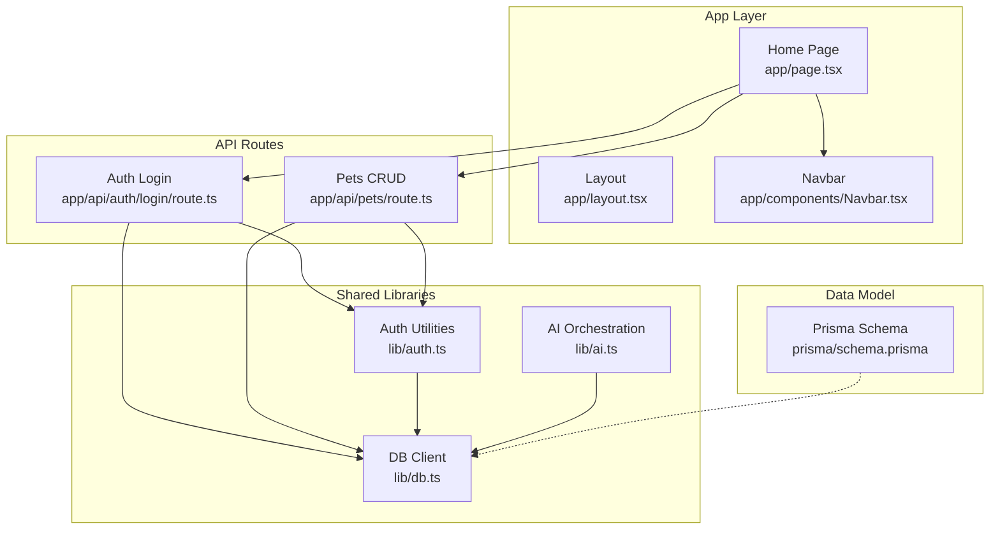
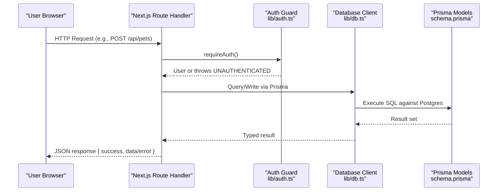
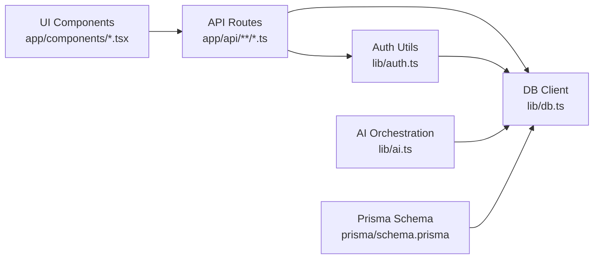

# Coding Standards & Conventions

<cite>
**Referenced Files in This Document**
- [package.json](file://package.json)
- [tsconfig.json](file://tsconfig.json)
- [eslint.config.mjs](file://eslint.config.mjs)
- [next.config.ts](file://next.config.ts)
- [lib/db.ts](file://lib/db.ts)
- [lib/auth.ts](file://lib/auth.ts)
- [lib/ai.ts](file://lib/ai.ts)
- [prisma/schema.prisma](file://prisma/schema.prisma)
- [app/layout.tsx](file://app/layout.tsx)
- [app/page.tsx](file://app/page.tsx)
- [app/components/Navbar.tsx](file://app/components/Navbar.tsx)
- [app/api/auth/login/route.ts](file://app/api/auth/login/route.ts)
- [app/api/pets/route.ts](file://app/api/pets/route.ts)
</cite>

## Table of Contents
1. Introduction
2. Project Structure
3. Core Components
4. Architecture Overview
5. Detailed Component Analysis
6. Dependency Analysis
7. Performance Considerations
8. Troubleshooting Guide
9. Conclusion

## Introduction
This document defines the coding standards and conventions for the PETIVA Pet Healthcare Ecosystem. It covers TypeScript best practices, React component conventions, API design principles for Next.js API routes, file naming and directory structure standards, ESLint configuration rules, code formatting, import/export organization, and documentation comment conventions. Examples are grounded in the actual codebase to ensure consistency across the project.

## Project Structure
The application follows a feature-oriented layout with clear separation between UI components, server-side API routes, shared libraries, and data models:
- app/: Next.js App Router pages, layouts, and route handlers
- app/components/: Reusable client-side UI components
- lib/: Shared server utilities (auth, database, AI orchestration)
- prisma/: Data model definitions and migrations
- Configuration files at root for TypeScript, ESLint, Next.js, and package management

**Diagram sources**
- [app/layout.tsx:1-16](file://app/layout.tsx#L1-L16)
- [app/page.tsx:1-223](file://app/page.tsx#L1-L223)
- [app/components/Navbar.tsx:1-49](file://app/components/Navbar.tsx#L1-L49)
- [app/api/auth/login/route.ts:1-58](file://app/api/auth/login/route.ts#L1-L58)
- [app/api/pets/route.ts:1-69](file://app/api/pets/route.ts#L1-L69)
- [lib/db.ts:1-33](file://lib/db.ts#L1-L33)
- [lib/auth.ts:1-125](file://lib/auth.ts#L1-L125)
- [lib/ai.ts:1-467](file://lib/ai.ts#L1-L467)
- [prisma/schema.prisma:1-312](file://prisma/schema.prisma#L1-L312)

**Section sources**
- [package.json:1-35](file://package.json#L1-L35)
- [next.config.ts:1-8](file://next.config.ts#L1-L8)
- [tsconfig.json:1-35](file://tsconfig.json#L1-L35)

## Core Components
- Database client: Singleton Prisma client with connection pooling; production uses a dedicated pool, development reuses global instances to avoid hot-reload issues.
- Authentication: Password hashing/verification, session token generation/validation, cookie helpers, and middleware-like guards (requireAuth, requireRole).
- AI orchestration: Provider abstraction with concrete implementations and fallback strategy; tool execution layer that safely queries domain data based on authenticated user context.

Key patterns observed:
- Strict TypeScript enabled with path aliases (@/*)
- Consistent error shape in API responses using success/error envelope
- Centralized auth checks via requireAuth() before DB operations
- Clear separation of concerns between UI, API routes, and shared libs

**Section sources**
- [lib/db.ts:1-33](file://lib/db.ts#L1-L33)
- [lib/auth.ts:1-125](file://lib/auth.ts#L1-L125)
- [lib/ai.ts:1-467](file://lib/ai.ts#L1-L467)
- [tsconfig.json:1-35](file://tsconfig.json#L1-L35)

## Architecture Overview
The system is a Next.js full-stack application:
- Client components render UI and manage local state
- API routes enforce authentication, validate inputs, and interact with Prisma
- Shared libraries encapsulate cross-cutting concerns (auth, DB, AI)
- Prisma schema defines the canonical data model used throughout

**Diagram sources**
- [app/api/pets/route.ts:1-69](file://app/api/pets/route.ts#L1-L69)
- [lib/auth.ts:99-125](file://lib/auth.ts#L99-L125)
- [lib/db.ts:1-33](file://lib/db.ts#L1-L33)
- [prisma/schema.prisma:30-88](file://prisma/schema.prisma#L30-L88)

## Detailed Component Analysis

### TypeScript Best Practices
- Enable strict mode and modern module resolution for predictable types and bundler compatibility.
- Use path aliases (@/*) to simplify imports and avoid relative path hell.
- Prefer explicit interfaces for props and request/response shapes; leverage enums for constrained domains.
- Avoid any where possible; when integrating third-party APIs, narrow types early.

Examples in codebase:
- Path alias usage in route handlers and libraries
- Enumerations for roles, statuses, and associations
- Explicit interfaces for AI message parameters and tool calls

**Section sources**
- [tsconfig.json:1-35](file://tsconfig.json#L1-L35)
- [prisma/schema.prisma:9-28](file://prisma/schema.prisma#L9-L28)
- [lib/ai.ts:4-30](file://lib/ai.ts#L4-L30)

### React Component Conventions
- Use functional components with 'use client' directive for interactivity.
- Define prop interfaces explicitly and destructure props in function signatures.
- Keep components focused and composable; lift state up to parent pages when needed.
- Use hooks for side effects and state; prefer memoization only when necessary.

Example: Navbar demonstrates typed props, event handlers passed from parent, and Tailwind-based styling.

**Section sources**
- [app/components/Navbar.tsx:1-49](file://app/components/Navbar.tsx#L1-L49)
- [app/page.tsx:1-223](file://app/page.tsx#L1-L223)

### API Design Principles (RESTful)
- Resource-oriented URLs under /api/<resource> with HTTP methods mapping to CRUD semantics.
- Consistent response envelope: { success: boolean, ...data | error: { code, message } }.
- Input validation at the boundary; return 400 for malformed requests.
- Authentication via requireAuth(); unauthorized returns 401.
- Idempotent reads; safe mutations guarded by role checks when needed.

Examples:
- GET/POST /api/pets: list and create pet profiles for the authenticated owner
- POST /api/auth/login: authenticate and issue session cookie

**Section sources**
- [app/api/pets/route.ts:1-69](file://app/api/pets/route.ts#L1-L69)
- [app/api/auth/login/route.ts:1-58](file://app/api/auth/login/route.ts#L1-L58)

### Error Handling Patterns
- Centralize auth errors and map them to appropriate HTTP status codes.
- Wrap route handlers in try/catch; log server errors and return generic messages to clients.
- Validate inputs before DB access to fail fast.
- For AI tools, return structured error payloads for business rule violations (e.g., past dates, outside working hours).

**Section sources**
- [app/api/pets/route.ts:16-27](file://app/api/pets/route.ts#L16-L27)
- [app/api/auth/login/route.ts:50-56](file://app/api/auth/login/route.ts#L50-L56)
- [lib/ai.ts:418-448](file://lib/ai.ts#L418-L448)

### File Naming and Directory Structure
- Pages and layouts: PascalCase directories/files under app/ (e.g., dashboard/page.tsx).
- Components: PascalCase .tsx files under app/components/.
- API routes: kebab-case directories per resource with route.ts per method.
- Libraries: lowercase with descriptive names under lib/.
- Data models: prisma/schema.prisma with singular model names and camelCase fields.

**Section sources**
- [app/layout.tsx:1-16](file://app/layout.tsx#L1-L16)
- [app/page.tsx:1-223](file://app/page.tsx#L1-L223)
- [app/components/Navbar.tsx:1-49](file://app/components/Navbar.tsx#L1-L49)
- [app/api/auth/login/route.ts:1-58](file://app/api/auth/login/route.ts#L1-L58)
- [app/api/pets/route.ts:1-69](file://app/api/pets/route.ts#L1-L69)
- [prisma/schema.prisma:30-88](file://prisma/schema.prisma#L30-L88)

### Module Organization and Import/Export
- Single responsibility per file; co-locate related logic (e.g., auth utilities together).
- Named exports for functions and constants; default export for primary entry points (e.g., Prisma client).
- Use absolute paths via @/* alias to improve readability and reduce coupling.

**Section sources**
- [lib/db.ts:1-33](file://lib/db.ts#L1-L33)
- [lib/auth.ts:1-125](file://lib/auth.ts#L1-L125)
- [lib/ai.ts:1-467](file://lib/ai.ts#L1-L467)

### Documentation Comment Conventions
- Add JSDoc-style comments for exported functions and complex logic blocks.
- Describe purpose, parameters, return values, and side effects.
- Include examples for non-obvious behaviors (e.g., time zone handling in booking tools).

[No sources needed since this section provides general guidance]

### Code Formatting Standards
- Follow ESLint rules provided by eslint-config-next (core web vitals + TypeScript).
- Enforce consistent style via editor integration; run npm run lint locally.
- Leverage Next.js’s built-in optimizations and recommended settings.

**Section sources**
- [eslint.config.mjs:1-19](file://eslint.config.mjs#L1-L19)
- [package.json:5-10](file://package.json#L5-L10)

## Dependency Analysis
Internal dependencies form a layered architecture:
- UI components depend on page-level state and call API routes
- API routes depend on shared auth and DB clients
- Auth and AI layers depend on DB client and environment variables
- Prisma schema drives generated types consumed by all layers

**Diagram sources**
- [app/components/Navbar.tsx:1-49](file://app/components/Navbar.tsx#L1-L49)
- [app/api/pets/route.ts:1-69](file://app/api/pets/route.ts#L1-L69)
- [lib/auth.ts:1-125](file://lib/auth.ts#L1-L125)
- [lib/db.ts:1-33](file://lib/db.ts#L1-L33)
- [lib/ai.ts:1-467](file://lib/ai.ts#L1-L467)
- [prisma/schema.prisma:1-312](file://prisma/schema.prisma#L1-L312)

**Section sources**
- [lib/db.ts:1-33](file://lib/db.ts#L1-L33)
- [lib/auth.ts:1-125](file://lib/auth.ts#L1-L125)
- [lib/ai.ts:1-467](file://lib/ai.ts#L1-L467)
- [prisma/schema.prisma:1-312](file://prisma/schema.prisma#L1-L312)

## Performance Considerations
- Connection pooling: Production uses a dedicated pg pool; development reuses global instances to prevent leaks during hot reloads.
- Selective queries: Use Prisma select/include judiciously to minimize payload size.
- Timezone-aware validations: Booking tools compute availability using localized time to avoid edge cases.
- Fallback provider: AI layer falls back to alternate providers if the primary fails, improving resilience.

**Section sources**
- [lib/db.ts:10-29](file://lib/db.ts#L10-L29)
- [lib/ai.ts:112-139](file://lib/ai.ts#L112-L139)
- [lib/ai.ts:375-409](file://lib/ai.ts#L375-L409)

## Troubleshooting Guide
Common issues and resolutions:
- Authentication failures: Ensure session cookie is present and not expired; verify requireAuth() throws expected errors.
- Validation errors: Check input fields and required parameters; confirm proper status codes (400 vs 401 vs 500).
- Database connectivity: Confirm DATABASE_URL and environment-specific pool setup; check logs for connection errors.
- AI tool errors: Inspect tool name and arguments; verify ownership checks and business rule validations (past dates, working hours).

**Section sources**
- [lib/auth.ts:99-125](file://lib/auth.ts#L99-L125)
- [app/api/pets/route.ts:16-27](file://app/api/pets/route.ts#L16-L27)
- [lib/db.ts:10-29](file://lib/db.ts#L10-L29)
- [lib/ai.ts:418-448](file://lib/ai.ts#L418-L448)

## Conclusion
By adhering to these standards—strict TypeScript, consistent RESTful API design, robust error handling, modular library organization, and disciplined component composition—the PETIVA ecosystem maintains high code quality, scalability, and developer productivity. The patterns demonstrated in the codebase provide a reliable blueprint for extending features while preserving consistency and reliability.