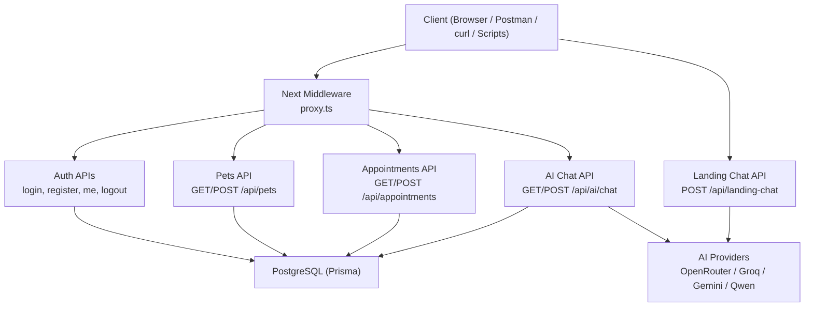
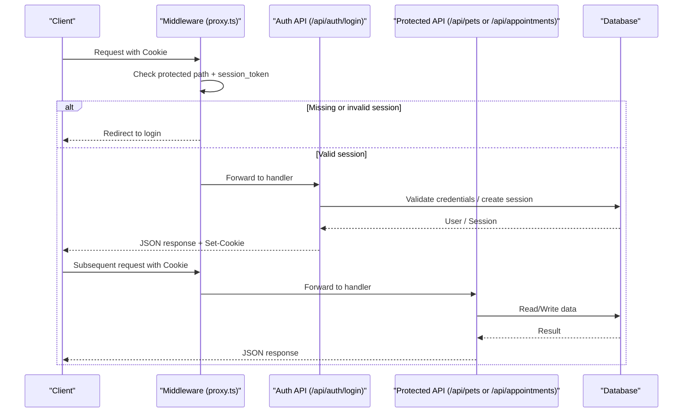
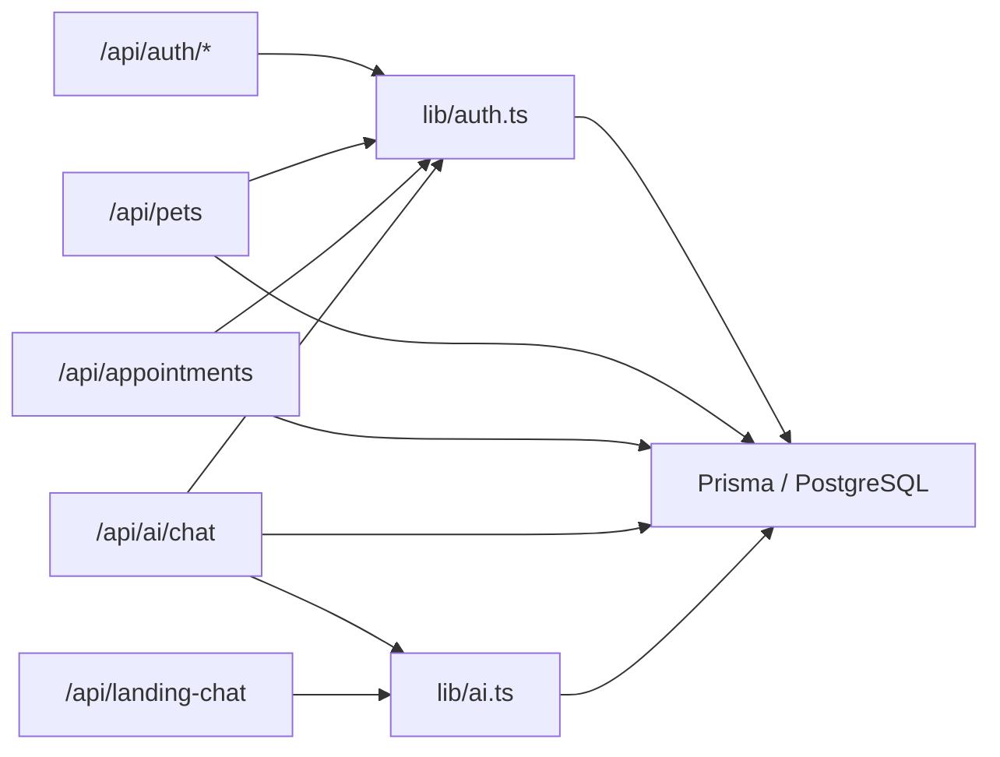

# API Testing & Validation

<cite>
**Referenced Files in This Document**
- [package.json](file://package.json)
- [proxy.ts](file://proxy.ts)
- [lib/auth.ts](file://lib/auth.ts)
- [lib/ai.ts](file://lib/ai.ts)
- [app/api/auth/login/route.ts](file://app/api/auth/login/route.ts)
- [app/api/auth/register/route.ts](file://app/api/auth/register/route.ts)
- [app/api/auth/me/route.ts](file://app/api/auth/me/route.ts)
- [app/api/auth/logout/route.ts](file://app/api/auth/logout/route.ts)
- [app/api/pets/route.ts](file://app/api/pets/route.ts)
- [app/api/appointments/route.ts](file://app/api/appointments/route.ts)
- [app/api/ai/chat/route.ts](file://app/api/ai/chat/route.ts)
- [app/api/landing-chat/route.ts](file://app/api/landing-chat/route.ts)
- [prisma/schema.prisma](file://prisma/schema.prisma)
- [test_booking.ts](file://test_booking.ts)
- [test_deepseek_openrouter.js](file://test_deepseek_openrouter.js)
</cite>

## Table of Contents
1. Introduction
2. Project Structure
3. Core Components
4. Architecture Overview
5. Detailed Component Analysis
6. Dependency Analysis
7. Performance Considerations
8. Troubleshooting Guide
9. Conclusion
10. Appendices

## Introduction
This document provides comprehensive API testing and validation guidance for the PETIVA Pet Healthcare Ecosystem. It covers manual testing with Postman and curl, automated tests included in the project, authentication flows, business logic validation, request/response schema checks, error handling, edge cases, AI service integration testing (OpenRouter and provider fallbacks), load testing techniques, and step-by-step workflows for common operations such as pet registration, appointment booking, medical record creation, and AI consultation requests. It also includes debugging strategies for failed calls, authentication issues, and data validation errors.

## Project Structure
The application is a Next.js API surface backed by Prisma and PostgreSQL. Authentication uses session cookies. AI features integrate with OpenRouter and multiple providers with fallbacks. Protected routes are enforced via a proxy middleware that checks for a session cookie on specific paths.

**Diagram sources**
- [proxy.ts:1-35](file://proxy.ts#L1-L35)
- [app/api/auth/login/route.ts:1-58](file://app/api/auth/login/route.ts#L1-L58)
- [app/api/pets/route.ts:1-69](file://app/api/pets/route.ts#L1-L69)
- [app/api/appointments/route.ts:1-143](file://app/api/appointments/route.ts#L1-L143)
- [app/api/ai/chat/route.ts:1-347](file://app/api/ai/chat/route.ts#L1-L347)
- [app/api/landing-chat/route.ts:1-113](file://app/api/landing-chat/route.ts#L1-L113)

**Section sources**
- [package.json:1-35](file://package.json#L1-L35)
- [proxy.ts:1-35](file://proxy.ts#L1-L35)

## Core Components
- Authentication and sessions: password hashing, session token generation/validation, cookie management, role-based guards.
- Business APIs: pets and appointments with authorization and conflict prevention.
- AI chat: conversation persistence, tool execution, streaming responses, provider selection and fallback.
- Public landing chat: OpenRouter-first with model fallback chain and Gemini fallback.

Key responsibilities:
- lib/auth.ts: session lifecycle, password verification, current user extraction, role enforcement.
- app/api/*: route handlers implementing input validation, authorization, business rules, and consistent error shapes.
- lib/ai.ts: provider abstraction, tool definitions, tool executor, ownership verification, scheduling validations.
- app/api/ai/chat/route.ts: orchestrates conversation, messages, tools, streaming, and persistence.
- app/api/landing-chat/route.ts: public assistant with OpenRouter model fallback and Gemini fallback.

**Section sources**
- [lib/auth.ts:1-125](file://lib/auth.ts#L1-L125)
- [app/api/pets/route.ts:1-69](file://app/api/pets/route.ts#L1-L69)
- [app/api/appointments/route.ts:1-143](file://app/api/appointments/route.ts#L1-L143)
- [lib/ai.ts:1-423](file://lib/ai.ts#L1-L423)
- [app/api/ai/chat/route.ts:1-347](file://app/api/ai/chat/route.ts#L1-L347)
- [app/api/landing-chat/route.ts:1-113](file://app/api/landing-chat/route.ts#L1-L113)

## Architecture Overview
The API layer enforces authentication via session cookies and protects certain routes at the middleware level. AI endpoints use a provider abstraction to call external LLM services and execute tools against the database. The landing chat endpoint is public and implements a robust fallback strategy across models and providers.

**Diagram sources**
- [proxy.ts:1-35](file://proxy.ts#L1-L35)
- [app/api/auth/login/route.ts:1-58](file://app/api/auth/login/route.ts#L1-L58)
- [app/api/pets/route.ts:1-69](file://app/api/pets/route.ts#L1-L69)
- [app/api/appointments/route.ts:1-143](file://app/api/appointments/route.ts#L1-L143)

## Detailed Component Analysis

### Authentication Endpoints
- POST /api/auth/register
  - Validates required fields, role enum, password length, uniqueness.
  - Creates user, creates session, sets session cookie, returns 201 with user payload.
  - Error codes: BAD_REQUEST, CONFLICT, INTERNAL_SERVER_ERROR.
- POST /api/auth/login
  - Validates email/password presence, verifies credentials, creates session, sets cookie, returns 200 with user payload.
  - Error codes: UNAUTHORIZED, INTERNAL_SERVER_ERROR.
- GET /api/auth/me
  - Returns current user if authenticated; otherwise 401.
- POST /api/auth/logout
  - Invalidates session and clears cookie; returns 200.

Manual testing steps (curl):
- Register: send JSON with email, password, role, firstName, lastName; verify 201 and Set-Cookie.
- Login: send email/password; verify 200 and Set-Cookie containing session_token.
- Me: GET with Cookie header set to session_token; expect 200 with user object.
- Logout: POST with Cookie; expect 200 and cleared cookie.

Automated test reference:
- See test_deepseek_openrouter.js for login flow and cookie handling.

Schema expectations:
- Request bodies must include all required fields per endpoint.
- Responses include success flag and either user data or error object with code/message.

Error handling highlights:
- Consistent error shape: { success: false, error: { code, message } }.
- Unauthorized and forbidden handled explicitly.

**Section sources**
- [app/api/auth/register/route.ts:1-78](file://app/api/auth/register/route.ts#L1-L78)
- [app/api/auth/login/route.ts:1-58](file://app/api/auth/login/route.ts#L1-L58)
- [app/api/auth/me/route.ts:1-33](file://app/api/auth/me/route.ts#L1-L33)
- [app/api/auth/logout/route.ts:1-25](file://app/api/auth/logout/route.ts#L1-L25)
- [lib/auth.ts:1-125](file://lib/auth.ts#L1-L125)
- [test_deepseek_openrouter.js:54-123](file://test_deepseek_openrouter.js#L54-L123)

### Pets API
- GET /api/pets
  - Requires authentication; returns pets owned by the current user.
- POST /api/pets
  - Requires authentication; validates name/species; creates pet under owner; returns 201.

Validation and authorization:
- Ownership enforced by querying pets where ownerId matches current user.
- Input validation ensures required fields.

Edge cases:
- Unauthenticated access returns 401.
- Missing fields return 400.

Automated references:
- test_deepseek_openrouter.js exercises GET /api/pets after login.

**Section sources**
- [app/api/pets/route.ts:1-69](file://app/api/pets/route.ts#L1-L69)
- [lib/auth.ts:100-125](file://lib/auth.ts#L100-L125)
- [test_deepseek_openrouter.js:85-103](file://test_deepseek_openrouter.js#L85-L103)

### Appointments API
- GET /api/appointments
  - Role-aware retrieval: PET_OWNER sees their appointments; VETERINARIAN sees theirs; CLINIC_ADMIN sees clinic’s.
- POST /api/appointments
  - Requires authentication; validates required fields; enforces pet ownership; prevents double booking using transactional check; creates appointment with status REQUESTED; returns 201.

Business logic:
- Double-booking prevention within a transaction to avoid race conditions.
- Authorization checks ensure users can only book for their own pets.

Edge cases:
- Conflicting slot returns 409.
- Unauthorized access returns 401 or 403.

Automated references:
- test_booking.ts exercises create_booking and check_slots via AI tools.

**Section sources**
- [app/api/appointments/route.ts:1-143](file://app/api/appointments/route.ts#L1-L143)
- [prisma/schema.prisma:164-182](file://prisma/schema.prisma#L164-L182)
- [test_booking.ts:79-146](file://test_booking.ts#L79-L146)

### AI Chat API
- GET /api/ai/chat?petId=...
  - Requires authentication; verifies pet ownership; returns latest conversation and messages for the given pet.
- POST /api/ai/chat
  - Requires authentication; persists user message; loads recent history; builds system prompt with context; streams NDJSON responses; executes tools requested by the AI; persists assistant replies.

Streaming and tools:
- Streams status and result events until final content or max loops reached.
- Tools include getMyPets, getPetHealthTimeline, getPetAppointments, find_vet, check_slots, create_booking.
- Tool execution enforces ownership and business rules (working hours, past dates, double bookings).

Provider selection and fallback:
- Provider chosen via environment variable; supports Groq, Gemini, Qwen; default falls back to Groq then Gemini.
- Test mode can inspect messagesToSend without calling external providers.

Edge cases:
- Missing petId or message returns 400.
- Access denied returns 403.
- Stream closes safely even on client aborts.

**Section sources**
- [app/api/ai/chat/route.ts:1-347](file://app/api/ai/chat/route.ts#L1-L347)
- [lib/ai.ts:1-423](file://lib/ai.ts#L1-L423)

### Landing Chat API (Public)
- POST /api/landing-chat
  - No authentication required; validates messages array; calls OpenRouter with model fallback chain; if exhausted, falls back to Gemini provider; returns success with assistant message.

Fallback behavior:
- Tries multiple free models sequentially before throwing.
- If all fail, responds with a friendly fallback message.

**Section sources**
- [app/api/landing-chat/route.ts:1-113](file://app/api/landing-chat/route.ts#L1-L113)

### AI Provider Abstraction and Fallback
- OpenRouterProvider: calls OpenRouter chat completions; validates response structure; maps tool_calls.
- Provider selection: getAIProvider returns configured provider or FallbackProvider (Groq primary, Gemini secondary).
- Tool executor: executeTool handles business logic for tools including schedule checks and booking creation.

Testing provider behavior:
- Use environment variables to switch providers.
- Use test scripts to validate tool calls and provider responses.

**Section sources**
- [lib/ai.ts:32-139](file://lib/ai.ts#L32-L139)
- [lib/ai.ts:236-423](file://lib/ai.ts#L236-L423)

## Dependency Analysis
The following diagram shows key runtime dependencies between routes, auth, AI, and database.

**Diagram sources**
- [app/api/auth/login/route.ts:1-58](file://app/api/auth/login/route.ts#L1-L58)
- [app/api/pets/route.ts:1-69](file://app/api/pets/route.ts#L1-L69)
- [app/api/appointments/route.ts:1-143](file://app/api/appointments/route.ts#L1-L143)
- [app/api/ai/chat/route.ts:1-347](file://app/api/ai/chat/route.ts#L1-L347)
- [app/api/landing-chat/route.ts:1-113](file://app/api/landing-chat/route.ts#L1-L113)
- [lib/auth.ts:1-125](file://lib/auth.ts#L1-L125)
- [lib/ai.ts:1-423](file://lib/ai.ts#L1-L423)

**Section sources**
- [lib/auth.ts:1-125](file://lib/auth.ts#L1-L125)
- [lib/ai.ts:1-423](file://lib/ai.ts#L1-L423)

## Performance Considerations
- Use connection pooling and indexes already defined in the schema (e.g., vetId+dateTime on Appointment).
- Limit conversation history to recent messages to reduce context size and latency.
- Prefer batched queries and parallel reads where safe (e.g., health timeline aggregates).
- For AI calls, implement retries with exponential backoff and rate-limit handling; monitor provider quotas.
- Cache frequent read-only data (e.g., vet availability windows) when appropriate.
- Profile database queries using Prisma query logging in development.

[No sources needed since this section provides general guidance]

## Troubleshooting Guide
Common issues and how to debug:
- Authentication failures:
  - Ensure login succeeded and Set-Cookie contains session_token.
  - Verify subsequent requests include the Cookie header.
  - Check middleware protection for protected paths.
- Data validation errors:
  - Confirm required fields are present and correctly typed.
  - Review error responses for code and message fields.
- AI provider errors:
  - Validate environment keys (OPENROUTER_API_KEY, GROQ_API_KEY).
  - Inspect provider logs and fallback behavior.
  - Use test mode to validate message construction without external calls.
- Booking conflicts:
  - Check for existing appointments in the same slot; confirm working hours and timezone handling.

Debugging tips:
- Use curl with verbose output to inspect headers and cookies.
- In Postman, enable “Follow redirects” and capture network logs.
- Add console logs around critical sections (e.g., provider selection, tool execution).
- Use the included test scripts to reproduce issues deterministically.

**Section sources**
- [proxy.ts:1-35](file://proxy.ts#L1-L35)
- [lib/auth.ts:1-125](file://lib/auth.ts#L1-L125)
- [app/api/ai/chat/route.ts:189-240](file://app/api/ai/chat/route.ts#L189-L240)
- [app/api/landing-chat/route.ts:3-52](file://app/api/landing-chat/route.ts#L3-L52)

## Conclusion
This guide outlines how to manually and automatically test the PETIVA API surface, covering authentication, business logic, AI integrations, and error scenarios. By leveraging the provided test scripts, Postman collections, and curl commands, you can validate correctness, resilience, and performance across the system.

[No sources needed since this section summarizes without analyzing specific files]

## Appendices

### Manual API Testing with Postman
- Create a collection named “PETIVA API”.
- Environment variables:
  - BASE_URL: http://localhost:3000
  - COOKIE: session_token value after login
- Requests:
  - POST /api/auth/register: body with email, password, role, firstName, lastName; assert 201 and Set-Cookie.
  - POST /api/auth/login: body with email, password; assert 200 and capture session_token from Set-Cookie.
  - GET /api/auth/me: add Cookie header; assert 200 and user object.
  - GET /api/pets: add Cookie header; assert 200 and pets array.
  - POST /api/pets: add Cookie header; body with name, species; assert 201 and pet object.
  - GET /api/appointments: add Cookie header; assert 200 and appointments array.
  - POST /api/appointments: add Cookie header; body with petId, vetId, clinicId, dateTime, reason; assert 201 or expected error codes.
  - POST /api/ai/chat: add Cookie header; body with conversationId (optional), petId, message; assert streaming NDJSON with status/result events.
  - POST /api/landing-chat: body with messages array; assert 200 and message string.

[No sources needed since this section provides general guidance]

### Manual API Testing with curl
- Register:
  - curl -X POST http://localhost:3000/api/auth/register -H "Content-Type: application/json" -d '{"email":"...","password":"...","role":"PET_OWNER","firstName":"...","lastName":"..."}'
- Login:
  - curl -c cookies.txt -X POST http://localhost:3000/api/auth/login -H "Content-Type: application/json" -d '{"email":"...","password":"..."}'
- Get profile:
  - curl -b cookies.txt http://localhost:3000/api/auth/me
- List pets:
  - curl -b cookies.txt http://localhost:3000/api/pets
- Create pet:
  - curl -b cookies.txt -X POST http://localhost:3000/api/pets -H "Content-Type: application/json" -d '{"name":"...","species":"..."}'
- Book appointment:
  - curl -b cookies.txt -X POST http://localhost:3000/api/appointments -H "Content-Type: application/json" -d '{"petId":"...","vetId":"...","clinicId":"...","dateTime":"...","reason":"..."}'
- AI chat:
  - curl -b cookies.txt -N -X POST http://localhost:3000/api/ai/chat -H "Content-Type: application/json" -d '{"petId":"...","message":"..."}'
- Landing chat:
  - curl -X POST http://localhost:3000/api/landing-chat -H "Content-Type: application/json" -d '{"messages":[{"role":"user","content":"..."}]}'

[No sources needed since this section provides general guidance]

### Automated Testing Approaches
- Existing scripts:
  - test_booking.ts: sets up test data, invokes AI tools for booking and slot checks, validates business rules like past dates, working hours, and double bookings.
  - test_deepseek_openrouter.js: performs login, retrieves pets, triggers AI chat in test mode, asserts response structures.
- How to run:
  - Ensure environment variables are set (database URL, AI provider keys).
  - Execute Node scripts from the repository root.
  - Inspect console output for pass/fail assertions.

**Section sources**
- [test_booking.ts:1-149](file://test_booking.ts#L1-L149)
- [test_deepseek_openrouter.js:1-132](file://test_deepseek_openrouter.js#L1-L132)

### Authentication Flow Testing
- Steps:
  - Register a new user and log in to obtain session_token.
  - Use the cookie for subsequent protected requests.
  - Verify unauthorized access returns 401.
  - Verify logout clears the session and cookie.
- Assertions:
  - Status codes match expectations.
  - Response payloads contain success flags and correct entities.
  - Cookies are set/cleared appropriately.

**Section sources**
- [app/api/auth/register/route.ts:1-78](file://app/api/auth/register/route.ts#L1-L78)
- [app/api/auth/login/route.ts:1-58](file://app/api/auth/login/route.ts#L1-L58)
- [app/api/auth/me/route.ts:1-33](file://app/api/auth/me/route.ts#L1-L33)
- [app/api/auth/logout/route.ts:1-25](file://app/api/auth/logout/route.ts#L1-L25)

### Business Logic Validation
- Pet ownership:
  - Ensure users cannot access or modify other users’ pets.
  - Validate 403 responses when accessing foreign pets.
- Appointment constraints:
  - Working hours enforcement and timezone considerations.
  - Past date rejection.
  - Double-booking prevention via transactions.
- AI tool behaviors:
  - check_slots returns busy slots based on existing appointments.
  - create_booking enforces ownership, time constraints, and conflicts.

**Section sources**
- [app/api/appointments/route.ts:70-143](file://app/api/appointments/route.ts#L70-L143)
- [lib/ai.ts:331-418](file://lib/ai.ts#L331-L418)

### Request/Response Schema Validation
- Common patterns:
  - Success responses include success: true and entity data.
  - Error responses include success: false and error: { code, message }.
  - Required fields validated server-side; missing fields return 400.
- Examples:
  - Register requires email, password, role, firstName, lastName.
  - Login requires email, password.
  - Pets require name, species.
  - Appointments require petId, vetId, clinicId, dateTime, reason.
  - AI chat requires message; petId required for new conversations.

**Section sources**
- [app/api/auth/register/route.ts:6-30](file://app/api/auth/register/route.ts#L6-L30)
- [app/api/auth/login/route.ts:5-32](file://app/api/auth/login/route.ts#L5-L32)
- [app/api/pets/route.ts:31-55](file://app/api/pets/route.ts#L31-L55)
- [app/api/appointments/route.ts:70-129](file://app/api/appointments/route.ts#L70-L129)
- [app/api/ai/chat/route.ts:68-126](file://app/api/ai/chat/route.ts#L68-L126)

### Error Handling Testing
- Expected error codes:
  - BAD_REQUEST for invalid inputs.
  - UNAUTHORIZED for missing/invalid session.
  - FORBIDDEN for insufficient permissions.
  - CONFLICT for duplicate resources or conflicts.
  - INTERNAL_SERVER_ERROR for unexpected failures.
- Tests:
  - Send malformed payloads to trigger validation errors.
  - Access protected endpoints without cookies to verify 401.
  - Attempt to book conflicting slots to verify 409.

**Section sources**
- [app/api/auth/register/route.ts:10-38](file://app/api/auth/register/route.ts#L10-L38)
- [app/api/auth/login/route.ts:9-32](file://app/api/auth/login/route.ts#L9-L32)
- [app/api/appointments/route.ts:75-110](file://app/api/appointments/route.ts#L75-L110)

### Edge Case Scenarios
- Timezone handling:
  - Working hours and date comparisons use Asia/Karachi timezone.
  - Ensure test dates align with expected timezone conversions.
- Rate limits:
  - External AI providers may throttle; implement retries/backoff in automation.
- Stream handling:
  - AI chat streams NDJSON; clients should handle partial chunks and stream termination.

**Section sources**
- [lib/ai.ts:374-392](file://lib/ai.ts#L374-L392)
- [app/api/ai/chat/route.ts:192-331](file://app/api/ai/chat/route.ts#L192-L331)

### AI Service Testing Methodologies
- OpenRouter integration:
  - Validate API key configuration and response structure.
  - Assert tool_calls mapping and content presence.
- Provider fallback:
  - Configure BOOKING_ASSISTANT_PROVIDER to switch providers.
  - Simulate provider failure to verify fallback behavior.
- Response format validation:
  - Ensure messagesToSend includes system instructions and active pet context in test mode.
  - Validate NDJSON stream events and final message.

**Section sources**
- [lib/ai.ts:32-103](file://lib/ai.ts#L32-L103)
- [lib/ai.ts:109-139](file://lib/ai.ts#L109-L139)
- [app/api/ai/chat/route.ts:145-181](file://app/api/ai/chat/route.ts#L145-L181)
- [app/api/ai/chat/route.ts:189-240](file://app/api/ai/chat/route.ts#L189-L240)

### Load Testing Techniques
- Tools:
  - k6, Artillery, or Locust to simulate concurrent users.
- Scenarios:
  - Authenticate once and reuse session for multiple requests.
  - Mix reads (pets, appointments) and writes (bookings) to emulate real usage.
  - Include AI chat requests to measure provider throughput and latency.
- Metrics:
  - p95/p99 latency, error rates, throughput (RPS).
  - Database query times and provider response times.

[No sources needed since this section provides general guidance]

### Step-by-Step Workflows

#### Pet Registration Workflow
- Register a pet owner account.
- Log in to obtain session cookie.
- Create a pet profile with required fields.
- Verify pet appears in GET /api/pets.

**Section sources**
- [app/api/auth/register/route.ts:1-78](file://app/api/auth/register/route.ts#L1-L78)
- [app/api/pets/route.ts:31-69](file://app/api/pets/route.ts#L31-L69)

#### Appointment Booking Workflow
- Ensure pet exists and user owns it.
- Choose a vet and clinic; select a future date/time within working hours.
- POST /api/appointments to create an appointment.
- Verify 201 response and appointment details; attempt duplicate booking to verify 409.

**Section sources**
- [app/api/appointments/route.ts:70-143](file://app/api/appointments/route.ts#L70-L143)
- [lib/ai.ts:366-418](file://lib/ai.ts#L366-L418)

#### Medical Record Creation Workflow
- Note: Direct endpoints for creating medical records are not shown in the analyzed routes; typically created by veterinarians through vet-specific endpoints.
- To test indirectly:
  - Create a veterinarian account and associate with a clinic.
  - Use vet endpoints (if available) to create records for a pet.
  - Validate ownership and role-based access.

[No sources needed since this section describes conceptual workflow without direct file analysis]

#### AI Consultation Request Workflow
- Log in and retrieve a pet ID.
- POST /api/ai/chat with message; handle streaming NDJSON.
- In test mode, inspect messagesToSend to validate system prompt and context.
- Validate tool calls and results for health timeline, appointments, and booking flows.

**Section sources**
- [app/api/ai/chat/route.ts:68-347](file://app/api/ai/chat/route.ts#L68-L347)
- [lib/ai.ts:141-219](file://lib/ai.ts#L141-L219)

### Debugging Techniques
- Failed API calls:
  - Inspect status codes and error objects.
  - Use verbose curl or Postman network logs.
- Authentication issues:
  - Confirm session_token presence and validity.
  - Check middleware protection for protected paths.
- Data validation errors:
  - Compare request payloads against required fields.
  - Validate enums and types (e.g., UserRole).

**Section sources**
- [proxy.ts:1-35](file://proxy.ts#L1-L35)
- [lib/auth.ts:100-125](file://lib/auth.ts#L100-L125)
- [app/api/auth/register/route.ts:10-30](file://app/api/auth/register/route.ts#L10-L30)