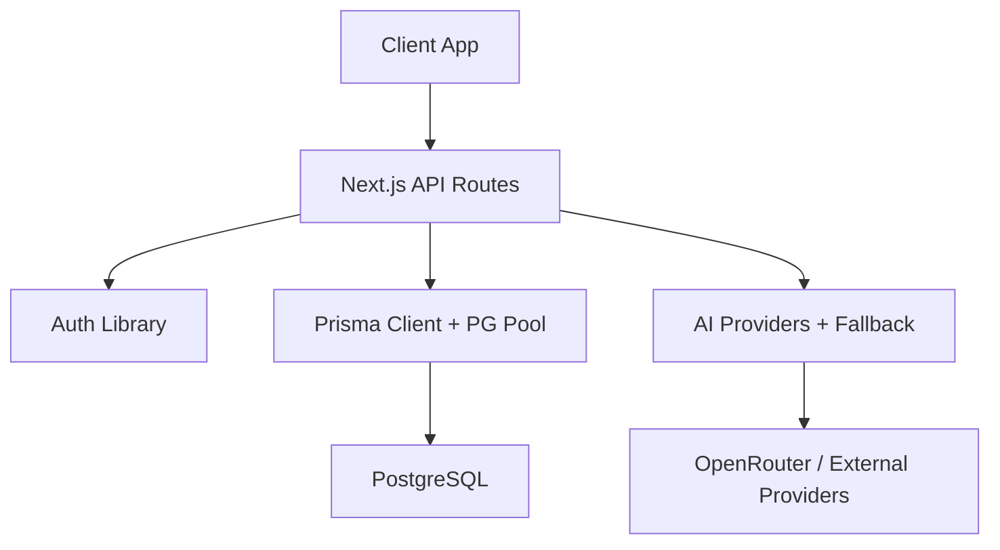
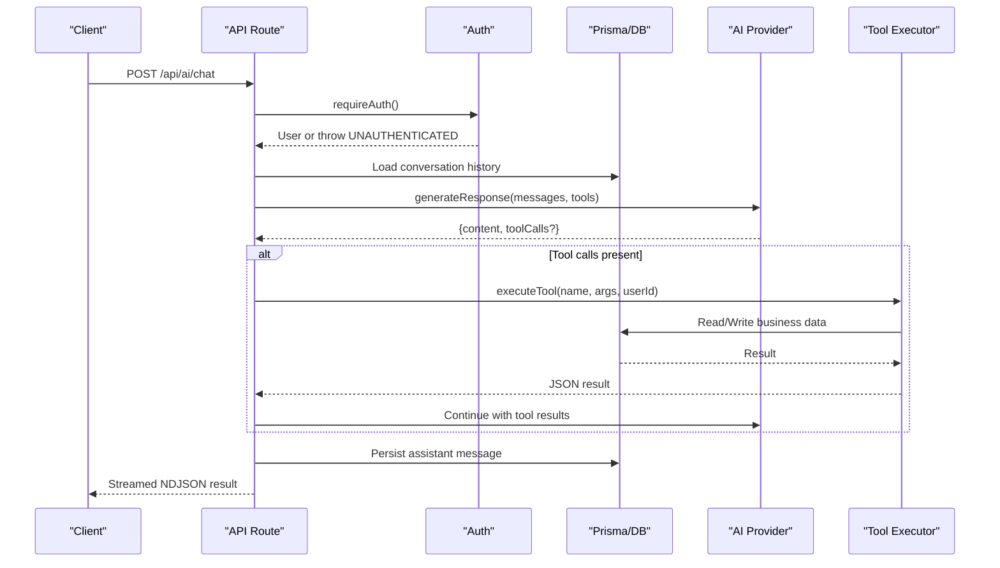
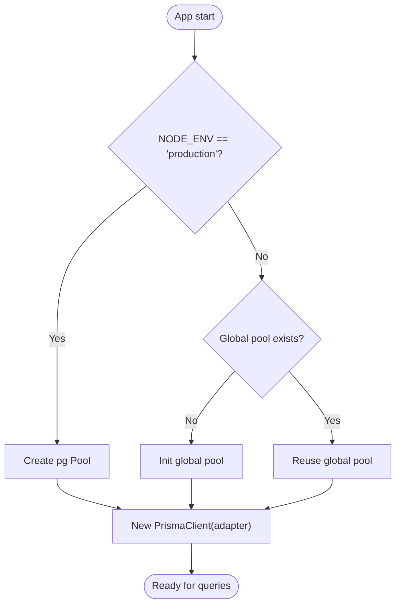
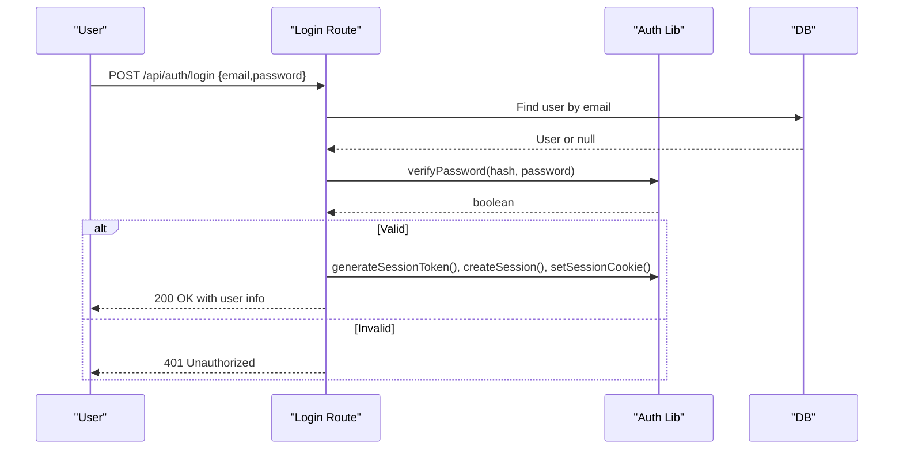
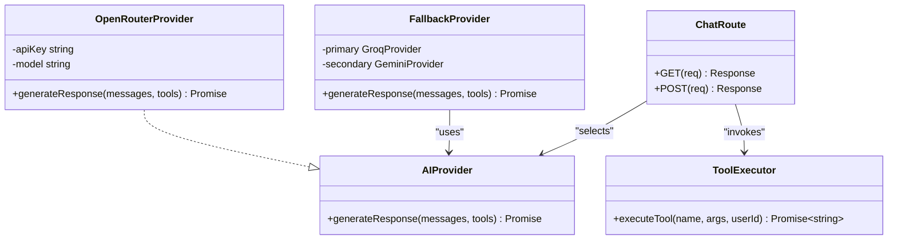
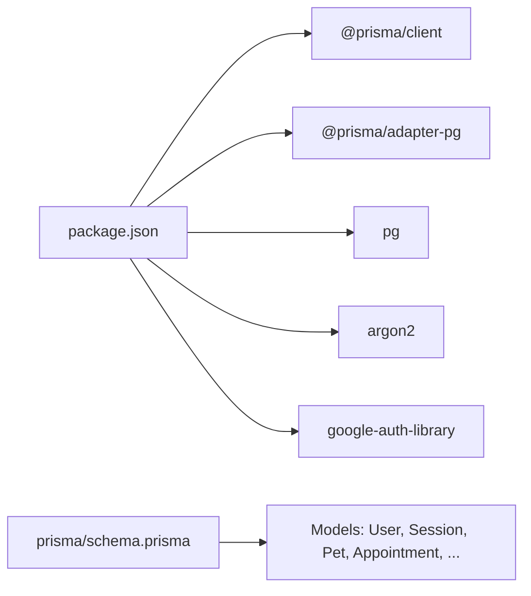
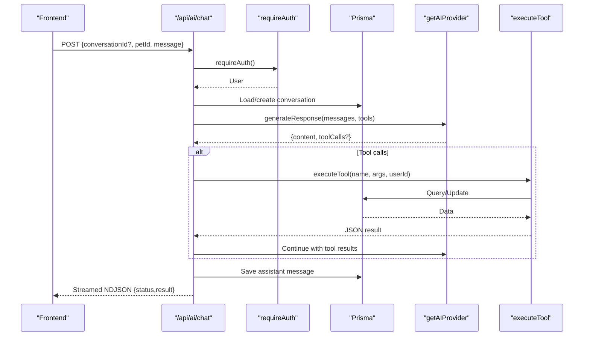

# Backend Debugging & Node.js

<cite>
**Referenced Files in This Document**
- [package.json](file://package.json)
- [lib/db.ts](file://lib/db.ts)
- [prisma/schema.prisma](file://prisma/schema.prisma)
- [lib/auth.ts](file://lib/auth.ts)
- [app/api/auth/login/route.ts](file://app/api/auth/login/route.ts)
- [app/api/auth/register/route.ts](file://app/api/auth/register/route.ts)
- [proxy.ts](file://proxy.ts)
- [lib/ai.ts](file://lib/ai.ts)
- [app/api/ai/chat/route.ts](file://app/api/ai/chat/route.ts)
- [app/api/landing-chat/route.ts](file://app/api/landing-chat/route.ts)
- [test_deepseek_openrouter.js](file://test_deepseek_openrouter.js)
</cite>

## Table of Contents
1. Introduction
2. Project Structure
3. Core Components
4. Architecture Overview
5. Detailed Component Analysis
6. Dependency Analysis
7. Performance Considerations
8. Troubleshooting Guide
9. Conclusion

## Introduction
This document provides a comprehensive backend debugging guide for the PETIVA Pet Healthcare Ecosystem server-side code. It focuses on Node.js debugging techniques, structured logging strategies, database debugging with Prisma and PostgreSQL, authentication debugging (sessions, tokens, roles), and AI service debugging (OpenRouter integration, provider fallbacks, response validation). It also includes step-by-step guides to diagnose common issues such as authentication failures, database connection problems, and AI service timeouts.

## Project Structure
The backend is implemented using Next.js API routes under app/api, with shared libraries for authentication, database access, and AI integrations. The data layer uses Prisma with a PostgreSQL adapter and connection pooling. Authentication relies on HTTP-only session cookies backed by a Session model. AI features use an abstraction over multiple providers with fallback mechanisms and tool execution.

**Diagram sources**
- [lib/db.ts:1-33](file://lib/db.ts#L1-L33)
- [lib/auth.ts:1-125](file://lib/auth.ts#L1-L125)
- [lib/ai.ts:1-140](file://lib/ai.ts#L1-L140)
- [app/api/ai/chat/route.ts:1-347](file://app/api/ai/chat/route.ts#L1-L347)

**Section sources**
- [package.json:1-35](file://package.json#L1-L35)
- [lib/db.ts:1-33](file://lib/db.ts#L1-L33)
- [prisma/schema.prisma:1-312](file://prisma/schema.prisma#L1-L312)

## Core Components
- Database layer: Singleton Prisma client with pg pool; environment-aware initialization to avoid duplicate pools in development.
- Authentication: Session-based auth with hashed tokens stored in DB, cookie helpers, and role enforcement.
- AI services: Provider abstraction, OpenRouter implementation, provider selection via env, fallback logic, and tool execution pipeline.
- API routes: Request handling, input validation, authorization checks, streaming responses for AI chat, and consistent error shaping.

Key debugging entry points:
- lib/db.ts for connection and pool diagnostics.
- lib/auth.ts for session lifecycle and cookie behavior.
- lib/ai.ts for provider selection, fallback, and tool execution logs.
- app/api/ai/chat/route.ts for end-to-end request flow and stream events.

**Section sources**
- [lib/db.ts:1-33](file://lib/db.ts#L1-L33)
- [lib/auth.ts:1-125](file://lib/auth.ts#L1-L125)
- [lib/ai.ts:1-140](file://lib/ai.ts#L1-L140)
- [app/api/ai/chat/route.ts:1-347](file://app/api/ai/chat/route.ts#L1-L347)

## Architecture Overview
The system processes requests through Next.js API routes that enforce authentication, interact with Prisma for data operations, and optionally call AI providers. AI flows may invoke tools that read/write domain entities. A proxy enforces route-level protection based on cookies.

**Diagram sources**
- [app/api/ai/chat/route.ts:68-347](file://app/api/ai/chat/route.ts#L68-L347)
- [lib/auth.ts:99-125](file://lib/auth.ts#L99-L125)
- [lib/ai.ts:112-139](file://lib/ai.ts#L112-L139)
- [lib/ai.ts:235-423](file://lib/ai.ts#L235-L423)

## Detailed Component Analysis

### Database Debugging with Prisma and PostgreSQL
- Connection pooling: In production, a single pg Pool is created and passed to PrismaPg. In development, global caching prevents multiple pools across hot reloads.
- Diagnostics:
  - Verify DATABASE_URL and environment mode.
  - Inspect pool state by logging pool stats if needed.
  - Use Prisma query logging to capture SQL statements and durations.
- Common issues:
  - Too many connections: Ensure pool sizing matches concurrency and DB limits.
  - Deadlocks/timeouts: Review long-running queries and indexes defined in schema.
  - Migration errors: Validate migration files and schema consistency.

**Diagram sources**
- [lib/db.ts:10-29](file://lib/db.ts#L10-L29)

**Section sources**
- [lib/db.ts:1-33](file://lib/db.ts#L1-L33)
- [prisma/schema.prisma:1-312](file://prisma/schema.prisma#L1-L312)

### Authentication Debugging: Sessions, Tokens, Roles
- Session lifecycle:
  - Login creates a token, hashes it, stores a Session row, and sets an httpOnly cookie.
  - Subsequent requests validate the cookie, look up the session, handle expiration, and extend near-expiry sessions.
  - Logout invalidates the session and clears the cookie.
- Role-based access:
  - requireRole enforces allowed roles at route level.
- Proxy protection:
  - Middleware redirects unauthenticated users from protected paths.

**Diagram sources**
- [app/api/auth/login/route.ts:5-58](file://app/api/auth/login/route.ts#L5-L58)
- [lib/auth.ts:10-97](file://lib/auth.ts#L10-L97)

**Section sources**
- [lib/auth.ts:1-125](file://lib/auth.ts#L1-L125)
- [app/api/auth/login/route.ts:1-58](file://app/api/auth/login/route.ts#L1-L58)
- [app/api/auth/register/route.ts:1-78](file://app/api/auth/register/route.ts#L1-L78)
- [proxy.ts:1-35](file://proxy.ts#L1-L35)

### AI Service Debugging: OpenRouter, Fallbacks, Tools
- Provider selection:
  - getAIProvider chooses among Qwen, Gemini, Groq, or a FallbackProvider based on BOOKING_ASSISTANT_PROVIDER.
  - FallbackProvider tries primary (Groq) then secondary (Gemini) on failure.
- OpenRouter integration:
  - OpenRouterProvider validates API key, builds payload, sends to OpenRouter, and validates response structure.
- Tool execution:
  - executeTool dispatches function calls with ownership checks and DB interactions; logs tool start and arguments.
- Streaming chat:
  - Chat route streams status and result messages, persists assistant replies, and handles max loop guard.

**Diagram sources**
- [lib/ai.ts:21-139](file://lib/ai.ts#L21-L139)
- [app/api/ai/chat/route.ts:68-347](file://app/api/ai/chat/route.ts#L68-L347)
- [lib/ai.ts:235-423](file://lib/ai.ts#L235-L423)

**Section sources**
- [lib/ai.ts:1-423](file://lib/ai.ts#L1-L423)
- [app/api/ai/chat/route.ts:1-347](file://app/api/ai/chat/route.ts#L1-L347)
- [app/api/landing-chat/route.ts:1-105](file://app/api/landing-chat/route.ts#L1-L105)

### Logging Strategy and Error Tracking
- Structured logging patterns:
  - Use consistent prefixes like [AI DIAGNOSTIC] and [AI DIAGNOSTIC - TOOL START] to categorize logs.
  - Log request boundaries, provider selection, tool names, and parameters.
- Error tracking:
  - Catch and log errors per route with contextual messages.
  - Normalize error responses with codes and messages for clients.
- Request/response logging:
  - For AI chat, stream status updates to help trace multi-turn tool usage.
  - Capture test-mode payloads to inspect messages sent to providers.

**Section sources**
- [lib/ai.ts:112-139](file://lib/ai.ts#L112-L139)
- [lib/ai.ts:235-423](file://lib/ai.ts#L235-L423)
- [app/api/ai/chat/route.ts:189-347](file://app/api/ai/chat/route.ts#L189-L347)
- [app/api/landing-chat/route.ts:1-105](file://app/api/landing-chat/route.ts#L1-L105)

## Dependency Analysis
- Runtime dependencies relevant to debugging:
  - @prisma/client and @prisma/adapter-pg for database access.
  - pg for connection pooling.
  - argon2 for password hashing.
  - google-auth-library for OAuth flows.
- Configuration:
  - Environment variables control provider selection and credentials.
  - Schema defines models used throughout the application.

**Diagram sources**
- [package.json:11-33](file://package.json#L11-L33)
- [prisma/schema.prisma:30-312](file://prisma/schema.prisma#L30-L312)

**Section sources**
- [package.json:1-35](file://package.json#L1-L35)
- [prisma/schema.prisma:1-312](file://prisma/schema.prisma#L1-L312)

## Performance Considerations
- Database:
  - Tune pg pool size and timeouts according to workload.
  - Use Prisma query logging to identify slow queries and N+1 patterns.
- AI:
  - Limit context window by fetching recent messages only.
  - Implement retries and timeouts for external provider calls.
  - Prefer minimal tool payloads and selective field projections.
- Streaming:
  - Stream responses to reduce perceived latency and improve resilience.

[No sources needed since this section provides general guidance]

## Troubleshooting Guide

### Node.js Debugging Capabilities
- Debugger statements and breakpoints:
  - Insert debugger statements in critical paths (e.g., login, AI chat handler) to pause execution in your IDE.
  - Set breakpoints on functions like requireAuth, validateSession, executeTool, and getAIProvider.
- Variable inspection:
  - Inspect req, res, user, messagesToSend, toolCalls, and DB query results during runtime.
- Process-level debugging:
  - Use Node inspector flags when running locally to attach debuggers.
  - Leverage structured logs to correlate breakpoints with runtime behavior.

[No sources needed since this section provides general guidance]

### Authentication Failures
Symptoms:
- Redirects to login despite valid credentials.
- 401 Unauthorized on protected endpoints.
- Cookie not set or missing.

Steps:
1. Verify login endpoint returns success and sets session_token cookie.
   - Reference: [app/api/auth/login/route.ts:5-58](file://app/api/auth/login/route.ts#L5-L58)
2. Confirm cookie attributes (httpOnly, secure, sameSite) are correct for your environment.
   - Reference: [lib/auth.ts:83-97](file://lib/auth.ts#L83-L97)
3. Validate session lookup and expiration handling.
   - Reference: [lib/auth.ts:46-80](file://lib/auth.ts#L46-L80)
4. Check route-level protection and redirect behavior.
   - Reference: [proxy.ts:9-23](file://proxy.ts#L9-L23)
5. Ensure requireAuth and requireRole are invoked in protected routes.
   - Reference: [lib/auth.ts:99-125](file://lib/auth.ts#L99-L125)

**Section sources**
- [app/api/auth/login/route.ts:1-58](file://app/api/auth/login/route.ts#L1-L58)
- [lib/auth.ts:1-125](file://lib/auth.ts#L1-L125)
- [proxy.ts:1-35](file://proxy.ts#L1-L35)

### Database Connection Problems
Symptoms:
- Timeouts or connection refused errors.
- Excessive open connections.
- Migration failures.

Steps:
1. Validate DATABASE_URL and NODE_ENV settings.
   - Reference: [lib/db.ts:8-13](file://lib/db.ts#L8-L13)
2. Inspect pool creation and reuse in development vs production.
   - Reference: [lib/db.ts:14-29](file://lib/db.ts#L14-L29)
3. Enable Prisma query logging to capture SQL and durations.
   - Configure via Prisma client options and run migrations to ensure schema alignment.
4. Review schema indexes and constraints for performance and integrity.
   - Reference: [prisma/schema.prisma:30-312](file://prisma/schema.prisma#L30-L312)

**Section sources**
- [lib/db.ts:1-33](file://lib/db.ts#L1-L33)
- [prisma/schema.prisma:1-312](file://prisma/schema.prisma#L1-L312)

### AI Service Timeouts and Errors
Symptoms:
- Empty or malformed AI responses.
- Fallback triggers unexpectedly.
- Tool execution fails mid-flow.

Steps:
1. Confirm OPENROUTER_API_KEY and model configuration.
   - Reference: [lib/ai.ts:32-47](file://lib/ai.ts#L32-L47)
2. Validate provider selection and fallback chain.
   - Reference: [lib/ai.ts:105-139](file://lib/ai.ts#L105-L139)
3. Inspect streamed status messages and final content.
   - Reference: [app/api/ai/chat/route.ts:192-331](file://app/api/ai/chat/route.ts#L192-L331)
4. Test tool execution and DB interactions.
   - Reference: [lib/ai.ts:235-423](file://lib/ai.ts#L235-L423)
5. Use test scripts to simulate requests and validate payloads.
   - Reference: [test_deepseek_openrouter.js:54-132](file://test_deepseek_openrouter.js#L54-L132)

**Section sources**
- [lib/ai.ts:1-423](file://lib/ai.ts#L1-L423)
- [app/api/ai/chat/route.ts:1-347](file://app/api/ai/chat/route.ts#L1-L347)
- [test_deepseek_openrouter.js:1-132](file://test_deepseek_openrouter.js#L1-L132)

### End-to-End Debugging Flow for AI Chat

**Diagram sources**
- [app/api/ai/chat/route.ts:68-347](file://app/api/ai/chat/route.ts#L68-L347)
- [lib/auth.ts:99-125](file://lib/auth.ts#L99-L125)
- [lib/ai.ts:112-139](file://lib/ai.ts#L112-L139)
- [lib/ai.ts:235-423](file://lib/ai.ts#L235-L423)

## Conclusion
This guide outlined practical debugging strategies for the PETIVA backend, covering Node.js debugging, structured logging, Prisma and PostgreSQL troubleshooting, authentication flows, and AI service diagnostics. By leveraging the provided code references, you can systematically isolate issues, observe runtime state, and resolve problems efficiently across the full stack.