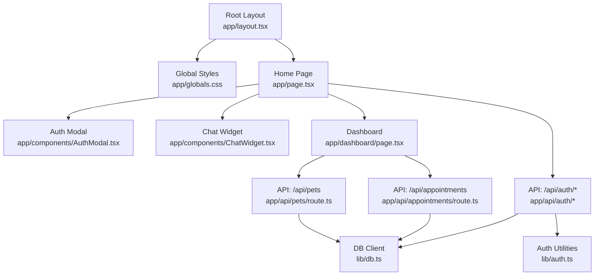
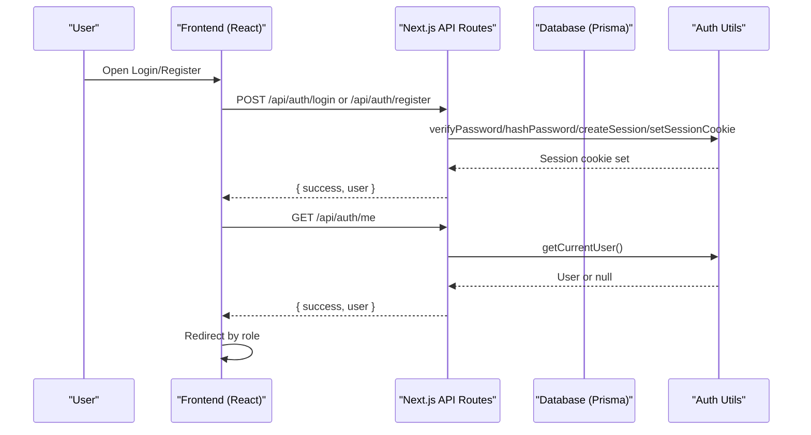
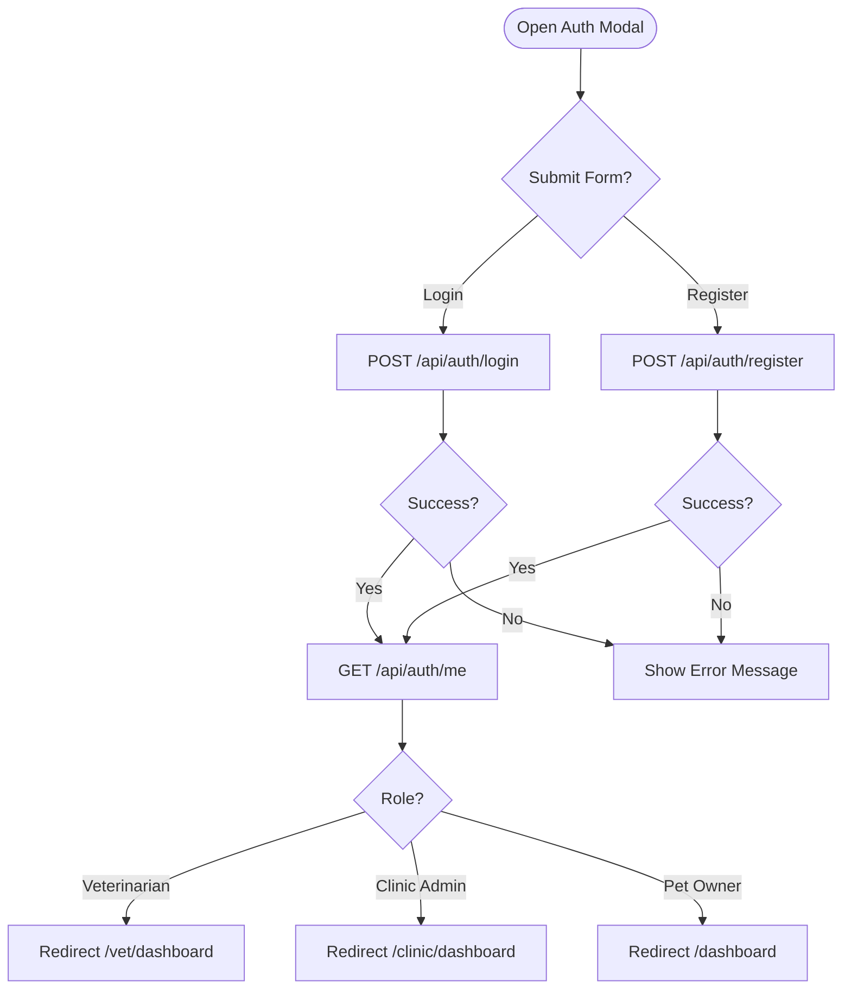
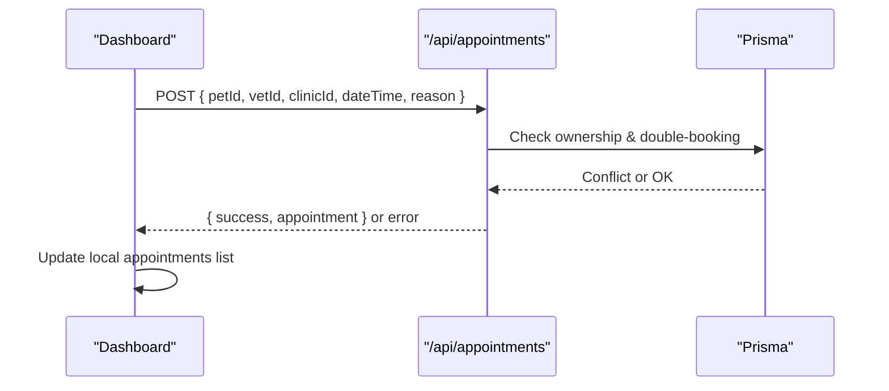
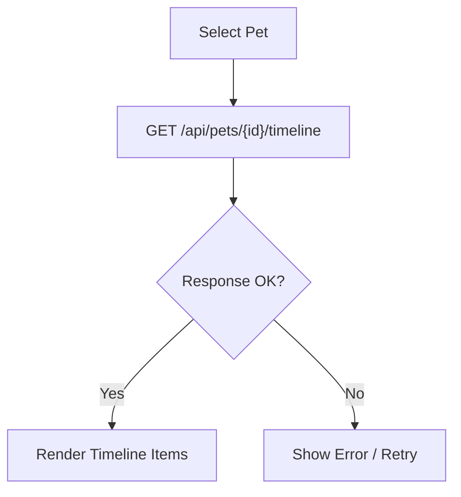
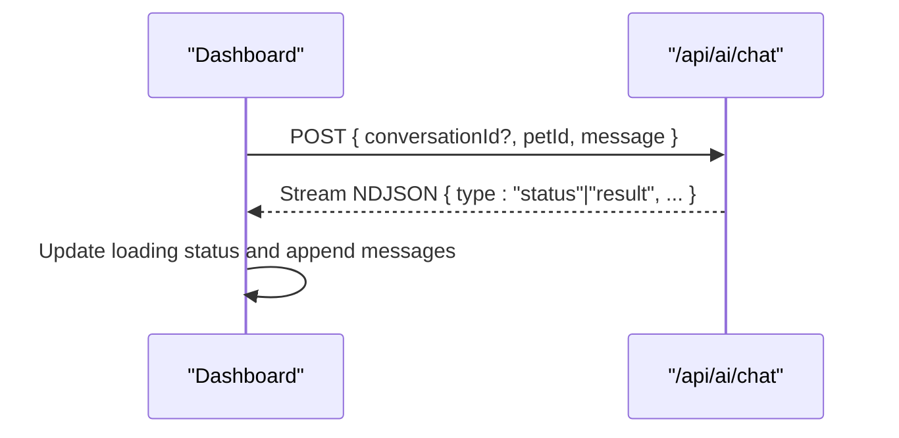
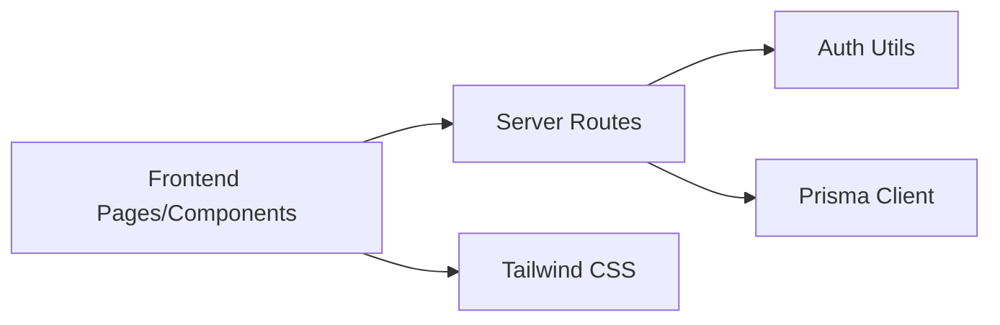

# Browser Developer Tools

<cite>
**Referenced Files in This Document**
- [package.json](file://package.json)
- [next.config.ts](file://next.config.ts)
- [app/layout.tsx](file://app/layout.tsx)
- [app/globals.css](file://app/globals.css)
- [app/page.tsx](file://app/page.tsx)
- [app/components/AuthModal.tsx](file://app/components/AuthModal.tsx)
- [app/components/ChatWidget.tsx](file://app/components/ChatWidget.tsx)
- [app/dashboard/page.tsx](file://app/dashboard/page.tsx)
- [app/api/auth/login/route.ts](file://app/api/auth/login/route.ts)
- [app/api/auth/register/route.ts](file://app/api/auth/register/route.ts)
- [app/api/auth/me/route.ts](file://app/api/auth/me/route.ts)
- [app/api/pets/route.ts](file://app/api/pets/route.ts)
- [app/api/appointments/route.ts](file://app/api/appointments/route.ts)
- [lib/auth.ts](file://lib/auth.ts)
- [lib/db.ts](file://lib/db.ts)
</cite>

## Table of Contents
1. Introduction
2. Project Structure
3. Core Components
4. Architecture Overview
5. Detailed Component Analysis
6. Dependency Analysis
7. Performance Considerations
8. Troubleshooting Guide
9. Conclusion

## Introduction
This document provides a comprehensive guide to debugging the PETIVA Pet Healthcare Ecosystem frontend using browser developer tools. It focuses on Chrome DevTools for React components, Next.js App Router state management, network monitoring for API calls and AI integrations, Elements panel techniques for Tailwind CSS styling and responsive issues, Console debugging for TypeScript and JavaScript errors, and performance profiling with React DevTools, memory analysis, and bundle size optimization. Step-by-step guides are included for common issues such as authentication flow problems, appointment booking UI errors, and pet health record display issues.

## Project Structure
The application is a Next.js 16 project using React 19 and Tailwind CSS v4. The root layout sets global styles and metadata. The home page composes public-facing sections and an authentication modal, while the dashboard implements client-side state for pets, appointments, profile, and AI assistant features. Server routes under app/api handle authentication, pets, appointments, and AI chat endpoints. Authentication uses server-side sessions via cookies, with Prisma managing database interactions.

**Diagram sources**
- [app/layout.tsx:1-16](file://app/layout.tsx#L1-L16)
- [app/globals.css:1-20](file://app/globals.css#L1-L20)
- [app/page.tsx:1-223](file://app/page.tsx#L1-L223)
- [app/components/AuthModal.tsx:1-205](file://app/components/AuthModal.tsx#L1-L205)
- [app/components/ChatWidget.tsx:1-149](file://app/components/ChatWidget.tsx#L1-L149)
- [app/dashboard/page.tsx:1-800](file://app/dashboard/page.tsx#L1-L800)
- [app/api/pets/route.ts:1-69](file://app/api/pets/route.ts#L1-L69)
- [app/api/appointments/route.ts:1-143](file://app/api/appointments/route.ts#L1-L143)
- [app/api/auth/login/route.ts:1-58](file://app/api/auth/login/route.ts#L1-L58)
- [app/api/auth/register/route.ts:1-78](file://app/api/auth/register/route.ts#L1-L78)
- [app/api/auth/me/route.ts:1-33](file://app/api/auth/me/route.ts#L1-L33)
- [lib/auth.ts:1-125](file://lib/auth.ts#L1-L125)
- [lib/db.ts:1-33](file://lib/db.ts#L1-L33)

**Section sources**
- [package.json:1-35](file://package.json#L1-L35)
- [next.config.ts:1-8](file://next.config.ts#L1-L8)
- [app/layout.tsx:1-16](file://app/layout.tsx#L1-L16)
- [app/globals.css:1-20](file://app/globals.css#L1-L20)

## Core Components
- Home page orchestrates auth flows (email/password and Google OAuth), dynamic SDK loading, and redirects based on user role.
- AuthModal renders login/register forms and integrates Google Identity Services button rendering when opened.
- ChatWidget handles public AI chat by sending messages to /api/landing-chat and streaming responses.
- Dashboard manages authenticated data: profile, pets, timeline, appointments, vet discovery, and AI assistant chat with NDJSON streaming support.

Key debugging focus areas:
- Network tab for all fetch calls to /api/* endpoints.
- Console for TypeScript errors, React warnings, and custom error states.
- Elements panel for Tailwind classes and responsive behavior.
- Performance tab and React DevTools for component re-renders and memory usage.

**Section sources**
- [app/page.tsx:1-223](file://app/page.tsx#L1-L223)
- [app/components/AuthModal.tsx:1-205](file://app/components/AuthModal.tsx#L1-L205)
- [app/components/ChatWidget.tsx:1-149](file://app/components/ChatWidget.tsx#L1-L149)
- [app/dashboard/page.tsx:1-800](file://app/dashboard/page.tsx#L1-L800)

## Architecture Overview
The frontend communicates with Next.js server routes that enforce authentication and interact with the database via Prisma. Authentication uses session cookies set server-side. The dashboard streams AI responses using NDJSON when available.

**Diagram sources**
- [app/page.tsx:35-111](file://app/page.tsx#L35-L111)
- [app/api/auth/login/route.ts:1-58](file://app/api/auth/login/route.ts#L1-L58)
- [app/api/auth/register/route.ts:1-78](file://app/api/auth/register/route.ts#L1-L78)
- [app/api/auth/me/route.ts:1-33](file://app/api/auth/me/route.ts#L1-L33)
- [lib/auth.ts:1-125](file://lib/auth.ts#L1-L125)

## Detailed Component Analysis

### Authentication Flow Debugging
Use the following steps to debug login/register and Google OAuth flows:
- Network tab:
  - Inspect POST /api/auth/login and POST /api/auth/register payloads and responses.
  - Verify Set-Cookie headers for session_token and its attributes (httpOnly, secure, sameSite, expires).
  - Check GET /api/auth/me returns user data; if not, confirm cookie presence and validity.
- Console:
  - Look for TypeScript errors in form handlers and fetch calls.
  - Watch for unhandled promise rejections during Google callback handling.
- Elements:
  - Ensure AuthModal opens and renders inputs correctly.
  - Validate Google button container id="google-signin-btn" exists before render.
- State:
  - Confirm loading/error states update appropriately after requests.

Common pitfalls:
- Missing or invalid credentials result in 401 responses from login route.
- Registration validation failures return 400 with specific messages.
- Google OAuth config fetch failure prevents button initialization.

**Diagram sources**
- [app/page.tsx:113-149](file://app/page.tsx#L113-L149)
- [app/api/auth/login/route.ts:1-58](file://app/api/auth/login/route.ts#L1-L58)
- [app/api/auth/register/route.ts:1-78](file://app/api/auth/register/route.ts#L1-L78)
- [app/api/auth/me/route.ts:1-33](file://app/api/auth/me/route.ts#L1-L33)

**Section sources**
- [app/page.tsx:35-111](file://app/page.tsx#L35-L111)
- [app/components/AuthModal.tsx:55-69](file://app/components/AuthModal.tsx#L55-L69)
- [app/api/auth/login/route.ts:1-58](file://app/api/auth/login/route.ts#L1-L58)
- [app/api/auth/register/route.ts:1-78](file://app/api/auth/register/route.ts#L1-L78)
- [app/api/auth/me/route.ts:1-33](file://app/api/auth/me/route.ts#L1-L33)
- [lib/auth.ts:82-97](file://lib/auth.ts#L82-L97)

### Appointment Booking UI Debugging
Focus on the dashboard’s booking workflow:
- Network tab:
  - Inspect POST /api/appointments payload (petId, vetId, clinicId, dateTime, reason).
  - Check for 400 (missing fields), 403 (ownership), 409 (double-booking), and 201 success.
- Console:
  - Capture errors thrown during fetch or JSON parsing.
  - Observe state updates for appointments list refresh.
- Elements:
  - Validate form fields and dropdowns populate correctly.
  - Ensure success/error banners appear as expected.

**Diagram sources**
- [app/dashboard/page.tsx:232-258](file://app/dashboard/page.tsx#L232-L258)
- [app/api/appointments/route.ts:69-143](file://app/api/appointments/route.ts#L69-L143)

**Section sources**
- [app/dashboard/page.tsx:232-258](file://app/dashboard/page.tsx#L232-L258)
- [app/api/appointments/route.ts:69-143](file://app/api/appointments/route.ts#L69-L143)

### Pet Health Record Display Debugging
Inspect how timelines load and render:
- Network tab:
  - Verify GET /api/pets/:id/timeline returns timeline entries.
  - Confirm correct date formatting and content structure.
- Console:
  - Watch for errors when fetching timeline or parsing dates.
- Elements:
  - Ensure timeline items render with correct types (vaccination, medication, allergy, appointment).
  - Validate responsive layout for timeline cards.

**Diagram sources**
- [app/dashboard/page.tsx:124-138](file://app/dashboard/page.tsx#L124-L138)

**Section sources**
- [app/dashboard/page.tsx:124-138](file://app/dashboard/page.tsx#L124-L138)

### AI Assistant Chat Debugging (NDJSON Streaming)
The dashboard supports streaming AI responses:
- Network tab:
  - Inspect POST /api/ai/chat response headers for content-type application/x-ndjson.
  - Use “Stream” view to see incremental chunks.
- Console:
  - Monitor status and result messages parsed from NDJSON.
  - Track conversationId updates and message appending.
- Elements:
  - Ensure loading indicators update with status messages.
  - Verify markdown rendering for assistant replies.

**Diagram sources**
- [app/dashboard/page.tsx:282-352](file://app/dashboard/page.tsx#L282-L352)

**Section sources**
- [app/dashboard/page.tsx:282-352](file://app/dashboard/page.tsx#L282-L352)

### Public Chat Widget Debugging
- Network tab:
  - Inspect POST /api/landing-chat payload and response.
  - Confirm successful message exchange and assistant reply.
- Console:
  - Watch for connection errors and fallback messages.
- Elements:
  - Validate floating panel visibility and message alignment.

**Section sources**
- [app/components/ChatWidget.tsx:21-53](file://app/components/ChatWidget.tsx#L21-L53)

## Dependency Analysis
The frontend depends on:
- Next.js App Router pages and server routes.
- React hooks for state and effects.
- Tailwind CSS for styling.
- Prisma client for database access via server routes.
- Authentication utilities for session management.

**Diagram sources**
- [lib/db.ts:1-33](file://lib/db.ts#L1-L33)
- [lib/auth.ts:1-125](file://lib/auth.ts#L1-L125)
- [app/api/pets/route.ts:1-69](file://app/api/pets/route.ts#L1-L69)
- [app/api/appointments/route.ts:1-143](file://app/api/appointments/route.ts#L1-L143)

**Section sources**
- [lib/db.ts:1-33](file://lib/db.ts#L1-L33)
- [lib/auth.ts:1-125](file://lib/auth.ts#L1-L125)
- [app/api/pets/route.ts:1-69](file://app/api/pets/route.ts#L1-L69)
- [app/api/appointments/route.ts:1-143](file://app/api/appointments/route.ts#L1-L143)

## Performance Considerations
- React DevTools:
  - Use Profiler to identify expensive re-renders in dashboard tabs and modals.
  - Inspect component tree to ensure minimal unnecessary updates.
- Memory Analysis:
  - Take heap snapshots during long AI chats to detect retained references.
  - Clear large arrays (e.g., chatMessages) when resetting conversations.
- Bundle Size:
  - Analyze bundles with Next.js built-in reports to remove unused dependencies.
  - Prefer lazy loading for heavy components like markdown renderers.
- Network Optimization:
  - Cache repeated GET requests where appropriate.
  - Use streaming for long-running AI responses to improve perceived performance.

[No sources needed since this section provides general guidance]

## Troubleshooting Guide

### Authentication Flow Issues
Symptoms:
- Redirect loops or incorrect routing after login.
- Missing session cookie preventing protected routes.
Steps:
- Network tab:
  - Verify POST /api/auth/login or /api/auth/register returns success and sets session_token cookie.
  - Confirm GET /api/auth/me returns user data.
- Console:
  - Check for errors in Google OAuth callback and fetch calls.
- Elements:
  - Ensure AuthModal closes and error messages clear on success.

**Section sources**
- [app/page.tsx:35-111](file://app/page.tsx#L35-L111)
- [app/api/auth/login/route.ts:1-58](file://app/api/auth/login/route.ts#L1-L58)
- [app/api/auth/register/route.ts:1-78](file://app/api/auth/register/route.ts#L1-L78)
- [app/api/auth/me/route.ts:1-33](file://app/api/auth/me/route.ts#L1-L33)
- [lib/auth.ts:82-97](file://lib/auth.ts#L82-L97)

### Appointment Booking UI Errors
Symptoms:
- Booking fails with validation or conflict errors.
- Appointments list does not refresh.
Steps:
- Network tab:
  - Inspect POST /api/appointments payload and response codes (400, 403, 409, 201).
- Console:
  - Capture errors thrown during fetch or JSON parsing.
- Elements:
  - Validate form fields and success/error banners.

**Section sources**
- [app/dashboard/page.tsx:232-258](file://app/dashboard/page.tsx#L232-L258)
- [app/api/appointments/route.ts:69-143](file://app/api/appointments/route.ts#L69-L143)

### Pet Health Record Display Issues
Symptoms:
- Timeline not loading or displaying incorrect data.
- Dates formatted incorrectly.
Steps:
- Network tab:
  - Verify GET /api/pets/:id/timeline returns valid timeline entries.
- Console:
  - Watch for errors when parsing dates or mapping timeline items.
- Elements:
  - Ensure timeline items render with correct types and responsive layout.

**Section sources**
- [app/dashboard/page.tsx:124-138](file://app/dashboard/page.tsx#L124-L138)

### AI Service Integration Problems
Symptoms:
- No response or incomplete messages in AI chat.
- Status messages not updating.
Steps:
- Network tab:
  - Check content-type for NDJSON streaming and inspect stream chunks.
- Console:
  - Monitor parsing of NDJSON lines and updates to conversationId.
- Elements:
  - Ensure loading indicators reflect status messages and markdown renders properly.

**Section sources**
- [app/dashboard/page.tsx:282-352](file://app/dashboard/page.tsx#L282-L352)

### Tailwind CSS Styling and Responsive Design
Symptoms:
- Incorrect colors, spacing, or font sizes.
- Layout breaks on mobile or tablet.
Steps:
- Elements panel:
  - Inspect computed styles and Tailwind classes applied.
  - Toggle device toolbar to test responsive breakpoints.
- Globals:
  - Verify theme variables and base styles in globals.css.

**Section sources**
- [app/globals.css:1-20](file://app/globals.css#L1-L20)
- [app/layout.tsx:9-15](file://app/layout.tsx#L9-L15)

### Console Debugging for TypeScript and JavaScript Errors
Steps:
- Console:
  - Filter logs by level (errors, warnings, info).
  - Use breakpoints in event handlers and fetch callbacks.
- Sources:
  - Set breakpoints in React components and API route handlers.
  - Inspect call stacks for unhandled exceptions.

[No sources needed since this section provides general guidance]

## Conclusion
By leveraging Chrome DevTools effectively—Network tab for API inspection, Elements panel for styling and responsiveness, Console for error tracking, and Performance tools for profiling—you can efficiently debug the PETIVA frontend. Focus on authentication flows, appointment booking, pet health records, and AI chat integrations to resolve common issues quickly. Maintain clean state management and optimize performance to ensure a smooth user experience across devices.