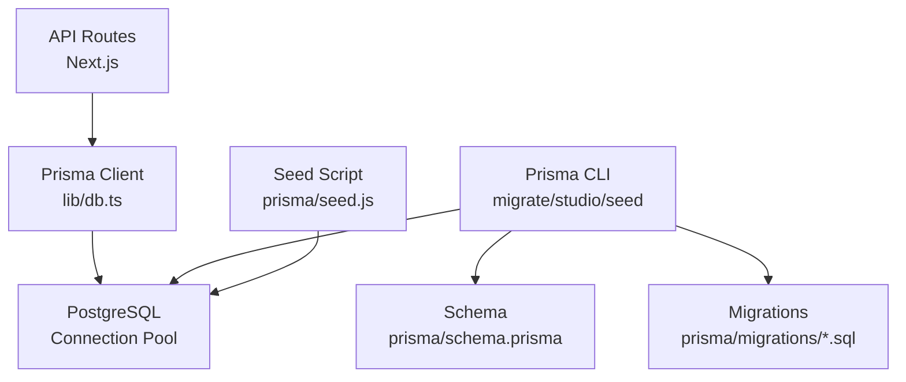
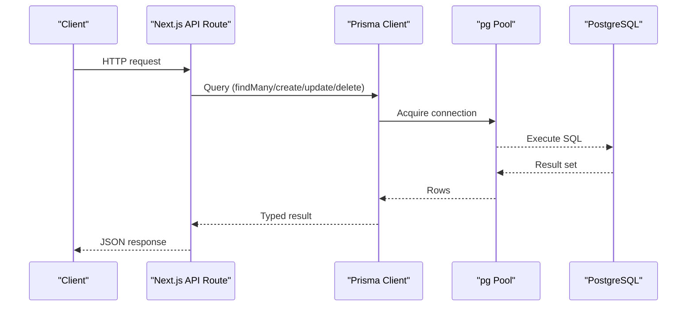
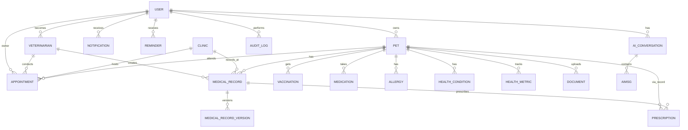
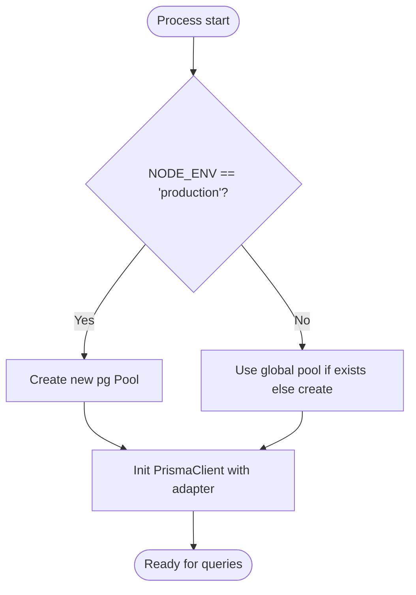
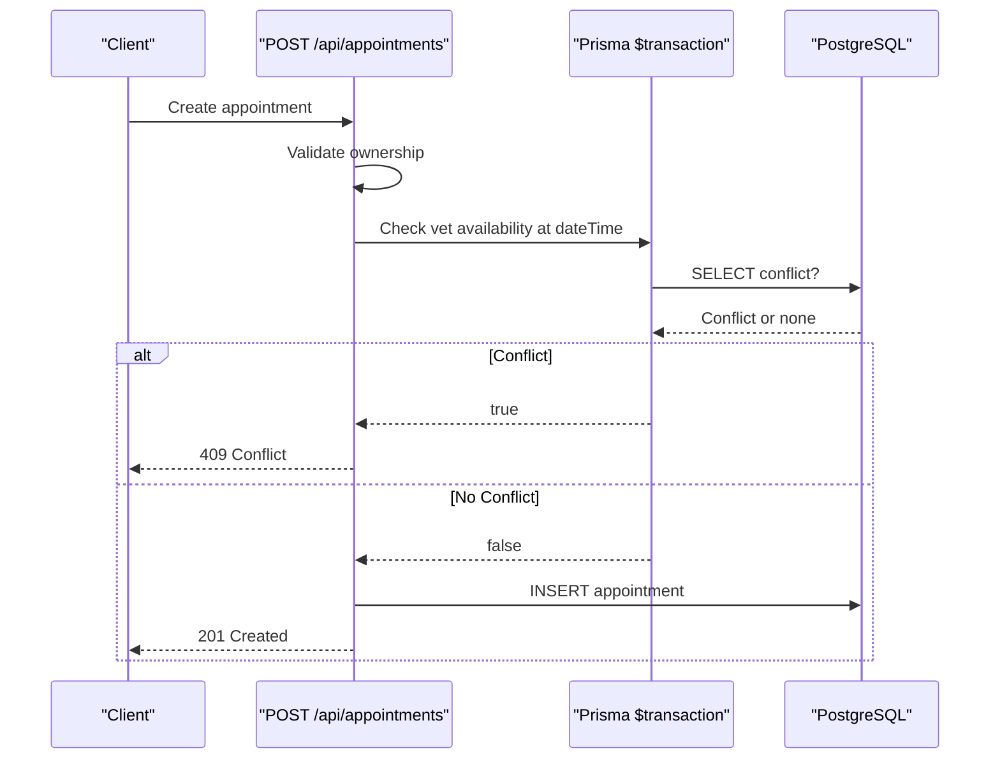
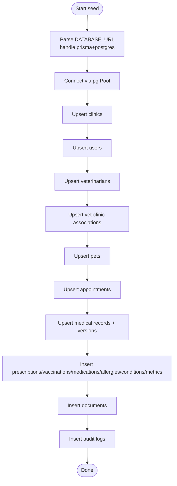
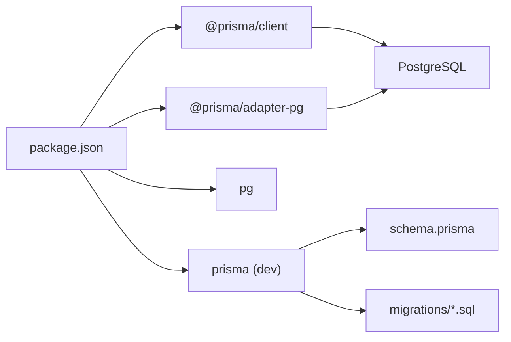

# Database Debugging & Prisma

<cite>
**Referenced Files in This Document**
- [schema.prisma](file://prisma/schema.prisma)
- [db.ts](file://lib/db.ts)
- [seed.js](file://prisma/seed.js)
- [package.json](file://package.json)
- [prisma.config.ts](file://prisma.config.ts)
- [20260825091722_init/migration.sql](file://prisma/migrations/20260825091722_init/migration.sql)
- [20260827095530_make_password_hash_optional/migration.sql](file://prisma/migrations/20260827095530_make_password_hash_optional/migration.sql)
- [20260827123510_add_clinic_admin_relation/migration.sql](file://prisma/migrations/20260827123510_add_clinic_admin_relation/migration.sql)
- [appointments/route.ts](file://app/api/appointments/route.ts)
- [pets/[petId]/route.ts](file://app/api/pets/[petId]/route.ts)
</cite>

## Table of Contents
1. Introduction
2. Project Structure
3. Core Components
4. Architecture Overview
5. Detailed Component Analysis
6. Dependency Analysis
7. Performance Considerations
8. Troubleshooting Guide
9. Conclusion
10. Appendices

## Introduction
This document provides a comprehensive guide to debugging the database layer of the PETIVA Pet Healthcare Ecosystem built with Prisma ORM and PostgreSQL. It covers:
- Visual database exploration using Prisma Studio
- Query testing and validation techniques
- Query logging, execution plan analysis, and performance optimization
- Migration troubleshooting (rollbacks, schema conflicts, data integrity)
- Database connection debugging for PostgreSQL connectivity, connection pooling, and environment configuration
- Data seeding and test data management via seed.js
- Step-by-step guides for common issues (relationship constraints, foreign key violations, query performance)
- Best practices for backup, recovery, and maintenance

## Project Structure
The database layer is centered around Prisma with a PostgreSQL backend. Key files include:
- Schema definition and relationships in prisma/schema.prisma
- Connection pooling and client initialization in lib/db.ts
- Seed script for test data in prisma/seed.js
- Migration SQL files under prisma/migrations
- API routes that exercise the database through Prisma queries

**Diagram sources**
- [db.ts:1-33](file://lib/db.ts#L1-L33)
- [schema.prisma:1-312](file://prisma/schema.prisma#L1-L312)
- [seed.js:1-430](file://prisma/seed.js#L1-L430)
- [20260825091722_init/migration.sql:1-409](file://prisma/migrations/20260825091722_init/migration.sql#L1-L409)

**Section sources**
- [schema.prisma:1-312](file://prisma/schema.prisma#L1-L312)
- [db.ts:1-33](file://lib/db.ts#L1-L33)
- [seed.js:1-430](file://prisma/seed.js#L1-L430)
- [prisma.config.ts:1-16](file://prisma.config.ts#L1-L16)

## Core Components
- Prisma schema defines models, enums, relations, and indexes for users, pets, appointments, medical records, clinics, and related entities.
- The application uses a custom Prisma client initialized with a pg pool for efficient connection reuse across requests.
- Seed script populates realistic test data including users, clinics, vets, pets, appointments, medical records, and audit logs.
- Migrations evolve the schema over time while preserving data integrity.

Key responsibilities:
- Schema as source of truth for types and relations
- Centralized DB client with environment-aware pooling
- Deterministic seeding for consistent development/test environments
- Versioned migrations for safe schema evolution

**Section sources**
- [schema.prisma:30-312](file://prisma/schema.prisma#L30-L312)
- [db.ts:8-29](file://lib/db.ts#L8-L29)
- [seed.js:30-419](file://prisma/seed.js#L30-L419)
- [20260825091722_init/migration.sql:278-409](file://prisma/migrations/20260825091722_init/migration.sql#L278-L409)

## Architecture Overview
The runtime architecture connects Next.js API routes to Prisma, which communicates with PostgreSQL via a pooled connection. Prisma CLI tools (Studio, migrate, seed) operate against the same schema and datasource.

**Diagram sources**
- [appointments/route.ts:7-67](file://app/api/appointments/route.ts#L7-L67)
- [db.ts:10-29](file://lib/db.ts#L10-L29)

## Detailed Component Analysis

### Prisma Schema and Relationships
The schema defines core entities and their relationships:
- User, Veterinarian, Clinic, VetClinicAssociation form the organizational backbone
- Pet owns MedicalRecord, Vaccination, Medication, Allergy, HealthCondition, HealthMetric, Document
- Appointment links Pet, Owner (User), Veterinarian, and Clinic
- MedicalRecordVersion tracks revisions per record
- AuditLog captures actions for compliance

Indexes are defined on frequently queried columns to optimize lookups.

**Diagram sources**
- [schema.prisma:30-312](file://prisma/schema.prisma#L30-L312)

**Section sources**
- [schema.prisma:30-312](file://prisma/schema.prisma#L30-L312)

### Database Client and Connection Pooling
The application initializes a single pg pool and reuses it across the process lifecycle. In production, a fresh pool is created; in development, global caching prevents multiple pools during hot reloads.

**Diagram sources**
- [db.ts:10-29](file://lib/db.ts#L10-L29)

**Section sources**
- [db.ts:1-33](file://lib/db.ts#L1-L33)

### API Usage Patterns and Transactional Safety
Appointment creation demonstrates authorization checks and transactional conflict detection to prevent double bookings.

**Diagram sources**
- [appointments/route.ts:69-129](file://app/api/appointments/route.ts#L69-L129)

**Section sources**
- [appointments/route.ts:69-129](file://app/api/appointments/route.ts#L69-L129)

### Data Seeding and Test Data Management
The seed script creates deterministic test data:
- Users with hashed passwords
- Clinics and vet-clinic associations
- Pets and associated health data
- Appointments and medical records with versioning
- Audit logs for traceability

It also handles special connection strings used by Prisma dev mode to extract the underlying database URL.

**Diagram sources**
- [seed.js:7-28](file://prisma/seed.js#L7-L28)
- [seed.js:30-419](file://prisma/seed.js#L30-L419)

**Section sources**
- [seed.js:1-430](file://prisma/seed.js#L1-L430)

## Dependency Analysis
Prisma and PostgreSQL integration relies on these dependencies:
- @prisma/client and @prisma/adapter-pg for type-safe queries and pg pooling
- pg for low-level connection pooling
- prisma CLI for migrations, studio, and seeding

**Diagram sources**
- [package.json:11-32](file://package.json#L11-L32)

**Section sources**
- [package.json:11-32](file://package.json#L11-L32)

## Performance Considerations
- Use indexes already defined on frequently filtered columns (e.g., Appointment.vetId + dateTime, MedicalRecord.petId).
- Prefer selective includes to reduce payload size and N+1 queries.
- Leverage transactions for multi-step operations to ensure consistency and avoid race conditions.
- Monitor query execution plans in PostgreSQL to identify slow scans or missing indexes.
- Tune pg pool settings (min/max connections) based on workload and database capacity.

[No sources needed since this section provides general guidance]

## Troubleshooting Guide

### Prisma Studio: Visual Exploration and Query Testing
- Launch Prisma Studio to browse tables, edit rows, and run queries visually.
- Use the query editor to validate filters, joins, and aggregations before embedding them in code.
- Verify relationships and referential integrity visually.

Commands typically used:
- npx prisma studio
- npx prisma db execute --stdin (to run ad-hoc SQL)

[No sources needed since this section provides general guidance]

### Query Logging and Execution Plan Analysis
- Enable query logging to inspect generated SQL and timings:
  - Configure Prisma log level to debug or info to capture queries.
- For complex queries, use PostgreSQL EXPLAIN/EXPLAIN ANALYZE to analyze execution plans and identify bottlenecks.
- Correlate slow queries with missing indexes or inefficient joins.

[No sources needed since this section provides general guidance]

### Migration Troubleshooting
Common issues and resolutions:
- Rollback procedures:
  - Use Prisma migration rollback commands to revert to a previous state when necessary.
  - Ensure backups exist before rolling back in shared environments.
- Schema conflicts:
  - Resolve naming collisions or incompatible changes by adjusting migrations and schema carefully.
  - Use non-destructive migrations where possible (add columns before removing defaults).
- Data integrity issues:
  - Validate foreign keys and unique constraints after applying migrations.
  - Re-run seed script to restore known-good test data after destructive changes.

Relevant migration history:
- Initial schema creation with full model set and constraints
- Making passwordHash optional to support OAuth flows
- Adding clinic admin relation to User

**Section sources**
- [20260825091722_init/migration.sql:1-409](file://prisma/migrations/20260825091722_init/migration.sql#L1-L409)
- [20260827095530_make_password_hash_optional/migration.sql:1-3](file://prisma/migrations/20260827095530_make_password_hash_optional/migration.sql#L1-L3)
- [20260827123510_add_clinic_admin_relation/migration.sql:1-6](file://prisma/migrations/20260827123510_add_clinic_admin_relation/migration.sql#L1-L6)

### Database Connection Debugging
Symptoms and fixes:
- Connection refused or invalid credentials:
  - Verify DATABASE_URL environment variable format and permissions.
  - Confirm PostgreSQL server is reachable and accepting connections.
- Connection pooling issues:
  - Ensure NODE_ENV is set correctly so the appropriate pool strategy is used.
  - Check for duplicate pools in development due to hot reloads; the current implementation caches globally to avoid this.
- Environment configuration problems:
  - Ensure dotenv is loaded in seed and config files.
  - Validate prisma.config.ts datasource.url reads DATABASE_URL.

**Section sources**
- [db.ts:8-29](file://lib/db.ts#L8-L29)
- [prisma.config.ts:6-15](file://prisma.config.ts#L6-L15)
- [seed.js:1-28](file://prisma/seed.js#L1-L28)

### Data Seeding and Testing Data Management
- Run seed to populate test data for development and CI:
  - npx prisma db seed
- If using Prisma dev mode with prisma+postgres URLs, the seed script extracts the underlying database URL automatically.
- After schema changes, re-seed to refresh test datasets.

**Section sources**
- [seed.js:7-28](file://prisma/seed.js#L7-L28)
- [seed.js:30-419](file://prisma/seed.js#L30-L419)
- [prisma.config.ts:8-11](file://prisma.config.ts#L8-L11)

### Step-by-Step Guides for Common Issues

#### Relationship Constraints and Foreign Key Violations
- Symptoms: Errors when creating/updating/deleting records referencing non-existent parents.
- Steps:
  - Identify violating foreign keys from error messages.
  - Ensure referenced entities exist before dependent inserts.
  - Use upsert patterns in seed to avoid duplicates.
  - Validate cascade behaviors (e.g., deleting a pet cascades to related records).

**Section sources**
- [schema.prisma:68-312](file://prisma/schema.prisma#L68-L312)
- [20260825091722_init/migration.sql:326-409](file://prisma/migrations/20260825091722_init/migration.sql#L326-L409)

#### Query Performance Problems
- Symptoms: Slow API responses, timeouts.
- Steps:
  - Enable query logging to capture slow queries.
  - Use EXPLAIN ANALYZE on problematic queries.
  - Add or refine indexes on high-cardinality filter fields.
  - Reduce included relations to only what is needed.
  - Batch updates and use transactions for multi-step writes.

**Section sources**
- [appointments/route.ts:13-52](file://app/api/appointments/route.ts#L13-L52)
- [schema.prisma:145-182](file://prisma/schema.prisma#L145-L182)

#### Authentication and Authorization Related DB Checks
- Symptoms: Unauthorized access errors or unexpected data visibility.
- Steps:
  - Verify user roles and clinic associations.
  - Ensure queries filter by ownerId, vetId, clinicId as required.
  - Use transactions to enforce atomicity for sensitive operations.

**Section sources**
- [appointments/route.ts:7-67](file://app/api/appointments/route.ts#L7-L67)
- [pets/[petId]/route.ts:5-52](file://app/api/pets/[petId]/route.ts#L5-L52)

## Conclusion
This guide outlined how to effectively debug and maintain the database layer of the PETIVA Pet Healthcare Ecosystem using Prisma and PostgreSQL. By leveraging Prisma Studio, structured query logging, careful migration practices, robust seeding, and performance tuning, teams can quickly diagnose and resolve issues while maintaining data integrity and system reliability.

[No sources needed since this section summarizes without analyzing specific files]

## Appendices

### Backup, Recovery, and Maintenance Best Practices
- Regularly back up the PostgreSQL database using native tools or managed service snapshots.
- Before major migrations, take a snapshot or export a logical backup.
- Test restoration procedures periodically to ensure recoverability.
- Monitor disk usage, connection counts, and slow query logs.
- Schedule routine vacuum and analyze tasks to keep statistics current.

[No sources needed since this section provides general guidance]