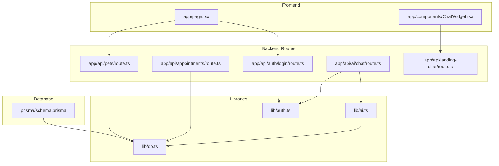
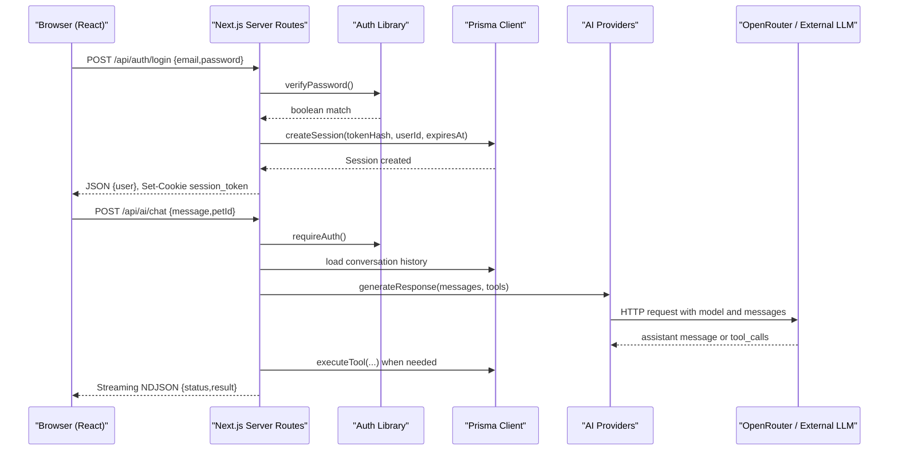
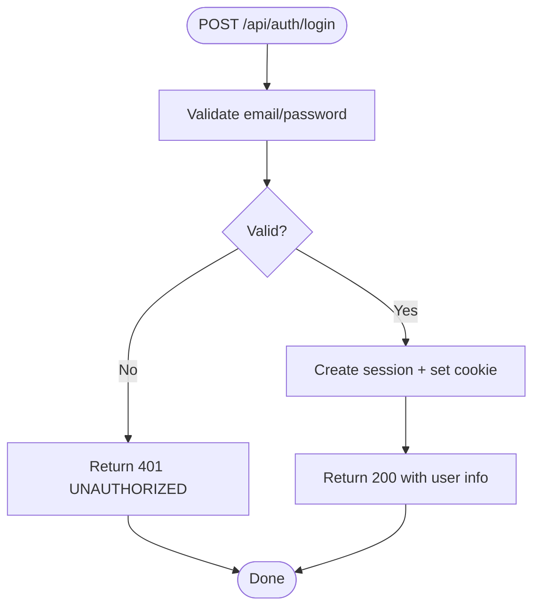
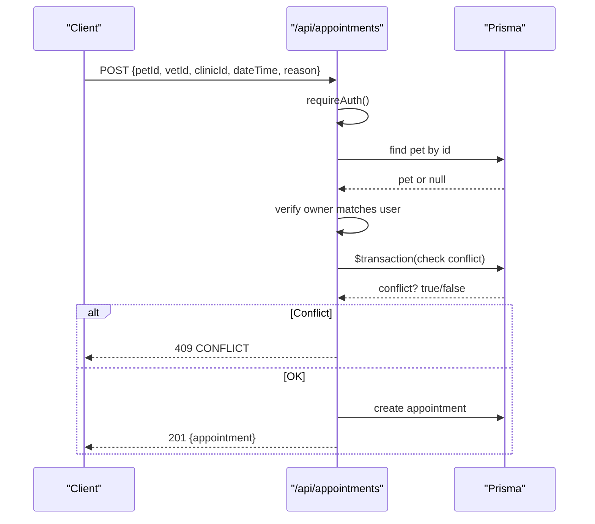
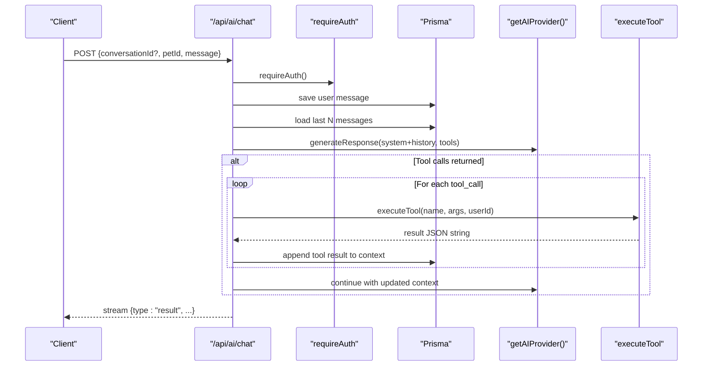
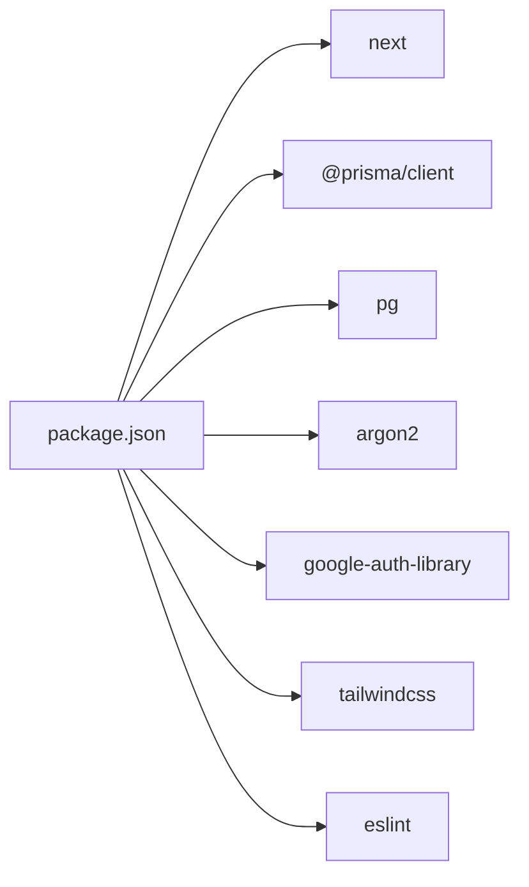
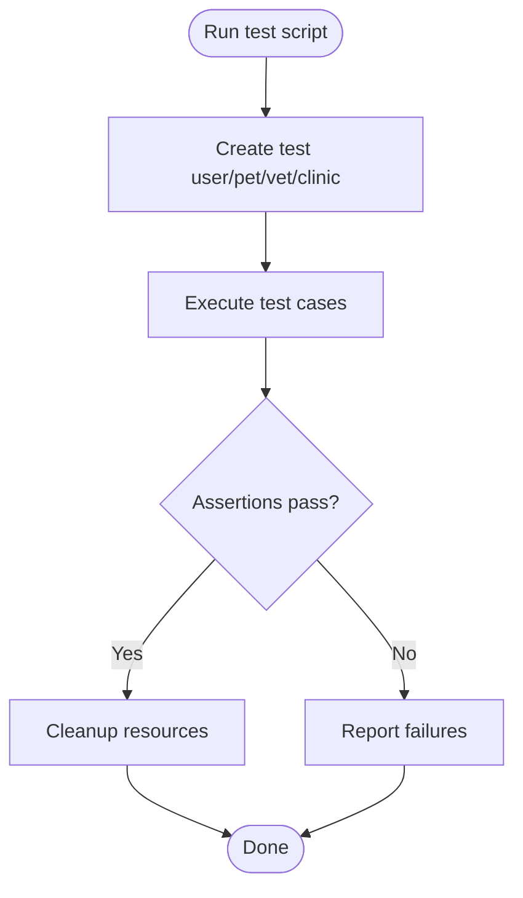

# Debugging & Development Tools

<cite>
**Referenced Files in This Document**
- [package.json](file://package.json)
- [README.md](file://README.md)
- [next.config.ts](file://next.config.ts)
- [lib/db.ts](file://lib/db.ts)
- [prisma/schema.prisma](file://prisma/schema.prisma)
- [lib/auth.ts](file://lib/auth.ts)
- [app/api/auth/login/route.ts](file://app/api/auth/login/route.ts)
- [app/api/appointments/route.ts](file://app/api/appointments/route.ts)
- [app/api/pets/route.ts](file://app/api/pets/route.ts)
- [app/api/ai/chat/route.ts](file://app/api/ai/chat/route.ts)
- [lib/ai.ts](file://lib/ai.ts)
- [app/api/landing-chat/route.ts](file://app/api/landing-chat/route.ts)
- [test_booking.ts](file://test_booking.ts)
- [test_deepseek_openrouter.js](file://test_deepseek_openrouter.js)
- [app/components/ChatWidget.tsx](file://app/components/ChatWidget.tsx)
- [app/page.tsx](file://app/page.tsx)
</cite>

## Table of Contents
1. Introduction
2. Project Structure
3. Core Components
4. Architecture Overview
5. Detailed Component Analysis
6. Dependency Analysis
7. Performance Considerations
8. Troubleshooting Guide
9. Conclusion
10. Appendices

## Introduction
This document provides a comprehensive guide to debugging and development for the PETIVA Pet Healthcare Ecosystem. It covers:
- Browser developer tools usage for React components, state management, and API calls
- Backend debugging with Node.js, logging strategies, and error tracking
- API testing using Postman, curl, and built-in test scripts
- Database debugging with Prisma Studio, query optimization, and migration troubleshooting
- AI service debugging including OpenRouter integration, provider fallbacks, and response validation
- Step-by-step guides for common scenarios (authentication issues, appointment booking problems, pet health record errors)
- Performance profiling and monitoring techniques for frontend and backend

## Project Structure
The project is a Next.js application with server routes under app/api, shared libraries under lib, database schema under prisma, and UI components under app/components. Key runtime configuration lives in package.json and next.config.ts. The README documents running the dev server.

**Diagram sources**
- [app/page.tsx:1-223](file://app/page.tsx#L1-L223)
- [app/components/ChatWidget.tsx:1-149](file://app/components/ChatWidget.tsx#L1-L149)
- [app/api/auth/login/route.ts:1-58](file://app/api/auth/login/route.ts#L1-L58)
- [app/api/appointments/route.ts:1-143](file://app/api/appointments/route.ts#L1-L143)
- [app/api/pets/route.ts:1-69](file://app/api/pets/route.ts#L1-L69)
- [app/api/ai/chat/route.ts:1-347](file://app/api/ai/chat/route.ts#L1-L347)
- [app/api/landing-chat/route.ts:1-76](file://app/api/landing-chat/route.ts#L1-L76)
- [lib/auth.ts:1-125](file://lib/auth.ts#L1-L125)
- [lib/ai.ts:1-423](file://lib/ai.ts#L1-L423)
- [lib/db.ts:1-33](file://lib/db.ts#L1-L33)
- [prisma/schema.prisma:1-312](file://prisma/schema.prisma#L1-L312)

**Section sources**
- [package.json:1-35](file://package.json#L1-L35)
- [README.md:1-37](file://README.md#L1-L37)
- [next.config.ts:1-8](file://next.config.ts#L1-L8)

## Core Components
- Authentication and sessions: secure cookie-based sessions with token hashing and expiration handling.
- Data access: Prisma client configured with PostgreSQL adapter and connection pooling; safe singleton pattern in development.
- AI orchestration: Provider abstraction with fallback strategy, tool execution, and streaming chat responses.
- API endpoints: Auth, pets, appointments, AI chat, and public landing chat with consistent error handling.

**Section sources**
- [lib/auth.ts:1-125](file://lib/auth.ts#L1-L125)
- [lib/db.ts:1-33](file://lib/db.ts#L1-L33)
- [lib/ai.ts:1-423](file://lib/ai.ts#L1-L423)
- [app/api/auth/login/route.ts:1-58](file://app/api/auth/login/route.ts#L1-L58)
- [app/api/appointments/route.ts:1-143](file://app/api/appointments/route.ts#L1-L143)
- [app/api/pets/route.ts:1-69](file://app/api/pets/route.ts#L1-L69)
- [app/api/ai/chat/route.ts:1-347](file://app/api/ai/chat/route.ts#L1-L347)
- [app/api/landing-chat/route.ts:1-76](file://app/api/landing-chat/route.ts#L1-L76)

## Architecture Overview
The system uses Next.js App Router server routes as the API layer. Frontend pages and widgets call these routes. Authentication middleware enforces session validity. AI features use a provider abstraction with fallbacks and tool execution against the database via Prisma.

**Diagram sources**
- [app/api/auth/login/route.ts:1-58](file://app/api/auth/login/route.ts#L1-L58)
- [lib/auth.ts:1-125](file://lib/auth.ts#L1-L125)
- [app/api/ai/chat/route.ts:1-347](file://app/api/ai/chat/route.ts#L1-L347)
- [lib/ai.ts:1-423](file://lib/ai.ts#L1-L423)
- [lib/db.ts:1-33](file://lib/db.ts#L1-L33)

## Detailed Component Analysis

### Authentication Flow and Debugging
- Login endpoint validates credentials, creates a session, and sets an httpOnly cookie. Errors are standardized with codes and messages.
- Session validation supports sliding expiration and cleanup of expired sessions.
- Common issues: missing cookies, expired sessions, incorrect password hash, environment misconfiguration.

**Diagram sources**
- [app/api/auth/login/route.ts:1-58](file://app/api/auth/login/route.ts#L1-L58)
- [lib/auth.ts:1-125](file://lib/auth.ts#L1-L125)

**Section sources**
- [app/api/auth/login/route.ts:1-58](file://app/api/auth/login/route.ts#L1-L58)
- [lib/auth.ts:1-125](file://lib/auth.ts#L1-L125)

### Appointment Booking Flow and Validation
- GET lists appointments filtered by role (owner, vet, clinic admin).
- POST enforces ownership, prevents double bookings within a transaction, and returns structured errors.
- Debugging tips: check authorization, validate date/time formats, inspect conflict detection logic.

**Diagram sources**
- [app/api/appointments/route.ts:1-143](file://app/api/appointments/route.ts#L1-L143)

**Section sources**
- [app/api/appointments/route.ts:1-143](file://app/api/appointments/route.ts#L1-L143)

### AI Chat Orchestration and Tool Execution
- GET retrieves conversation metadata and messages for a given pet.
- POST persists user messages, loads recent history, builds system prompt, streams results, and executes tools when requested by the AI.
- Provider selection and fallbacks are handled centrally; tool execution includes ownership checks and business validations.

**Diagram sources**
- [app/api/ai/chat/route.ts:1-347](file://app/api/ai/chat/route.ts#L1-L347)
- [lib/ai.ts:1-423](file://lib/ai.ts#L1-L423)

**Section sources**
- [app/api/ai/chat/route.ts:1-347](file://app/api/ai/chat/route.ts#L1-L347)
- [lib/ai.ts:1-423](file://lib/ai.ts#L1-L423)

### Public Landing Chat and Provider Fallbacks
- Public endpoint calls OpenRouter with a list of free models and falls back across models on failure.
- Useful for quick smoke tests without authentication.

**Section sources**
- [app/api/landing-chat/route.ts:1-76](file://app/api/landing-chat/route.ts#L1-L76)

### Database Layer and Schema
- Prisma client is initialized with a PostgreSQL adapter and connection pool; development avoids multiple pools via global caching.
- Schema defines users, pets, vets, clinics, appointments, medical records, and related entities with indexes for performance.

**Section sources**
- [lib/db.ts:1-33](file://lib/db.ts#L1-L33)
- [prisma/schema.prisma:1-312](file://prisma/schema.prisma#L1-L312)

### Frontend Chat Widget and State Management
- The widget manages local state for messages, loading, and input, and posts to the public chat endpoint.
- Use browser DevTools to inspect network requests, component state, and rendered output.

**Section sources**
- [app/components/ChatWidget.tsx:1-149](file://app/components/ChatWidget.tsx#L1-L149)
- [app/page.tsx:1-223](file://app/page.tsx#L1-L223)

## Dependency Analysis
Key runtime dependencies include Next.js, Prisma client, PostgreSQL driver, and authentication utilities. Dev dependencies support linting and type checking.

**Diagram sources**
- [package.json:1-35](file://package.json#L1-L35)

**Section sources**
- [package.json:1-35](file://package.json#L1-L35)

## Performance Considerations
- Database queries:
  - Use selective fields in Prisma queries to reduce payload size.
  - Leverage existing indexes (e.g., vetId+dateTime on appointments) for efficient lookups.
  - Batch related reads where possible (as seen in timeline aggregation).
- Connection pooling:
  - Production uses a dedicated pool; development reuses a global pool to avoid leaks during hot reloads.
- AI streaming:
  - Stream NDJSON responses to improve perceived latency and allow incremental UI updates.
- Network:
  - Minimize round trips by consolidating data fetches and using appropriate includes.

[No sources needed since this section provides general guidance]

## Troubleshooting Guide

### Browser Developer Tools (Frontend)
- Network tab: Inspect requests/responses for auth, pets, appointments, and AI chat endpoints. Check headers, status codes, and payloads.
- Application tab: Verify cookies (session_token), storage, and service workers if used.
- Sources panel: Add breakpoints in React components and event handlers to trace state changes.
- Console: Watch for errors from fetch calls and component rendering.

**Section sources**
- [app/components/ChatWidget.tsx:1-149](file://app/components/ChatWidget.tsx#L1-L149)
- [app/page.tsx:1-223](file://app/page.tsx#L1-L223)

### Backend Debugging (Node.js/Next.js)
- Run the dev server and observe server logs for route handlers and library functions.
- Add console logs around critical paths (auth verification, Prisma transactions, AI provider calls).
- Use structured error responses with codes to simplify client-side diagnostics.

**Section sources**
- [app/api/auth/login/route.ts:1-58](file://app/api/auth/login/route.ts#L1-L58)
- [app/api/appointments/route.ts:1-143](file://app/api/appointments/route.ts#L1-L143)
- [lib/auth.ts:1-125](file://lib/auth.ts#L1-L125)

### API Testing with Built-in Scripts
- Appointment booking tests:
  - Execute the script to set up test data and validate past dates, double bookings, working hours, and slot checks.
- AI integration tests:
  - Exercise public landing chat and authenticated dashboard chat flows; capture cookies for authenticated requests.

**Diagram sources**
- [test_booking.ts:1-149](file://test_booking.ts#L1-L149)
- [test_deepseek_openrouter.js:1-132](file://test_deepseek_openrouter.js#L1-L132)

**Section sources**
- [test_booking.ts:1-149](file://test_booking.ts#L1-L149)
- [test_deepseek_openrouter.js:1-132](file://test_deepseek_openrouter.js#L1-L132)

### Database Debugging with Prisma Studio
- Launch Prisma Studio to browse tables, relationships, and indexes defined in the schema.
- Validate data integrity for users, pets, appointments, and medical records.
- Use the schema to understand constraints and indices that affect query performance.

**Section sources**
- [prisma/schema.prisma:1-312](file://prisma/schema.prisma#L1-L312)

### Query Optimization Tips
- Prefer specific selects over full includes to reduce memory and network overhead.
- Ensure filters align with indexed columns (e.g., vetId, dateTime).
- Use transactions for multi-step operations like double-booking checks and creation.

**Section sources**
- [app/api/appointments/route.ts:1-143](file://app/api/appointments/route.ts#L1-L143)
- [lib/db.ts:1-33](file://lib/db.ts#L1-L33)

### Migration Troubleshooting
- If migrations fail, review SQL files under migrations and ensure the database state matches expected schema.
- Re-run migrations after resetting or seeding the database in development.

[No sources needed since this section provides general guidance]

### AI Service Debugging (OpenRouter and Providers)
- Verify environment variables for API keys and model names.
- Use the public landing chat endpoint to quickly validate connectivity and model fallback behavior.
- For authenticated flows, inspect streamed NDJSON messages and tool execution logs.

**Section sources**
- [app/api/landing-chat/route.ts:1-76](file://app/api/landing-chat/route.ts#L1-L76)
- [lib/ai.ts:1-423](file://lib/ai.ts#L1-L423)
- [app/api/ai/chat/route.ts:1-347](file://app/api/ai/chat/route.ts#L1-L347)

### Common Scenarios

#### Authentication Issues
- Symptoms: 401 Unauthorized, missing session cookie, redirect loops.
- Steps:
  - Confirm login endpoint returns success and sets session_token.
  - Check subsequent requests include the cookie.
  - Validate session expiration and cleanup logic.

**Section sources**
- [app/api/auth/login/route.ts:1-58](file://app/api/auth/login/route.ts#L1-L58)
- [lib/auth.ts:1-125](file://lib/auth.ts#L1-L125)

#### Appointment Booking Problems
- Symptoms: 409 Conflict, invalid dates, wrong owner.
- Steps:
  - Verify pet ownership and user role.
  - Check double-booking logic and time zone handling.
  - Inspect transactional conflict detection.

**Section sources**
- [app/api/appointments/route.ts:1-143](file://app/api/appointments/route.ts#L1-L143)

#### Pet Health Record Errors
- Symptoms: Missing records, permission denied, malformed inputs.
- Steps:
  - Ensure correct petId and ownership checks.
  - Validate required fields and types before writes.
  - Use Prisma Studio to confirm data consistency.

**Section sources**
- [lib/ai.ts:1-423](file://lib/ai.ts#L1-L423)
- [prisma/schema.prisma:1-312](file://prisma/schema.prisma#L1-L312)

### Performance Profiling and Monitoring
- Frontend:
  - Use React DevTools to profile component renders and identify bottlenecks.
  - Monitor network waterfall for slow endpoints and large payloads.
- Backend:
  - Log key timings around database queries and external API calls.
  - Track error rates and response times per route.
- Database:
  - Analyze slow queries via database tools and adjust indexing or query shapes.

[No sources needed since this section provides general guidance]

## Conclusion
This guide outlined practical debugging workflows across the frontend, backend, database, and AI services. By leveraging browser tools, server logs, built-in test scripts, Prisma Studio, and structured error handling, you can efficiently diagnose and resolve issues in authentication, appointments, health records, and AI interactions. Adopting the recommended profiling and monitoring practices will help maintain performance and reliability as the ecosystem evolves.

## Appendices

### Quick Start Commands
- Start development server: see README instructions.
- Run tests:
  - Appointment booking tests: run the provided script.
  - AI integration tests: run the provided script.

**Section sources**
- [README.md:1-37](file://README.md#L1-L37)
- [test_booking.ts:1-149](file://test_booking.ts#L1-L149)
- [test_deepseek_openrouter.js:1-132](file://test_deepseek_openrouter.js#L1-L132)