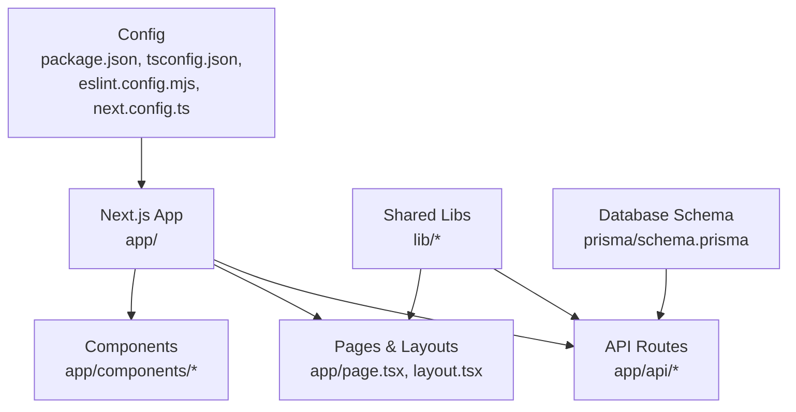
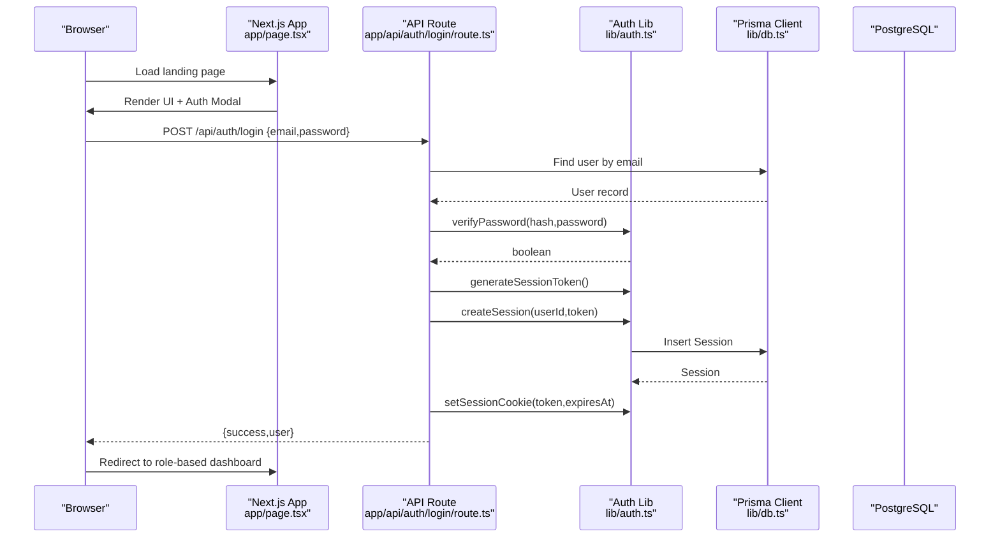
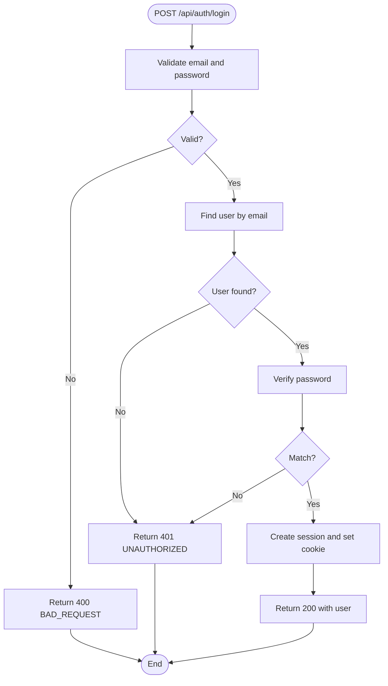
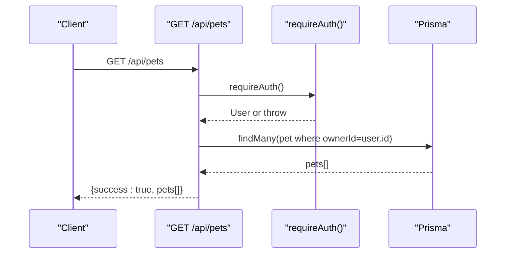
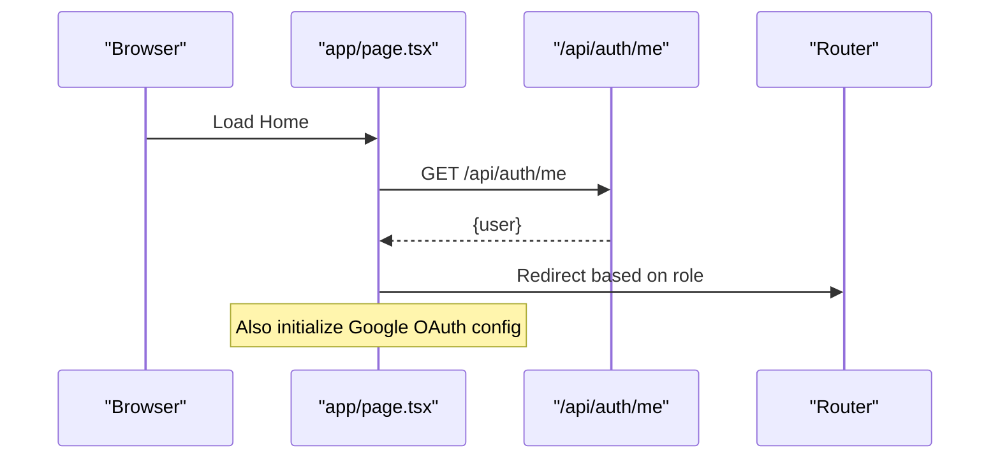
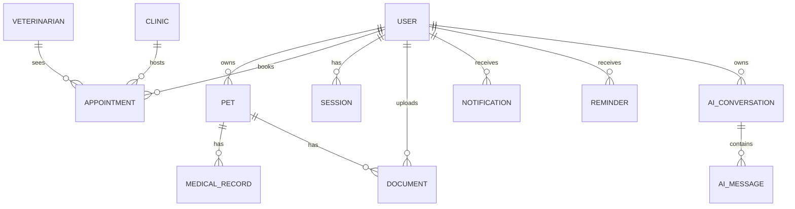
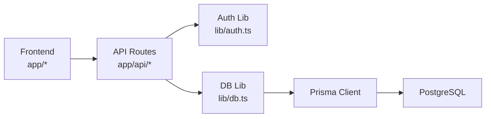

# Development Guidelines

<cite>
**Referenced Files in This Document**
- [README.md](file://README.md)
- [package.json](file://package.json)
- [tsconfig.json](file://tsconfig.json)
- [eslint.config.mjs](file://eslint.config.mjs)
- [next.config.ts](file://next.config.ts)
- [app/layout.tsx](file://app/layout.tsx)
- [app/page.tsx](file://app/page.tsx)
- [app/components/Navbar.tsx](file://app/components/Navbar.tsx)
- [app/components/Hero.tsx](file://app/components/Hero.tsx)
- [lib/db.ts](file://lib/db.ts)
- [lib/auth.ts](file://lib/auth.ts)
- [prisma/schema.prisma](file://prisma/schema.prisma)
- [app/api/auth/login/route.ts](file://app/api/auth/login/route.ts)
- [app/api/pets/route.ts](file://app/api/pets/route.ts)
- [docs/README.md](file://docs/README.md)
</cite>

## Table of Contents
1. Introduction
2. Project Structure
3. Core Components
4. Architecture Overview
5. Detailed Component Analysis
6. Dependency Analysis
7. Performance Considerations
8. Troubleshooting Guide
9. Conclusion
10. Appendices

## Introduction
This document provides comprehensive development guidelines for contributing to the PETIVA Pet Healthcare Ecosystem. It covers coding standards, TypeScript and React conventions, API design principles, project structure and naming, Git workflow, code quality tooling (ESLint), debugging techniques, maintainability practices, performance optimization, security considerations, and contribution workflows for features, bug fixes, and documentation updates.

The project is a Next.js application using App Router, Prisma with PostgreSQL, and Tailwind CSS. Authentication uses server-side sessions with secure cookies and password hashing. The frontend is composed of client components under app/components and pages under app.

**Section sources**
- [README.md:1-37](file://README.md#L1-L37)
- [docs/README.md:1-66](file://docs/README.md#L1-L66)

## Project Structure
The repository follows Next.js App Router conventions:
- app/: Routes and page-level components
  - api/: Serverless API routes grouped by domain (auth, pets, clinics, vet, ai)
  - components/: Reusable UI components
  - dashboard/, clinic/dashboard/, vet/dashboard/: Role-based dashboards
- lib/: Shared server utilities (database connection, authentication helpers)
- prisma/: Database schema and migrations
- docs/: Product, requirements, and architecture documentation
- Configuration files at root: package.json, tsconfig.json, eslint.config.mjs, next.config.ts

**Diagram sources**
- [app/page.tsx:1-223](file://app/page.tsx#L1-L223)
- [app/layout.tsx:1-16](file://app/layout.tsx#L1-L16)
- [app/api/pets/route.ts:1-69](file://app/api/pets/route.ts#L1-L69)
- [lib/db.ts:1-33](file://lib/db.ts#L1-L33)
- [prisma/schema.prisma:1-312](file://prisma/schema.prisma#L1-L312)
- [package.json:1-35](file://package.json#L1-L35)
- [tsconfig.json:1-35](file://tsconfig.json#L1-L35)
- [eslint.config.mjs:1-19](file://eslint.config.mjs#L1-L19)
- [next.config.ts:1-8](file://next.config.ts#L1-L8)

**Section sources**
- [package.json:1-35](file://package.json#L1-L35)
- [tsconfig.json:1-35](file://tsconfig.json#L1-L35)
- [eslint.config.mjs:1-19](file://eslint.config.mjs#L1-L19)
- [next.config.ts:1-8](file://next.config.ts#L1-L8)
- [app/layout.tsx:1-16](file://app/layout.tsx#L1-L16)
- [app/page.tsx:1-223](file://app/page.tsx#L1-L223)

## Core Components
- Authentication and Sessions
  - Password hashing and verification, session token generation/hashing, database-backed sessions, cookie management, and role-based access control helpers are centralized in the auth library.
  - Session cookies are httpOnly and secure in production; sliding expiration extends sessions near expiry.
- Database Access
  - Prisma client is configured with a pooled PostgreSQL adapter. In development, a global singleton prevents multiple pools across hot reloads.
- API Routes
  - Domain-scoped route handlers validate inputs, enforce authentication, and return consistent JSON responses with success/error envelopes.
- Frontend Pages and Components
  - Client components manage user interactions, form state, and navigation based on roles after successful authentication.

**Section sources**
- [lib/auth.ts:1-125](file://lib/auth.ts#L1-L125)
- [lib/db.ts:1-33](file://lib/db.ts#L1-L33)
- [app/api/auth/login/route.ts:1-58](file://app/api/auth/login/route.ts#L1-L58)
- [app/api/pets/route.ts:1-69](file://app/api/pets/route.ts#L1-L69)
- [app/page.tsx:1-223](file://app/page.tsx#L1-L223)

## Architecture Overview
The system uses Next.js App Router for both UI and API endpoints. Authentication flows through server-side session cookies validated per request. Data persistence is via Prisma and PostgreSQL.

**Diagram sources**
- [app/page.tsx:1-223](file://app/page.tsx#L1-L223)
- [app/api/auth/login/route.ts:1-58](file://app/api/auth/login/route.ts#L1-L58)
- [lib/auth.ts:1-125](file://lib/auth.ts#L1-L125)
- [lib/db.ts:1-33](file://lib/db.ts#L1-L33)
- [prisma/schema.prisma:1-312](file://prisma/schema.prisma#L1-L312)

## Detailed Component Analysis

### Authentication Flow (Login)
- Input validation ensures required fields are present.
- User lookup by email; password verification against stored hash.
- On success, a session token is generated, persisted, and set as a secure cookie.
- Response includes minimal user info; client redirects based on role.

**Diagram sources**
- [app/api/auth/login/route.ts:1-58](file://app/api/auth/login/route.ts#L1-L58)
- [lib/auth.ts:1-125](file://lib/auth.ts#L1-L125)

**Section sources**
- [app/api/auth/login/route.ts:1-58](file://app/api/auth/login/route.ts#L1-L58)
- [lib/auth.ts:1-125](file://lib/auth.ts#L1-L125)

### Pets API (CRUD patterns)
- GET /api/pets enforces authentication and returns only the authenticated owner’s pets.
- POST /api/pets validates required fields and creates a new pet linked to the owner.
- Consistent error handling maps authentication failures to 401 and unexpected errors to 500.

**Diagram sources**
- [app/api/pets/route.ts:1-69](file://app/api/pets/route.ts#L1-L69)
- [lib/auth.ts:1-125](file://lib/auth.ts#L1-L125)
- [lib/db.ts:1-33](file://lib/db.ts#L1-L33)

**Section sources**
- [app/api/pets/route.ts:1-69](file://app/api/pets/route.ts#L1-L69)

### Frontend Landing Page and Auth Modal
- The landing page loads Google Identity Services SDK dynamically and checks current session to redirect users to appropriate dashboards based on role.
- Auth modal handles login/register forms and integrates with Google OAuth callback endpoint.
- Navigation and UI are built from reusable client components.

**Diagram sources**
- [app/page.tsx:1-223](file://app/page.tsx#L1-L223)

**Section sources**
- [app/page.tsx:1-223](file://app/page.tsx#L1-L223)
- [app/components/Navbar.tsx:1-49](file://app/components/Navbar.tsx#L1-L49)
- [app/components/Hero.tsx:1-61](file://app/components/Hero.tsx#L1-L61)

### Database Schema Highlights
- Users, Pets, Veterinarians, Clinics, Appointments, Medical Records, Documents, Notifications, Reminders, AI Conversations/Messages, Audit Logs.
- Enums define roles, statuses, and association states.
- Relationships and indexes support efficient queries for appointments, medical records, and audit logs.

**Diagram sources**
- [prisma/schema.prisma:1-312](file://prisma/schema.prisma#L1-L312)

**Section sources**
- [prisma/schema.prisma:1-312](file://prisma/schema.prisma#L1-L312)

## Dependency Analysis
- Frontend depends on Next.js App Router and client components for UI.
- API routes depend on shared libraries for database access and authentication.
- Database layer depends on Prisma and PostgreSQL driver pool configuration.

**Diagram sources**
- [app/page.tsx:1-223](file://app/page.tsx#L1-L223)
- [app/api/pets/route.ts:1-69](file://app/api/pets/route.ts#L1-L69)
- [lib/auth.ts:1-125](file://lib/auth.ts#L1-L125)
- [lib/db.ts:1-33](file://lib/db.ts#L1-L33)

**Section sources**
- [package.json:1-35](file://package.json#L1-L35)
- [tsconfig.json:1-35](file://tsconfig.json#L1-L35)

## Performance Considerations
- Database
  - Use Prisma query select/include to fetch only needed fields.
  - Leverage existing indexes (e.g., appointment vetId/dateTime, medicalRecord petId).
  - Prefer batched operations and avoid N+1 queries by using relations efficiently.
- API
  - Return minimal payloads; paginate lists where applicable.
  - Cache frequently accessed data when suitable (e.g., clinic listings).
  - Validate early to fail fast and reduce unnecessary processing.
- Frontend
  - Keep client components focused; extract pure logic into hooks or utilities.
  - Avoid heavy computations in render; memoize expensive results.
  - Defer non-critical scripts (e.g., third-party SDKs) until necessary.
- Build and Dev
  - Use incremental compilation and strict TypeScript settings for faster feedback.
  - Run linting locally before committing to catch issues early.

[No sources needed since this section provides general guidance]

## Troubleshooting Guide
- Authentication Issues
  - Ensure session cookie is set and not blocked by browser policies.
  - Verify environment variables for database and secrets are correct.
  - Check that session expiration and sliding window logic behave as expected.
- API Errors
  - Inspect response envelope for success/error codes and messages.
  - Confirm input validation rules match client expectations.
  - Review server logs for stack traces and internal server errors.
- Database Connectivity
  - Validate DATABASE_URL and connection pooling behavior in dev vs prod.
  - Monitor Prisma client initialization to avoid duplicate pools in development.
- Frontend Debugging
  - Use browser developer tools to inspect network requests and cookies.
  - Log client-side errors and ensure proper error boundaries for critical flows.

**Section sources**
- [lib/auth.ts:1-125](file://lib/auth.ts#L1-L125)
- [lib/db.ts:1-33](file://lib/db.ts#L1-L33)
- [app/api/auth/login/route.ts:1-58](file://app/api/auth/login/route.ts#L1-L58)
- [app/api/pets/route.ts:1-69](file://app/api/pets/route.ts#L1-L69)

## Conclusion
This guide outlines the conventions, patterns, and best practices for developing within the PETIVA ecosystem. By following these guidelines—consistent API design, robust authentication, clear component organization, and disciplined code quality—you will contribute effectively and maintain a scalable, secure, and performant application.

[No sources needed since this section summarizes without analyzing specific files]

## Appendices

### Coding Standards and Conventions
- TypeScript
  - Enable strict mode and use explicit types for function parameters and return values.
  - Prefer interfaces/types for props and API payloads; avoid any unless necessary.
  - Use path aliases consistently (e.g., @/lib/*).
- React Components
  - Mark interactive components with 'use client' directive.
  - Define prop interfaces and keep components small and focused.
  - Extract reusable UI elements into dedicated component files.
- API Design
  - Use RESTful paths under app/api grouped by domain.
  - Enforce authentication and authorization in every protected route.
  - Return consistent JSON envelopes with success flag and structured error objects.

**Section sources**
- [tsconfig.json:1-35](file://tsconfig.json#L1-L35)
- [app/components/Navbar.tsx:1-49](file://app/components/Navbar.tsx#L1-L49)
- [app/components/Hero.tsx:1-61](file://app/components/Hero.tsx#L1-L61)
- [app/api/pets/route.ts:1-69](file://app/api/pets/route.ts#L1-L69)

### Project Structure Conventions
- Place feature-specific API routes under app/api/<domain>/route.ts.
- Group related UI components under app/components with descriptive names.
- Store shared server logic in lib/ (e.g., db.ts, auth.ts).
- Maintain database schema and migrations under prisma/.

**Section sources**
- [app/api/pets/route.ts:1-69](file://app/api/pets/route.ts#L1-L69)
- [lib/db.ts:1-33](file://lib/db.ts#L1-L33)
- [lib/auth.ts:1-125](file://lib/auth.ts#L1-L125)
- [prisma/schema.prisma:1-312](file://prisma/schema.prisma#L1-L312)

### Git Workflow
- Branching Strategy
  - Use feature branches named feature/<description>.
  - Use bugfix branches named bugfix/<issue-id>-<short-description>.
  - Protect main branch; merge via pull requests.
- Commit Messages
  - Follow conventional commits: type(scope): description (e.g., feat(api): add pets CRUD).
  - Reference issue numbers when applicable.
- Pull Requests
  - Include a clear description of changes, testing steps, and screenshots if UI changes.
  - Request reviews from relevant owners; address all comments before merging.
- Code Review Procedures
  - Verify adherence to coding standards and API contracts.
  - Ensure tests pass and no regressions introduced.
  - Confirm security considerations (input validation, auth checks) are addressed.

[No sources needed since this section provides general guidance]

### ESLint and Code Quality
- ESLint Configuration
  - Uses Next.js recommended configs for web vitals and TypeScript.
  - Overrides default ignores to include build artifacts appropriately.
- Pre-commit Hooks
  - Recommended: run linting and type checks before commit.
  - Example hook: npm run lint && npx tsc --noEmit.
- Automated Checks
  - CI should run lint, type check, build, and tests on each PR.

**Section sources**
- [eslint.config.mjs:1-19](file://eslint.config.mjs#L1-L19)
- [package.json:1-35](file://package.json#L1-L35)

### Debugging Techniques and Tools
- Frontend
  - Use browser DevTools Network tab to inspect API calls and responses.
  - Inspect cookies for session tokens and their attributes.
  - Add console logs sparingly; prefer structured logging in APIs.
- Backend
  - Log request IDs and key steps in API routes for traceability.
  - Validate environment variables and database connectivity.
- Database
  - Use Prisma Studio or SQL clients to inspect schema and data.
  - Analyze slow queries and consider adding indexes or optimizing joins.

**Section sources**
- [app/page.tsx:1-223](file://app/page.tsx#L1-L223)
- [app/api/auth/login/route.ts:1-58](file://app/api/auth/login/route.ts#L1-L58)
- [lib/db.ts:1-33](file://lib/db.ts#L1-L33)

### Security Considerations
- Input Validation
  - Validate all inputs in API routes; reject malformed data early.
- Authentication Patterns
  - Use server-side session cookies with httpOnly and secure flags in production.
  - Enforce role-based access control for protected resources.
- Data Protection
  - Hash passwords with strong algorithms; never store plaintext.
  - Minimize sensitive data in responses; sanitize logs.

**Section sources**
- [lib/auth.ts:1-125](file://lib/auth.ts#L1-L125)
- [app/api/auth/login/route.ts:1-58](file://app/api/auth/login/route.ts#L1-L58)

### Contribution Workflows
- Bug Fixes
  - Create a bugfix branch; reproduce the issue; implement fix with tests; open PR referencing the issue.
- Feature Additions
  - Plan in docs/requirements; implement in feature branch; update API specs and UI accordingly; open PR for review.
- Documentation Updates
  - Update docs/README.md and relevant documents; ensure consistency with implementation changes.

**Section sources**
- [docs/README.md:1-66](file://docs/README.md#L1-L66)