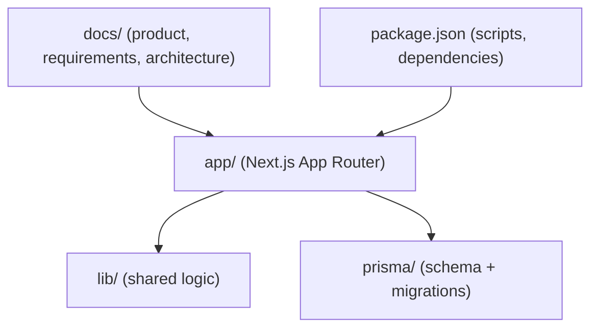
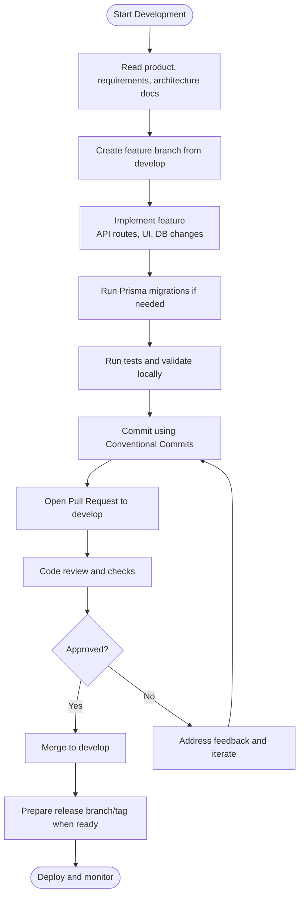
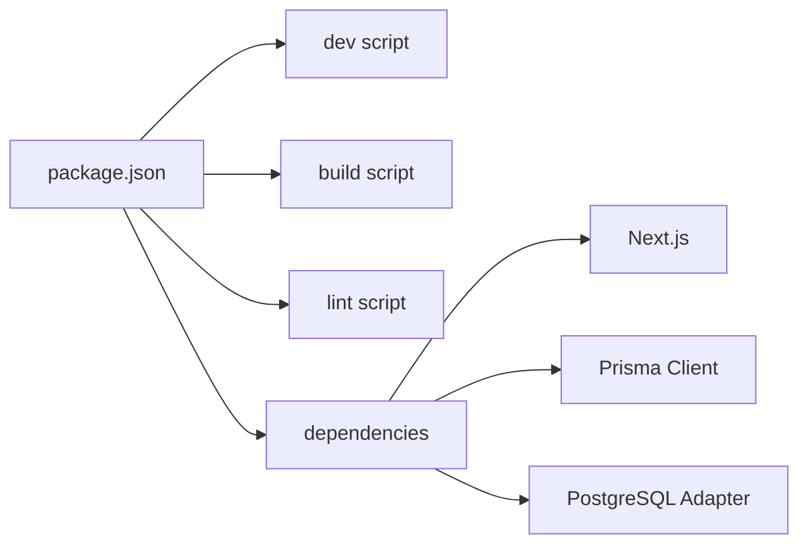

# Git Workflow & Version Control

<cite>
**Referenced Files in This Document**
- [README.md](file://README.md)
- [AGENTS.md](file://AGENTS.md)
- [CLAUDE.md](file://CLAUDE.md)
- [docs/README.md](file://docs/README.md)
- [docs/01-product/01-project-blueprint.md](file://docs/01-product/01-project-blueprint.md)
- [docs/02-requirements/02-decisions.md](file://docs/02-requirements/02-decisions.md)
- [docs/03-architecture/02-database-design.md](file://docs/03-architecture/02-database-design.md)
- [package.json](file://package.json)
- [prisma/schema.prisma](file://prisma/schema.prisma)
</cite>

## Table of Contents
1. [Introduction](#introduction)
2. [Project Structure](#project-structure)
3. [Core Components](#core-components)
4. [Architecture Overview](#architecture-overview)
5. [Detailed Component Analysis](#detailed-component-analysis)
6. [Dependency Analysis](#dependency-analysis)
7. [Performance Considerations](#performance-considerations)
8. [Troubleshooting Guide](#troubleshooting-guide)
9. [Conclusion](#conclusion)
10. [Appendices](#appendices)

## Introduction
This document defines the Git workflow and version control practices for contributing to the PETIVA Pet Healthcare Ecosystem. It covers branching strategies, commit message conventions (Conventional Commits), pull request procedures, merge strategies, conflict resolution, rollback processes, and tagging/versioning. The guidelines are tailored to pet healthcare features such as pet profiles, appointment systems, and AI assistant capabilities.

The project is a Next.js application with Prisma-managed PostgreSQL data, server-side authentication, and AI-assisted health features. Contributors should align their workflows with the product’s feature-driven development approach and the “Definition of Done” defined in the project documentation.

**Section sources**
- [docs/01-product/01-project-blueprint.md:950-1074](file://docs/01-product/01-project-blueprint.md#L950-L1074)
- [docs/README.md:1-66](file://docs/README.md#L1-L66)

## Project Structure
At a high level, the repository includes:
- Application code under app/ (Next.js App Router API routes and pages)
- Shared libraries under lib/
- Database schema and migrations under prisma/
- Product, requirements, and architecture documentation under docs/
- Configuration files at the root (e.g., package.json, tsconfig.json)

**Diagram sources**
- [package.json:1-35](file://package.json#L1-L35)
- [docs/README.md:35-66](file://docs/README.md#L35-L66)

**Section sources**
- [package.json:1-35](file://package.json#L1-L35)
- [docs/README.md:35-66](file://docs/README.md#L35-L66)

## Core Components
This section outlines the core components that influence Git workflow decisions:
- Feature-driven development lifecycle
- Data model and migrations (Prisma)
- Authentication and authorization
- AI assistant integration

These components inform how branches, commits, PRs, and releases should be structured to maintain stability and traceability.

**Section sources**
- [docs/01-product/01-project-blueprint.md:950-1074](file://docs/01-product/01-project-blueprint.md#L950-L1074)
- [docs/02-requirements/02-decisions.md:7-38](file://docs/02-requirements/02-decisions.md#L7-L38)
- [prisma/schema.prisma:1-200](file://prisma/schema.prisma#L1-L200)

## Architecture Overview
The following diagram maps the repository structure to the development workflow stages described in the documentation.

[No sources needed since this diagram shows conceptual workflow, not actual code structure]

## Detailed Component Analysis

### Branching Strategy
Recommended branches:
- main: Production-ready code. Only merged via approved releases.
- develop: Integration branch for ongoing work. All feature branches merge here first.
- feature/<feature-slug>: For new features (e.g., feature/pet-profiles, feature/appointment-system, feature/ai-health-assistant).
- hotfix/<hotfix-slug>: For urgent production fixes. Merge into main and develop after approval.
- release/<version>: Optional pre-release stabilization branch before tagging.

Rules:
- Always base feature branches on the latest develop.
- Keep feature branches small and focused on one capability.
- Use descriptive branch names tied to features or issues.
- Protect main and develop with required reviews and status checks.

Rationale:
- Aligns with the project’s feature-driven development methodology and ensures stable integration points.

**Section sources**
- [docs/01-product/01-project-blueprint.md:950-1074](file://docs/01-product/01-project-blueprint.md#L950-L1074)

### Commit Message Conventions (Conventional Commits)
Use the format: type(scope): description

Common types:
- feat: New features (e.g., pet profiles, appointments, AI assistant)
- fix: Bug fixes
- refactor: Code restructuring without behavior change
- docs: Documentation updates
- style: Formatting, whitespace, linting
- test: Adding or updating tests
- chore: Tooling, config, dependency updates
- ci: CI configuration changes
- perf: Performance improvements
- revert: Revert previous commits

Scope examples:
- pets, appointments, auth, clinic, vet, ai, db, ui, api

Examples relevant to pet healthcare:
- feat(pets): add pet profile creation and update endpoints
- feat(appointments): implement booking flow with status transitions
- feat(ai): integrate context-aware health assistant responses
- fix(auth): correct session expiration handling
- refactor(db): normalize medical record versioning queries
- docs(api): update endpoint contracts for vet discovery
- test(appointments): add unit tests for scheduling conflicts
- chore(deps): upgrade Prisma client to latest version
- perf(api): optimize pet timeline query performance
- revert: undo accidental migration rollback

Guidelines:
- Keep the subject line concise (under 72 characters).
- Use imperative mood (“add”, not “added”).
- Include scope to clarify affected area.
- Reference related issues or tickets where applicable.

**Section sources**
- [docs/01-product/01-project-blueprint.md:950-1074](file://docs/01-product/01-project-blueprint.md#L950-L1074)

### Pull Request Procedures
Before opening a PR:
- Ensure your branch is up-to-date with develop.
- Run local linting and tests.
- Verify database migrations apply cleanly.
- Confirm all acceptance criteria are met per the Definition of Done.

PR checklist:
- Linked issue or ticket reference
- Brief summary of changes
- Screenshots or logs for UI/API changes
- Migration notes (if any)
- Testing performed and results
- Security considerations (no secrets exposed)

Review expectations:
- At least one approving review from a maintainer or peer.
- Automated checks must pass (lint, build, tests).
- Changes must align with architecture and requirements documents.

Approval workflow:
- Reviewers verify correctness, completeness, and adherence to standards.
- Approvals required before merging to develop or main.

**Section sources**
- [docs/01-product/01-project-blueprint.md:950-1074](file://docs/01-product/01-project-blueprint.md#L950-L1074)
- [docs/01-product/01-project-blueprint.md:1031-1049](file://docs/01-product/01-project-blueprint.md#L1031-L1049)

### Merge Strategies
- Feature branches merge into develop via PRs with required reviews.
- Hotfixes merge into main first, then backport to develop.
- Releases may use a temporary release branch to stabilize before tagging.
- Squash merges recommended for feature branches to keep history clean; preserve linear history on main.

Conflict resolution:
- Resolve conflicts locally, run tests, and update the PR.
- Prefer smaller, incremental merges to reduce conflicts.
- If conflicts arise across multiple areas, coordinate with owners of those areas.

**Section sources**
- [docs/01-product/01-project-blueprint.md:950-1074](file://docs/01-product/01-project-blueprint.md#L950-L1074)

### Rollback Processes
- Use git revert to undo specific commits safely without rewriting history.
- For critical issues, create a hotfix branch from main, apply the revert, and merge back to main and develop.
- Coordinate database rollbacks carefully; ensure migrations are reversible or have safe fallbacks.
- Document rollbacks in commit messages and PR descriptions.

**Section sources**
- [docs/01-product/01-project-blueprint.md:950-1074](file://docs/01-product/01-project-blueprint.md#L950-L1074)

### Tagging and Version Management
- Use semantic versioning (MAJOR.MINOR.PATCH) for tags on main.
- Tag releases after successful QA and deployment readiness.
- Maintain a changelog aligned with conventional commits to summarize changes per release.
- Avoid tagging intermediate work; only tag stable, deployable versions.

**Section sources**
- [docs/01-product/01-project-blueprint.md:950-1074](file://docs/01-product/01-project-blueprint.md#L950-L1074)

## Dependency Analysis
The repository’s scripts and dependencies influence workflow automation:
- Scripts: dev, build, start, lint
- Linting: ESLint configured for Next.js
- Database: Prisma ORM with PostgreSQL adapter
- Frontend: Next.js with React

**Diagram sources**
- [package.json:1-35](file://package.json#L1-L35)

**Section sources**
- [package.json:1-35](file://package.json#L1-L35)

## Performance Considerations
- Keep feature branches focused to minimize merge overhead.
- Prefer targeted commits with clear scopes to improve review efficiency.
- Validate database queries and migrations early to avoid costly rework.
- Use linting and builds locally to catch issues before PRs.

[No sources needed since this section provides general guidance]

## Troubleshooting Guide
Common issues and resolutions:
- Migration failures:
  - Ensure environment variables are set correctly.
  - Apply migrations incrementally and test locally.
  - If stuck, create a corrective migration rather than destructive changes.
- Lint/build errors:
  - Run lint locally and fix reported issues.
  - Update dependencies cautiously and verify compatibility.
- Conflicts in shared modules:
  - Communicate with module owners and coordinate changes.
  - Break large changes into smaller PRs.

References:
- Follow the project’s rules to review changes before committing and adhere to the Definition of Done.

**Section sources**
- [docs/01-product/01-project-blueprint.md:975-1027](file://docs/01-product/01-project-blueprint.md#L975-L1027)
- [docs/01-product/01-project-blueprint.md:1031-1049](file://docs/01-product/01-project-blueprint.md#L1031-L1049)

## Conclusion
Adopting a disciplined Git workflow—branching by feature, writing meaningful commits, enforcing PR reviews, and managing releases with semantic tags—ensures the PETIVA Pet Healthcare Ecosystem remains stable, auditable, and scalable. Align contributions with the documented product vision, requirements, and architecture to deliver reliable pet healthcare features.

[No sources needed since this section summarizes without analyzing specific files]

## Appendices

### Appendix A: Example Good vs Bad Commit Messages
Good:
- feat(pets): add pet profile creation and update endpoints
- fix(appointments): resolve double-booking validation bug
- refactor(db): normalize medical record versioning queries
- docs(api): update endpoint contracts for vet discovery
- test(ai): add unit tests for health assistant response formatting

Bad:
- updated stuff
- fixed bugs
- changed db
- added new feature
- wip

[No sources needed since this section provides general guidance]

### Appendix B: Feature-Specific Guidance
- Pet Profiles:
  - Scope: pets
  - Focus: CRUD operations, validation, relationships to users and medical records
- Appointment Systems:
  - Scope: appointments
  - Focus: scheduling, status transitions, conflict detection, notifications
- AI Assistant Features:
  - Scope: ai
  - Focus: context retrieval, safe guidance, conversation persistence, error handling

[No sources needed since this section provides general guidance]