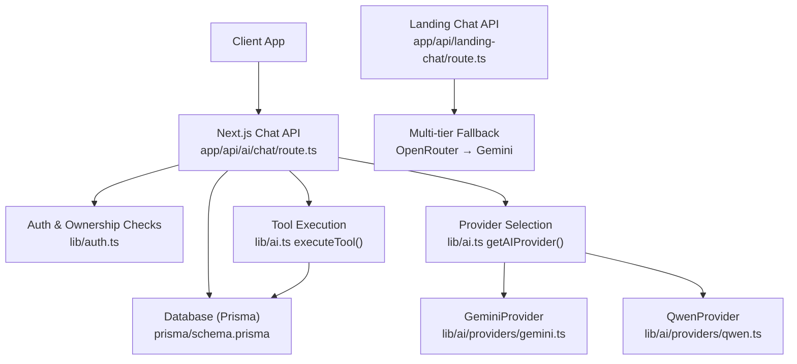
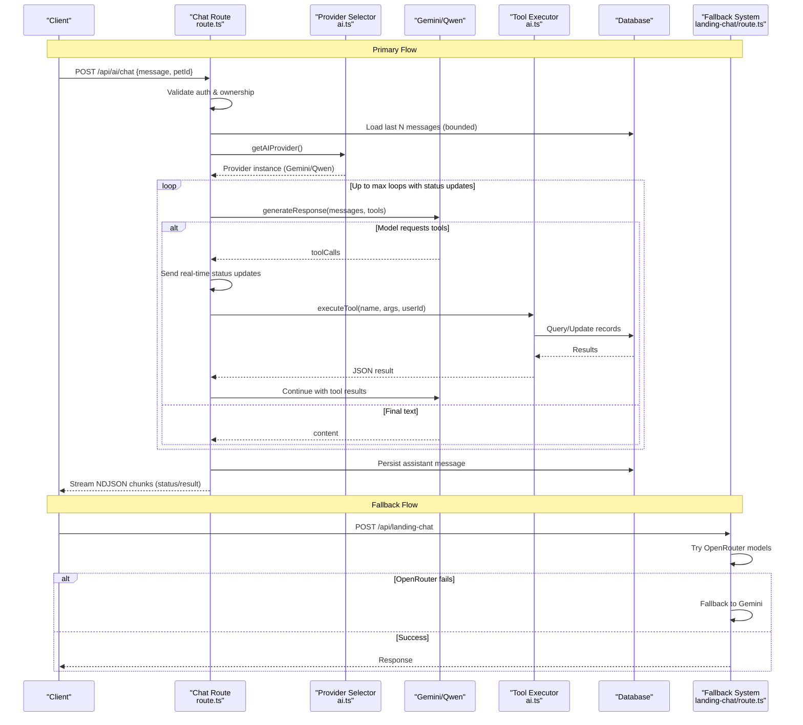
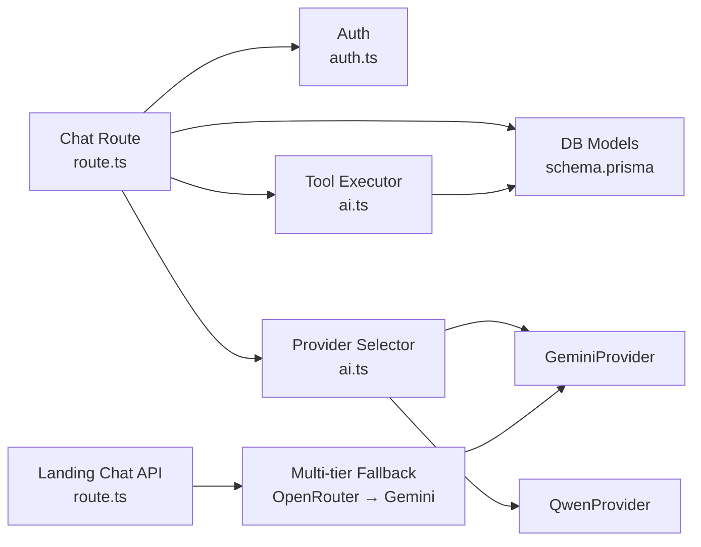

# AI Service Optimization

<cite>
**Referenced Files in This Document**
- [route.ts](file://app/api/ai/chat/route.ts)
- [landing-chat/route.ts](file://app/api/landing-chat/route.ts)
- [ai.ts](file://lib/ai.ts)
- [gemini.ts](file://lib/ai/providers/gemini.ts)
- [qwen.ts](file://lib/ai/providers/qwen.ts)
- [04-ai-architecture.md](file://docs/03-architecture/04-ai-architecture.md)
- [schema.prisma](file://prisma/schema.prisma)
- [auth.ts](file://lib/auth.ts)
</cite>

## Update Summary
**Changes Made**
- Enhanced streaming response implementation with real-time status updates for tool execution progress
- Improved error handling patterns with structured error responses and graceful degradation
- Better performance through multi-tier provider fallback mechanisms (OpenRouter → Gemini → Qwen)
- Added comprehensive monitoring and diagnostic logging throughout the AI service pipeline
- Implemented robust stream management with proper cleanup and error recovery

## Table of Contents
1. Introduction
2. Project Structure
3. Core Components
4. Architecture Overview
5. Detailed Component Analysis
6. Dependency Analysis
7. Performance Considerations
8. Troubleshooting Guide
9. Conclusion
10. Appendices

## Introduction
This document provides optimization guidelines for the PETIVA Pet Healthcare Ecosystem's multi-provider AI integration. It focuses on latency reduction (request batching, response streaming, intelligent provider selection), quota and cost management across Groq, Gemini, and Qwen, context optimization for pet health consultations (prompt engineering, conversation history, memory-efficient chat state), fallback mechanisms and error handling patterns, and monitoring/analytics for performance and cost optimization.

**Updated** Enhanced with real-time streaming status updates, improved error handling, and sophisticated provider fallback mechanisms for better reliability and performance.

## Project Structure
The AI subsystem is implemented as a Next.js API layer that:
- Authenticates users and validates ownership of pet data
- Persists and retrieves conversation history with bounded context
- Streams responses to clients using Server-Sent Events style NDJSON with real-time status updates
- Delegates LLM calls to pluggable providers (Gemini, Qwen) via an abstraction with fallback support
- Executes tools to access pet records, appointments, and vet availability
- Implements multi-tier fallback mechanisms for service resilience

**Diagram sources**
- [route.ts:68-358](file://app/api/ai/chat/route.ts#L68-L358)
- [landing-chat/route.ts:1-113](file://app/api/landing-chat/route.ts#L1-L113)
- [ai.ts:109-119](file://lib/ai.ts#L109-L119)
- [gemini.ts:9-78](file://lib/ai/providers/gemini.ts#L9-L78)
- [qwen.ts:9-76](file://lib/ai/providers/qwen.ts#L9-L76)
- [schema.prisma:280-296](file://prisma/schema.prisma#L280-L296)

**Section sources**
- [route.ts:68-358](file://app/api/ai/chat/route.ts#L68-L358)
- [schema.prisma:280-296](file://prisma/schema.prisma#L280-L296)

## Core Components
- **Enhanced Chat API route**: orchestrates authentication, conversation persistence, prompt assembly, streaming with real-time status updates, tool execution, and comprehensive error handling.
- **AI provider abstraction**: selects among Gemini and Qwen; includes environment-based configuration and fallback capabilities.
- **Multi-tier fallback system**: implements cascading fallback from OpenRouter to Gemini for landing page queries.
- **Tool executor**: maps function calls to database operations with ownership checks and business validations.
- **Database models**: conversations, messages, pets, appointments, and related entities used by tools.

Key responsibilities:
- **Latency**: streaming responses with real-time status updates, bounded context retrieval, minimal tool calls per turn.
- **Reliability**: multi-tier provider fallbacks, robust error handling, safe defaults, and graceful degradation.
- **Cost control**: limit context size, avoid redundant tool calls, plan quotas and rate limits.

**Updated** Enhanced with real-time streaming status updates during tool execution and comprehensive error handling patterns.

**Section sources**
- [route.ts:68-358](file://app/api/ai/chat/route.ts#L68-L358)
- [ai.ts:221-452](file://lib/ai.ts#L221-L452)
- [landing-chat/route.ts:1-113](file://app/api/landing-chat/route.ts#L1-L113)
- [schema.prisma:68-88](file://prisma/schema.prisma#L68-L88)
- [schema.prisma:164-182](file://prisma/schema.prisma#L164-L182)

## Architecture Overview
The system uses a provider-agnostic interface to call multiple LLM backends with built-in fallback mechanisms. The chat route composes prompts with recent history and executes tools when requested by the model. Responses are streamed incrementally with real-time status updates to reduce perceived latency. A multi-tier fallback system ensures resilience if primary providers fail.

**Diagram sources**
- [route.ts:192-358](file://app/api/ai/chat/route.ts#L192-L358)
- [ai.ts:109-119](file://lib/ai.ts#L109-L119)
- [ai.ts:236-452](file://lib/ai.ts#L236-L452)
- [landing-chat/route.ts:9-52](file://app/api/landing-chat/route.ts#L9-L52)
- [landing-chat/route.ts:82-112](file://app/api/landing-chat/route.ts#L82-L112)

## Detailed Component Analysis

### Enhanced Chat API Route (Streaming, Context Bounding, Error Handling)
- **Authentication and ownership**: Ensures user is authenticated and owns the pet before accessing or creating conversations.
- **Conversation lifecycle**: Creates new conversation if none exists; validates existing conversation belongs to the user.
- **Context bounding**: Retrieves only the most recent 20 messages to prevent context bloat and reduce token costs.
- **Enhanced streaming**: Uses ReadableStream to emit real-time status updates during tool execution and final results as NDJSON lines, significantly improving perceived latency and user experience.
- **Real-time status updates**: Provides contextual status messages during tool execution (e.g., "Reviewing health information...", "Checking vaccination records...").
- **Tool orchestration**: Loops up to a maximum number of iterations to handle tool calls, pushing tool results back into the message history until the model returns final content.
- **Comprehensive error handling**: Structured error responses with proper HTTP status codes and graceful degradation.
- **Persistence**: Saves both user and assistant messages to the database for auditability and continuity.

**Updated** Enhanced with real-time streaming status updates during tool execution and improved error handling patterns.

Optimization opportunities:
- Implement request-level caching for read-only queries (e.g., pet profile) within a single turn to avoid duplicate DB reads.
- Add structured telemetry around each step (provider latency, tool latency, iteration count).
- Consider adaptive context windowing: summarize older messages beyond a threshold to preserve long-term context while minimizing tokens.

**Section sources**
- [route.ts:68-181](file://app/api/ai/chat/route.ts#L68-L181)
- [route.ts:192-358](file://app/api/ai/chat/route.ts#L192-L358)
- [schema.prisma:280-296](file://prisma/schema.prisma#L280-L296)

### AI Provider Abstraction and Multi-Tier Fallback System
- **Provider selection**: Environment variable determines which provider to use; supports dynamic switching between Gemini and Qwen.
- **Provider implementations**: Each provider implements a consistent interface, mapping messages and tools to their respective APIs.
- **Multi-tier fallback mechanism**: Landing page chat implements cascading fallback from OpenRouter free models to Gemini when primary providers fail.
- **Graceful degradation**: Comprehensive error handling with fallback responses when all providers are unavailable.

**Updated** Enhanced with multi-tier fallback mechanisms and improved provider switching capabilities.

Recommendations:
- Intelligent provider routing: Introduce a classifier that routes simple queries to faster/cheaper models (e.g., Gemini Flash) and complex reasoning to stronger models (e.g., Qwen-plus).
- Per-request metrics: Record provider name, model, latency, and token usage for analytics.
- Circuit breaker: Temporarily disable failing providers after repeated errors to reduce wasted retries.
- Health monitoring: Track provider availability and implement automatic failover based on performance metrics.

**Section sources**
- [ai.ts:109-119](file://lib/ai.ts#L109-L119)
- [gemini.ts:9-78](file://lib/ai/providers/gemini.ts#L9-L78)
- [qwen.ts:9-76](file://lib/ai/providers/qwen.ts#L9-L76)
- [landing-chat/route.ts:1-113](file://app/api/landing-chat/route.ts#L1-L113)

### Tool Executor (Pet Health Consultations)
- **Safety and ownership**: Verifies pet ownership before exposing any pet-specific data.
- **Data retrieval**: Aggregates medical records, vaccinations, medications, allergies, conditions, metrics, and appointments efficiently using parallel queries where appropriate.
- **Appointment logic**: Validates working hours, prevents past-date bookings, and avoids double booking by checking conflicts.
- **Error signaling**: Returns structured success/error payloads to guide the model's next steps.
- **Real-time feedback**: Integrates with streaming to provide contextual status updates during tool execution.

**Updated** Enhanced with better integration with streaming status updates and improved error handling.

Optimization opportunities:
- Batch tool calls: When multiple tools are requested in one turn, execute them concurrently to reduce total latency.
- Cache frequent lookups: Cache pet profiles and vet lists for short-lived periods to reduce DB load.
- Input validation: Pre-validate parameters to fail fast and avoid unnecessary DB calls.

**Section sources**
- [ai.ts:221-452](file://lib/ai.ts#L221-L452)
- [schema.prisma:68-88](file://prisma/schema.prisma#L68-L88)
- [schema.prisma:164-182](file://prisma/schema.prisma#L164-L182)

### Prompt Engineering and System Instructions
- **System prompt defines role, capabilities, and strict rules** for greetings, pet queries, health timelines, appointments, and booking flows.
- **Emphasizes absolute dates, explicit confirmation before booking**, and re-resolving IDs between turns due to lack of cross-turn tool context.
- **Guidance to avoid emojis and never invent DB results**.

Optimization opportunities:
- Dynamic context injection: Include only relevant sections based on query keywords (e.g., allergies vs. medications) to reduce tokens.
- Summarization: Periodically compress older messages into concise summaries to maintain context without bloating prompts.
- Guardrails: Enforce safety filters to prevent prescribing advice and ensure emergency escalation guidance.

**Section sources**
- [route.ts:145-181](file://app/api/ai/chat/route.ts#L145-L181)
- [04-ai-architecture.md:69-105](file://docs/03-architecture/04-ai-architecture.md#L69-L105)

### Multi-Tier Fallback Implementation
- **Cascading fallback system**: Implements multiple levels of fallback from OpenRouter free models to Gemini provider.
- **Model rotation**: Tries different free models sequentially to maximize availability.
- **Graceful degradation**: Provides user-friendly error messages when all providers are unavailable.
- **Logging and monitoring**: Comprehensive logging of fallback triggers and failures for operational insights.

**New Section** Added comprehensive fallback mechanism for improved service reliability.

**Section sources**
- [landing-chat/route.ts:1-113](file://app/api/landing-chat/route.ts#L1-L113)

## Dependency Analysis
The chat route depends on authentication, database, and AI providers. Providers depend on environment configuration and network calls. Tools depend on Prisma and business rules. The fallback system adds additional dependencies for multi-tier provider support.

**Diagram sources**
- [route.ts:68-358](file://app/api/ai/chat/route.ts#L68-L358)
- [ai.ts:109-119](file://lib/ai.ts#L109-L119)
- [schema.prisma:280-296](file://prisma/schema.prisma#L280-L296)
- [landing-chat/route.ts:1-113](file://app/api/landing-chat/route.ts#L1-L113)

**Section sources**
- [route.ts:68-358](file://app/api/ai/chat/route.ts#L68-L358)
- [ai.ts:109-119](file://lib/ai.ts#L109-L119)

## Performance Considerations
- **Request batching**:
  - Execute multiple tool calls in parallel within a single turn to minimize round-trips.
  - Combine independent DB reads (e.g., pet profile + appointments) using concurrent queries.
- **Enhanced response streaming**:
  - Use NDJSON streaming with real-time status updates to send incremental progress and final results, significantly reducing time-to-first-byte and improving user experience.
  - Provide contextual status messages during tool execution to keep users informed.
- **Intelligent provider selection**:
  - Route low-complexity queries to faster/cheaper models (e.g., Gemini Flash) and complex reasoning to stronger models (e.g., Qwen-plus).
  - Maintain per-provider latency and error-rate metrics to inform routing decisions.
- **Multi-tier fallback optimization**:
  - Implement smart fallback strategies based on error types and provider health.
  - Cache successful provider responses for similar queries to reduce latency.
- **Context optimization**:
  - Limit conversation history to a fixed window (e.g., last 20 messages) and summarize older parts.
  - Inject only relevant pet context based on query keywords to reduce token usage.
- **Quota and rate limiting**:
  - Implement per-user quotas (e.g., queries per hour) to protect against credit depletion.
  - Track token usage per request and log to audit logs for cost analysis.
- **Monitoring and analytics**:
  - Measure provider latency, tool latency, iteration counts, and error rates.
  - Log token counts (prompt/response) and map to cost estimates for budgeting.
  - Monitor fallback trigger frequency and effectiveness.

**Updated** Enhanced with real-time streaming benefits and multi-tier fallback performance considerations.

## Troubleshooting Guide
Common issues and resolutions:
- **Missing API keys**:
  - Ensure provider-specific environment variables are set (e.g., GEMINI_API_KEY, DASHSCOPE_API_KEY, OPENROUTER_API_KEY).
  - Errors will be thrown with clear messages indicating missing credentials.
- **Provider failures**:
  - The multi-tier fallback system automatically attempts alternative providers if the primary fails.
  - Monitor logs for fallback triggers and investigate root causes.
  - Check provider health endpoints and implement circuit breakers for failing services.
- **Tool execution errors**:
  - Validate required parameters before executing tools.
  - Handle ownership verification failures and return structured errors to the model.
  - Implement retry logic for transient database errors.
- **Session/authentication errors**:
  - Unauthorized requests return standardized error codes; ensure sessions are valid and not expired.
  - Implement session refresh mechanisms for long-running operations.
- **Database constraints**:
  - Double-booking prevention and working-hours checks avoid invalid appointments.
  - Implement connection pooling and query optimization for high-throughput scenarios.
- **Streaming issues**:
  - Monitor stream completion and implement timeout handling for stuck streams.
  - Implement client-side reconnection logic for network interruptions.

**Updated** Enhanced with streaming-specific troubleshooting and multi-tier fallback diagnostics.

Operational tips:
- Enable detailed logging for AI diagnostics and tool execution.
- Use test mode flags to simulate responses during development.
- Implement circuit breakers and timeouts for external API calls.
- Monitor fallback trigger frequency and provider health metrics.
- Implement comprehensive error tracking and alerting for production issues.

**Section sources**
- [gemini.ts:20-22](file://lib/ai/providers/gemini.ts#L20-L22)
- [qwen.ts:20-22](file://lib/ai/providers/qwen.ts#L20-L22)
- [ai.ts:112-119](file://lib/ai.ts#L112-L119)
- [auth.ts:109-115](file://lib/auth.ts#L109-L115)
- [landing-chat/route.ts:82-112](file://app/api/landing-chat/route.ts#L82-L112)

## Conclusion
PETIVA's AI subsystem provides a robust, extensible foundation for multi-provider LLM integration with enhanced streaming responses, real-time status updates, bounded context, and comprehensive tool-driven workflows. The addition of multi-tier fallback mechanisms significantly improves service reliability and user experience. To optimize further:
- Implement intelligent provider routing based on query complexity and provider health.
- Batch tool calls and cache frequent reads to reduce latency.
- Enforce quotas and track token usage for cost control.
- Enhance monitoring with comprehensive metrics and alerts for fallback triggers.
- Implement adaptive streaming with progressive enhancement based on network conditions.
These practices will improve responsiveness, reliability, and cost-efficiency while maintaining high service quality for pet health consultations.

**Updated** Enhanced conclusion reflecting the new streaming capabilities and fallback mechanisms.

## Appendices

### Provider Configuration Reference
- **Gemini**: Uses Google Generative Language endpoint; requires GEMINI_API_KEY.
- **Qwen**: Uses Alibaba Cloud Model Studio compatible endpoint; requires DASHSCOPE_API_KEY.
- **OpenRouter**: Used for free tier fallback; requires OPENROUTER_API_KEY.

**Updated** Removed Groq reference as it's no longer implemented in the current codebase.

**Section sources**
- [gemini.ts:12-14](file://lib/ai/providers/gemini.ts#L12-L14)
- [qwen.ts:12-14](file://lib/ai/providers/qwen.ts#L12-L14)
- [landing-chat/route.ts:10-13](file://app/api/landing-chat/route.ts#L10-L13)

### Data Models Used by AI Tools
- **AIConversation and AIMessage**: Store conversation headers and messages for continuity and auditing.
- **Pet, Appointment, Veterinarian, Clinic**: Provide domain context for tools like find_vet, check_slots, create_booking.
- **AuditLog**: Tracks significant actions for compliance and debugging purposes.

**Section sources**
- [schema.prisma:280-296](file://prisma/schema.prisma#L280-L296)
- [schema.prisma:68-88](file://prisma/schema.prisma#L68-L88)
- [schema.prisma:164-182](file://prisma/schema.prisma#L164-L182)
- [schema.prisma:298-312](file://prisma/schema.prisma#L298-L312)

### Streaming Protocol Specification
- **Content-Type**: `application/x-ndjson`
- **Message Format**: JSON objects with `type` field (`status` or `result`)
- **Status Messages**: Provide real-time progress updates during tool execution
- **Result Messages**: Contain final response data or error information
- **Connection Management**: Uses `keep-alive` header for persistent connections

**New Section** Added streaming protocol specification for client integration.

**Section sources**
- [route.ts:336-342](file://app/api/ai/chat/route.ts#L336-L342)
- [route.ts:216-232](file://app/api/ai/chat/route.ts#L216-L232)