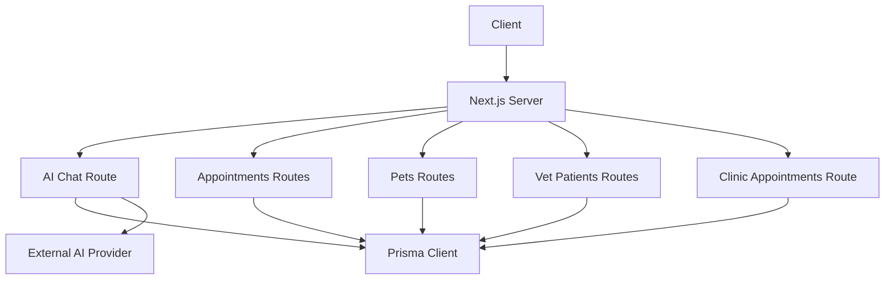
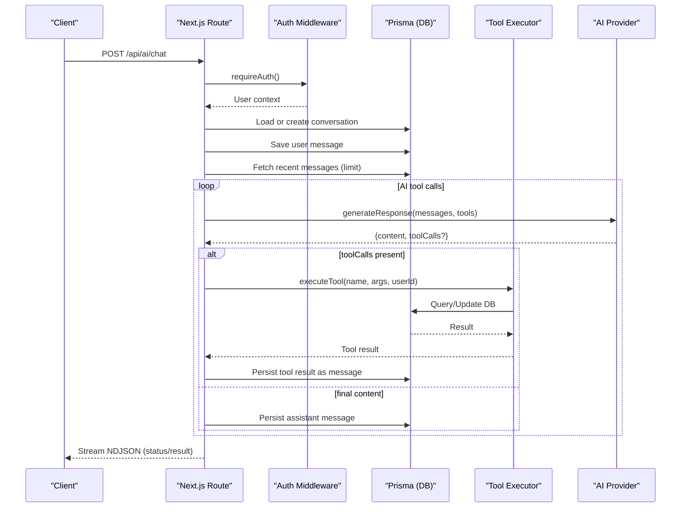
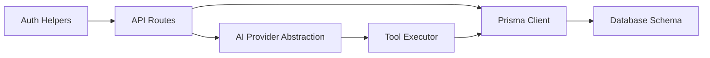

# API Performance Optimization

<cite>
**Referenced Files in This Document**
- [route.ts](file://app/api/ai/chat/route.ts)
- [route.ts](file://app/api/appointments/route.ts)
- [route.ts](file://app/api/pets/[petId]/route.ts)
- [route.ts](file://app/api/pets/[petId]/timeline/route.ts)
- [route.ts](file://app/api/vet/patients/[petId]/history/route.ts)
- [route.ts](file://app/api/clinic/appointments/route.ts)
- [route.ts](file://app/api/vet/patients/route.ts)
- [ai.ts](file://lib/ai.ts)
- [db.ts](file://lib/db.ts)
- [schema.prisma](file://prisma/schema.prisma)
- [next.config.ts](file://next.config.ts)
- [auth.ts](file://lib/auth.ts)
- [proxy.ts](file://proxy.ts)
</cite>

## Table of Contents
1. [Introduction](#introduction)
2. [Project Structure](#project-structure)
3. [Core Components](#core-components)
4. [Architecture Overview](#architecture-overview)
5. [Detailed Component Analysis](#detailed-component-analysis)
6. [Dependency Analysis](#dependency-analysis)
7. [Performance Considerations](#performance-considerations)
8. [Troubleshooting Guide](#troubleshooting-guide)
9. [Conclusion](#conclusion)
10. [Appendices](#appendices)

## Introduction
This document provides performance optimization guidelines for the PETIVA Pet Healthcare Ecosystem APIs. It focuses on:
- Response caching strategies using Next.js built-in mechanisms for pet profiles, appointment data, and AI chat responses
- Pagination patterns for large datasets such as medical histories and pet records
- Rate limiting considerations for AI service endpoints and appointment booking APIs
- Compression techniques, response size optimization, and efficient JSON serialization patterns
- API versioning strategies and backward compatibility
- Monitoring approaches to identify slow endpoints and optimize response times across pet health, scheduling, and AI consultation features

## Project Structure
The application uses a Next.js App Router with server-side API routes under app/api. Key areas include:
- AI chat streaming endpoint that orchestrates tool calls and database queries
- Appointment management endpoints for owners, veterinarians, and clinic admins
- Pet profile and timeline endpoints returning rich medical history
- Vet patient listing and detailed history endpoints
- Database configuration via Prisma with connection pooling
- Authentication middleware and route-level protection

**Diagram sources**
- [route.ts:1-347](file://app/api/ai/chat/route.ts#L1-L347)
- [route.ts:1-143](file://app/api/appointments/route.ts#L1-L143)
- [route.ts:1-141](file://app/api/pets/[petId]/route.ts#L1-L141)
- [route.ts:1-149](file://app/api/pets/[petId]/timeline/route.ts#L1-L149)
- [route.ts:1-153](file://app/api/vet/patients/[petId]/history/route.ts#L1-L153)
- [route.ts:1-98](file://app/api/clinic/appointments/route.ts#L1-L98)
- [route.ts:1-71](file://app/api/vet/patients/route.ts#L1-L71)
- [db.ts:1-33](file://lib/db.ts#L1-L33)
- [ai.ts:1-423](file://lib/ai.ts#L1-L423)

**Section sources**
- [route.ts:1-347](file://app/api/ai/chat/route.ts#L1-L347)
- [route.ts:1-143](file://app/api/appointments/route.ts#L1-L143)
- [route.ts:1-141](file://app/api/pets/[petId]/route.ts#L1-L141)
- [route.ts:1-149](file://app/api/pets/[petId]/timeline/route.ts#L1-L149)
- [route.ts:1-153](file://app/api/vet/patients/[petId]/history/route.ts#L1-L153)
- [route.ts:1-98](file://app/api/clinic/appointments/route.ts#L1-L98)
- [route.ts:1-71](file://app/api/vet/patients/route.ts#L1-L71)
- [db.ts:1-33](file://lib/db.ts#L1-L33)
- [ai.ts:1-423](file://lib/ai.ts#L1-L423)

## Core Components
- AI Chat Streaming: Orchestrates conversation persistence, tool execution, and external AI provider calls with streaming NDJSON responses.
- Appointments: CRUD operations with role-based filtering and double-booking prevention.
- Pet Profiles and Timelines: Ownership checks, rich timeline aggregation from multiple entities, and vet-only history access.
- Database Layer: Prisma client with connection pooling and environment-aware initialization.
- AI Tool Execution: Centralized tool handlers for pet data retrieval, scheduling, and booking with validation and safety checks.

**Section sources**
- [route.ts:1-347](file://app/api/ai/chat/route.ts#L1-L347)
- [route.ts:1-143](file://app/api/appointments/route.ts#L1-L143)
- [route.ts:1-141](file://app/api/pets/[petId]/route.ts#L1-L141)
- [route.ts:1-149](file://app/api/pets/[petId]/timeline/route.ts#L1-L149)
- [route.ts:1-153](file://app/api/vet/patients/[petId]/history/route.ts#L1-L153)
- [route.ts:1-98](file://app/api/clinic/appointments/route.ts#L1-L98)
- [route.ts:1-71](file://app/api/vet/patients/route.ts#L1-L71)
- [ai.ts:1-423](file://lib/ai.ts#L1-L423)
- [db.ts:1-33](file://lib/db.ts#L1-L33)

## Architecture Overview
The API architecture centers around Next.js serverless/server functions that enforce authentication, perform authorization, query the database via Prisma, and optionally call external AI providers. The AI chat flow streams status updates and results to clients while persisting messages and enforcing context limits.

**Diagram sources**
- [route.ts:68-331](file://app/api/ai/chat/route.ts#L68-L331)
- [ai.ts:236-423](file://lib/ai.ts#L236-L423)
- [db.ts:1-33](file://lib/db.ts#L1-L33)

## Detailed Component Analysis

### AI Chat Endpoint
- Streaming NDJSON: Uses ReadableStream to send incremental status and result chunks; sets Cache-Control: no-cache to avoid caching live conversations.
- Context Limiting: Limits conversation history to a fixed number of recent messages to control payload size and token usage.
- Tool Orchestration: Executes tools like getMyPets, getPetHealthTimeline, find_vet, check_slots, create_booking with ownership and business validations.
- Error Handling: Graceful stream closure and error propagation; consistent error envelope.

Optimization recommendations:
- Add request-level rate limiting for AI endpoints to protect downstream AI providers and reduce load.
- Introduce per-user conversation TTL and message pruning to keep payloads small.
- Use field selection in Prisma queries to minimize serialized payload sizes.
- Consider server-side caching for read-only parts of tool outputs (e.g., vet listings) with short TTLs.

**Section sources**
- [route.ts:68-331](file://app/api/ai/chat/route.ts#L68-L331)
- [ai.ts:141-219](file://lib/ai.ts#L141-L219)
- [ai.ts:236-423](file://lib/ai.ts#L236-L423)

### Appointments Endpoints
- Role-based queries: Owner, Veterinarian, and Clinic Admin views with appropriate includes and ordering.
- Double-booking prevention: Transactional conflict detection before creating appointments.
- Validation: Required fields enforced; clear error codes and status codes.

Optimization recommendations:
- Implement pagination for owner/vet/admin lists using cursor or offset-based pagination to handle large datasets.
- Add selective field projection to reduce payload size (e.g., select only necessary fields).
- Introduce cache headers for list endpoints where appropriate (e.g., short-lived public-like filters), but ensure auth-scoped data is not cached broadly.
- Add rate limiting on POST to prevent abuse and protect DB write paths.

**Section sources**
- [route.ts:1-143](file://app/api/appointments/route.ts#L1-L143)
- [route.ts:1-98](file://app/api/clinic/appointments/route.ts#L1-L98)

### Pet Profile and Timeline Endpoints
- Ownership enforcement: Helper ensures users can only access their own pets.
- Timeline aggregation: Combines multiple entities into a unified chronological view; currently fetches all related records without pagination.

Optimization recommendations:
- Paginate timeline events by date ranges or cursors to support long histories.
- Use Prisma select to limit included fields and reduce payload size.
- Cache aggregated timelines with short TTL keyed by petId and user context.
- For vet-only history, add pagination and field selection.

**Section sources**
- [route.ts:1-141](file://app/api/pets/[petId]/route.ts#L1-L141)
- [route.ts:1-149](file://app/api/pets/[petId]/timeline/route.ts#L1-L149)
- [route.ts:1-153](file://app/api/vet/patients/[petId]/history/route.ts#L1-L153)

### Vet Patient Listing
- De-duplicates patients based on confirmed appointments and includes owner contact info.

Optimization recommendations:
- Add pagination for large clinics.
- Cache vet’s patient list briefly if data changes infrequently.
- Use field selection to exclude unnecessary relations.

**Section sources**
- [route.ts:1-71](file://app/api/vet/patients/route.ts#L1-L71)

### Database Layer
- Connection pooling: Production uses a dedicated pool; development reuses global instances to avoid hot-reload overhead.
- Environment-aware initialization ensures stable connections.

Optimization recommendations:
- Monitor connection pool metrics and tune pool size based on workload.
- Ensure indexes exist for frequent query patterns (already present for key relationships).
- Use Prisma transactions for multi-step writes to maintain consistency and reduce retries.

**Section sources**
- [db.ts:1-33](file://lib/db.ts#L1-L33)
- [schema.prisma:164-182](file://prisma/schema.prisma#L164-L182)

## Dependency Analysis
Key dependencies and interactions:
- API routes depend on authentication helpers and Prisma client.
- AI chat depends on AI provider abstraction and tool executor.
- Data models define relationships and indexes used by queries.

**Diagram sources**
- [auth.ts:94-124](file://lib/auth.ts#L94-L124)
- [route.ts:1-347](file://app/api/ai/chat/route.ts#L1-L347)
- [route.ts:1-143](file://app/api/appointments/route.ts#L1-L143)
- [ai.ts:1-423](file://lib/ai.ts#L1-L423)
- [schema.prisma:1-312](file://prisma/schema.prisma#L1-L312)

**Section sources**
- [auth.ts:94-124](file://lib/auth.ts#L94-L124)
- [route.ts:1-347](file://app/api/ai/chat/route.ts#L1-L347)
- [route.ts:1-143](file://app/api/appointments/route.ts#L1-L143)
- [ai.ts:1-423](file://lib/ai.ts#L1-L423)
- [schema.prisma:1-312](file://prisma/schema.prisma#L1-L312)

## Performance Considerations

### Response Caching Strategies
- Pet Profiles:
  - Use Next.js route-level caching for GET /api/pets/[petId] with revalidation based on user session and petId.
  - Apply cache tags scoped to petId and user context to invalidate on updates.
- Appointment Lists:
  - Cache GET /api/appointments and /api/clinic/appointments with short TTLs and tag invalidation on new bookings.
  - Use conditional requests (ETag/Last-Modified) where feasible.
- AI Chat Responses:
  - Keep Cache-Control: no-cache for streaming chat to avoid caching sensitive or dynamic content.
  - Cache read-only tool outputs (e.g., vet search results) with short TTLs and proper scoping.

Implementation notes:
- Configure caching at route level using Next.js options and set appropriate headers.
- Use cache tags to scope invalidation to specific resources (petId, clinicId, userId).
- Avoid caching authenticated user-specific data unless properly scoped.

[No sources needed since this section provides general guidance]

### Pagination Implementation
- Medical Histories and Timelines:
  - Replace full scans with cursor-based pagination using createdAt or id to efficiently fetch slices of timelines.
  - Support filters (date range, type) and combine with sorting for predictable pages.
- Appointment Lists:
  - Implement cursor or offset pagination for owner, vet, and clinic admin views.
  - Provide total counts or hasMore flags for UI pagination controls.

Benefits:
- Reduces payload sizes and database load.
- Improves Time to First Byte and perceived performance.

[No sources needed since this section provides general guidance]

### Rate Limiting Considerations
- AI Service Endpoints:
  - Enforce per-user and per-IP rate limits to protect downstream AI providers and manage costs.
  - Use sliding window counters with Redis or in-memory stores in development.
  - Return standard retry-after headers when limits are exceeded.
- Appointment Booking APIs:
  - Rate limit POST /api/appointments to prevent spam and race conditions.
  - Combine with idempotency keys to safely retry booking attempts.

[No sources needed since this section provides general guidance]

### Compression Techniques and Response Size Optimization
- Enable gzip/br compression at the platform level (e.g., Vercel, CDN) for JSON responses.
- Minimize payload size:
  - Use Prisma select to project only required fields.
  - Avoid including nested relations unless necessary.
  - Normalize large text fields and consider lazy loading.
- Efficient JSON Serialization:
  - Prefer primitive types and avoid circular references.
  - Pre-format dates and strings server-side to reduce client processing.

[No sources needed since this section provides general guidance]

### API Versioning and Backward Compatibility
- Versioning Strategy:
  - Prefix routes with version segments (e.g., /api/v1/...) to evolve contracts safely.
  - Maintain deprecation policies and communicate breaking changes.
- Backward Compatibility:
  - Preserve existing fields and error codes during transitions.
  - Introduce optional fields and graceful fallbacks for missing data.
  - Use feature flags to roll out changes incrementally.

[No sources needed since this section provides general guidance]

### Monitoring Approaches
- Identify Slow Endpoints:
  - Instrument each route with timing metrics (start/end timestamps) and log latency percentiles.
  - Track database query durations and external AI provider call latencies.
- Alerting:
  - Set alerts for high error rates, timeouts, and slow p95/p99 latencies.
- Observability:
  - Correlate logs with request IDs to trace full flows across auth, DB, and AI calls.
  - Use distributed tracing to visualize bottlenecks in AI tool orchestration.

[No sources needed since this section provides general guidance]

## Troubleshooting Guide
Common issues and resolutions:
- Unauthorized Access:
  - Ensure sessions are valid and cookies are correctly set; verify requireAuth behavior.
- Forbidden Access:
  - Confirm ownership checks and role-based permissions are applied consistently.
- Double Booking Conflicts:
  - Handle 409 conflicts gracefully; implement retry with backoff and user feedback.
- AI Provider Errors:
  - Log provider errors and fallback behavior; surface user-friendly messages.
- Large Payloads:
  - Reduce response size by selecting fields and implementing pagination.

**Section sources**
- [auth.ts:94-124](file://lib/auth.ts#L94-L124)
- [route.ts:1-143](file://app/api/appointments/route.ts#L1-L143)
- [route.ts:1-141](file://app/api/pets/[petId]/route.ts#L1-L141)
- [route.ts:1-347](file://app/api/ai/chat/route.ts#L1-L347)

## Conclusion
By applying targeted caching, pagination, rate limiting, compression, and robust monitoring, the PETIVA APIs can deliver fast, reliable experiences across pet health, scheduling, and AI consultation features. Prioritize reducing payload sizes, protecting expensive operations, and ensuring data consistency through transactions and careful indexing.

[No sources needed since this section summarizes without analyzing specific files]

## Appendices

### Data Models and Indexes
Key entities and indexes that influence query performance:
- Appointment: Indexed on vetId+dateTime, ownerId, petId to support scheduling queries.
- MedicalRecordVersion: Indexed on recordId+isCurrent for current version lookups.
- Session: Indexed on userId and expiresAt for auth lookups.

**Section sources**
- [schema.prisma:164-182](file://prisma/schema.prisma#L164-L182)
- [schema.prisma:148-162](file://prisma/schema.prisma#L148-L162)
- [schema.prisma:55-66](file://prisma/schema.prisma#L55-L66)

### Configuration Notes
- Next.js configuration is minimal; enable caching and compression via platform settings and route-level directives.
- Database connection pooling is configured for production and development environments.

**Section sources**
- [next.config.ts:1-8](file://next.config.ts#L1-L8)
- [db.ts:1-33](file://lib/db.ts#L1-L33)