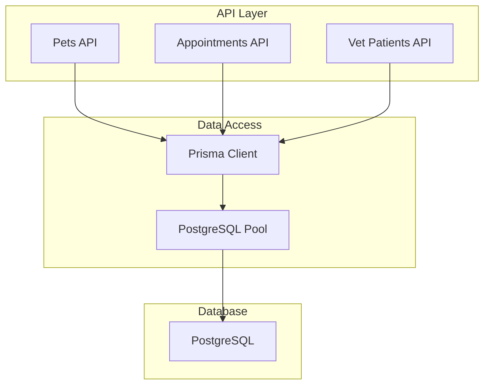
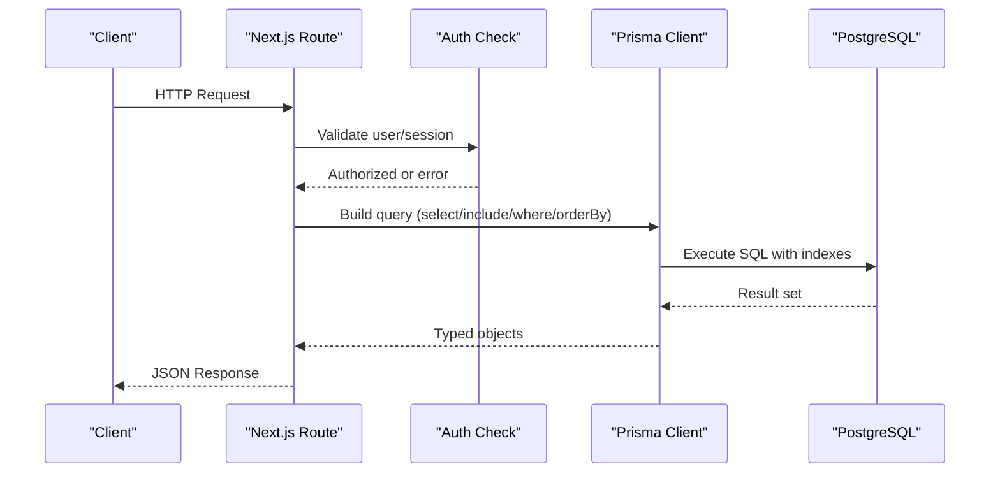
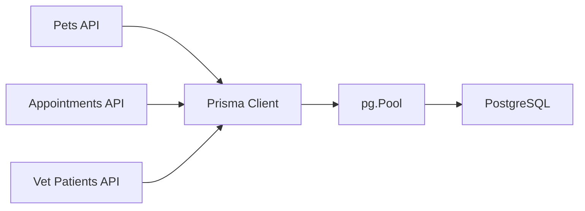

# Database Query Optimization

<cite>
**Referenced Files in This Document**
- [schema.prisma](file://prisma/schema.prisma)
- [db.ts](file://lib/db.ts)
- [route.ts (pets)](file://app/api/pets/route.ts)
- [route.ts (appointments)](file://app/api/appointments/route.ts)
- [route.ts (vet patients)](file://app/api/vet/patients/route.ts)
- [route.ts (pet detail)](file://app/api/pets/[petId]/route.ts)
- [route.ts (vet patient history)](file://app/api/vet/patients/[petId]/history/route.ts)
- [route.ts (vet patient by petId)](file://app/api/vet/patients/[petId]/route.ts)
- [seed.js](file://prisma/seed.js)
</cite>

## Table of Contents
1. Introduction
2. Project Structure
3. Core Components
4. Architecture Overview
5. Detailed Component Analysis
6. Dependency Analysis
7. Performance Considerations
8. Troubleshooting Guide
9. Conclusion
10. Appendices

## Introduction
This document provides comprehensive database query optimization guidelines for the PETIVA system using Prisma ORM and PostgreSQL. It focuses on efficient query patterns, indexing strategies, connection pooling configuration, and practical optimizations for pet search, appointment scheduling, and veterinary patient management. It also covers caching strategies for read-heavy operations and best practices for connection management.

## Project Structure
The application uses Next.js API routes to expose REST endpoints that interact with a PostgreSQL database via Prisma Client. The schema defines core entities such as User, Pet, Veterinarian, Clinic, Appointment, MedicalRecord, Vaccination, Medication, HealthMetric, and related tables. Connection pooling is configured centrally in a shared module and reused across API handlers.

**Diagram sources**
- [db.ts:1-32](file://lib/db.ts#L1-L32)
- [schema.prisma:1-312](file://prisma/schema.prisma#L1-L312)

**Section sources**
- [schema.prisma:1-312](file://prisma/schema.prisma#L1-L312)
- [db.ts:1-32](file://lib/db.ts#L1-L32)

## Core Components
- Shared Prisma client and connection pool: Centralized creation and reuse of a single pg.Pool and PrismaClient instance per environment to avoid connection leaks and reduce overhead.
- API route handlers: Implement authorization checks, build queries with selective field retrieval, include relations where needed, and return structured JSON responses.
- Schema and indexes: Defines models and explicit indexes for frequently queried fields to accelerate lookups and joins.

Key responsibilities:
- lib/db.ts: Creates and exports a singleton Prisma client backed by a pooled connection.
- app/api/*: Implements CRUD and complex queries for pets, appointments, and vet patient data.
- prisma/schema.prisma: Declares models, relations, and indexes aligned with query patterns.

**Section sources**
- [db.ts:1-32](file://lib/db.ts#L1-L32)
- [schema.prisma:1-312](file://prisma/schema.prisma#L1-L312)
- [route.ts (pets):1-69](file://app/api/pets/route.ts#L1-L69)
- [route.ts (appointments):1-143](file://app/api/appointments/route.ts#L1-L143)
- [route.ts (vet patients):1-71](file://app/api/vet/patients/route.ts#L1-L71)

## Architecture Overview
The system follows a layered architecture:
- API layer: Next.js route handlers enforce authentication and authorization, then delegate to Prisma queries.
- Data access layer: Prisma Client executes typed queries against PostgreSQL.
- Storage layer: PostgreSQL stores relational data; indexes are defined in the schema to optimize common queries.

**Diagram sources**
- [route.ts (appointments):1-143](file://app/api/appointments/route.ts#L1-L143)
- [route.ts (vet patient history):1-153](file://app/api/vet/patients/[petId]/history/route.ts#L1-L153)
- [db.ts:1-32](file://lib/db.ts#L1-L32)
- [schema.prisma:1-312](file://prisma/schema.prisma#L1-L312)

## Detailed Component Analysis

### Selective Field Retrieval with select/include
- Use select to fetch only required fields from related entities to minimize payload size and network transfer.
- Use include sparingly for nested relations when necessary; prefer separate queries or server-side joins if performance degrades.

Examples in code:
- Appointments listing includes vet.user with minimal fields and clinic details.
- Vet patient detail includes owner fields selectively.
- History endpoint includes medical record versions ordered by date.

Optimization tips:
- Prefer select over include when you do not need full related objects.
- Limit included relations depth to one level where possible.
- Order results to leverage indexes (e.g., dateTime).

**Section sources**
- [route.ts (appointments):1-143](file://app/api/appointments/route.ts#L1-L143)
- [route.ts (vet patient by petId):1-80](file://app/api/vet/patients/[petId]/route.ts#L1-L80)
- [route.ts (vet patient history):1-153](file://app/api/vet/patients/[petId]/history/route.ts#L1-L153)

### Batch Operations for Bulk Updates
- For bulk updates (e.g., marking multiple medications inactive), use Prisma’s batch update patterns or transactions to ensure consistency.
- Group writes into transactions to reduce round-trips and maintain atomicity.

Guidance:
- When updating many records, consider batching within a transaction to avoid partial updates.
- Avoid N+1 updates by constructing a single updateMany call or custom SQL via $executeRaw when appropriate.

Note: No specific bulk update implementation was found in the analyzed routes; apply these patterns when adding bulk operations.

**Section sources**
- [schema.prisma:1-312](file://prisma/schema.prisma#L1-L312)

### Connection Pooling Configuration
- Production: Create a single pg.Pool and attach it to PrismaClient via the PostgreSQL adapter.
- Development: Reuse global pool and client instances to prevent memory leaks during hot reloads.

Best practices:
- Configure pool size based on expected concurrency and database capacity.
- Monitor connection usage and adjust pool settings under load.
- Ensure DATABASE_URL is correctly set and secrets are managed securely.

**Section sources**
- [db.ts:1-32](file://lib/db.ts#L1-L32)
- [seed.js:1-31](file://prisma/seed.js#L1-L31)

### Indexing Strategies
Indexes are critical for query performance. The schema already defines several useful indexes:

- Appointment table:
  - Composite index on (vetId, dateTime) supports scheduling queries by veterinarian and time range.
  - Index on ownerId supports owner-specific appointment lists.
  - Index on petId supports pet-centric queries.

- MedicalRecordVersion table:
  - Composite index on (recordId, isCurrent) optimizes fetching current version of a record efficiently.

- Session table:
  - Indexes on userId and expiresAt support session lookup and cleanup.

- AuditLog table:
  - Indexes on userId, entity/entityId, and timestamp support auditing queries.

Recommendations:
- Add indexes for frequently filtered columns like vaccination.administeredDate and medication.startDate/endDate if those fields become query filters.
- Consider composite indexes for multi-field filters commonly used together (e.g., petId + metricType for health metrics).

**Section sources**
- [schema.prisma:1-312](file://prisma/schema.prisma#L1-L312)

### Complex Pet Health Queries
- Parallelization: Fetch independent datasets concurrently using Promise.all to reduce latency.
- Selective includes: Include only necessary relations (e.g., vet.user with minimal fields).
- Ordering: Use orderBy on indexed fields (e.g., createdAt, dateTime) to leverage indexes.

Example pattern:
- Retrieve medical records, vaccinations, medications, allergies, conditions, and metrics concurrently for a given petId.

**Section sources**
- [route.ts (vet patient history):1-153](file://app/api/vet/patients/[petId]/history/route.ts#L1-L153)

### Practical Optimizations for Slow Queries

#### Pet Search
- Current list endpoint retrieves all pets for an authenticated owner without pagination or filtering beyond ownerId.
- Recommendations:
  - Add pagination (limit/skip) to reduce payload size.
  - Add optional filters (species, breed) with corresponding indexes if frequently used.
  - Use select to limit returned fields to what the UI needs.

**Section sources**
- [route.ts (pets):1-69](file://app/api/pets/route.ts#L1-L69)

#### Appointment Scheduling
- Double-booking prevention uses a transaction to check conflicts before creating an appointment.
- Recommendations:
  - Ensure vetId + dateTime conflict checks leverage the composite index.
  - Consider adding status-based indexes if querying by status frequently.
  - Use select/include minimally to reduce response size.

**Section sources**
- [route.ts (appointments):1-143](file://app/api/appointments/route.ts#L1-L143)
- [schema.prisma:164-182](file://prisma/schema.prisma#L164-L182)

#### Veterinary Patient Management
- Patient list deduplicates pets with confirmed appointments using an in-memory Map.
- Recommendations:
  - If dataset grows large, consider SQL-level DISTINCT or GROUP BY to offload deduplication to the database.
  - Add indexes on appointment.status if filtering by status becomes frequent.

**Section sources**
- [route.ts (vet patients):1-71](file://app/api/vet/patients/route.ts#L1-L71)

### Caching Strategies for Read-Heavy Operations
- In-memory cache: For short-lived caches (e.g., per-request or per-process), store frequently accessed pet profiles or appointment summaries.
- Distributed cache: For multi-instance deployments, use Redis or similar to share cached results across processes.
- Cache invalidation: Invalidate or update cache on write operations (create/update/delete) to maintain consistency.
- TTL policies: Set appropriate time-to-live values based on data volatility (e.g., longer TTL for pet profiles, shorter for appointments).

[No sources needed since this section provides general guidance]

### Connection Management Best Practices
- Singleton pattern: Reuse a single PrismaClient and pg.Pool per process to avoid connection churn.
- Environment-aware configuration: Different pool settings for development vs production.
- Graceful shutdown: Close pools on process exit to release connections cleanly.
- Monitoring: Track pool utilization, query durations, and errors to tune settings.

**Section sources**
- [db.ts:1-32](file://lib/db.ts#L1-L32)

## Dependency Analysis
The API routes depend on:
- Authentication utilities for user validation and role checks.
- Prisma Client for type-safe database access.
- PostgreSQL driver via pg.Pool for connection pooling.

**Diagram sources**
- [route.ts (pets):1-69](file://app/api/pets/route.ts#L1-L69)
- [route.ts (appointments):1-143](file://app/api/appointments/route.ts#L1-L143)
- [route.ts (vet patients):1-71](file://app/api/vet/patients/route.ts#L1-L71)
- [db.ts:1-32](file://lib/db.ts#L1-L32)

**Section sources**
- [route.ts (pets):1-69](file://app/api/pets/route.ts#L1-L69)
- [route.ts (appointments):1-143](file://app/api/appointments/route.ts#L1-L143)
- [route.ts (vet patients):1-71](file://app/api/vet/patients/route.ts#L1-L71)
- [db.ts:1-32](file://lib/db.ts#L1-L32)

## Performance Considerations
- Query shape: Favor precise where clauses, selective select, and minimal include depth.
- Index alignment: Ensure where clauses align with existing indexes; add new indexes for emerging query patterns.
- Pagination: Always paginate large result sets to control memory and network usage.
- Concurrency: Use parallel queries (Promise.all) for independent reads to reduce total latency.
- Transactions: Group related writes into transactions to ensure consistency and reduce round-trips.
- Caching: Apply caching for stable, read-heavy data; invalidate on writes.
- Monitoring: Instrument slow queries and track execution plans to identify bottlenecks.

[No sources needed since this section provides general guidance]

## Troubleshooting Guide
Common issues and mitigations:
- Unauthorized access: Ensure auth middleware runs before DB calls; handle UNAUTHENTICATED/FORBIDDEN errors consistently.
- Double booking conflicts: Verify transactional checks and indexes on vetId + dateTime; return clear conflict messages.
- Excessive payload sizes: Reduce include/select to only necessary fields; paginate lists.
- Slow queries: Review execution plans; confirm indexes exist for filtered/joined columns; consider denormalization or materialized views for heavy analytics.
- Connection exhaustion: Tune pool size and timeouts; monitor active connections; ensure graceful shutdown.

**Section sources**
- [route.ts (appointments):1-143](file://app/api/appointments/route.ts#L1-L143)
- [route.ts (vet patient history):1-153](file://app/api/vet/patients/[petId]/history/route.ts#L1-L153)
- [db.ts:1-32](file://lib/db.ts#L1-L32)

## Conclusion
By applying selective field retrieval, strategic indexing, connection pooling, and caching, the PETIVA system can achieve responsive and scalable database interactions. Focus on aligning query patterns with indexes, minimizing payloads, and leveraging transactions for consistency. Continuously monitor performance and refine indexes and caching strategies as usage evolves.

[No sources needed since this section summarizes without analyzing specific files]

## Appendices

### Appendix A: Key Indexes Summary
- Appointment: (vetId, dateTime), ownerId, petId
- MedicalRecordVersion: (recordId, isCurrent)
- Session: userId, expiresAt
- AuditLog: userId, (entity, entityId), timestamp

**Section sources**
- [schema.prisma:1-312](file://prisma/schema.prisma#L1-L312)

### Appendix B: Example Query Patterns
- List owner’s pets with ordering and pagination.
- Fetch appointments for a vet with minimal related fields.
- Retrieve full pet history using parallel queries and selective includes.

**Section sources**
- [route.ts (pets):1-69](file://app/api/pets/route.ts#L1-L69)
- [route.ts (appointments):1-143](file://app/api/appointments/route.ts#L1-L143)
- [route.ts (vet patient history):1-153](file://app/api/vet/patients/[petId]/history/route.ts#L1-L153)