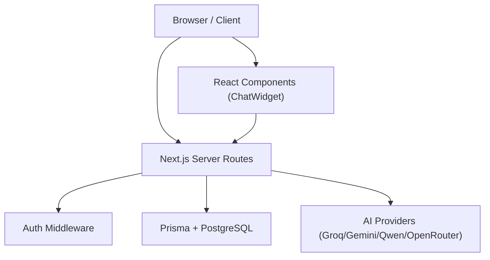
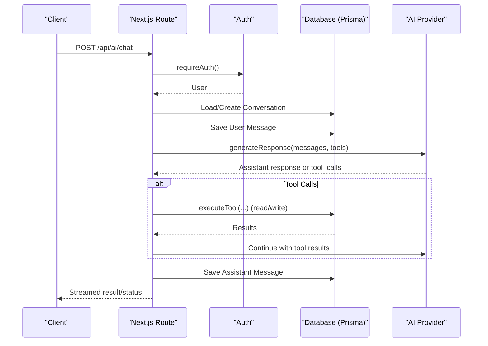
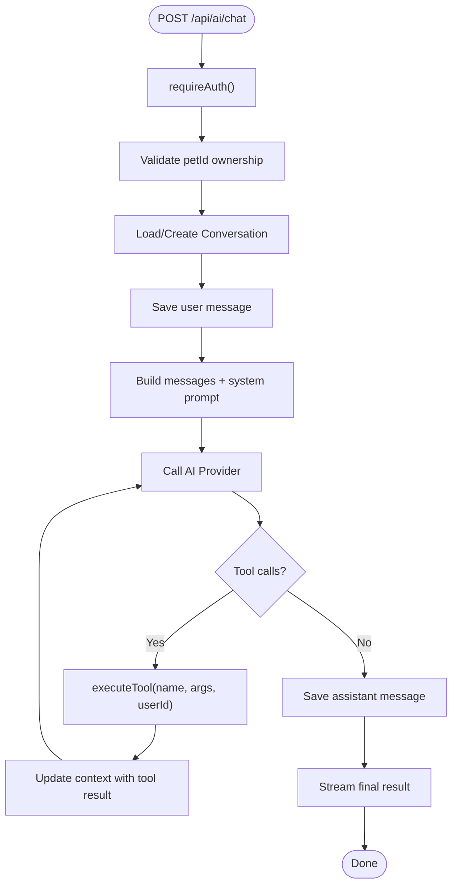
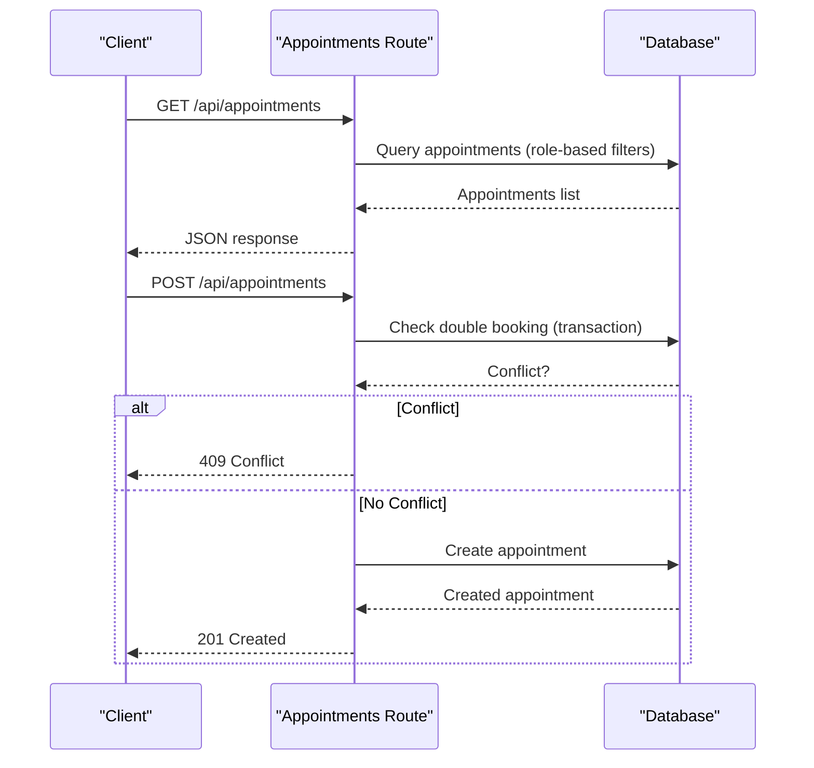
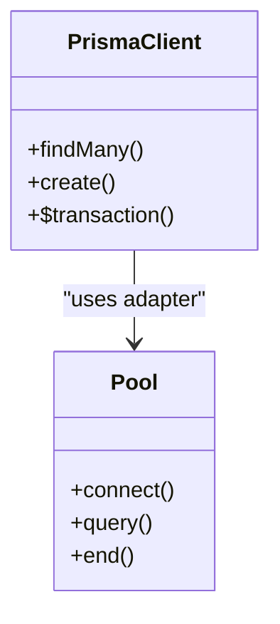
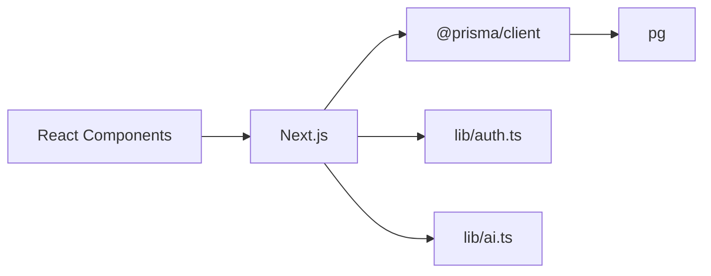

# Monitoring & Profiling Tools

<cite>
**Referenced Files in This Document**
- [package.json](file://package.json)
- [lib/db.ts](file://lib/db.ts)
- [lib/ai.ts](file://lib/ai.ts)
- [app/api/ai/chat/route.ts](file://app/api/ai/chat/route.ts)
- [app/api/appointments/route.ts](file://app/api/appointments/route.ts)
- [prisma/schema.prisma](file://prisma/schema.prisma)
- [lib/auth.ts](file://lib/auth.ts)
- [app/components/ChatWidget.tsx](file://app/components/ChatWidget.tsx)
- [next.config.ts](file://next.config.ts)
</cite>

## Table of Contents
1. [Introduction](#introduction)
2. [Project Structure](#project-structure)
3. [Core Components](#core-components)
4. [Architecture Overview](#architecture-overview)
5. [Detailed Component Analysis](#detailed-component-analysis)
6. [Dependency Analysis](#dependency-analysis)
7. [Performance Considerations](#performance-considerations)
8. [Troubleshooting Guide](#troubleshooting-guide)
9. [Conclusion](#conclusion)
10. [Appendices](#appendices)

## Introduction
This document provides comprehensive monitoring and profiling guidelines for the PETIVA Pet Healthcare Ecosystem. It focuses on performance monitoring tools and techniques to identify bottlenecks in pet health queries, appointment scheduling workflows, and AI chat responses. It also covers profiling strategies for React components, database queries, and API endpoints; logging best practices for tracking performance metrics, error rates, and user experience indicators; real-time monitoring setup for production; alerting configurations for performance degradation; debugging tools and techniques for diagnosing slow pet health record access, appointment conflicts, and AI service latency; and guidance for setting up APM solutions and custom performance dashboards.

## Project Structure
The application is a Next.js app with server routes under app/api, Prisma-managed PostgreSQL data, and React UI components. Key areas relevant to monitoring:
- API routes for AI chat and appointments
- Database layer via Prisma with connection pooling
- Authentication middleware used across protected routes
- React ChatWidget for client-side interactions

**Diagram sources**
- [app/api/ai/chat/route.ts:1-347](file://app/api/ai/chat/route.ts#L1-L347)
- [app/api/appointments/route.ts:1-143](file://app/api/appointments/route.ts#L1-L143)
- [lib/db.ts:1-33](file://lib/db.ts#L1-L33)
- [lib/ai.ts:1-423](file://lib/ai.ts#L1-L423)
- [lib/auth.ts:1-125](file://lib/auth.ts#L1-L125)
- [app/components/ChatWidget.tsx:1-149](file://app/components/ChatWidget.tsx#L1-L149)

**Section sources**
- [package.json:1-35](file://package.json#L1-L35)
- [next.config.ts:1-8](file://next.config.ts#L1-L8)

## Core Components
- AI Chat API: Handles conversation persistence, tool execution, streaming responses, and provider selection/fallback.
- Appointments API: Retrieves and creates appointments with authorization and conflict checks.
- Database Layer: Prisma client with connection pooling and environment-specific configuration.
- Authentication: Session-based auth with cookie handling and role enforcement.
- React ChatWidget: Client-side chat UI that calls backend APIs and renders messages.

**Section sources**
- [app/api/ai/chat/route.ts:1-347](file://app/api/ai/chat/route.ts#L1-L347)
- [app/api/appointments/route.ts:1-143](file://app/api/appointments/route.ts#L1-L143)
- [lib/db.ts:1-33](file://lib/db.ts#L1-L33)
- [lib/auth.ts:1-125](file://lib/auth.ts#L1-L125)
- [app/components/ChatWidget.tsx:1-149](file://app/components/ChatWidget.tsx#L1-L149)

## Architecture Overview
End-to-end flow for AI chat and appointment booking, highlighting monitoring points:

**Diagram sources**
- [app/api/ai/chat/route.ts:68-347](file://app/api/ai/chat/route.ts#L68-L347)
- [lib/ai.ts:105-139](file://lib/ai.ts#L105-L139)
- [lib/ai.ts:236-423](file://lib/ai.ts#L236-L423)
- [lib/auth.ts:109-115](file://lib/auth.ts#L109-L115)
- [lib/db.ts:1-33](file://lib/db.ts#L1-L33)

## Detailed Component Analysis

### AI Chat Endpoint (/api/ai/chat)
Responsibilities:
- Authenticate user and validate pet ownership
- Persist conversation headers and messages
- Build context with system instructions and recent messages
- Call AI provider(s), handle tool calls, stream status/result chunks
- Persist assistant responses

Monitoring and profiling focus:
- Measure total request duration, time spent in each step (auth, DB reads/writes, AI provider call, tool execution)
- Track AI provider selection and fallback events
- Log tool names and outcomes for observability
- Capture error codes and messages consistently

**Diagram sources**
- [app/api/ai/chat/route.ts:68-347](file://app/api/ai/chat/route.ts#L68-L347)
- [lib/ai.ts:236-423](file://lib/ai.ts#L236-L423)

**Section sources**
- [app/api/ai/chat/route.ts:1-347](file://app/api/ai/chat/route.ts#L1-L347)
- [lib/ai.ts:1-423](file://lib/ai.ts#L1-L423)

### Appointments API (/api/appointments)
Responsibilities:
- Retrieve appointments based on user role (pet owner, veterinarian, clinic admin)
- Create new appointments with authorization and double-booking prevention using transactions

Monitoring and profiling focus:
- Measure query times per role branch
- Monitor transaction contention and conflict rate
- Track success/error rates by operation

**Diagram sources**
- [app/api/appointments/route.ts:1-143](file://app/api/appointments/route.ts#L1-L143)

**Section sources**
- [app/api/appointments/route.ts:1-143](file://app/api/appointments/route.ts#L1-L143)

### Database Layer (Prisma + PostgreSQL)
Responsibilities:
- Manage connection pool and Prisma client instance
- Provide typed ORM for all data operations

Monitoring and profiling focus:
- Instrument connection pool metrics (active/idle connections, queue length)
- Profile slow queries via Prisma query logging and SQL-level analysis
- Ensure indexes are utilized for frequent filters (e.g., vetId+dateTime, ownerId, petId)

**Diagram sources**
- [lib/db.ts:1-33](file://lib/db.ts#L1-L33)

**Section sources**
- [lib/db.ts:1-33](file://lib/db.ts#L1-L33)
- [prisma/schema.prisma:164-182](file://prisma/schema.prisma#L164-L182)

### Authentication Middleware
Responsibilities:
- Validate sessions, manage cookies, enforce roles

Monitoring and profiling focus:
- Track session validation latency
- Log failed authentication attempts and reasons

**Section sources**
- [lib/auth.ts:1-125](file://lib/auth.ts#L1-L125)

### React ChatWidget
Responsibilities:
- Render chat UI, send messages, display loading states

Monitoring and profiling focus:
- Measure client-side network latency and render performance
- Track user interactions (send count, errors)
- Use browser performance APIs to profile re-renders and markdown rendering

**Section sources**
- [app/components/ChatWidget.tsx:1-149](file://app/components/ChatWidget.tsx#L1-L149)

## Dependency Analysis
Key runtime dependencies and their roles:
- Next.js: Framework for server routes and SSR/CSR
- Prisma Client + PostgreSQL Adapter: Data access and connection pooling
- pg: Underlying Postgres driver
- argon2: Password hashing
- google-auth-library: OAuth flows (if used)
- react-markdown: Markdown rendering in UI

**Diagram sources**
- [package.json:11-22](file://package.json#L11-L22)
- [lib/db.ts:1-33](file://lib/db.ts#L1-L33)
- [lib/auth.ts:1-125](file://lib/auth.ts#L1-L125)
- [lib/ai.ts:1-423](file://lib/ai.ts#L1-L423)

**Section sources**
- [package.json:1-35](file://package.json#L1-L35)

## Performance Considerations
- AI Chat Latency
  - Profile end-to-end request time and breakdown per phase (auth, DB, AI provider, tool execution).
  - Add timing logs around critical sections in the chat route and AI provider calls.
  - Monitor provider fallback frequency and error rates.
- Database Queries
  - Enable Prisma query logging in development and structured logging in production.
  - Verify index usage for high-frequency filters (vetId+dateTime, ownerId, petId).
  - Use EXPLAIN ANALYZE for slow queries identified via logs.
- Appointment Conflicts
  - Track conflict rate and transaction wait times.
  - Consider optimistic concurrency or backoff strategies if contention increases.
- React Components
  - Profile component render cycles and markdown parsing overhead.
  - Debounce heavy operations and avoid unnecessary re-renders.
- Connection Pooling
  - Monitor pool size, active connections, and queue depth in production.
  - Tune pool settings based on workload and database capacity.

[No sources needed since this section provides general guidance]

## Troubleshooting Guide
Common issues and diagnostic steps:
- Slow pet health record access
  - Identify slow queries via Prisma logs and database slow query logs.
  - Validate indexes on MedicalRecordVersion(recordId, isCurrent) and related tables.
  - Reduce payload sizes by selecting only necessary fields.
- Appointment conflicts
  - Inspect conflict responses and timestamps to detect race conditions.
  - Review transaction boundaries and locking behavior.
- AI service latency
  - Log provider selection and fallback events.
  - Measure external API latency and error rates; implement retries with exponential backoff where appropriate.
- Authentication failures
  - Check session expiration and cookie configuration.
  - Log invalid token scenarios and user agent details for context.

**Section sources**
- [app/api/ai/chat/route.ts:53-65](file://app/api/ai/chat/route.ts#L53-L65)
- [app/api/ai/chat/route.ts:317-345](file://app/api/ai/chat/route.ts#L317-L345)
- [app/api/appointments/route.ts:93-110](file://app/api/appointments/route.ts#L93-L110)
- [lib/auth.ts:46-75](file://lib/auth.ts#L46-L75)

## Conclusion
Implementing robust monitoring and profiling across AI chat, appointments, and database layers will help identify bottlenecks, reduce latency, and improve reliability. Focus on structured logging, APM instrumentation, database query optimization, and client-side performance metrics to maintain a high-quality user experience.

[No sources needed since this section summarizes without analyzing specific files]

## Appendices

### Logging Best Practices
- Structured logs with consistent fields: timestamp, requestId, userId, endpoint, method, durationMs, statusCode, error, providerName, toolName.
- Separate logs for:
  - Request lifecycle (start/end)
  - Database queries (slow query threshold)
  - AI provider calls (latency, status, fallbacks)
  - Tool executions (inputs/outputs sanitized)
  - Errors (stack traces, context)
- Avoid logging sensitive data (passwords, tokens, personal info).

[No sources needed since this section provides general guidance]

### Real-Time Monitoring Setup for Production
- Metrics to collect:
  - API request rate, latency percentiles (p50/p95/p99), error rates
  - Database query latency and slow query counts
  - AI provider latency and error rates
  - Connection pool utilization
- Dashboards:
  - Overview: request volume, error rate, latency
  - AI: provider selection, fallback rate, tool execution stats
  - Database: query performance, index hit ratios, pool metrics
  - Frontend: page load, interaction latency, error rates
- Alerting thresholds:
  - Error rate > 1% sustained over 5 minutes
  - p95 latency > 2s for AI chat
  - Database slow queries > 10/min
  - AI provider error rate > 5%

[No sources needed since this section provides general guidance]

### Debugging Tools and Techniques
- Server-side:
  - Enable Prisma query logging in development; use structured logs in production.
  - Use request IDs to correlate logs across services.
  - Add timing spans around key operations in routes and providers.
- Client-side:
  - Use browser DevTools Network panel to measure fetch timings.
  - Use Performance tab to analyze re-renders and markdown rendering.
- Database:
  - Use EXPLAIN ANALYZE for suspected slow queries.
  - Monitor indexes and consider composite indexes for common filters.

**Section sources**
- [lib/db.ts:1-33](file://lib/db.ts#L1-L33)
- [app/api/ai/chat/route.ts:192-331](file://app/api/ai/chat/route.ts#L192-L331)
- [app/components/ChatWidget.tsx:21-53](file://app/components/ChatWidget.tsx#L21-L53)

### APM and Custom Dashboards
- APM integration:
  - Choose an APM solution compatible with Node.js/Next.js to auto-instrument HTTP requests, database calls, and external APIs.
  - Configure custom metrics for AI provider calls and tool executions.
- Custom dashboards:
  - Build dashboards for:
    - AI chat: request duration, tool usage, provider fallbacks
    - Appointments: creation latency, conflict rate
    - Database: query latency, pool metrics
    - Frontend: user-perceived latency, errors
- Alert rules:
  - Define SLOs and alerts for latency, error rates, and availability.

[No sources needed since this section provides general guidance]