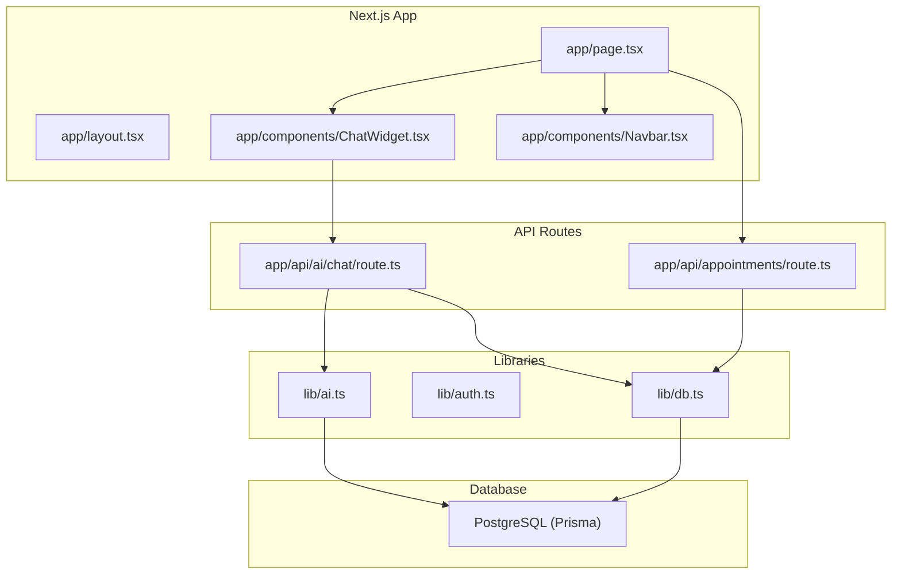
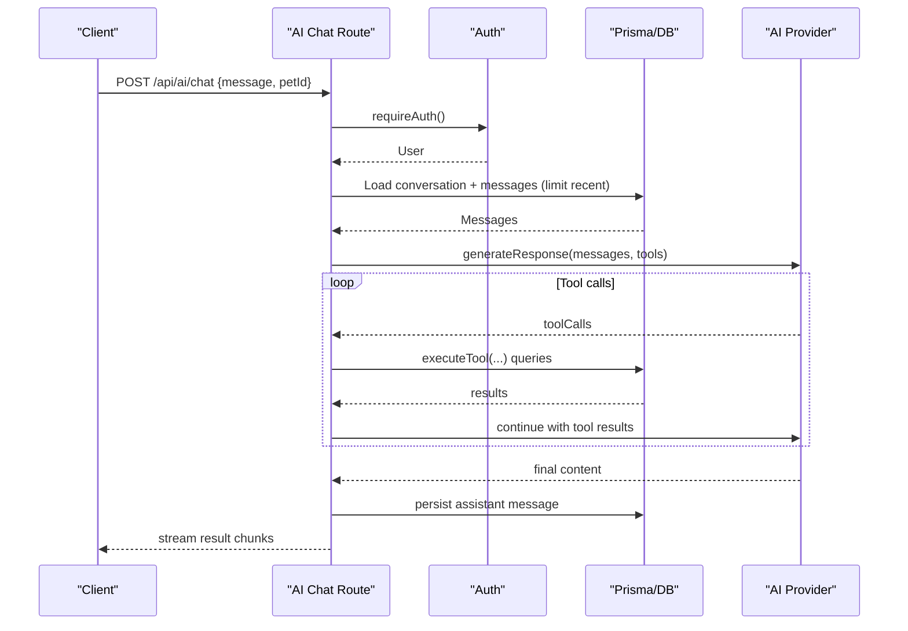
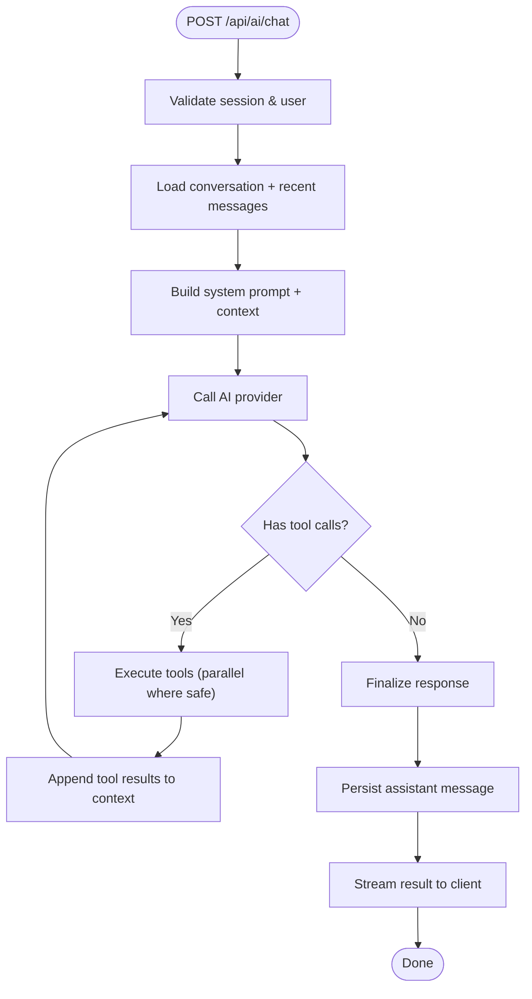
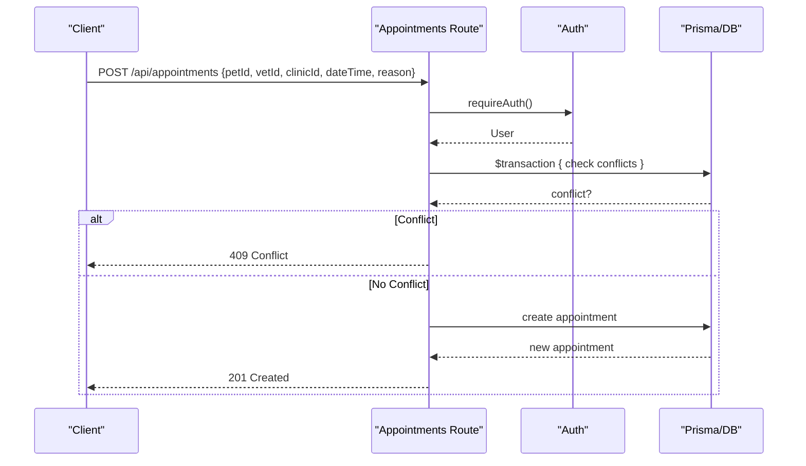
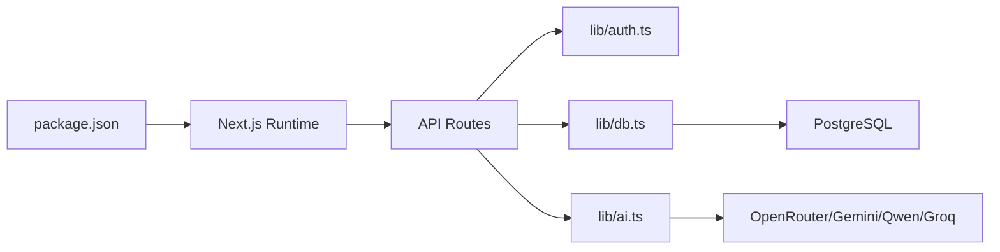

# Performance Optimization Guidelines

<cite>
**Referenced Files in This Document**
- [package.json](file://package.json)
- [next.config.ts](file://next.config.ts)
- [prisma/schema.prisma](file://prisma/schema.prisma)
- [lib/db.ts](file://lib/db.ts)
- [lib/ai.ts](file://lib/ai.ts)
- [app/api/ai/chat/route.ts](file://app/api/ai/chat/route.ts)
- [app/api/appointments/route.ts](file://app/api/appointments/route.ts)
- [app/components/ChatWidget.tsx](file://app/components/ChatWidget.tsx)
- [app/page.tsx](file://app/page.tsx)
- [app/layout.tsx](file://app/layout.tsx)
- [app/components/Navbar.tsx](file://app/components/Navbar.tsx)
- [lib/auth.ts](file://lib/auth.ts)
</cite>

## Table of Contents
1. Introduction
2. Project Structure
3. Core Components
4. Architecture Overview
5. Detailed Component Analysis
6. Dependency Analysis
7. Performance Considerations
8. Troubleshooting Guide
9. Conclusion

## Introduction
This document provides performance optimization guidelines for the PETIVA Pet Healthcare Ecosystem across React components, Next.js server routes, Prisma database access, API design, AI service integration, monitoring, and memory management. It focuses on practical techniques grounded in the current codebase to reduce latency, improve throughput, and maintain stability under load.

## Project Structure
The application is a Next.js app with:
- Server-side API routes under app/api for authentication, appointments, AI chat, clinics, pets, and vet discovery
- Client components under app/components for UI elements like ChatWidget and Navbar
- Database schema and migrations under prisma
- Shared libraries for DB connection, auth, and AI provider orchestration under lib

**Diagram sources**
- [app/page.tsx:1-223](file://app/page.tsx#L1-L223)
- [app/layout.tsx:1-16](file://app/layout.tsx#L1-L16)
- [app/components/ChatWidget.tsx:1-149](file://app/components/ChatWidget.tsx#L1-L149)
- [app/components/Navbar.tsx:1-49](file://app/components/Navbar.tsx#L1-L49)
- [app/api/ai/chat/route.ts:1-347](file://app/api/ai/chat/route.ts#L1-L347)
- [app/api/appointments/route.ts:1-143](file://app/api/appointments/route.ts#L1-L143)
- [lib/db.ts:1-33](file://lib/db.ts#L1-L33)
- [lib/auth.ts:1-125](file://lib/auth.ts#L1-L125)
- [lib/ai.ts:1-423](file://lib/ai.ts#L1-L423)

**Section sources**
- [package.json:1-35](file://package.json#L1-L35)
- [next.config.ts:1-8](file://next.config.ts#L1-L8)

## Core Components
Key runtime components that impact performance:
- AI chat streaming route: orchestrates conversation history retrieval, tool execution, and streaming responses
- Appointment CRUD route: enforces authorization, prevents double booking via transactions, and returns rich data
- Database client: manages connection pooling and Prisma instance lifecycle
- AI provider abstraction: selects provider, supports fallbacks, and defines tools for function calling
- Auth middleware: validates sessions, extends sliding expiration, and enforces roles

**Section sources**
- [app/api/ai/chat/route.ts:1-347](file://app/api/ai/chat/route.ts#L1-L347)
- [app/api/appointments/route.ts:1-143](file://app/api/appointments/route.ts#L1-L143)
- [lib/db.ts:1-33](file://lib/db.ts#L1-L33)
- [lib/ai.ts:1-423](file://lib/ai.ts#L1-L423)
- [lib/auth.ts:1-125](file://lib/auth.ts#L1-L125)

## Architecture Overview
The system uses Next.js serverless/server functions for APIs, Prisma over PostgreSQL for persistence, and an AI provider layer for LLM interactions. Streaming is used for AI chat to improve perceived latency.

**Diagram sources**
- [app/api/ai/chat/route.ts:68-347](file://app/api/ai/chat/route.ts#L68-L347)
- [lib/ai.ts:141-423](file://lib/ai.ts#L141-L423)
- [lib/auth.ts:99-125](file://lib/auth.ts#L99-L125)
- [lib/db.ts:1-33](file://lib/db.ts#L1-L33)

## Detailed Component Analysis

### AI Chat Streaming and Tool Execution
- Conversation loading limits context size by fetching only the most recent messages to control payload size and token usage.
- Tool execution is parallelized where possible using concurrent queries to assemble timelines efficiently.
- Streaming uses ReadableStream to send status updates and final results incrementally, improving responsiveness.
- Authorization checks ensure tenant isolation per pet and conversation ownership validation.

Optimization opportunities:
- Cache frequent read-only lookups (e.g., pet profile) within a single request using an in-process cache map keyed by id.
- Add request-level rate limiting or quotas around AI calls to protect external providers and manage costs.
- Paginate or truncate long timelines when not strictly needed by the UI.

**Diagram sources**
- [app/api/ai/chat/route.ts:68-347](file://app/api/ai/chat/route.ts#L68-L347)
- [lib/ai.ts:235-423](file://lib/ai.ts#L235-L423)

**Section sources**
- [app/api/ai/chat/route.ts:1-347](file://app/api/ai/chat/route.ts#L1-L347)
- [lib/ai.ts:1-423](file://lib/ai.ts#L1-L423)

### Appointment Scheduling API
- Enforces role-based queries to return appropriate appointment sets.
- Uses a transaction to prevent double bookings atomically.
- Returns enriched data via include/select patterns to minimize client-side mapping.

Optimization opportunities:
- Add pagination for large appointment lists to reduce payload sizes.
- Introduce caching for read-heavy endpoints (e.g., clinic schedules) with short TTLs.
- Validate timezones consistently server-side to avoid scheduling errors.

**Diagram sources**
- [app/api/appointments/route.ts:69-143](file://app/api/appointments/route.ts#L69-L143)
- [lib/auth.ts:99-125](file://lib/auth.ts#L99-L125)

**Section sources**
- [app/api/appointments/route.ts:1-143](file://app/api/appointments/route.ts#L1-L143)

### Database Connection Pooling and Schema Indexes
- Production uses a dedicated pg pool with PrismaPg adapter; development reuses global pool/client to avoid leaks during hot reloads.
- Schema includes indexes on frequently queried fields (e.g., Session.expiresAt, Appointment.vetId+dateTime, MedicalRecordVersion.recordId+isCurrent).

Optimization opportunities:
- Tune pool size based on workload and RDS capacity.
- Add composite indexes for common query filters (e.g., Appointment.ownerId + dateTime).
- Use select projections to limit returned columns for large tables.

**Section sources**
- [lib/db.ts:1-33](file://lib/db.ts#L1-L33)
- [prisma/schema.prisma:1-312](file://prisma/schema.prisma#L1-L312)

### React Component Optimization (ChatWidget and Page)
- ChatWidget maintains local state for messages and input, renders markdown via react-markdown, and posts to a public landing-chat endpoint.
- The home page dynamically loads Google Identity Services SDK and performs auth checks on mount.

Optimization opportunities:
- Memoize expensive computations and heavy components with React.memo and useMemo/useCallback where appropriate.
- Defer non-critical SDK loading (already done) and consider lazy-loading heavy sections.
- Avoid unnecessary re-renders by stabilizing props and splitting state into smaller components.

**Section sources**
- [app/components/ChatWidget.tsx:1-149](file://app/components/ChatWidget.tsx#L1-L149)
- [app/page.tsx:1-223](file://app/page.tsx#L1-L223)

## Dependency Analysis
High-level dependencies and their roles:
- Next.js routes depend on lib/auth for session validation and lib/db for data access
- AI chat route depends on lib/ai for provider selection and tool execution
- Appointment route depends on lib/auth and lib/db for authorization and transactions
- Database client configures connection pooling and Prisma adapter

**Diagram sources**
- [package.json:11-22](file://package.json#L11-L22)
- [app/api/ai/chat/route.ts:1-347](file://app/api/ai/chat/route.ts#L1-L347)
- [app/api/appointments/route.ts:1-143](file://app/api/appointments/route.ts#L1-L143)
- [lib/auth.ts:1-125](file://lib/auth.ts#L1-L125)
- [lib/db.ts:1-33](file://lib/db.ts#L1-L33)
- [lib/ai.ts:1-423](file://lib/ai.ts#L1-L423)

**Section sources**
- [package.json:1-35](file://package.json#L1-L35)

## Performance Considerations

### React Component Optimization Techniques
- Memoization:
  - Wrap stable, expensive components with React.memo to skip re-renders when props are unchanged.
  - Use useMemo for derived data and useCallback for event handlers passed to child components to stabilize references.
- Lazy Loading:
  - Dynamically import heavy third-party libraries (e.g., markdown renderers) at component level if not used immediately.
  - Code-split pages and features to reduce initial bundle size.
- Efficient Re-rendering:
  - Split large components into smaller units to limit re-render scope.
  - Keep state close to where it’s used; lift state minimally.
  - Prefer key-based list rendering with stable identifiers.

[No sources needed since this section provides general guidance]

### Next.js Performance Optimizations
- Server-Side Rendering Benefits:
  - Use server components/pages where possible to fetch data on the server and reduce client work.
  - Leverage metadata and static generation for marketing pages to improve TTFB.
- Image Optimization:
  - Use next/image for automatic resizing, compression, and modern formats.
  - Provide multiple sizes and lazy-load offscreen images.
- Bundle Size Reduction:
  - Remove unused dependencies and tree-shake effectively.
  - Avoid importing heavy libraries on every page; use dynamic imports.
  - Configure Next.js optimizations (compression, minification) via next.config.ts.

[No sources needed since this section provides general guidance]

### Database Query Optimization (Prisma)
- Include/Select Patterns:
  - Use select to fetch only required fields to reduce payload and memory.
  - Use include sparingly; prefer separate queries when relationships are large.
- Connection Pooling:
  - Ensure production uses a configured pg pool with PrismaPg adapter to reuse connections.
- Indexing Strategies:
  - Add indexes on foreign keys and high-cardinality filter fields.
  - Use composite indexes for common multi-column filters (e.g., ownerId + dateTime).
- Transactions:
  - Use $transaction for write operations requiring consistency (e.g., double-booking prevention).

**Section sources**
- [lib/db.ts:1-33](file://lib/db.ts#L1-L33)
- [prisma/schema.prisma:1-312](file://prisma/schema.prisma#L1-L312)
- [app/api/appointments/route.ts:93-103](file://app/api/appointments/route.ts#L93-L103)

### API Performance Improvements
- Response Caching:
  - Implement server-side caching for read-only endpoints (e.g., vet discovery, clinic profiles) with short TTLs.
  - Use HTTP caching headers appropriately for static assets and immutable resources.
- Pagination:
  - Add cursor or offset-based pagination for large datasets (appointments, medical records).
  - Return total counts and meta information for UI controls.
- Rate Limiting:
  - Apply rate limits per IP/user on sensitive endpoints (auth, AI chat) to mitigate abuse.
  - Use exponential backoff and retry logic for external AI calls.

[No sources needed since this section provides general guidance]

### AI Service Optimization
- Latency Reduction:
  - Stream responses to provide immediate feedback and partial results.
  - Limit context window by truncating older messages and summarizing history when necessary.
- Quota Management:
  - Track usage per user/session and enforce quotas or throttling.
  - Implement fallback providers to handle outages gracefully.
- Tool Efficiency:
  - Batch independent tool calls where safe to reduce round trips.
  - Cache tool results within a request scope to avoid redundant queries.

**Section sources**
- [app/api/ai/chat/route.ts:137-143](file://app/api/ai/chat/route.ts#L137-L143)
- [lib/ai.ts:112-139](file://lib/ai.ts#L112-L139)

### Monitoring and Profiling
- Identify bottlenecks in:
  - Pet health queries: measure DB query times and optimize with indexes/selects.
  - Appointment scheduling: monitor transaction contention and lock waits.
  - AI chat responses: track provider latency, token usage, and error rates.
- Tools:
  - Use Next.js built-in metrics and logs.
  - Instrument custom metrics for API durations, DB query durations, and AI call latencies.
  - Set up alerts for error spikes and slow endpoints.

[No sources needed since this section provides general guidance]

### Memory Management and Garbage Collection
- Long-running Operations:
  - Avoid holding large objects in closures or global scopes beyond request lifetime.
  - Process streams incrementally and release buffers promptly.
- Request Isolation:
  - Ensure per-request caches are cleared after response completion.
  - Avoid storing large payloads in React state unnecessarily; paginate or virtualize lists.
- Node.js GC:
  - Monitor heap usage and adjust max-old-space-size if needed.
  - Profile with Node.js profiler to detect memory leaks in custom utilities.

[No sources needed since this section provides general guidance]

## Troubleshooting Guide
Common issues and mitigations:
- Authentication failures:
  - Verify session cookie presence and validity; ensure secure flags in production.
  - Check session expiration and sliding window extension logic.
- Double booking conflicts:
  - Confirm transactional checks run before creating appointments.
  - Inspect indexes on vetId and dateTime to speed up conflict detection.
- AI chat errors:
  - Validate provider configuration and API keys.
  - Handle malformed tool arguments and missing parameters gracefully.
- Database performance:
  - Review slow queries and add appropriate indexes.
  - Ensure connection pool sizing matches workload.

**Section sources**
- [lib/auth.ts:46-75](file://lib/auth.ts#L46-L75)
- [app/api/appointments/route.ts:93-103](file://app/api/appointments/route.ts#L93-L103)
- [app/api/ai/chat/route.ts:274-289](file://app/api/ai/chat/route.ts#L274-L289)
- [lib/db.ts:10-29](file://lib/db.ts#L10-L29)

## Conclusion
By applying memoization and lazy loading in React, leveraging Next.js SSR and image optimization, optimizing Prisma queries with selective includes and proper indexing, implementing robust API caching and pagination, and tuning AI service interactions with streaming and fallbacks, PETIVA can achieve lower latency, higher throughput, and better scalability. Continuous monitoring and profiling will help identify emerging bottlenecks and guide further improvements.