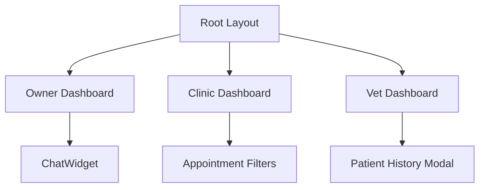
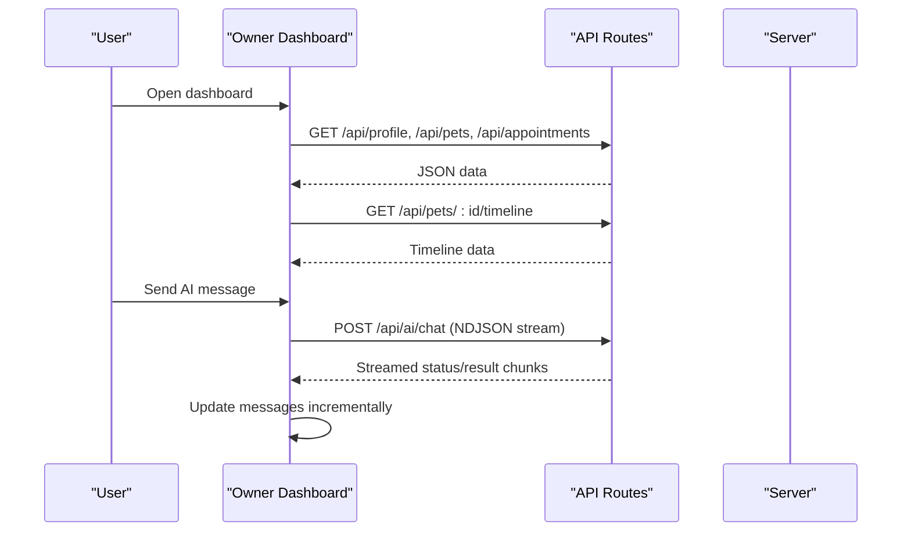
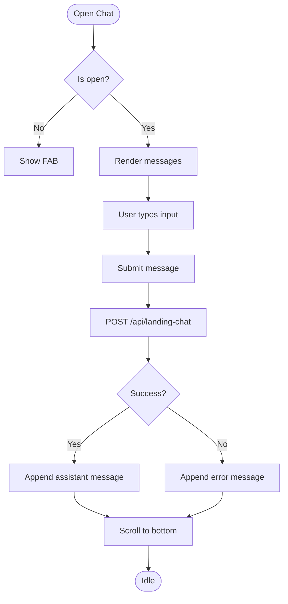
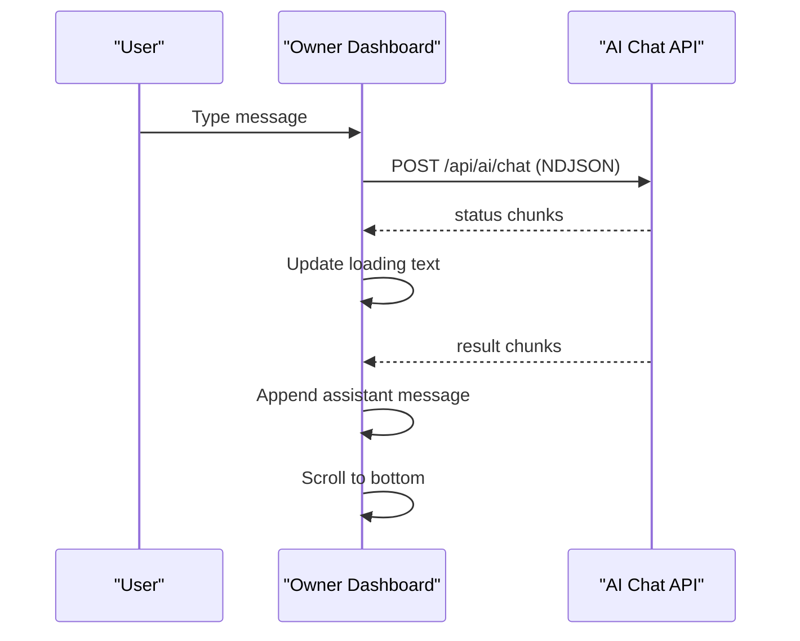
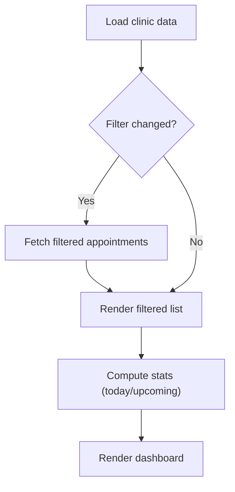
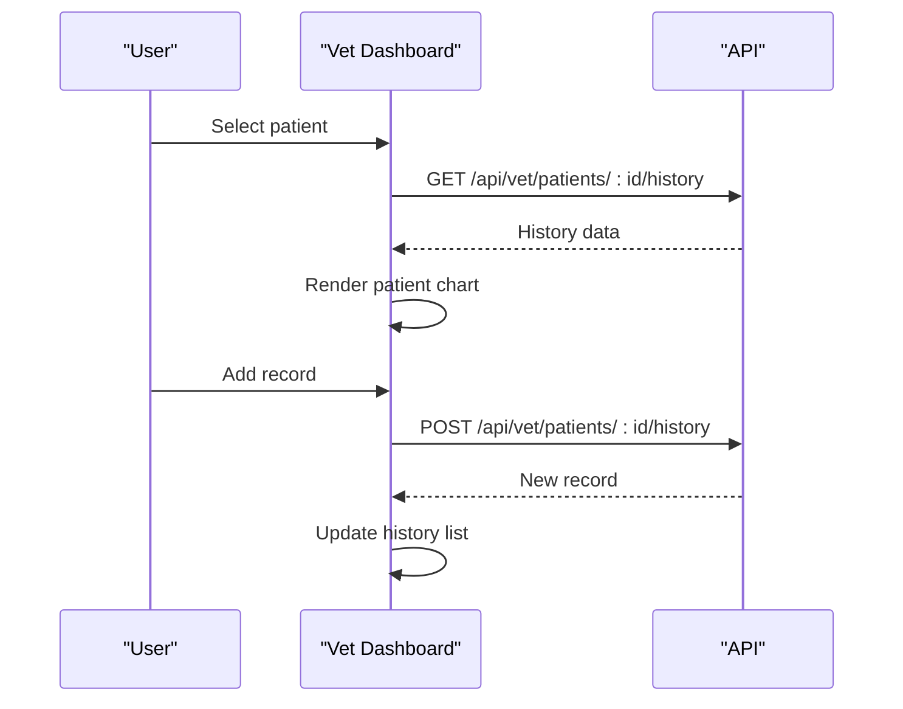
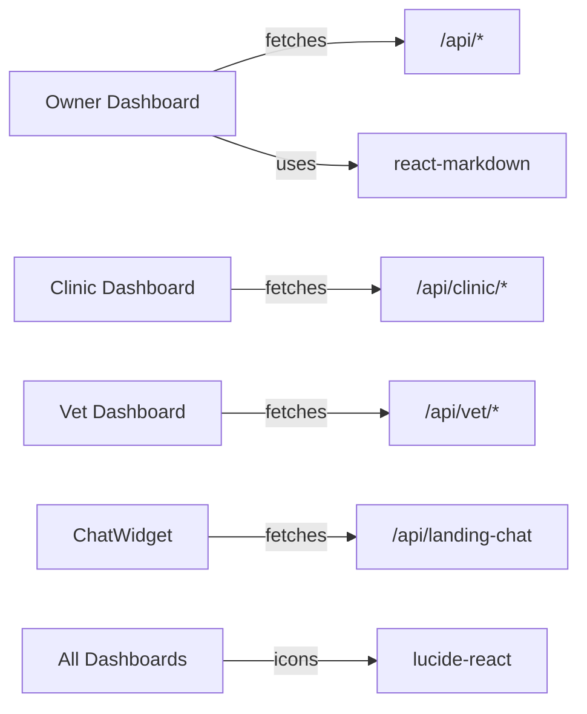

# React Component Optimization

<cite>
**Referenced Files in This Document**
- [ChatWidget.tsx](file://app/components/ChatWidget.tsx)
- [Dashboard page (Owner)](file://app/dashboard/page.tsx)
- [Clinic Dashboard page](file://app/clinic/dashboard/page.tsx)
- [Vet Dashboard page](file://app/vet/dashboard/page.tsx)
- [Navbar.tsx](file://app/components/Navbar.tsx)
- [Root layout](file://app/layout.tsx)
- [Next config](file://next.config.ts)
</cite>

## Table of Contents
1. Introduction
2. Project Structure
3. Core Components
4. Architecture Overview
5. Detailed Component Analysis
6. Dependency Analysis
7. Performance Considerations
8. Troubleshooting Guide
9. Conclusion
10. Appendices

## Introduction
This document provides practical React component optimization guidelines tailored to the PETIVA Pet Healthcare Ecosystem. It focuses on memoization with React.memo, useMemo, and useCallback; lazy loading with React.lazy and Suspense for code splitting; and efficient re-rendering patterns such as stable keys, state management best practices, and avoiding unnecessary re-renders across pet owner dashboards, veterinarian dashboards, and clinic management interfaces. Real examples are grounded in the actual components present in the repository.

## Project Structure
The application is a Next.js app with client-side pages for different roles:
- Owner dashboard: complex UI with pets, timeline, appointments, and AI chat
- Clinic dashboard: appointment filtering, vet listing, profile editing
- Vet dashboard: patient charts, medical records, appointment actions
- Shared UI: ChatWidget used on landing and other surfaces
- Root layout and Next configuration

**Diagram sources**
- [Root layout](file://app/layout.tsx:1-16)
- [Dashboard page (Owner)](file://app/dashboard/page.tsx:1-120)
- [Clinic Dashboard page](file://app/clinic/dashboard/page.tsx:1-120)
- [Vet Dashboard page](file://app/vet/dashboard/page.tsx:1-120)
- [ChatWidget.tsx](file://app/components/ChatWidget.tsx:1-60)

**Section sources**
- [Root layout](file://app/layout.tsx:1-16)
- [Next config](file://next.config.ts:1-8)

## Core Components
Key areas where optimization matters most:
- AI chat interactions (streaming responses, message lists)
- Large dashboards with many lists and computed stats
- Modals and overlays that render heavy content
- Repeated list rendering with dynamic keys and expensive computations

Optimization targets:
- Memoize derived data and callbacks to prevent re-computation and re-bindings
- Code-split heavy views (e.g., medical record viewers, appointment calendars)
- Stabilize keys and avoid inline object/function creation inside render
- Defer non-critical work and use streaming where possible

**Section sources**
- [Dashboard page (Owner)](file://app/dashboard/page.tsx:1-120)
- [Clinic Dashboard page](file://app/clinic/dashboard/page.tsx:1-120)
- [Vet Dashboard page](file://app/vet/dashboard/page.tsx:1-120)
- [ChatWidget.tsx](file://app/components/ChatWidget.tsx:1-60)

## Architecture Overview
The dashboards follow a consistent pattern:
- Fetch initial data on mount via useEffect
- Manage local UI state (tabs, modals, filters)
- Render conditional sections based on active tab or selection
- Interact with APIs for mutations and streaming updates

**Diagram sources**
- [Dashboard page (Owner)](file://app/dashboard/page.tsx:45-122)
- [Dashboard page (Owner)](file://app/dashboard/page.tsx:283-352)

## Detailed Component Analysis

### AI Chat Widget (Landing)
Current behavior:
- Maintains open/close state, messages, input, and loading
- Sends messages to /api/landing-chat and renders markdown responses
- Auto-scrolls to bottom on message changes

Optimization opportunities:
- Wrap the component with React.memo to avoid re-renders when props do not change
- Use useMemo for the rendered message list to avoid re-parsing markdown unnecessarily
- Use useCallback for handleSend to stabilize event handlers passed down if extracted
- Avoid creating new objects inline during render; extract styles or classes into constants if needed

**Diagram sources**
- [ChatWidget.tsx](file://app/components/ChatWidget.tsx:8-53)
- [ChatWidget.tsx](file://app/components/ChatWidget.tsx:83-119)

Practical steps:
- Memoize the component: wrap with React.memo
- Memoize derived values: e.g., formatted messages or markdown content per message
- Stabilize handlers: wrap send logic with useCallback
- Ensure stable keys: use unique IDs for messages rather than array indices

**Section sources**
- [ChatWidget.tsx](file://app/components/ChatWidget.tsx:8-53)
- [ChatWidget.tsx](file://app/components/ChatWidget.tsx:83-119)

### Owner Dashboard
Current behavior:
- Loads profile, pets, timeline, appointments, discovery vets
- Manages tabs, forms, and AI chat with streaming NDJSON
- Computes upcoming appointment and health overview metrics inline

Optimization opportunities:
- Extract sub-components for each tab (pets, appointments, AI, profile) and memoize them
- Memoize derived data:
  - Upcoming appointment selection
  - Health overview counts (vaccinations, medications, allergies, last visit)
  - Timeline slices for recent activity
- Stabilize callbacks:
  - handleSelectPet
  - handleUpdateProfile, handleAddPet, handleEditPet, handleDeletePet
  - handleBookAppt, handleCancelAppt
  - handleSendChatMessage (already handles streaming; ensure stable references)
- Improve keys:
  - Use pet.id, appt.id, timeline item id for stable identity
- Lazy load heavy sections:
  - Medical record viewer or detailed pet profile modal
  - Appointment calendar view

**Diagram sources**
- [Dashboard page (Owner)](file://app/dashboard/page.tsx:283-352)

Practical steps:
- Create subcomponents: PetCard, AppointmentCard, TimelineItem, AIChatPanel
- Apply React.memo to these subcomponents
- Use useMemo for:
  - upcomingAppt
  - healthOverview counts
  - filtered timeline slices
- Use useCallback for all event handlers passed to child components
- Consider React.lazy + Suspense for:
  - Detailed pet profile modal
  - Full appointment calendar

**Section sources**
- [Dashboard page (Owner)](file://app/dashboard/page.tsx:45-122)
- [Dashboard page (Owner)](file://app/dashboard/page.tsx:380-719)
- [Dashboard page (Owner)](file://app/dashboard/page.tsx:283-352)

### Clinic Dashboard
Current behavior:
- Loads clinic info, vets, appointments
- Filters appointments by status
- Displays today’s appointments and vet listings
- Profile editing form

Optimization opportunities:
- Memoize derived stats:
  - todayAppts
  - upcomingApptsCount
- Memoize filtered appointments after filter change
- Extract subcomponents:
  - AppointmentRow
  - VetCard
  - StatsCard
- Stabilize callbacks:
  - handleFilterChange
  - handleUpdateProfile
- Lazy load:
  - Appointment details modal
  - Vet management interface

**Diagram sources**
- [Clinic Dashboard page](file://app/clinic/dashboard/page.tsx:38-99)
- [Clinic Dashboard page](file://app/clinic/dashboard/page.tsx:151-155)

Practical steps:
- Wrap subcomponents with React.memo
- Use useMemo for todayAppts, upcomingApptsCount, and filtered results
- Use useCallback for handleFilterChange and handleUpdateProfile
- Ensure stable keys for rows and cards

**Section sources**
- [Clinic Dashboard page](file://app/clinic/dashboard/page.tsx:38-99)
- [Clinic Dashboard page](file://app/clinic/dashboard/page.tsx:151-155)
- [Clinic Dashboard page](file://app/clinic/dashboard/page.tsx:305-453)

### Vet Dashboard
Current behavior:
- Loads vet profile, clinics, patients, appointments
- Selects patient and loads history
- Adds medical records and updates appointment statuses

Optimization opportunities:
- Memoize derived stats:
  - todayAppts
  - upcomingApptsCount
- Memoize patient history sections:
  - medicalRecords, vaccinations, medications, allergies, conditions, metrics
- Extract subcomponents:
  - PatientCard
  - RecordEntryForm
  - AppointmentRow
- Stabilize callbacks:
  - handleSelectPatient
  - handleUpdateProfile
  - handleAddRecord
  - handleUpdateApptStatus
- Lazy load:
  - Patient chart modal
  - Health records viewer

**Diagram sources**
- [Vet Dashboard page](file://app/vet/dashboard/page.tsx:86-108)
- [Vet Dashboard page](file://app/vet/dashboard/page.tsx:134-160)

Practical steps:
- Wrap subcomponents with React.memo
- Use useMemo for derived stats and history sections
- Use useCallback for all handlers
- Ensure stable keys for patient cards and records

**Section sources**
- [Vet Dashboard page](file://app/vet/dashboard/page.tsx:42-84)
- [Vet Dashboard page](file://app/vet/dashboard/page.tsx:211-215)
- [Vet Dashboard page](file://app/vet/dashboard/page.tsx:86-108)
- [Vet Dashboard page](file://app/vet/dashboard/page.tsx:134-160)

### Navbar
Current behavior:
- Simple header with logo and navigation links
- Auth buttons trigger login/register flows

Optimization opportunities:
- Wrap with React.memo since it receives stable function props
- Avoid inline functions in parent if passed down; memoize them at source

**Section sources**
- [Navbar.tsx](file://app/components/Navbar.tsx:1-49)

## Dependency Analysis
Components depend on:
- Next.js routing and server routes for data fetching
- External libraries: lucide-react icons, react-markdown
- State management within components (no global store currently)

**Diagram sources**
- [Dashboard page (Owner)](file://app/dashboard/page.tsx:45-122)
- [Clinic Dashboard page](file://app/clinic/dashboard/page.tsx:38-99)
- [Vet Dashboard page](file://app/vet/dashboard/page.tsx:42-84)
- [ChatWidget.tsx](file://app/components/ChatWidget.tsx:30-53)

**Section sources**
- [Dashboard page (Owner)](file://app/dashboard/page.tsx:45-122)
- [Clinic Dashboard page](file://app/clinic/dashboard/page.tsx:38-99)
- [Vet Dashboard page](file://app/vet/dashboard/page.tsx:42-84)
- [ChatWidget.tsx](file://app/components/ChatWidget.tsx:30-53)

## Performance Considerations
Guidelines applied to PETIVA components:
- Memoization
  - Use React.memo for pure presentational components (e.g., ChatWidget, subcomponents you extract)
  - Use useMemo for expensive computations:
    - Upcoming appointments
    - Health overview counts
    - Filtered appointment lists
    - History sections in vet dashboard
  - Use useCallback for event handlers passed to children to keep referential stability
- Keys
  - Always use stable, unique identifiers (pet.id, appt.id, record.id) instead of array indices
- Code splitting
  - Use React.lazy and Suspense for heavy views:
    - Medical record viewer
    - Appointment calendar
    - Detailed pet profile modal
  - Keep lightweight components loaded eagerly
- Streaming
  - The owner dashboard already streams AI responses; ensure incremental updates are minimal and stable
- Rendering
  - Avoid inline object/function creation in JSX; extract to constants or memoized values
  - Split large components into smaller, memoized pieces
- Network
  - Debounce search/filter inputs if applicable
  - Cache repeated queries using SWR/React Query if adopted later

[No sources needed since this section provides general guidance]

## Troubleshooting Guide
Common issues and fixes:
- Excessive re-renders
  - Symptom: Chat messages flicker or scroll jumps
  - Fix: Ensure stable keys for messages; memoize message rendering; avoid recreating arrays inline
- Slow dashboard load
  - Symptom: Long initial paint
  - Fix: Code split heavy sections; compute derived data with useMemo; defer non-critical fetches
- AI chat lag
  - Symptom: Delayed response updates
  - Fix: Process NDJSON chunks efficiently; update state minimally; avoid full re-renders of entire chat
- Incorrect list ordering
  - Symptom: Items jump around
  - Fix: Use stable ids as keys; avoid index-based keys

**Section sources**
- [ChatWidget.tsx](file://app/components/ChatWidget.tsx:83-119)
- [Dashboard page (Owner)](file://app/dashboard/page.tsx:283-352)

## Conclusion
By applying memoization, code splitting, and careful state management, PETIVA’s dashboards and chat interfaces can achieve smoother interactions and faster renders. Focus on extracting subcomponents, memoizing derived data and handlers, stabilizing keys, and deferring heavy work. These practices will improve performance across pet owner, veterinarian, and clinic workflows.

[No sources needed since this section summarizes without analyzing specific files]

## Appendices

### Practical Checklist for Each Component
- Identify expensive computations → wrap with useMemo
- Identify handlers passed to children → wrap with useCallback
- Identify pure UI blocks → wrap with React.memo
- Replace index keys with stable ids
- Code split heavy views with React.lazy + Suspense
- Validate streaming updates are incremental and minimal

[No sources needed since this section provides general guidance]