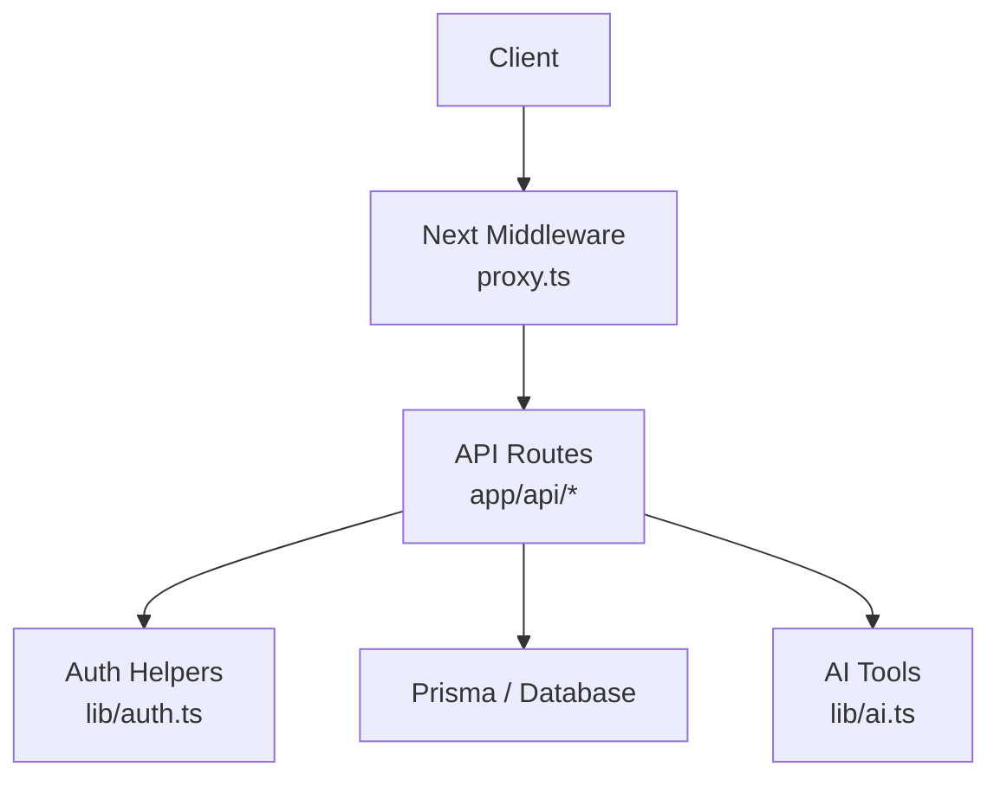
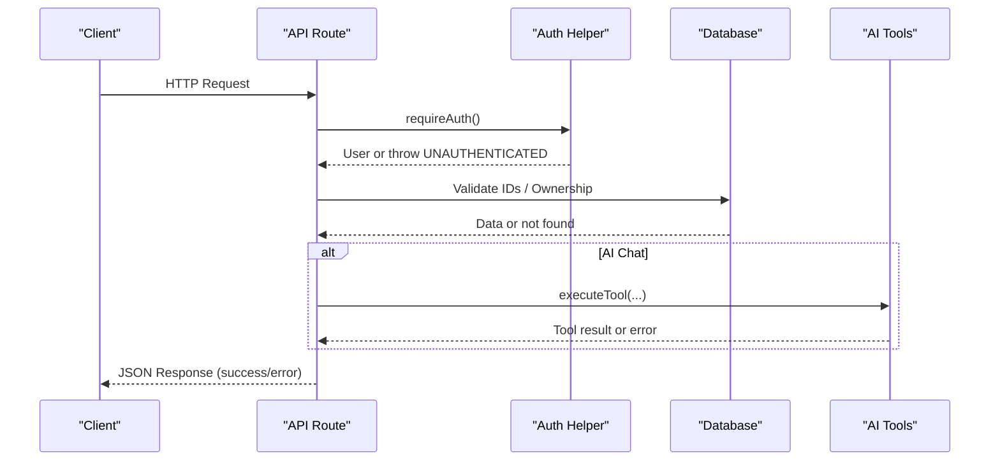
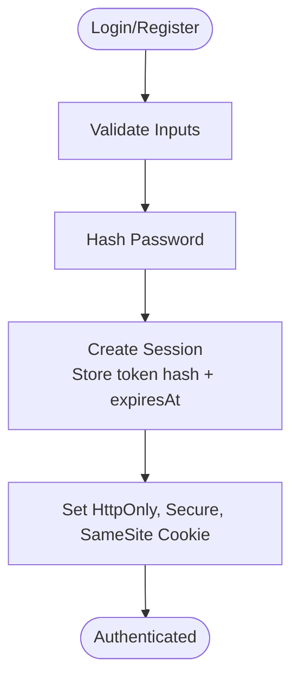
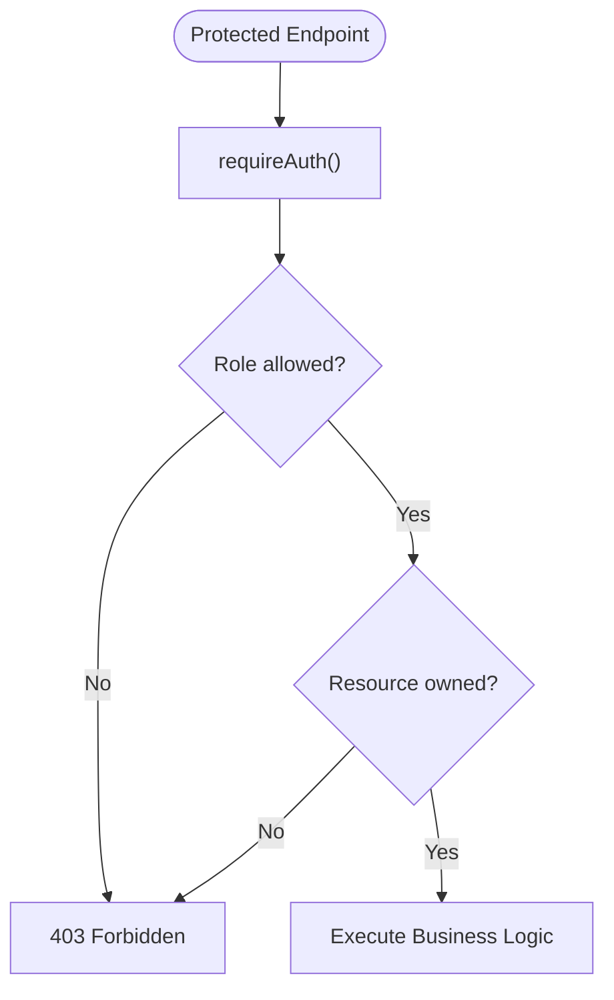
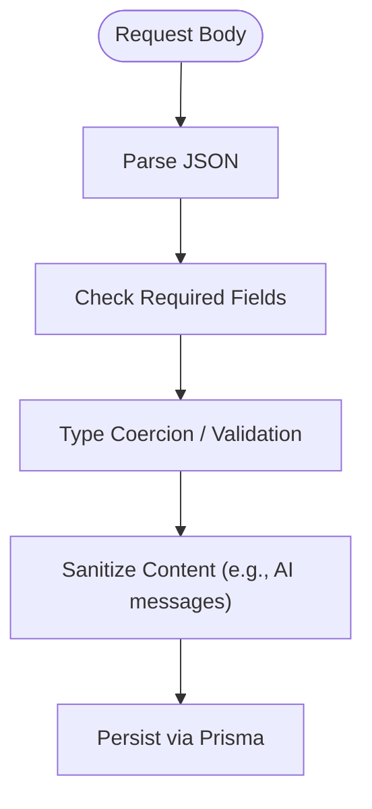
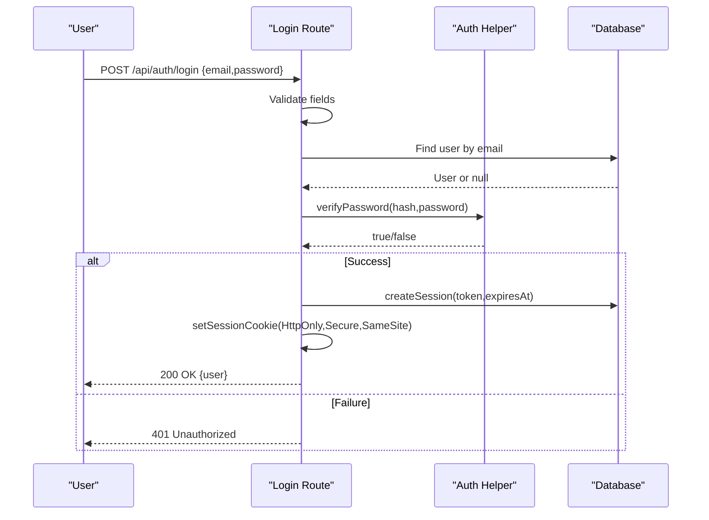
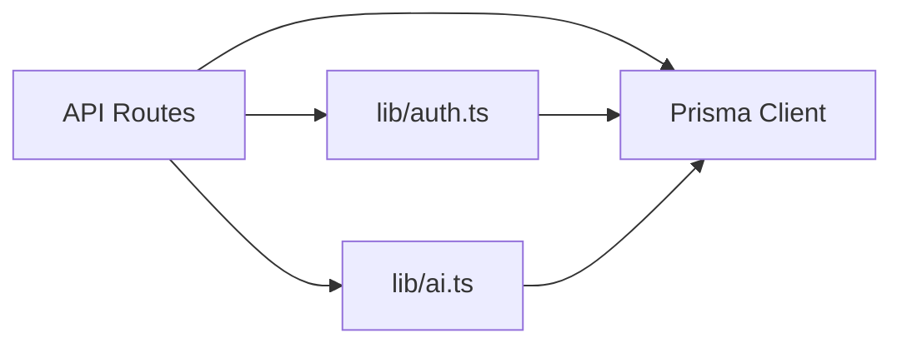

# API Security & Input Validation

<cite>
**Referenced Files in This Document**
- [next.config.ts](file://next.config.ts)
- [proxy.ts](file://proxy.ts)
- [lib/auth.ts](file://lib/auth.ts)
- [app/api/auth/login/route.ts](file://app/api/auth/login/route.ts)
- [app/api/auth/register/route.ts](file://app/api/auth/register/route.ts)
- [app/api/pets/route.ts](file://app/api/pets/route.ts)
- [app/api/pets/[petId]/route.ts](file://app/api/pets/[petId]/route.ts)
- [app/api/appointments/route.ts](file://app/api/appointments/route.ts)
- [app/api/ai/chat/route.ts](file://app/api/ai/chat/route.ts)
- [lib/ai.ts](file://lib/ai.ts)
- [docs/03-architecture/06-security.md](file://docs/03-architecture/06-security.md)
- [package.json](file://package.json)
</cite>

## Table of Contents
1. [Introduction](#introduction)
2. [Project Structure](#project-structure)
3. [Core Components](#core-components)
4. [Architecture Overview](#architecture-overview)
5. [Detailed Component Analysis](#detailed-component-analysis)
6. [Dependency Analysis](#dependency-analysis)
7. [Performance Considerations](#performance-considerations)
8. [Troubleshooting Guide](#troubleshooting-guide)
9. [Conclusion](#conclusion)

## Introduction
This document explains the API security and input validation practices implemented in PETIVA. It covers authentication, authorization, session management, CORS considerations, request/response validation patterns using TypeScript and runtime checks, CSRF/XSS mitigations, rate limiting strategy for AI chat, and secure endpoint examples with consistent error handling and logging. The goal is to provide a clear, actionable guide for developers to implement and extend secure APIs across pet data, appointment requests, and AI chat features.

## Project Structure
PETIVA uses Next.js App Router API routes under app/api. Authentication and authorization are centralized in lib/auth.ts and enforced at route boundaries. A middleware-like proxy enforces basic path-level protection for UI routes. Configuration files such as next.config.ts define application-level settings.

**Diagram sources**
- [proxy.ts:9-23](file://proxy.ts#L9-L23)
- [lib/auth.ts:100-124](file://lib/auth.ts#L100-L124)
- [app/api/pets/route.ts:6-28](file://app/api/pets/route.ts#L6-L28)
- [lib/ai.ts:240-302](file://lib/ai.ts#L240-L302)

**Section sources**
- [next.config.ts:1-8](file://next.config.ts#L1-L8)
- [proxy.ts:1-35](file://proxy.ts#L1-L35)

## Core Components
- Authentication and Session Management: Secure cookie-based sessions with HttpOnly, Secure (in production), SameSite=Lax; token hashing and database-backed sessions with expiration and sliding window extension.
- Authorization: Role-based access control (RBAC) via requireRole and resource-level ownership checks (e.g., pet ownership).
- Input Validation: Minimal but explicit runtime checks in each route for required fields and types; Prisma schema enforces constraints at the database layer.
- Error Handling: Consistent JSON error responses with standardized codes (BAD_REQUEST, UNAUTHORIZED, FORBIDDEN, CONFLICT, NOT_FOUND, INTERNAL_SERVER_ERROR).
- Logging: Centralized console.error for errors; design supports future audit logging for sensitive operations.

**Section sources**
- [lib/auth.ts:11-30](file://lib/auth.ts#L11-L30)
- [lib/auth.ts:33-75](file://lib/auth.ts#L33-L75)
- [lib/auth.ts:83-97](file://lib/auth.ts#L83-L97)
- [lib/auth.ts:100-124](file://lib/auth.ts#L100-L124)
- [app/api/pets/route.ts:31-69](file://app/api/pets/route.ts#L31-L69)
- [app/api/appointments/route.ts:69-143](file://app/api/appointments/route.ts#L69-L143)

## Architecture Overview
The request flow enforces authentication at the route level and authorization per resource. Sensitive endpoints validate inputs before performing business logic. AI chat integrates tool execution with strict ownership checks and context limits.

**Diagram sources**
- [app/api/ai/chat/route.ts:68-135](file://app/api/ai/chat/route.ts#L68-L135)
- [lib/auth.ts:100-124](file://lib/auth.ts#L100-L124)
- [lib/ai.ts:351-379](file://lib/ai.ts#L351-L379)

## Detailed Component Analysis

### Authentication and Session Security
- Passwords are hashed with Argon2id before storage.
- Sessions use random tokens, stored as hashed values in the database with expiration times.
- Cookies are set with HttpOnly, Secure (production), SameSite=Lax, and an explicit expiry.
- Sliding window expiration extends sessions nearing expiry.
- requireAuth and requireRole enforce identity and role checks consistently.

**Diagram sources**
- [app/api/auth/login/route.ts:5-58](file://app/api/auth/login/route.ts#L5-L58)
- [app/api/auth/register/route.ts:6-78](file://app/api/auth/register/route.ts#L6-L78)
- [lib/auth.ts:11-30](file://lib/auth.ts#L11-L30)
- [lib/auth.ts:33-75](file://lib/auth.ts#L33-L75)
- [lib/auth.ts:83-97](file://lib/auth.ts#L83-L97)

**Section sources**
- [lib/auth.ts:11-30](file://lib/auth.ts#L11-L30)
- [lib/auth.ts:33-75](file://lib/auth.ts#L33-L75)
- [lib/auth.ts:83-97](file://lib/auth.ts#L83-L97)
- [app/api/auth/login/route.ts:5-58](file://app/api/auth/login/route.ts#L5-L58)
- [app/api/auth/register/route.ts:6-78](file://app/api/auth/register/route.ts#L6-L78)

### Authorization Patterns (RBAC and Ownership)
- RBAC: requireRole can be used to restrict endpoints by user roles.
- Ownership checks: Pet-related endpoints verify that the requesting user owns the target pet before allowing read/write operations.
- Appointment creation validates pet ownership and prevents double booking within transactions.

**Diagram sources**
- [app/api/pets/[petId]/route.ts:6-20](file://app/api/pets/[petId]/route.ts#L6-L20)
- [app/api/appointments/route.ts:70-91](file://app/api/appointments/route.ts#L70-L91)
- [lib/auth.ts:117-124](file://lib/auth.ts#L117-L124)

**Section sources**
- [app/api/pets/[petId]/route.ts:22-52](file://app/api/pets/[petId]/route.ts#L22-L52)
- [app/api/appointments/route.ts:69-143](file://app/api/appointments/route.ts#L69-L143)
- [lib/auth.ts:117-124](file://lib/auth.ts#L117-L124)

### Input Validation and Sanitization
- Explicit presence checks for required fields in each route (e.g., email/password, pet name/species, appointment fields).
- Type coercion and validation (e.g., parseFloat for weight, Date parsing for dateTime).
- AI chat sanitizes specific Unicode characters in message content before persistence.
- Database schema constraints provide additional enforcement at the storage layer.

**Diagram sources**
- [app/api/auth/login/route.ts:5-14](file://app/api/auth/login/route.ts#L5-L14)
- [app/api/pets/route.ts:31-55](file://app/api/pets/route.ts#L31-L55)
- [app/api/appointments/route.ts:70-83](file://app/api/appointments/route.ts#L70-L83)
- [app/api/ai/chat/route.ts:128-135](file://app/api/ai/chat/route.ts#L128-L135)

**Section sources**
- [app/api/auth/register/route.ts:10-30](file://app/api/auth/register/route.ts#L10-L30)
- [app/api/pets/route.ts:31-55](file://app/api/pets/route.ts#L31-L55)
- [app/api/appointments/route.ts:70-83](file://app/api/appointments/route.ts#L70-L83)
- [app/api/ai/chat/route.ts:128-135](file://app/api/ai/chat/route.ts#L128-L135)

### CORS Configuration and Cross-Origin Security
- No explicit CORS configuration is present in next.config.ts. By default, Next.js serverless functions do not apply restrictive CORS policies, which may allow cross-origin requests from any origin.
- Recommendation: Configure CORS explicitly to whitelist trusted origins and restrict methods/headers if the API is consumed by multiple domains.
- Ensure cookies are only sent with same-site requests where appropriate and consider adding Origin checking on sensitive endpoints.

**Section sources**
- [next.config.ts:1-8](file://next.config.ts#L1-L8)

### Rate Limiting Implementation
- Strategy documented for AI chat endpoints to prevent abuse and protect infrastructure budgets.
- Current implementation notes indicate planned or conceptual rate limiting; ensure actual sliding-window rate limiting is enforced per IP/user for /api/ai/chat.
- For auth endpoints, plan to add credential stuffing protection (e.g., max failed attempts per IP per minute).

**Section sources**
- [docs/03-architecture/06-security.md:66-78](file://docs/03-architecture/06-security.md#L66-L78)

### Request/Response Validation Patterns
- Use TypeScript interfaces/types to model expected request bodies and responses at the route boundary.
- Perform runtime validation early in each handler to fail fast with consistent error shapes.
- Leverage Prisma schema constraints to enforce data integrity at the database layer.

[No sources needed since this section provides general guidance]

### Security Headers, CSRF Protection, and XSS Prevention
- Security headers: Not configured in next.config.ts. Recommend setting standard security headers (e.g., Strict-Transport-Security, X-Content-Type-Options, X-Frame-Options, Referrer-Policy, Content-Security-Policy) via Next.js response headers or middleware.
- CSRF: Using HttpOnly, Secure, SameSite=Lax cookies reduces CSRF risk. For additional safety, consider implementing CSRF tokens for state-changing requests when clients are third-party.
- XSS: Avoid rendering untrusted content without escaping. In AI chat, sanitize user content before storing and render safely on the client side.

**Section sources**
- [lib/auth.ts:83-91](file://lib/auth.ts#L83-L91)
- [next.config.ts:1-8](file://next.config.ts#L1-L8)

### Secure Endpoint Examples with Error Handling and Logging
- Login: Validates inputs, verifies credentials, creates session, sets secure cookie, returns standardized success or error responses.
- Register: Validates inputs including role enumeration and password length, hashes password, creates user and session, returns standardized responses.
- Pets CRUD: Enforces authentication and ownership checks, validates inputs, returns consistent error codes.
- Appointments: Enforces authentication, validates required fields, checks pet ownership, prevents double booking using transactions, returns conflict on collisions.
- AI Chat: Enforces authentication, validates conversation/pet ownership, persists sanitized messages, streams results with safe close handling, logs errors.

**Diagram sources**
- [app/api/auth/login/route.ts:5-58](file://app/api/auth/login/route.ts#L5-L58)
- [lib/auth.ts:11-30](file://lib/auth.ts#L11-L30)
- [lib/auth.ts:33-75](file://lib/auth.ts#L33-L75)
- [lib/auth.ts:83-97](file://lib/auth.ts#L83-L97)

**Section sources**
- [app/api/auth/login/route.ts:5-58](file://app/api/auth/login/route.ts#L5-L58)
- [app/api/auth/register/route.ts:6-78](file://app/api/auth/register/route.ts#L6-L78)
- [app/api/pets/route.ts:6-69](file://app/api/pets/route.ts#L6-L69)
- [app/api/pets/[petId]/route.ts:22-141](file://app/api/pets/[petId]/route.ts#L22-L141)
- [app/api/appointments/route.ts:6-143](file://app/api/appointments/route.ts#L6-L143)
- [app/api/ai/chat/route.ts:68-347](file://app/api/ai/chat/route.ts#L68-L347)

## Dependency Analysis
- API routes depend on lib/auth for authentication and authorization helpers.
- AI chat depends on lib/ai for tool execution and provider abstraction.
- Database interactions are performed via Prisma throughout routes.
- Package dependencies include argon2 for password hashing and Next.js runtime.

**Diagram sources**
- [app/api/pets/route.ts:1-4](file://app/api/pets/route.ts#L1-L4)
- [app/api/appointments/route.ts:1-5](file://app/api/appointments/route.ts#L1-L5)
- [app/api/ai/chat/route.ts:1-5](file://app/api/ai/chat/route.ts#L1-L5)
- [lib/auth.ts:1-6](file://lib/auth.ts#L1-L6)
- [lib/ai.ts:240-302](file://lib/ai.ts#L240-L302)

**Section sources**
- [package.json:11-22](file://package.json#L11-L22)

## Performance Considerations
- Session lookups are single indexed queries on tokenHash, minimizing latency.
- AI chat limits conversation history to recent messages to reduce context size and processing time.
- Transactions are used for critical operations like appointment creation to avoid race conditions and ensure consistency.

[No sources needed since this section provides general guidance]

## Troubleshooting Guide
- Common errors:
  - UNAUTHORIZED: Missing or invalid session cookie; check cookie presence and validity.
  - FORBIDDEN: Insufficient role or ownership mismatch; verify user.role and resource ownership checks.
  - BAD_REQUEST: Missing or invalid fields; ensure all required parameters are provided and correctly typed.
  - CONFLICT: Double booking or duplicate resources; check existing records before creating new ones.
  - INTERNAL_SERVER_ERROR: Unexpected exceptions; review server logs and stack traces.
- Logging:
  - Console.error is used in several routes; centralize logging and consider structured logs for security events.
  - Plan to log ACCESS_DENIED and other sensitive actions to an AuditLog table as per architecture documentation.

**Section sources**
- [app/api/pets/route.ts:16-27](file://app/api/pets/route.ts#L16-L27)
- [app/api/appointments/route.ts:55-66](file://app/api/appointments/route.ts#L55-L66)
- [app/api/ai/chat/route.ts:53-65](file://app/api/ai/chat/route.ts#L53-L65)
- [docs/03-architecture/06-security.md:81-90](file://docs/03-architecture/06-security.md#L81-L90)

## Conclusion
PETIVA implements robust authentication and authorization patterns with secure session cookies, explicit input validation, and consistent error handling. While CORS and security headers are not currently configured, they should be added to harden the API surface. Rate limiting for AI chat is documented and should be enforced to prevent abuse. Adopting TypeScript interfaces and runtime validation alongside Prisma constraints will further strengthen data integrity and security.