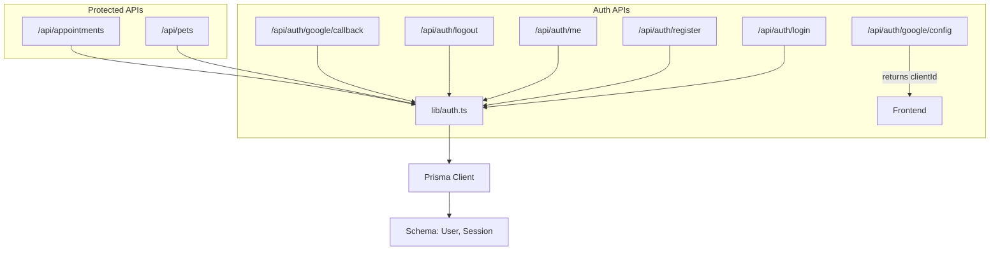
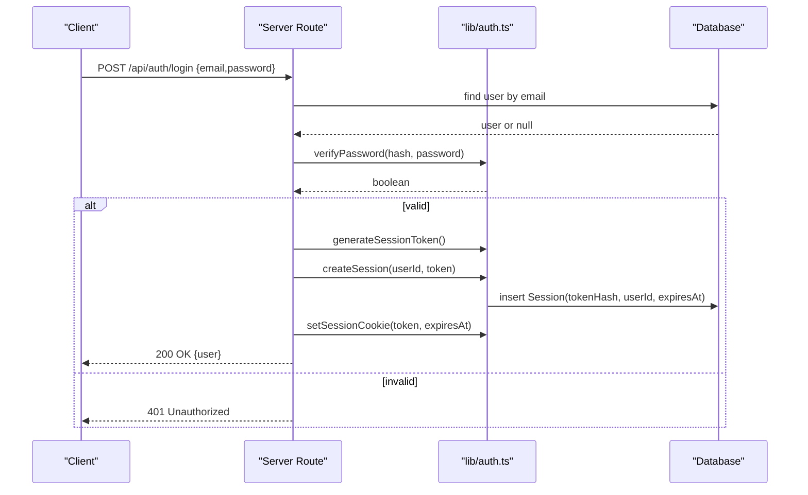
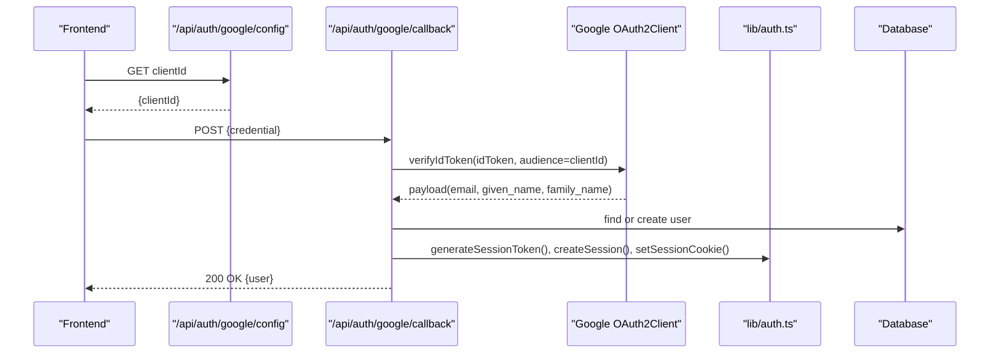
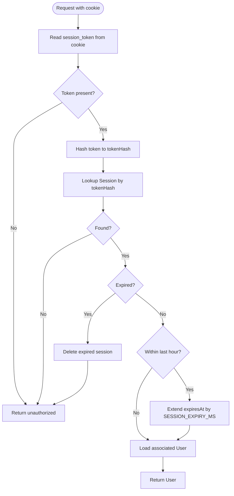
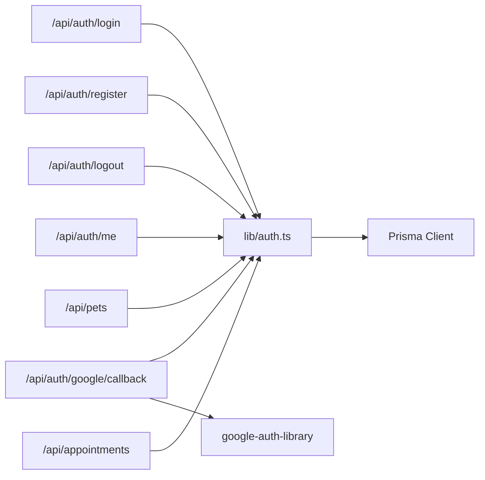
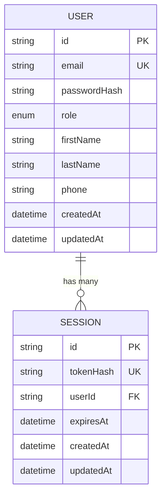

# Authentication & Session Security

<cite>
**Referenced Files in This Document**
- [auth.ts](file://lib/auth.ts)
- [login route.ts](file://app/api/auth/login/route.ts)
- [register route.ts](file://app/api/auth/register/route.ts)
- [logout route.ts](file://app/api/auth/logout/route.ts)
- [me route.ts](file://app/api/auth/me/route.ts)
- [google callback route.ts](file://app/api/auth/google/callback/route.ts)
- [google config route.ts](file://app/api/auth/google/config/route.ts)
- [pets route.ts](file://app/api/pets/route.ts)
- [appointments route.ts](file://app/api/appointments/route.ts)
- [schema.prisma](file://prisma/schema.prisma)
</cite>

## Table of Contents
1. Introduction
2. Project Structure
3. Core Components
4. Architecture Overview
5. Detailed Component Analysis
6. Dependency Analysis
7. Performance Considerations
8. Troubleshooting Guide
9. Conclusion
10. Appendices

## Introduction
This document explains the authentication and session security implementation in PETIVA. It covers password hashing with Argon2, secure cookie-based sessions, token generation and validation, role-based access control via middleware functions, Google OAuth integration patterns, and examples of protected routes and API endpoints. The goal is to provide a clear, code-mapped understanding of how users authenticate, how sessions are managed securely, and how authorization is enforced across the application.

## Project Structure
Authentication-related functionality is implemented as Next.js Server Routes under app/api/auth and supporting utilities in lib/auth.ts. The database schema defines User and Session models used by the auth flow. Protected resources (e.g., pets, appointments) demonstrate how to enforce authentication and authorization at the API layer.

**Diagram sources**
- [login route.ts:1-58](file://app/api/auth/login/route.ts#L1-L58)
- [register route.ts:1-78](file://app/api/auth/register/route.ts#L1-L78)
- [me route.ts:1-33](file://app/api/auth/me/route.ts#L1-L33)
- [logout route.ts:1-25](file://app/api/auth/logout/route.ts#L1-L25)
- [google callback route.ts:1-98](file://app/api/auth/google/callback/route.ts#L1-L98)
- [google config route.ts:1-8](file://app/api/auth/google/config/route.ts#L1-L8)
- [pets route.ts:1-69](file://app/api/pets/route.ts#L1-L69)
- [appointments route.ts:1-143](file://app/api/appointments/route.ts#L1-L143)
- [schema.prisma:30-66](file://prisma/schema.prisma#L30-L66)

**Section sources**
- [auth.ts:1-125](file://lib/auth.ts#L1-L125)
- [schema.prisma:30-66](file://prisma/schema.prisma#L30-L66)

## Core Components
- Password hashing and verification using Argon2id for secure storage and comparison.
- Secure session tokens generated cryptographically and hashed before storage.
- Database-backed sessions with expiration and sliding window extension.
- Secure cookie configuration with httpOnly, secure (production), sameSite lax, and path /.
- Middleware-like helpers requireAuth() and requireRole() to protect routes.
- Google OAuth callback that verifies tokens, creates or finds users, and issues sessions.
- Example protected endpoints demonstrating authentication checks and role-aware behavior.

**Section sources**
- [auth.ts:10-124](file://lib/auth.ts#L10-L124)
- [login route.ts:5-57](file://app/api/auth/login/route.ts#L5-L57)
- [register route.ts:6-77](file://app/api/auth/register/route.ts#L6-L77)
- [logout route.ts:5-24](file://app/api/auth/logout/route.ts#L5-L24)
- [me route.ts:4-32](file://app/api/auth/me/route.ts#L4-L32)
- [google callback route.ts:6-97](file://app/api/auth/google/callback/route.ts#L6-L97)
- [pets route.ts:6-68](file://app/api/pets/route.ts#L6-L68)
- [appointments route.ts:7-142](file://app/api/appointments/route.ts#L7-L142)

## Architecture Overview
The authentication architecture follows a server-side session model:
- Clients send credentials to login/register endpoints.
- On success, a secure HttpOnly cookie containing a session token is set.
- Subsequent requests include the cookie; the server validates the session and returns the authenticated user context.
- Role-based access control is enforced per endpoint using requireAuth() and requireRole().
- Google OAuth integrates by verifying the ID token on the server, creating or finding a user, and issuing a session.

**Diagram sources**
- [login route.ts:5-57](file://app/api/auth/login/route.ts#L5-L57)
- [auth.ts:10-44](file://lib/auth.ts#L10-L44)
- [schema.prisma:55-66](file://prisma/schema.prisma#L55-L66)

## Detailed Component Analysis

### Password Hashing and Verification
- Uses Argon2id for secure hashing and verification.
- Verification handles exceptions gracefully to avoid leaking information.

Security notes:
- Argon2id is resistant to GPU-based attacks and timing side-channels when configured appropriately by the library defaults.
- Errors during verification return false to prevent enumeration.

**Section sources**
- [auth.ts:10-21](file://lib/auth.ts#L10-L21)

### Session Token Generation and Validation
- Tokens are generated using a cryptographically secure random source.
- Tokens are hashed with SHA-256 before being stored in the database to protect token confidentiality even if the database is compromised.
- validateSession() checks existence, expiration, and performs sliding window extension when nearing expiry.

Security notes:
- Storing only the hash prevents direct token exposure.
- Sliding window improves UX while maintaining bounded session lifetime.

**Section sources**
- [auth.ts:23-75](file://lib/auth.ts#L23-L75)
- [schema.prisma:55-66](file://prisma/schema.prisma#L55-L66)

### Cookie-Based Session Management
- Cookies are set with:
  - httpOnly: true to prevent client-side script access
  - secure: true in production to enforce HTTPS
  - sameSite: lax to mitigate CSRF while allowing top-level navigation
  - path: '/' for site-wide availability
  - expires: aligned with session expiration
- Clearing cookies on logout ensures immediate invalidation from the client.

Security notes:
- SameSite lax is appropriate for typical web flows; consider stricter policies if cross-site usage requires it.
- Ensure HTTPS in production to leverage secure flag effectively.

**Section sources**
- [auth.ts:82-97](file://lib/auth.ts#L82-L97)
- [logout route.ts:5-24](file://app/api/auth/logout/route.ts#L5-L24)

### Role-Based Access Control (RBAC)
- requireAuth() enforces that a request has a valid session; throws UNAUTHENTICATED otherwise.
- requireRole() enforces that the authenticated user’s role matches allowed roles; throws FORBIDDEN otherwise.
- Endpoints catch these errors and return appropriate HTTP status codes.

Usage examples:
- GET /api/pets uses requireAuth() to ensure only logged-in users can list their pets.
- GET /api/appointments uses requireAuth() and then applies role-specific logic to filter results.

**Section sources**
- [auth.ts:99-124](file://lib/auth.ts#L99-L124)
- [pets route.ts:6-27](file://app/api/pets/route.ts#L6-L27)
- [appointments route.ts:7-66](file://app/api/appointments/route.ts#L7-L66)

### Google OAuth Integration
Flow:
- Frontend loads Google Identity Services SDK and fetches clientId from /api/auth/google/config.
- After user signs in with Google, frontend sends the ID token to /api/auth/google/callback.
- Server verifies the token using google-auth-library with audience matching the configured clientId.
- If verification succeeds, server finds or creates a user and issues a session cookie.

Security notes:
- Audience validation ensures tokens were issued for your application.
- Development mock mode allows testing without real tokens; never enable in production.
- Errors return standardized error responses.

**Diagram sources**
- [google config route.ts:3-7](file://app/api/auth/google/config/route.ts#L3-L7)
- [google callback route.ts:6-97](file://app/api/auth/google/callback/route.ts#L6-L97)
- [auth.ts:23-44](file://lib/auth.ts#L23-L44)
- [schema.prisma:30-66](file://prisma/schema.prisma#L30-L66)

**Section sources**
- [google callback route.ts:6-97](file://app/api/auth/google/callback/route.ts#L6-L97)
- [google config route.ts:3-7](file://app/api/auth/google/config/route.ts#L3-L7)

### Protected Routes and API Endpoints Examples
- Authentication check:
  - Use requireAuth() at the start of handlers to enforce login state.
  - Catch UNAUTHENTICATED and respond with 401.
- Authorization check:
  - Use requireRole() to restrict endpoints to specific roles.
  - Catch FORBIDDEN and respond with 403.
- Resource ownership:
  - Validate resource ownership (e.g., pet.ownerId === user.id) after authentication.

Examples in codebase:
- /api/pets GET/POST: requireAuth() protects listing and creation.
- /api/appointments GET/POST: requireAuth() plus role-based filtering and ownership checks.

**Section sources**
- [pets route.ts:6-68](file://app/api/pets/route.ts#L6-L68)
- [appointments route.ts:7-142](file://app/api/appointments/route.ts#L7-L142)

### Session Lifecycle Management
- Creation:
  - Login and register endpoints generate a token, store its hash with userId and expiresAt, and set the cookie.
- Validation:
  - getCurrentUser() reads the cookie, validates the session, and returns the user.
  - validateSession() checks expiration and extends sessions near expiry (sliding window).
- Expiration and cleanup:
  - Expired sessions are deleted upon detection during validation.
- Invalidation:
  - Logout deletes the session record and clears the cookie.

**Diagram sources**
- [auth.ts:46-75](file://lib/auth.ts#L46-L75)
- [schema.prisma:55-66](file://prisma/schema.prisma#L55-L66)

**Section sources**
- [auth.ts:32-80](file://lib/auth.ts#L32-L80)
- [login route.ts:34-48](file://app/api/auth/login/route.ts#L34-L48)
- [register route.ts:54-68](file://app/api/auth/register/route.ts#L54-L68)
- [logout route.ts:5-24](file://app/api/auth/logout/route.ts#L5-L24)

## Dependency Analysis
- lib/auth.ts depends on:
  - next/headers for cookie management
  - Prisma client for database operations
  - argon2 for password hashing
  - crypto for token generation and hashing
- Routes depend on lib/auth.ts for common auth logic and on Prisma for data access.
- Google OAuth callback depends on google-auth-library for token verification.

**Diagram sources**
- [auth.ts:1-125](file://lib/auth.ts#L1-L125)
- [login route.ts:1-58](file://app/api/auth/login/route.ts#L1-L58)
- [register route.ts:1-78](file://app/api/auth/register/route.ts#L1-L78)
- [logout route.ts:1-25](file://app/api/auth/logout/route.ts#L1-L25)
- [me route.ts:1-33](file://app/api/auth/me/route.ts#L1-L33)
- [google callback route.ts:1-98](file://app/api/auth/google/callback/route.ts#L1-L98)
- [pets route.ts:1-69](file://app/api/pets/route.ts#L1-L69)
- [appointments route.ts:1-143](file://app/api/appointments/route.ts#L1-L143)

**Section sources**
- [auth.ts:1-125](file://lib/auth.ts#L1-L125)
- [google callback route.ts:1-98](file://app/api/auth/google/callback/route.ts#L1-L98)

## Performance Considerations
- Argon2 hashing is intentionally slow to resist brute-force attacks; keep password operations off critical paths where possible.
- Session validation includes a database lookup and potential update for sliding window; ensure indexes exist on tokenHash and expiresAt (already defined in schema).
- Avoid unnecessary re-validation by leveraging short-lived tokens and sliding window to reduce frequent updates.
- For high traffic, consider caching user profiles briefly after validation if appropriate, but be mindful of consistency requirements.

[No sources needed since this section provides general guidance]

## Troubleshooting Guide
Common issues and resolutions:
- Invalid credentials:
  - Verify password hashing and verification paths; ensure user exists and has a passwordHash for password-based login.
- Session not found or expired:
  - Check that the cookie is present and not blocked by browser settings; confirm expiresAt and sliding window logic.
- Google OAuth failures:
  - Ensure GOOGLE_CLIENT_ID is configured; verify audience matches the client ID; handle development mock tokens correctly.
- Forbidden access:
  - Confirm requireRole() is used with correct roles; ensure user.role is set appropriately.

Error handling patterns:
- Consistent JSON error responses with status codes (400, 401, 403, 409, 500).
- Centralized error messages for UNAUTHENTICATED and FORBIDDEN thrown by middleware.

**Section sources**
- [login route.ts:5-57](file://app/api/auth/login/route.ts#L5-L57)
- [register route.ts:6-77](file://app/api/auth/register/route.ts#L6-L77)
- [google callback route.ts:6-97](file://app/api/auth/google/callback/route.ts#L6-L97)
- [pets route.ts:6-68](file://app/api/pets/route.ts#L6-L68)
- [appointments route.ts:7-142](file://app/api/appointments/route.ts#L7-L142)

## Conclusion
PETIVA implements a robust, secure authentication and session system:
- Passwords are hashed with Argon2id and verified safely.
- Sessions are stored as hashed tokens with expiration and sliding window extension.
- Cookies are configured securely for production environments.
- RBAC is enforced via requireAuth() and requireRole() middleware helpers.
- Google OAuth integrates securely with audience validation and session issuance.
- Protected endpoints demonstrate consistent authentication and authorization patterns.

[No sources needed since this section summarizes without analyzing specific files]

## Appendices

### Data Model Reference
Key entities involved in authentication and sessions:

**Diagram sources**
- [schema.prisma:30-66](file://prisma/schema.prisma#L30-L66)