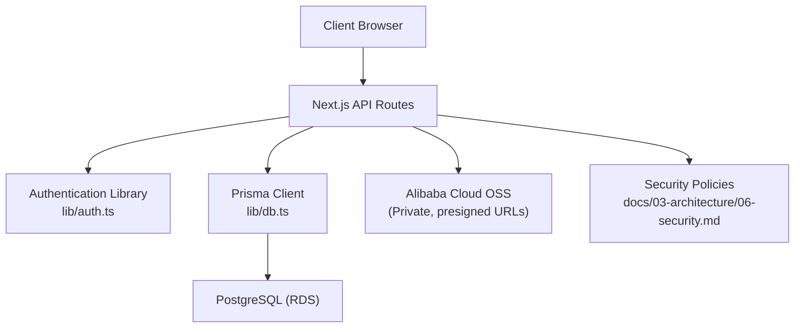
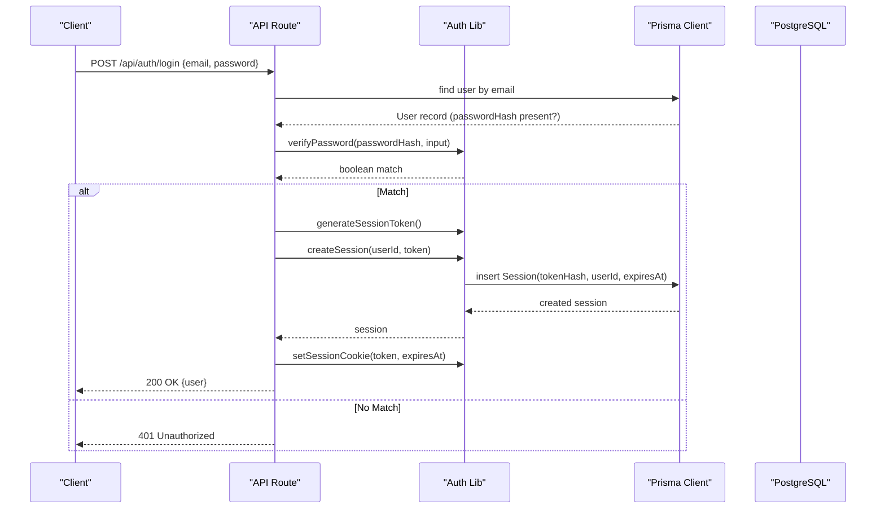
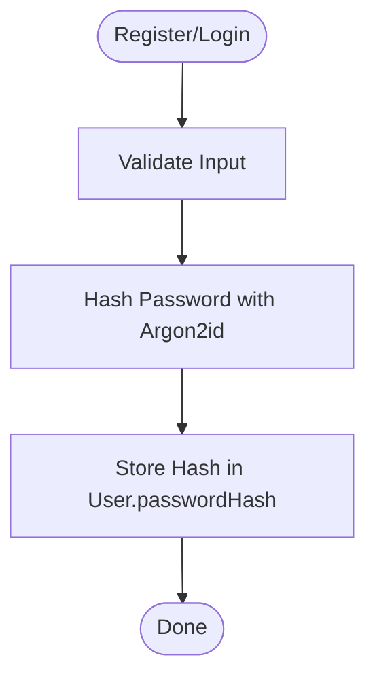
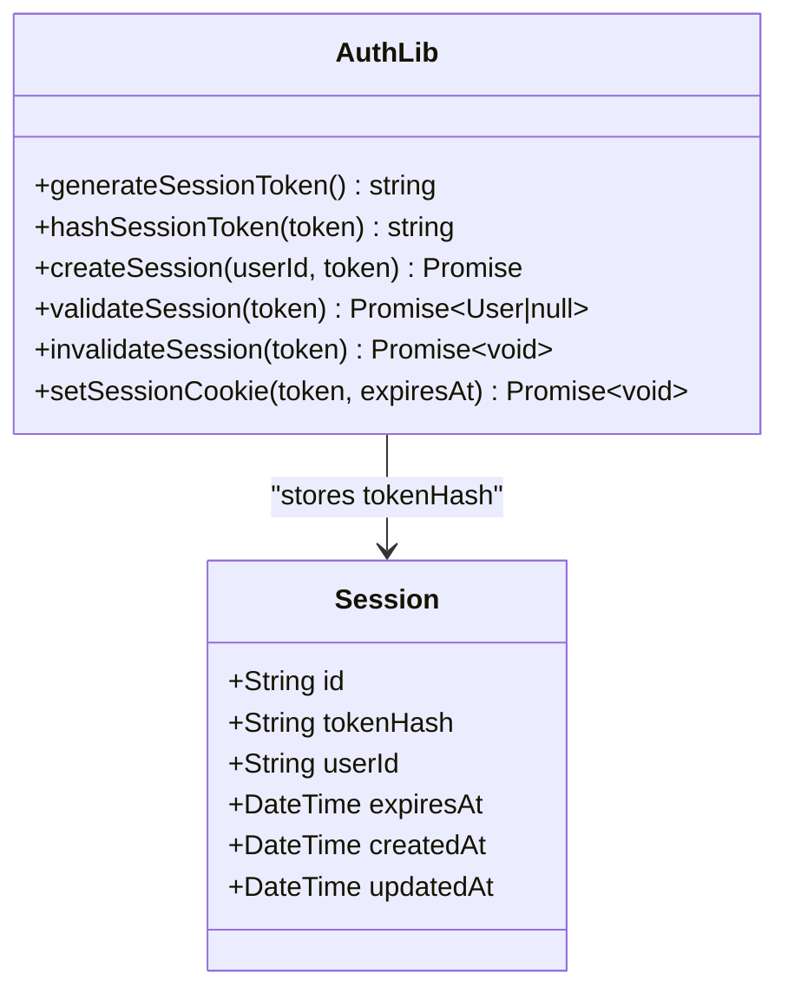
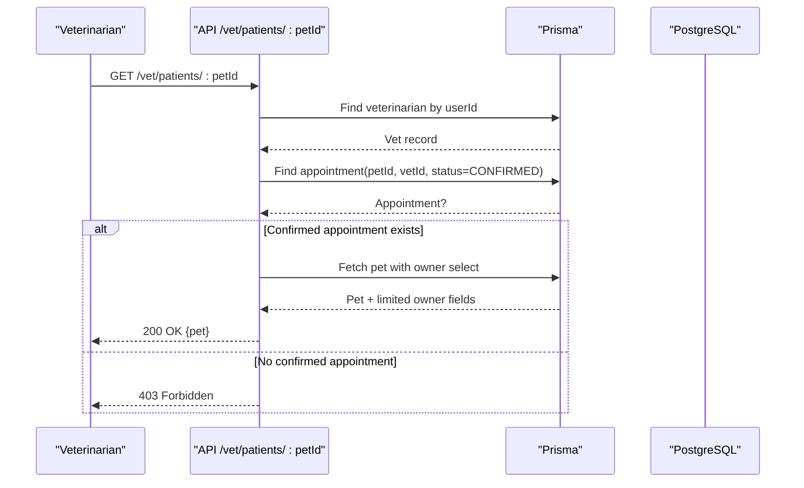
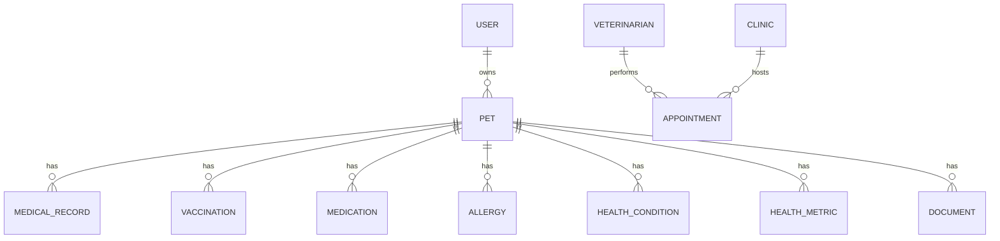
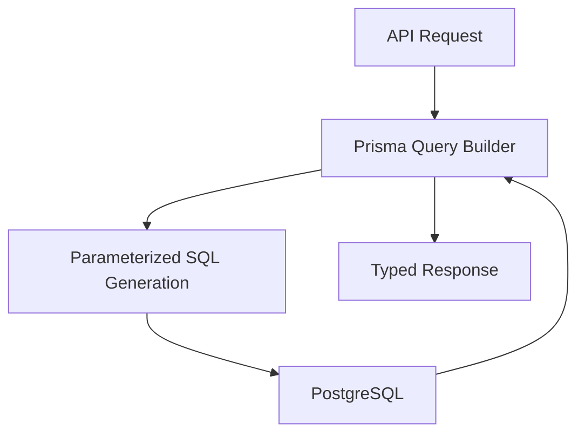
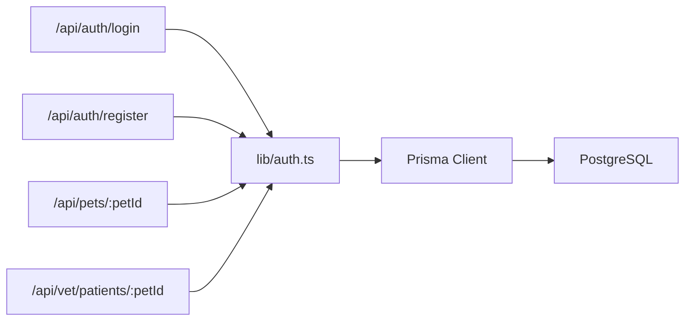

# Data Protection & Encryption

<cite>
**Referenced Files in This Document**
- [lib/auth.ts](file://lib/auth.ts)
- [lib/db.ts](file://lib/db.ts)
- [prisma/schema.prisma](file://prisma/schema.prisma)
- [app/api/auth/login/route.ts](file://app/api/auth/login/route.ts)
- [app/api/auth/register/route.ts](file://app/api/auth/register/route.ts)
- [app/api/pets/[petId]/route.ts](file://app/api/pets/[petId]/route.ts)
- [app/api/vet/patients/[petId]/route.ts](file://app/api/vet/patients/[petId]/route.ts)
- [docs/03-architecture/06-security.md](file://docs/03-architecture/06-security.md)
- [docs/02-requirements/03-authentication-decision.md](file://docs/02-requirements/03-authentication-decision.md)
- [docs/02-requirements/01-requirements-review.md](file://docs/02-requirements/01-requirements-review.md)
- [docs/02-requirements/02-decisions.md](file://docs/02-requirements/02-decisions.md)
</cite>

## Table of Contents
1. Introduction
2. Project Structure
3. Core Components
4. Architecture Overview
5. Detailed Component Analysis
6. Dependency Analysis
7. Performance Considerations
8. Troubleshooting Guide
9. Conclusion

## Introduction
This document explains how PETIVA protects sensitive data and implements encryption for a pet healthcare application. It covers password hashing with Argon2, session token hashing with SHA-256, secure cookie storage, authorization boundaries, database security via Prisma ORM, handling of sensitive pet medical records and personal information, PHI compliance guidance, data retention considerations, and secure transmission/storage patterns across the API layer.

## Project Structure
PETIVA is a Next.js application using Prisma ORM with PostgreSQL. Authentication and authorization are implemented server-side in lib/auth.ts and enforced at API routes. Sensitive data models include User, Session, Pet, MedicalRecord, HealthMetric, Document, and AuditLog. Security policies and design decisions are documented under docs/.

**Diagram sources**
- [lib/auth.ts:1-125](file://lib/auth.ts#L1-L125)
- [lib/db.ts:1-33](file://lib/db.ts#L1-L33)
- [docs/03-architecture/06-security.md:51-63](file://docs/03-architecture/06-security.md#L51-L63)

**Section sources**
- [lib/auth.ts:1-125](file://lib/auth.ts#L1-L125)
- [lib/db.ts:1-33](file://lib/db.ts#L1-L33)
- [prisma/schema.prisma:1-312](file://prisma/schema.prisma#L1-L312)
- [docs/03-architecture/06-security.md:1-90](file://docs/03-architecture/06-security.md#L1-L90)

## Core Components
- Password hashing and verification using Argon2id.
- Opaque session tokens generated cryptographically securely and hashed with SHA-256 before storage.
- Secure cookie configuration for sessions.
- Role-based access control and consent-based vet access to pet data.
- Database-backed sessions with expiration and sliding window extension.
- Prisma ORM usage for parameterized queries and safe data access.
- Private object storage with short-lived presigned URLs.

**Section sources**
- [lib/auth.ts:10-30](file://lib/auth.ts#L10-L30)
- [lib/auth.ts:33-80](file://lib/auth.ts#L33-L80)
- [lib/auth.ts:83-97](file://lib/auth.ts#L83-L97)
- [docs/03-architecture/06-security.md:7-13](file://docs/03-architecture/06-security.md#L7-L13)
- [docs/03-architecture/06-security.md:51-63](file://docs/03-architecture/06-security.md#L51-L63)

## Architecture Overview
The system enforces authentication at the API boundary, validates roles and consent, and uses Prisma to interact with PostgreSQL safely. Sessions are stored as hashed tokens with expiry, and cookies are set with strict flags. Sensitive files are kept private in OSS and accessed via time-limited signed URLs.

**Diagram sources**
- [app/api/auth/login/route.ts:5-48](file://app/api/auth/login/route.ts#L5-L48)
- [lib/auth.ts:15-44](file://lib/auth.ts#L15-L44)
- [lib/auth.ts:83-91](file://lib/auth.ts#L83-L91)

**Section sources**
- [app/api/auth/login/route.ts:1-58](file://app/api/auth/login/route.ts#L1-L58)
- [lib/auth.ts:10-97](file://lib/auth.ts#L10-L97)

## Detailed Component Analysis

### Password Hashing with Argon2
- Implementation uses Argon2id for hashing and verification.
- Passwords are never stored in plaintext; only hashes persist in the database.
- Verification wraps errors to return false on invalid inputs or mismatches.

**Diagram sources**
- [lib/auth.ts:10-21](file://lib/auth.ts#L10-L21)
- [app/api/auth/register/route.ts:41-52](file://app/api/auth/register/route.ts#L41-L52)

**Section sources**
- [lib/auth.ts:10-21](file://lib/auth.ts#L10-L21)
- [app/api/auth/register/route.ts:6-57](file://app/api/auth/register/route.ts#L6-L57)
- [docs/02-requirements/03-authentication-decision.md:60-64](file://docs/02-requirements/03-authentication-decision.md#L60-L64)

### Session Token Hashing and Secure Storage
- Tokens are generated using cryptographically secure random bytes.
- Only the SHA-256 hash of the token is stored in the Session table.
- Cookies are HttpOnly, Secure in production, SameSite=Lax, with explicit expiry.
- Validation checks expiration and supports sliding-window extension when near expiry.

**Diagram sources**
- [prisma/schema.prisma:55-66](file://prisma/schema.prisma#L55-L66)
- [lib/auth.ts:23-80](file://lib/auth.ts#L23-L80)
- [lib/auth.ts:83-97](file://lib/auth.ts#L83-L97)

**Section sources**
- [lib/auth.ts:23-80](file://lib/auth.ts#L23-L80)
- [lib/auth.ts:83-97](file://lib/auth.ts#L83-L97)
- [prisma/schema.prisma:55-66](file://prisma/schema.prisma#L55-L66)
- [docs/02-requirements/03-authentication-decision.md:27-30](file://docs/02-requirements/03-authentication-decision.md#L27-L30)
- [docs/02-requirements/03-authentication-decision.md:88-90](file://docs/02-requirements/03-authentication-decision.md#L88-L90)

### Authorization and Consent-Based Access
- Role-based access control ensures users can only access permitted resources.
- Veterinarians gain temporary access to a pet’s data only when an appointment is confirmed.
- Ownership checks prevent unauthorized pet profile access.

**Diagram sources**
- [app/api/vet/patients/[petId]/route.ts:5-47](file://app/api/vet/patients/[petId]/route.ts#L5-L47)
- [app/api/vet/patients/[petId]/route.ts:49-66](file://app/api/vet/patients/[petId]/route.ts#L49-L66)

**Section sources**
- [app/api/vet/patients/[petId]/route.ts:1-80](file://app/api/vet/patients/[petId]/route.ts#L1-L80)
- [docs/03-architecture/06-security.md:16-48](file://docs/03-architecture/06-security.md#L16-L48)

### Sensitive Data Handling: Medical Records, Personal Information, Health Metrics
- Personal information (names, phone, email) is minimized in responses where appropriate.
- Veterinary access includes only necessary fields (e.g., owner name and contact).
- Medical records, vaccinations, medications, allergies, conditions, and health metrics are modeled and linked to pets.
- Documents are referenced by OSS keys; actual files remain private.

**Diagram sources**
- [prisma/schema.prisma:30-53](file://prisma/schema.prisma#L30-L53)
- [prisma/schema.prisma:68-88](file://prisma/schema.prisma#L68-L88)
- [prisma/schema.prisma:90-119](file://prisma/schema.prisma#L90-L119)
- [prisma/schema.prisma:133-162](file://prisma/schema.prisma#L133-L162)
- [prisma/schema.prisma:164-182](file://prisma/schema.prisma#L164-L182)
- [prisma/schema.prisma:184-258](file://prisma/schema.prisma#L184-L258)

**Section sources**
- [app/api/vet/patients/[petId]/route.ts:28-40](file://app/api/vet/patients/[petId]/route.ts#L28-L40)
- [prisma/schema.prisma:133-258](file://prisma/schema.prisma#L133-L258)
- [docs/03-architecture/06-security.md:72-75](file://docs/03-architecture/06-security.md#L72-L75)

### Database-Level Security: Parameterized Queries and SQL Injection Prevention
- All database interactions use Prisma ORM, which generates parameterized queries, preventing SQL injection.
- Connection pooling and environment-based connection strings ensure secure DB connectivity.
- Indexes on frequently queried fields improve performance and reduce exposure windows.

**Diagram sources**
- [lib/db.ts:1-33](file://lib/db.ts#L1-L33)
- [prisma/schema.prisma:1-7](file://prisma/schema.prisma#L1-L7)

**Section sources**
- [lib/db.ts:1-33](file://lib/db.ts#L1-L33)
- [prisma/schema.prisma:1-7](file://prisma/schema.prisma#L1-L7)

### Field-Level Encryption Considerations
- Current implementation stores passwords as Argon2 hashes and session tokens as SHA-256 hashes.
- No field-level encryption is implemented for other sensitive fields (e.g., medical notes, diagnoses).
- Recommendation: For PHI-like fields, consider encrypting at rest using envelope encryption or KMS-managed keys, and restrict decryption to authorized services.

[No sources needed since this section provides general guidance based on current code state]

### PHI Compliance and Data Retention Guidelines
- The project focuses on strong security practices without claiming HIPAA/GDPR certification.
- Data minimization is applied in AI prompts and vet responses.
- Audit logging captures sensitive operations for traceability.
- Recommended retention policy: define lifecycle rules for medical records, audit logs, and sessions; archive or purge according to organizational policy.

**Section sources**
- [docs/03-architecture/06-security.md:1-3](file://docs/03-architecture/06-security.md#L1-L3)
- [docs/03-architecture/06-security.md:81-90](file://docs/03-architecture/06-security.md#L81-L90)
- [docs/02-requirements/01-requirements-review.md:105-110](file://docs/02-requirements/01-requirements-review.md#L105-L110)

### Secure Transmission and Storage Patterns
- Authentication uses HTTPS cookies with HttpOnly, Secure, and SameSite settings.
- File uploads/downloads use private OSS with Signature V4 presigned URLs that expire quickly.
- Secrets are managed via environment variables; no secrets in code or client components.

**Section sources**
- [lib/auth.ts:83-91](file://lib/auth.ts#L83-L91)
- [docs/03-architecture/06-security.md:51-63](file://docs/03-architecture/06-security.md#L51-L63)

## Dependency Analysis
The following diagram shows key dependencies between authentication, API routes, and database layers.

**Diagram sources**
- [app/api/auth/login/route.ts:1-58](file://app/api/auth/login/route.ts#L1-L58)
- [app/api/auth/register/route.ts:1-78](file://app/api/auth/register/route.ts#L1-L78)
- [app/api/pets/[petId]/route.ts:1-141](file://app/api/pets/[petId]/route.ts#L1-L141)
- [app/api/vet/patients/[petId]/route.ts:1-80](file://app/api/vet/patients/[petId]/route.ts#L1-L80)
- [lib/auth.ts:1-125](file://lib/auth.ts#L1-L125)
- [lib/db.ts:1-33](file://lib/db.ts#L1-L33)

**Section sources**
- [app/api/auth/login/route.ts:1-58](file://app/api/auth/login/route.ts#L1-L58)
- [app/api/auth/register/route.ts:1-78](file://app/api/auth/register/route.ts#L1-L78)
- [app/api/pets/[petId]/route.ts:1-141](file://app/api/pets/[petId]/route.ts#L1-L141)
- [app/api/vet/patients/[petId]/route.ts:1-80](file://app/api/vet/patients/[petId]/route.ts#L1-L80)
- [lib/auth.ts:1-125](file://lib/auth.ts#L1-L125)
- [lib/db.ts:1-33](file://lib/db.ts#L1-L33)

## Performance Considerations
- Session validation performs a single indexed lookup by tokenHash per request; indexes on tokenHash, userId, and expiresAt optimize performance.
- Sliding-window session extension reduces re-authentication frequency while maintaining security.
- Prisma query optimization and proper indexing help minimize latency for sensitive data retrieval.

**Section sources**
- [lib/auth.ts:46-74](file://lib/auth.ts#L46-L74)
- [prisma/schema.prisma:55-66](file://prisma/schema.prisma#L55-L66)
- [docs/02-requirements/03-authentication-decision.md:145-149](file://docs/02-requirements/03-authentication-decision.md#L145-L149)

## Troubleshooting Guide
- Authentication failures: Ensure email/password are provided and user exists with a passwordHash; verify Argon2 verification returns true for valid credentials.
- Session issues: Confirm token generation, hashing, and cookie setting; check expiration and sliding-window logic; validate session deletion on logout.
- Authorization errors: Verify role checks and consent-based vet access; ensure appointments are confirmed for vet read access.
- Database errors: Check Prisma client initialization and connection pool configuration; ensure environment variables are correctly set.

**Section sources**
- [app/api/auth/login/route.ts:5-57](file://app/api/auth/login/route.ts#L5-L57)
- [app/api/auth/register/route.ts:6-77](file://app/api/auth/register/route.ts#L6-L77)
- [lib/auth.ts:46-80](file://lib/auth.ts#L46-L80)
- [app/api/vet/patients/[petId]/route.ts:5-47](file://app/api/vet/patients/[petId]/route.ts#L5-L47)
- [lib/db.ts:8-29](file://lib/db.ts#L8-L29)

## Conclusion
PETIVA implements robust data protection through Argon2 password hashing, SHA-256 session token hashing, secure cookie management, role-based and consent-based authorization, and safe database interactions via Prisma. Sensitive files are stored privately with short-lived access URLs. While not HIPAA-certified, the system follows strong privacy and security principles suitable for handling pet healthcare data. Future enhancements may include field-level encryption for PHI-like fields and formalized data retention policies.