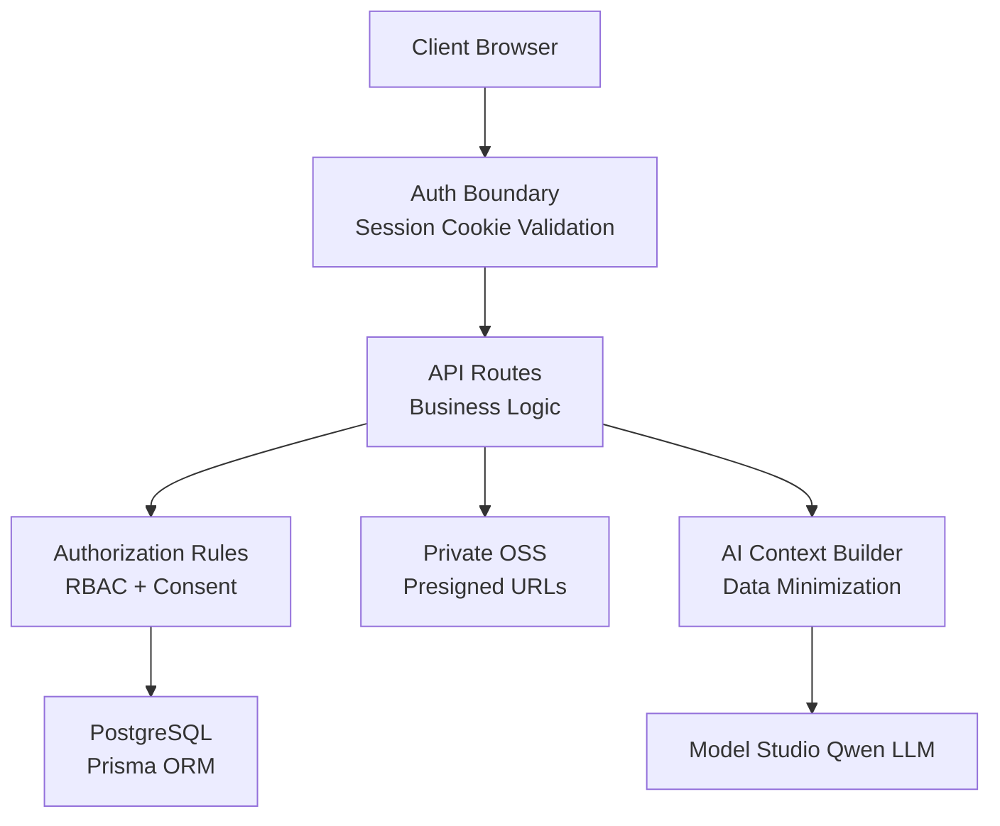
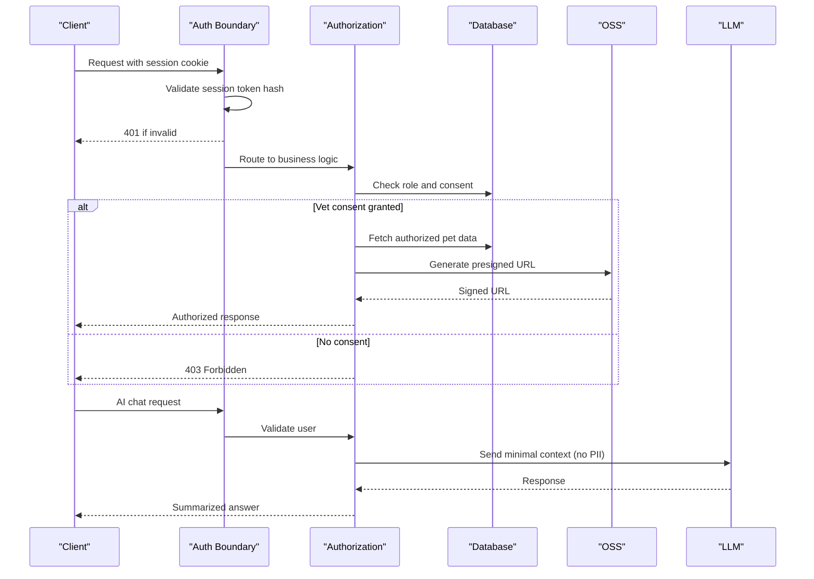
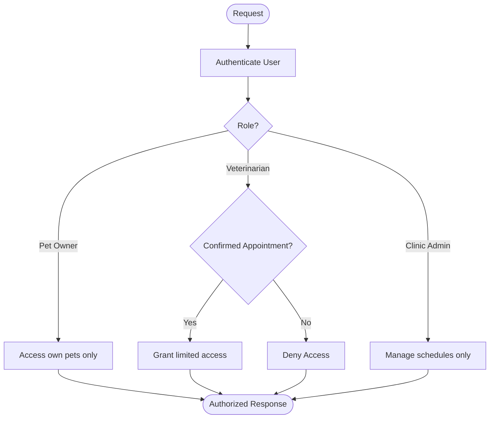
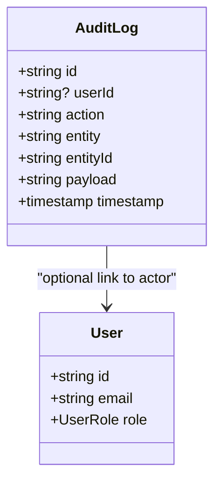
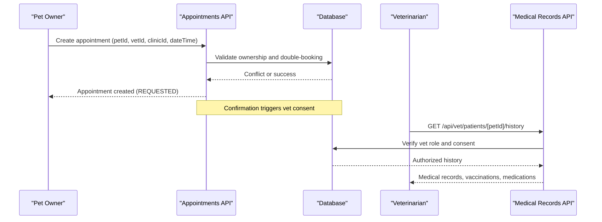
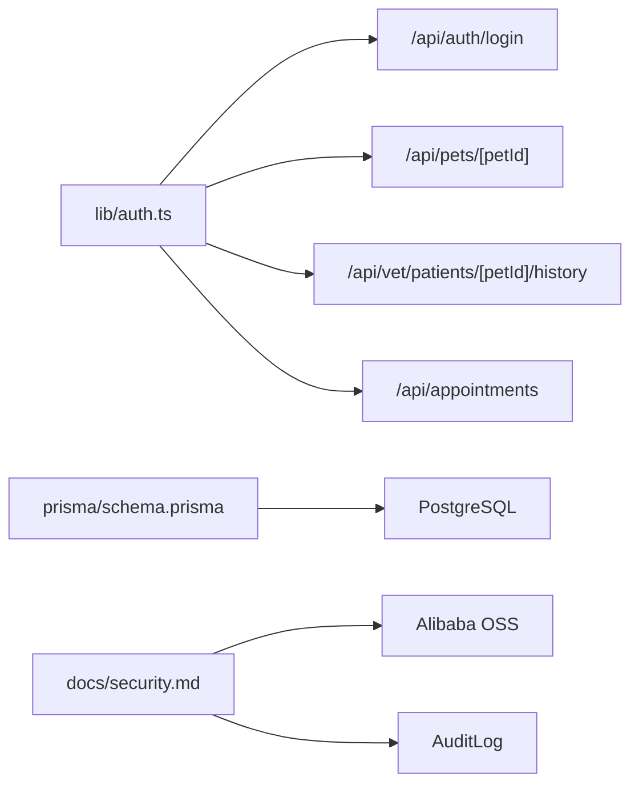

# Healthcare Compliance & Regulations

<cite>
**Referenced Files in This Document**
- [auth.ts](file://lib/auth.ts)
- [schema.prisma](file://prisma/schema.prisma)
- [security.md](file://docs/03-architecture/06-security.md)
- [login route.ts](file://app/api/auth/login/route.ts)
- [pet route.ts](file://app/api/pets/[petId]/route.ts)
- [vet history route.ts](file://app/api/vet/patients/[petId]/history/route.ts)
- [appointments route.ts](file://app/api/appointments/route.ts)
- [clinic profile route.ts](file://app/api/clinic/profile/route.ts)
- [database design.md](file://docs/03-architecture/02-database-design.md)
- [alibaba cloud architecture.md](file://docs/03-architecture/05-alibaba-cloud-architecture.md)
- [authentication decision.md](file://docs/02-requirements/03-authentication-decision.md)
</cite>

## Table of Contents
1. Introduction
2. Project Structure
3. Core Components
4. Architecture Overview
5. Detailed Component Analysis
6. Dependency Analysis
7. Performance Considerations
8. Troubleshooting Guide
9. Conclusion
10. Appendices

## Introduction
This document provides comprehensive guidance for healthcare compliance and regulatory requirements within PETIVA, focusing on HIPAA-aligned practices for handling pet health information and medical records. It explains data privacy controls including consent management, data retention considerations, and patient rights; details audit logging for sensitive data access; outlines secure data sharing protocols between pet owners, veterinarians, and clinics; and provides guidelines for data anonymization, breach notification procedures, and ongoing compliance monitoring. The content is grounded in the application’s authentication, authorization, database schema, and security documentation to ensure practical, code-mapped compliance measures throughout the application lifecycle.

## Project Structure
PETIVA implements a Next.js App Router backend with Prisma-managed PostgreSQL storage and Alibaba Cloud OSS for private file storage. Security and compliance are enforced at multiple layers:
- Authentication via HTTP-only cookies with server-side session validation
- Role-Based Access Control (RBAC) combined with consent-based access for veterinarians
- Private object storage with short-lived presigned URLs
- Audit logging for sensitive operations
- Data minimization for AI interactions

**Diagram sources**
- [security.md:48-93](file://docs/03-architecture/06-security.md#L48-L93)
- [alibaba cloud architecture.md:27-45](file://docs/03-architecture/05-alibaba-cloud-architecture.md#L27-L45)

**Section sources**
- [security.md:1-90](file://docs/03-architecture/06-security.md#L1-L90)
- [alibaba cloud architecture.md:27-68](file://docs/03-architecture/05-alibaba-cloud-architecture.md#L27-L68)

## Core Components
- Authentication and Session Management: Secure cookie-based sessions with hashed token storage and sliding expiration.
- Authorization and Consent: RBAC plus appointment-driven consent granting temporary vet access to pet records.
- Data Storage and File Security: Private OSS with validated uploads and time-limited download links.
- Audit Logging: Persistent logs for critical actions such as record revisions and access denials.
- AI Security: Prompt isolation, PII omission, and rate limiting.

**Section sources**
- [auth.ts:1-125](file://lib/auth.ts#L1-L125)
- [security.md:16-90](file://docs/03-architecture/06-security.md#L16-L90)
- [alibaba cloud architecture.md:27-45](file://docs/03-architecture/05-alibaba-cloud-architecture.md#L27-L45)

## Architecture Overview
The system enforces strict boundaries to protect sensitive pet health data:
- Authentication boundary validates sessions on every request.
- Authorization boundary applies RBAC and consent checks before granting access to medical records.
- File storage boundary ensures all documents reside in a private bucket accessed via short-lived presigned URLs.
- AI integration boundary limits context sent to external models and strips PII.

**Diagram sources**
- [security.md:16-90](file://docs/03-architecture/06-security.md#L16-L90)
- [alibaba cloud architecture.md:27-45](file://docs/03-architecture/05-alibaba-cloud-architecture.md#L27-L45)

## Detailed Component Analysis

### HIPAA-Aligned Measures for Pet Health Information
- Encryption in transit: HTTPS enforced for APIs and browser-to-server communication.
- Secure credentials: Secrets stored in environment variables; never committed or exposed to clients.
- Access control: Only authenticated users with explicit roles and consent can access sensitive records.
- Data minimization: AI prompts exclude PII and only include necessary health context.
- Auditability: Critical actions logged with timestamps, actor IDs, and payloads for traceability.

**Section sources**
- [security.md:60-90](file://docs/03-architecture/06-security.md#L60-L90)
- [alibaba cloud architecture.md:27-45](file://docs/03-architecture/05-alibaba-cloud-architecture.md#L27-L45)

### Data Privacy: Consent Management, Retention Policies, and Patient Rights
- Consent-based access: Veterinarians receive temporary, limited access when an appointment is booked and confirmed.
- Role boundaries: Pet owners manage their own pets; clinic admins manage schedules without direct medical record access unless assigned.
- Retention considerations: Sessions have finite lifetimes and are cleaned up; medical records use versioned revisions to preserve history while enabling corrections.
- Patient rights: Owners can view and update pet profiles; vets can add records with full audit trails; platform admins oversee verification and moderation.

**Diagram sources**
- [security.md:16-48](file://docs/03-architecture/06-security.md#L16-L48)
- [appointments route.ts:69-129](file://app/api/appointments/route.ts#L69-L129)

**Section sources**
- [security.md:16-48](file://docs/03-architecture/06-security.md#L16-L48)
- [appointments route.ts:69-129](file://app/api/appointments/route.ts#L69-L129)

### Audit Logging Requirements for Sensitive Data Access
- Persistent audit log table captures action codes, entity types, entity IDs, and payloads.
- Sensitive events include record revisions, appointment confirmations, document uploads, and access denials.
- Logs enable forensic analysis and compliance reporting.

**Diagram sources**
- [schema.prisma:298-311](file://prisma/schema.prisma#L298-L311)

**Section sources**
- [schema.prisma:298-311](file://prisma/schema.prisma#L298-L311)
- [security.md:81-90](file://docs/03-architecture/06-security.md#L81-L90)
- [vet history route.ts:104-137](file://app/api/vet/patients/[petId]/history/route.ts#L104-L137)

### Secure Data Sharing Protocols Between Owners, Vets, and Clinics
- Owners create and manage pet profiles and initiate appointments.
- Vets gain temporary access upon confirmed appointments to review histories and add records.
- Clinic admins manage operational aspects without direct medical record access unless explicitly associated.

**Diagram sources**
- [appointments route.ts:69-129](file://app/api/appointments/route.ts#L69-L129)
- [vet history route.ts:6-69](file://app/api/vet/patients/[petId]/history/route.ts#L6-L69)

**Section sources**
- [appointments route.ts:69-129](file://app/api/appointments/route.ts#L69-L129)
- [vet history route.ts:6-69](file://app/api/vet/patients/[petId]/history/route.ts#L6-L69)

### Guidelines for Data Anonymization
- For analytics or AI training, strip identifiers (owner name, email, phone) and replace with pseudonyms.
- Aggregate metrics at the pet level where possible; avoid linking back to individuals.
- Ensure any exported datasets do not contain raw PII or direct identifiers.

[No sources needed since this section provides general guidance]

### Breach Notification Procedures
- Detect anomalies via audit logs and error patterns.
- Contain incidents by revoking sessions and restricting access.
- Notify stakeholders per organizational policy and applicable regulations.
- Preserve evidence by retaining relevant audit logs and system state snapshots.

[No sources needed since this section provides general guidance]

### Compliance Monitoring
- Monitor login attempts and rate-limiting to prevent abuse.
- Review audit logs regularly for unauthorized access attempts and policy violations.
- Enforce least privilege and verify role assignments periodically.
- Validate that AI prompts exclude PII and that file access uses presigned URLs.

**Section sources**
- [security.md:66-90](file://docs/03-architecture/06-security.md#L66-L90)
- [authentication decision.md:125-130](file://docs/02-requirements/03-authentication-decision.md#L125-L130)

## Dependency Analysis
Key dependencies and relationships supporting compliance:
- Authentication utilities depend on cryptographic hashing and secure cookie handling.
- Authorization depends on roles and appointment status to enforce consent.
- File storage depends on private OSS and presigned URL generation.
- Audit logging depends on persistent tables and transactional writes.

**Diagram sources**
- [auth.ts:1-125](file://lib/auth.ts#L1-L125)
- [schema.prisma:298-311](file://prisma/schema.prisma#L298-L311)
- [security.md:51-90](file://docs/03-architecture/06-security.md#L51-L90)

**Section sources**
- [auth.ts:1-125](file://lib/auth.ts#L1-L125)
- [schema.prisma:298-311](file://prisma/schema.prisma#L298-L311)
- [security.md:51-90](file://docs/03-architecture/06-security.md#L51-L90)

## Performance Considerations
- Session lookups are indexed queries on tokenHash and expiresAt, minimizing latency.
- Medical record retrieval uses efficient joins and indexes on petId and timestamps.
- OSS presigned URLs reduce server load by allowing direct downloads.
- Rate limiting protects AI endpoints from abuse and reduces unnecessary processing.

[No sources needed since this section provides general guidance]

## Troubleshooting Guide
Common issues and resolutions aligned with compliance:
- Unauthorized access: Ensure session cookie is present and valid; verify role and consent checks.
- Forbidden access: Confirm veterinarian has a confirmed appointment; check RBAC rules.
- File access failures: Validate presigned URL generation and expiration; ensure OSS bucket ACL is private.
- Audit gaps: Verify transactional writes for audit logs during record creation and updates.

**Section sources**
- [login route.ts:5-58](file://app/api/auth/login/route.ts#L5-L58)
- [pet route.ts:22-52](file://app/api/pets/[petId]/route.ts#L22-L52)
- [vet history route.ts:6-69](file://app/api/vet/patients/[petId]/history/route.ts#L6-L69)
- [security.md:51-90](file://docs/03-architecture/06-security.md#L51-L90)

## Conclusion
PETIVA implements robust, code-backed measures that align with HIPAA principles for protecting pet health information. Through secure authentication, consent-based authorization, private file storage, audit logging, and AI data minimization, the platform supports privacy, accountability, and compliance throughout its lifecycle. Continuous monitoring, clear breach procedures, and adherence to least privilege will further strengthen regulatory alignment.

[No sources needed since this section summarizes without analyzing specific files]

## Appendices

### Example Compliant Workflows
- Owner creates pet profile and initiates appointment:
  - Validates ownership and prevents double booking.
  - Creates appointment with REQUESTED status.
- Vet accesses medical history after confirmation:
  - Requires veterinarian role and active consent.
  - Retrieves authorized records and appends new entries with audit logs.
- Secure document upload:
  - Requests presigned URL with validated metadata.
  - Stores file under hashed path in private OSS.
  - Returns reference to client for later retrieval via signed URL.

**Section sources**
- [appointments route.ts:69-129](file://app/api/appointments/route.ts#L69-L129)
- [vet history route.ts:71-153](file://app/api/vet/patients/[petId]/history/route.ts#L71-L153)
- [alibaba cloud architecture.md:27-45](file://docs/03-architecture/05-alibaba-cloud-architecture.md#L27-L45)

### Database Model Highlights for Compliance
- Versioned medical records preserve audit trails.
- AuditLog captures critical actions with timestamps and payloads.
- Sessions store hashed tokens with expiration and cleanup.

**Section sources**
- [schema.prisma:133-162](file://prisma/schema.prisma#L133-L162)
- [schema.prisma:298-311](file://prisma/schema.prisma#L298-L311)
- [database design.md:106-128](file://docs/03-architecture/02-database-design.md#L106-L128)