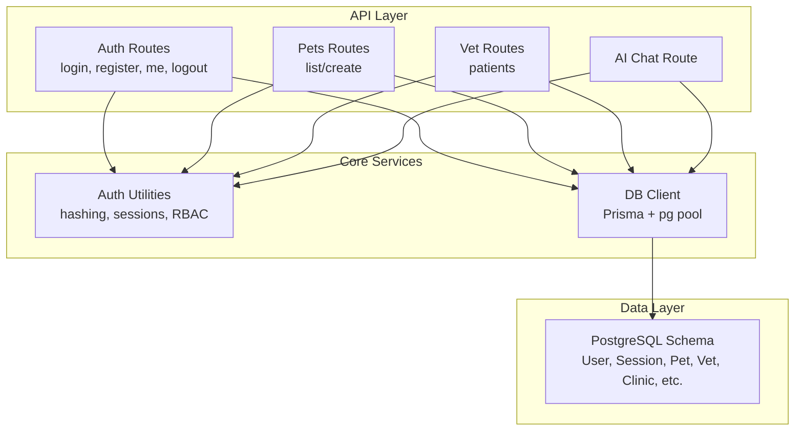
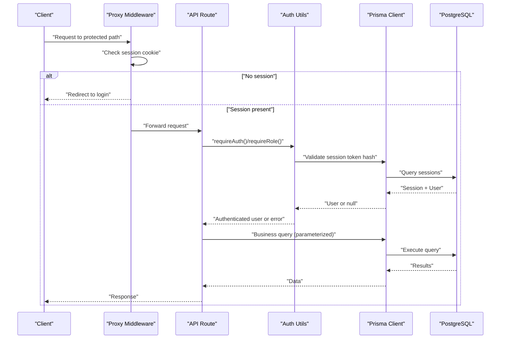
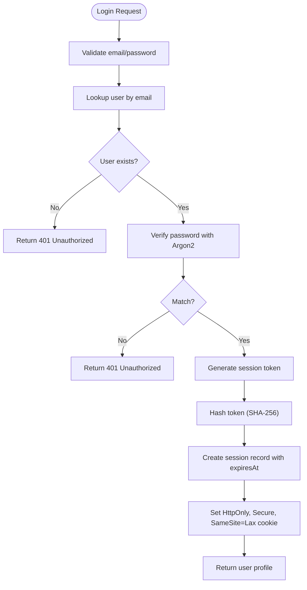
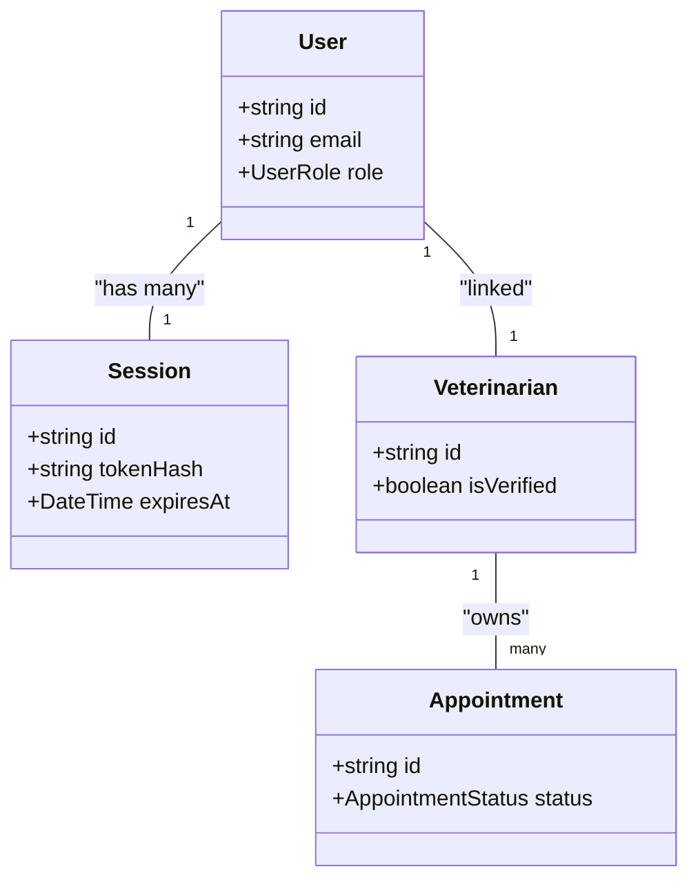
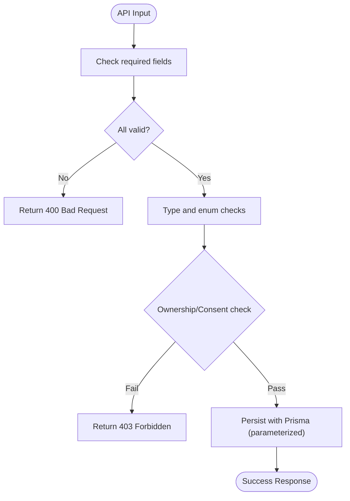
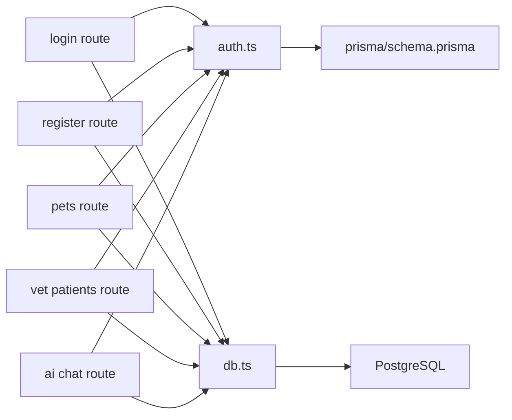

# Security Best Practices

<cite>
**Referenced Files in This Document**
- [auth.ts](file://lib/auth.ts)
- [schema.prisma](file://prisma/schema.prisma)
- [06-security.md](file://docs/03-architecture/06-security.md)
- [login route.ts](file://app/api/auth/login/route.ts)
- [register route.ts](file://app/api/auth/register/route.ts)
- [me route.ts](file://app/api/auth/me/route.ts)
- [logout route.ts](file://app/api/auth/logout/route.ts)
- [pets route.ts](file://app/api/pets/route.ts)
- [vet patients route.ts](file://app/api/vet/patients/route.ts)
- [db.ts](file://lib/db.ts)
- [proxy.ts](file://proxy.ts)
- [next.config.ts](file://next.config.ts)
- [ai chat route.ts](file://app/api/ai/chat/route.ts)
</cite>

## Table of Contents
1. Introduction
2. Project Structure
3. Core Components
4. Architecture Overview
5. Detailed Component Analysis
6. Dependency Analysis
7. Performance Considerations
8. Troubleshooting Guide
9. Conclusion
10. Appendices

## Introduction
This document provides comprehensive security best practices for the PETIVA Pet Healthcare Ecosystem. It covers authentication and authorization patterns, session handling, role-based access control (RBAC), input validation and sanitization, data protection (password hashing with Argon2, secure cookies), API security (CORS, rate limiting, request validation), database security (parameterized queries, SQL injection prevention, schema-level controls), handling sensitive pet health information, and security testing approaches. The guidance is grounded in the repository’s implementation and design documents.

## Project Structure
Security-relevant code spans several layers:
- Authentication and session utilities in lib/auth.ts
- API routes under app/api for auth, pets, vet, and AI chat
- Database schema and models in prisma/schema.prisma
- Database connection configuration in lib/db.ts
- Routing-level protection via proxy.ts
- Security architecture notes in docs/03-architecture/06-security.md
- Next.js configuration in next.config.ts

**Diagram sources**
- [auth.ts:1-125](file://lib/auth.ts#L1-L125)
- [db.ts:1-33](file://lib/db.ts#L1-L33)
- [schema.prisma:1-312](file://prisma/schema.prisma#L1-L312)
- [login route.ts:1-58](file://app/api/auth/login/route.ts#L1-L58)
- [register route.ts:1-78](file://app/api/auth/register/route.ts#L1-L78)
- [pets route.ts:1-69](file://app/api/pets/route.ts#L1-L69)
- [vet patients route.ts:1-71](file://app/api/vet/patients/route.ts#L1-L71)
- [ai chat route.ts:1-347](file://app/api/ai/chat/route.ts#L1-L347)

**Section sources**
- [auth.ts:1-125](file://lib/auth.ts#L1-L125)
- [db.ts:1-33](file://lib/db.ts#L1-L33)
- [schema.prisma:1-312](file://prisma/schema.prisma#L1-L312)
- [06-security.md:1-90](file://docs/03-architecture/06-security.md#L1-L90)

## Core Components
- Authentication and session management:
  - Password hashing with Argon2 and verification helpers
  - Secure session token generation, hashing, storage, and validation
  - HTTP-only, Secure, SameSite=Lax cookie configuration
  - Server-side user retrieval and role checks
- Authorization:
  - Role-based access control using UserRole enum
  - Resource-level ownership checks (e.g., pet owner)
  - Consent-based access for veterinarians based on confirmed appointments
- Input validation and sanitization:
  - Required field checks and type validation at API boundaries
  - Minimal PII exposure to external services (AI prompts)
- Data protection:
  - Argon2 password hashing
  - Secure cookie settings
  - Private object storage with short-lived presigned URLs
- Database security:
  - Prisma parameterized queries prevent SQL injection
  - Schema-enforced relationships and constraints
- API security:
  - Protected routes via middleware/proxy and per-route guards
  - Rate limiting guidance for auth endpoints and AI chat
  - Request validation before DB operations

**Section sources**
- [auth.ts:10-125](file://lib/auth.ts#L10-L125)
- [schema.prisma:9-66](file://prisma/schema.prisma#L9-L66)
- [06-security.md:7-65](file://docs/03-architecture/06-security.md#L7-L65)
- [login route.ts:5-48](file://app/api/auth/login/route.ts#L5-L48)
- [register route.ts:6-68](file://app/api/auth/register/route.ts#L6-L68)
- [pets route.ts:6-69](file://app/api/pets/route.ts#L6-L69)
- [vet patients route.ts:6-71](file://app/api/vet/patients/route.ts#L6-L71)
- [ai chat route.ts:68-347](file://app/api/ai/chat/route.ts#L68-L347)

## Architecture Overview
The system enforces a layered security model:
- Edge routing protection checks for session presence on protected paths
- API routes enforce authentication and authorization before processing
- Service layer validates inputs and applies business rules
- Data layer uses Prisma to execute safe, parameterized queries against PostgreSQL

**Diagram sources**
- [proxy.ts:1-34](file://proxy.ts#L1-L34)
- [auth.ts:100-125](file://lib/auth.ts#L100-L125)
- [db.ts:1-33](file://lib/db.ts#L1-L33)
- [schema.prisma:55-66](file://prisma/schema.prisma#L55-L66)

## Detailed Component Analysis

### Authentication and Session Management
- Password hashing and verification use Argon2 for strong resistance to brute-force attacks.
- Session tokens are generated cryptographically, hashed before storage, and validated server-side.
- Cookies are set with httpOnly, secure (in production), sameSite lax, and explicit expiry.
- Logout invalidates the session and clears the cookie.

**Diagram sources**
- [login route.ts:5-48](file://app/api/auth/login/route.ts#L5-L48)
- [auth.ts:10-44](file://lib/auth.ts#L10-L44)
- [auth.ts:83-97](file://lib/auth.ts#L83-L97)

**Section sources**
- [auth.ts:10-97](file://lib/auth.ts#L10-L97)
- [login route.ts:5-48](file://app/api/auth/login/route.ts#L5-L48)
- [logout route.ts:5-25](file://app/api/auth/logout/route.ts#L5-L25)

### Authorization and RBAC
- Roles are defined in the schema and enforced via requireRole in API routes.
- Veterinarian access to patient data is gated by confirmed appointments (consent-based).
- Pet owners can only access their own pets; resource ownership is checked explicitly.

**Diagram sources**
- [schema.prisma:9-66](file://prisma/schema.prisma#L9-L66)
- [schema.prisma:90-182](file://prisma/schema.prisma#L90-L182)
- [auth.ts:117-125](file://lib/auth.ts#L117-L125)
- [vet patients route.ts:6-71](file://app/api/vet/patients/route.ts#L6-L71)

**Section sources**
- [auth.ts:117-125](file://lib/auth.ts#L117-L125)
- [vet patients route.ts:6-71](file://app/api/vet/patients/route.ts#L6-L71)
- [pets route.ts:6-69](file://app/api/pets/route.ts#L6-L69)

### Input Validation and Sanitization
- Registration validates required fields, role enumeration, and password length.
- Login validates presence of credentials and returns generic errors to avoid enumeration.
- Pets creation validates required fields and coerces types safely.
- AI chat endpoint enforces ownership and limits context size to reduce risk and cost.

**Diagram sources**
- [register route.ts:6-68](file://app/api/auth/register/route.ts#L6-L68)
- [pets route.ts:30-69](file://app/api/pets/route.ts#L30-L69)
- [ai chat route.ts:68-143](file://app/api/ai/chat/route.ts#L68-L143)

**Section sources**
- [register route.ts:6-68](file://app/api/auth/register/route.ts#L6-L68)
- [pets route.ts:30-69](file://app/api/pets/route.ts#L30-L69)
- [ai chat route.ts:68-143](file://app/api/ai/chat/route.ts#L68-L143)

### Data Protection Measures
- Passwords are hashed with Argon2 before storage.
- Sensitive session tokens are hashed before persistence and stored with expiration.
- Cookies are configured with httpOnly, secure (production), and sameSite lax.
- Object storage is private; files accessed via short-lived presigned URLs.
- Secrets are managed via environment variables and never committed.

**Section sources**
- [auth.ts:10-44](file://lib/auth.ts#L10-L44)
- [auth.ts:83-97](file://lib/auth.ts#L83-L97)
- [06-security.md:51-65](file://docs/03-architecture/06-security.md#L51-L65)

### API Security: CORS, Rate Limiting, and Request Validation
- CORS: No explicit CORS configuration found in next.config.ts; ensure appropriate headers are set if cross-origin requests are needed.
- Rate limiting:
  - Auth endpoints should implement strict rate limiting (documented guidance).
  - AI chat endpoints use streaming and message limits to mitigate abuse.
- Request validation:
  - All endpoints validate inputs before processing and return standardized error responses.

**Section sources**
- [next.config.ts:1-8](file://next.config.ts#L1-L8)
- [06-security.md:7-13](file://docs/03-architecture/06-security.md#L7-L13)
- [ai chat route.ts:137-143](file://app/api/ai/chat/route.ts#L137-L143)

### Database Security Practices
- Parameterized queries: Prisma ensures parameterized SQL, preventing SQL injection.
- Access control:
  - Schema enforces relationships and constraints.
  - Sessions table indexes support efficient lookup and cleanup.
- Auditability:
  - AuditLog model supports tracking sensitive operations.

**Section sources**
- [db.ts:1-33](file://lib/db.ts#L1-L33)
- [schema.prisma:55-66](file://prisma/schema.prisma#L55-L66)
- [schema.prisma:298-312](file://prisma/schema.prisma#L298-L312)

### Handling Sensitive Pet Health Information
- Data minimization: Only necessary fields are sent to AI providers; PII is omitted from prompts.
- Ownership and consent:
  - Owners access only their pets.
  - Veterinarians access records only when an active or confirmed appointment exists.
- Storage:
  - Medical records and related entities are modeled with clear relationships and indexes.
  - Documents stored privately with hashed filenames and short-lived access.

**Section sources**
- [06-security.md:66-78](file://docs/03-architecture/06-security.md#L66-L78)
- [ai chat route.ts:83-126](file://app/api/ai/chat/route.ts#L83-L126)
- [schema.prisma:133-162](file://prisma/schema.prisma#L133-L162)
- [schema.prisma:246-258](file://prisma/schema.prisma#L246-L258)

### Security Testing and Vulnerability Assessment
- Functional tests:
  - Use test scripts to exercise auth flows and API endpoints.
- Threat modeling:
  - Focus on credential stuffing, unauthorized access to medical records, and prompt injection.
- Code review and static analysis:
  - Ensure all secrets remain in environment variables.
  - Validate that all DB interactions use Prisma clients.
- Penetration testing:
  - Validate rate limiting on auth and AI endpoints.
  - Confirm session hijacking protections (httpOnly, secure cookies).

**Section sources**
- [test_deepseek_openrouter.js:1-39](file://test_deepseek_openrouter.js#L1-L39)
- [06-security.md:7-13](file://docs/03-architecture/06-security.md#L7-L13)
- [06-security.md:66-78](file://docs/03-architecture/06-security.md#L66-L78)

## Dependency Analysis
- API routes depend on:
  - Auth utilities for authentication and authorization
  - Prisma client for database operations
- Auth utilities depend on:
  - Next.js cookies API
  - Argon2 for password hashing
  - Node crypto for token hashing
- Database layer depends on:
  - PostgreSQL driver pool configuration
  - Prisma schema definitions

**Diagram sources**
- [login route.ts:1-58](file://app/api/auth/login/route.ts#L1-L58)
- [register route.ts:1-78](file://app/api/auth/register/route.ts#L1-L78)
- [pets route.ts:1-69](file://app/api/pets/route.ts#L1-L69)
- [vet patients route.ts:1-71](file://app/api/vet/patients/route.ts#L1-L71)
- [ai chat route.ts:1-347](file://app/api/ai/chat/route.ts#L1-L347)
- [auth.ts:1-125](file://lib/auth.ts#L1-L125)
- [db.ts:1-33](file://lib/db.ts#L1-L33)
- [schema.prisma:1-312](file://prisma/schema.prisma#L1-L312)

**Section sources**
- [auth.ts:1-125](file://lib/auth.ts#L1-L125)
- [db.ts:1-33](file://lib/db.ts#L1-L33)
- [schema.prisma:1-312](file://prisma/schema.prisma#L1-L312)

## Performance Considerations
- Session validation includes sliding window expiration to reduce re-authentication while maintaining security.
- AI chat limits conversation history to recent messages to control context size and costs.
- Database indexes on frequently queried fields (sessions, appointments, medical records) improve performance.

[No sources needed since this section provides general guidance]

## Troubleshooting Guide
- Unauthenticated access:
  - Ensure session cookie is present and not expired.
  - Verify requireAuth() throws UNAUTHENTICATED and routes handle it appropriately.
- Forbidden access:
  - Confirm role checks and ownership/consent validations pass.
- Database errors:
  - Check Prisma client initialization and connection pooling.
  - Review schema constraints and indexes.

**Section sources**
- [auth.ts:100-125](file://lib/auth.ts#L100-L125)
- [pets route.ts:16-27](file://app/api/pets/route.ts#L16-L27)
- [vet patients route.ts:58-69](file://app/api/vet/patients/route.ts#L58-L69)
- [db.ts:1-33](file://lib/db.ts#L1-L33)

## Conclusion
PETIVA implements robust security measures including Argon2 password hashing, secure session management with HTTP-only cookies, RBAC with consent-based access, input validation, and parameterized database queries. The architecture emphasizes data minimization, private storage, and auditability. Adhering to these practices helps protect sensitive pet health information and aligns with healthcare data protection principles.

[No sources needed since this section summarizes without analyzing specific files]

## Appendices

### Appendix A: Cookie Configuration Reference
- Name: session_token
- Flags: httpOnly, secure (production), sameSite lax, path /, explicit expiry

**Section sources**
- [auth.ts:83-97](file://lib/auth.ts#L83-L97)
- [proxy.ts:1-34](file://proxy.ts#L1-L34)

### Appendix B: Role Definitions and Access Boundaries
- Roles: PET_OWNER, VETERINARIAN, CLINIC_ADMIN, PLATFORM_ADMIN
- Boundaries:
  - Pet owners: own profiles and pets
  - Veterinarians: limited access based on confirmed appointments
  - Clinic admins: clinic management without direct medical record access unless assigned
  - Platform admins: verification and moderation

**Section sources**
- [schema.prisma:9-14](file://prisma/schema.prisma#L9-L14)
- [06-security.md:43-47](file://docs/03-architecture/06-security.md#L43-L47)