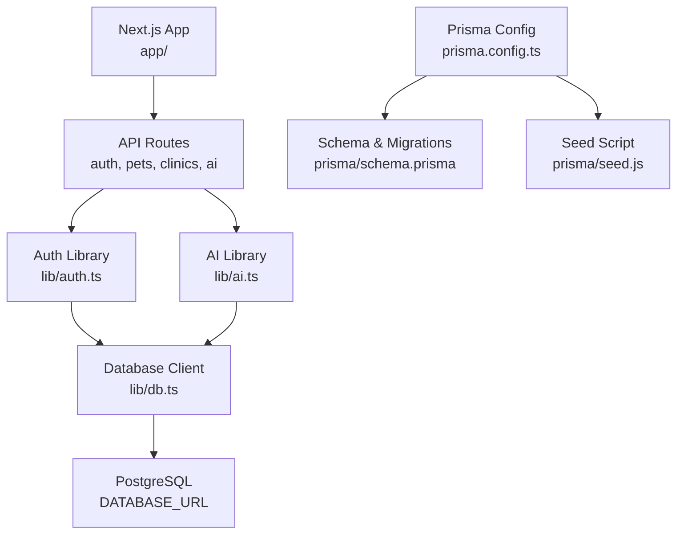
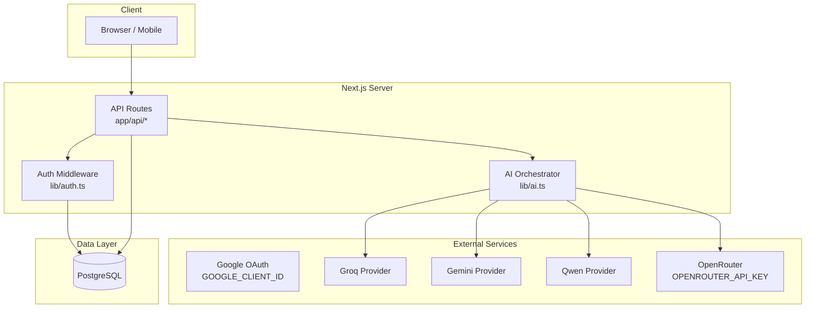
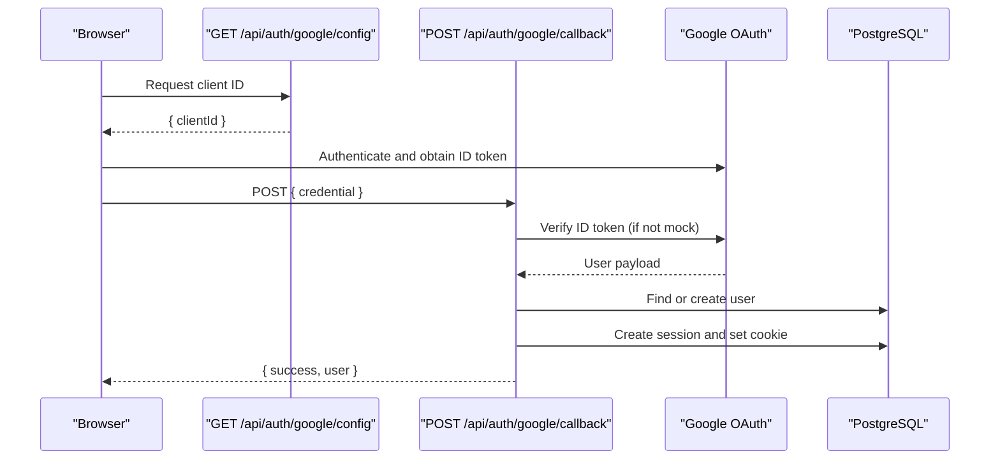
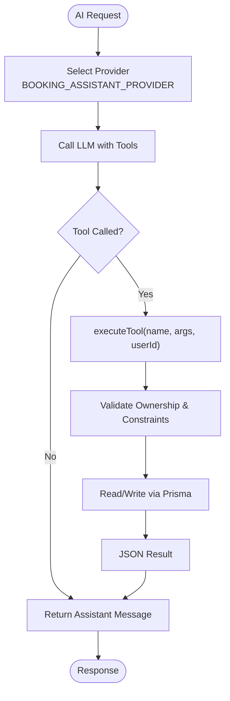
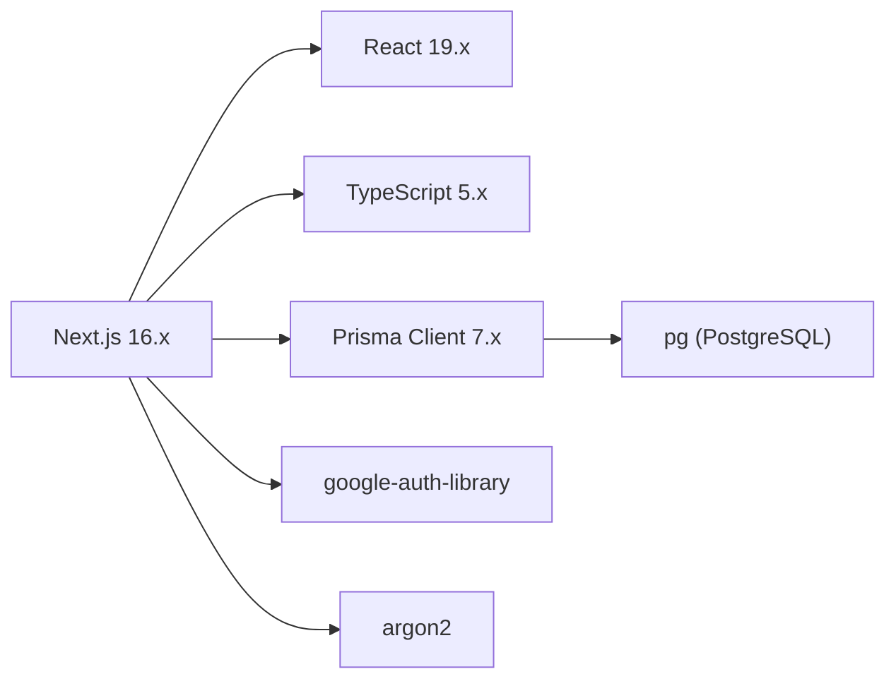

# Getting Started

<cite>
**Referenced Files in This Document**
- [package.json](file://package.json)
- [README.md](file://README.md)
- [next.config.ts](file://next.config.ts)
- [prisma/schema.prisma](file://prisma/schema.prisma)
- [prisma.config.ts](file://prisma.config.ts)
- [lib/db.ts](file://lib/db.ts)
- [lib/auth.ts](file://lib/auth.ts)
- [lib/ai.ts](file://lib/ai.ts)
- [app/api/auth/google/config/route.ts](file://app/api/auth/google/config/route.ts)
- [app/api/auth/google/callback/route.ts](file://app/api/auth/google/callback/route.ts)
- [prisma/seed.js](file://prisma/seed.js)
</cite>

## Table of Contents
1. Introduction
2. Project Structure
3. Core Components
4. Architecture Overview
5. Detailed Component Analysis
6. Dependency Analysis
7. Performance Considerations
8. Troubleshooting Guide
9. Conclusion
10. Appendices

## Introduction
This guide helps you set up and run the PETIVA Pet Healthcare Ecosystem locally for development. It covers prerequisites, environment configuration, database setup with PostgreSQL, Prisma migrations and seeding, Google OAuth configuration, AI provider credentials, running the development server, and verification steps to confirm a successful installation.

## Project Structure
The project is a Next.js application using TypeScript, Prisma ORM with PostgreSQL, and optional AI integrations. Key areas:
- app/: Next.js App Router API routes (authentication, appointments, pets, clinics, vet tools, AI chat)
- lib/: Shared libraries for database connection, authentication, and AI providers
- prisma/: Database schema, migrations, and seed script
- Configuration files for Next.js and Prisma

**Diagram sources**
- [next.config.ts:1-8](file://next.config.ts#L1-L8)
- [prisma.config.ts:1-16](file://prisma.config.ts#L1-L16)
- [lib/db.ts:1-33](file://lib/db.ts#L1-L33)
- [lib/auth.ts:1-125](file://lib/auth.ts#L1-L125)
- [lib/ai.ts:1-140](file://lib/ai.ts#L1-L140)
- [prisma/schema.prisma:1-312](file://prisma/schema.prisma#L1-L312)
- [prisma/seed.js:1-430](file://prisma/seed.js#L1-L430)

**Section sources**
- [package.json:1-35](file://package.json#L1-L35)
- [README.md:1-37](file://README.md#L1-L37)
- [next.config.ts:1-8](file://next.config.ts#L1-L8)

## Core Components
- Database layer: Prisma client configured via environment variables and a connection pool; production uses a dedicated pg pool, development reuses global instances to avoid hot-reload issues.
- Authentication: Session-based auth with secure cookies, password hashing with Argon2, and Google OAuth flow that creates or finds users and sets session cookies.
- AI integration: Pluggable providers (Groq, Gemini, Qwen, OpenRouter) selected by an environment variable; includes tool definitions for pet data access and appointment booking.
- Data model: Comprehensive Prisma schema covering users, pets, veterinarians, clinics, appointments, medical records, and related entities.

**Section sources**
- [lib/db.ts:1-33](file://lib/db.ts#L1-L33)
- [lib/auth.ts:1-125](file://lib/auth.ts#L1-L125)
- [lib/ai.ts:1-140](file://lib/ai.ts#L1-L140)
- [prisma/schema.prisma:1-312](file://prisma/schema.prisma#L1-L312)

## Architecture Overview
High-level runtime architecture showing how requests are handled, authenticated, and optionally processed by AI services while persisting data to PostgreSQL.

**Diagram sources**
- [lib/auth.ts:1-125](file://lib/auth.ts#L1-L125)
- [lib/ai.ts:1-140](file://lib/ai.ts#L1-L140)
- [lib/db.ts:1-33](file://lib/db.ts#L1-L33)
- [app/api/auth/google/config/route.ts:1-7](file://app/api/auth/google/config/route.ts#L1-L7)
- [app/api/auth/google/callback/route.ts:1-97](file://app/api/auth/google/callback/route.ts#L1-L97)

## Detailed Component Analysis

### Environment Setup and Prerequisites
- Node.js: Use a recent LTS version compatible with Next.js 16.x and TypeScript 5.x as indicated by dependencies.
- Package manager: npm, yarn, pnpm, or bun are supported per scripts.
- PostgreSQL: Ensure a running PostgreSQL instance and a valid DATABASE_URL pointing to it.
- Optional: For AI features, configure provider keys and model selection. For Google OAuth, configure your client ID.

Environment variables used by the application:
- DATABASE_URL: Required for all operations.
- GOOGLE_CLIENT_ID: Required for Google OAuth login.
- OPENROUTER_API_KEY and OPENROUTER_MODEL: Used by the OpenRouter provider when enabled.
- BOOKING_ASSISTANT_PROVIDER: Selects active AI provider (e.g., groq, gemini, qwen). Defaults to a fallback strategy if unset.

Where these are read:
- Database URL is consumed by the Prisma client and seed script.
- Google client ID is read by the OAuth config and callback routes.
- AI provider settings are read by the AI library.

**Section sources**
- [package.json:11-32](file://package.json#L11-L32)
- [lib/db.ts:8-29](file://lib/db.ts#L8-L29)
- [prisma.config.ts:6-15](file://prisma.config.ts#L6-L15)
- [app/api/auth/google/config/route.ts:1-7](file://app/api/auth/google/config/route.ts#L1-L7)
- [app/api/auth/google/callback/route.ts:21-41](file://app/api/auth/google/callback/route.ts#L21-L41)
- [lib/ai.ts:32-39](file://lib/ai.ts#L32-L39)
- [lib/ai.ts:105-139](file://lib/ai.ts#L105-L139)

### Installation Steps
1. Clone the repository and install dependencies:
   - Use your preferred package manager to install packages defined in the project manifest.
2. Configure environment variables:
   - Create a local environment file and set DATABASE_URL, GOOGLE_CLIENT_ID, and any AI provider variables you plan to use.
3. Initialize the database:
   - Apply Prisma migrations to create tables.
   - Run the seed script to populate sample data (users, clinics, pets, appointments, etc.).
4. Start the development server:
   - Launch the Next.js dev server and open the local URL in your browser.

Verification:
- Confirm the app loads at the local development URL.
- Test Google OAuth login using the configured client ID or development mock token support.
- Optionally test AI chat endpoints if AI provider credentials are set.

**Section sources**
- [package.json:5-10](file://package.json#L5-L10)
- [README.md:3-17](file://README.md#L3-L17)
- [prisma.config.ts:6-15](file://prisma.config.ts#L6-L15)
- [prisma/seed.js:30-418](file://prisma/seed.js#L30-L418)

### Database Initialization with Prisma
- Migration execution:
  - Use the Prisma CLI to apply migrations defined under the migrations directory. The Prisma config points to the schema and migration path.
- Seeding:
  - The seed script connects to the database using the same connection string and inserts sample data across multiple models (users, clinics, vets, pets, appointments, medical records, etc.).
  - It supports both standard PostgreSQL URLs and Prisma’s special connection format by decoding embedded database URLs when present.

Important notes:
- Ensure DATABASE_URL is correctly set before running migrations and seeds.
- Re-running seeds is safe due to upsert patterns and deletions of dependent rows where necessary.

**Section sources**
- [prisma.config.ts:6-15](file://prisma.config.ts#L6-L15)
- [prisma/schema.prisma:1-312](file://prisma/schema.prisma#L1-L312)
- [prisma/seed.js:1-430](file://prisma/seed.js#L1-L430)

### Authentication Flow (Google OAuth)
The Google OAuth flow consists of two main endpoints:
- Config endpoint returns the configured client ID to the client.
- Callback endpoint verifies the Google ID token (or accepts a mock token in development), creates or retrieves the user, generates a session, and sets a secure cookie.

**Diagram sources**
- [app/api/auth/google/config/route.ts:1-7](file://app/api/auth/google/config/route.ts#L1-L7)
- [app/api/auth/google/callback/route.ts:1-97](file://app/api/auth/google/callback/route.ts#L1-L97)
- [lib/auth.ts:32-97](file://lib/auth.ts#L32-L97)

**Section sources**
- [app/api/auth/google/config/route.ts:1-7](file://app/api/auth/google/config/route.ts#L1-L7)
- [app/api/auth/google/callback/route.ts:1-97](file://app/api/auth/google/callback/route.ts#L1-L97)
- [lib/auth.ts:1-125](file://lib/auth.ts#L1-L125)

### AI Integration and Tool Execution
The AI subsystem selects an active provider based on an environment variable and can fall back to another provider if the primary fails. It exposes a set of tools that allow the assistant to query pet data and manage appointments.

Key behaviors:
- Provider selection: Choose between Groq, Gemini, Qwen, or a fallback chain.
- Tool execution: Validates ownership of pets and enforces constraints such as working hours and past-date checks before creating bookings.
- Error handling: Throws descriptive errors when required credentials are missing or when external APIs return non-OK responses.

**Diagram sources**
- [lib/ai.ts:105-139](file://lib/ai.ts#L105-L139)
- [lib/ai.ts:141-281](file://lib/ai.ts#L141-L281)
- [lib/ai.ts:283-467](file://lib/ai.ts#L283-L467)

**Section sources**
- [lib/ai.ts:1-140](file://lib/ai.ts#L1-L140)
- [lib/ai.ts:141-281](file://lib/ai.ts#L141-L281)
- [lib/ai.ts:283-467](file://lib/ai.ts#L283-L467)

## Dependency Analysis
Core runtime dependencies include Next.js, React, Prisma client and adapter for PostgreSQL, Google OAuth library, and Argon2 for password hashing. Development dependencies cover TypeScript, ESLint, Tailwind CSS, and Prisma CLI.

**Diagram sources**
- [package.json:11-32](file://package.json#L11-L32)

**Section sources**
- [package.json:11-32](file://package.json#L11-L32)

## Performance Considerations
- Connection pooling: In production, a dedicated pg pool is used to optimize database connections. In development, a global pool prevents duplication during hot reloads.
- Session sliding expiration: Sessions are extended when nearing expiry to improve UX without frequent re-authentication.
- AI provider fallback: If the primary provider fails, the system automatically tries a secondary provider to maintain availability.

[No sources needed since this section provides general guidance]

## Troubleshooting Guide
Common setup issues and resolutions:
- Missing DATABASE_URL:
  - Symptom: Database connection errors during migrations, seeding, or runtime.
  - Resolution: Set DATABASE_URL to a valid PostgreSQL connection string before running Prisma commands or starting the server.
- Google OAuth failures:
  - Symptom: Callback returns unauthorized or internal server error.
  - Resolution: Ensure GOOGLE_CLIENT_ID is set and matches the Google Cloud project configuration. In development, you can use the mock token pattern to bypass verification.
- AI provider errors:
  - Symptom: Errors indicating missing API keys or invalid responses.
  - Resolution: Set OPENROUTER_API_KEY (and optionally OPENROUTER_MODEL) if using OpenRouter, or configure BOOKING_ASSISTANT_PROVIDER to a provider whose credentials are set. The system will log diagnostics and may fall back to another provider.
- Seed script connection issues:
  - Symptom: Seed fails to connect or decode API key.
  - Resolution: Verify DATABASE_URL format; the seed supports standard URLs and Prisma’s special format by decoding embedded database URLs when present.

**Section sources**
- [lib/db.ts:8-29](file://lib/db.ts#L8-L29)
- [app/api/auth/google/callback/route.ts:21-41](file://app/api/auth/google/callback/route.ts#L21-L41)
- [lib/ai.ts:32-47](file://lib/ai.ts#L32-L47)
- [lib/ai.ts:105-139](file://lib/ai.ts#L105-L139)
- [prisma/seed.js:7-28](file://prisma/seed.js#L7-L28)

## Conclusion
You now have the essential information to set up the PETIVA Pet Healthcare Ecosystem locally, configure environment variables, initialize the database, and run the development server. Use the troubleshooting tips to resolve common issues and verify functionality through Google OAuth and optional AI features.

[No sources needed since this section summarizes without analyzing specific files]

## Appendices

### Quick Commands
- Install dependencies: Use your package manager to install packages listed in the project manifest.
- Run migrations: Apply Prisma migrations using the Prisma CLI configured in the project.
- Seed database: Execute the seed script configured in the Prisma config.
- Start development server: Launch the Next.js dev server and open the local URL.

**Section sources**
- [package.json:5-10](file://package.json#L5-L10)
- [prisma.config.ts:6-15](file://prisma.config.ts#L6-L15)
- [README.md:3-17](file://README.md#L3-L17)