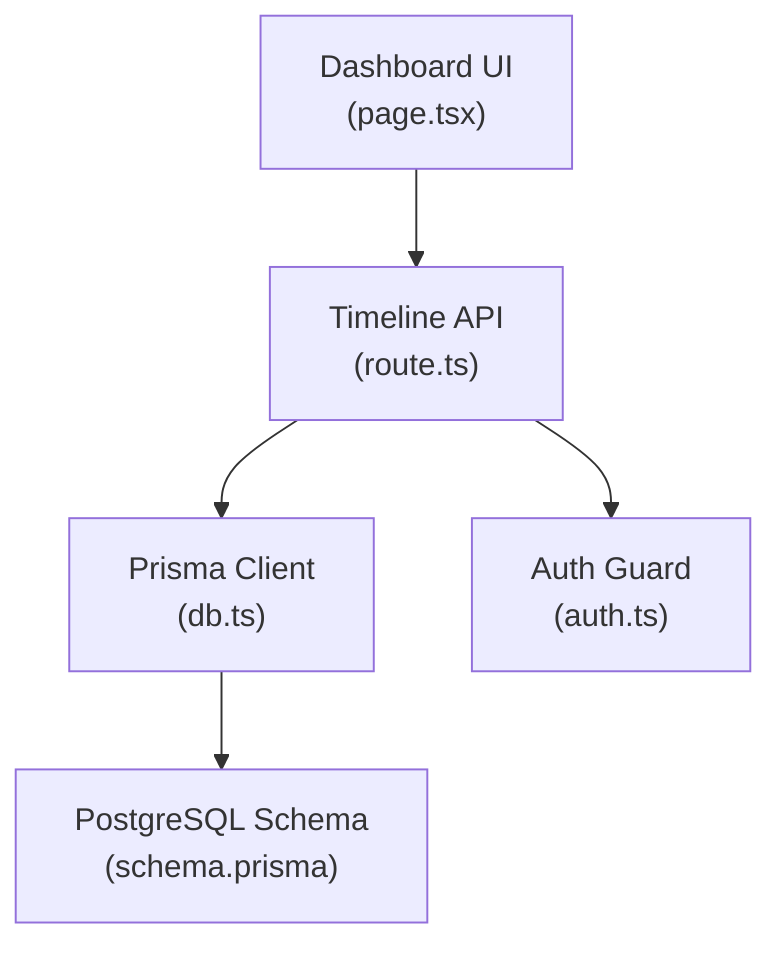
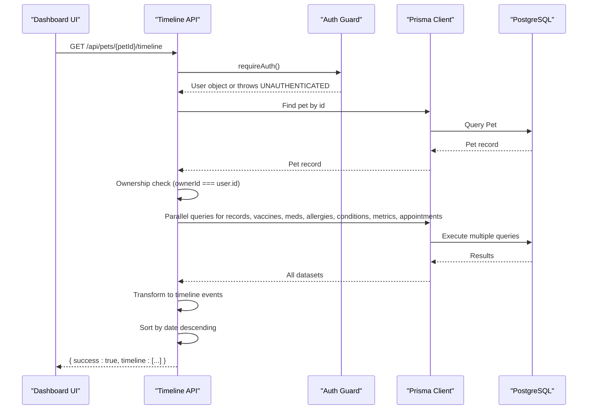
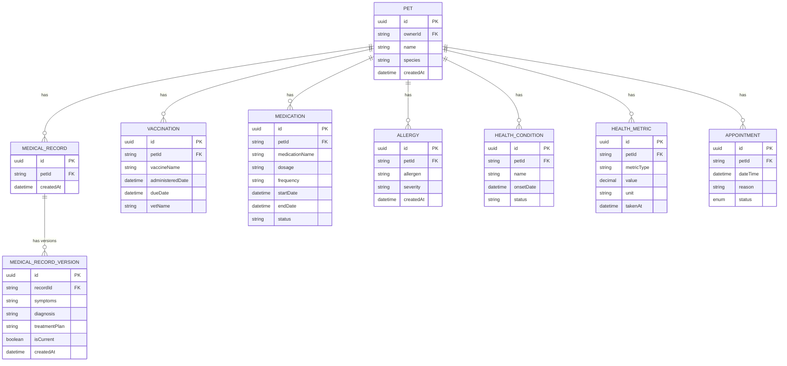
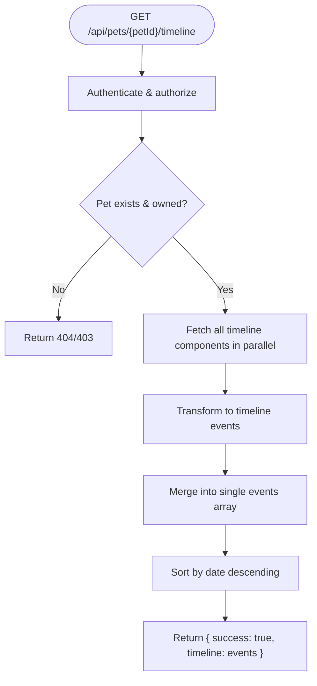
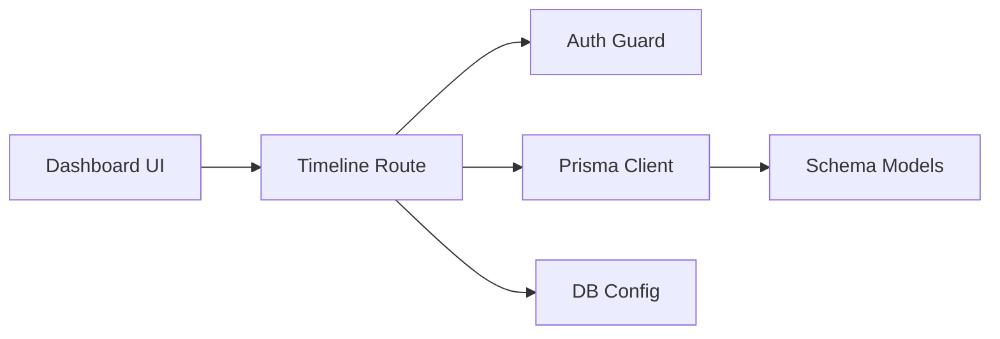

# Health Timeline

<cite>
**Referenced Files in This Document**
- [route.ts](file://app/api/pets/[petId]/timeline/route.ts)
- [schema.prisma](file://prisma/schema.prisma)
- [page.tsx](file://app/dashboard/page.tsx)
- [auth.ts](file://lib/auth.ts)
- [db.ts](file://lib/db.ts)
</cite>

## Table of Contents
1. [Introduction](#introduction)
2. [Project Structure](#project-structure)
3. [Core Components](#core-components)
4. [Architecture Overview](#architecture-overview)
5. [Detailed Component Analysis](#detailed-component-analysis)
6. [Dependency Analysis](#dependency-analysis)
7. [Performance Considerations](#performance-considerations)
8. [Troubleshooting Guide](#troubleshooting-guide)
9. [Conclusion](#conclusion)
10. [Appendices](#appendices)

## Introduction
This document describes the Health Timeline feature in PETIVA, which aggregates diverse health events into a single chronological view for each pet. It covers the data model, aggregation logic, API endpoints, data transformation processes, performance considerations, example workflows, and visualization patterns used to present timeline information effectively.

## Project Structure
The Health Timeline is implemented as a server-side API endpoint that consolidates multiple pet-related entities into a unified event list. The frontend consumes this endpoint to render an overview and recent activity on the dashboard.

**Diagram sources**
- [route.ts:1-149](file://app/api/pets/[petId]/timeline/route.ts#L1-L149)
- [page.tsx:593-719](file://app/dashboard/page.tsx#L593-L719)
- [db.ts:1-33](file://lib/db.ts#L1-L33)
- [schema.prisma:68-244](file://prisma/schema.prisma#L68-L244)
- [auth.ts:109-115](file://lib/auth.ts#L109-L115)

**Section sources**
- [route.ts:1-149](file://app/api/pets/[petId]/timeline/route.ts#L1-L149)
- [page.tsx:593-719](file://app/dashboard/page.tsx#L593-L719)
- [schema.prisma:68-244](file://prisma/schema.prisma#L68-L244)
- [auth.ts:109-115](file://lib/auth.ts#L109-L115)
- [db.ts:1-33](file://lib/db.ts#L1-L33)

## Core Components
- Timeline API endpoint: Aggregates medical records, vaccinations, medications, allergies, conditions, metrics, and appointments into a unified timeline for a given pet.
- Data model: Prisma schema defines the entities and relationships that feed the timeline.
- Authentication guard: Ensures only authenticated owners can access their pet’s timeline.
- Dashboard UI: Displays summary counts and recent timeline entries.

Key responsibilities:
- Validate ownership and permissions before returning any data.
- Fetch all relevant entities in parallel for efficiency.
- Normalize heterogeneous records into a consistent event shape with type, date, title, description, and metadata.
- Sort events chronologically (newest first).
- Return a structured JSON response consumed by the UI.

**Section sources**
- [route.ts:10-135](file://app/api/pets/[petId]/timeline/route.ts#L10-L135)
- [schema.prisma:68-244](file://prisma/schema.prisma#L68-L244)
- [auth.ts:109-115](file://lib/auth.ts#L109-L115)
- [page.tsx:593-719](file://app/dashboard/page.tsx#L593-L719)

## Architecture Overview
The timeline architecture follows a simple request-response flow with clear separation between presentation, business logic, and data persistence.

**Diagram sources**
- [route.ts:10-135](file://app/api/pets/[petId]/timeline/route.ts#L10-L135)
- [auth.ts:109-115](file://lib/auth.ts#L109-L115)
- [db.ts:1-33](file://lib/db.ts#L1-L33)
- [schema.prisma:68-244](file://prisma/schema.prisma#L68-L244)

## Detailed Component Analysis

### Timeline Data Model
The timeline aggregates the following entity types from the database:
- Medical Record (with current version)
- Vaccination
- Medication
- Allergy
- Health Condition
- Health Metric
- Appointment

Each entity contributes one timeline event with a normalized structure:
- type: string identifier for the event category
- date: timestamp used for sorting
- title: human-readable headline
- description: additional context
- meta: optional key-value details specific to the event type

**Diagram sources**
- [schema.prisma:68-244](file://prisma/schema.prisma#L68-L244)

**Section sources**
- [schema.prisma:68-244](file://prisma/schema.prisma#L68-L244)

### Timeline Aggregation Logic
The endpoint performs these steps:
1. Authenticate the user and verify ownership of the requested pet.
2. Retrieve all relevant datasets in parallel using Promise.all for optimal throughput.
3. Map each dataset to a uniform timeline event object.
4. Merge all events into a single array.
5. Sort events by date in descending order (newest first).
6. Return the aggregated timeline.

**Diagram sources**
- [route.ts:10-135](file://app/api/pets/[petId]/timeline/route.ts#L10-L135)

**Section sources**
- [route.ts:10-135](file://app/api/pets/[petId]/timeline/route.ts#L10-L135)

### API Endpoints
- Endpoint: GET /api/pets/[petId]/timeline
- Purpose: Retrieve a unified, chronological timeline of health events for a specific pet.
- Authentication: Requires a valid session; enforces pet ownership.
- Request parameters:
  - petId: path parameter identifying the pet.
- Response:
  - success: boolean
  - timeline: array of events with fields type, date, title, description, meta
- Error responses:
  - 401 UNAUTHORIZED if not logged in
  - 403 FORBIDDEN if not the pet owner
  - 404 NOT_FOUND if pet does not exist
  - 500 INTERNAL_SERVER_ERROR for unexpected errors

Notes:
- Filtering by event type and date range are currently performed client-side in the dashboard.
- Pagination is not implemented in the endpoint; the UI limits displayed items to a small number for previews.

**Section sources**
- [route.ts:5-135](file://app/api/pets/[petId]/timeline/route.ts#L5-L135)
- [page.tsx:593-719](file://app/dashboard/page.tsx#L593-L719)

### Data Transformation Processes
The endpoint normalizes different entity types into a consistent event format:
- Medical Record: Uses the current version to derive diagnosis and treatment plan; includes symptoms and notes in meta.
- Vaccination: Title indicates vaccine name; description shows next booster due date when available; vet name included in meta.
- Medication: Title indicates start of medication; description includes dosage and frequency; status and end date in meta.
- Allergy: Title indicates allergen; description includes severity; empty meta.
- Health Condition: Title indicates condition name; description includes status; empty meta.
- Health Metric: Title indicates metric type; description includes value and unit; empty meta.
- Appointment: Title indicates reason; description includes status; vet and clinic IDs in meta.

This normalization ensures the UI can render a homogeneous timeline regardless of source entity.

**Section sources**
- [route.ts:58-130](file://app/api/pets/[petId]/timeline/route.ts#L58-L130)

### Visualization and UI Patterns
The dashboard uses the timeline to:
- Show summary cards counting vaccinations, active medications, recorded allergies, and last appointment date.
- Render a compact vertical timeline showing the most recent few events with a visual indicator line and dot markers.
- Filter and count events by type on the client side for quick insights.

Patterns observed:
- Summary grid displays counts derived from filtering the timeline by event type.
- Recent activity section renders a limited slice of the timeline for performance and readability.
- Dates are formatted locally for display.

**Section sources**
- [page.tsx:593-719](file://app/dashboard/page.tsx#L593-L719)

## Dependency Analysis
The timeline feature depends on:
- Authentication module to enforce access control.
- Database client configuration for connection pooling and environment-specific setup.
- Prisma schema defining relational integrity across pet health entities.

**Diagram sources**
- [route.ts:1-149](file://app/api/pets/[petId]/timeline/route.ts#L1-L149)
- [auth.ts:109-115](file://lib/auth.ts#L109-L115)
- [db.ts:1-33](file://lib/db.ts#L1-L33)
- [schema.prisma:68-244](file://prisma/schema.prisma#L68-L244)

**Section sources**
- [route.ts:1-149](file://app/api/pets/[petId]/timeline/route.ts#L1-L149)
- [auth.ts:109-115](file://lib/auth.ts#L109-L115)
- [db.ts:1-33](file://lib/db.ts#L1-L33)
- [schema.prisma:68-244](file://prisma/schema.prisma#L68-L244)

## Performance Considerations
- Parallel data fetching: The endpoint uses Promise.all to retrieve all timeline components concurrently, reducing total latency.
- Minimal payload: Only necessary fields are included; for medical records, only the current version is fetched.
- Sorting cost: Sorting occurs in-memory after merging; for very large timelines, consider server-side pagination and filtering.
- Caching opportunities: Responses could be cached per pet for short periods to reduce repeated aggregation.
- Frontend slicing: The UI slices the timeline to show only a few recent items, minimizing rendering overhead.

Recommendations for scaling to thousands of events:
- Add query parameters for filtering by event types and date ranges to reduce payload size.
- Implement server-side pagination with cursor or offset-based strategies.
- Introduce caching at the API layer (e.g., in-memory cache or CDN) for read-heavy scenarios.
- Use database indexes already defined on frequently queried fields (e.g., petId, dateTime) to speed up lookups.

[No sources needed since this section provides general guidance]

## Troubleshooting Guide
Common issues and resolutions:
- Unauthorized access: Ensure the user has a valid session cookie; the endpoint throws UNAUTHENTICATED if missing.
- Forbidden access: Verify that the authenticated user owns the requested pet; otherwise returns FORBIDDEN.
- Not found: If the pet ID does not exist, the endpoint returns NOT_FOUND.
- Internal server error: Unexpected exceptions result in a generic 500 response; check logs for stack traces.

Debugging tips:
- Confirm authentication flow and session validity.
- Validate pet ownership checks in the route.
- Inspect database connectivity and Prisma client initialization.
- Review error handling branches in the endpoint.

**Section sources**
- [route.ts:136-148](file://app/api/pets/[petId]/timeline/route.ts#L136-L148)
- [auth.ts:109-115](file://lib/auth.ts#L109-L115)

## Conclusion
The Health Timeline feature centralizes disparate pet health data into a single chronological view through a well-structured API endpoint. It leverages parallel database queries, consistent event normalization, and robust authentication to deliver reliable timeline data. The dashboard demonstrates effective visualization patterns for summaries and recent activity. For future scalability, adding server-side filtering, pagination, and caching will further improve performance for large timelines.

[No sources needed since this section summarizes without analyzing specific files]

## Appendices

### Example Workflows
- Generate annual health summary:
  - Fetch timeline for the pet.
  - Filter events by date range covering the year.
  - Group by event type to produce counts and highlights.
  - Present in a summary view or exportable report.
- View specific event types:
  - Filter the timeline client-side by type (e.g., VACCINATION, MEDICATION).
  - Display filtered results in a dedicated view.
- Export timeline data:
  - Serialize the timeline array to CSV or JSON.
  - Include headers for type, date, title, description, and meta keys.

[No sources needed since this section provides conceptual guidance]