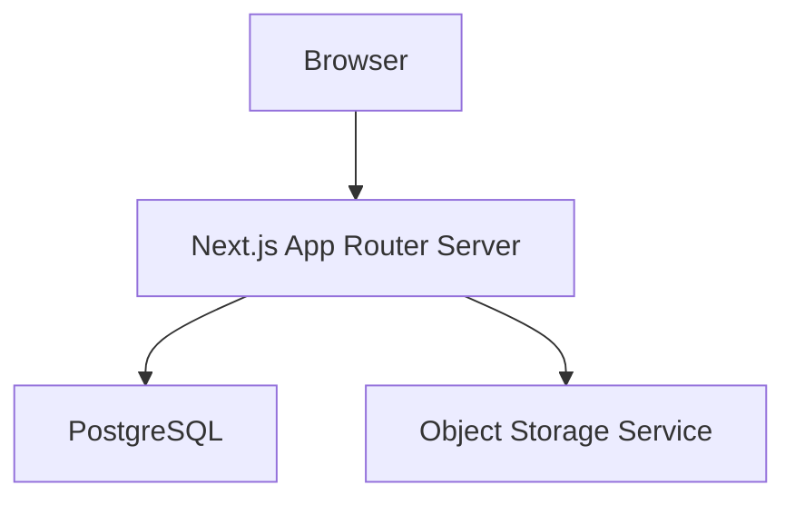
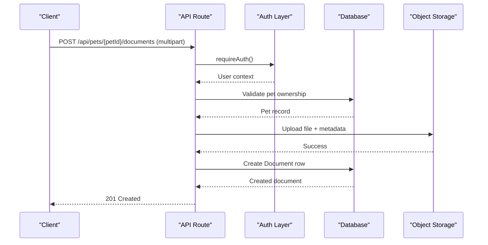
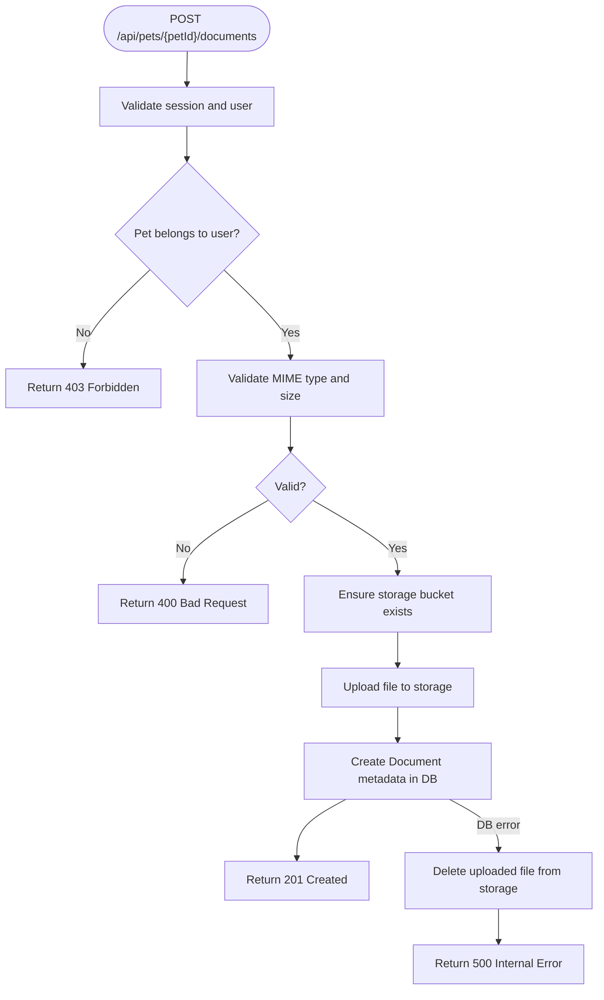
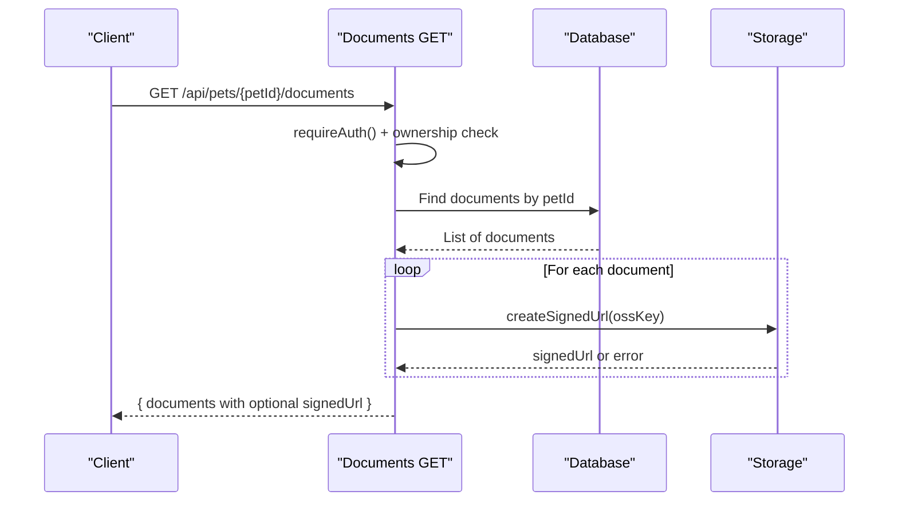
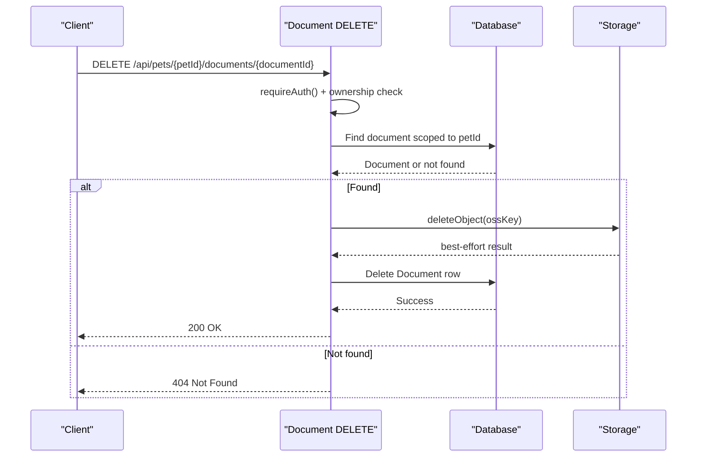
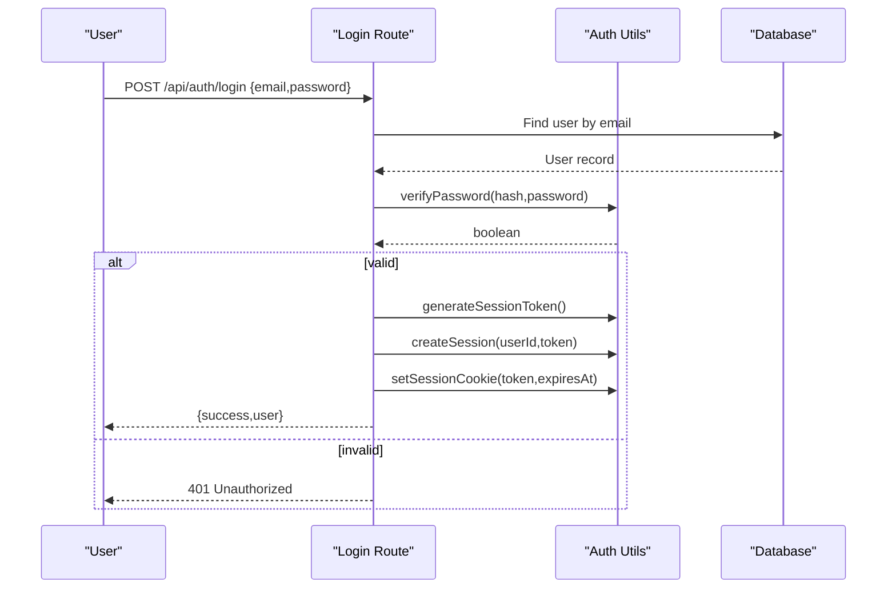
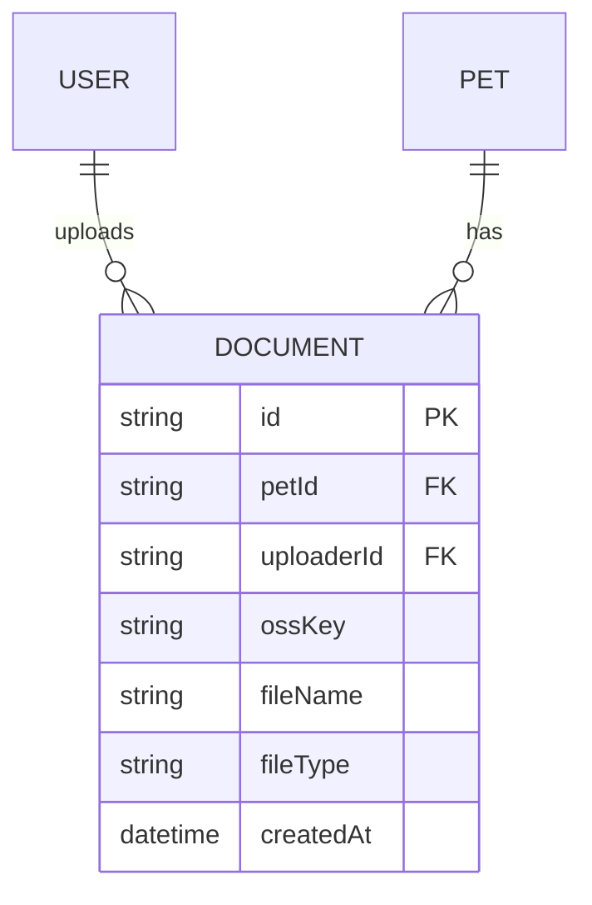
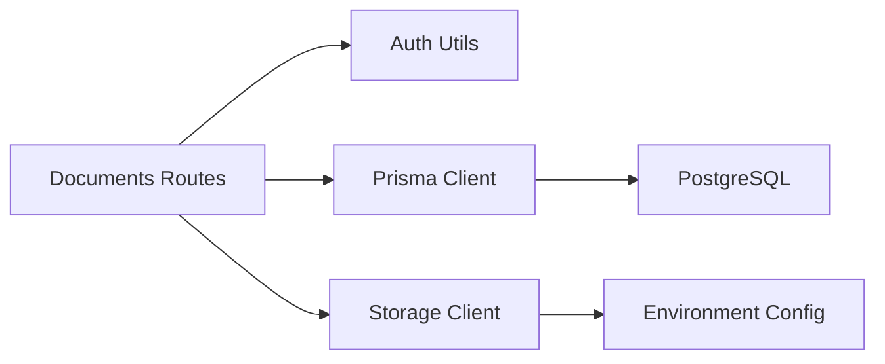

# Medical Document Management

<cite>
**Referenced Files in This Document**
- [README.md](file://README.md)
- [package.json](file://package.json)
- [schema.prisma](file://prisma/schema.prisma)
- [db.ts](file://lib/db.ts)
- [auth.ts](file://lib/auth.ts)
- [storage.ts](file://lib/storage.ts)
- [route.ts (documents list/upload)](file://app/api/pets/[petId]/documents/route.ts)
- [route.ts (document delete)](file://app/api/pets/[petId]/documents/[documentId]/route.ts)
- [route.ts (pet CRUD)](file://app/api/pets/[petId]/route.ts)
- [route.ts (login)](file://app/api/auth/login/route.ts)
- [route.ts (register)](file://app/api/auth/register/route.ts)
- [layout.tsx](file://app/layout.tsx)
- [page.tsx (landing page)](file://app/page.tsx)
- [01-system-architecture.md](file://docs/03-architecture/01-system-architecture.md)
- [01-requirements-review.md](file://docs/02-requirements/01-requirements-review.md)
</cite>

## Table of Contents
1. Introduction
2. Project Structure
3. Core Components
4. Architecture Overview
5. Detailed Component Analysis
6. Dependency Analysis
7. Performance Considerations
8. Troubleshooting Guide
9. Conclusion

## Introduction
This document explains the medical document management functionality within a Next.js-based pet healthcare platform. It covers how authenticated users upload, list, and delete pet-related documents; how files are stored securely in object storage with short-lived signed URLs; and how authorization is enforced server-side to ensure only pet owners access their data. It also outlines the database schema for documents, authentication flows, and integration points with external storage services.

## Project Structure
The application uses a Next.js App Router structure:
- API routes under app/api handle authentication, pet operations, and document management.
- Shared libraries under lib provide database connectivity, authentication utilities, and storage client functions.
- Prisma schema defines the relational model including User, Pet, Document, and related entities.
- Documentation under docs describes architecture, requirements, and security boundaries.

**Diagram sources**
- [01-system-architecture.md:11-23](file://docs/03-architecture/01-system-architecture.md#L11-L23)

**Section sources**
- [README.md:1-37](file://README.md#L1-L37)
- [package.json:1-36](file://package.json#L1-L36)
- [01-system-architecture.md:1-151](file://docs/03-architecture/01-system-architecture.md#L1-L151)

## Core Components
- Authentication and session management: password hashing, session creation/validation, cookie handling, and role checks.
- Database layer: Prisma client configured for development and production with connection pooling.
- Storage layer: Secure object storage client that ensures bucket existence, uploads files, generates signed URLs, and deletes objects.
- API endpoints:
  - Documents: list and upload for a specific pet; delete by document id.
  - Pets: read/update/delete with ownership checks.
  - Auth: login and register flows that create sessions and set cookies.

Key responsibilities:
- Enforce RBAC and ownership at the API boundary before any data or file operation.
- Keep sensitive credentials server-only; clients receive time-limited signed URLs for viewing files.
- Maintain referential integrity via Prisma models and migrations.

**Section sources**
- [auth.ts:1-125](file://lib/auth.ts#L1-L125)
- [db.ts:1-33](file://lib/db.ts#L1-L33)
- [storage.ts:1-125](file://lib/storage.ts#L1-L125)
- [route.ts (documents list/upload):1-223](file://app/api/pets/[petId]/documents/route.ts#L1-L223)
- [route.ts (document delete):1-67](file://app/api/pets/[petId]/documents/[documentId]/route.ts#L1-L67)
- [route.ts (pet CRUD):1-141](file://app/api/pets/[petId]/route.ts#L1-L141)
- [route.ts (login):1-58](file://app/api/auth/login/route.ts#L1-L58)
- [route.ts (register):1-78](file://app/api/auth/register/route.ts#L1-L78)

## Architecture Overview
The system follows a layered architecture:
- Presentation: Next.js pages and components.
- API/Business Logic: Route handlers enforce authN/authZ and orchestrate operations.
- Data Access: Prisma ORM against PostgreSQL.
- External Services: Object storage for secure file hosting with signed URL access.

**Diagram sources**
- [route.ts (documents list/upload):108-203](file://app/api/pets/[petId]/documents/route.ts#L108-L203)
- [auth.ts:99-125](file://lib/auth.ts#L99-L125)
- [storage.ts:89-98](file://lib/storage.ts#L89-L98)
- [schema.prisma:251-263](file://prisma/schema.prisma#L251-L263)

**Section sources**
- [01-system-architecture.md:48-98](file://docs/03-architecture/01-system-architecture.md#L48-L98)

## Detailed Component Analysis

### Document Upload Flow
- Authentication: The route requires an authenticated user via session cookie validation.
- Ownership check: The request must target a pet owned by the current user.
- File validation: Only allowed MIME types and size limits are accepted.
- Storage interaction: Ensures the private bucket exists, uploads the file, and returns success.
- Metadata persistence: Creates a Document record referencing the uploaded file key and original filename.
- Error handling: On DB failure after upload, the stored object is deleted to avoid orphaned files.

**Diagram sources**
- [route.ts (documents list/upload):108-203](file://app/api/pets/[petId]/documents/route.ts#L108-L203)
- [storage.ts:55-98](file://lib/storage.ts#L55-L98)

**Section sources**
- [route.ts (documents list/upload):1-223](file://app/api/pets/[petId]/documents/route.ts#L1-L223)
- [storage.ts:1-125](file://lib/storage.ts#L1-L125)

### Document Listing and Signed URL Generation
- Lists all documents for a pet owned by the authenticated user.
- For each document, attempts to generate a short-lived signed URL for secure viewing.
- If storage signing fails, the list still returns without signed URLs to remain useful.

**Diagram sources**
- [route.ts (documents list/upload):42-106](file://app/api/pets/[petId]/documents/route.ts#L42-L106)
- [storage.ts:100-113](file://lib/storage.ts#L100-L113)

**Section sources**
- [route.ts (documents list/upload):42-106](file://app/api/pets/[petId]/documents/route.ts#L42-L106)

### Document Deletion
- Requires authentication and ownership of the pet.
- Scopes deletion to the specific document under the given pet to prevent cross-pet deletion.
- Attempts to delete the stored file; if storage deletion fails, the metadata row is still removed to allow owner control.

**Diagram sources**
- [route.ts (document delete):10-67](file://app/api/pets/[petId]/documents/[documentId]/route.ts#L10-L67)

**Section sources**
- [route.ts (document delete):1-67](file://app/api/pets/[petId]/documents/[documentId]/route.ts#L1-L67)

### Authentication Flows
- Login verifies credentials, creates a session token, stores it in a secure HTTP-only cookie, and returns user info.
- Register validates inputs, hashes passwords, creates a user, sets a session, and returns user info.
- Session validation supports sliding expiration and cleanup of expired sessions.

**Diagram sources**
- [route.ts (login):5-48](file://app/api/auth/login/route.ts#L5-L48)
- [auth.ts:10-80](file://lib/auth.ts#L10-L80)

**Section sources**
- [route.ts (login):1-58](file://app/api/auth/login/route.ts#L1-L58)
- [route.ts (register):1-78](file://app/api/auth/register/route.ts#L1-L78)
- [auth.ts:1-125](file://lib/auth.ts#L1-L125)

### Data Model for Documents
- Document entity associates a file with a pet and uploader, storing the storage key, original filename, and MIME type.
- Indexes optimize queries by petId for efficient listing and scoping.

**Diagram sources**
- [schema.prisma:251-263](file://prisma/schema.prisma#L251-L263)

**Section sources**
- [schema.prisma:251-263](file://prisma/schema.prisma#L251-L263)

## Dependency Analysis
- API routes depend on:
  - Authentication utilities for session validation and role enforcement.
  - Database client for querying and mutating records.
  - Storage client for object operations and signed URL generation.
- Storage client depends on environment configuration for service credentials and bucket settings.
- Database client configures connection pooling differently in development vs production.

**Diagram sources**
- [route.ts (documents list/upload):1-223](file://app/api/pets/[petId]/documents/route.ts#L1-L223)
- [auth.ts:1-125](file://lib/auth.ts#L1-L125)
- [storage.ts:1-125](file://lib/storage.ts#L1-L125)
- [db.ts:1-33](file://lib/db.ts#L1-L33)

**Section sources**
- [db.ts:1-33](file://lib/db.ts#L1-L33)
- [storage.ts:23-39](file://lib/storage.ts#L23-L39)

## Performance Considerations
- Connection pooling: Production uses a dedicated pool; development reuses global instances to avoid hot-reload overhead.
- Signed URL caching: Bucket readiness is cached per process to reduce redundant checks during concurrent uploads.
- Best-effort operations: Signing and storage deletions are best-effort to keep core workflows resilient when external services are unavailable.
- Input validation: Early validation reduces unnecessary storage calls and DB writes.

[No sources needed since this section provides general guidance]

## Troubleshooting Guide
Common issues and resolutions:
- Not logged in: Occurs when session cookie is missing or expired. Ensure login succeeded and cookies are present.
- Forbidden: Indicates the user does not own the targeted pet. Verify ownership checks in pet APIs.
- Storage not configured: Missing environment variables for object storage. Provide required credentials to enable uploads and signed URLs.
- Unsupported file type or size: Ensure files match allowed MIME types and size limits.
- Orphaned files: If metadata creation fails after upload, the handler attempts cleanup; verify logs for storage errors.

Operational tips:
- Check environment variables for database and storage services.
- Review API responses for structured error codes and messages.
- Inspect logs for storage errors and DB failures during upload and deletion.

**Section sources**
- [route.ts (documents list/upload):94-106](file://app/api/pets/[petId]/documents/route.ts#L94-L106)
- [route.ts (documents list/upload):204-223](file://app/api/pets/[petId]/documents/route.ts#L204-L223)
- [route.ts (document delete):54-67](file://app/api/pets/[petId]/documents/[documentId]/route.ts#L54-L67)
- [storage.ts:23-25](file://lib/storage.ts#L23-L25)

## Conclusion
The medical document management feature provides secure, ownership-scoped upload, listing, and deletion of pet health documents. It enforces strict authentication and authorization, leverages object storage for secure file hosting, and integrates seamlessly with the existing pet and user models. The design prioritizes resilience through best-effort external operations and clear error signaling, enabling reliable operation even when storage services are temporarily unavailable.