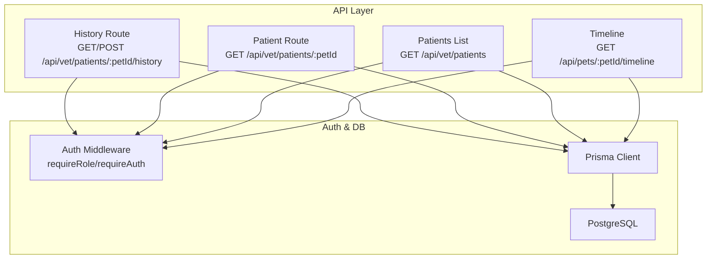
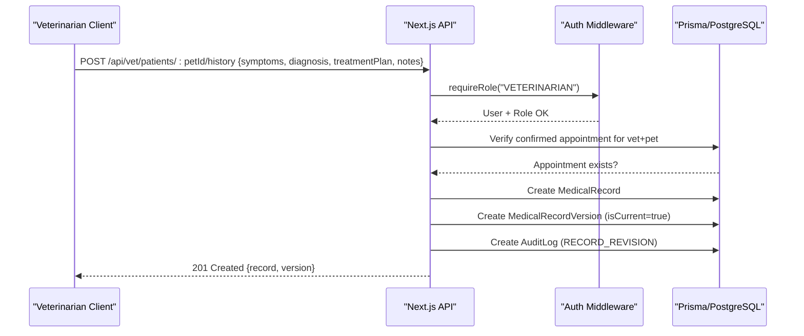
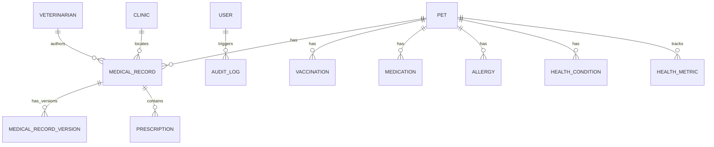
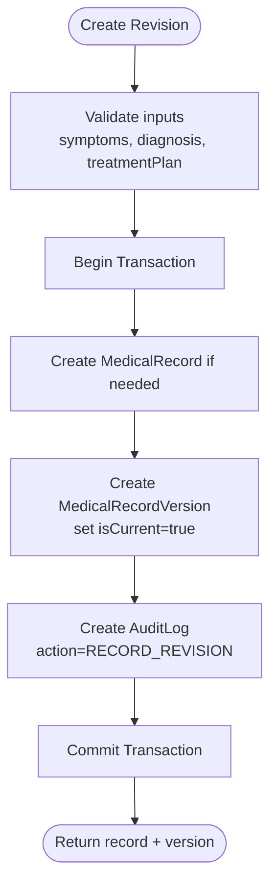
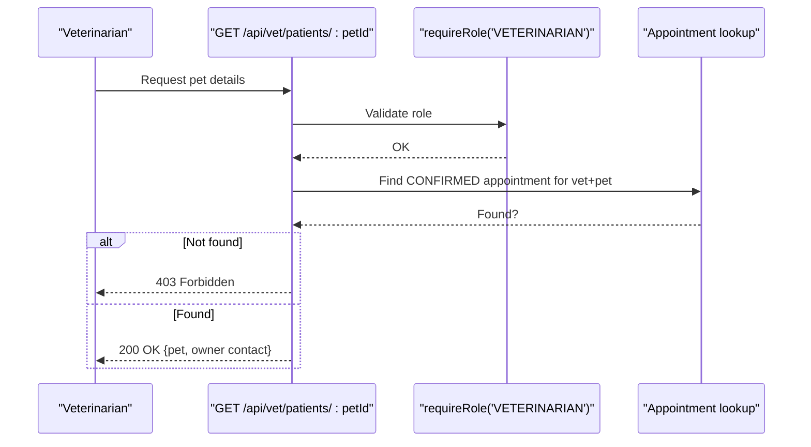
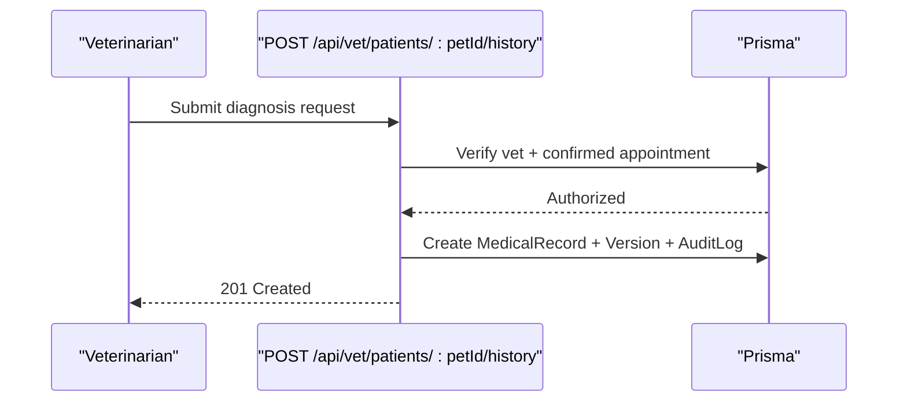
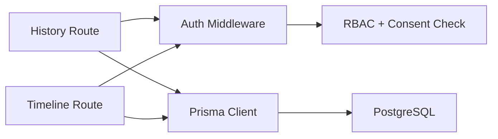

# Medical Records System

<cite>
**Referenced Files in This Document**
- [schema.prisma](file://prisma/schema.prisma)
- [database-design.md](file://docs/03-architecture/02-database-design.md)
- [api-specification.md](file://docs/03-architecture/03-api-specification.md)
- [security.md](file://docs/03-architecture/06-security.md)
- [history route.ts](file://app/api/vet/patients/[petId]/history/route.ts)
- [patient route.ts](file://app/api/vet/patients/[petId]/route.ts)
- [patients list route.ts](file://app/api/vet/patients/route.ts)
- [timeline route.ts](file://app/api/pets/[petId]/timeline/route.ts)
- [auth.ts](file://lib/auth.ts)
- [seed.js](file://prisma/seed.js)
</cite>

## Table of Contents
1. Introduction
2. Project Structure
3. Core Components
4. Architecture Overview
5. Detailed Component Analysis
6. Dependency Analysis
7. Performance Considerations
8. Troubleshooting Guide
9. Conclusion
10. Appendices

## Introduction
This document explains the Medical Records System within PETIVA, focusing on how medical records are modeled, versioned, and accessed by veterinarians and pet owners. It covers:
- The data model for diagnosis, symptoms, treatments, prescriptions, and veterinarian notes
- Versioning that preserves historical changes and supports audit trails
- Relationships between medical records, pets, owners, veterinarians, and clinics
- API endpoints for creating records, retrieving history, and managing versions
- Validation rules, required fields, and business logic for record creation and updates
- Common workflows such as adding a diagnosis, recording treatment plans, and generating reports
- Data integrity measures and access control for sensitive medical information

## Project Structure
The medical records feature spans database schema definitions, API routes, security middleware, and documentation:
- Database schema defines entities like Pet, Veterinarian, Clinic, MedicalRecord, MedicalRecordVersion, Prescription, Vaccination, Medication, Allergy, HealthCondition, HealthMetric, Appointment, Document, AuditLog, and User
- API routes provide vet-only endpoints to create and retrieve medical histories, and owner-only endpoints to fetch timelines
- Security middleware enforces authentication and role-based authorization with consent-based access for veterinarians
- Documentation outlines API contracts, database design, and security controls

**Diagram sources**
- [history route.ts:1-153](file://app/api/vet/patients/[petId]/history/route.ts#L1-L153)
- [patient route.ts:1-80](file://app/api/vet/patients/[petId]/route.ts#L1-L80)
- [patients list route.ts:1-71](file://app/api/vet/patients/route.ts#L1-L71)
- [timeline route.ts:1-149](file://app/api/pets/[petId]/timeline/route.ts#L1-L149)
- [auth.ts:1-125](file://lib/auth.ts#L1-L125)

**Section sources**
- [schema.prisma:1-312](file://prisma/schema.prisma#L1-L312)
- [database-design.md:1-450](file://docs/03-architecture/02-database-design.md#L1-L450)
- [api-specification.md:1-259](file://docs/03-architecture/03-api-specification.md#L1-L259)
- [security.md:1-90](file://docs/03-architecture/06-security.md#L1-L90)

## Core Components
- MedicalRecord: Header entity linking a pet to a visit or consultation; stores vet and clinic context and timestamps
- MedicalRecordVersion: Immutable snapshot capturing symptoms, diagnosis, treatment plan, optional notes, editor identity, and whether it is current
- Prescription: Medication details tied to a specific medical record
- Supporting entities: Pet, Veterinarian, Clinic, Appointment, Vaccination, Medication, Allergy, HealthCondition, HealthMetric, Document, AuditLog, User
- Authorization: Role-based access (PET_OWNER, VETERINARIAN, CLINIC_ADMIN, PLATFORM_ADMIN) with consent-based temporary access for vets via confirmed appointments
- Timeline: Aggregated chronological view combining medical records, vaccinations, medications, allergies, conditions, metrics, and appointments

Key relationships:
- Pet has many MedicalRecords, Vaccinations, Medications, Allergies, HealthConditions, HealthMetrics, Documents, Appointments
- MedicalRecord belongs to Pet; optionally to Veterinarian and Clinic; has many Versions and Prescriptions
- MedicalRecordVersion belongs to MedicalRecord and references the editing User
- AuditLog captures sensitive operations with user, action, entity, and payload

**Section sources**
- [schema.prisma:30-312](file://prisma/schema.prisma#L30-L312)
- [database-design.md:45-165](file://docs/03-architecture/02-database-design.md#L45-L165)

## Architecture Overview
The system uses Next.js API routes backed by Prisma and PostgreSQL. Authentication and authorization are enforced server-side. Veterinarians can only access a pet’s medical data when there is a confirmed appointment with that pet. Owners can read their own pet’s timeline.

**Diagram sources**
- [history route.ts:71-153](file://app/api/vet/patients/[petId]/history/route.ts#L71-L153)
- [auth.ts:109-125](file://lib/auth.ts#L109-L125)
- [schema.prisma:133-162](file://prisma/schema.prisma#L133-L162)

## Detailed Component Analysis

### Data Model and Relationships
- MedicalRecord ties a visit to a Pet and optionally to a Veterinarian and Clinic
- MedicalRecordVersion stores the actual clinical content and tracks who edited it and when; only one version is marked current at a time per record
- Prescription attaches medication instructions to a specific record
- Supporting tables capture preventative care (vaccinations), ongoing meds, allergies, conditions, and health metrics
- AuditLog provides an immutable trail for sensitive actions

**Diagram sources**
- [schema.prisma:68-312](file://prisma/schema.prisma#L68-L312)
- [database-design.md:7-41](file://docs/03-architecture/02-database-design.md#L7-L41)

**Section sources**
- [schema.prisma:68-312](file://prisma/schema.prisma#L68-L312)
- [database-design.md:106-165](file://docs/03-architecture/02-database-design.md#L106-L165)

### Versioning and Audit Trail
- New revisions are appended as new rows in MedicalRecordVersion
- The latest revision is marked current; previous revisions remain for historical analysis
- Every revision triggers an AuditLog entry with action type, entity, and payload containing relevant identifiers and changed fields
- This design ensures immutability and traceability for legal and clinical review

**Diagram sources**
- [history route.ts:104-137](file://app/api/vet/patients/[petId]/history/route.ts#L104-L137)
- [schema.prisma:148-162](file://prisma/schema.prisma#L148-L162)
- [schema.prisma:298-311](file://prisma/schema.prisma#L298-L311)

**Section sources**
- [history route.ts:71-153](file://app/api/vet/patients/[petId]/history/route.ts#L71-L153)
- [schema.prisma:148-162](file://prisma/schema.prisma#L148-L162)
- [schema.prisma:298-311](file://prisma/schema.prisma#L298-L311)

### Access Control and Consent-Based Vet Access
- Veterinarians must have a confirmed appointment with the pet to access patient details and write medical records
- Owner-only endpoints protect pet timelines; ownership is enforced by comparing pet.ownerId with authenticated user id
- Role checks are enforced via middleware requiring specific roles

**Diagram sources**
- [patient route.ts:5-47](file://app/api/vet/patients/[petId]/route.ts#L5-L47)
- [auth.ts:117-125](file://lib/auth.ts#L117-L125)

**Section sources**
- [patient route.ts:5-47](file://app/api/vet/patients/[petId]/route.ts#L5-L47)
- [security.md:16-47](file://docs/03-architecture/06-security.md#L16-L47)

### API Endpoints for Medical Records
- Create medical record (vet-only): POST /api/vet/patients/:petId/history
  - Requires: symptoms, diagnosis, treatmentPlan; notes optional
  - Validates vet authorization via confirmed appointment
  - Creates MedicalRecord and first MedicalRecordVersion; logs AuditLog
- Retrieve full history (vet-only): GET /api/vet/patients/:petId/history
  - Returns medical records (with versions), vaccinations, medications, allergies, conditions, metrics
- Owner timeline: GET /api/pets/:petId/timeline
  - Aggregates events from multiple sources into a chronological list

Additional endpoints defined in the API specification include:
- Add addendum/correction: POST /api/records/:recordId/revisions
- Preventative care: POST /api/pets/:petId/vaccinations, /medications, /metrics
- AI summary: GET /api/pets/:petId/ai-summary

**Section sources**
- [history route.ts:1-153](file://app/api/vet/patients/[petId]/history/route.ts#L1-L153)
- [timeline route.ts:1-149](file://app/api/pets/[petId]/timeline/route.ts#L1-L149)
- [api-specification.md:91-160](file://docs/03-architecture/03-api-specification.md#L91-L160)

### Data Validation Rules and Required Fields
- Creating a medical record requires symptoms, diagnosis, and treatmentPlan; missing fields return a validation error
- Vet authorization is validated before any write operation
- Owner-only timeline endpoint validates pet ownership
- Standardized error envelope used across endpoints

Validation locations:
- History POST validates required fields and returns 400 if missing
- Patient detail and history GET enforce vet authorization via confirmed appointment
- Timeline GET enforces owner authorization

**Section sources**
- [history route.ts:89-94](file://app/api/vet/patients/[petId]/history/route.ts#L89-L94)
- [patient route.ts:15-26](file://app/api/vet/patients/[petId]/route.ts#L15-L26)
- [timeline route.ts:14-31](file://app/api/pets/[petId]/timeline/route.ts#L14-L31)

### Business Logic for Record Creation and Updates
- Record creation occurs within a transaction to ensure consistency:
  - Create MedicalRecord header
  - Create initial MedicalRecordVersion marked current
  - Write AuditLog for the revision
- Retrieval includes related entities efficiently using parallel queries
- Timeline aggregates diverse event types and sorts chronologically

**Section sources**
- [history route.ts:104-137](file://app/api/vet/patients/[petId]/history/route.ts#L104-L137)
- [timeline route.ts:33-135](file://app/api/pets/[petId]/timeline/route.ts#L33-L135)

### Example Workflows

#### Adding a New Diagnosis
- Veterinarian calls POST /api/vet/patients/:petId/history with symptoms, diagnosis, treatmentPlan, and optional notes
- System verifies role and confirmed appointment
- Creates a new record and version; logs audit
- Response includes created record and version identifiers

**Diagram sources**
- [history route.ts:71-153](file://app/api/vet/patients/[petId]/history/route.ts#L71-L153)

**Section sources**
- [history route.ts:71-153](file://app/api/vet/patients/[petId]/history/route.ts#L71-L153)

#### Recording Treatment Plans and Prescriptions
- Treatment plan is recorded as part of the MedicalRecordVersion
- Prescriptions are linked to the MedicalRecord separately
- Timeline surfaces both treatment-related events and medication start dates

**Section sources**
- [schema.prisma:133-194](file://prisma/schema.prisma#L133-L194)
- [timeline route.ts:82-90](file://app/api/pets/[petId]/timeline/route.ts#L82-L90)

#### Generating Medical History Reports
- Vet GET /api/vet/patients/:petId/history returns comprehensive history including records, versions, vaccinations, medications, allergies, conditions, and metrics
- Owner GET /api/pets/:petId/timeline returns a unified timeline of all healthcare events

**Section sources**
- [history route.ts:23-56](file://app/api/vet/patients/[petId]/history/route.ts#L23-L56)
- [timeline route.ts:33-135](file://app/api/pets/[petId]/timeline/route.ts#L33-L135)

## Dependency Analysis
- API routes depend on auth middleware for authentication and role checks
- History and timeline endpoints depend on Prisma client to query multiple entities concurrently
- Authorization depends on Appointment status to grant temporary vet access
- Audit logging depends on successful completion of transactions

**Diagram sources**
- [history route.ts:1-153](file://app/api/vet/patients/[petId]/history/route.ts#L1-L153)
- [timeline route.ts:1-149](file://app/api/pets/[petId]/timeline/route.ts#L1-L149)
- [auth.ts:1-125](file://lib/auth.ts#L1-L125)

**Section sources**
- [history route.ts:1-153](file://app/api/vet/patients/[petId]/history/route.ts#L1-L153)
- [timeline route.ts:1-149](file://app/api/pets/[petId]/timeline/route.ts#L1-L149)
- [auth.ts:1-125](file://lib/auth.ts#L1-L125)

## Performance Considerations
- Use parallel queries to assemble timeline and history responses efficiently
- Indexes on petId, recordId+isCurrent, and timestamp columns support fast lookups and sorting
- Keep response payloads scoped to necessary fields to reduce transfer size
- Consider pagination for large timelines or histories in future iterations

[No sources needed since this section provides general guidance]

## Troubleshooting Guide
Common issues and resolutions:
- Missing required fields when creating a record: Ensure symptoms, diagnosis, and treatmentPlan are provided; otherwise a 400 error is returned
- Unauthorized vet access: Confirm there is a CONFIRMED appointment between the vet and the pet; otherwise a 403 error is returned
- Owner-only timeline access denied: Verify the authenticated user owns the pet; otherwise a 403 error is returned
- Transaction failures: If record creation fails mid-transaction, no partial writes occur; retry with corrected inputs

Error handling locations:
- Validation errors for required fields
- Authorization checks for vet and owner
- Global error handling returning standardized error envelopes

**Section sources**
- [history route.ts:89-101](file://app/api/vet/patients/[petId]/history/route.ts#L89-L101)
- [patient route.ts:15-26](file://app/api/vet/patients/[petId]/route.ts#L15-L26)
- [timeline route.ts:14-31](file://app/api/pets/[petId]/timeline/route.ts#L14-L31)

## Conclusion
The Medical Records System in PETIVA provides a robust, auditable, and secure way to manage veterinary medical data. Its versioned design preserves historical accuracy while enabling efficient retrieval for clinicians and owners. Role-based and consent-based access controls ensure sensitive information is shared appropriately. The API surface supports core workflows for creating records, tracking treatments, and generating comprehensive histories and timelines.

[No sources needed since this section summarizes without analyzing specific files]

## Appendices

### API Reference Summary
- Vet-only:
  - GET /api/vet/patients/:petId/history: Full medical history
  - POST /api/vet/patients/:petId/history: Create medical record
  - GET /api/vet/patients/:petId: Get authorized patient details
  - GET /api/vet/patients: List authorized patients
- Owner-only:
  - GET /api/pets/:petId/timeline: Chronological timeline

**Section sources**
- [api-specification.md:91-160](file://docs/03-architecture/03-api-specification.md#L91-L160)
- [history route.ts:1-153](file://app/api/vet/patients/[petId]/history/route.ts#L1-L153)
- [patient route.ts:1-80](file://app/api/vet/patients/[petId]/route.ts#L1-L80)
- [patients list route.ts:1-71](file://app/api/vet/patients/route.ts#L1-L71)
- [timeline route.ts:1-149](file://app/api/pets/[petId]/timeline/route.ts#L1-L149)

### Data Integrity and Security Measures
- Session-based authentication with HttpOnly cookies and password hashing
- Role-based access control with consent-based temporary access for veterinarians
- Audit logging for sensitive operations including record revisions
- Private object storage with presigned URLs for documents

**Section sources**
- [security.md:7-47](file://docs/03-architecture/06-security.md#L7-L47)
- [security.md:51-90](file://docs/03-architecture/06-security.md#L51-L90)
- [auth.ts:1-125](file://lib/auth.ts#L1-L125)

### Sample Seed Data for Medical Records
- Seed script demonstrates creating a medical record, adding a revised version, and attaching a prescription for testing and demonstration purposes

**Section sources**
- [seed.js:294-325](file://prisma/seed.js#L294-L325)