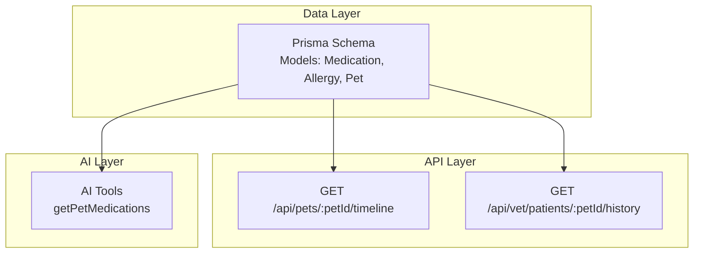
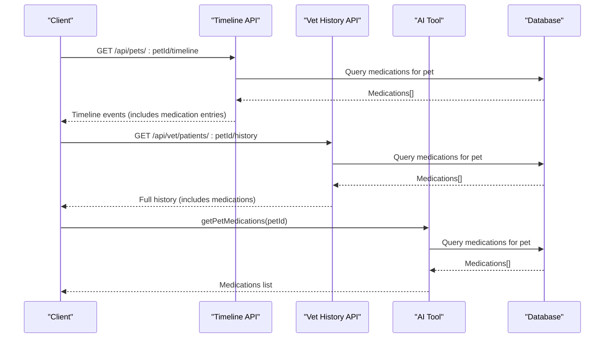
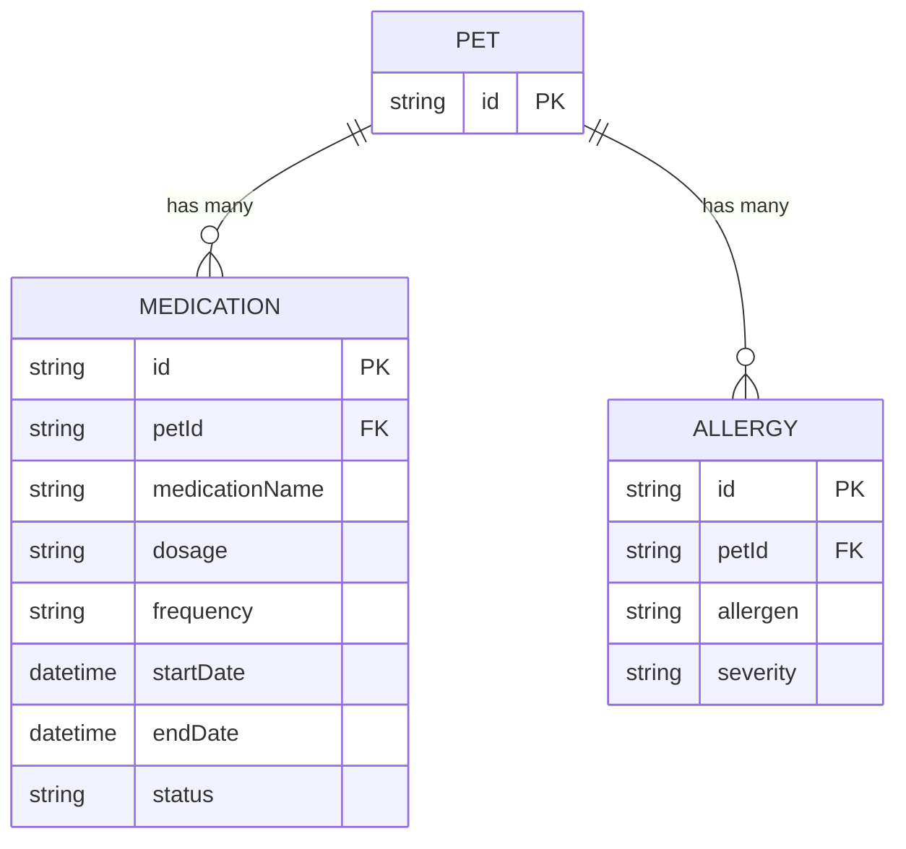
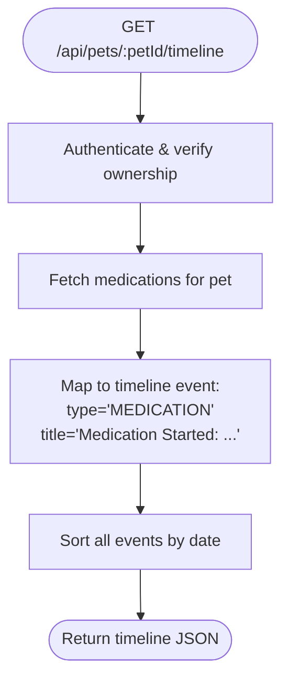
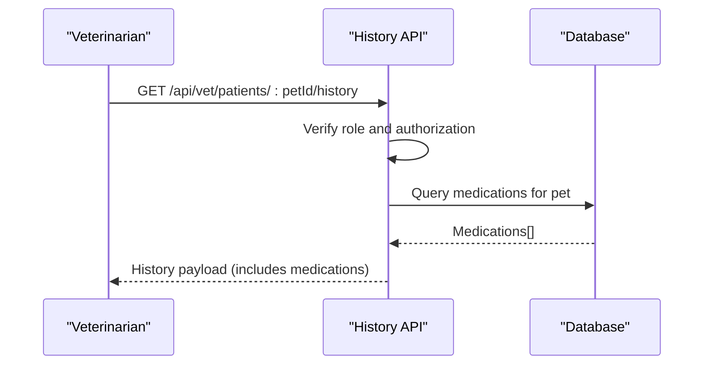
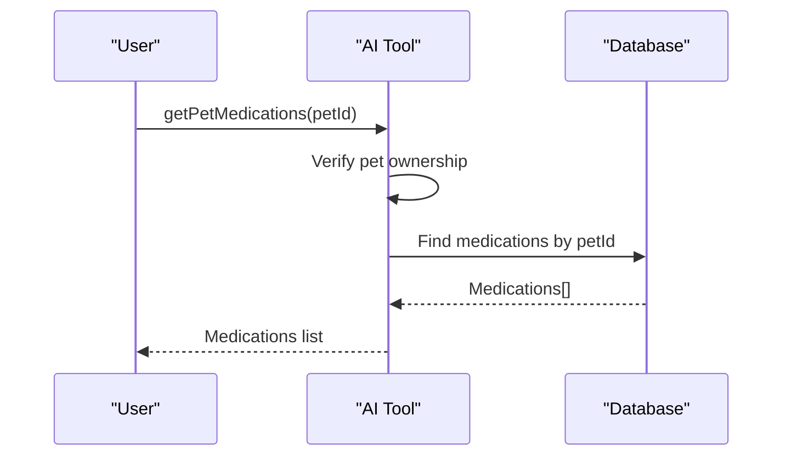
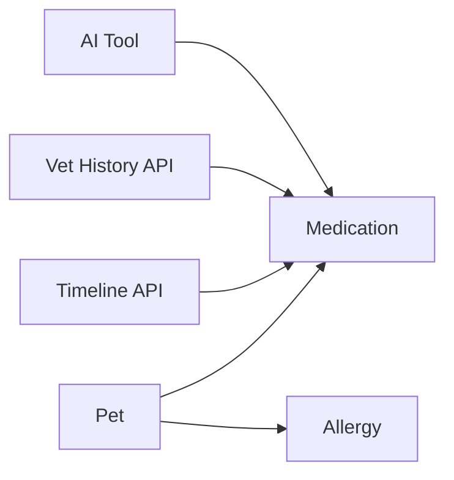

# Medication Management

<cite>
**Referenced Files in This Document**
- [schema.prisma](file://prisma/schema.prisma)
- [timeline route.ts](file://app/api/pets/[petId]/timeline/route.ts)
- [vet history route.ts](file://app/api/vet/patients/[petId]/history/route.ts)
- [AI tools (ai.ts)](file://lib/ai.ts)
- [project blueprint.md](file://docs/01-product/01-project-blueprint.md)
- [decisions.md](file://docs/02-requirements/02-decisions.md)
</cite>

## Table of Contents
1. Introduction
2. Project Structure
3. Core Components
4. Architecture Overview
5. Detailed Component Analysis
6. Dependency Analysis
7. Performance Considerations
8. Troubleshooting Guide
9. Conclusion
10. Appendices

## Introduction
This document describes the Medication Management system within PETIVA. It explains how medications are modeled, how they appear in timelines and histories, and how they integrate with vet access and AI tooling. It also outlines current capabilities and recommended enhancements for scheduling, refills, interaction checking, validation rules, and safety protocols.

## Project Structure
Medication data is stored in the database schema and surfaced through API endpoints that build a pet’s timeline and veterinary history. The AI layer exposes tools to read medication data for context-aware workflows.

**Diagram sources**
- [schema.prisma:206-216](file://prisma/schema.prisma#L206-L216)
- [timeline route.ts:34-53](file://app/api/pets/[petId]/timeline/route.ts#L34-L53)
- [vet history route.ts:23-44](file://app/api/vet/patients/[petId]/history/route.ts#L23-L44)
- [AI tools (ai.ts):282-287](file://lib/ai.ts#L282-L287)

**Section sources**
- [schema.prisma:206-216](file://prisma/schema.prisma#L206-L216)
- [timeline route.ts:34-53](file://app/api/pets/[petId]/timeline/route.ts#L34-L53)
- [vet history route.ts:23-44](file://app/api/vet/patients/[petId]/history/route.ts#L23-L44)
- [AI tools (ai.ts):282-287](file://lib/ai.ts#L282-L287)

## Core Components
- Medication model: stores drug name, dosage, frequency, start date, optional end date, and status.
- Timeline integration: medication records are included in a chronological timeline per pet.
- Veterinary history: veterinarians can retrieve active medications as part of consent-based access.
- AI tooling: an AI tool reads a pet’s medications for contextual assistance.

Key responsibilities:
- Persist medication records linked to a pet.
- Surface medications in timeline events and vet history.
- Provide AI context via a dedicated tool.

**Section sources**
- [schema.prisma:206-216](file://prisma/schema.prisma#L206-L216)
- [timeline route.ts:82-90](file://app/api/pets/[petId]/timeline/route.ts#L82-L90)
- [vet history route.ts:23-44](file://app/api/vet/patients/[petId]/history/route.ts#L23-L44)
- [AI tools (ai.ts):282-287](file://lib/ai.ts#L282-L287)

## Architecture Overview
The system currently provides read access to medications through timeline and history endpoints and an AI tool. There is no dedicated write endpoint for medications in this codebase; creation would typically occur during medical record workflows or via future extensions.

**Diagram sources**
- [timeline route.ts:34-53](file://app/api/pets/[petId]/timeline/route.ts#L34-L53)
- [vet history route.ts:23-44](file://app/api/vet/patients/[petId]/history/route.ts#L23-L44)
- [AI tools (ai.ts):282-287](file://lib/ai.ts#L282-L287)

## Detailed Component Analysis

### Data Model: Medication
- Fields:
  - Medication name
  - Dosage
  - Frequency
  - Start date
  - End date (optional)
  - Status (default ACTIVE)
- Relationships:
  - Belongs to a Pet
- Notes:
  - Prescribing veterinarian is not a direct field on the Medication model; it is associated via MedicalRecord and Prescription entities when prescriptions are created.

**Diagram sources**
- [schema.prisma:68-88](file://prisma/schema.prisma#L68-L88)
- [schema.prisma:206-216](file://prisma/schema.prisma#L206-L216)
- [schema.prisma:218-225](file://prisma/schema.prisma#L218-L225)

**Section sources**
- [schema.prisma:206-216](file://prisma/schema.prisma#L206-L216)

### Timeline Integration: Medication Events
- The timeline endpoint aggregates multiple health events and includes medication start events with dosage and frequency details.
- Ownership checks ensure only authorized owners view their pet’s timeline.

**Diagram sources**
- [timeline route.ts:10-31](file://app/api/pets/[petId]/timeline/route.ts#L10-L31)
- [timeline route.ts:34-53](file://app/api/pets/[petId]/timeline/route.ts#L34-L53)
- [timeline route.ts:82-90](file://app/api/pets/[petId]/timeline/route.ts#L82-L90)
- [timeline route.ts:132-135](file://app/api/pets/[petId]/timeline/route.ts#L132-L135)

**Section sources**
- [timeline route.ts:10-31](file://app/api/pets/[petId]/timeline/route.ts#L10-L31)
- [timeline route.ts:34-53](file://app/api/pets/[petId]/timeline/route.ts#L34-L53)
- [timeline route.ts:82-90](file://app/api/pets/[petId]/timeline/route.ts#L82-L90)
- [timeline route.ts:132-135](file://app/api/pets/[petId]/timeline/route.ts#L132-L135)

### Veterinary History: Active Medications
- Veterinarians with consent-based access can retrieve a pet’s full history, including medications.
- This supports drug compatibility checks and clinical decision-making.

**Diagram sources**
- [vet history route.ts:7-21](file://app/api/vet/patients/[petId]/history/route.ts#L7-L21)
- [vet history route.ts:23-44](file://app/api/vet/patients/[petId]/history/route.ts#L23-L44)

**Section sources**
- [vet history route.ts:7-21](file://app/api/vet/patients/[petId]/history/route.ts#L7-L21)
- [vet history route.ts:23-44](file://app/api/vet/patients/[petId]/history/route.ts#L23-L44)

### AI Tooling: Reading Medications
- The AI tool “getPetMedications” retrieves a pet’s medications after verifying ownership.
- This enables AI-assisted summaries and reminders based on actual medication records.

**Diagram sources**
- [AI tools (ai.ts):282-287](file://lib/ai.ts#L282-L287)

**Section sources**
- [AI tools (ai.ts):282-287](file://lib/ai.ts#L282-L287)

### Product Requirements Context
- The product blueprint specifies medication fields and reminder support.
- Decisions confirm that active medications are shared with veterinarians under consent to check drug compatibility.

**Section sources**
- [project blueprint.md:398-414](file://docs/01-product/01-project-blueprint.md#L398-L414)
- [decisions.md:89-97](file://docs/02-requirements/02-decisions.md#L89-L97)

## Dependency Analysis
- Database dependencies:
  - Medication depends on Pet.
  - Allergy depends on Pet.
- API dependencies:
  - Timeline endpoint depends on Pet ownership verification and queries Medication.
  - Vet history endpoint depends on role-based authorization and queries Medication.
  - AI tool depends on ownership verification and queries Medication.

**Diagram sources**
- [schema.prisma:68-88](file://prisma/schema.prisma#L68-L88)
- [schema.prisma:206-216](file://prisma/schema.prisma#L206-L216)
- [timeline route.ts:34-53](file://app/api/pets/[petId]/timeline/route.ts#L34-L53)
- [vet history route.ts:23-44](file://app/api/vet/patients/[petId]/history/route.ts#L23-L44)
- [AI tools (ai.ts):282-287](file://lib/ai.ts#L282-L287)

**Section sources**
- [schema.prisma:68-88](file://prisma/schema.prisma#L68-L88)
- [schema.prisma:206-216](file://prisma/schema.prisma#L206-L216)
- [timeline route.ts:34-53](file://app/api/pets/[petId]/timeline/route.ts#L34-L53)
- [vet history route.ts:23-44](file://app/api/vet/patients/[petId]/history/route.ts#L23-L44)
- [AI tools (ai.ts):282-287](file://lib/ai.ts#L282-L287)

## Performance Considerations
- Use batched queries for timeline and history to minimize round trips (already implemented via Promise.all).
- Index petId on Medication for faster lookups if not already present.
- Paginate large timelines and histories to reduce payload size.
- Cache frequently accessed pet profiles and active medications where appropriate.

[No sources needed since this section provides general guidance]

## Troubleshooting Guide
Common issues and resolutions:
- Unauthorized access:
  - Ensure the user is authenticated before calling timeline or history endpoints.
  - For timeline, verify ownership of the pet.
- Not found:
  - Confirm the pet exists and IDs are correct.
- Internal server errors:
  - Check database connectivity and query correctness.

**Section sources**
- [timeline route.ts:10-31](file://app/api/pets/[petId]/timeline/route.ts#L10-L31)
- [timeline route.ts:136-147](file://app/api/pets/[petId]/timeline/route.ts#L136-L147)
- [vet history route.ts:7-21](file://app/api/vet/patients/[petId]/history/route.ts#L7-L21)
- [vet history route.ts:57-68](file://app/api/vet/patients/[petId]/history/route.ts#L57-L68)

## Conclusion
PETIVA currently models medications with essential fields and integrates them into timelines and veterinary histories. Read access is available via timeline, vet history, and AI tools. To fully realize the Medication Management system, implement dedicated endpoints for creating and managing medications, add scheduling and refill logic, introduce interaction checking against allergies and other drugs, enforce robust validation rules, and embed safety checks such as allergy alerts and dosage limits.

[No sources needed since this section summarizes without analyzing specific files]

## Appendices

### API Endpoints Summary
- GET /api/pets/:petId/timeline
  - Purpose: Retrieve chronological timeline including medication start events.
  - Authorization: Owner of the pet.
  - Response includes medication events with name, dosage, frequency, status, and end date.
- GET /api/vet/patients/:petId/history
  - Purpose: Retrieve full medical history including medications.
  - Authorization: Authorized veterinarian with consent-based access.
  - Response includes medications among other health data.
- AI Tool: getPetMedications(petId)
  - Purpose: Retrieve medications for a pet.
  - Authorization: Verified pet owner context.

**Section sources**
- [timeline route.ts:34-53](file://app/api/pets/[petId]/timeline/route.ts#L34-L53)
- [timeline route.ts:82-90](file://app/api/pets/[petId]/timeline/route.ts#L82-L90)
- [vet history route.ts:23-44](file://app/api/vet/patients/[petId]/history/route.ts#L23-L44)
- [AI tools (ai.ts):282-287](file://lib/ai.ts#L282-L287)

### Validation Rules (Recommended)
- Dosage calculations:
  - Validate units and ranges relative to pet weight and species.
- Frequency validation:
  - Normalize and validate intervals (e.g., daily, twice daily).
- Prescription requirements:
  - Require prescribing veterinarian association via MedicalRecord/Prescription when creating medications.
- Allergy checks:
  - Cross-reference new medications against pet allergies to prevent contraindications.
- Safety thresholds:
  - Enforce maximum daily dosage and minimum intervals between doses.

[No sources needed since this section provides general guidance]

### Common Workflows

#### Adding a New Prescription
- Create a MedicalRecord entry with diagnosis and treatment plan.
- Link a Prescription referencing the medication, dosage, frequency, and duration.
- Optionally create a Medication record for ongoing management and reminders.

**Section sources**
- [vet history route.ts:71-139](file://app/api/vet/patients/[petId]/history/route.ts#L71-L139)
- [schema.prisma:133-194](file://prisma/schema.prisma#L133-L194)

#### Tracking Daily Medication Administration
- Use the timeline to display medication start events and status changes.
- Extend with administration logs to mark doses given, missed, or rescheduled.

**Section sources**
- [timeline route.ts:82-90](file://app/api/pets/[petId]/timeline/route.ts#L82-L90)

#### Managing Medication Refills
- Update the Medication end date or status to reflect completion or continuation.
- Generate reminders for upcoming refills based on frequency and remaining days.

**Section sources**
- [schema.prisma:206-216](file://prisma/schema.prisma#L206-L216)
- [project blueprint.md:398-414](file://docs/01-product/01-project-blueprint.md#L398-L414)

### Safety Considerations
- Allergy checks:
  - Compare new medications against recorded allergies before approval.
- Dosage limits:
  - Enforce species-specific and weight-based dosage constraints.
- Emergency protocols:
  - Flag critical interactions and provide clear escalation steps for adverse events.

**Section sources**
- [decisions.md:89-97](file://docs/02-requirements/02-decisions.md#L89-L97)
- [project blueprint.md:398-414](file://docs/01-product/01-project-blueprint.md#L398-L414)