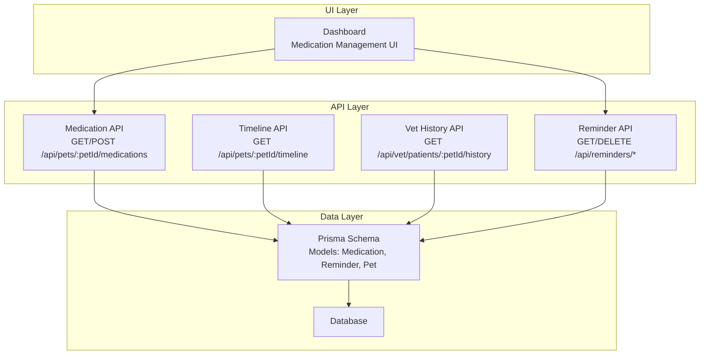
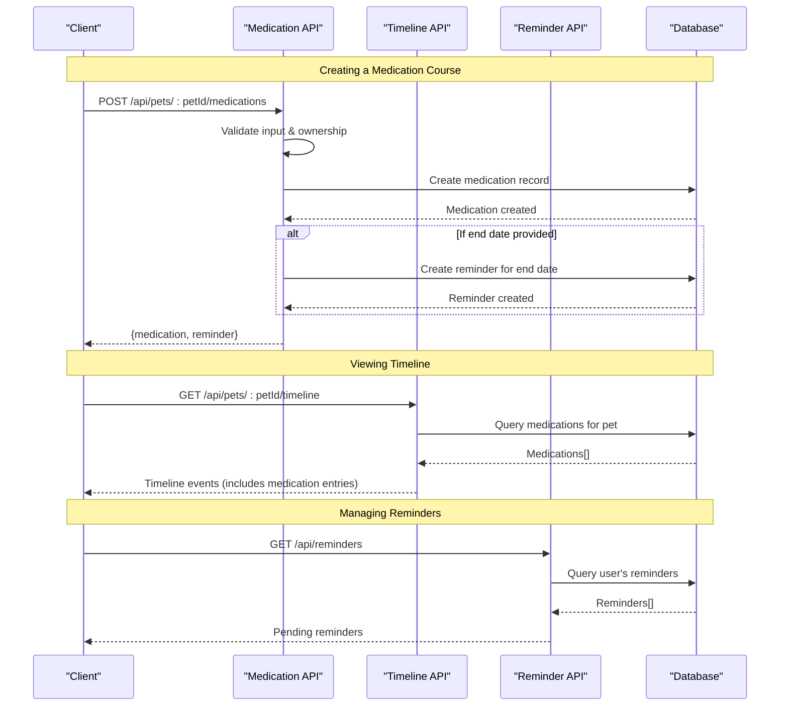
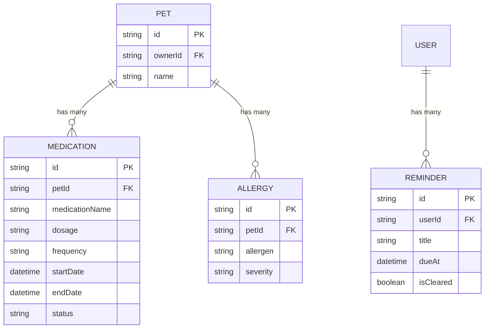
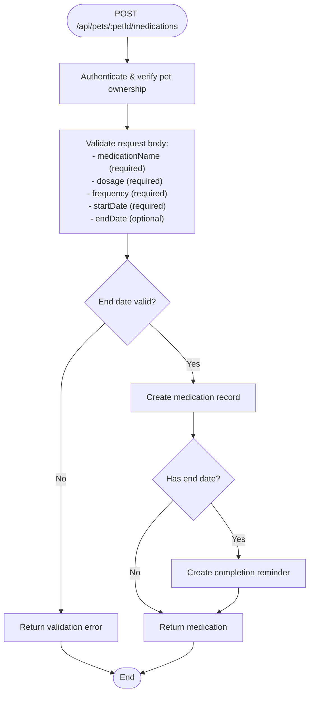
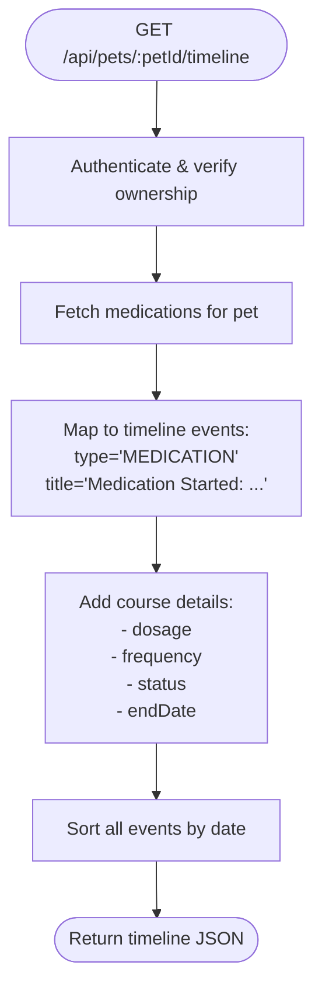
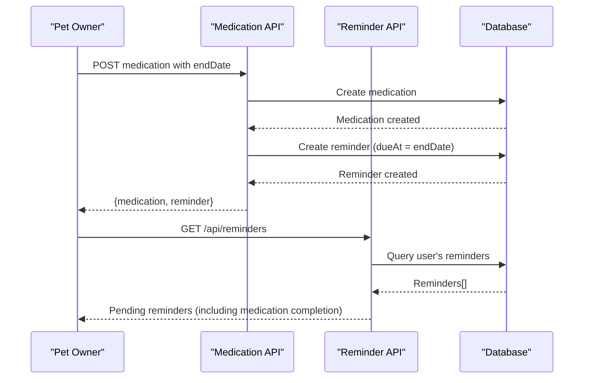
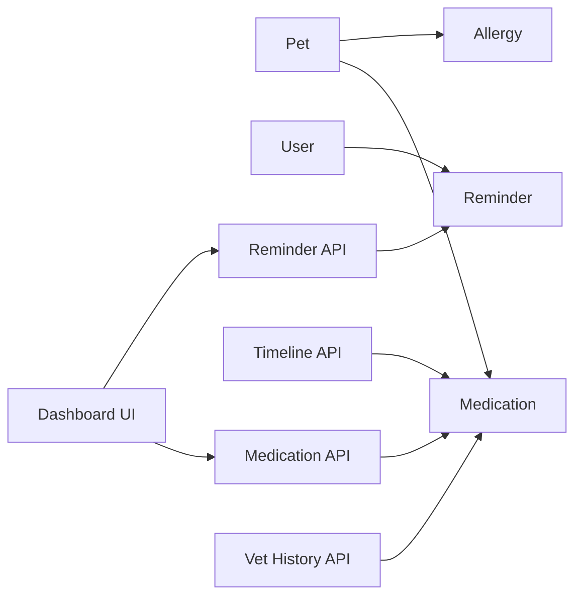

# Medication Management

<cite>
**Referenced Files in This Document**
- [schema.prisma](file://prisma/schema.prisma)
- [medications route.ts](file://app/api/pets/[petId]/medications/route.ts)
- [timeline route.ts](file://app/api/pets/[petId]/timeline/route.ts)
- [vet history route.ts](file://app/api/vet/patients/[petId]/history/route.ts)
- [reminders route.ts](file://app/api/reminders/route.ts)
- [reminder deletion route.ts](file://app/api/reminders/[reminderId]/route.ts)
- [dashboard page.tsx](file://app/dashboard/page.tsx)
- [AI tools (ai.ts)](file://lib/ai.ts)
- [project blueprint.md](file://docs/01-product/01-project-blueprint.md)
- [decisions.md](file://docs/02-requirements/02-decisions.md)
</cite>

## Update Summary
**Changes Made**
- Added comprehensive medication API endpoints with GET and POST operations
- Implemented course tracking with dosage, frequency, and duration management
- Integrated automatic reminder creation for medication end dates
- Enhanced validation rules for medication data including date validation
- Updated timeline integration to show medication start events with full details
- Added reminder management system for medication completion notifications

## Table of Contents
1. Introduction
2. Project Structure
3. Core Components
4. Architecture Overview
5. Detailed Component Analysis
6. Dependency Analysis
7. Performance Considerations
8. Troubleshooting Guide
9. Conclusion
10. Appendices

## Introduction
This document describes the enhanced Medication Management system within PETIVA. The system now provides complete medication lifecycle management including course tracking with dosage, frequency, and duration specifications, automatic reminder creation for medication end dates, and comprehensive API endpoints for medication administration. It explains how medications are modeled, managed through dedicated APIs, integrated into timelines and histories, and connected to the reminder system for automated notifications.

## Project Structure
The medication management system is built around a comprehensive API layer with dedicated endpoints for medication CRUD operations, integrated with the existing timeline and veterinary history systems. The system includes automatic reminder generation and robust validation for medication data integrity.



**Diagram sources**
- [medications route.ts:5-157](file://app/api/pets/[petId]/medications/route.ts#L5-L157)
- [timeline route.ts:34-53](file://app/api/pets/[petId]/timeline/route.ts#L34-L53)
- [vet history route.ts:23-44](file://app/api/vet/patients/[petId]/history/route.ts#L23-L44)
- [reminders route.ts:5-29](file://app/api/reminders/route.ts#L5-L29)
- [schema.prisma:211-221](file://prisma/schema.prisma#L211-L221)
- [schema.prisma:275-283](file://prisma/schema.prisma#L275-L283)

**Section sources**
- [medications route.ts:5-157](file://app/api/pets/[petId]/medications/route.ts#L5-L157)
- [timeline route.ts:34-53](file://app/api/pets/[petId]/timeline/route.ts#L34-L53)
- [vet history route.ts:23-44](file://app/api/vet/patients/[petId]/history/route.ts#L23-L44)
- [reminders route.ts:5-29](file://app/api/reminders/route.ts#L5-L29)
- [schema.prisma:211-221](file://prisma/schema.prisma#L211-L221)
- [schema.prisma:275-283](file://prisma/schema.prisma#L275-L283)

## Core Components
- **Enhanced Medication Model**: Stores drug name, dosage, frequency, start date, optional end date, and status with comprehensive validation
- **Medication API Endpoints**: Dedicated GET and POST endpoints for listing and creating medication courses
- **Automatic Reminder System**: Creates reminders when medications have end dates, notifying owners of medication completion
- **Timeline Integration**: Medication records appear as chronological events with full course details
- **Veterinary Access**: Active medications available to veterinarians under consent-based access for drug compatibility checks
- **Dashboard Integration**: User-friendly interface for adding medications and managing reminders

Key responsibilities:
- Provide secure medication course management with owner-only write access
- Validate all medication data including dosage, frequency, and date ranges
- Automatically generate completion reminders for time-bound medication courses
- Integrate medication events into pet health timelines
- Support veterinary access to active medications for clinical decision-making

**Section sources**
- [medications route.ts:51-157](file://app/api/pets/[petId]/medications/route.ts#L51-L157)
- [timeline route.ts:82-90](file://app/api/pets/[petId]/timeline/route.ts#L82-L90)
- [vet history route.ts:23-44](file://app/api/vet/patients/[petId]/history/route.ts#L23-L44)
- [reminders route.ts:11-16](file://app/api/reminders/route.ts#L11-L16)
- [dashboard page.tsx:281-309](file://app/dashboard/page.tsx#L281-L309)

## Architecture Overview
The enhanced medication management system provides complete CRUD operations through dedicated API endpoints, with automatic reminder generation and comprehensive timeline integration. The system enforces strict ownership validation and includes robust data validation for all medication inputs.



**Diagram sources**
- [medications route.ts:51-157](file://app/api/pets/[petId]/medications/route.ts#L51-L157)
- [timeline route.ts:34-53](file://app/api/pets/[petId]/timeline/route.ts#L34-L53)
- [reminders route.ts:7-29](file://app/api/reminders/route.ts#L7-L29)

## Detailed Component Analysis

### Enhanced Data Model: Medication
The medication model now supports complete course tracking with comprehensive field validation and relationships to both pets and reminders.

- **Fields**:
  - Medication name (required, validated)
  - Dosage (required, validated)
  - Frequency (required, validated)
  - Start date (required, validated)
  - End date (optional, validated against start date)
  - Status (default ACTIVE)
- **Relationships**:
  - Belongs to a Pet
  - Can trigger Reminder creation when end date is set
- **Validation Rules**:
  - Required fields: medicationName, dosage, frequency, startDate
  - Date validation: endDate must be after startDate if provided
  - Ownership validation: Only pet owners can create medications



**Diagram sources**
- [schema.prisma:70-91](file://prisma/schema.prisma#L70-L91)
- [schema.prisma:211-221](file://prisma/schema.prisma#L211-L221)
- [schema.prisma:275-283](file://prisma/schema.prisma#L275-L283)
- [schema.prisma:223-230](file://prisma/schema.prisma#L223-L230)

**Section sources**
- [schema.prisma:211-221](file://prisma/schema.prisma#L211-L221)
- [medications route.ts:80-118](file://app/api/pets/[petId]/medications/route.ts#L80-L118)

### Enhanced API Endpoints: Medication Management
The system now provides comprehensive medication management through dedicated endpoints with full validation and security controls.

#### GET /api/pets/:petId/medications
- **Purpose**: Retrieve all medication records for a specific pet
- **Authorization**: Pet owner only
- **Response**: Array of medication objects with full course details
- **Validation**: Verifies pet ownership before returning data

#### POST /api/pets/:petId/medications  
- **Purpose**: Create a new medication course for a pet
- **Authorization**: Pet owner only
- **Request Body**: medicationName, dosage, frequency, startDate, endDate (optional)
- **Response**: Created medication object and optional reminder
- **Validation**: Comprehensive input validation including required fields and date logic
- **Side Effects**: Automatic reminder creation when end date is specified



**Diagram sources**
- [medications route.ts:51-157](file://app/api/pets/[petId]/medications/route.ts#L51-L157)

**Section sources**
- [medications route.ts:51-157](file://app/api/pets/[petId]/medications/route.ts#L51-L157)

### Enhanced Timeline Integration: Medication Events
The timeline system now includes detailed medication course information with full dosing and scheduling context.

- **Event Type**: MEDICATION
- **Content**: Includes medication name, dosage, frequency, status, and end date
- **Chronological Order**: Sorted by start date with newest first
- **Context**: Provides complete course information for timeline display



**Diagram sources**
- [timeline route.ts:10-31](file://app/api/pets/[petId]/timeline/route.ts#L10-L31)
- [timeline route.ts:82-90](file://app/api/pets/[petId]/timeline/route.ts#L82-L90)

**Section sources**
- [timeline route.ts:82-90](file://app/api/pets/[petId]/timeline/route.ts#L82-L90)

### Automatic Reminder System: Medication Completion
The system automatically creates reminders when medications have end dates, ensuring owners are notified when treatment courses complete.

- **Trigger**: Creation of medication with end date
- **Reminder Content**: "Medication ends: [medicationName] ([petName])"
- **Due Date**: Set to medication end date
- **Management**: Users can view and clear their own reminders



**Diagram sources**
- [medications route.ts:132-142](file://app/api/pets/[petId]/medications/route.ts#L132-L142)
- [reminders route.ts:7-29](file://app/api/reminders/route.ts#L7-L29)

**Section sources**
- [medications route.ts:132-142](file://app/api/pets/[petId]/medications/route.ts#L132-L142)
- [reminders route.ts:7-29](file://app/api/reminders/route.ts#L7-L29)
- [reminder deletion route.ts:5-46](file://app/api/reminders/[reminderId]/route.ts#L5-L46)

### Dashboard Integration: User Interface
The dashboard provides an intuitive interface for medication management with real-time updates and reminder integration.

- **Medication Form**: Complete form for adding new medications with all required fields
- **Real-time Updates**: Medications appear immediately after creation
- **Reminder Display**: Shows pending reminders including medication completion alerts
- **Form Validation**: Client-side validation with helpful error messages

**Section sources**
- [dashboard page.tsx:281-309](file://app/dashboard/page.tsx#L281-L309)
- [dashboard page.tsx:1171-1184](file://app/dashboard/page.tsx#L1171-L1184)
- [dashboard page.tsx:1923-1977](file://app/dashboard/page.tsx#L1923-L1977)

### Veterinary History: Active Medications
Veterinarians with consent-based access can retrieve active medications as part of the pet's medical history for drug compatibility checks and clinical decision-making.

- **Access Control**: Requires veterinarian role and consent-based authorization
- **Data Included**: Active medications with dosage, frequency, and course dates
- **Clinical Use**: Supports drug interaction checking and treatment planning

**Section sources**
- [vet history route.ts:7-21](file://app/api/vet/patients/[petId]/history/route.ts#L7-L21)
- [vet history route.ts:23-44](file://app/api/vet/patients/[petId]/history/route.ts#L23-L44)

### AI Tooling: Reading Medications
The AI tool continues to provide medication context for intelligent assistance while respecting ownership and privacy controls.

- **Tool Name**: getPetMedications
- **Authorization**: Verified pet owner context
- **Usage**: Enables AI-assisted summaries and medication-related guidance

**Section sources**
- [AI tools (ai.ts):282-287](file://lib/ai.ts#L282-L287)

## Dependency Analysis
The enhanced medication management system maintains clean separation of concerns while integrating with existing systems:

- **Database Dependencies**:
  - Medication depends on Pet
  - Reminder depends on User
  - Allergy depends on Pet
- **API Dependencies**:
  - Medication API depends on authentication and pet ownership verification
  - Timeline endpoint depends on medication data for event generation
  - Reminder API depends on user authentication and ownership
  - Vet history endpoint depends on role-based authorization
- **UI Dependencies**:
  - Dashboard integrates with medication and reminder APIs
  - Real-time updates require proper state management



**Diagram sources**
- [schema.prisma:70-91](file://prisma/schema.prisma#L70-L91)
- [schema.prisma:211-221](file://prisma/schema.prisma#L211-L221)
- [schema.prisma:275-283](file://prisma/schema.prisma#L275-L283)
- [medications route.ts:51-157](file://app/api/pets/[petId]/medications/route.ts#L51-L157)
- [timeline route.ts:34-53](file://app/api/pets/[petId]/timeline/route.ts#L34-L53)
- [reminders route.ts:7-29](file://app/api/reminders/route.ts#L7-L29)

**Section sources**
- [schema.prisma:70-91](file://prisma/schema.prisma#L70-L91)
- [schema.prisma:211-221](file://prisma/schema.prisma#L211-L221)
- [schema.prisma:275-283](file://prisma/schema.prisma#L275-L283)
- [medications route.ts:51-157](file://app/api/pets/[petId]/medications/route.ts#L51-L157)
- [timeline route.ts:34-53](file://app/api/pets/[petId]/timeline/route.ts#L34-L53)
- [reminders route.ts:7-29](file://app/api/reminders/route.ts#L7-L29)

## Performance Considerations
- **Database Optimization**: Indexes on petId for medication queries and userId for reminder lookups
- **Batch Operations**: Timeline endpoint uses Promise.all for efficient concurrent data fetching
- **Pagination**: Consider implementing pagination for large medication histories
- **Caching**: Cache frequently accessed pet profiles and active medications where appropriate
- **Memory Management**: Process large datasets in chunks to prevent memory issues

## Troubleshooting Guide
Common issues and resolutions for the enhanced medication system:

### Authentication & Authorization Issues
- **Unauthorized Access**: Ensure user is authenticated before calling medication endpoints
- **Ownership Errors**: Verify the user owns the pet before attempting medication operations
- **Role Restrictions**: Only pet owners can create medications; veterinarians have read-only access

### Data Validation Errors
- **Missing Required Fields**: Ensure medicationName, dosage, frequency, and startDate are provided
- **Invalid Dates**: Check that startDate is valid and endDate (if provided) is after startDate
- **Input Sanitization**: All string inputs are trimmed and validated for type safety

### Database & API Issues
- **Not Found Errors**: Confirm pet exists and IDs are correct
- **Internal Server Errors**: Check database connectivity and query correctness
- **Reminder Issues**: Verify reminder creation when end dates are set

**Section sources**
- [medications route.ts:51-157](file://app/api/pets/[petId]/medications/route.ts#L51-L157)
- [timeline route.ts:10-31](file://app/api/pets/[petId]/timeline/route.ts#L10-L31)
- [reminders route.ts:7-29](file://app/api/reminders/route.ts#L7-L29)
- [reminder deletion route.ts:5-46](file://app/api/reminders/[reminderId]/route.ts#L5-L46)

## Conclusion
The enhanced Medication Management system in PETIVA now provides comprehensive medication lifecycle management with course tracking, automatic reminders, and robust API endpoints. The system successfully implements:

- **Complete CRUD Operations**: Dedicated endpoints for medication management with full validation
- **Course Tracking**: Support for dosage, frequency, and duration management
- **Automatic Reminders**: Intelligent notification system for medication completion
- **Timeline Integration**: Chronological medication events with full course details
- **Veterinary Access**: Safe sharing of active medications for clinical decision-making
- **User Experience**: Intuitive dashboard interface with real-time updates

The system maintains strong security controls, comprehensive validation, and seamless integration with existing PETIVA features while providing the foundation for advanced medication management capabilities.

## Appendices

### Enhanced API Endpoints Summary

#### Medication Management Endpoints

**GET /api/pets/:petId/medications**
- **Purpose**: Retrieve all medication records for a specific pet
- **Authorization**: Pet owner only
- **Response**: `{ success: true, medications: Medication[] }`
- **Error Responses**: 401 (unauthorized), 403 (forbidden), 404 (pet not found)

**POST /api/pets/:petId/medications**
- **Purpose**: Create a new medication course for a pet
- **Authorization**: Pet owner only
- **Request Body**: 
  ```json
  {
    "medicationName": "Amoxicillin",
    "dosage": "50 mg",
    "frequency": "Twice daily",
    "startDate": "2024-01-15",
    "endDate": "2024-01-29" // optional
  }
  ```
- **Response**: `{ success: true, medication: Medication, reminder: Reminder? }`
- **Validation**: Required fields: medicationName, dosage, frequency, startDate
- **Side Effects**: Creates reminder if endDate is provided

#### Reminder Management Endpoints

**GET /api/reminders**
- **Purpose**: Retrieve all pending reminders for the authenticated user
- **Authorization**: Any authenticated user
- **Response**: `{ success: true, reminders: Reminder[] }`
- **Filtering**: Excludes cleared reminders, sorted by due date

**DELETE /api/reminders/:reminderId**
- **Purpose**: Clear a specific reminder
- **Authorization**: Reminder owner only
- **Response**: `{ success: true }`
- **Security**: Prevents cross-user reminder deletion

**Section sources**
- [medications route.ts:5-49](file://app/api/pets/[petId]/medications/route.ts#L5-L49)
- [medications route.ts:51-157](file://app/api/pets/[petId]/medications/route.ts#L51-L157)
- [reminders route.ts:5-29](file://app/api/reminders/route.ts#L5-L29)
- [reminder deletion route.ts:5-46](file://app/api/reminders/[reminderId]/route.ts#L5-L46)

### Enhanced Validation Rules

#### Medication Data Validation
- **Required Fields**: medicationName, dosage, frequency, startDate
- **Field Types**: All string fields are trimmed and validated
- **Date Validation**: 
  - startDate must be a valid date
  - endDate must be after startDate if provided
  - Both dates must be parseable JavaScript dates

#### Security Validation
- **Ownership Verification**: All medication operations verify pet ownership
- **Role-Based Access**: Only PET_OWNER role can create medications
- **Input Sanitization**: All user inputs are sanitized and validated

#### Business Logic Validation
- **Course Logic**: Medications represent complete treatment courses
- **Status Management**: New medications default to ACTIVE status
- **Reminder Generation**: Automatic reminder creation for time-bound courses

**Section sources**
- [medications route.ts:80-118](file://app/api/pets/[petId]/medications/route.ts#L80-L118)
- [medications route.ts:59-78](file://app/api/pets/[petId]/medications/route.ts#L59-L78)

### Enhanced Common Workflows

#### Adding a New Medication Course
1. **User Action**: Navigate to dashboard and click "Add Medication"
2. **Form Input**: Enter medication name, dosage, frequency, start date, and optional end date
3. **API Call**: POST request to `/api/pets/:petId/medications`
4. **Validation**: Server validates all inputs and verifies ownership
5. **Creation**: Medication record created with ACTIVE status
6. **Reminder**: If end date provided, automatic reminder created
7. **Response**: Success response with medication and reminder data
8. **UI Update**: Dashboard refreshes to show new medication and reminder

**Section sources**
- [dashboard page.tsx:281-309](file://app/dashboard/page.tsx#L281-L309)
- [dashboard page.tsx:1923-1977](file://app/dashboard/page.tsx#L1923-L1977)
- [medications route.ts:51-157](file://app/api/pets/[petId]/medications/route.ts#L51-L157)

#### Managing Medication Reminders
1. **View Reminders**: Dashboard displays all pending reminders including medication completions
2. **Automatic Creation**: Reminders created automatically when medications have end dates
3. **Manual Management**: Users can clear reminders when completed or no longer needed
4. **Security**: Users can only manage their own reminders

**Section sources**
- [reminders route.ts:7-29](file://app/api/reminders/route.ts#L7-L29)
- [reminder deletion route.ts:5-46](file://app/api/reminders/[reminderId]/route.ts#L5-L46)
- [dashboard page.tsx:996-1018](file://app/dashboard/page.tsx#L996-L1018)

#### Viewing Medication Timeline
1. **Timeline Request**: GET request to `/api/pets/:petId/timeline`
2. **Data Aggregation**: System fetches medications along with other health events
3. **Event Mapping**: Medications converted to timeline events with full course details
4. **Chronological Sorting**: All events sorted by date with newest first
5. **Display**: Timeline shows medication start events with dosage and frequency details

**Section sources**
- [timeline route.ts:34-53](file://app/api/pets/[petId]/timeline/route.ts#L34-L53)
- [timeline route.ts:82-90](file://app/api/pets/[petId]/timeline/route.ts#L82-L90)

### Enhanced Safety Considerations

#### Data Integrity & Validation
- **Comprehensive Validation**: All medication data validated server-side
- **Date Logic**: Ensures logical date relationships (end date after start date)
- **Ownership Security**: Prevents unauthorized medication creation or modification

#### Clinical Safety Features
- **Veterinary Access**: Active medications shared with consenting veterinarians for drug compatibility checks
- **Timeline Context**: Medication history provides complete treatment context for clinical decisions
- **Reminder System**: Automated notifications help ensure medication compliance and completion

#### Privacy & Security
- **Owner-Only Write Access**: Only pet owners can create or modify medications
- **Read Access Controls**: Veterinarians access medications only with explicit consent
- **Reminder Ownership**: Users can only manage their own reminders

**Section sources**
- [decisions.md:89-97](file://docs/02-requirements/02-decisions.md#L89-L97)
- [project blueprint.md:398-414](file://docs/01-product/01-project-blueprint.md#L398-L414)
- [medications route.ts:59-78](file://app/api/pets/[petId]/medications/route.ts#L59-L78)