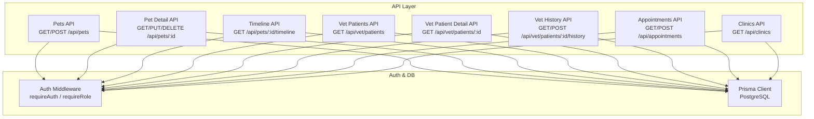
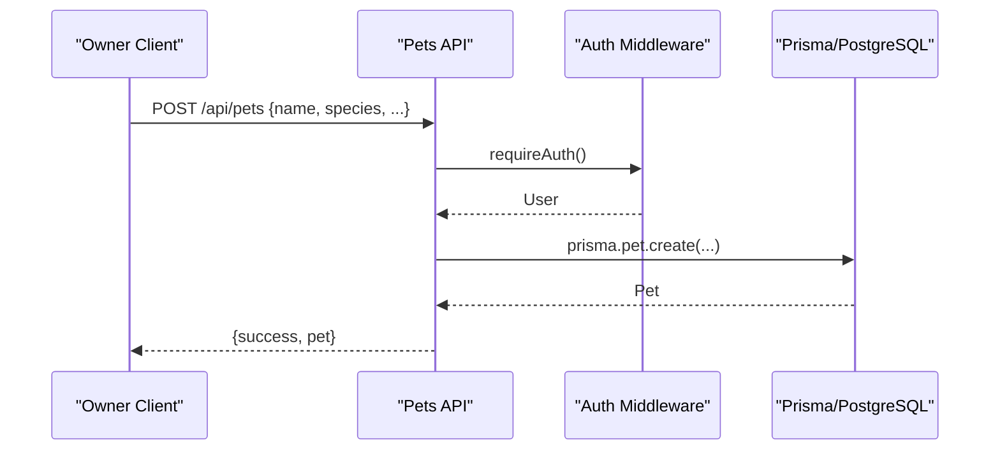
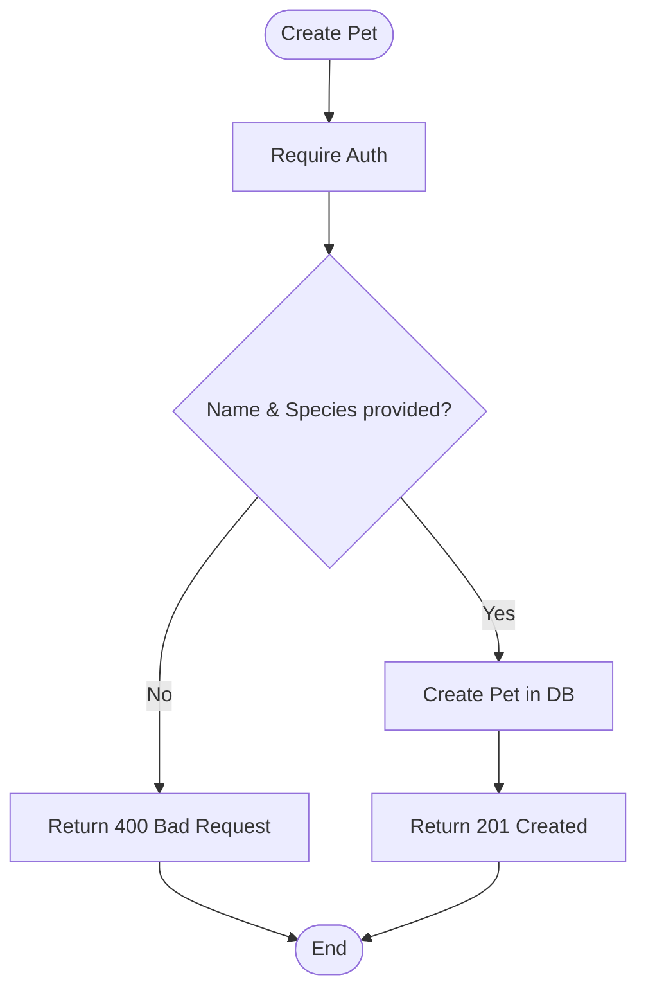
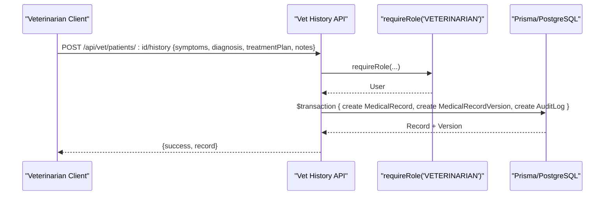
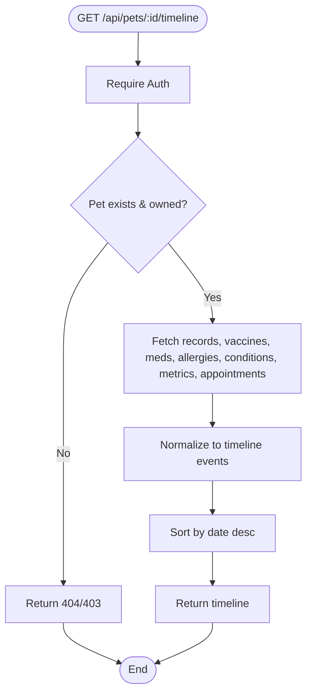
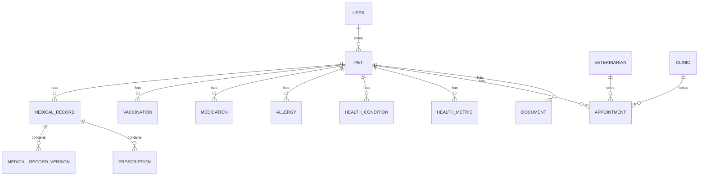

# Pet Health Management

<cite>
**Referenced Files in This Document**
- [schema.prisma](file://prisma/schema.prisma)
- [db.ts](file://lib/db.ts)
- [auth.ts](file://lib/auth.ts)
- [pets route.ts](file://app/api/pets/route.ts)
- [pet detail route.ts](file://app/api/pets/[petId]/route.ts)
- [timeline route.ts](file://app/api/pets/[petId]/timeline/route.ts)
- [vet patients route.ts](file://app/api/vet/patients/route.ts)
- [vet patient detail route.ts](file://app/api/vet/patients/[petId]/route.ts)
- [vet patient history route.ts](file://app/api/vet/patients/[petId]/history/route.ts)
- [appointments route.ts](file://app/api/appointments/route.ts)
- [clinics route.ts](file://app/api/clinics/route.ts)
</cite>

## Table of Contents
1. [Introduction](#introduction)
2. [Project Structure](#project-structure)
3. [Core Components](#core-components)
4. [Architecture Overview](#architecture-overview)
5. [Detailed Component Analysis](#detailed-component-analysis)
6. [Dependency Analysis](#dependency-analysis)
7. [Performance Considerations](#performance-considerations)
8. [Troubleshooting Guide](#troubleshooting-guide)
9. [Conclusion](#conclusion)
10. [Appendices](#appendices)

## Introduction
This document explains the Pet Health Management system in PETIVA, focusing on:
- Pet profile creation and management (breed, age tracking via date of birth, weight monitoring, owner associations)
- Medical record system with versioning, vaccination history, medication management, and allergy logging
- Health metrics monitoring for vital signs and growth patterns over time
- Timeline feature providing chronological views of health events, medical interventions, and milestones
- Database schema relationships among pets, medical records, vaccinations, medications, allergies, conditions, metrics, appointments, and users
- Common workflows (adding medical records, updating vaccination schedules, generating health reports)
- Data validation rules, business constraints, and data integrity measures
- Performance considerations for large medical histories and caching strategies for frequently accessed pet information

## Project Structure
The system is a Next.js application using Prisma with PostgreSQL. Core API routes handle pet profiles, timelines, veterinary access, appointments, and clinics. Authentication and session management are centralized. The database schema defines entities and relationships for comprehensive pet health tracking.

**Diagram sources**
- [pets route.ts:1-69](file://app/api/pets/route.ts#L1-L69)
- [pet detail route.ts:1-141](file://app/api/pets/[petId]/route.ts#L1-L141)
- [timeline route.ts:1-149](file://app/api/pets/[petId]/timeline/route.ts#L1-L149)
- [vet patients route.ts:1-71](file://app/api/vet/patients/route.ts#L1-L71)
- [vet patient detail route.ts:1-80](file://app/api/vet/patients/[petId]/route.ts#L1-L80)
- [vet patient history route.ts:1-153](file://app/api/vet/patients/[petId]/history/route.ts#L1-L153)
- [appointments route.ts:1-143](file://app/api/appointments/route.ts#L1-L143)
- [clinics route.ts:1-49](file://app/api/clinics/route.ts#L1-L49)
- [auth.ts:1-125](file://lib/auth.ts#L1-L125)
- [db.ts:1-33](file://lib/db.ts#L1-L33)

**Section sources**
- [pets route.ts:1-69](file://app/api/pets/route.ts#L1-L69)
- [pet detail route.ts:1-141](file://app/api/pets/[petId]/route.ts#L1-L141)
- [timeline route.ts:1-149](file://app/api/pets/[petId]/timeline/route.ts#L1-L149)
- [vet patients route.ts:1-71](file://app/api/vet/patients/route.ts#L1-L71)
- [vet patient detail route.ts:1-80](file://app/api/vet/patients/[petId]/route.ts#L1-L80)
- [vet patient history route.ts:1-153](file://app/api/vet/patients/[petId]/history/route.ts#L1-L153)
- [appointments route.ts:1-143](file://app/api/appointments/route.ts#L1-L143)
- [clinics route.ts:1-49](file://app/api/clinics/route.ts#L1-L49)
- [auth.ts:1-125](file://lib/auth.ts#L1-L125)
- [db.ts:1-33](file://lib/db.ts#L1-L33)

## Core Components
- Pet Profiles: Create, read, update, delete; include name, species, breed, gender, date of birth, weight; linked to owner user.
- Medical Records: Versioned entries per visit; current version flag; prescriptions linked to records.
- Vaccinations: Track vaccine name, administered date, due date, vet name.
- Medications: Track name, dosage, frequency, start/end dates, status.
- Allergies: Track allergen and severity.
- Health Conditions: Track condition name, onset date, status.
- Health Metrics: Time-series measurements (e.g., weight, temperature) with value and unit.
- Appointments: Bookings linking pet, owner, vet, clinic, date/time, reason, status.
- Clinics and Veterinarians: Clinic entities and vet profiles with verification and association to clinics.
- Audit Logs: Record changes for traceability.

**Section sources**
- [schema.prisma:30-312](file://prisma/schema.prisma#L30-L312)

## Architecture Overview
The system follows a layered architecture:
- API layer: Route handlers enforce authentication and authorization, validate inputs, and orchestrate data operations.
- Service logic: Business rules such as ownership checks, double-booking prevention, and timeline aggregation.
- Data layer: Prisma client interacts with PostgreSQL, leveraging indexes and transactions for consistency.

**Diagram sources**
- [pets route.ts:30-69](file://app/api/pets/route.ts#L30-L69)
- [auth.ts:109-115](file://lib/auth.ts#L109-L115)
- [db.ts:1-33](file://lib/db.ts#L1-L33)

**Section sources**
- [pets route.ts:1-69](file://app/api/pets/route.ts#L1-L69)
- [auth.ts:1-125](file://lib/auth.ts#L1-L125)
- [db.ts:1-33](file://lib/db.ts#L1-L33)

## Detailed Component Analysis

### Pet Profile Creation and Management
- Create pet: Validates required fields (name, species), associates with authenticated owner, stores optional breed/gender/dateOfBirth/weight.
- Read pets: Lists all pets owned by the authenticated user.
- Update pet: Enforces ownership, validates required fields, updates fields including dateOfBirth and weight.
- Delete pet: Enforces ownership, removes pet record.

**Diagram sources**
- [pets route.ts:30-69](file://app/api/pets/route.ts#L30-L69)

**Section sources**
- [pets route.ts:1-69](file://app/api/pets/route.ts#L1-L69)
- [pet detail route.ts:1-141](file://app/api/pets/[petId]/route.ts#L1-L141)
- [schema.prisma:68-88](file://prisma/schema.prisma#L68-L88)

### Medical Record System with Versioning
- Create medical record: Requires symptoms, diagnosis, treatment plan; creates record header and first version; logs audit entry.
- Read history: Returns full medical records with versions, vet info, plus related vaccinations, medications, allergies, conditions, metrics.
- Versioning: Each record has multiple versions; current version flagged; queries can filter by isCurrent.

**Diagram sources**
- [vet patient history route.ts:71-153](file://app/api/vet/patients/[petId]/history/route.ts#L71-L153)
- [auth.ts:117-125](file://lib/auth.ts#L117-L125)
- [schema.prisma:133-162](file://prisma/schema.prisma#L133-L162)

**Section sources**
- [vet patient history route.ts:1-153](file://app/api/vet/patients/[petId]/history/route.ts#L1-L153)
- [schema.prisma:133-162](file://prisma/schema.prisma#L133-L162)

### Vaccination History Tracking
- Stores vaccine name, administered date, optional due date, and vet name.
- Used in timeline to show next booster due dates and historical vaccinations.

**Section sources**
- [schema.prisma:196-204](file://prisma/schema.prisma#L196-L204)
- [timeline route.ts:72-80](file://app/api/pets/[petId]/timeline/route.ts#L72-L80)

### Medication Management
- Tracks medication name, dosage, frequency, start/end dates, and status (default ACTIVE).
- Timeline includes active medications and their details.

**Section sources**
- [schema.prisma:206-216](file://prisma/schema.prisma#L206-L216)
- [timeline route.ts:82-90](file://app/api/pets/[petId]/timeline/route.ts#L82-L90)

### Allergy Logging
- Captures allergen and optional severity; timestamped for timeline.

**Section sources**
- [schema.prisma:218-225](file://prisma/schema.prisma#L218-L225)
- [timeline route.ts:92-100](file://app/api/pets/[petId]/timeline/route.ts#L92-L100)

### Health Metrics Monitoring
- Time-series model for metricType (e.g., WEIGHT, TEMPERATURE), value, unit, takenAt.
- Timeline aggregates metric updates chronologically.

**Section sources**
- [schema.prisma:236-244](file://prisma/schema.prisma#L236-L244)
- [timeline route.ts:112-120](file://app/api/pets/[petId]/timeline/route.ts#L112-L120)

### Timeline Feature
- Aggregates medical records, vaccinations, medications, allergies, conditions, metrics, and appointments into a unified chronological view.
- Sorts events descending by date; includes metadata for each event type.

**Diagram sources**
- [timeline route.ts:1-149](file://app/api/pets/[petId]/timeline/route.ts#L1-L149)

**Section sources**
- [timeline route.ts:1-149](file://app/api/pets/[petId]/timeline/route.ts#L1-L149)

### Veterinary Access Control
- Vet-only endpoints list authorized patients based on confirmed appointments with the vet.
- Vet patient detail requires a confirmed appointment to access pet details.

**Section sources**
- [vet patients route.ts:1-71](file://app/api/vet/patients/route.ts#L1-L71)
- [vet patient detail route.ts:1-80](file://app/api/vet/patients/[petId]/route.ts#L1-L80)

### Appointments and Double-Booking Prevention
- Owners can request appointments; vets can view their appointments; clinic admins see clinic-wide appointments.
- Double-booking prevention uses a transaction to check conflicts before creating an appointment.

**Section sources**
- [appointments route.ts:1-143](file://app/api/appointments/route.ts#L1-L143)
- [schema.prisma:164-182](file://prisma/schema.prisma#L164-L182)

### Clinics
- Vets retrieve associated clinics; public discovery returns verified clinics.

**Section sources**
- [clinics route.ts:1-49](file://app/api/clinics/route.ts#L1-L49)
- [schema.prisma:107-131](file://prisma/schema.prisma#L107-L131)

## Dependency Analysis
Key dependencies and relationships:
- API routes depend on auth middleware for authentication and role-based authorization.
- API routes depend on Prisma client configured with PostgreSQL connection pooling.
- Schema models define relationships: Pet links to User (owner), MedicalRecord, Vaccination, Medication, Allergy, HealthCondition, HealthMetric, Appointment, Document.
- MedicalRecord links to Veterinarian and Clinic; MedicalRecordVersion tracks edits and current version.
- Appointment links Pet, Owner, Veterinarian, Clinic.

**Diagram sources**
- [schema.prisma:30-312](file://prisma/schema.prisma#L30-L312)

**Section sources**
- [schema.prisma:30-312](file://prisma/schema.prisma#L30-L312)

## Performance Considerations
- Database connections: Production uses a dedicated pool; development reuses global pool/client to avoid leaks.
- Query efficiency:
  - Timeline aggregates multiple tables; consider pagination or filtering by date ranges for large histories.
  - Use indexes already defined on petId, timestamps, and composite keys where applicable.
- Transactions:
  - Medical record creation uses a single transaction to ensure atomicity across record, version, and audit log.
  - Appointment booking uses a transaction to prevent double bookings.
- Caching strategies:
  - Cache frequent pet profiles and timelines at the API layer or CDN for short TTLs.
  - Cache vet patient lists per vet session or per minute to reduce repeated lookups.
  - Invalidate caches on write operations (create/update/delete).
- Concurrency:
  - Leverage database-level constraints and unique indexes to maintain integrity under concurrent writes.
- Large histories:
  - Implement server-side pagination for timelines and histories.
  - Consider materialized views or summary tables for common aggregations (e.g., latest metrics, upcoming vaccinations).

[No sources needed since this section provides general guidance]

## Troubleshooting Guide
Common errors and handling:
- Unauthorized: Missing or invalid session token; handled by requireAuth returning 401.
- Forbidden: Insufficient role or ownership; handled by requireRole or explicit ownership checks returning 403.
- Not Found: Pet or veterinarian profile not found; returns 404.
- Bad Request: Missing required fields (e.g., name/species for pets; symptoms/diagnosis/treatmentPlan for medical records); returns 400.
- Conflict: Double-booking detected during appointment creation; returns 409.
- Internal Server Error: Unexpected exceptions; returns 500.

Operational tips:
- Verify environment variables for DATABASE_URL and NODE_ENV to ensure correct connection pooling.
- Ensure sessions are valid and not expired; sliding window refreshes sessions near expiry.
- For vet access issues, confirm that a CONFIRMED appointment exists between the vet and the pet.

**Section sources**
- [auth.ts:109-125](file://lib/auth.ts#L109-L125)
- [pets route.ts:1-69](file://app/api/pets/route.ts#L1-L69)
- [pet detail route.ts:1-141](file://app/api/pets/[petId]/route.ts#L1-L141)
- [vet patient history route.ts:1-153](file://app/api/vet/patients/[petId]/history/route.ts#L1-L153)
- [appointments route.ts:1-143](file://app/api/appointments/route.ts#L1-L143)

## Conclusion
The Pet Health Management system provides robust capabilities for managing pet profiles, medical records with versioning, vaccination and medication tracking, allergy logging, health metrics, and a unified timeline. Strong authentication and authorization ensure data privacy, while database constraints and transactions maintain integrity. Performance optimizations like connection pooling, indexing, transactions, and caching strategies support scalability for large medical histories.

[No sources needed since this section summarizes without analyzing specific files]

## Appendices

### Common Workflows

- Adding a new medical record
  - Authenticate as veterinarian.
  - Call POST /api/vet/patients/:petId/history with symptoms, diagnosis, treatment plan, and optional notes.
  - System creates a medical record, initial version, and audit log within a transaction.

- Updating vaccination schedules
  - Add a new Vaccination record for the pet with vaccine name, administered date, optional due date, and vet name.
  - Timeline will reflect next booster due date if present.

- Generating health reports
  - Retrieve timeline via GET /api/pets/:petId/timeline to aggregate all relevant events.
  - Optionally fetch full history via GET /api/vet/patients/:petId/history for detailed records and related data.

**Section sources**
- [vet patient history route.ts:71-153](file://app/api/vet/patients/[petId]/history/route.ts#L71-L153)
- [timeline route.ts:1-149](file://app/api/pets/[petId]/timeline/route.ts#L1-L149)
- [schema.prisma:196-204](file://prisma/schema.prisma#L196-L204)

### Data Validation Rules and Business Constraints
- Pet creation/update requires name and species; optional fields include breed, gender, dateOfBirth, weight.
- Medical record creation requires symptoms, diagnosis, treatment plan.
- Appointment creation requires petId, vetId, clinicId, dateTime, reason; enforces pet ownership and prevents double booking.
- Role-based access:
  - Owner endpoints require PET_OWNER role implicitly via session.
  - Vet endpoints require VETERINARIAN role and confirmed appointment for patient access.
- Data integrity:
  - Foreign key constraints enforced by Prisma and database.
  - Unique constraints on email, licenseNumber, and vet-clinic associations.
  - Audit logs capture significant changes for traceability.

**Section sources**
- [pets route.ts:30-69](file://app/api/pets/route.ts#L30-L69)
- [pet detail route.ts:54-104](file://app/api/pets/[petId]/route.ts#L54-L104)
- [vet patient history route.ts:71-153](file://app/api/vet/patients/[petId]/history/route.ts#L71-L153)
- [appointments route.ts:69-143](file://app/api/appointments/route.ts#L69-L143)
- [schema.prisma:30-312](file://prisma/schema.prisma#L30-L312)