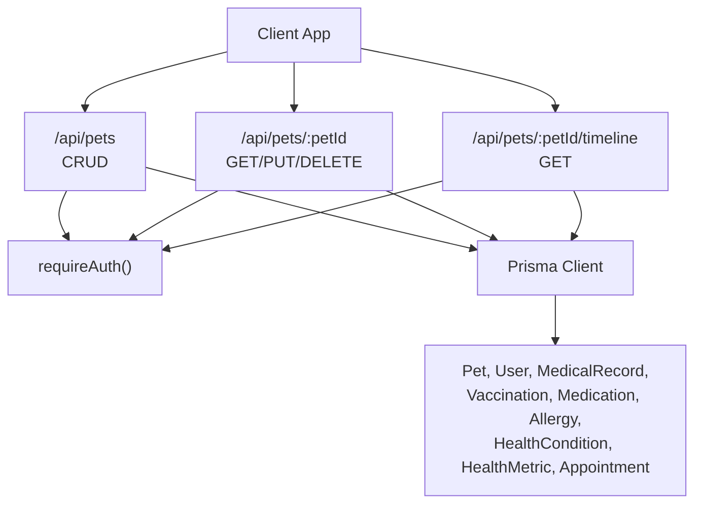
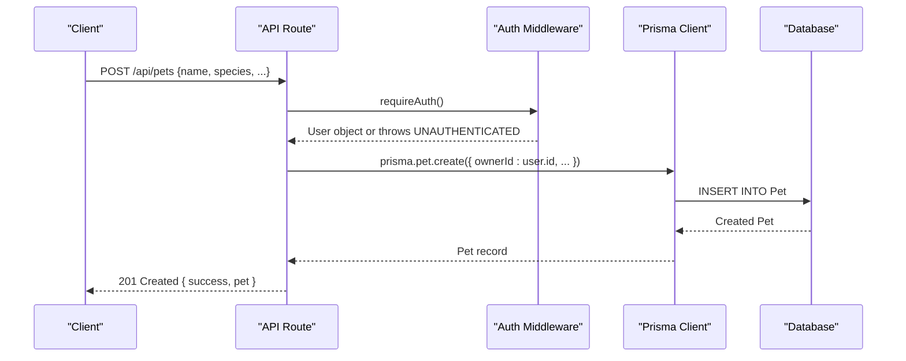
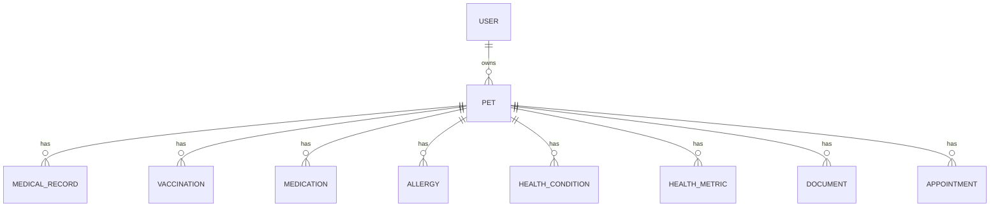
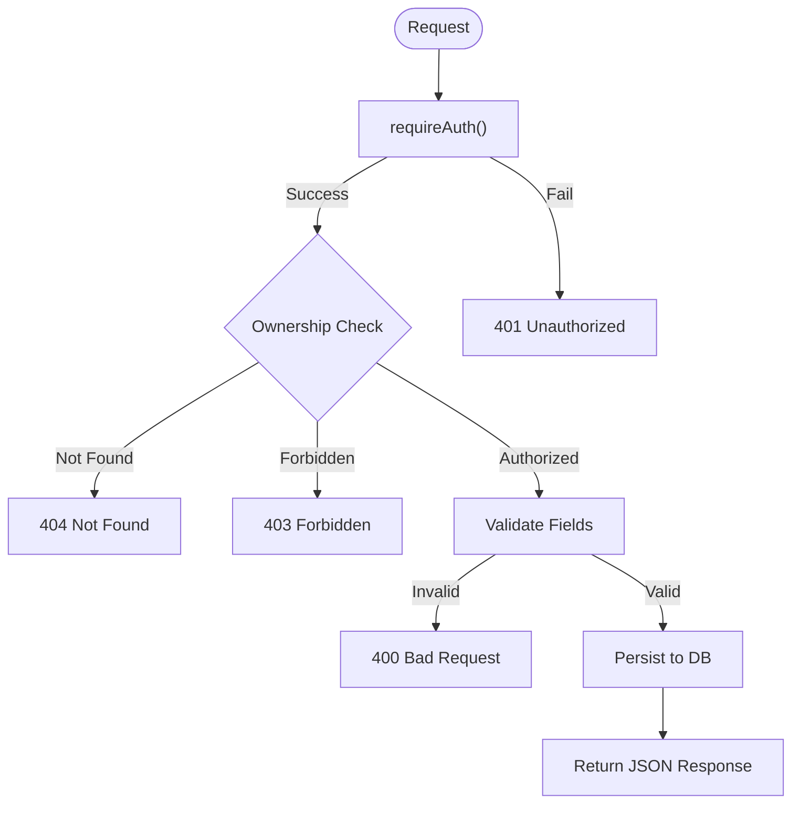
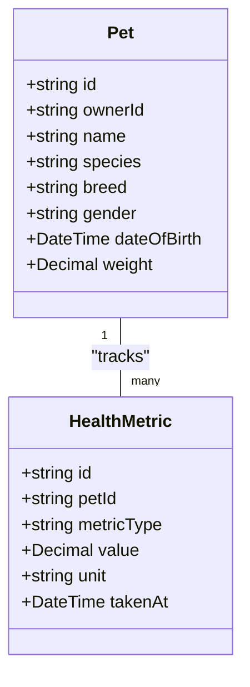
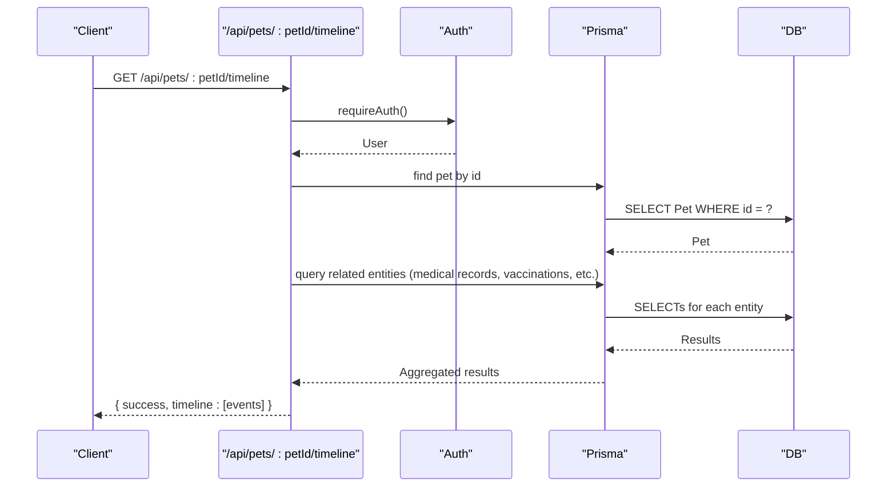
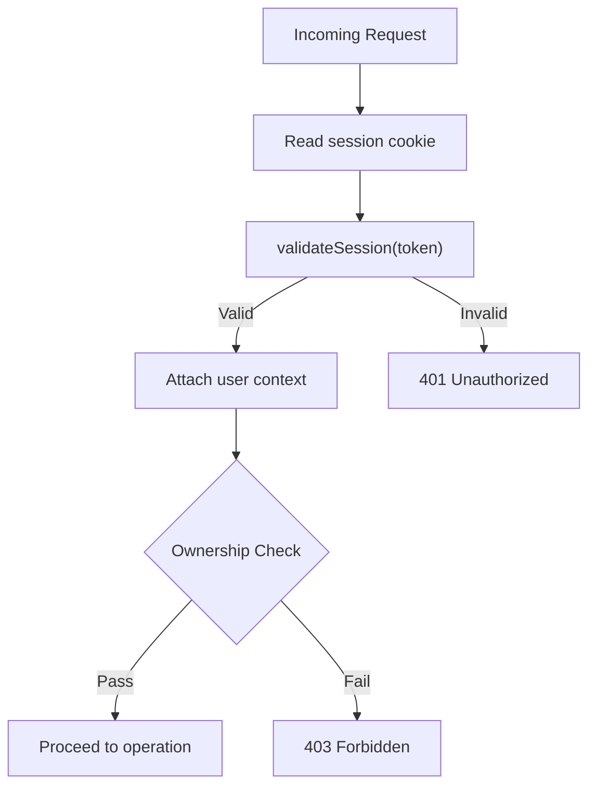
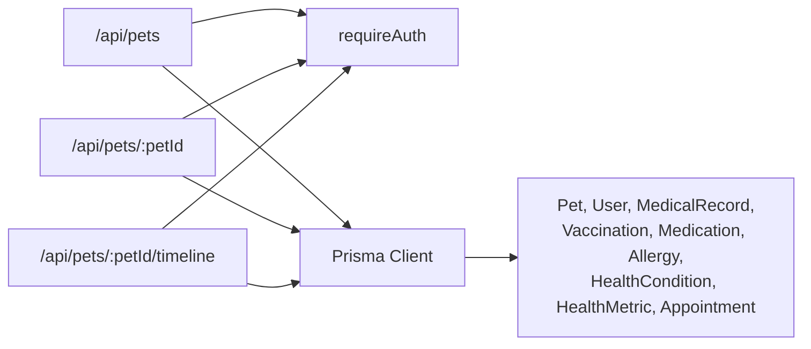

# Pet Profiles

<cite>
**Referenced Files in This Document**
- [schema.prisma](file://prisma/schema.prisma)
- [route.ts (pets)](file://app/api/pets/route.ts)
- [route.ts (pet detail, update, delete)](file://app/api/pets/[petId]/route.ts)
- [route.ts (timeline)](file://app/api/pets/[petId]/timeline/route.ts)
- [auth.ts](file://lib/auth.ts)
- [db.ts](file://lib/db.ts)
</cite>

## Table of Contents
1. [Introduction](#introduction)
2. [Project Structure](#project-structure)
3. [Core Components](#core-components)
4. [Architecture Overview](#architecture-overview)
5. [Detailed Component Analysis](#detailed-component-analysis)
6. [Dependency Analysis](#dependency-analysis)
7. [Performance Considerations](#performance-considerations)
8. [Troubleshooting Guide](#troubleshooting-guide)
9. [Conclusion](#conclusion)

## Introduction
This document explains the Pet Profiles system in PETIVA. It covers how pet profiles are created and managed, including breed information, species tracking, gender classification, date of birth handling, and weight monitoring. It also documents the database schema for the Pet model and its relationships to Users and medical records, details all API endpoints for CRUD operations, outlines validation rules, provides common workflows, and addresses security considerations such as owner authentication and data isolation.

## Project Structure
The Pet Profiles feature is implemented using Next.js API routes backed by a Prisma-managed PostgreSQL database. Authentication is enforced server-side via session cookies and middleware utilities. The timeline endpoint aggregates multiple health-related entities into a chronological view per pet.

**Diagram sources**
- [route.ts (pets):1-69](file://app/api/pets/route.ts#L1-L69)
- [route.ts (pet detail, update, delete):1-141](file://app/api/pets/[petId]/route.ts#L1-L141)
- [route.ts (timeline):1-149](file://app/api/pets/[petId]/timeline/route.ts#L1-L149)
- [auth.ts:109-115](file://lib/auth.ts#L109-L115)
- [db.ts:1-33](file://lib/db.ts#L1-L33)
- [schema.prisma:30-88](file://prisma/schema.prisma#L30-L88)

**Section sources**
- [route.ts (pets):1-69](file://app/api/pets/route.ts#L1-L69)
- [route.ts (pet detail, update, delete):1-141](file://app/api/pets/[petId]/route.ts#L1-L141)
- [route.ts (timeline):1-149](file://app/api/pets/[petId]/timeline/route.ts#L1-L149)
- [auth.ts:109-115](file://lib/auth.ts#L109-L115)
- [db.ts:1-33](file://lib/db.ts#L1-L33)
- [schema.prisma:30-88](file://prisma/schema.prisma#L30-L88)

## Core Components
- Pet Profile Model: Stores core identity and attributes for each pet profile.
- Owner Relationship: Each pet belongs to a single authenticated user (owner).
- Health Data Associations: Pets link to medical records, vaccinations, medications, allergies, conditions, metrics, documents, and appointments.
- API Layer: Next.js route handlers enforce authentication, validate inputs, and perform authorization checks before interacting with the database.
- Timeline Aggregation: A dedicated endpoint consolidates multiple health events into a unified chronological list.

**Section sources**
- [schema.prisma:68-88](file://prisma/schema.prisma#L68-L88)
- [route.ts (pets):1-69](file://app/api/pets/route.ts#L1-L69)
- [route.ts (pet detail, update, delete):1-141](file://app/api/pets/[petId]/route.ts#L1-L141)
- [route.ts (timeline):1-149](file://app/api/pets/[petId]/timeline/route.ts#L1-L149)

## Architecture Overview
The Pet Profiles architecture follows a layered approach:
- Presentation layer: Client applications call REST-like endpoints.
- API layer: Route handlers authenticate users, validate requests, and enforce ownership.
- Data access layer: Prisma Client queries the PostgreSQL database.
- Security layer: Session-based authentication with cookie storage and server-side validation.

**Diagram sources**
- [route.ts (pets):31-55](file://app/api/pets/route.ts#L31-L55)
- [auth.ts:109-115](file://lib/auth.ts#L109-L115)
- [schema.prisma:68-88](file://prisma/schema.prisma#L68-L88)

## Detailed Component Analysis

### Database Schema: Pet Model and Relationships
- Pet fields:
  - id: unique identifier
  - ownerId: links to User
  - name: required string
  - species: required string
  - breed: optional string
  - gender: optional string
  - dateOfBirth: optional datetime
  - weight: optional decimal
  - createdAt, updatedAt: timestamps
- Relationships:
  - One-to-many with MedicalRecord, Vaccination, Medication, Allergy, HealthCondition, HealthMetric, Document, Appointment
  - Many-to-one with User (owner)

**Diagram sources**
- [schema.prisma:30-88](file://prisma/schema.prisma#L30-L88)
- [schema.prisma:133-244](file://prisma/schema.prisma#L133-L244)

**Section sources**
- [schema.prisma:68-88](file://prisma/schema.prisma#L68-L88)
- [schema.prisma:133-244](file://prisma/schema.prisma#L133-L244)

### API Endpoints: Create, Retrieve, Update, Delete
- GET /api/pets
  - Purpose: List all pets belonging to the authenticated owner.
  - Authentication: Required.
  - Response: Array of pet profiles owned by the current user.
- POST /api/pets
  - Purpose: Create a new pet profile.
  - Authentication: Required.
  - Request body fields:
    - name: required string
    - species: required string
    - breed: optional string
    - gender: optional string
    - dateOfBirth: optional datetime string; converted to Date on server
    - weight: optional numeric string; converted to Decimal on server
  - Validation: Requires name and species; returns 400 if missing.
  - Response: Created pet profile with 201 status.
- GET /api/pets/:petId
  - Purpose: Retrieve a specific pet profile.
  - Authentication: Required.
  - Authorization: Ownership check ensures the requester owns the pet.
  - Response: Pet profile or error (404 not found, 403 forbidden).
- PUT /api/pets/:petId
  - Purpose: Update pet profile fields.
  - Authentication: Required.
  - Authorization: Ownership check enforced.
  - Request body fields: same as create; name and species required.
  - Response: Updated pet profile.
- DELETE /api/pets/:petId
  - Purpose: Delete a pet profile.
  - Authentication: Required.
  - Authorization: Ownership check enforced.
  - Response: Success message.

**Diagram sources**
- [route.ts (pet detail, update, delete):6-20](file://app/api/pets/[petId]/route.ts#L6-L20)
- [route.ts (pet detail, update, delete):22-104](file://app/api/pets/[petId]/route.ts#L22-L104)
- [route.ts (pet detail, update, delete):106-141](file://app/api/pets/[petId]/route.ts#L106-L141)
- [route.ts (pets):6-28](file://app/api/pets/route.ts#L6-L28)
- [route.ts (pets):31-68](file://app/api/pets/route.ts#L31-L68)

**Section sources**
- [route.ts (pets):1-69](file://app/api/pets/route.ts#L1-L69)
- [route.ts (pet detail, update, delete):1-141](file://app/api/pets/[petId]/route.ts#L1-L141)

### Validation Rules and Data Types
- Required fields:
  - name: non-empty string
  - species: non-empty string
- Optional fields:
  - breed: string
  - gender: string
  - dateOfBirth: datetime string; stored as DateTime
  - weight: numeric string; stored as Decimal
- Type conversions:
  - dateOfBirth parsed to Date before persistence
  - weight parsed to number then stored as Decimal
- Error responses:
  - 400 for missing required fields
  - 401 for unauthenticated requests
  - 403 for unauthorized access to another user’s pet
  - 404 when pet does not exist
  - 500 for internal server errors

**Section sources**
- [route.ts (pets):31-68](file://app/api/pets/route.ts#L31-L68)
- [route.ts (pet detail, update, delete):54-104](file://app/api/pets/[petId]/route.ts#L54-L104)

### Breed Information, Species Tracking, Gender Classification
- Breed:
  - Stored as an optional string field on the Pet model.
  - No strict enumeration; free-form text.
- Species:
  - Required string field; used to classify the animal type.
  - UI supports selecting among predefined options (e.g., Dog, Cat, Other), but backend accepts any non-empty string.
- Gender:
  - Optional string field; commonly Male/Female.
  - No enforced enum at the API level; clients should provide consistent values.

**Section sources**
- [schema.prisma:68-88](file://prisma/schema.prisma#L68-L88)

### Date of Birth Calculation
- Storage:
  - dateOfBirth is stored as DateTime when provided.
- Calculation:
  - Age calculation is not performed server-side in the pet endpoints.
  - Clients can compute age from dateOfBirth as needed.
- Handling:
  - If dateOfBirth is omitted, it remains null.

**Section sources**
- [schema.prisma:68-88](file://prisma/schema.prisma#L68-L88)
- [route.ts (pets):31-68](file://app/api/pets/route.ts#L31-L68)

### Weight Monitoring and Health Metrics
- Pet-level weight:
  - Stored as an optional Decimal on the Pet model.
  - Useful for quick reference and display.
- Health metrics:
  - Separate HealthMetric records track time-series measurements (e.g., WEIGHT, TEMPERATURE).
  - Includes metricType, value, unit, and takenAt timestamp.
- Timeline integration:
  - The timeline endpoint aggregates metrics alongside other health events.

**Diagram sources**
- [schema.prisma:68-88](file://prisma/schema.prisma#L68-L88)
- [schema.prisma:236-244](file://prisma/schema.prisma#L236-L244)

**Section sources**
- [schema.prisma:68-88](file://prisma/schema.prisma#L68-L88)
- [schema.prisma:236-244](file://prisma/schema.prisma#L236-L244)
- [route.ts (timeline):33-120](file://app/api/pets/[petId]/timeline/route.ts#L33-L120)

### Timeline Endpoint: Chronological Health Events
- Purpose:
  - Returns a unified timeline of health-related events for a specific pet.
- Included event types:
  - Medical records (with current version)
  - Vaccinations
  - Medications
  - Allergies
  - Health conditions
  - Health metrics
  - Appointments
- Ordering:
  - Events sorted chronologically descending (newest first).
- Authorization:
  - Ownership check ensures only the pet owner can retrieve the timeline.

**Diagram sources**
- [route.ts (timeline):1-149](file://app/api/pets/[petId]/timeline/route.ts#L1-L149)
- [schema.prisma:133-244](file://prisma/schema.prisma#L133-L244)

**Section sources**
- [route.ts (timeline):1-149](file://app/api/pets/[petId]/timeline/route.ts#L1-L149)

### Common Workflows
- Adding a new pet profile:
  - Authenticate the user.
  - Send POST /api/pets with name and species (required), plus optional breed, gender, dateOfBirth, weight.
  - Receive 201 Created with the new pet profile.
- Updating pet information:
  - Authenticate and ensure ownership of the pet.
  - Send PUT /api/pets/:petId with updated fields; name and species must be present.
  - Receive updated pet profile.
- Retrieving pet lists for authenticated users:
  - Authenticate the user.
  - Call GET /api/pets to fetch all pets owned by the user.
  - Use GET /api/pets/:petId to get details for a specific pet.

**Section sources**
- [route.ts (pets):6-68](file://app/api/pets/route.ts#L6-L68)
- [route.ts (pet detail, update, delete):22-104](file://app/api/pets/[petId]/route.ts#L22-L104)

### Security Considerations
- Owner authentication:
  - All endpoints call requireAuth(), which validates the session cookie and returns the current user or throws UNAUTHENTICATED.
- Data isolation:
  - Listing pets filters by ownerId to ensure users only see their own pets.
  - Detail/update/delete operations verify that the requesting user owns the target pet; otherwise return FORBIDDEN.
- Session management:
  - Sessions are stored in the database with hashed tokens and expiration times.
  - Sliding window expiration extends sessions nearing expiry.
  - Cookies are httpOnly and secure in production.

**Diagram sources**
- [auth.ts:46-75](file://lib/auth.ts#L46-L75)
- [auth.ts:109-115](file://lib/auth.ts#L109-L115)
- [route.ts (pet detail, update, delete):6-20](file://app/api/pets/[petId]/route.ts#L6-L20)

**Section sources**
- [auth.ts:46-75](file://lib/auth.ts#L46-L75)
- [auth.ts:109-115](file://lib/auth.ts#L109-L115)
- [route.ts (pet detail, update, delete):6-20](file://app/api/pets/[petId]/route.ts#L6-L20)

## Dependency Analysis
- API routes depend on:
  - Authentication utilities (requireAuth)
  - Prisma client for database operations
- Prisma models define relationships between Pet and related entities.
- Timeline endpoint depends on multiple related models to aggregate events.

**Diagram sources**
- [route.ts (pets):1-69](file://app/api/pets/route.ts#L1-L69)
- [route.ts (pet detail, update, delete):1-141](file://app/api/pets/[petId]/route.ts#L1-L141)
- [route.ts (timeline):1-149](file://app/api/pets/[petId]/timeline/route.ts#L1-L149)
- [schema.prisma:30-244](file://prisma/schema.prisma#L30-L244)

**Section sources**
- [route.ts (pets):1-69](file://app/api/pets/route.ts#L1-L69)
- [route.ts (pet detail, update, delete):1-141](file://app/api/pets/[petId]/route.ts#L1-L141)
- [route.ts (timeline):1-149](file://app/api/pets/[petId]/timeline/route.ts#L1-L149)
- [schema.prisma:30-244](file://prisma/schema.prisma#L30-L244)

## Performance Considerations
- Batched reads:
  - Timeline endpoint uses parallel queries to fetch multiple related entities efficiently.
- Indexing:
  - Ensure indexes on frequently queried fields like petId and ownerId for faster lookups.
- Pagination:
  - Consider adding pagination to pet listing and timeline endpoints for large datasets.
- Input validation:
  - Keep validation minimal and server-side to avoid redundant client-side checks.

[No sources needed since this section provides general guidance]

## Troubleshooting Guide
- 401 Unauthorized:
  - Occurs when no valid session cookie is present or session has expired.
  - Verify login flow and cookie presence.
- 400 Bad Request:
  - Occurs when required fields (name, species) are missing in create/update requests.
  - Ensure request payload includes required fields.
- 403 Forbidden:
  - Occurs when attempting to access another user’s pet.
  - Confirm ownership checks and correct petId usage.
- 404 Not Found:
  - Occurs when the specified pet does not exist.
  - Verify petId and existence in the database.
- 500 Internal Server Error:
  - Indicates server-side issues; check logs and database connectivity.

**Section sources**
- [route.ts (pets):16-28](file://app/api/pets/route.ts#L16-L28)
- [route.ts (pets):56-68](file://app/api/pets/route.ts#L56-L68)
- [route.ts (pet detail, update, delete):31-51](file://app/api/pets/[petId]/route.ts#L31-L51)
- [route.ts (pet detail, update, delete):92-104](file://app/api/pets/[petId]/route.ts#L92-L104)
- [route.ts (pet detail, update, delete):128-141](file://app/api/pets/[petId]/route.ts#L128-L141)

## Conclusion
The Pet Profiles system provides a robust foundation for managing pet identities and health data. It enforces strong authentication and authorization, supports essential pet attributes (species, breed, gender, date of birth, weight), and offers a comprehensive timeline of health events. The API design emphasizes clarity and safety, ensuring data isolation between owners while enabling efficient retrieval and updates. Future enhancements may include pagination, richer validation, and expanded metric tracking capabilities.