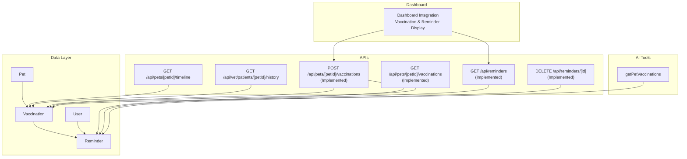
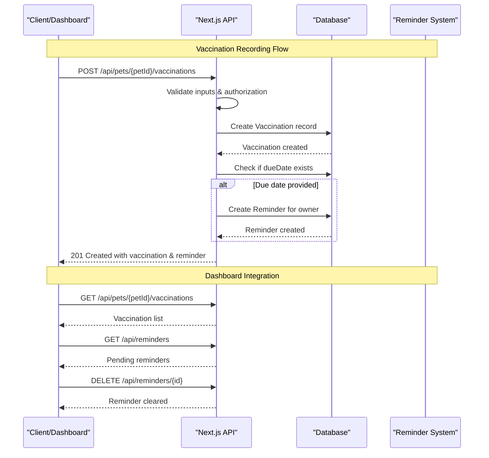
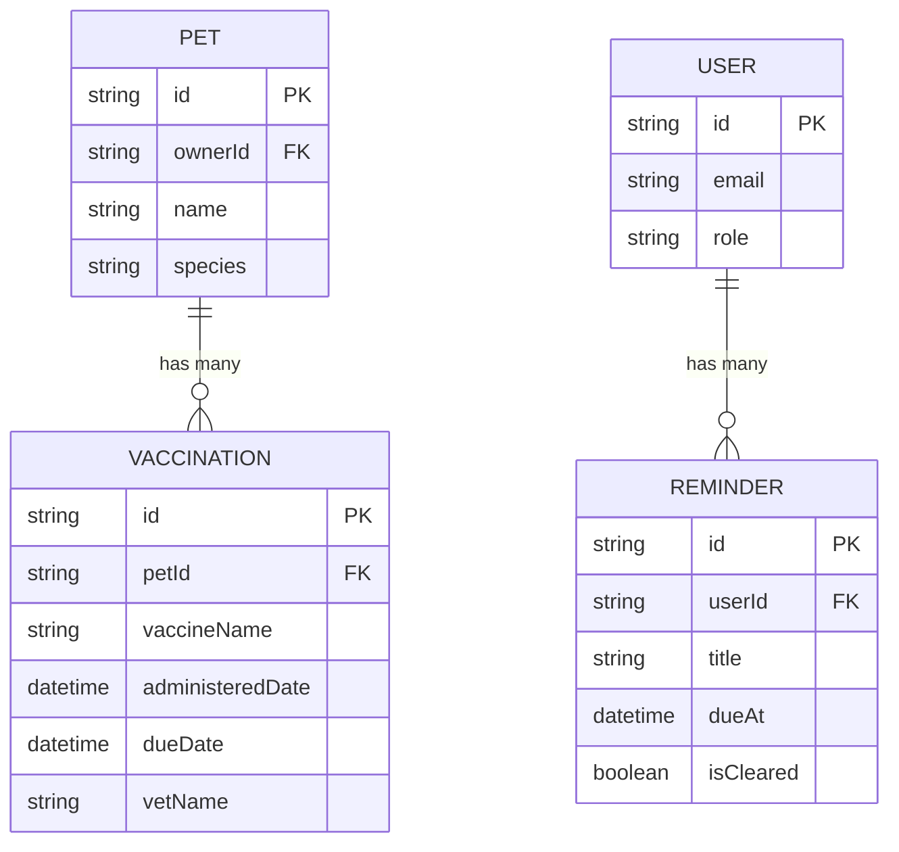
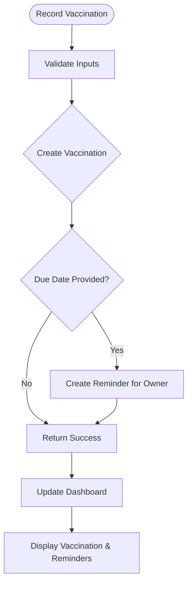
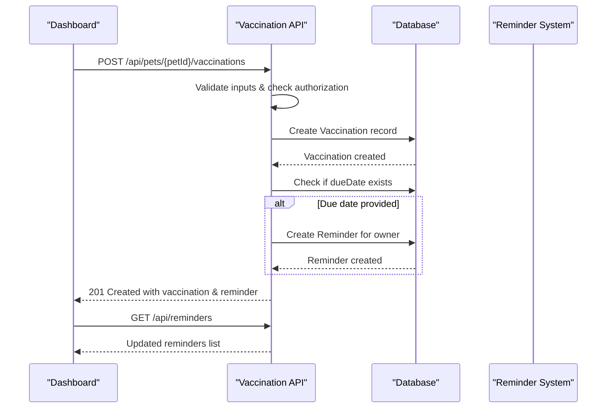
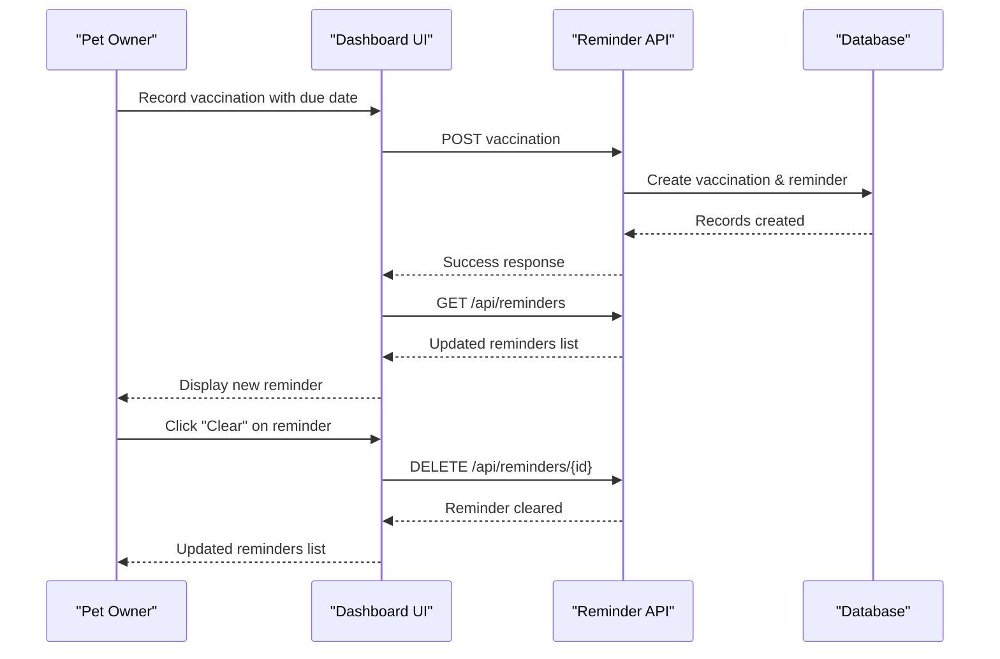
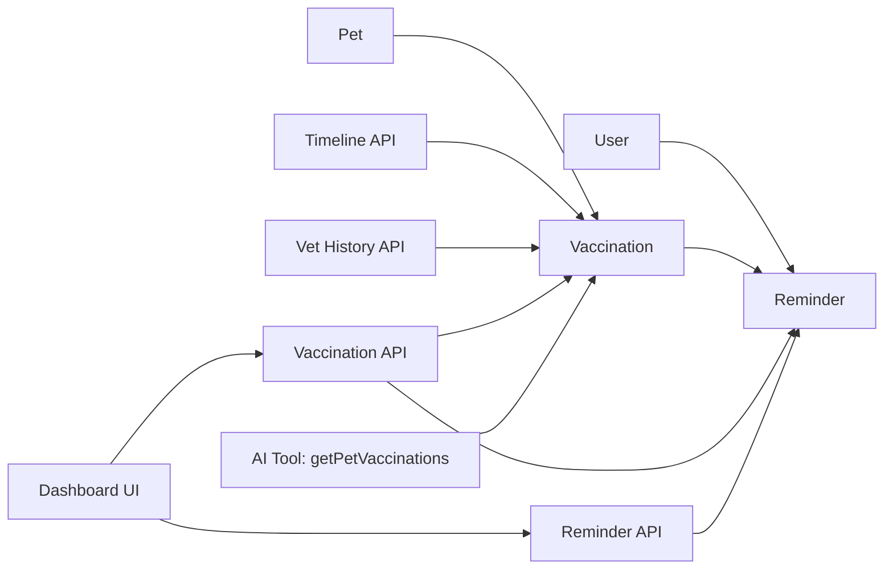

# Vaccination Tracking

<cite>
**Referenced Files in This Document**
- [schema.prisma](file://prisma/schema.prisma)
- [vaccinations route.ts](file://app/api/pets/[petId]/vaccinations/route.ts)
- [reminders route.ts](file://app/api/reminders/route.ts)
- [reminder delete route.ts](file://app/api/reminders/[reminderId]/route.ts)
- [dashboard page.tsx](file://app/dashboard/page.tsx)
- [timeline route.ts](file://app/api/pets/[petId]/timeline/route.ts)
- [vet history route.ts](file://app/api/vet/patients/[petId]/history/route.ts)
- [AI chat route.ts](file://app/api/ai/chat/route.ts)
- [AI tools (lib/ai.ts)](file://lib/ai.ts)
- [API specification.md](file://docs/03-architecture/03-api-specification.md)
- [project blueprint.md](file://docs/01-product/01-project-blueprint.md)
</cite>

## Update Summary
**Changes Made**
- Added comprehensive vaccination recording API endpoint with validation and authorization
- Implemented automated reminder creation for booster due dates
- Enhanced dashboard integration with vaccination tracking and reminder management
- Updated data model documentation to reflect current implementation
- Added new API endpoints for reminder management

## Table of Contents
1. Introduction
2. Project Structure
3. Core Components
4. Architecture Overview
5. Detailed Component Analysis
6. Dependency Analysis
7. Performance Considerations
8. Troubleshooting Guide
9. Conclusion
10. Appendices

## Introduction
This document explains the Vaccination Tracking system within PETIVA. It covers the complete data model for vaccinations, the automated scheduling and reminder system, available API endpoints for recording and viewing vaccination data, validation rules, common workflows, and integration points with veterinary practices and notification systems. The system now includes full CRUD operations for vaccinations with automatic reminder generation for booster due dates.

## Project Structure
Vaccination-related functionality spans several layers with enhanced capabilities:
- Data model: Prisma schema defines the Vaccination entity with relationships to Pet and Reminder entities
- Write APIs: Complete vaccination recording endpoint with validation and automatic reminder creation
- Read APIs: Timeline and vet history endpoints retrieve vaccination records as part of health timelines
- Reminder system: Automated reminder creation and management for booster due dates
- Dashboard integration: Real-time vaccination tracking and reminder display
- AI assistant: Tooling includes functions to read vaccination records for a given pet

**Diagram sources**
- [schema.prisma:201-209](file://prisma/schema.prisma#L201-L209)
- [schema.prisma:275-283](file://prisma/schema.prisma#L275-L283)
- [vaccinations route.ts:51-155](file://app/api/pets/[petId]/vaccinations/route.ts#L51-L155)
- [reminders route.ts:7-29](file://app/api/reminders/route.ts#L7-L29)
- [reminder delete route.ts:8-45](file://app/api/reminders/[reminderId]/route.ts#L8-L45)
- [dashboard page.tsx:252-321](file://app/dashboard/page.tsx#L252-L321)

**Section sources**
- [schema.prisma:201-209](file://prisma/schema.prisma#L201-L209)
- [schema.prisma:275-283](file://prisma/schema.prisma#L275-L283)
- [vaccinations route.ts:51-155](file://app/api/pets/[petId]/vaccinations/route.ts#L51-L155)
- [reminders route.ts:7-29](file://app/api/reminders/route.ts#L7-L29)
- [reminder delete route.ts:8-45](file://app/api/reminders/[reminderId]/route.ts#L8-L45)
- [dashboard page.tsx:252-321](file://app/dashboard/page.tsx#L252-L321)

## Core Components
- **Vaccination data model**: Stores vaccine name, administered date, optional due date, and optional administering veterinarian name. Linked to a specific pet.
- **Automated reminder system**: Creates reminders automatically when booster due dates are set during vaccination recording.
- **Complete vaccination API**: Full CRUD operations for vaccination records with proper authorization and validation.
- **Dashboard integration**: Real-time display of vaccination history, status indicators, and pending reminders.
- **Timeline view**: Aggregates vaccination events into chronological timelines alongside other medical records.
- **Veterinary access**: Comprehensive history views for veterinarians with full medical context.
- **AI tooling**: Exposes tools to fetch vaccination records for conversational access to vaccination history.

Key responsibilities:
- **Data persistence**: Vaccination records stored via Prisma with proper relationships
- **Authorization**: Role-based access control (PET_OWNER for recording, VETERINARIAN for history)
- **Validation**: Comprehensive input validation including date constraints and format checks
- **Automation**: Automatic reminder creation for booster due dates
- **Integration**: Seamless dashboard integration with real-time updates

**Section sources**
- [schema.prisma:201-209](file://prisma/schema.prisma#L201-L209)
- [schema.prisma:275-283](file://prisma/schema.prisma#L275-L283)
- [vaccinations route.ts:51-155](file://app/api/pets/[petId]/vaccinations/route.ts#L51-L155)
- [dashboard page.tsx:252-321](file://app/dashboard/page.tsx#L252-L321)
- [timeline route.ts:6-31](file://app/api/pets/[petId]/timeline/route.ts#L6-L31)
- [vet history route.ts:7-21](file://app/api/vet/patients/[petId]/history/route.ts#L7-L21)

## Architecture Overview
The system follows a layered architecture with enhanced automation:
- **Presentation/UI**: Dashboard displays vaccination status, history, and reminders with real-time updates
- **API layer**: Next.js routes handle authentication, authorization, validation, and orchestration
- **Business logic**: Automated reminder creation and validation rules
- **Data layer**: Prisma client queries PostgreSQL for vaccination, reminder, and related records
- **AI layer**: Tool functions allow the AI assistant to read vaccination data

**Diagram sources**
- [vaccinations route.ts:51-155](file://app/api/pets/[petId]/vaccinations/route.ts#L51-L155)
- [reminders route.ts:7-29](file://app/api/reminders/route.ts#L7-L29)
- [reminder delete route.ts:8-45](file://app/api/reminders/[reminderId]/route.ts#L8-L45)
- [dashboard page.tsx:252-321](file://app/dashboard/page.tsx#L252-L321)

## Detailed Component Analysis

### Vaccination Data Model
- **Entity**: Vaccination
- **Fields**:
  - id: Primary key (UUID)
  - petId: Foreign key to Pet
  - vaccineName: String (required)
  - administeredDate: DateTime (required)
  - dueDate: Optional DateTime (for booster schedules)
  - vetName: Optional String (administering veterinarian)
- **Relationships**:
  - One-to-many from Pet to Vaccination
  - No direct relationship to Reminder (created independently)
- **Notes**:
  - Batch numbers are not modeled but could be added to vaccineName field
  - Administering veterinarian captured as free-form text; structured vet linkage possible

**Diagram sources**
- [schema.prisma:70-91](file://prisma/schema.prisma#L70-L91)
- [schema.prisma:201-209](file://prisma/schema.prisma#L201-L209)
- [schema.prisma:275-283](file://prisma/schema.prisma#L275-L283)
- [schema.prisma:30-55](file://prisma/schema.prisma#L30-L55)

**Section sources**
- [schema.prisma:201-209](file://prisma/schema.prisma#L201-L209)
- [schema.prisma:275-283](file://prisma/schema.prisma#L275-L283)

### Automated Scheduling and Reminder System
**Current Implementation**:
- **Automatic reminder creation**: When a vaccination is recorded with a due date, a reminder is automatically created for the pet owner
- **Reminder management**: Complete CRUD operations for reminders with ownership verification
- **Dashboard integration**: Real-time display of pending reminders with clear functionality

**Workflow**:
1. User records vaccination with optional due date
2. System validates inputs and creates vaccination record
3. If due date exists, system automatically creates reminder for owner
4. Dashboard displays both vaccination status and pending reminders
5. Users can clear reminders when completed

[No sources needed since this diagram shows conceptual workflow]

### API Endpoints

#### Record a Vaccination
- **Endpoint**: POST /api/pets/[petId]/vaccinations
- **Status**: ✅ Fully Implemented
- **Authorization**: PET_OWNER role required
- **Request fields**:
  - vaccineName: required string
  - administeredDate: required ISO datetime (cannot be in future)
  - dueDate: optional ISO datetime (must be after administeredDate)
  - vetName: optional string
- **Response**: Created vaccination details and associated reminder (if applicable)
- **Validation**: Comprehensive input validation with specific error messages

**Section sources**
- [vaccinations route.ts:51-155](file://app/api/pets/[petId]/vaccinations/route.ts#L51-L155)

#### List Vaccinations
- **Endpoint**: GET /api/pets/[petId]/vaccinations
- **Authorization**: Pet owner only (ownership verified server-side)
- **Returns**: All vaccination records for the specified pet, ordered by administered date (newest first)

**Section sources**
- [vaccinations route.ts:9-49](file://app/api/pets/[petId]/vaccinations/route.ts#L9-L49)

#### View Vaccination History
- **Endpoint**: GET /api/vet/patients/[petId]/history
- **Authorization**: Veterinarian role with authorized access to the pet
- **Returns**: Full history including vaccinations, medical records, medications, allergies, conditions, and metrics

**Section sources**
- [vet history route.ts:7-21](file://app/api/vet/patients/[petId]/history/route.ts#L7-L21)
- [vet history route.ts:23-56](file://app/api/vet/patients/[petId]/history/route.ts#L23-L56)

#### View Vaccination Timeline
- **Endpoint**: GET /api/pets/[petId]/timeline
- **Authorization**: Pet owner only
- **Returns**: Chronological timeline including vaccination events with titles and descriptions

**Section sources**
- [timeline route.ts:6-31](file://app/api/pets/[petId]/timeline/route.ts#L6-L31)
- [timeline route.ts:72-80](file://app/api/pets/[petId]/timeline/route.ts#L72-L80)

#### Manage Reminders
- **Get Reminders**: GET /api/reminders
  - Returns all pending reminders for authenticated user, ordered by due date
- **Clear Reminder**: DELETE /api/reminders/[reminderId]
  - Removes reminder after verifying ownership

**Section sources**
- [reminders route.ts:7-29](file://app/api/reminders/route.ts#L7-L29)
- [reminder delete route.ts:8-45](file://app/api/reminders/[reminderId]/route.ts#L8-L45)

#### AI-Assisted Vaccination Lookup
- **Tool**: getPetVaccinations(petId)
- **Behavior**: Retrieves all vaccination records for a specified pet after verifying ownership

**Section sources**
- [AI tools (lib/ai.ts):336-342](file://lib/ai.ts#L336-L342)
- [AI chat route.ts:250-296](file://app/api/ai/chat/route.ts#L250-L296)

### Validation Rules
**Enhanced Validation**:
- **Required fields**:
  - vaccineName: must be present, non-empty string
  - administeredDate: must be valid ISO datetime, cannot be in future
- **Optional fields**:
  - dueDate: if provided, must be valid ISO datetime and after administeredDate
  - vetName: free-form text, trimmed before storage
- **Authorization**:
  - Only PET_OWNER role can record vaccinations
  - Ownership verification performed server-side for all operations
- **Business rules**:
  - Due dates must be after administered dates
  - Future dates not allowed for administration

**Section sources**
- [vaccinations route.ts:82-118](file://app/api/pets/[petId]/vaccinations/route.ts#L82-L118)

### Common Workflows

#### Workflow: Record a New Vaccination
**Updated** - Now fully implemented with automatic reminder creation

- **Actors**: PET_OWNER
- **Steps**:
  1. Call POST /api/pets/[petId]/vaccinations with required fields
  2. System validates inputs and authorization
  3. Persist vaccination record
  4. If due date provided, automatically create reminder for owner
  5. Return success response with vaccination and reminder details
  6. Dashboard updates to show new vaccination and any reminders

**Section sources**
- [vaccinations route.ts:51-155](file://app/api/pets/[petId]/vaccinations/route.ts#L51-L155)
- [dashboard page.tsx:252-279](file://app/dashboard/page.tsx#L252-L279)

#### Workflow: Check Vaccination Status
- **Actors**: Pet owner or veterinarian
- **Steps**:
  1. Call GET /api/pets/[petId]/timeline or GET /api/vet/patients/[petId]/history
  2. Filter events for type VACCINATION
  3. Display last administered date and next due date if present
  4. Show status indicators (overdue, due today, upcoming)

**Section sources**
- [timeline route.ts:72-80](file://app/api/pets/[petId]/timeline/route.ts#L72-L80)
- [vet history route.ts:23-56](file://app/api/vet/patients/[petId]/history/route.ts#L23-L56)

#### Workflow: Manage Reminders
**New** - Automated reminder management system

- **Actors**: Pet owner
- **Steps**:
  1. Reminders automatically created when vaccinations with due dates are recorded
  2. Dashboard displays pending reminders with due date indicators
  3. Users can clear reminders when vaccinations are completed
  4. Clearing reminders removes them from the pending list

**Section sources**
- [reminders route.ts:7-29](file://app/api/reminders/route.ts#L7-L29)
- [reminder delete route.ts:8-45](file://app/api/reminders/[reminderId]/route.ts#L8-L45)
- [dashboard page.tsx:311-321](file://app/dashboard/page.tsx#L311-L321)

### Integration with Veterinary Practices and Automated Notifications
**Enhanced Integration**:
- **Veterinary practices**:
  - Veterinarians can view full history including vaccinations via the vet history endpoint
  - Direct vaccination recording capability through the implemented vaccination endpoint
  - Comprehensive medical context with timeline integration
- **Automated notifications**:
  - Automatic reminder creation for booster due dates
  - Dashboard integration for real-time reminder display
  - Clear functionality for completed vaccinations
  - Ready for external notification service integration (email/SMS)

**Section sources**
- [vet history route.ts:7-21](file://app/api/vet/patients/[petId]/history/route.ts#L7-L21)
- [schema.prisma:275-283](file://prisma/schema.prisma#L275-L283)
- [vaccinations route.ts:130-140](file://app/api/pets/[petId]/vaccinations/route.ts#L130-L140)

## Dependency Analysis
**Enhanced Dependencies**:
- **Data dependencies**:
  - Vaccination depends on Pet for ownership context
  - Reminder depends on User for ownership and notification targeting
  - Timeline and history endpoints depend on multiple models to aggregate events
- **API dependencies**:
  - Vaccination recording requires authentication and PET_OWNER role
  - Reminder management requires authentication and ownership verification
  - Timeline requires authentication and ownership verification
  - Vet history requires role-based authorization and patient access checks
- **UI dependencies**:
  - Dashboard integrates with vaccination and reminder APIs
  - Real-time updates through state management and API calls

**Diagram sources**
- [schema.prisma:70-91](file://prisma/schema.prisma#L70-L91)
- [schema.prisma:201-209](file://prisma/schema.prisma#L201-L209)
- [schema.prisma:275-283](file://prisma/schema.prisma#L275-L283)
- [vaccinations route.ts:51-155](file://app/api/pets/[petId]/vaccinations/route.ts#L51-L155)
- [reminders route.ts:7-29](file://app/api/reminders/route.ts#L7-L29)

**Section sources**
- [schema.prisma:70-91](file://prisma/schema.prisma#L70-L91)
- [schema.prisma:201-209](file://prisma/schema.prisma#L201-L209)
- [schema.prisma:275-283](file://prisma/schema.prisma#L275-L283)
- [vaccinations route.ts:51-155](file://app/api/pets/[petId]/vaccinations/route.ts#L51-L155)
- [reminders route.ts:7-29](file://app/api/reminders/route.ts#L7-L29)

## Performance Considerations
- **Database optimization**: Use batched queries to minimize round trips when assembling timelines and histories
- **Indexing**: Index frequently queried fields such as petId, dueDate, and userId for optimal performance
- **Pagination**: Implement pagination for large vaccination histories if needed
- **Caching**: Cache read-heavy endpoints where appropriate, respecting user permissions
- **Real-time updates**: Dashboard uses efficient state management for smooth user experience

## Troubleshooting Guide
**Common Issues**:
- **Authentication errors**:
  - Timeline and vaccination endpoints return unauthorized if session is invalid
  - Reminder operations require valid authentication
- **Authorization errors**:
  - Vaccination recording returns forbidden if caller lacks PET_OWNER role
  - Reminder clearing returns forbidden if caller doesn't own the reminder
  - Vet history returns forbidden if caller lacks required role or patient access
- **Validation errors**:
  - Missing or malformed dates will cause request failures
  - Future dates not allowed for vaccination administration
  - Due dates must be after administered dates
- **Data issues**:
  - Invalid petId references will result in not found errors
  - Ownership verification failures will result in forbidden responses

**Section sources**
- [vaccinations route.ts:59-78](file://app/api/pets/[petId]/vaccinations/route.ts#L59-L78)
- [vaccinations route.ts:82-118](file://app/api/pets/[petId]/vaccinations/route.ts#L82-L118)
- [reminder delete route.ts:23-28](file://app/api/reminders/[reminderId]/route.ts#L23-L28)
- [timeline route.ts:136-147](file://app/api/pets/[petId]/timeline/route.ts#L136-L147)
- [vet history route.ts:57-68](file://app/api/vet/patients/[petId]/history/route.ts#L57-L68)

## Conclusion
PETIVA's Vaccination Tracking system has been significantly enhanced with comprehensive API endpoints, automated reminder creation, and improved dashboard integration. The system now provides complete vaccination lifecycle management from recording to follow-up reminders. Key improvements include:

- **Full vaccination CRUD operations** with robust validation and authorization
- **Automated reminder system** that creates reminders for booster due dates
- **Enhanced dashboard integration** with real-time vaccination status and reminder management
- **Comprehensive API coverage** for both pet owners and veterinarians
- **Scalable architecture** ready for additional features like external notifications

The system successfully bridges the gap between vaccination recording and proactive care management, enabling pet owners to stay on top of their pets' vaccination schedules while providing veterinarians with comprehensive medical history access.

## Appendices

### API Reference Summary
**Implemented Endpoints**:
- **Add Vaccination**: POST /api/pets/[petId]/vaccinations ✅ Implemented
- **List Vaccinations**: GET /api/pets/[petId]/vaccinations ✅ Implemented  
- **View Timeline**: GET /api/pets/[petId]/timeline ✅ Implemented
- **View Vet History**: GET /api/vet/patients/[petId]/history ✅ Implemented
- **Get Reminders**: GET /api/reminders ✅ Implemented
- **Clear Reminder**: DELETE /api/reminders/[id] ✅ Implemented
- **AI Tool**: getPetVaccinations ✅ Implemented

**Section sources**
- [vaccinations route.ts:9-155](file://app/api/pets/[petId]/vaccinations/route.ts#L9-L155)
- [reminders route.ts:7-29](file://app/api/reminders/route.ts#L7-L29)
- [reminder delete route.ts:8-45](file://app/api/reminders/[reminderId]/route.ts#L8-L45)
- [timeline route.ts:6-31](file://app/api/pets/[petId]/timeline/route.ts#L6-L31)
- [vet history route.ts:7-21](file://app/api/vet/patients/[petId]/history/route.ts#L7-L21)
- [AI tools (lib/ai.ts):336-342](file://lib/ai.ts#L336-L342)