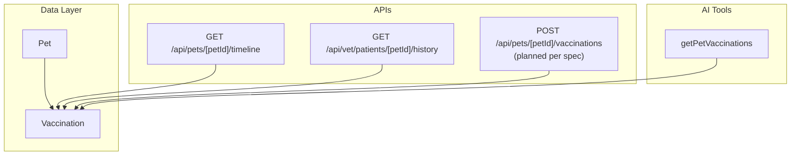
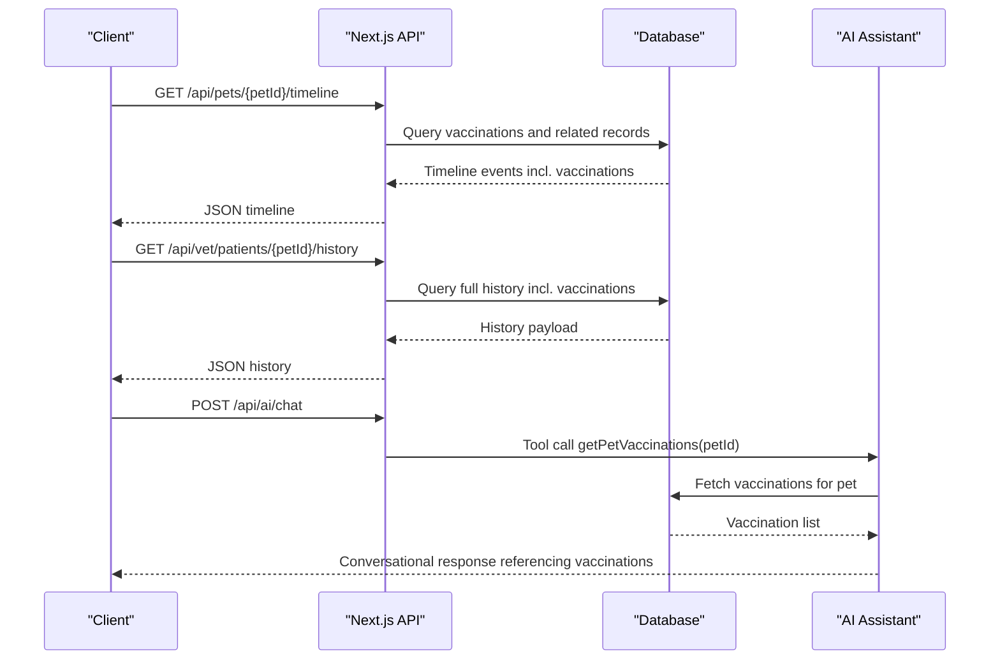
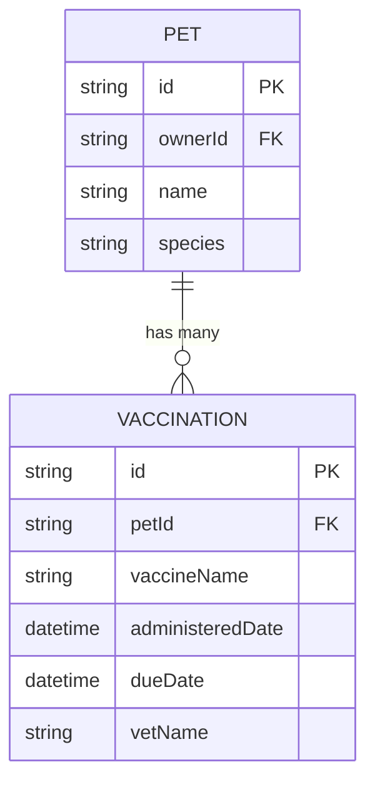
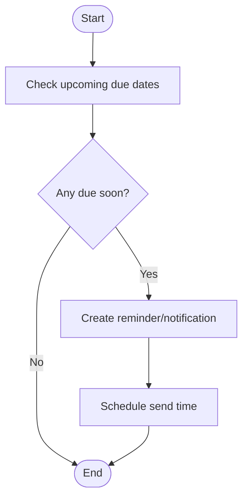
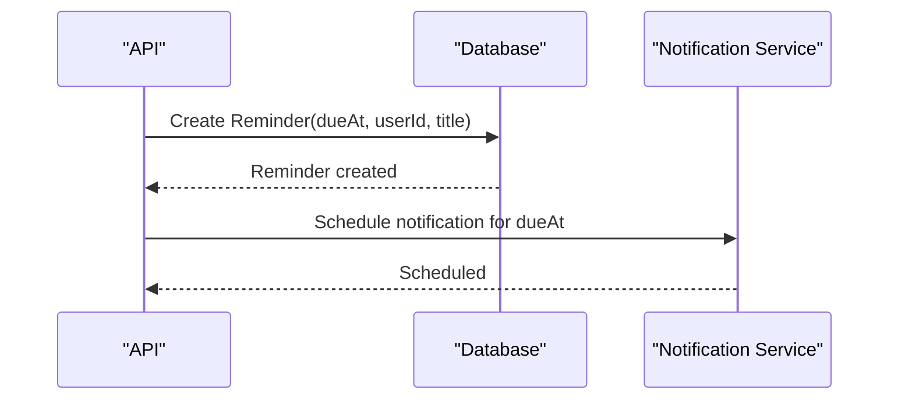
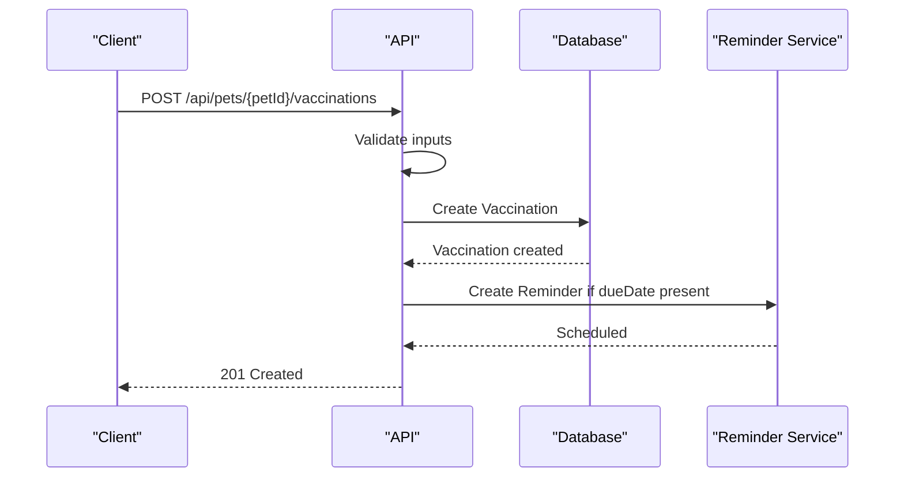
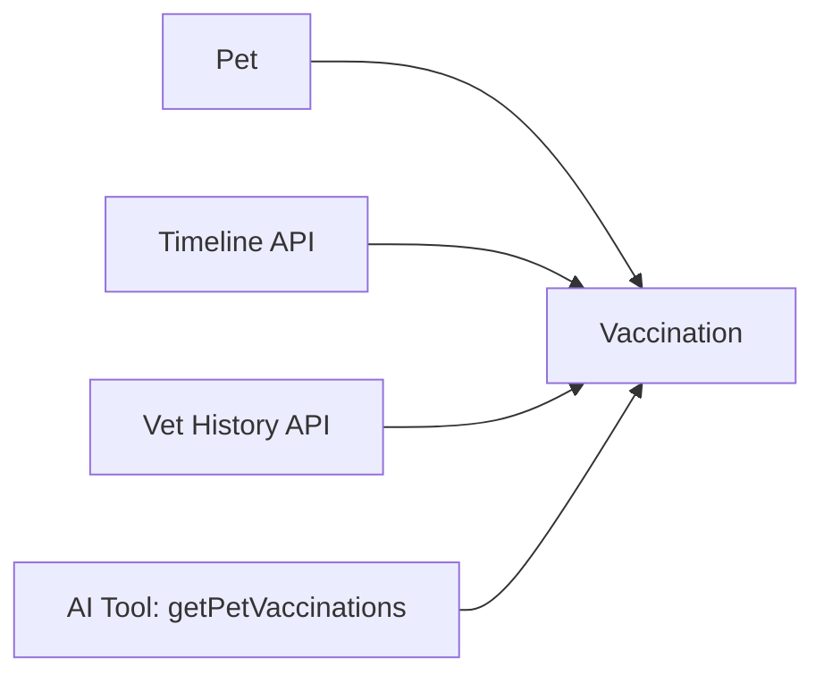

# Vaccination Tracking

<cite>
**Referenced Files in This Document**
- [schema.prisma](file://prisma/schema.prisma)
- [timeline route.ts](file://app/api/pets/[petId]/timeline/route.ts)
- [vet history route.ts](file://app/api/vet/patients/[petId]/history/route.ts)
- [AI chat route.ts](file://app/api/ai/chat/route.ts)
- [AI tools (lib/ai.ts)](file://lib/ai.ts)
- [API specification.md](file://docs/03-architecture/03-api-specification.md)
- [project blueprint.md](file://docs/01-product/01-project-blueprint.md)
</cite>

## Table of Contents
1. Introduction
2. Project Structure
3. Core Components
4. Architecture Overview
5. Detailed Component Analysis
6. Dependency Analysis
7. Performance Considerations
8. Troubleshooting Guide
9. Conclusion
10. Appendices

## Introduction
This document explains the Vaccination Tracking system within PETIVA. It covers the data model for vaccinations, how schedules and reminders are intended to work, available API endpoints for recording and viewing vaccination data, validation rules, common workflows, and integration points with veterinary practices and notification systems. Where implementation is not yet present, this document clarifies current capabilities and recommended next steps based on existing code and design documents.

## Project Structure
Vaccination-related functionality spans several layers:
- Data model: Prisma schema defines the Vaccination entity and its relationships to Pet and other entities.
- Read APIs: Timeline and vet history endpoints retrieve vaccination records as part of a pet’s health timeline or full medical history.
- AI assistant: The AI tooling includes a function to read vaccination records for a given pet.
- API specification: Documents the intended endpoint for adding vaccinations.

**Diagram sources**
- [schema.prisma:68-88](file://prisma/schema.prisma#L68-L88)
- [schema.prisma:196-204](file://prisma/schema.prisma#L196-L204)
- [timeline route.ts:33-53](file://app/api/pets/[petId]/timeline/route.ts#L33-L53)
- [vet history route.ts:23-44](file://app/api/vet/patients/[petId]/history/route.ts#L23-L44)
- [AI chat route.ts:250-296](file://app/api/ai/chat/route.ts#L250-L296)
- [API specification.md:130-142](file://docs/03-architecture/03-api-specification.md#L130-L142)

**Section sources**
- [schema.prisma:68-88](file://prisma/schema.prisma#L68-L88)
- [schema.prisma:196-204](file://prisma/schema.prisma#L196-L204)
- [timeline route.ts:33-53](file://app/api/pets/[petId]/timeline/route.ts#L33-L53)
- [vet history route.ts:23-44](file://app/api/vet/patients/[petId]/history/route.ts#L23-L44)
- [AI chat route.ts:250-296](file://app/api/ai/chat/route.ts#L250-L296)
- [API specification.md:130-142](file://docs/03-architecture/03-api-specification.md#L130-L142)

## Core Components
- Vaccination data model: Stores vaccine name, administered date, optional due date, and optional administering veterinarian name. Linked to a specific pet.
- Timeline view: Aggregates vaccination events into a chronological timeline alongside medical records, medications, allergies, conditions, metrics, and appointments.
- Vet history view: Provides veterinarians with a comprehensive view including all vaccination records for a patient.
- AI tooling: Exposes a tool to fetch vaccination records for a selected pet, enabling conversational access to vaccination history.
- Planned write path: The API specification defines an endpoint to add vaccinations; implementation is not present in the current codebase.

Key responsibilities:
- Data persistence: Vaccination records are stored via the database layer defined by Prisma.
- Access control: Owner-only timeline retrieval; vet-only history retrieval with authorization checks.
- AI integration: AI can query vaccination records through a dedicated tool.

**Section sources**
- [schema.prisma:196-204](file://prisma/schema.prisma#L196-L204)
- [timeline route.ts:6-31](file://app/api/pets/[petId]/timeline/route.ts#L6-L31)
- [timeline route.ts:72-80](file://app/api/pets/[petId]/timeline/route.ts#L72-L80)
- [vet history route.ts:7-21](file://app/api/vet/patients/[petId]/history/route.ts#L7-L21)
- [vet history route.ts:23-56](file://app/api/vet/patients/[petId]/history/route.ts#L23-L56)
- [AI chat route.ts:250-296](file://app/api/ai/chat/route.ts#L250-L296)
- [API specification.md:130-142](file://docs/03-architecture/03-api-specification.md#L130-L142)

## Architecture Overview
The system follows a layered architecture:
- Presentation/UI: Dashboard and vet dashboards consume timelines and histories.
- API layer: Next.js routes handle authentication, authorization, and orchestration of data reads.
- Data layer: Prisma client queries PostgreSQL for vaccination and related records.
- AI layer: Tool functions allow the AI assistant to read vaccination data.

**Diagram sources**
- [timeline route.ts:6-31](file://app/api/pets/[petId]/timeline/route.ts#L6-L31)
- [timeline route.ts:33-53](file://app/api/pets/[petId]/timeline/route.ts#L33-L53)
- [vet history route.ts:7-21](file://app/api/vet/patients/[petId]/history/route.ts#L7-L21)
- [vet history route.ts:23-56](file://app/api/vet/patients/[petId]/history/route.ts#L23-L56)
- [AI chat route.ts:250-296](file://app/api/ai/chat/route.ts#L250-L296)
- [AI tools (lib/ai.ts):336-342](file://lib/ai.ts#L336-L342)

## Detailed Component Analysis

### Vaccination Data Model
- Entity: Vaccination
- Fields:
  - id: Primary key
  - petId: Foreign key to Pet
  - vaccineName: String
  - administeredDate: DateTime
  - dueDate: Optional DateTime
  - vetName: Optional String
- Relationships:
  - One-to-many from Pet to Vaccination
- Notes:
  - Batch numbers are not modeled in the current schema but are mentioned in product requirements.
  - Administering veterinarian is captured as a free-form name field; structured vet linkage could be added later.

**Diagram sources**
- [schema.prisma:68-88](file://prisma/schema.prisma#L68-L88)
- [schema.prisma:196-204](file://prisma/schema.prisma#L196-L204)

**Section sources**
- [schema.prisma:196-204](file://prisma/schema.prisma#L196-L204)
- [project blueprint.md:379-394](file://docs/01-product/01-project-blueprint.md#L379-L394)

### Scheduling System
Current state:
- No explicit scheduling engine exists in the codebase.
- Due dates are stored per vaccination record and surfaced in the timeline description when present.

Recommended approach:
- Maintain dueDate per vaccination record.
- Implement a background job that scans upcoming due dates and creates reminders or notifications.
- Use pet age and species-specific guidelines to compute future due dates at time of vaccination entry.

[No sources needed since this diagram shows conceptual workflow, not actual code structure]

### Reminder System
Current state:
- Reminder and Notification models exist in the schema but are not used by vaccination logic in the current codebase.
- Product requirements indicate the system should generate reminders for upcoming vaccinations.

Recommended approach:
- On vaccination creation/update, create a Reminder tied to the pet owner with dueAt set to the due date.
- Periodically scan Reminders and push Notifications or external messages (email/SMS) as appropriate.

[No sources needed since this diagram shows conceptual workflow, not actual code structure]

### API Endpoints

#### Record a Vaccination
- Endpoint: POST /api/pets/[petId]/vaccinations
- Status: Defined in API specification; not implemented in current routes.
- Authorization: Veterinarian or authorized pet owner.
- Request fields:
  - vaccineName: required
  - administeredDate: required ISO datetime
  - dueDate: optional ISO datetime
- Response: Created vaccination details.

**Section sources**
- [API specification.md:130-142](file://docs/03-architecture/03-api-specification.md#L130-L142)

#### View Vaccination History
- Endpoint: GET /api/vet/patients/[petId]/history
- Authorization: Veterinarian role with authorized access to the pet.
- Returns: Full history including vaccinations, medical records, medications, allergies, conditions, and metrics.

**Section sources**
- [vet history route.ts:7-21](file://app/api/vet/patients/[petId]/history/route.ts#L7-L21)
- [vet history route.ts:23-56](file://app/api/vet/patients/[petId]/history/route.ts#L23-L56)

#### View Vaccination Timeline
- Endpoint: GET /api/pets/[petId]/timeline
- Authorization: Pet owner only.
- Returns: Chronological timeline including vaccination events with titles and descriptions.

**Section sources**
- [timeline route.ts:6-31](file://app/api/pets/[petId]/timeline/route.ts#L6-L31)
- [timeline route.ts:72-80](file://app/api/pets/[petId]/timeline/route.ts#L72-L80)

#### AI-Assisted Vaccination Lookup
- Tool: getPetVaccinations(petId)
- Behavior: Retrieves all vaccination records for a specified pet after verifying ownership.

**Section sources**
- [AI tools (lib/ai.ts):336-342](file://lib/ai.ts#L336-L342)
- [AI chat route.ts:250-296](file://app/api/ai/chat/route.ts#L250-L296)

### Validation Rules
- Required fields:
  - vaccineName: must be present
  - administeredDate: must be a valid ISO datetime
- Optional fields:
  - dueDate: if provided, must be a valid ISO datetime
  - vetName: free-form text
- Date validations:
  - Ensure administeredDate is not in the future (recommended).
  - If dueDate is provided, ensure it is after administeredDate (recommended).
- Species-specific compatibility:
  - Not enforced in current code. Recommended to implement a lookup table or service that validates whether a vaccine is appropriate for the pet’s species and age.

**Section sources**
- [API specification.md:130-142](file://docs/03-architecture/03-api-specification.md#L130-L142)
- [schema.prisma:196-204](file://prisma/schema.prisma#L196-L204)

### Common Workflows

#### Workflow: Record a New Vaccination
- Actors: Veterinarian or authorized pet owner
- Steps:
  1. Call POST /api/pets/[petId]/vaccinations with required fields.
  2. Validate inputs (presence and format).
  3. Persist vaccination record.
  4. Optionally create a Reminder for dueDate.
  5. Return success response.

[No sources needed since this diagram shows conceptual workflow, not actual code structure]

#### Workflow: Check Vaccination Status
- Actors: Pet owner or veterinarian
- Steps:
  1. Call GET /api/pets/[petId]/timeline or GET /api/vet/patients/[petId]/history.
  2. Filter events for type VACCINATION.
  3. Display last administered date and next due date if present.

**Section sources**
- [timeline route.ts:72-80](file://app/api/pets/[petId]/timeline/route.ts#L72-L80)
- [vet history route.ts:23-56](file://app/api/vet/patients/[petId]/history/route.ts#L23-L56)

#### Workflow: Generate Vaccination Reminders
- Actors: Background scheduler
- Steps:
  1. Scan Reminders where dueAt is approaching or overdue.
  2. Create Notifications or trigger external messaging.
  3. Mark reminders as cleared upon acknowledgment.

[No sources needed since this diagram shows conceptual workflow, not actual code structure]

### Integration with Veterinary Practices and Automated Notifications
- Veterinary practices:
  - Veterinarians can view full history including vaccinations via the vet history endpoint.
  - Future enhancements may include direct vaccination recording from practice systems via the planned vaccination endpoint.
- Automated notifications:
  - Use Reminder and Notification models to schedule and deliver alerts for upcoming or overdue vaccinations.
  - Integrate with email/SMS providers to notify pet owners.

**Section sources**
- [vet history route.ts:7-21](file://app/api/vet/patients/[petId]/history/route.ts#L7-L21)
- [schema.prisma:260-278](file://prisma/schema.prisma#L260-L278)
- [project blueprint.md:379-394](file://docs/01-product/01-project-blueprint.md#L379-L394)

## Dependency Analysis
- Data dependencies:
  - Vaccination depends on Pet for ownership context.
  - Timeline and history endpoints depend on multiple models to aggregate events.
- API dependencies:
  - Timeline requires authentication and ownership verification.
  - Vet history requires role-based authorization and patient access checks.
- AI dependencies:
  - AI tool getPetVaccinations depends on database access and ownership verification.

**Diagram sources**
- [schema.prisma:68-88](file://prisma/schema.prisma#L68-L88)
- [schema.prisma:196-204](file://prisma/schema.prisma#L196-L204)
- [timeline route.ts:33-53](file://app/api/pets/[petId]/timeline/route.ts#L33-L53)
- [vet history route.ts:23-44](file://app/api/vet/patients/[petId]/history/route.ts#L23-L44)
- [AI tools (lib/ai.ts):336-342](file://lib/ai.ts#L336-L342)

**Section sources**
- [schema.prisma:68-88](file://prisma/schema.prisma#L68-L88)
- [schema.prisma:196-204](file://prisma/schema.prisma#L196-L204)
- [timeline route.ts:33-53](file://app/api/pets/[petId]/timeline/route.ts#L33-L53)
- [vet history route.ts:23-44](file://app/api/vet/patients/[petId]/history/route.ts#L23-L44)
- [AI tools (lib/ai.ts):336-342](file://lib/ai.ts#L336-L342)

## Performance Considerations
- Use batched queries to minimize round trips when assembling timelines and histories.
- Index frequently queried fields such as petId and dueDate to optimize lookups for reminders and status checks.
- Paginate large timelines if needed to reduce payload size.
- Cache read-heavy endpoints where appropriate, respecting user permissions.

[No sources needed since this section provides general guidance]

## Troubleshooting Guide
- Authentication errors:
  - Timeline endpoint returns unauthorized if session is invalid.
- Authorization errors:
  - Vet history returns forbidden if caller lacks required role or patient access.
- Data issues:
  - Missing petId or malformed dates will cause request failures; validate inputs before sending.
- AI tool errors:
  - Ownership verification failures will result in error responses from the AI tool execution path.

**Section sources**
- [timeline route.ts:136-147](file://app/api/pets/[petId]/timeline/route.ts#L136-L147)
- [vet history route.ts:57-68](file://app/api/vet/patients/[petId]/history/route.ts#L57-L68)
- [AI chat route.ts:319-346](file://app/api/ai/chat/route.ts#L319-L346)

## Conclusion
PETIVA currently supports reading vaccination records through timeline and vet history endpoints, and exposes AI-assisted access to vaccination data. The data model captures essential vaccination information, including due dates and administering veterinarian names. While the write endpoint for recording vaccinations is specified, it is not yet implemented. To complete the system, implement input validation, due-date-based scheduling, and reminder generation using the existing Reminder and Notification models. These additions will enable proactive care management and seamless integration with veterinary practices and automated notification systems.

## Appendices

### API Reference Summary
- Add Vaccination: POST /api/pets/[petId]/vaccinations (spec-defined)
- View Timeline: GET /api/pets/[petId]/timeline (implemented)
- View Vet History: GET /api/vet/patients/[petId]/history (implemented)
- AI Tool: getPetVaccinations (implemented)

**Section sources**
- [API specification.md:130-142](file://docs/03-architecture/03-api-specification.md#L130-L142)
- [timeline route.ts:6-31](file://app/api/pets/[petId]/timeline/route.ts#L6-L31)
- [vet history route.ts:7-21](file://app/api/vet/patients/[petId]/history/route.ts#L7-L21)
- [AI tools (lib/ai.ts):336-342](file://lib/ai.ts#L336-L342)