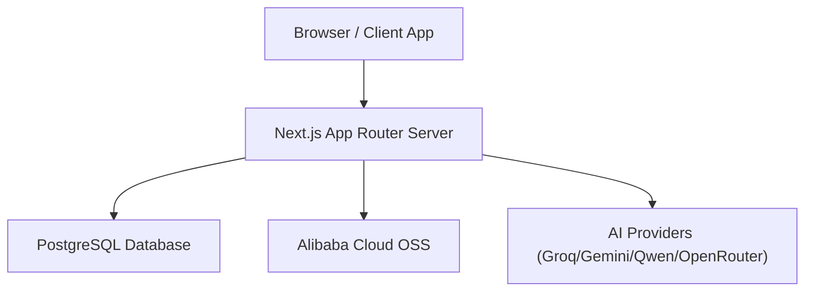
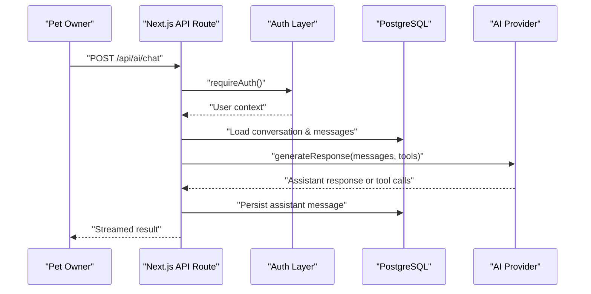
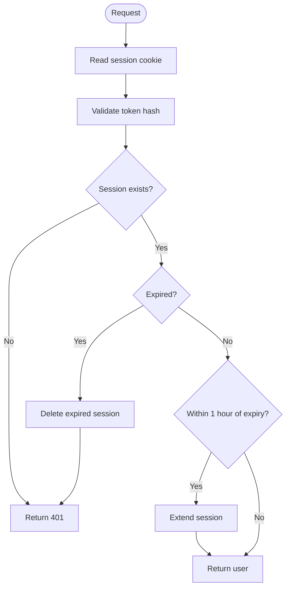
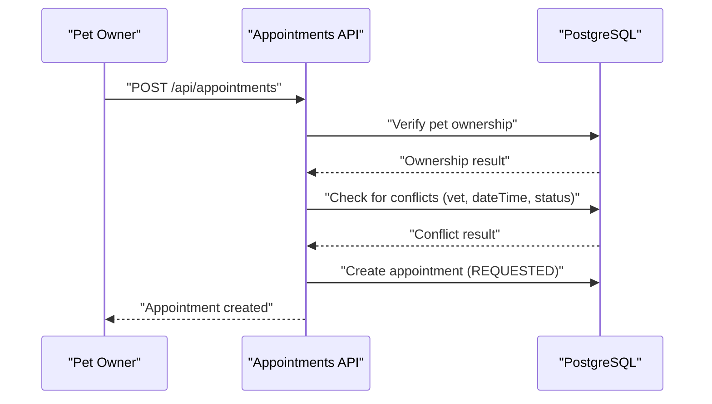
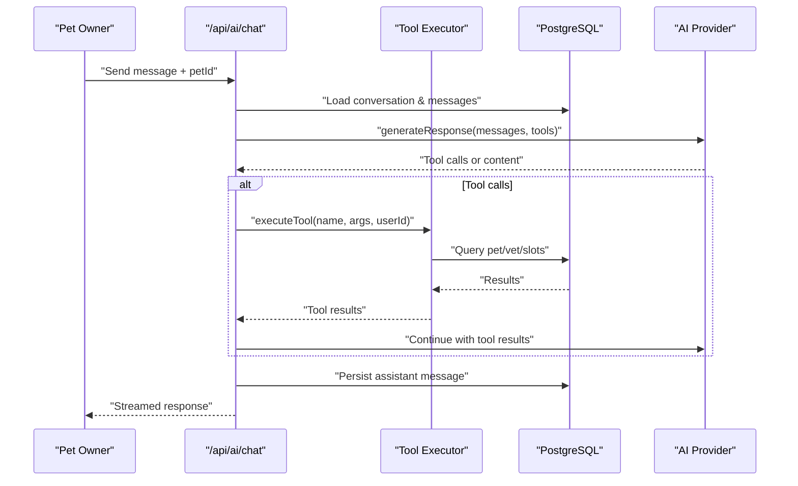
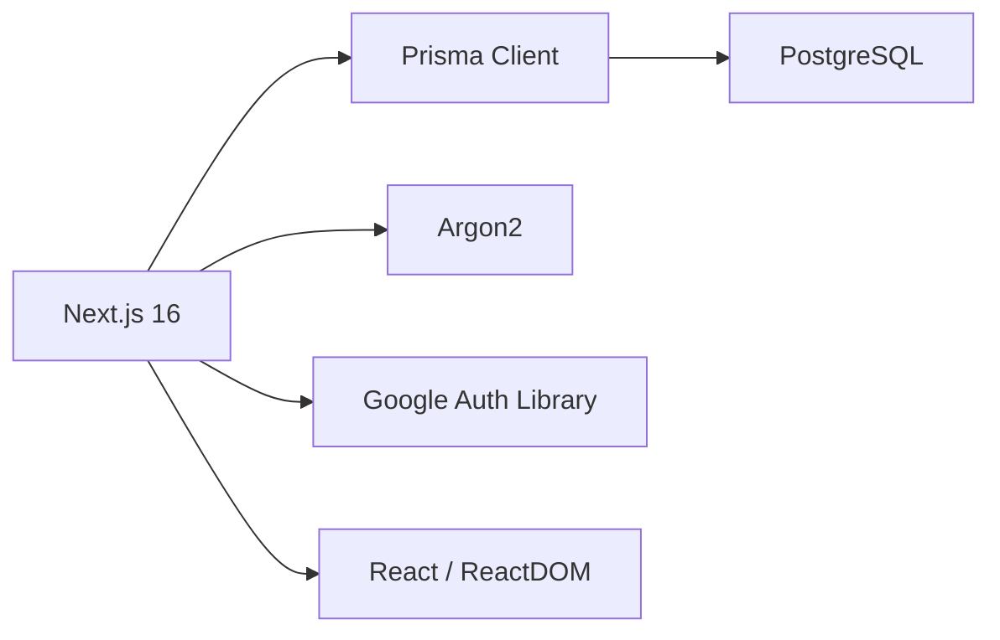

# Project Overview

<cite>
**Referenced Files in This Document**
- [README.md](file://README.md)
- [package.json](file://package.json)
- [prisma/schema.prisma](file://prisma/schema.prisma)
- [lib/auth.ts](file://lib/auth.ts)
- [lib/db.ts](file://lib/db.ts)
- [app/page.tsx](file://app/page.tsx)
- [app/api/auth/register/route.ts](file://app/api/auth/register/route.ts)
- [app/api/pets/route.ts](file://app/api/pets/route.ts)
- [app/api/appointments/route.ts](file://app/api/appointments/route.ts)
- [app/api/ai/chat/route.ts](file://app/api/ai/chat/route.ts)
- [lib/ai.ts](file://lib/ai.ts)
- [docs/01-product/01-project-blueprint.md](file://docs/01-product/01-project-blueprint.md)
- [docs/03-architecture/01-system-architecture.md](file://docs/03-architecture/01-system-architecture.md)
</cite>

## Table of Contents
1. Introduction
2. Project Structure
3. Core Components
4. Architecture Overview
5. Detailed Component Analysis
6. Dependency Analysis
7. Performance Considerations
8. Troubleshooting Guide
9. Conclusion

## Introduction
PETIVA is an AI-powered pet healthcare management system that connects pet owners, veterinarians, and clinics to deliver a unified digital health profile for every pet. It centralizes pet profiles, medical records, vaccination tracking, medication management, appointment scheduling, clinic management, and an AI-powered veterinary assistant that helps users understand their pet’s health history and take informed next steps. The platform emphasizes secure authentication, role-based access control, and privacy-preserving AI interactions.

For beginners: PETIVA helps you keep all your pet’s health information in one place, find and book vet appointments easily, and get helpful guidance from an AI veterinary assistant. For experienced developers: the system is built on Next.js 16 with TypeScript, Prisma ORM over PostgreSQL, and a modular API layer with robust auth, authorization, and multi-provider AI integration.

**Section sources**
- [docs/01-product/01-project-blueprint.md:14-43](file://docs/01-product/01-project-blueprint.md#L14-L43)
- [docs/01-product/01-project-blueprint.md:201-282](file://docs/01-product/01-project-blueprint.md#L201-L282)
- [docs/01-product/01-project-blueprint.md:284-552](file://docs/01-product/01-project-blueprint.md#L284-L552)
- [docs/01-product/01-project-blueprint.md:554-780](file://docs/01-product/01-project-blueprint.md#L554-L780)

## Project Structure
The application uses a Next.js App Router structure where the frontend (React components) and backend (API routes) coexist under the app directory. Data models are defined with Prisma and synchronized to PostgreSQL. Authentication, session management, and authorization utilities live in lib/, while AI capabilities are encapsulated in lib/ai.ts and provider modules.



**Diagram sources**
- [docs/03-architecture/01-system-architecture.md:11-23](file://docs/03-architecture/01-system-architecture.md#L11-L23)

Key directories and responsibilities:
- app/: Frontend pages and server-side API routes
- prisma/: Schema definition and migrations for PostgreSQL
- lib/: Shared utilities for database connection, authentication, and AI orchestration
- docs/: Product blueprint and architecture documentation

**Section sources**
- [docs/03-architecture/01-system-architecture.md:27-45](file://docs/03-architecture/01-system-architecture.md#L27-L45)
- [package.json:11-22](file://package.json#L11-L22)

## Core Components
- Multi-role user management: Users can be pet owners, veterinarians, clinic admins, or platform admins. Roles govern access to features like pet data, appointments, and clinic operations.
- Pet profiles and health tracking: Each pet has a comprehensive profile including species, breed, allergies, conditions, medications, vaccinations, and health metrics.
- Medical records and versions: Veterinarians create and update records; versions preserve history and mark current entries.
- Appointment scheduling: Owners request appointments; vets and clinics manage availability; double-booking prevention ensures slot integrity.
- Secure authentication: Session-based auth with hashed passwords, cookie-based sessions, and role checks.
- AI-powered veterinary assistant: Context-aware chat with tools to retrieve pet data, check schedules, and book appointments via multiple AI providers.

Practical examples:
- A pet owner creates a pet profile, logs vaccinations and medications, and views a chronological health timeline.
- An owner requests an appointment with a veterinarian at a specific clinic; the system validates ownership, prevents conflicts, and returns a requested appointment.
- An owner chats with the AI assistant to review health history or book an appointment; the assistant calls internal tools to fetch data and schedule visits safely.

**Section sources**
- [prisma/schema.prisma:9-14](file://prisma/schema.prisma#L9-L14)
- [prisma/schema.prisma:30-53](file://prisma/schema.prisma#L30-L53)
- [prisma/schema.prisma:68-88](file://prisma/schema.prisma#L68-L88)
- [prisma/schema.prisma:133-162](file://prisma/schema.prisma#L133-L162)
- [prisma/schema.prisma:164-182](file://prisma/schema.prisma#L164-L182)
- [app/api/appointments/route.ts:69-129](file://app/api/appointments/route.ts#L69-L129)
- [lib/ai.ts:141-281](file://lib/ai.ts#L141-L281)

## Architecture Overview
The system follows a layered architecture:
- Presentation layer: Next.js client and server components render dashboards and landing pages.
- API layer: Route handlers enforce authentication, authorization, and business rules.
- Business logic: Reusable services handle domain workflows (e.g., booking, record updates).
- Data layer: Prisma ORM interacts with PostgreSQL.
- AI integration: Orchestrated through a provider abstraction with fallbacks and tool execution.



**Diagram sources**
- [app/api/ai/chat/route.ts:68-183](file://app/api/ai/chat/route.ts#L68-L183)
- [lib/ai.ts:126-139](file://lib/ai.ts#L126-L139)

Security boundaries:
- Authentication boundary: Validates session cookies on every request.
- Authorization boundary: Enforces RBAC and consent-based access for pet records.
- AI boundary: Limits data sent to LLMs to minimum necessary context.
- File storage boundary: Uses private object storage with presigned URLs.

**Section sources**
- [docs/03-architecture/01-system-architecture.md:48-98](file://docs/03-architecture/01-system-architecture.md#L48-L98)

## Detailed Component Analysis

### Authentication and Sessions
- Password hashing and verification using Argon2.
- Session tokens generated, hashed, stored, and validated with sliding expiration.
- Cookie-based session persistence with secure flags.
- Role-based access enforcement helpers for protected routes.



**Diagram sources**
- [lib/auth.ts:23-75](file://lib/auth.ts#L23-L75)

**Section sources**
- [lib/auth.ts:10-21](file://lib/auth.ts#L10-L21)
- [lib/auth.ts:23-75](file://lib/auth.ts#L23-L75)
- [lib/auth.ts:82-125](file://lib/auth.ts#L82-L125)
- [app/api/auth/register/route.ts:6-78](file://app/api/auth/register/route.ts#L6-L78)

### Pet Profiles and Health Tracking
- Create and list pet profiles owned by authenticated users.
- Store species, breed, gender, date of birth, weight, and related health entities.
- Support for vaccinations, medications, allergies, conditions, and health metrics.

```mermaid
classDiagram
class User {
+string id
+string email
+UserRole role
+string firstName
+string lastName
}
class Pet {
+string id
+string ownerId
+string name
+string species
+string? breed
+string? gender
+DateTime? dateOfBirth
+Decimal? weight
}
class MedicalRecord {
+string id
+string petId
+DateTime createdAt
}
class Vaccination {
+string id
+string petId
+string vaccineName
+DateTime administeredDate
}
class Medication {
+string id
+string petId
+string medicationName
+string dosage
}
class Allergy {
+string id
+string petId
+string allergen
}
class HealthCondition {
+string id
+string petId
+string name
}
class HealthMetric {
+string id
+string petId
+string metricType
+Decimal value
}
User ||--o{ Pet : "owns"
Pet ||--o{ MedicalRecord : "has"
Pet ||--o{ Vaccination : "has"
Pet ||--o{ Medication : "has"
Pet ||--o{ Allergy : "has"
Pet ||--o{ HealthCondition : "has"
Pet ||--o{ HealthMetric : "has"
```

**Diagram sources**
- [prisma/schema.prisma:30-53](file://prisma/schema.prisma#L30-L53)
- [prisma/schema.prisma:68-88](file://prisma/schema.prisma#L68-L88)
- [prisma/schema.prisma:196-244](file://prisma/schema.prisma#L196-L244)

**Section sources**
- [app/api/pets/route.ts:5-69](file://app/api/pets/route.ts#L5-L69)
- [prisma/schema.prisma:68-88](file://prisma/schema.prisma#L68-L88)
- [prisma/schema.prisma:196-244](file://prisma/schema.prisma#L196-L244)

### Appointment Scheduling
- Owners request appointments for their pets with a chosen vet and clinic.
- System enforces pet ownership and prevents double bookings within transactions.
- Role-based retrieval: owners see their appointments; vets see theirs; clinic admins see clinic-wide.



**Diagram sources**
- [app/api/appointments/route.ts:69-129](file://app/api/appointments/route.ts#L69-L129)

**Section sources**
- [app/api/appointments/route.ts:6-67](file://app/api/appointments/route.ts#L6-L67)
- [app/api/appointments/route.ts:69-129](file://app/api/appointments/route.ts#L69-L129)

### AI-Powered Veterinary Assistant
- Context-aware chat per pet with persistent conversations and messages.
- Tool-driven interactions: retrieve pet profiles, health timelines, vaccinations, medications, allergies, appointments; discover vets; check slots; create bookings.
- Multi-provider support with fallback strategy and environment configuration.



**Diagram sources**
- [app/api/ai/chat/route.ts:68-183](file://app/api/ai/chat/route.ts#L68-L183)
- [lib/ai.ts:297-467](file://lib/ai.ts#L297-L467)

**Section sources**
- [app/api/ai/chat/route.ts:7-66](file://app/api/ai/chat/route.ts#L7-L66)
- [app/api/ai/chat/route.ts:68-183](file://app/api/ai/chat/route.ts#L68-L183)
- [lib/ai.ts:105-139](file://lib/ai.ts#L105-L139)
- [lib/ai.ts:141-281](file://lib/ai.ts#L141-L281)
- [lib/ai.ts:297-467](file://lib/ai.ts#L297-L467)

### Clinic Management and Veterinarian Discovery
- Clinics have profiles, associated vets, and appointment visibility.
- Veterinarians can be discovered by specialization and associated with clinics.
- Vet-clinic associations track status and relationships.

```mermaid
classDiagram
class Clinic {
+string id
+string name
+string address
+bool isVerified
}
class Veterinarian {
+string id
+string userId
+string? specialization
+bool isVerified
}
class VetClinicAssociation {
+string id
+string vetId
+string clinicId
+AssociationStatus status
}
Veterinarian ||--o{ VetClinicAssociation : "associates"
Clinic ||--o{ VetClinicAssociation : "associates"
```

**Diagram sources**
- [prisma/schema.prisma:90-105](file://prisma/schema.prisma#L90-L105)
- [prisma/schema.prisma:107-119](file://prisma/schema.prisma#L107-L119)
- [prisma/schema.prisma:121-131](file://prisma/schema.prisma#L121-L131)

**Section sources**
- [prisma/schema.prisma:90-131](file://prisma/schema.prisma#L90-L131)

## Dependency Analysis
Core runtime dependencies:
- Next.js 16 for full-stack React application and API routes.
- Prisma Client and PostgreSQL adapter for type-safe database access.
- PostgreSQL as the relational database.
- Argon2 for password hashing.
- Google Auth Library for OAuth flows.
- React ecosystem for UI components.



**Diagram sources**
- [package.json:11-22](file://package.json#L11-L22)

**Section sources**
- [package.json:11-22](file://package.json#L11-L22)
- [lib/db.ts:1-33](file://lib/db.ts#L1-L33)

## Performance Considerations
- Database connections: Use connection pooling in production and avoid recreating clients in development hot-reloads.
- Query optimization: Leverage indexes on frequently queried fields (e.g., petId, vetId, dateTime).
- AI streaming: Stream responses to reduce perceived latency and improve UX during tool-heavy interactions.
- Context limits: Limit conversation history to prevent excessive payload sizes and token usage.
- Double-booking prevention: Use transactions to ensure consistency when creating appointments.

[No sources needed since this section provides general guidance]

## Troubleshooting Guide
Common issues and resolutions:
- Unauthenticated access: Ensure session cookie is present and valid; verify token expiration handling.
- Forbidden access: Confirm user owns the pet or has appropriate role; check authorization middleware.
- Double booking conflict: Verify time slot availability and status filters; reattempt after conflict resolution.
- AI provider errors: Check environment variables for API keys; use fallback provider if primary fails.
- Past date validation: Ensure requested dates are future-dated according to timezone-aware checks.

**Section sources**
- [lib/auth.ts:109-125](file://lib/auth.ts#L109-L125)
- [app/api/appointments/route.ts:84-110](file://app/api/appointments/route.ts#L84-L110)
- [lib/ai.ts:45-47](file://lib/ai.ts#L45-L47)
- [lib/ai.ts:112-124](file://lib/ai.ts#L112-L124)
- [lib/ai.ts:375-409](file://lib/ai.ts#L375-L409)

## Conclusion
PETIVA delivers a comprehensive, secure, and intelligent platform for pet healthcare management. By uniting pet owners, veterinarians, and clinics around shared pet profiles, medical records, and appointment workflows—augmented by an AI-powered veterinary assistant—it transforms fragmented care into a connected, preventive, and proactive experience. The architecture balances developer productivity with scalability, leveraging Next.js, Prisma, PostgreSQL, and flexible AI integrations to support both immediate needs and future enhancements.

[No sources needed since this section summarizes without analyzing specific files]