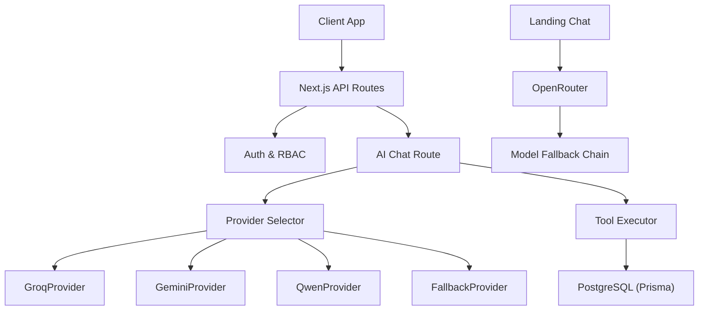
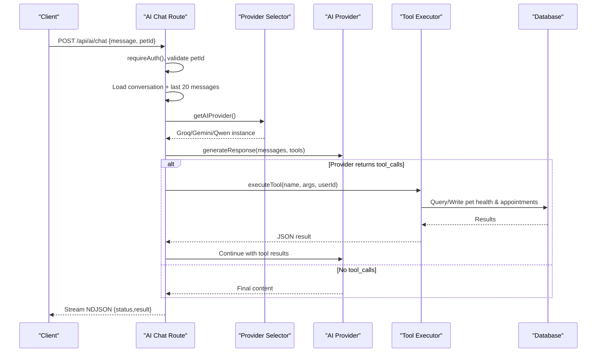
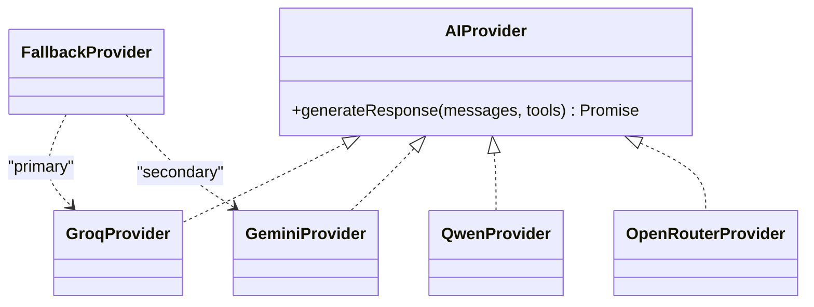
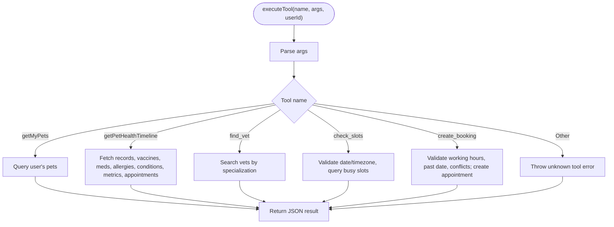
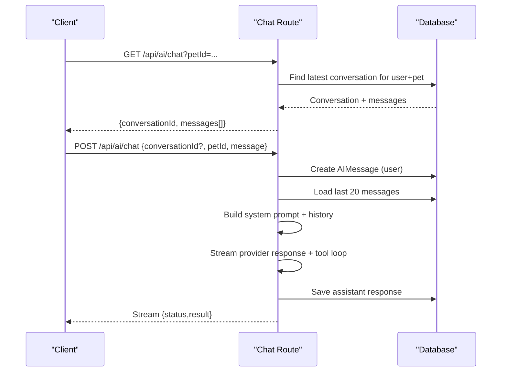
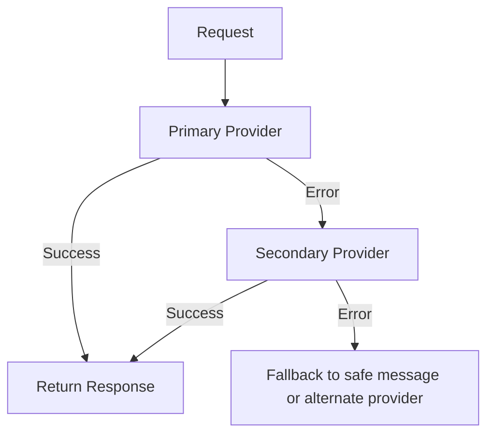
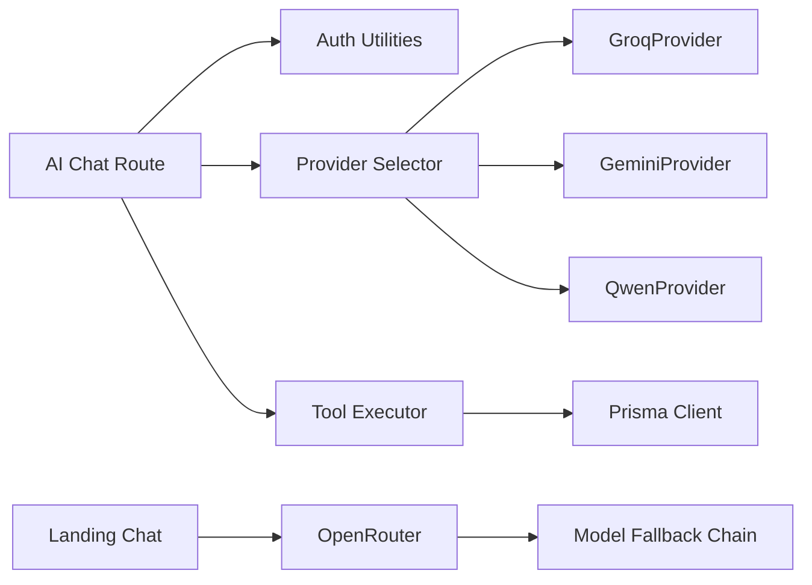

# AI Service Architecture

<cite>
**Referenced Files in This Document**
- [lib/ai.ts](file://lib/ai.ts)
- [app/api/ai/chat/route.ts](file://app/api/ai/chat/route.ts)
- [lib/ai/providers/groq.ts](file://lib/ai/providers/groq.ts)
- [lib/ai/providers/gemini.ts](file://lib/ai/providers/gemini.ts)
- [lib/ai/providers/qwen.ts](file://lib/ai/providers/qwen.ts)
- [app/api/landing-chat/route.ts](file://app/api/landing-chat/route.ts)
- [prisma/schema.prisma](file://prisma/schema.prisma)
- [docs/03-architecture/04-ai-architecture.md](file://docs/03-architecture/04-ai-architecture.md)
- [docs/03-architecture/06-security.md](file://docs/03-architecture/06-security.md)
- [proxy.ts](file://proxy.ts)
- [lib/auth.ts](file://lib/auth.ts)
</cite>

## Table of Contents
1. Introduction
2. Project Structure
3. Core Components
4. Architecture Overview
5. Detailed Component Analysis
6. Dependency Analysis
7. Performance Considerations
8. Troubleshooting Guide
9. Conclusion
10. Appendices

## Introduction
This document describes the PETIVA Pet Healthcare Ecosystem AI service architecture. It explains how the system integrates multiple AI providers (Groq, Gemini, Qwen) through an abstraction layer and OpenRouter for public chat, implements a tool execution framework to power pet health consultation, appointment booking automation, and medical record analysis, and provides fallback mechanisms for reliability. It also covers conversation context management, security considerations (prompt injection prevention, data privacy), rate limiting strategies, and configuration options for provider selection, prompt customization, and extending AI capabilities.

## Project Structure
The AI subsystem is implemented as:
- API routes that handle authenticated chat sessions and streaming responses
- A provider abstraction with concrete implementations for Groq, Gemini, and Qwen
- An OpenRouter-based public chat endpoint with model fallbacks
- A tool execution engine that safely queries the database for pet health and scheduling operations
- Database models for conversations and messages to persist context

**Diagram sources**
- [app/api/ai/chat/route.ts:68-347](file://app/api/ai/chat/route.ts#L68-L347)
- [lib/ai.ts:105-139](file://lib/ai.ts#L105-L139)
- [lib/ai/providers/groq.ts:16-77](file://lib/ai/providers/groq.ts#L16-L77)
- [lib/ai/providers/gemini.ts:16-77](file://lib/ai/providers/gemini.ts#L16-L77)
- [lib/ai/providers/qwen.ts:16-76](file://lib/ai/providers/qwen.ts#L16-L76)
- [app/api/landing-chat/route.ts:3-52](file://app/api/landing-chat/route.ts#L3-L52)

**Section sources**
- [app/api/ai/chat/route.ts:68-347](file://app/api/ai/chat/route.ts#L68-L347)
- [lib/ai.ts:105-139](file://lib/ai.ts#L105-L139)
- [app/api/landing-chat/route.ts:3-52](file://app/api/landing-chat/route.ts#L3-L52)
- [prisma/schema.prisma:280-296](file://prisma/schema.prisma#L280-L296)

## Core Components
- AI Provider Abstraction: A unified interface for generating responses and handling tool calls across providers.
- Provider Implementations: Concrete classes for Groq, Gemini, and Qwen, each calling their respective endpoints with standardized payloads.
- Provider Selection and Fallback: Environment-driven selection of active provider with automatic fallback between providers on failure.
- Tool Execution Framework: A centralized executor that validates inputs, enforces ownership, and performs pet health and scheduling operations via Prisma.
- Conversation Context Management: Persistent storage of conversations and messages with history limits to control context size.
- Public Chat via OpenRouter: A separate endpoint for unauthenticated landing chat with model fallback chain.

Key responsibilities:
- Authentication and authorization at route boundaries
- Streaming NDJSON responses for real-time UX
- Strict tool parameter validation and safety checks
- Provider error propagation and fallback behavior

**Section sources**
- [lib/ai.ts:21-139](file://lib/ai.ts#L21-L139)
- [lib/ai.ts:141-423](file://lib/ai.ts#L141-L423)
- [app/api/ai/chat/route.ts:68-347](file://app/api/ai/chat/route.ts#L68-L347)
- [app/api/landing-chat/route.ts:54-113](file://app/api/landing-chat/route.ts#L54-L113)

## Architecture Overview
The AI request flow proceeds from the client through Next.js API routes, into the provider abstraction, then to the selected provider or fallback. Tool calls are executed server-side against the database, and results are streamed back to the client.

**Diagram sources**
- [app/api/ai/chat/route.ts:68-347](file://app/api/ai/chat/route.ts#L68-L347)
- [lib/ai.ts:105-139](file://lib/ai.ts#L105-L139)
- [lib/ai.ts:236-423](file://lib/ai.ts#L236-L423)

## Detailed Component Analysis

### Multi-Provider Integration Pattern
- Unified interface: All providers implement a consistent method signature for message generation and tool call handling.
- Provider selection: Controlled by environment variable; defaults to a configured primary provider.
- Fallback strategy: If the primary provider fails, the system automatically retries with a secondary provider.
- OpenRouter usage: Public chat uses OpenRouter with a chain of free models and falls back to Gemini if all fail.

**Diagram sources**
- [lib/ai.ts:21-103](file://lib/ai.ts#L21-L103)
- [lib/ai.ts:105-139](file://lib/ai.ts#L105-L139)
- [lib/ai/providers/groq.ts:9-77](file://lib/ai/providers/groq.ts#L9-L77)
- [lib/ai/providers/gemini.ts:9-77](file://lib/ai/providers/gemini.ts#L9-L77)
- [lib/ai/providers/qwen.ts:9-76](file://lib/ai/providers/qwen.ts#L9-L76)

**Section sources**
- [lib/ai.ts:105-139](file://lib/ai.ts#L105-L139)
- [lib/ai/providers/groq.ts:16-77](file://lib/ai/providers/groq.ts#L16-L77)
- [lib/ai/providers/gemini.ts:16-77](file://lib/ai/providers/gemini.ts#L16-L77)
- [lib/ai/providers/qwen.ts:16-76](file://lib/ai/providers/qwen.ts#L16-L76)
- [app/api/landing-chat/route.ts:3-52](file://app/api/landing-chat/route.ts#L3-L52)

### Tool Execution Framework
The tool executor centralizes business logic for AI-powered features:
- Pet health consultation: Retrieve pets, health timelines, vaccinations, medications, allergies, conditions, metrics.
- Appointment automation: Find veterinarians, check available slots, create bookings with validations.
- Ownership verification: Ensures users can only access their own pets’ data.
- Safety and constraints: Working hours, past date checks, double-booking prevention.

**Diagram sources**
- [lib/ai.ts:236-423](file://lib/ai.ts#L236-L423)

**Section sources**
- [lib/ai.ts:141-219](file://lib/ai.ts#L141-L219)
- [lib/ai.ts:221-423](file://lib/ai.ts#L221-L423)

### Conversation History and Medical Record References
- Conversations are persisted per user and pet, enabling multi-turn interactions.
- Message history is limited to the most recent 20 entries to prevent context bloat.
- System prompts inject current date and active pet context to ground AI responses.
- Tool results are appended to the message stream so the AI can reason over retrieved data.

**Diagram sources**
- [app/api/ai/chat/route.ts:7-66](file://app/api/ai/chat/route.ts#L7-L66)
- [app/api/ai/chat/route.ts:68-347](file://app/api/ai/chat/route.ts#L68-L347)
- [prisma/schema.prisma:280-296](file://prisma/schema.prisma#L280-L296)

**Section sources**
- [app/api/ai/chat/route.ts:29-51](file://app/api/ai/chat/route.ts#L29-L51)
- [app/api/ai/chat/route.ts:128-181](file://app/api/ai/chat/route.ts#L128-L181)
- [prisma/schema.prisma:280-296](file://prisma/schema.prisma#L280-L296)

### Fallback Mechanism for Reliability
- Provider-level fallback: The FallbackProvider attempts the primary provider first and retries with a secondary provider on failure.
- Public chat fallback: The landing chat endpoint cycles through a list of free models via OpenRouter and falls back to Gemini if all fail.
- Graceful degradation: Errors are logged and surfaced to clients without breaking sessions.

**Diagram sources**
- [lib/ai.ts:112-139](file://lib/ai.ts#L112-L139)
- [app/api/landing-chat/route.ts:3-52](file://app/api/landing-chat/route.ts#L3-L52)
- [app/api/landing-chat/route.ts:82-113](file://app/api/landing-chat/route.ts#L82-L113)

**Section sources**
- [lib/ai.ts:112-139](file://lib/ai.ts#L112-L139)
- [app/api/landing-chat/route.ts:82-113](file://app/api/landing-chat/route.ts#L82-L113)

## Dependency Analysis
- API routes depend on authentication utilities and Prisma for persistence.
- Provider implementations depend on environment variables for credentials and target endpoints.
- Tool executor depends on Prisma models for pet health and scheduling data.
- Public chat depends on OpenRouter and optionally Gemini as a fallback.

**Diagram sources**
- [app/api/ai/chat/route.ts:1-5](file://app/api/ai/chat/route.ts#L1-L5)
- [lib/ai.ts:105-139](file://lib/ai.ts#L105-L139)
- [lib/ai.ts:236-423](file://lib/ai.ts#L236-L423)
- [app/api/landing-chat/route.ts:54-113](file://app/api/landing-chat/route.ts#L54-L113)

**Section sources**
- [app/api/ai/chat/route.ts:1-5](file://app/api/ai/chat/route.ts#L1-L5)
- [lib/ai.ts:105-139](file://lib/ai.ts#L105-L139)
- [lib/ai.ts:236-423](file://lib/ai.ts#L236-L423)
- [app/api/landing-chat/route.ts:54-113](file://app/api/landing-chat/route.ts#L54-L113)

## Performance Considerations
- Context window control: Limiting conversation history to the last 20 messages reduces token usage and latency.
- Tool batching: Health timeline retrieval aggregates multiple related datasets in parallel to minimize round trips.
- Streaming responses: NDJSON streaming improves perceived responsiveness during long-running AI/tool loops.
- Provider timeouts and retries: Fallback provider mitigates downtime and reduces overall request latency impact.

[No sources needed since this section provides general guidance]

## Troubleshooting Guide
Common issues and diagnostics:
- Missing API keys: Providers throw explicit errors when required environment variables are not set.
- Invalid provider responses: Validation checks ensure expected structure before returning results.
- Tool execution failures: Errors are captured and returned as tool results to continue the conversation gracefully.
- Authentication failures: Unauthorized requests return clear error codes and messages.

Operational tips:
- Enable test mode to inspect constructed messages without invoking providers.
- Use development mock headers to simulate provider responses for testing flows.
- Monitor logs for diagnostic markers indicating provider selection and tool execution steps.

**Section sources**
- [lib/ai.ts:45-47](file://lib/ai.ts#L45-L47)
- [lib/ai.ts:76-85](file://lib/ai.ts#L76-L85)
- [lib/ai.ts:117-123](file://lib/ai.ts#L117-L123)
- [app/api/ai/chat/route.ts:317-321](file://app/api/ai/chat/route.ts#L317-L321)

## Conclusion
PETIVA’s AI service architecture provides a robust, extensible foundation for multi-provider AI integration with strong tool execution, secure context management, and reliable fallback mechanisms. The design supports pet health consultation, automated appointment booking, and medical record analysis while maintaining data privacy and operational resilience. Configuration via environment variables enables easy switching between providers and customization of prompts and capabilities.

[No sources needed since this section summarizes without analyzing specific files]

## Appendices

### Security Considerations
- Prompt injection protection: User input is isolated within strict templates and validated to prevent malicious overrides.
- Data minimization: Only necessary fields are sent to AI providers; PII is omitted from prompts.
- Rate limiting: Endpoints should use sliding-window rate limiting to protect infrastructure and budgets.
- Audit logging: Sensitive operations are recorded for traceability and compliance.

**Section sources**
- [docs/03-architecture/06-security.md:66-90](file://docs/03-architecture/06-security.md#L66-L90)
- [docs/03-architecture/04-ai-architecture.md:98-105](file://docs/03-architecture/04-ai-architecture.md#L98-L105)

### Configuration Options
- Provider selection: Set environment variable to choose among Qwen, Groq, or Gemini for the assistant.
- OpenRouter model: Configure model string for public chat fallback chain.
- Custom prompts: Adjust system instructions in the chat route to tailor behavior and safety guardrails.
- Extending capabilities: Add new tools in the tool executor and declare them in the tools schema for AI discovery.

**Section sources**
- [lib/ai.ts:109-139](file://lib/ai.ts#L109-L139)
- [app/api/landing-chat/route.ts:3-52](file://app/api/landing-chat/route.ts#L3-L52)
- [app/api/ai/chat/route.ts:145-181](file://app/api/ai/chat/route.ts#L145-L181)
- [lib/ai.ts:141-219](file://lib/ai.ts#L141-L219)

### Database Models for AI Context
- AIConversation: Links user and pet for conversation scoping.
- AIMessage: Stores role and content for conversation history.
- Related entities: Pets, appointments, medical records, vaccinations, medications, allergies, conditions, metrics support tool execution.

**Section sources**
- [prisma/schema.prisma:280-296](file://prisma/schema.prisma#L280-L296)
- [prisma/schema.prisma:68-88](file://prisma/schema.prisma#L68-L88)
- [prisma/schema.prisma:164-182](file://prisma/schema.prisma#L164-L182)