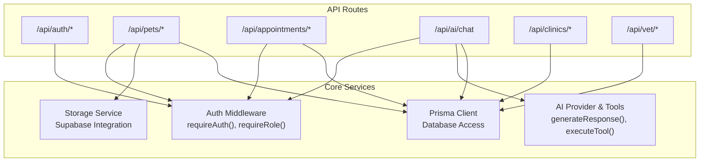
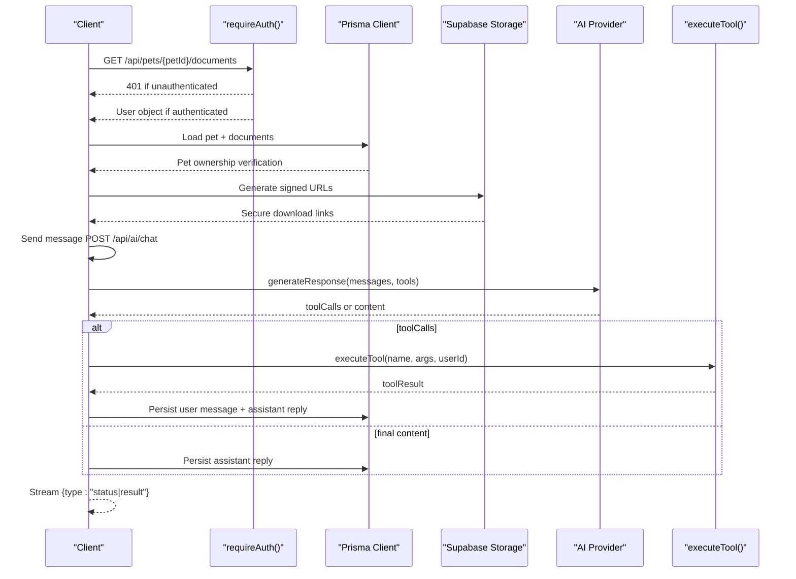

# API Architecture & Endpoints

<cite>
**Referenced Files in This Document**
- [route.ts](file://app/api/auth/login/route.ts)
- [route.ts](file://app/api/auth/register/route.ts)
- [route.ts](file://app/api/auth/logout/route.ts)
- [route.ts](file://app/api/auth/me/route.ts)
- [route.ts](file://app/api/pets/route.ts)
- [route.ts](file://app/api/pets/[petId]/route.ts)
- [route.ts](file://app/api/pets/[petId]/timeline/route.ts)
- [route.ts](file://app/api/pets/[petId]/documents/route.ts)
- [route.ts](file://app/api/pets/[petId]/documents/[documentId]/route.ts)
- [route.ts](file://app/api/appointments/route.ts)
- [route.ts](file://app/api/appointments/[appointmentId]/route.ts)
- [route.ts](file://app/api/ai/chat/route.ts)
- [auth.ts](file://lib/auth.ts)
- [storage.ts](file://lib/storage.ts)
- [schema.prisma](file://prisma/schema.prisma)
</cite>

## Update Summary
**Changes Made**
- Added comprehensive documentation for new pet document management endpoints
- Updated Pet Management section with document upload, listing, and deletion capabilities
- Added storage integration details for medical document handling
- Enhanced security considerations for file uploads and access control

## Table of Contents
1. Introduction
2. Project Structure
3. Core Components
4. Architecture Overview
5. Detailed Component Analysis
6. Dependency Analysis
7. Performance Considerations
8. Troubleshooting Guide
9. Conclusion

## Introduction
This document specifies the RESTful API architecture for the PETIVA Pet Healthcare Ecosystem under /api/* routes. It covers HTTP methods, URL patterns, request/response schemas, authentication and authorization mechanisms, error handling, and operational considerations such as rate limiting and versioning. The API is implemented using Next.js Route Handlers with TypeScript interfaces derived from Prisma models to ensure type safety across client-server communication.

## Project Structure
The API is organized by feature domains:
- Authentication: /api/auth/* (login, register, logout, me)
- Pets: /api/pets/* (CRUD, timeline, and document management)
- Appointments: /api/appointments/* (listing, booking, status updates)
- AI Chat: /api/ai/chat (conversation retrieval and streaming responses)
- Clinics and Vets: /api/clinics/*, /api/vet/* (discovery and management)



**Diagram sources**
- [auth.ts:109-124](file://lib/auth.ts#L109-L124)
- [schema.prisma:30-66](file://prisma/schema.prisma#L30-L66)
- [route.ts:1-349](file://app/api/ai/chat/route.ts#L1-L349)
- [storage.ts:1-125](file://lib/storage.ts#L1-L125)

**Section sources**
- [schema.prisma:1-350](file://prisma/schema.prisma#L1-L350)

## Core Components
- Authentication middleware:
  - Cookie-based sessions with secure settings (httpOnly, secure in production, sameSite lax).
  - Session validation with sliding expiration and token hashing.
  - Role-based authorization helpers.
- Data layer:
  - Prisma ORM with strongly typed models for User, Pet, Appointment, Veterinarian, Clinic, AIConversation, AIMessage, Document, etc.
- AI chat:
  - Streaming NDJSON responses with tool execution loop and conversation persistence.
- Storage service:
  - Supabase Storage integration for secure medical document storage.
  - File validation, size limits, and MIME type restrictions.
  - Signed URL generation for secure document access.

Key responsibilities:
- Enforce authentication on protected endpoints via requireAuth().
- Validate inputs and return consistent error envelopes.
- Maintain role-based access control for sensitive operations.
- Handle secure file uploads and access controls for medical documents.

**Section sources**
- [auth.ts:1-125](file://lib/auth.ts#L1-L125)
- [schema.prisma:30-66](file://prisma/schema.prisma#L30-L66)
- [storage.ts:1-125](file://lib/storage.ts#L1-L125)

## Architecture Overview
The API follows an API-first design:
- TypeScript interfaces are generated from Prisma schema, ensuring compile-time type safety for requests and responses.
- Each route handler validates input, enforces authentication and authorization, interacts with the database via Prisma, and returns standardized JSON responses.
- AI chat uses a streaming approach with server-sent events-like behavior over a ReadableStream, emitting status and result chunks.
- Document management integrates with Supabase Storage for secure file handling with signed URLs.



**Diagram sources**
- [route.ts:7-66](file://app/api/ai/chat/route.ts#L7-L66)
- [route.ts:68-349](file://app/api/ai/chat/route.ts#L68-L349)
- [auth.ts:109-124](file://lib/auth.ts#L109-L124)
- [storage.ts:100-113](file://lib/storage.ts#L100-L113)

## Detailed Component Analysis

### Authentication Endpoints
- POST /api/auth/register
  - Purpose: Create a new user account and establish a session.
  - Request body: email, password, role, firstName, lastName, phone (optional).
  - Validation: Required fields, role must be valid enum, password length >= 8.
  - Response: 201 with success flag and minimal user profile; sets secure session cookie.
  - Errors: 400 Bad Request (validation), 409 Conflict (email exists), 500 Internal Server Error.
  - Notes: Passwords are hashed before storage; session created and cookie set.

- POST /api/auth/login
  - Purpose: Authenticate user and start a session.
  - Request body: email, password.
  - Response: 200 with success flag and minimal user profile; sets secure session cookie.
  - Errors: 400 Bad Request (missing fields), 401 Unauthorized (invalid credentials), 500 Internal Server Error.

- POST /api/auth/logout
  - Purpose: Invalidate session and clear cookie.
  - Response: 200 with success flag.
  - Errors: 500 Internal Server Error.

- GET /api/auth/me
  - Purpose: Retrieve current authenticated user profile.
  - Response: 200 with success flag and minimal user profile.
  - Errors: 401 Unauthorized (not logged in), 500 Internal Server Error.

Authentication and session details:
- Cookie name: session_token.
- Cookie options: httpOnly true, secure in production, sameSite lax, path /.
- Session expiry: 2 hours with sliding window extension when within 1 hour of expiry.
- Token storage: Hashed tokens stored in Session table; lookup by hash.

**Section sources**
- [route.ts:1-78](file://app/api/auth/register/route.ts#L1-L78)
- [route.ts:1-58](file://app/api/auth/login/route.ts#L1-L58)
- [route.ts:1-25](file://app/api/auth/logout/route.ts#L1-L25)
- [route.ts:1-33](file://app/api/auth/me/route.ts#L1-L33)
- [auth.ts:1-125](file://lib/auth.ts#L1-L125)

### Pet Management Endpoints
- GET /api/pets
  - Purpose: List all pets owned by the authenticated user.
  - Response: 200 with success flag and array of pet objects.
  - Errors: 401 Unauthorized, 500 Internal Server Error.

- POST /api/pets
  - Purpose: Create a new pet profile for the authenticated owner.
  - Request body: name, species (required); breed, gender, dateOfBirth, weight (optional).
  - Response: 201 with success flag and created pet object.
  - Errors: 400 Bad Request (missing required fields), 401 Unauthorized, 500 Internal Server Error.

- GET /api/pets/[petId]
  - Purpose: Get details of a specific pet.
  - Authorization: Owner-only check enforced.
  - Response: 200 with success flag and pet object.
  - Errors: 401 Unauthorized, 403 Forbidden (not owner), 404 Not Found, 500 Internal Server Error.

- PUT /api/pets/[petId]
  - Purpose: Update pet details.
  - Authorization: Owner-only check enforced.
  - Request body: name, species (required); breed, gender, dateOfBirth, weight (optional).
  - Response: 200 with success flag and updated pet object.
  - Errors: 400 Bad Request (validation), 401 Unauthorized, 403 Forbidden, 404 Not Found, 500 Internal Server Error.

- DELETE /api/pets/[petId]
  - Purpose: Delete/archive a pet profile.
  - Authorization: Owner-only check enforced.
  - Response: 200 with success flag and confirmation message.
  - Errors: 401 Unauthorized, 403 Forbidden, 404 Not Found, 500 Internal Server Error.

- GET /api/pets/[petId]/timeline
  - Purpose: Fetch chronological timeline events for a pet.
  - Authorization: Owner-only check enforced.
  - Response: 200 with success flag and timeline array containing events like medical records, vaccinations, medications, allergies, conditions, metrics, appointments.
  - Errors: 401 Unauthorized, 403 Forbidden, 404 Not Found, 500 Internal Server Error.

Ownership and authorization:
- All pet endpoints enforce ownership checks against the authenticated user's id.
- Timeline aggregates multiple related entities into a unified event list sorted by date descending.

**Section sources**
- [route.ts:1-69](file://app/api/pets/route.ts#L1-L69)
- [route.ts:1-141](file://app/api/pets/[petId]/route.ts#L1-L141)
- [route.ts:1-149](file://app/api/pets/[petId]/timeline/route.ts#L1-L149)

### Pet Document Management Endpoints

#### Document Listing and Upload
- GET /api/pets/[petId]/documents
  - Purpose: List all medical documents for a specific pet with secure signed URLs.
  - Authorization: Requires authentication and pet ownership verification.
  - Response: 200 with success flag and array of document objects including:
    - id: unique document identifier
    - fileName: original filename
    - fileType: MIME type (PDF, PNG, JPEG, WebP)
    - createdAt: upload timestamp
    - uploaderName: name of the person who uploaded the document
    - signedUrl: temporary secure download link (when storage configured)
  - Errors: 401 Unauthorized, 403 Forbidden (not owner), 404 Not Found (pet), 500 Internal Server Error.

- POST /api/pets/[petId]/documents
  - Purpose: Upload a medical document for a pet.
  - Authorization: Requires authentication and pet ownership verification. Only PET_OWNER role can upload.
  - Request: multipart/form-data with 'file' field containing the document.
  - File Restrictions:
    - Maximum size: 10 MB
    - Allowed types: PDF, PNG, JPEG, WebP
    - Filename sanitization applied for security
  - Response: 201 with success flag and created document metadata.
  - Storage: Files stored in Supabase Storage bucket 'pet-documents' with hierarchical organization.
  - Errors: 400 Bad Request (invalid file/size/type), 401 Unauthorized, 403 Forbidden (not owner/not pet owner), 404 Not Found (pet), 502 Bad Gateway (storage error), 503 Service Unavailable (storage not configured), 500 Internal Server Error.

#### Document Deletion
- DELETE /api/pets/[petId]/documents/[documentId]
  - Purpose: Remove a medical document and its associated file.
  - Authorization: Requires authentication and pet ownership verification.
  - Security: Document lookup scoped to specific pet to prevent cross-pet deletion.
  - Behavior: 
    - Attempts to delete file from Supabase Storage (best-effort, non-blocking)
    - Removes document metadata from database
  - Response: 200 with success flag.
  - Errors: 401 Unauthorized, 403 Forbidden (not owner), 404 Not Found (pet/document), 500 Internal Server Error.

Document storage architecture:
- Files stored in Supabase Storage with structure: `pets/{petId}/{documentId}/{sanitizedFilename}`
- Database stores metadata only: id, petId, uploaderId, ossKey, fileName, fileType, createdAt
- Signed URLs provide time-limited secure access (3600 seconds default)
- Ownership verification performed server-side using pet relationships

**Updated** Added comprehensive document management functionality with secure file handling and storage integration.

**Section sources**
- [route.ts:1-223](file://app/api/pets/[petId]/documents/route.ts#L1-L223)
- [route.ts:1-67](file://app/api/pets/[petId]/documents/[documentId]/route.ts#L1-L67)
- [storage.ts:1-125](file://lib/storage.ts#L1-L125)
- [schema.prisma:251-263](file://prisma/schema.prisma#L251-L263)

### Appointment Scheduling Endpoints
- GET /api/appointments
  - Purpose: Retrieve appointments based on user role:
    - PET_OWNER: appointments for their pets.
    - VETERINARIAN: appointments assigned to them.
    - CLINIC_ADMIN: appointments at their clinic.
  - Response: 200 with success flag and array of appointment objects including related pet, vet, clinic, and owner details.
  - Errors: 401 Unauthorized, 500 Internal Server Error.

- POST /api/appointments
  - Purpose: Book a new appointment.
  - Request body: petId, vetId, clinicId, dateTime, reason (all required).
  - Authorization: Enforces pet ownership.
  - Validation: Prevents double-booking for the same vet and time slot within REQUESTED/CONFIRMED statuses.
  - Response: 201 with success flag and created appointment object.
  - Errors: 400 Bad Request (missing fields), 401 Unauthorized, 403 Forbidden (not owner), 409 Conflict (double-booked), 500 Internal Server Error.

- PUT /api/appointments/[appointmentId]
  - Purpose: Update appointment status (confirm, reject, cancel, complete).
  - Authorization: Role-based boundary checks:
    - PET_OWNER: can cancel own upcoming appointments.
    - VETERINARIAN: manage appointments assigned to them.
    - CLINIC_ADMIN: manage appointments at their clinic.
    - PLATFORM_ADMIN: full access.
  - Validation: Status must be a valid enum; prevents conflicts when confirming.
  - Response: 200 with success flag and updated appointment object.
  - Errors: 400 Bad Request (invalid status), 401 Unauthorized, 403 Forbidden (unauthorized transition), 404 Not Found, 409 Conflict (conflicting confirmed appointment), 500 Internal Server Error.

Audit logging:
- Successful status transitions are recorded in AuditLog with action, entity, entityId, and payload describing previous and new status.

**Section sources**
- [route.ts:1-143](file://app/api/appointments/route.ts#L1-L143)
- [route.ts:1-119](file://app/api/appointments/[appointmentId]/route.ts#L1-L119)
- [schema.prisma:164-182](file://prisma/schema.prisma#L164-L182)

### AI Chat Endpoint
- GET /api/ai/chat?petId=...
  - Purpose: Retrieve the latest conversation for the authenticated user and specified pet.
  - Authorization: Requires authentication and verifies pet ownership.
  - Response: 200 with success flag, conversationId (empty string if none), and messages array.
  - Errors: 400 Bad Request (missing petId), 401 Unauthorized, 403 Forbidden, 500 Internal Server Error.

- POST /api/ai/chat
  - Purpose: Send a message and receive a streaming response.
  - Request body: conversationId (optional), petId (required for new conversations), message (required).
  - Authorization: Requires authentication; enforces pet ownership for new conversations; validates existing conversation ownership.
  - Behavior:
    - Persists user message.
    - Loads recent conversation history (up to 20 messages).
    - Calls AI provider with system instructions and tools.
    - Executes tools iteratively, sending status updates and results via streaming.
    - Persists assistant response.
  - Response: Streaming NDJSON with chunks:
    - { type: "status", message: ... }
    - { type: "result", success: boolean, conversationId?, message? }
  - Errors: 400 Bad Request (missing fields), 401 Unauthorized, 403 Forbidden, 404 Not Found (conversation), 500 Internal Server Error.

Streaming details:
- Content-Type: application/x-ndjson.
- Connection: keep-alive.
- Max loops capped to prevent infinite tool call cycles.

**Section sources**
- [route.ts:1-349](file://app/api/ai/chat/route.ts#L1-L349)

### Additional Endpoints
- GET /api/clinics
  - Purpose: List clinics associated with the authenticated user (veterinarians) or discover verified clinics.
  - Response: 200 with success flag and clinics array.
  - Errors: 401 Unauthorized, 500 Internal Server Error.

- GET /api/vet/discovery
  - Purpose: Browse/search available veterinarians and their clinics.
  - Response: 200 with success flag and formatted veterinarians array.
  - Errors: 401 Unauthorized, 500 Internal Server Error.

- GET /api/profile
  - Purpose: Retrieve authenticated user profile.
  - Response: 200 with success flag and profile object.
  - Errors: 401 Unauthorized, 500 Internal Server Error.

- PUT /api/profile
  - Purpose: Update user profile fields (firstName, lastName, phone).
  - Request body: firstName, lastName (required); phone (optional).
  - Response: 200 with success flag and updated profile object.
  - Errors: 400 Bad Request (missing names), 401 Unauthorized, 500 Internal Server Error.

**Section sources**
- [route.ts:1-49](file://app/api/clinics/route.ts#L1-L49)
- [route.ts:1-60](file://app/api/vet/discovery/route.ts#L1-L60)
- [route.ts:1-82](file://app/api/profile/route.ts#L1-L82)

## Dependency Analysis
- Authentication dependency chain:
  - Route handlers call requireAuth() to validate sessions via cookies and database-backed sessions.
  - Sessions use hashed tokens and support sliding expiration.
- Data dependencies:
  - All endpoints interact with Prisma models defined in schema.prisma.
  - Relationships include User-Pet, User-Appointment, Veterinarian-Appointment, Clinic-Appointment, AIConversation-AIMessage, User-Document, Pet-Document.
- AI integration:
  - AI chat depends on AI provider abstraction and tool executor; tool calls are persisted as messages and executed per turn.
- Storage integration:
  - Document management depends on Supabase Storage service for secure file handling.
  - Storage operations include bucket management, file upload, signed URL generation, and file deletion.

```mermaid
classDiagram
class User {
+string id
+string email
+UserRole role
+string firstName
+string lastName
+string phone
}
class Pet {
+string id
+string ownerId
+string name
+string species
}
class Document {
+string id
+string petId
+string uploaderId
+string ossKey
+string fileName
+string fileType
+DateTime createdAt
}
class Appointment {
+string id
+string petId
+string ownerId
+string vetId
+string clinicId
+DateTime dateTime
+AppointmentStatus status
}
class Veterinarian {
+string id
+string userId
+string licenseNumber
}
class Clinic {
+string id
+string name
+string address
}
class AIConversation {
+string id
+string userId
+string petId
}
class AIMessage {
+string id
+string conversationId
+string role
+string content
}
User ||--o{ Pet : "owns"
User ||--o{ Document : "uploads"
Pet ||--o{ Document : "has"
User ||--o{ Appointment : "booked_by_owner"
Veterinarian ||--o{ Appointment : "assigned_to"
Clinic ||--o{ Appointment : "location"
User ||--o{ AIConversation : "has"
AIConversation ||--o{ AIMessage : "contains"
```

**Diagram sources**
- [schema.prisma:30-66](file://prisma/schema.prisma#L30-L66)
- [schema.prisma:68-88](file://prisma/schema.prisma#L68-L88)
- [schema.prisma:164-182](file://prisma/schema.prisma#L164-L182)
- [schema.prisma:90-105](file://prisma/schema.prisma#L90-L105)
- [schema.prisma:107-119](file://prisma/schema.prisma#L107-L119)
- [schema.prisma:251-263](file://prisma/schema.prisma#L251-L263)
- [schema.prisma:280-296](file://prisma/schema.prisma#L280-L296)

**Section sources**
- [schema.prisma:1-350](file://prisma/schema.prisma#L1-L350)

## Performance Considerations
- Database queries:
  - Use selective includes to minimize payload size (e.g., selecting only necessary fields for vet user profiles).
  - Leverage indexes defined on frequently queried columns (e.g., vetId+dateTime for appointments, petId for documents).
- Streaming AI responses:
  - Limit conversation history to recent messages to reduce context size and latency.
  - Cap tool call loops to avoid excessive processing.
- Session management:
  - Sliding expiration reduces re-authentication frequency while maintaining security.
- Input validation:
  - Early validation reduces unnecessary database calls and improves throughput.
- Storage operations:
  - Signed URL generation provides efficient secure file access without exposing storage credentials.
  - Bucket creation is cached to avoid repeated initialization overhead.
  - File size and type validation occurs early to prevent unnecessary storage operations.

## Troubleshooting Guide
Common errors and resolutions:
- 400 Bad Request:
  - Missing required fields in registration, login, pet creation, appointment booking, or profile update.
  - Invalid role or appointment status values.
  - Invalid file format, size exceeding 10MB limit, or unsupported MIME type for document uploads.
- 401 Unauthorized:
  - Missing or invalid session cookie; ensure login succeeded and cookies are enabled.
- 403 Forbidden:
  - Attempting to access another user's pet or unauthorized status transition on appointments.
  - Non-pet-owner attempting to upload documents.
- 404 Not Found:
  - Referencing non-existent pet, appointment, conversation, or document.
- 409 Conflict:
  - Double-booking detected for the same vet and time slot; choose a different time.
- 502 Bad Gateway:
  - Storage service unavailable or configuration issues during document upload.
- 503 Service Unavailable:
  - Storage service not configured on server; document upload will fail until configured.
- 500 Internal Server Error:
  - Unexpected server-side issues; check logs and retry.

Operational tips:
- Verify session cookie presence and correctness.
- Ensure environment variables for production secure flags are set.
- For AI chat, confirm pet ownership and conversation existence before posting messages.
- For document operations, verify storage configuration and file permissions.
- Check Supabase Storage bucket 'pet-documents' exists and is properly configured.

**Section sources**
- [route.ts:1-78](file://app/api/auth/register/route.ts#L1-L78)
- [route.ts:1-58](file://app/api/auth/login/route.ts#L1-L58)
- [route.ts:1-143](file://app/api/appointments/route.ts#L1-L143)
- [route.ts:1-119](file://app/api/appointments/[appointmentId]/route.ts#L1-L119)
- [route.ts:1-349](file://app/api/ai/chat/route.ts#L1-L349)
- [route.ts:1-223](file://app/api/pets/[petId]/documents/route.ts#L1-L223)
- [route.ts:1-67](file://app/api/pets/[petId]/documents/[documentId]/route.ts#L1-L67)

## Conclusion
The PETIVA API provides a robust, type-safe, and secure foundation for pet healthcare workflows. Authentication and authorization are enforced consistently across endpoints, with role-based controls and ownership checks protecting sensitive resources. The AI chat endpoint offers advanced conversational capabilities with tool-driven interactions and streaming responses. The new document management system enables secure medical record handling with Supabase Storage integration, providing secure file uploads, signed URL access, and proper ownership verification. Standardized error handling and structured responses simplify client integration. Future enhancements should consider rate limiting, explicit API versioning, and expanded input validation to further improve reliability and scalability.