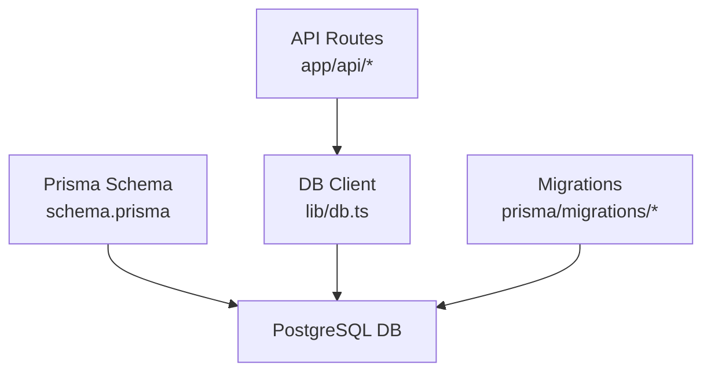
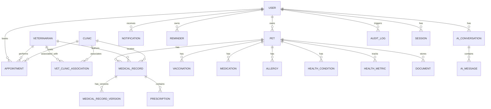
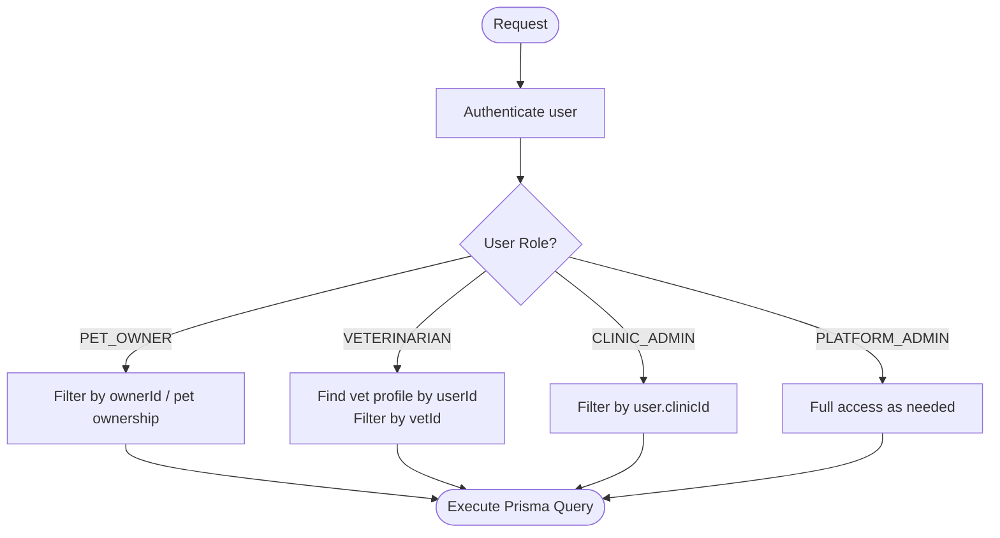
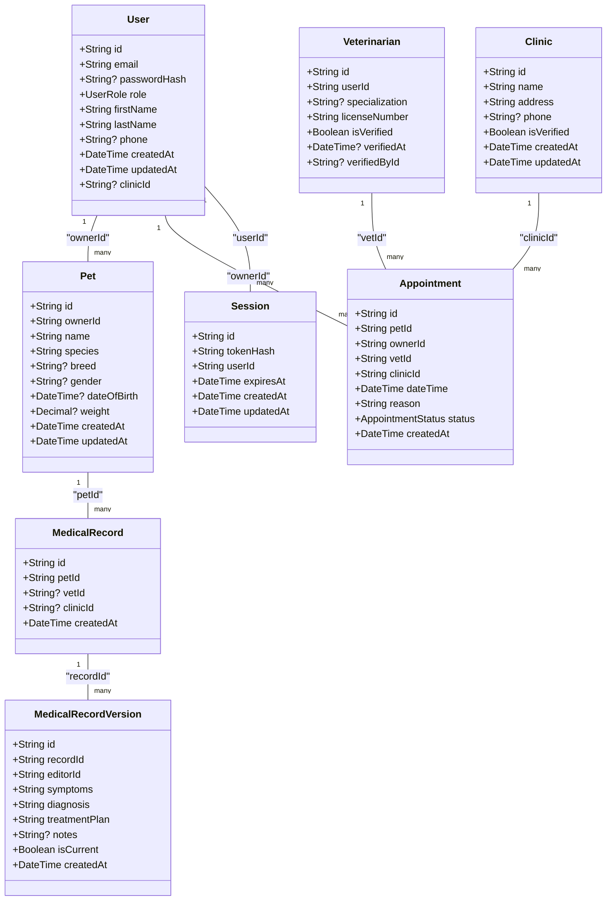
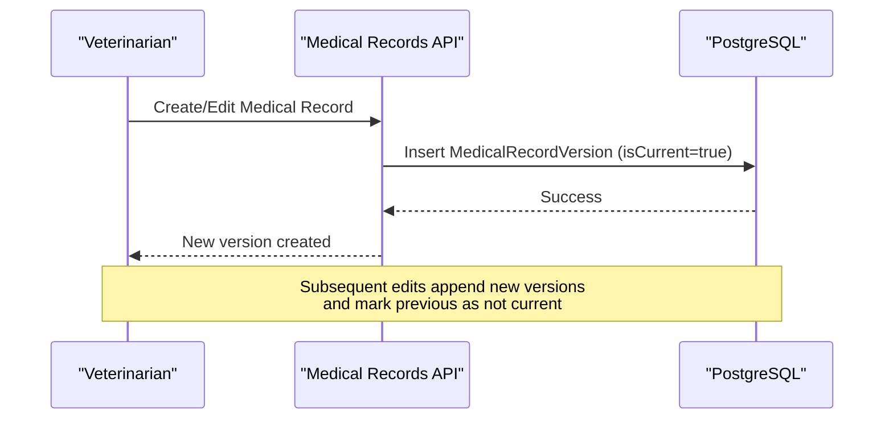
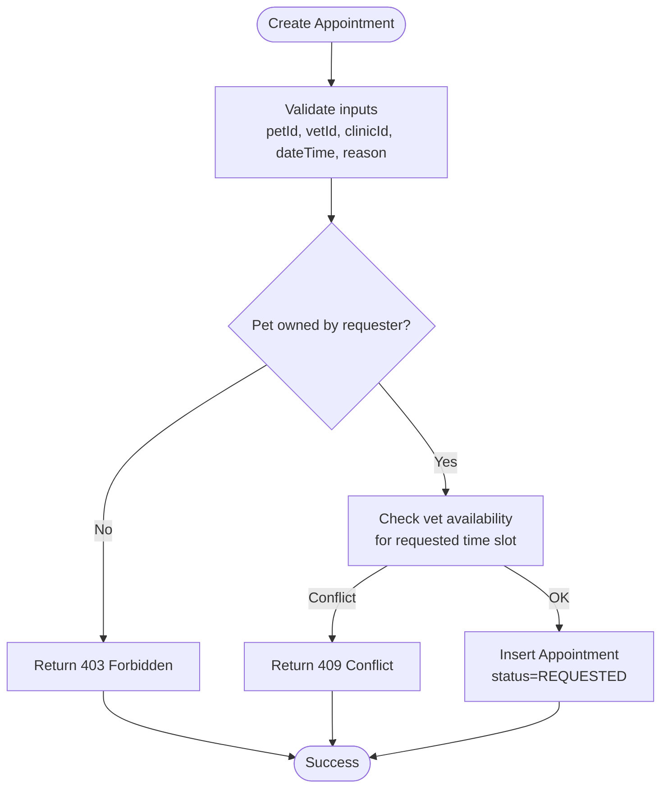
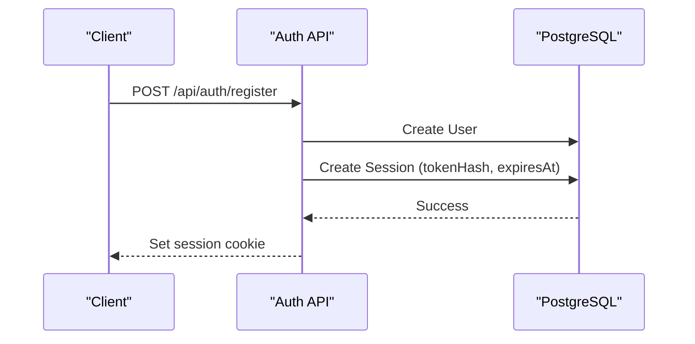
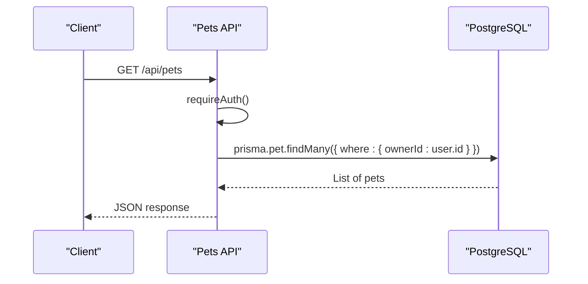
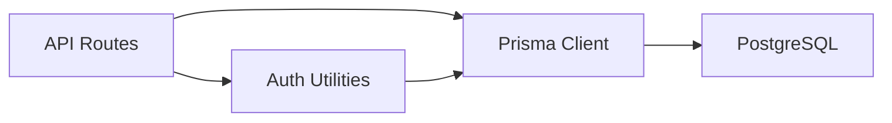

# Database Design & Schema

<cite>
**Referenced Files in This Document**
- [schema.prisma](file://prisma/schema.prisma)
- [db.ts](file://lib/db.ts)
- [02-database-design.md](file://docs/03-architecture/02-database-design.md)
- [migration.sql (init)](file://prisma/migrations/20260825091722_init/migration.sql)
- [migration.sql (make_password_hash_optional)](file://prisma/migrations/20260827095530_make_password_hash_optional/migration.sql)
- [migration.sql (add_clinic_admin_relation)](file://prisma/migrations/20260827123510_add_clinic_admin_relation/migration.sql)
- [route.ts (auth/register)](file://app/api/auth/register/route.ts)
- [route.ts (pets)](file://app/api/pets/route.ts)
- [route.ts (appointments)](file://app/api/appointments/route.ts)
</cite>

## Table of Contents
1. Introduction
2. Project Structure
3. Core Components
4. Architecture Overview
5. Detailed Component Analysis
6. Dependency Analysis
7. Performance Considerations
8. Troubleshooting Guide
9. Conclusion
10. Appendices

## Introduction
This document provides comprehensive data model documentation for the PETIVA Pet Healthcare Ecosystem database schema. It details entity relationships, field definitions, constraints, and validation rules implemented via Prisma. It also explains the multi-role user system, data access patterns using Prisma ORM, caching strategies, query optimization techniques, data lifecycle management, and security measures including password hashing, encrypted connections, and role-based access controls.

## Project Structure
The database is defined with Prisma and PostgreSQL. The core schema lives in the Prisma configuration file, migrations capture schema evolution, and API routes demonstrate how the models are used at runtime.

**Diagram sources**
- [schema.prisma:1-7](file://prisma/schema.prisma#L1-L7)
- [db.ts:1-33](file://lib/db.ts#L1-L33)
- [migration.sql (init):1-409](file://prisma/migrations/20260825091722_init/migration.sql#L1-L409)

**Section sources**
- [schema.prisma:1-312](file://prisma/schema.prisma#L1-L312)
- [db.ts:1-33](file://lib/db.ts#L1-L33)
- [migration.sql (init):1-409](file://prisma/migrations/20260825091722_init/migration.sql#L1-L409)

## Core Components
This section summarizes the primary entities and their roles in the ecosystem.

- User: Central identity and authorization entity with a multi-role enum supporting pet owners, veterinarians, clinic administrators, and platform admins. Includes optional session linkage and clinic association for admin scope.
- Pet: Profile and health-related records tied to an owner.
- Veterinarian: Practitioner profile linked to a User, with verification state and license number.
- Clinic: Physical location or organization hosting appointments and medical records.
- VetClinicAssociation: Many-to-many mapping between Veterinarian and Clinic with status tracking.
- MedicalRecord and MedicalRecordVersion: Header and versioned content for auditable medical histories.
- Appointment: Time-bound scheduling linking Pet, Owner, Veterinarian, and Clinic with status transitions.
- Prescription, Vaccination, Medication, Allergy, HealthCondition, HealthMetric: Pet health detail entities.
- Document: References to files stored in external object storage with metadata.
- Notification, Reminder: User-facing alerts and scheduled tasks.
- AIConversation and AIMessage: Chat history associated with users and pets.
- AuditLog: Immutable log of significant actions for compliance and traceability.
- Session: Secure token-based sessions with expiration and indexes for performance.

**Section sources**
- [schema.prisma:9-312](file://prisma/schema.prisma#L9-L312)
- [02-database-design.md:45-165](file://docs/03-architecture/02-database-design.md#L45-L165)

## Architecture Overview
The system uses a relational data model managed by Prisma over PostgreSQL. API routes enforce authentication and authorization before issuing Prisma queries that leverage foreign keys, unique constraints, and indexes for integrity and performance.

**Diagram sources**
- [schema.prisma:30-312](file://prisma/schema.prisma#L30-L312)
- [02-database-design.md:9-41](file://docs/03-architecture/02-database-design.md#L9-L41)

## Detailed Component Analysis

### Multi-Role User System and Permissions
- Roles: PET_OWNER, VETERINARIAN, CLINIC_ADMIN, PLATFORM_ADMIN.
- Authorization patterns:
  - Pet owners can manage their own pets and book appointments for them.
  - Veterinarians view and update medical records for patients they are assigned to via appointments or clinic associations.
  - Clinic admins scope data to their clinic via a user-level clinicId reference.
- Implementation highlights:
  - Role checks in API routes determine query filters and allowed operations.
  - Clinic admin scope enforced through user.clinicId when querying clinic-scoped resources.

**Section sources**
- [schema.prisma:9-53](file://prisma/schema.prisma#L9-L53)
- [route.ts (appointments):13-52](file://app/api/appointments/route.ts#L13-L52)

### Entity Relationships and Constraints
- Primary Keys: All entities use UUIDs as primary keys.
- Foreign Keys: Enforced via Prisma relations and migration SQL; cascade behaviors vary per relationship to preserve referential integrity.
- Unique Constraints: Email uniqueness on User, licenseNumber on Veterinarian, composite unique on VetClinicAssociation(vetId, clinicId), tokenHash on Session.
- Indexes: Strategic indexes on frequently queried columns such as appointment vetId+dateTime, ownerId, petId; medical record versions indexed by recordId and isCurrent; audit logs indexed by userId, entity+entityId, timestamp; documents indexed by petId; sessions indexed by userId and expiresAt.

**Diagram sources**
- [schema.prisma:30-312](file://prisma/schema.prisma#L30-L312)
- [migration.sql (init):11-409](file://prisma/migrations/20260825091722_init/migration.sql#L11-L409)

**Section sources**
- [schema.prisma:30-312](file://prisma/schema.prisma#L30-L312)
- [migration.sql (init):278-324](file://prisma/migrations/20260825091722_init/migration.sql#L278-L324)

### Data Lifecycle Management

#### Medical Record Versioning
- MedicalRecord acts as a header; actual content resides in MedicalRecordVersion rows.
- Each edit creates a new version row; isCurrent indicates the active version.
- Compound index on (recordId, isCurrent) optimizes fetching the current version efficiently.

**Diagram sources**
- [schema.prisma:133-162](file://prisma/schema.prisma#L133-L162)
- [migration.sql (init):93-116](file://prisma/migrations/20260825091722_init/migration.sql#L93-L116)

**Section sources**
- [schema.prisma:133-162](file://prisma/schema.prisma#L133-L162)
- [02-database-design.md:106-128](file://docs/03-architecture/02-database-design.md#L106-L128)

#### Appointment Status Transitions
- Status enum includes REQUESTED, CONFIRMED, CANCELLED, COMPLETED, NO_SHOW.
- Creation enforces pet ownership and prevents double booking within transactions.
- Queries filter by role and scope (owner, vet, clinic).

**Diagram sources**
- [route.ts (appointments):70-129](file://app/api/appointments/route.ts#L70-L129)
- [schema.prisma:164-182](file://prisma/schema.prisma#L164-L182)

**Section sources**
- [route.ts (appointments):70-129](file://app/api/appointments/route.ts#L70-L129)
- [schema.prisma:22-28](file://prisma/schema.prisma#L22-L28)

#### User Session Handling
- Sessions store hashed tokens with expiration timestamps.
- Indexes on userId and expiresAt optimize lookup and cleanup.
- Registration flow creates a session and sets a cookie.

**Diagram sources**
- [route.ts (auth/register):41-57](file://app/api/auth/register/route.ts#L41-L57)
- [schema.prisma:55-66](file://prisma/schema.prisma#L55-L66)
- [migration.sql (init):26-35](file://prisma/migrations/20260825091722_init/migration.sql#L26-L35)

**Section sources**
- [route.ts (auth/register):41-57](file://app/api/auth/register/route.ts#L41-L57)
- [schema.prisma:55-66](file://prisma/schema.prisma#L55-L66)

### Data Access Patterns Using Prisma ORM
- Authentication and authorization middleware ensures only authorized users access endpoints.
- Role-based filtering:
  - Pet owners: queries scoped by ownerId.
  - Veterinarians: queries scoped by vetId after resolving vet profile from userId.
  - Clinic admins: queries scoped by user.clinicId.
- Include relations to fetch related entities efficiently in single queries.

**Diagram sources**
- [route.ts (pets):6-27](file://app/api/pets/route.ts#L6-L27)
- [schema.prisma:68-88](file://prisma/schema.prisma#L68-L88)

**Section sources**
- [route.ts (pets):6-27](file://app/api/pets/route.ts#L6-L27)
- [route.ts (appointments):7-52](file://app/api/appointments/route.ts#L7-L52)

### Caching Strategies for Frequently Accessed Pet Health Records
- Recommended approaches:
  - In-memory cache (e.g., Redis) keyed by petId for recent medical summaries and current versions.
  - Cache invalidation triggers on write operations to MedicalRecordVersion or related entities.
  - TTL-based expiration aligned with expected update frequency.
  - Read-through pattern: check cache first, fallback to DB, then populate cache.
- Benefits: Reduced latency for frequent reads, lower DB load during peak times.

[No sources needed since this section provides general guidance]

### Query Optimization Techniques
- Leverage existing indexes:
  - Appointments: vetId+dateTime, ownerId, petId.
  - MedicalRecordVersion: recordId+isCurrent.
  - Documents: petId.
  - AuditLog: userId, entity+entityId, timestamp.
  - Sessions: userId, expiresAt.
- Use selective includes to avoid N+1 queries.
- Apply pagination and filtering on large result sets.
- Batch writes where possible to reduce transaction overhead.

**Section sources**
- [migration.sql (init):278-324](file://prisma/migrations/20260825091722_init/migration.sql#L278-L324)
- [schema.prisma:145-162](file://prisma/schema.prisma#L145-L162)

### Data Security Measures
- Password Hashing:
  - Registration hashes passwords before storing in User.passwordHash.
  - Optional passwordHash supports OAuth-based accounts without local passwords.
- Encrypted Connections:
  - Production uses a connection pool configured with DATABASE_URL; ensure TLS is enabled at the database level and via environment configuration.
- Role-Based Access Controls:
  - API routes enforce role-based scoping for data visibility and mutations.
  - Clinic admin scope enforced via user.clinicId.
- Session Security:
  - Sessions store hashed tokens with expiration; cookies set securely.

**Section sources**
- [route.ts (auth/register):41-57](file://app/api/auth/register/route.ts#L41-L57)
- [db.ts:10-29](file://lib/db.ts#L10-L29)
- [schema.prisma:30-53](file://prisma/schema.prisma#L30-L53)
- [migration.sql (make_password_hash_optional):1-3](file://prisma/migrations/20260827095530_make_password_hash_optional/migration.sql#L1-L3)
- [migration.sql (add_clinic_admin_relation):1-6](file://prisma/migrations/20260827123510_add_clinic_admin_relation/migration.sql#L1-L6)

## Dependency Analysis
The application depends on Prisma client, PostgreSQL, and environment variables for database connectivity. API routes depend on authentication utilities and Prisma models generated from the schema.

**Diagram sources**
- [db.ts:1-33](file://lib/db.ts#L1-L33)
- [schema.prisma:1-7](file://prisma/schema.prisma#L1-L7)

**Section sources**
- [db.ts:1-33](file://lib/db.ts#L1-L33)
- [schema.prisma:1-7](file://prisma/schema.prisma#L1-L7)

## Performance Considerations
- Index usage: Ensure queries align with defined indexes to minimize full table scans.
- Transactional integrity: Use transactions for multi-step operations like appointment creation to prevent race conditions.
- Pagination: Implement cursor or offset-based pagination for large datasets (appointments, medical records).
- Connection pooling: Reuse pooled connections in production to reduce overhead.
- Selective fields: Fetch only necessary fields to reduce payload size.

[No sources needed since this section provides general guidance]

## Troubleshooting Guide
Common issues and resolutions:
- Duplicate email registration: Handled by unique constraint on User.email; return conflict error.
- Invalid role provided: Validation rejects non-existent roles; return bad request.
- Double booking conflicts: Detected via transactional check; return conflict error.
- Unauthorized access: Middleware returns unauthorized when session missing or invalid.
- Missing required fields: Input validation returns bad request with descriptive messages.

**Section sources**
- [route.ts (auth/register):10-38](file://app/api/auth/register/route.ts#L10-L38)
- [route.ts (appointments):75-110](file://app/api/appointments/route.ts#L75-L110)
- [route.ts (pets):36-41](file://app/api/pets/route.ts#L36-L41)

## Conclusion
The PETIVA database schema provides a robust, secure, and scalable foundation for managing pet healthcare data. With clear entity relationships, strong constraints, and strategic indexing, it supports complex workflows like medical record versioning and appointment scheduling. Role-based access control and secure session handling ensure data privacy and integrity. Following the recommended caching and query optimization practices will further enhance performance and reliability.

## Appendices

### Field Definitions and Types Summary
- User: id (UUID PK), email (unique), passwordHash (optional), role (enum), firstName, lastName, phone (optional), timestamps, clinicId (optional FK to Clinic).
- Pet: id (UUID PK), ownerId (FK to User), name, species, breed (optional), gender (optional), dateOfBirth (optional), weight (optional Decimal), timestamps.
- Veterinarian: id (UUID PK), userId (unique FK to User), specialization (optional), licenseNumber (unique), isVerified (default false), verifiedAt (optional), verifiedById (optional FK to User), timestamps.
- Clinic: id (UUID PK), name, address, phone (optional), isVerified (default false), timestamps.
- VetClinicAssociation: id (UUID PK), vetId (FK), clinicId (FK), status (enum default PENDING), createdAt; unique on (vetId, clinicId).
- MedicalRecord: id (UUID PK), petId (FK), vetId (optional FK), clinicId (optional FK), createdAt; index on petId.
- MedicalRecordVersion: id (UUID PK), recordId (FK), editorId (FK), symptoms, diagnosis, treatmentPlan, notes (optional), isCurrent (default true), createdAt; compound index on (recordId, isCurrent).
- Appointment: id (UUID PK), petId (FK), ownerId (FK), vetId (FK), clinicId (FK), dateTime, reason, status (enum default REQUESTED), createdAt; indexes on vetId+dateTime, ownerId, petId.
- Prescription: id (UUID PK), recordId (FK), medicationName, dosage, frequency, startDate, endDate (optional), instructions (optional).
- Vaccination: id (UUID PK), petId (FK), vaccineName, administeredDate, dueDate (optional), vetName (optional).
- Medication: id (UUID PK), petId (FK), medicationName, dosage, frequency, startDate, endDate (optional), status (default ACTIVE).
- Allergy: id (UUID PK), petId (FK), allergen, severity (optional), createdAt.
- HealthCondition: id (UUID PK), petId (FK), name, onsetDate (optional), status (default ACTIVE).
- HealthMetric: id (UUID PK), petId (FK), metricType, value (Decimal), unit, takenAt (default now).
- Document: id (UUID PK), petId (FK), uploaderId (FK), ossKey, fileName, fileType, createdAt; index on petId.
- Notification: id (UUID PK), userId (FK), title, message, isRead (default false), createdAt.
- Reminder: id (UUID PK), userId (FK), title, dueAt, isCleared (default false), createdAt.
- AIConversation: id (UUID PK), userId (FK), petId, createdAt.
- AIMessage: id (UUID PK), conversationId (FK), role, content, createdAt.
- AuditLog: id (UUID PK), userId (optional FK), action, entity, entityId, payload (JSON string), timestamp; indexes on userId, entity+entityId, timestamp.
- Session: id (UUID PK), tokenHash (unique), userId (FK), expiresAt, createdAt, updatedAt; indexes on userId, expiresAt.

**Section sources**
- [schema.prisma:30-312](file://prisma/schema.prisma#L30-L312)
- [migration.sql (init):11-409](file://prisma/migrations/20260825091722_init/migration.sql#L11-L409)