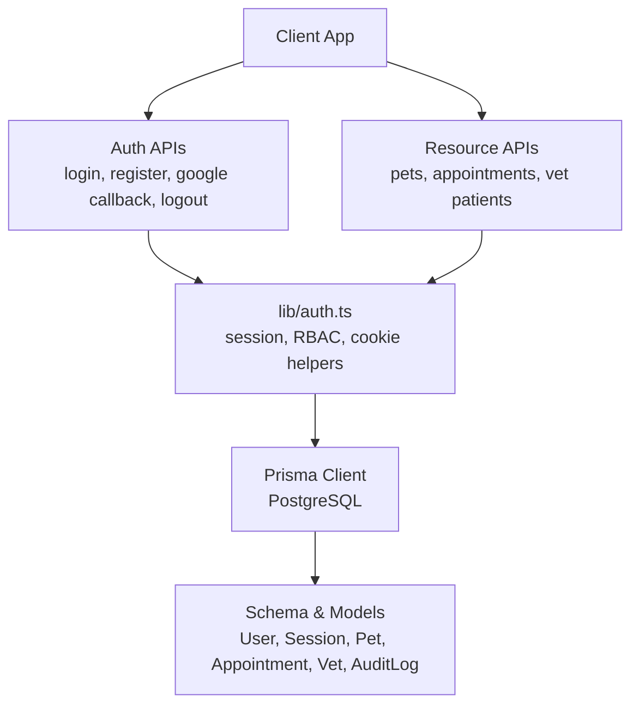
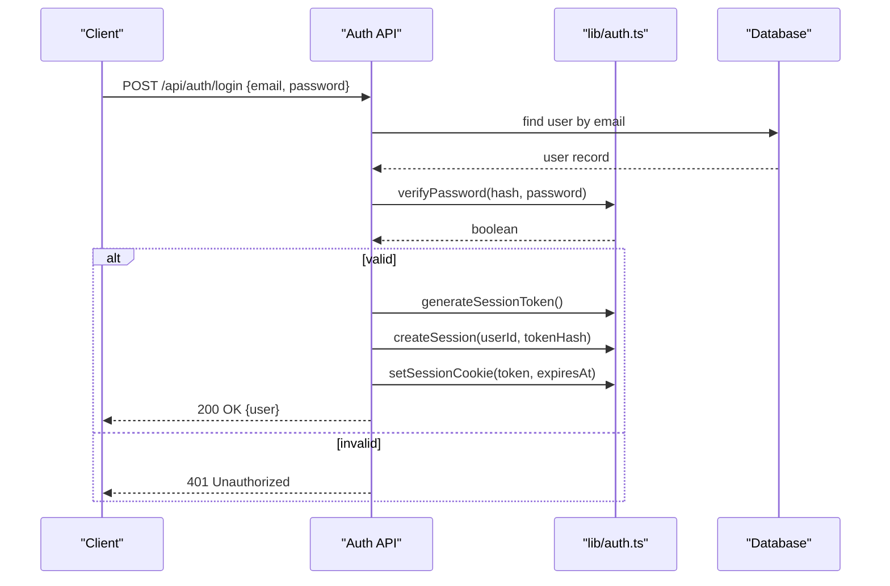
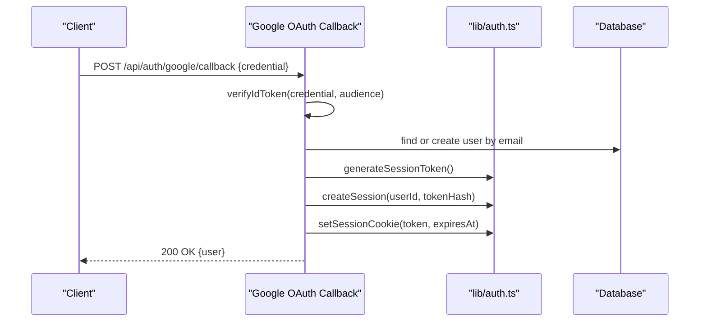
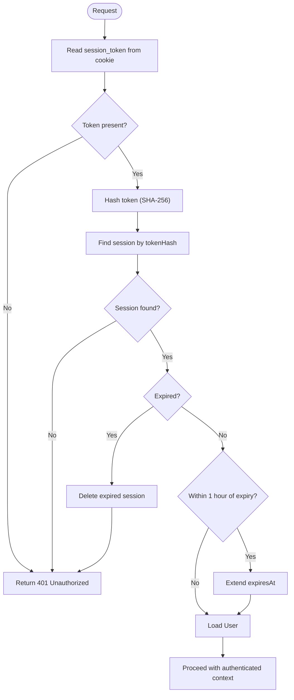
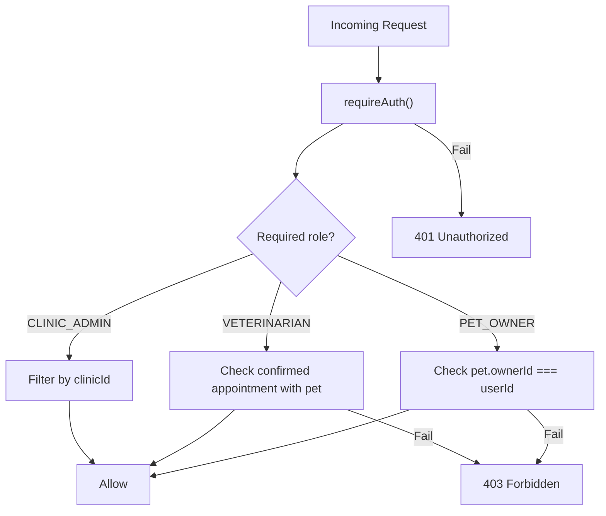
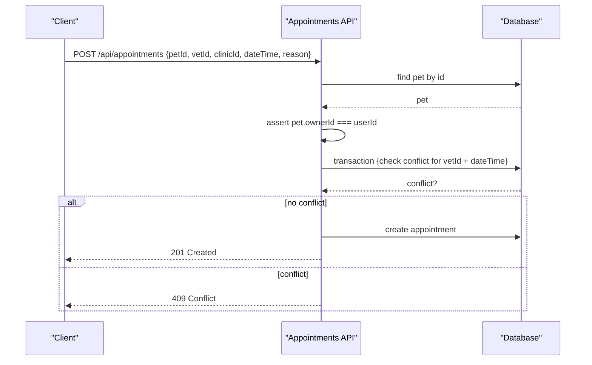
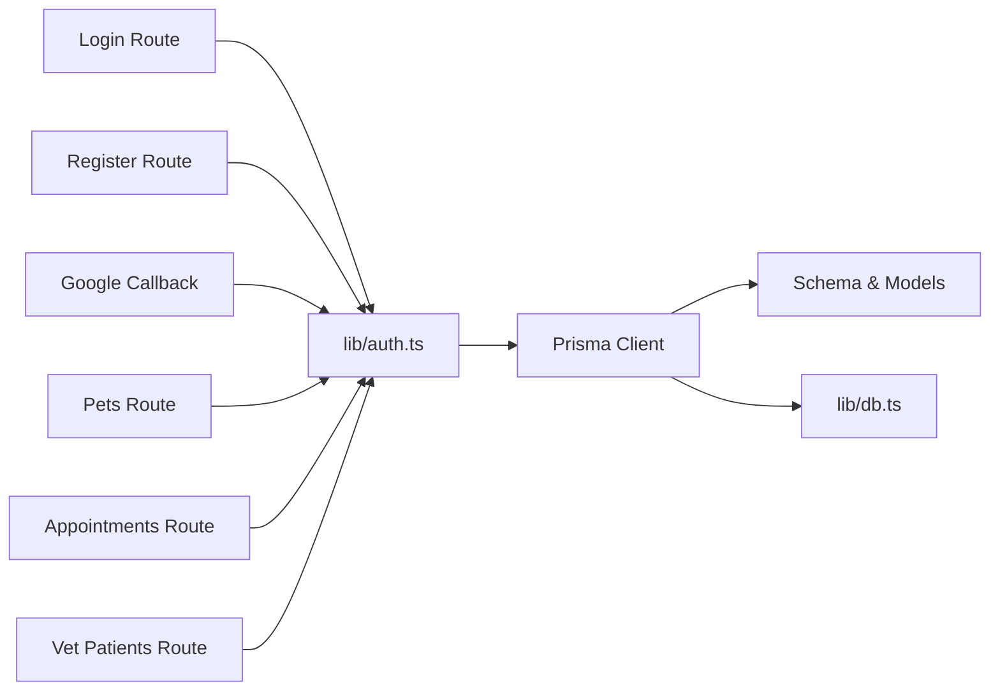

# Security Architecture

<cite>
**Referenced Files in This Document**
- [auth.ts](file://lib/auth.ts)
- [login route.ts](file://app/api/auth/login/route.ts)
- [register route.ts](file://app/api/auth/register/route.ts)
- [google callback route.ts](file://app/api/auth/google/callback/route.ts)
- [logout route.ts](file://app/api/auth/logout/route.ts)
- [pets route.ts](file://app/api/pets/[petId]/route.ts)
- [appointments route.ts](file://app/api/appointments/route.ts)
- [vet patients route.ts](file://app/api/vet/patients/[petId]/route.ts)
- [schema.prisma](file://prisma/schema.prisma)
- [db.ts](file://lib/db.ts)
- [security.md](file://docs/03-architecture/06-security.md)
</cite>

## Table of Contents
1. Introduction
2. Project Structure
3. Core Components
4. Architecture Overview
5. Detailed Component Analysis
6. Dependency Analysis
7. Performance Considerations
8. Troubleshooting Guide
9. Conclusion
10. Appendices

## Introduction
This document describes the security architecture of the PETIVA Pet Healthcare Ecosystem. It covers authentication (Google OAuth and email/password), session management with secure HTTP-only cookies, role-based access control (RBAC), password hashing with Argon2, input validation and sanitization patterns, protection against common web vulnerabilities, data encryption strategies for sensitive pet health information, secure API communication protocols, database connection security, authorization patterns for pets, appointments, and medical records, security monitoring and audit logging, incident response procedures, and HIPAA-related considerations for pet health data protection, retention policies, and privacy compliance.

## Project Structure
The security-relevant implementation is primarily located in:
- Authentication and session utilities: lib/auth.ts
- API routes for auth flows: app/api/auth/*
- Resource authorization examples: app/api/pets/*, app/api/appointments/*, app/api/vet/patients/*
- Data model and relationships: prisma/schema.prisma
- Database client configuration: lib/db.ts
- Security design notes: docs/03-architecture/06-security.md

**Diagram sources**
- [auth.ts:1-125](file://lib/auth.ts#L1-L125)
- [login route.ts:1-58](file://app/api/auth/login/route.ts#L1-L58)
- [register route.ts:1-78](file://app/api/auth/register/route.ts#L1-L78)
- [google callback route.ts:1-98](file://app/api/auth/google/callback/route.ts#L1-L98)
- [logout route.ts:1-25](file://app/api/auth/logout/route.ts#L1-L25)
- [pets route.ts:1-141](file://app/api/pets/[petId]/route.ts#L1-L141)
- [appointments route.ts:1-143](file://app/api/appointments/route.ts#L1-L143)
- [vet patients route.ts:1-80](file://app/api/vet/patients/[petId]/route.ts#L1-L80)
- [schema.prisma:1-312](file://prisma/schema.prisma#L1-L312)
- [db.ts:1-33](file://lib/db.ts#L1-L33)

**Section sources**
- [auth.ts:1-125](file://lib/auth.ts#L1-L125)
- [schema.prisma:1-312](file://prisma/schema.prisma#L1-L312)
- [db.ts:1-33](file://lib/db.ts#L1-L33)
- [security.md:1-90](file://docs/03-architecture/06-security.md#L1-L90)

## Core Components
- Authentication and session management:
  - Password hashing and verification using Argon2id.
  - Secure session token generation, storage as hashed tokens in the database, and HTTP-only cookie handling.
  - Sliding window expiration to extend sessions near expiry.
- Authorization:
  - Role-based access control via requireRole() for endpoints requiring specific roles.
  - Ownership checks for resource-level authorization (e.g., pet ownership).
  - Consent-based access for veterinarians based on active or confirmed appointments.
- Input validation:
  - Required field checks and type validation at API boundaries.
  - Role validation against allowed enum values.
- Data protection:
  - Sensitive fields stored securely (password hashes).
  - Session tokens hashed before persistence.
  - Database connections configured via environment variables.

**Section sources**
- [auth.ts:10-125](file://lib/auth.ts#L10-L125)
- [register route.ts:10-57](file://app/api/auth/register/route.ts#L10-L57)
- [login route.ts:6-48](file://app/api/auth/login/route.ts#L6-L48)
- [google callback route.ts:6-88](file://app/api/auth/google/callback/route.ts#L6-L88)
- [pets route.ts:5-20](file://app/api/pets/[petId]/route.ts#L5-L20)
- [vet patients route.ts:5-47](file://app/api/vet/patients/[petId]/route.ts#L5-L47)
- [schema.prisma:30-66](file://prisma/schema.prisma#L30-L66)
- [db.ts:8-29](file://lib/db.ts#L8-L29)

## Architecture Overview
The system implements a multi-layered security approach:
- Authentication layer: Validates identity via Google OAuth or email/password, issues secure sessions.
- Session layer: Manages short-lived, server-side sessions with hashed tokens and secure cookies.
- Authorization layer: Enforces RBAC and consent-based access per resource.
- Data layer: Protects sensitive data through hashing and secure database connections.
- Monitoring layer: Captures audit logs for sensitive operations.

**Diagram sources**
- [login route.ts:6-48](file://app/api/auth/login/route.ts#L6-L48)
- [auth.ts:10-44](file://lib/auth.ts#L10-L44)
- [schema.prisma:30-66](file://prisma/schema.prisma#L30-L66)

**Section sources**
- [security.md:7-13](file://docs/03-architecture/06-security.md#L7-L13)
- [auth.ts:23-97](file://lib/auth.ts#L23-L97)

## Detailed Component Analysis

### Authentication Flows
- Email/password login:
  - Validates required fields, verifies credentials, creates session, sets secure cookie.
- Registration:
  - Validates inputs including role enum and password length, hashes password, creates user and session, sets secure cookie.
- Google OAuth:
  - Verifies Google ID token (or mock flow in development), locates or creates user, creates session, sets secure cookie.
- Logout:
  - Invalidates session in database and clears cookie.

**Diagram sources**
- [google callback route.ts:6-88](file://app/api/auth/google/callback/route.ts#L6-L88)
- [auth.ts:23-97](file://lib/auth.ts#L23-L97)
- [schema.prisma:30-66](file://prisma/schema.prisma#L30-L66)

**Section sources**
- [login route.ts:6-48](file://app/api/auth/login/route.ts#L6-L48)
- [register route.ts:10-68](file://app/api/auth/register/route.ts#L10-L68)
- [google callback route.ts:6-88](file://app/api/auth/google/callback/route.ts#L6-L88)
- [logout route.ts:5-16](file://app/api/auth/logout/route.ts#L5-L16)

### Session Management
- Token lifecycle:
  - Generate cryptographically random token, hash it, store hashed token with expiration in database.
  - On each request, read token from HTTP-only cookie, validate session, extend if nearing expiry.
- Cookie security:
  - HttpOnly, Secure in production, SameSite=Lax, path="/".

**Diagram sources**
- [auth.ts:23-97](file://lib/auth.ts#L23-L97)
- [schema.prisma:55-66](file://prisma/schema.prisma#L55-L66)

**Section sources**
- [auth.ts:23-97](file://lib/auth.ts#L23-L97)

### Role-Based Access Control (RBAC) and Consent-Based Access
- RBAC:
  - requireRole() enforces allowed roles per endpoint.
  - Roles defined in schema include PET_OWNER, VETERINARIAN, CLINIC_ADMIN, PLATFORM_ADMIN.
- Consent-based access:
  - Veterinarians can access pet details only when an active or confirmed appointment exists with that pet.

**Diagram sources**
- [auth.ts:109-124](file://lib/auth.ts#L109-L124)
- [pets route.ts:5-20](file://app/api/pets/[petId]/route.ts#L5-L20)
- [vet patients route.ts:5-47](file://app/api/vet/patients/[petId]/route.ts#L5-L47)
- [schema.prisma:9-14](file://prisma/schema.prisma#L9-L14)

**Section sources**
- [auth.ts:109-124](file://lib/auth.ts#L109-L124)
- [pets route.ts:22-52](file://app/api/pets/[petId]/route.ts#L22-L52)
- [vet patients route.ts:49-79](file://app/api/vet/patients/[petId]/route.ts#L49-L79)
- [security.md:16-48](file://docs/03-architecture/06-security.md#L16-L48)

### Authorization Patterns for Resources
- Pets:
  - Ownership check ensures users can only access their own pets.
- Appointments:
  - Role-scoped queries: PET_OWNER sees own appointments; VETERINARIAN sees assigned; CLINIC_ADMIN sees clinic-wide.
  - Creation enforces pet ownership and prevents double booking within transactions.
- Medical Records:
  - Veterinarian access requires confirmed appointment with the pet; otherwise forbidden.

**Diagram sources**
- [appointments route.ts:69-129](file://app/api/appointments/route.ts#L69-L129)
- [schema.prisma:164-182](file://prisma/schema.prisma#L164-L182)

**Section sources**
- [pets route.ts:22-141](file://app/api/pets/[petId]/route.ts#L22-L141)
- [appointments route.ts:6-143](file://app/api/appointments/route.ts#L6-L143)
- [vet patients route.ts:49-79](file://app/api/vet/patients/[petId]/route.ts#L49-L79)

### Password Security
- Uses Argon2id for hashing passwords during registration and verification during login.
- Ensures strong resistance to brute-force and rainbow table attacks.

**Section sources**
- [auth.ts:10-21](file://lib/auth.ts#L10-L21)
- [register route.ts:41-57](file://app/api/auth/register/route.ts#L41-L57)
- [login route.ts:25-32](file://app/api/auth/login/route.ts#L25-L32)

### Input Validation and Sanitization
- Required field validation at API boundaries for login and registration.
- Role validation against allowed enum values.
- Date parsing and numeric conversion with validation for updates.

**Section sources**
- [register route.ts:10-30](file://app/api/auth/register/route.ts#L10-L30)
- [login route.ts:6-14](file://app/api/auth/login/route.ts#L6-L14)
- [pets route.ts:72-89](file://app/api/pets/[petId]/route.ts#L72-L89)

### Protection Against Common Web Vulnerabilities
- XSS:
  - Server-rendered responses avoid injecting untrusted content directly into HTML without escaping; use framework defaults and validated data.
- CSRF:
  - SameSite=Lax cookies reduce cross-site request risks; ensure state-changing endpoints are protected by authentication and consider additional CSRF protections where applicable.
- SQL Injection:
  - Parameterized queries via Prisma prevent injection.
- Rate Limiting:
  - Design notes recommend rate limiting on auth endpoints to mitigate credential stuffing.

**Section sources**
- [auth.ts:83-91](file://lib/auth.ts#L83-L91)
- [security.md:7-13](file://docs/03-architecture/06-security.md#L7-L13)

### Data Encryption Strategies
- Passwords:
  - Stored as Argon2id hashes.
- Session tokens:
  - Stored as SHA-256 hashes in the database; plaintext tokens exist only in memory and cookies.
- Secrets:
  - Environment variables for database URLs and Google client IDs; not committed to code.

**Section sources**
- [auth.ts:10-21](file://lib/auth.ts#L10-L21)
- [auth.ts:23-30](file://lib/auth.ts#L23-L30)
- [db.ts:8-29](file://lib/db.ts#L8-L29)
- [google callback route.ts:29-41](file://app/api/auth/google/callback/route.ts#L29-L41)

### Secure API Communication Protocols
- HTTPS recommended for all endpoints in production; cookies marked Secure in production environments.
- Use of Next.js server components and API routes to enforce server-side checks.

**Section sources**
- [auth.ts:83-91](file://lib/auth.ts#L83-L91)

### Database Connection Security
- PostgreSQL connection string loaded from environment variables.
- Connection pooling configured for production; singleton pattern in development to avoid multiple pools.

**Section sources**
- [db.ts:8-29](file://lib/db.ts#L8-L29)

### Security Monitoring and Audit Logging
- AuditLog model captures actions such as record revisions, appointment confirmations, document uploads, and access denials.
- Logs include timestamps, actor IDs, target entities, and payloads for traceability.

**Section sources**
- [schema.prisma:298-311](file://prisma/schema.prisma#L298-L311)
- [security.md:81-90](file://docs/03-architecture/06-security.md#L81-L90)

### Incident Response Procedures
- Immediate steps:
  - Invalidate compromised sessions via logout or server-side deletion.
  - Revoke access by removing or updating affected records and permissions.
  - Preserve audit logs for forensic analysis.
- Post-incident:
  - Review logs to identify scope and impact.
  - Rotate secrets and credentials if exposure is suspected.
  - Notify stakeholders and implement mitigations.

[No sources needed since this section provides general guidance]

### HIPAA-Related Considerations for Pet Health Data
- While not formally certified, the system adopts practices aligned with privacy and security best practices:
  - Minimize data sent to external services (AI prompts exclude PII).
  - Restrict access to sensitive records based on consent and roles.
  - Maintain audit trails for sensitive operations.
  - Store sensitive data securely (hashed passwords, hashed session tokens).
  - Implement least privilege access and data minimization.

**Section sources**
- [security.md:66-78](file://docs/03-architecture/06-security.md#L66-L78)
- [schema.prisma:298-311](file://prisma/schema.prisma#L298-L311)

### Data Retention Policies and Privacy Compliance
- Session expiration:
  - Sessions expire after a fixed duration and are extended via sliding window logic.
- Data minimization:
  - Only necessary fields are included in responses and external calls.
- Access controls:
  - Strict RBAC and consent-based access limit exposure of sensitive data.

**Section sources**
- [auth.ts:58-72](file://lib/auth.ts#L58-L72)
- [security.md:72-78](file://docs/03-architecture/06-security.md#L72-L78)

## Dependency Analysis
Key dependencies and relationships:
- API routes depend on lib/auth.ts for authentication and authorization.
- lib/auth.ts depends on Prisma client and database models for session and user management.
- Database configuration in lib/db.ts manages connection pooling and environment-specific behavior.
- Schema defines roles, relationships, and audit logging structures.

**Diagram sources**
- [login route.ts:1-58](file://app/api/auth/login/route.ts#L1-L58)
- [register route.ts:1-78](file://app/api/auth/register/route.ts#L1-L78)
- [google callback route.ts:1-98](file://app/api/auth/google/callback/route.ts#L1-L98)
- [pets route.ts:1-141](file://app/api/pets/[petId]/route.ts#L1-L141)
- [appointments route.ts:1-143](file://app/api/appointments/route.ts#L1-L143)
- [vet patients route.ts:1-80](file://app/api/vet/patients/[petId]/route.ts#L1-L80)
- [auth.ts:1-125](file://lib/auth.ts#L1-L125)
- [db.ts:1-33](file://lib/db.ts#L1-L33)
- [schema.prisma:1-312](file://prisma/schema.prisma#L1-L312)

**Section sources**
- [auth.ts:1-125](file://lib/auth.ts#L1-L125)
- [db.ts:1-33](file://lib/db.ts#L1-L33)
- [schema.prisma:1-312](file://prisma/schema.prisma#L1-L312)

## Performance Considerations
- Session lookups are optimized with indexed queries on tokenHash and expiresAt.
- Database pooling reduces overhead in production.
- Avoid unnecessary includes in queries to minimize payload size and latency.

[No sources needed since this section provides general guidance]

## Troubleshooting Guide
Common issues and resolutions:
- Unauthenticated requests:
  - Ensure session cookie is present and not expired; verify requireAuth() usage.
- Forbidden access:
  - Confirm role requirements and ownership checks; verify consent-based access for veterinarians.
- Internal server errors:
  - Check error handling in API routes and database connectivity.

**Section sources**
- [login route.ts:50-57](file://app/api/auth/login/route.ts#L50-L57)
- [register route.ts:70-77](file://app/api/auth/register/route.ts#L70-L77)
- [pets route.ts:40-51](file://app/api/pets/[petId]/route.ts#L40-L51)
- [appointments route.ts:55-66](file://app/api/appointments/route.ts#L55-L66)
- [vet patients route.ts:67-79](file://app/api/vet/patients/[petId]/route.ts#L67-L79)

## Conclusion
The PETIVA Pet Healthcare Ecosystem employs a comprehensive, multi-layered security architecture:
- Strong authentication via Google OAuth and email/password with secure session management.
- Robust authorization through RBAC and consent-based access controls.
- Secure data handling with Argon2 hashing, hashed session tokens, and environment-based secrets.
- Clear audit logging and monitoring for compliance and incident response.
These measures collectively protect sensitive pet health information while enabling safe, role-appropriate access across the platform.

[No sources needed since this section summarizes without analyzing specific files]

## Appendices
- Additional references:
  - Security design notes and authorization boundary diagrams.
  - Schema definitions for roles, sessions, and audit logs.

**Section sources**
- [security.md:16-48](file://docs/03-architecture/06-security.md#L16-L48)
- [schema.prisma:9-14](file://prisma/schema.prisma#L9-L14)
- [schema.prisma:55-66](file://prisma/schema.prisma#L55-L66)
- [schema.prisma:298-311](file://prisma/schema.prisma#L298-L311)