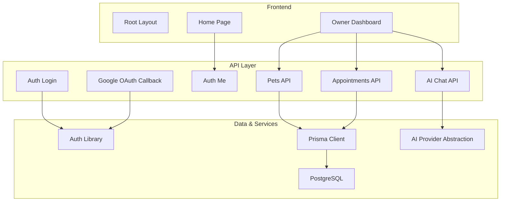
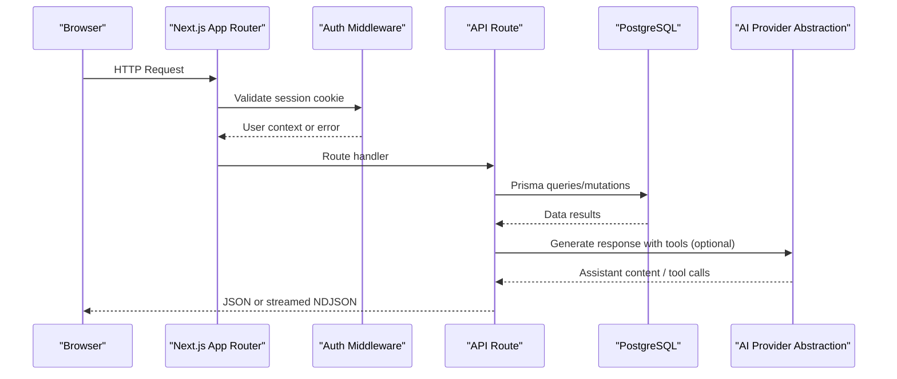
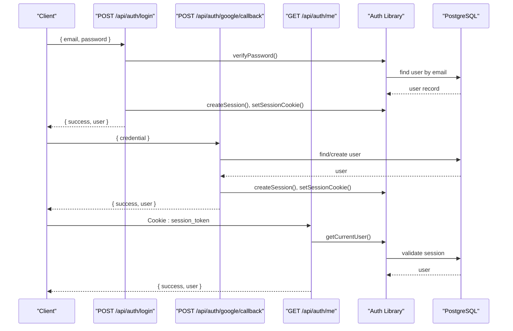
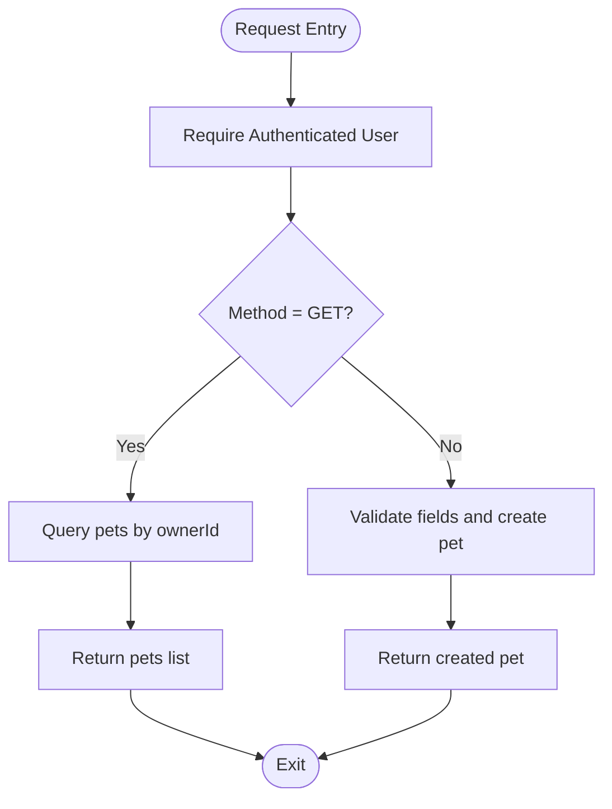
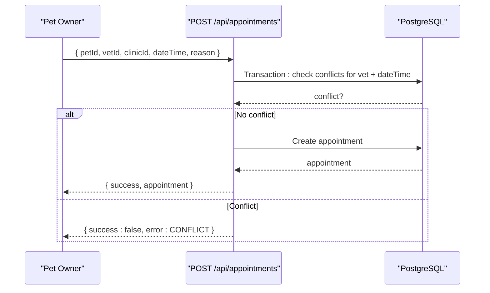
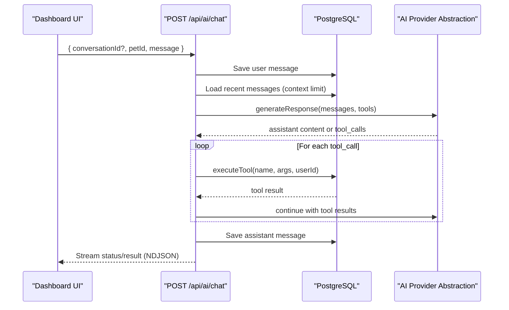
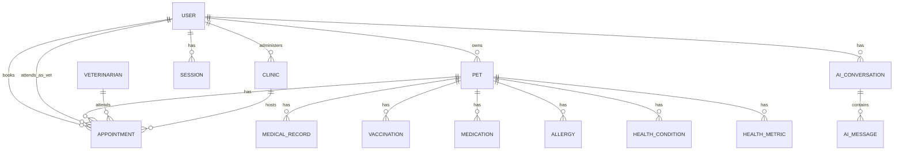
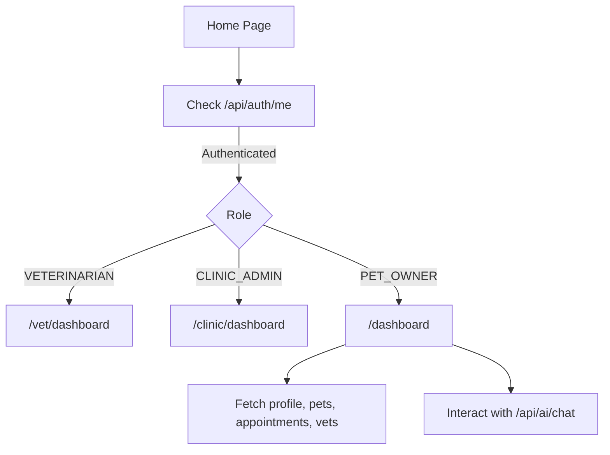
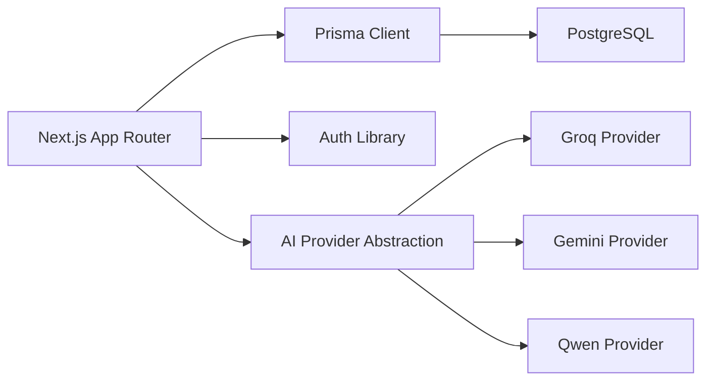

# System Architecture Overview

<cite>
**Referenced Files in This Document**
- [package.json](file://package.json)
- [next.config.ts](file://next.config.ts)
- [app/layout.tsx](file://app/layout.tsx)
- [app/page.tsx](file://app/page.tsx)
- [app/dashboard/page.tsx](file://app/dashboard/page.tsx)
- [lib/db.ts](file://lib/db.ts)
- [lib/auth.ts](file://lib/auth.ts)
- [lib/ai.ts](file://lib/ai.ts)
- [prisma/schema.prisma](file://prisma/schema.prisma)
- [app/api/auth/login/route.ts](file://app/api/auth/login/route.ts)
- [app/api/auth/google/callback/route.ts](file://app/api/auth/google/callback/route.ts)
- [app/api/auth/me/route.ts](file://app/api/auth/me/route.ts)
- [app/api/pets/route.ts](file://app/api/pets/route.ts)
- [app/api/appointments/route.ts](file://app/api/appointments/route.ts)
- [app/api/ai/chat/route.ts](file://app/api/ai/chat/route.ts)
- [docs/03-architecture/01-system-architecture.md](file://docs/03-architecture/01-system-architecture.md)
- [docs/03-architecture/04-ai-architecture.md](file://docs/03-architecture/04-ai-architecture.md)
</cite>

## Table of Contents
1. Introduction
2. Project Structure
3. Core Components
4. Architecture Overview
5. Detailed Component Analysis
6. Dependency Analysis
7. Performance Considerations
8. Troubleshooting Guide
9. Conclusion
10. Appendices

## Introduction
This document provides a comprehensive architectural overview of the PETIVA Pet Healthcare Ecosystem, a full-stack Next.js 16 application using the App Router and an API-first approach. It explains how frontend pages, server components, and API routes interact to deliver pet owner, veterinarian, and clinic admin experiences. The system integrates with PostgreSQL via Prisma ORM for type-safe data access, implements role-based access control across multiple user types, and supports multi-provider AI integration (Groq, Gemini, Qwen) through an abstraction layer. Infrastructure requirements include a PostgreSQL database, Node.js runtime, and cloud deployment considerations for scalability and reliability.

## Project Structure
The application follows a Next.js App Router layout:
- Frontend pages under app/ use React Server and Client Components to render UI and orchestrate data fetching.
- API routes under app/api/ implement REST endpoints for authentication, pets, appointments, and AI chat.
- Shared libraries under lib/ encapsulate database connections, authentication logic, and AI provider abstractions.
- Database schema is defined in Prisma and synchronized to PostgreSQL.

**Diagram sources**
- [app/layout.tsx:1-16](file://app/layout.tsx#L1-L16)
- [app/page.tsx:1-223](file://app/page.tsx#L1-L223)
- [app/dashboard/page.tsx:1-800](file://app/dashboard/page.tsx#L1-L800)
- [app/api/auth/login/route.ts:1-58](file://app/api/auth/login/route.ts#L1-L58)
- [app/api/auth/google/callback/route.ts:1-98](file://app/api/auth/google/callback/route.ts#L1-L98)
- [app/api/auth/me/route.ts:1-33](file://app/api/auth/me/route.ts#L1-L33)
- [app/api/pets/route.ts:1-69](file://app/api/pets/route.ts#L1-L69)
- [app/api/appointments/route.ts:1-143](file://app/api/appointments/route.ts#L1-L143)
- [app/api/ai/chat/route.ts:1-349](file://app/api/ai/chat/route.ts#L1-L349)
- [lib/db.ts:1-33](file://lib/db.ts#L1-L33)
- [lib/auth.ts:1-125](file://lib/auth.ts#L1-L125)
- [lib/ai.ts:1-467](file://lib/ai.ts#L1-L467)
- [prisma/schema.prisma:1-312](file://prisma/schema.prisma#L1-L312)

**Section sources**
- [package.json:1-35](file://package.json#L1-L35)
- [next.config.ts:1-8](file://next.config.ts#L1-L8)
- [app/layout.tsx:1-16](file://app/layout.tsx#L1-L16)
- [app/page.tsx:1-223](file://app/page.tsx#L1-L223)
- [app/dashboard/page.tsx:1-800](file://app/dashboard/page.tsx#L1-L800)

## Core Components
- Authentication and Authorization:
  - Session-based auth with secure cookies, password hashing, and role checks.
  - Google OAuth flow with token verification and session creation.
  - Role-based access control for PET_OWNER, VETERINARIAN, CLINIC_ADMIN, PLATFORM_ADMIN.
- Data Access:
  - Prisma ORM configured for PostgreSQL with connection pooling and environment-aware initialization.
  - Strongly typed models for users, pets, appointments, medical records, and more.
- AI Integration:
  - Multi-provider abstraction supporting Groq, Gemini, and Qwen with fallback mechanisms.
  - Tool execution layer enabling the AI assistant to query pet data, check availability, and book appointments safely.
- API Endpoints:
  - Authentication endpoints for login, logout, me, and Google callback.
  - Resource endpoints for pets and appointments with RBAC enforcement.
  - Streaming AI chat endpoint with NDJSON streaming and tool orchestration.

**Section sources**
- [lib/auth.ts:1-125](file://lib/auth.ts#L1-L125)
- [lib/db.ts:1-33](file://lib/db.ts#L1-L33)
- [lib/ai.ts:1-467](file://lib/ai.ts#L1-L467)
- [app/api/auth/login/route.ts:1-58](file://app/api/auth/login/route.ts#L1-L58)
- [app/api/auth/google/callback/route.ts:1-98](file://app/api/auth/google/callback/route.ts#L1-L98)
- [app/api/auth/me/route.ts:1-33](file://app/api/auth/me/route.ts#L1-L33)
- [app/api/pets/route.ts:1-69](file://app/api/pets/route.ts#L1-L69)
- [app/api/appointments/route.ts:1-143](file://app/api/appointments/route.ts#L1-L143)
- [app/api/ai/chat/route.ts:1-349](file://app/api/ai/chat/route.ts#L1-L349)
- [prisma/schema.prisma:1-312](file://prisma/schema.prisma#L1-L312)

## Architecture Overview
The system uses a unified Next.js App Router as both presentation and backend. Requests enter via browser or client apps, are authenticated and authorized at the API layer, then interact with PostgreSQL through Prisma. AI features call external providers via an abstraction layer that can switch between Groq, Gemini, and Qwen based on configuration.

**Diagram sources**
- [app/api/auth/me/route.ts:1-33](file://app/api/auth/me/route.ts#L1-L33)
- [app/api/appointments/route.ts:1-143](file://app/api/appointments/route.ts#L1-L143)
- [app/api/ai/chat/route.ts:1-349](file://app/api/ai/chat/route.ts#L1-L349)
- [lib/auth.ts:1-125](file://lib/auth.ts#L1-L125)
- [lib/db.ts:1-33](file://lib/db.ts#L1-L33)
- [lib/ai.ts:1-467](file://lib/ai.ts#L1-L467)

## Detailed Component Analysis

### Authentication Flow (Login and Google OAuth)
- Password-based login validates credentials, creates a session, sets a secure cookie, and returns user info.
- Google OAuth verifies the ID token, creates or finds the user, creates a session, sets the cookie, and returns user info.
- The current user endpoint exposes minimal profile data after validating the session cookie.

**Diagram sources**
- [app/api/auth/login/route.ts:1-58](file://app/api/auth/login/route.ts#L1-L58)
- [app/api/auth/google/callback/route.ts:1-98](file://app/api/auth/google/callback/route.ts#L1-L98)
- [app/api/auth/me/route.ts:1-33](file://app/api/auth/me/route.ts#L1-L33)
- [lib/auth.ts:1-125](file://lib/auth.ts#L1-L125)

**Section sources**
- [app/api/auth/login/route.ts:1-58](file://app/api/auth/login/route.ts#L1-L58)
- [app/api/auth/google/callback/route.ts:1-98](file://app/api/auth/google/callback/route.ts#L1-L98)
- [app/api/auth/me/route.ts:1-33](file://app/api/auth/me/route.ts#L1-L33)
- [lib/auth.ts:1-125](file://lib/auth.ts#L1-L125)

### Pets Management API
- GET /api/pets lists all pets owned by the authenticated user.
- POST /api/pets creates a new pet profile with validation and ownership association.

**Diagram sources**
- [app/api/pets/route.ts:1-69](file://app/api/pets/route.ts#L1-L69)
- [lib/auth.ts:1-125](file://lib/auth.ts#L1-L125)

**Section sources**
- [app/api/pets/route.ts:1-69](file://app/api/pets/route.ts#L1-L69)

### Appointment Booking and Scheduling
- GET /api/appointments retrieves appointments filtered by role (owner, vet, clinic admin).
- POST /api/appointments creates a new appointment with double-booking prevention using a transactional check.

**Diagram sources**
- [app/api/appointments/route.ts:1-143](file://app/api/appointments/route.ts#L1-L143)

**Section sources**
- [app/api/appointments/route.ts:1-143](file://app/api/appointments/route.ts#L1-L143)

### AI Chat with Tools and Multi-Provider Support
- GET /api/ai/chat loads conversation history for a given pet, enforcing ownership.
- POST /api/ai/chat streams responses using NDJSON, orchestrating tool calls to read pet data and manage bookings.
- The AI provider abstraction selects among Groq, Gemini, and Qwen based on configuration and supports fallback.

**Diagram sources**
- [app/api/ai/chat/route.ts:1-349](file://app/api/ai/chat/route.ts#L1-L349)
- [lib/ai.ts:1-467](file://lib/ai.ts#L1-L467)

**Section sources**
- [app/api/ai/chat/route.ts:1-349](file://app/api/ai/chat/route.ts#L1-L349)
- [lib/ai.ts:1-467](file://lib/ai.ts#L1-L467)

### Database Schema and Role-Based Access Control
- The Prisma schema defines roles (PET_OWNER, VETERINARIAN, CLINIC_ADMIN, PLATFORM_ADMIN) and relationships across users, pets, appointments, clinics, and medical records.
- RBAC is enforced in API routes using requireRole and role-specific queries to ensure data isolation and appropriate access.

**Diagram sources**
- [prisma/schema.prisma:1-312](file://prisma/schema.prisma#L1-L312)

**Section sources**
- [prisma/schema.prisma:1-312](file://prisma/schema.prisma#L1-L312)

### Frontend Interactions and Routing
- The root layout sets metadata and global styles.
- The home page initializes Google OAuth SDK, checks current session, and routes users to role-specific dashboards.
- The dashboard fetches profile, pets, timeline, appointments, and vets; it also manages AI chat interactions and booking flows.

**Diagram sources**
- [app/layout.tsx:1-16](file://app/layout.tsx#L1-L16)
- [app/page.tsx:1-223](file://app/page.tsx#L1-L223)
- [app/dashboard/page.tsx:1-800](file://app/dashboard/page.tsx#L1-L800)

**Section sources**
- [app/layout.tsx:1-16](file://app/layout.tsx#L1-L16)
- [app/page.tsx:1-223](file://app/page.tsx#L1-L223)
- [app/dashboard/page.tsx:1-800](file://app/dashboard/page.tsx#L1-L800)

## Dependency Analysis
- Framework and Runtime:
  - Next.js 16 with TypeScript, React 19, Tailwind CSS, and ESLint.
  - Node.js runtime required for server-side APIs and Prisma client.
- Database:
  - PostgreSQL via Prisma with adapter-pg for connection pooling.
- Authentication:
  - argon2 for password hashing; google-auth-library for OAuth.
- AI Providers:
  - OpenRouter and direct provider implementations for Groq, Gemini, and Qwen with configurable selection and fallback.

**Diagram sources**
- [package.json:1-35](file://package.json#L1-L35)
- [lib/db.ts:1-33](file://lib/db.ts#L1-L33)
- [lib/auth.ts:1-125](file://lib/auth.ts#L1-L125)
- [lib/ai.ts:1-467](file://lib/ai.ts#L1-L467)

**Section sources**
- [package.json:1-35](file://package.json#L1-L35)
- [lib/db.ts:1-33](file://lib/db.ts#L1-L33)
- [lib/auth.ts:1-125](file://lib/auth.ts#L1-L125)
- [lib/ai.ts:1-467](file://lib/ai.ts#L1-L467)

## Performance Considerations
- Connection Pooling:
  - Prisma Pg pool configured per environment to avoid leaks and optimize reuse.
- Context Limits:
  - AI chat limits message history to reduce token usage and latency.
- Transactions:
  - Appointment creation uses transactions to prevent race conditions and double bookings.
- Streaming:
  - AI chat uses NDJSON streaming to provide real-time status updates and final results.
- Caching:
  - Consider adding cache headers for static assets and read-heavy endpoints to reduce load.

[No sources needed since this section provides general guidance]

## Troubleshooting Guide
- Authentication Errors:
  - Ensure session cookie is present and not expired; verify Google client ID configuration for OAuth.
- Authorization Errors:
  - Confirm user role matches required permissions; verify pet ownership checks before accessing resources.
- AI Provider Errors:
  - Check environment variables for API keys; review fallback behavior when primary provider fails.
- Database Errors:
  - Validate DATABASE_URL and connection settings; inspect Prisma migration status and schema consistency.

**Section sources**
- [lib/auth.ts:1-125](file://lib/auth.ts#L1-L125)
- [app/api/auth/google/callback/route.ts:1-98](file://app/api/auth/google/callback/route.ts#L1-L98)
- [app/api/ai/chat/route.ts:1-349](file://app/api/ai/chat/route.ts#L1-L349)
- [lib/db.ts:1-33](file://lib/db.ts#L1-L33)

## Conclusion
The PETIVA Pet Healthcare Ecosystem leverages Next.js App Router for a cohesive frontend and API layer, Prisma ORM for robust database access, and a flexible AI abstraction to integrate multiple providers. Role-based access control ensures secure, tenant-aware operations across pet owners, veterinarians, and clinic admins. With streaming AI responses, transactional safety for bookings, and clear boundaries for authentication and authorization, the system is well-positioned for scalable deployment on cloud infrastructure.

[No sources needed since this section summarizes without analyzing specific files]

## Appendices

### Infrastructure Requirements
- PostgreSQL database with Prisma migrations applied.
- Node.js runtime compatible with Next.js 16.
- Environment variables for database URL, Google OAuth client ID, and AI provider keys.
- Cloud deployment considerations:
  - Use managed PostgreSQL for high availability.
  - Configure HTTPS and secure cookies in production.
  - Set up logging and monitoring for API routes and AI requests.

**Section sources**
- [docs/03-architecture/01-system-architecture.md:1-151](file://docs/03-architecture/01-system-architecture.md#L1-L151)
- [docs/03-architecture/04-ai-architecture.md:1-105](file://docs/03-architecture/04-ai-architecture.md#L1-L105)