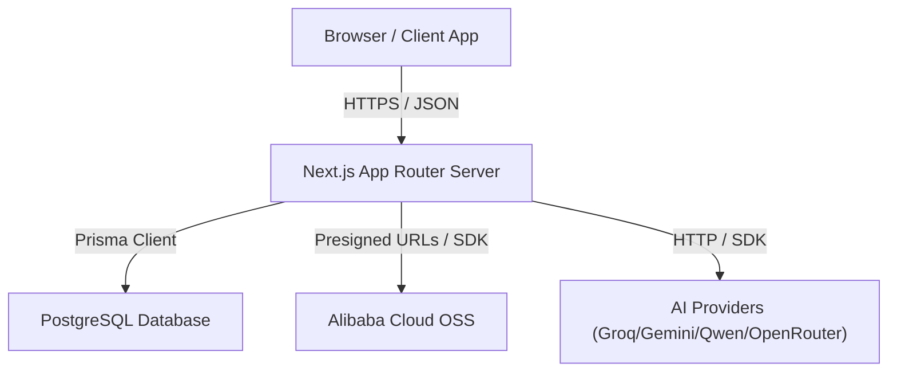
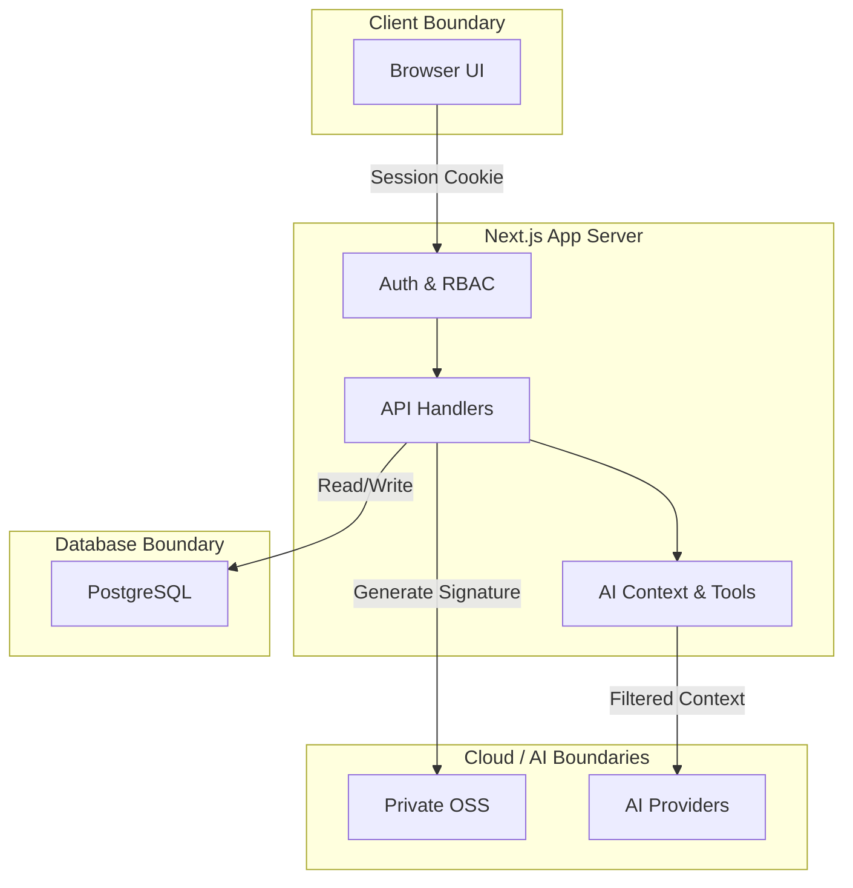
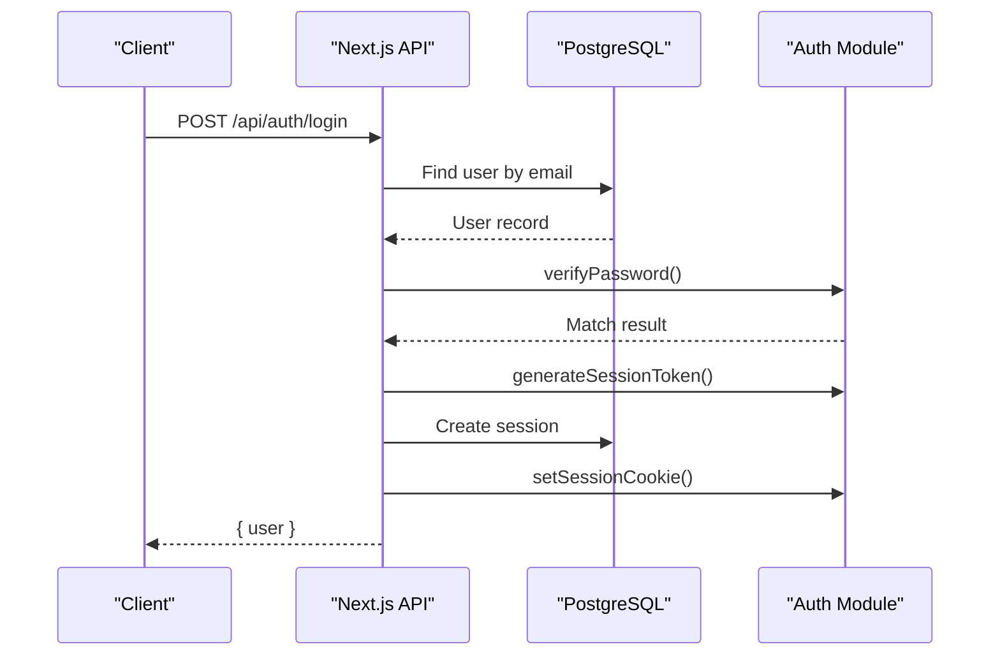
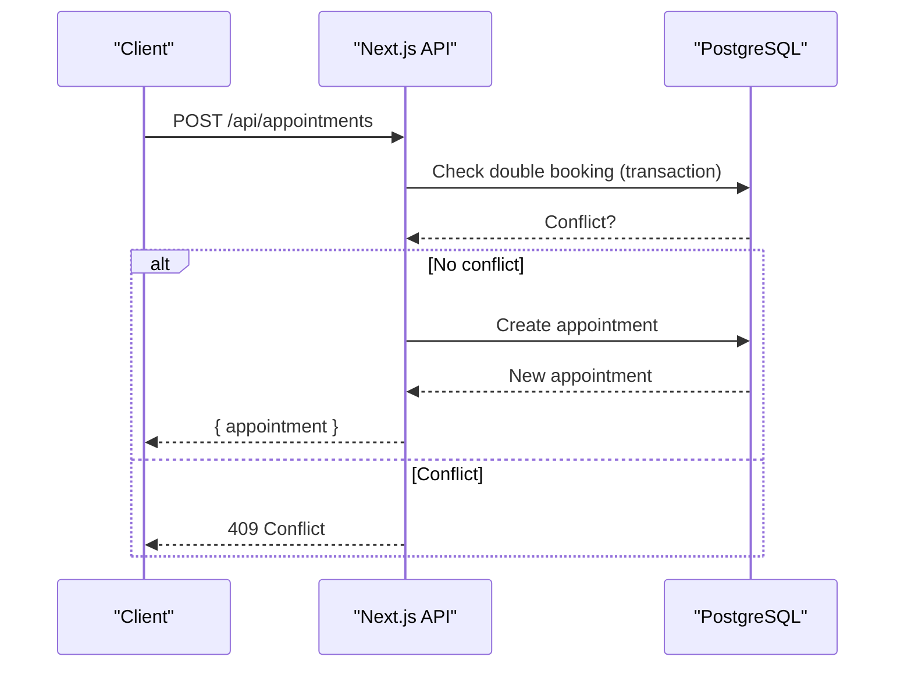
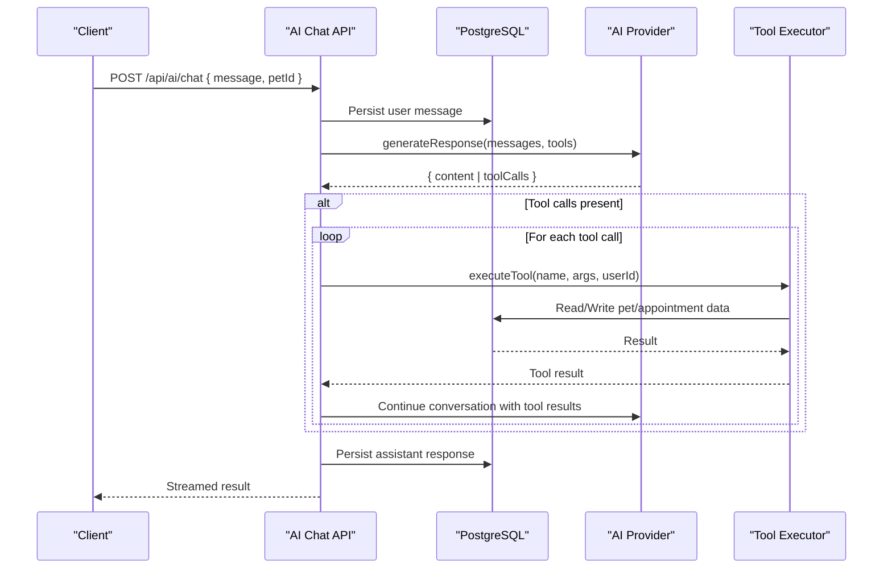
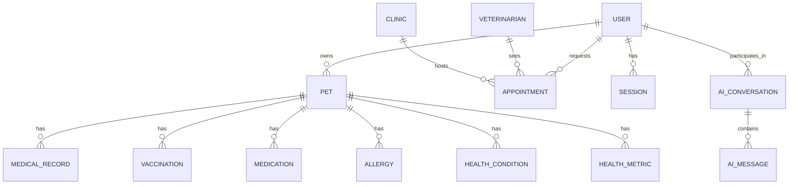
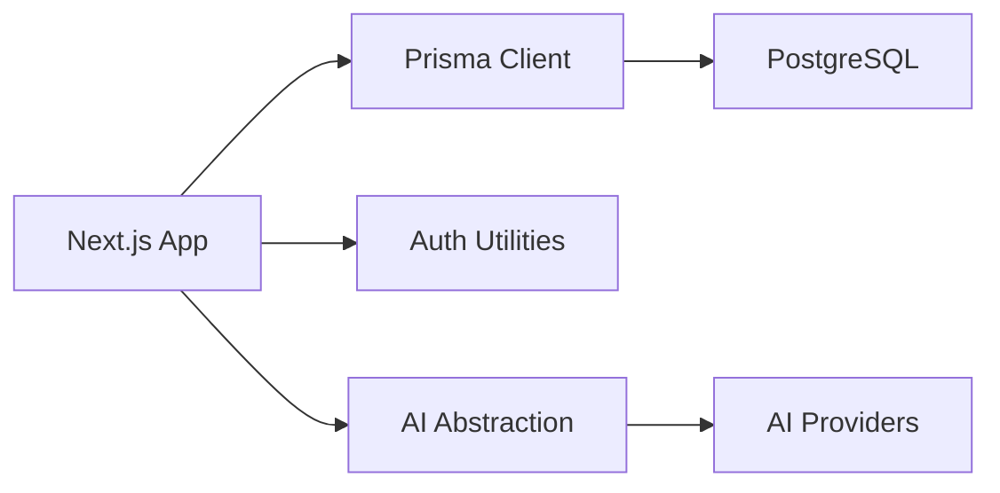

# System Architecture

<cite>
**Referenced Files in This Document**
- [package.json](file://package.json)
- [schema.prisma](file://prisma/schema.prisma)
- [db.ts](file://lib/db.ts)
- [auth.ts](file://lib/auth.ts)
- [ai.ts](file://lib/ai.ts)
- [layout.tsx](file://app/layout.tsx)
- [route.ts (AI Chat)](file://app/api/ai/chat/route.ts)
- [route.ts (Appointments)](file://app/api/appointments/route.ts)
- [route.ts (Pets)](file://app/api/pets/route.ts)
- [route.ts (Auth Login)](file://app/api/auth/login/route.ts)
- [route.ts (Google OAuth Callback)](file://app/api/auth/google/callback/route.ts)
- [01-system-architecture.md](file://docs/03-architecture/01-system-architecture.md)
- [04-ai-architecture.md](file://docs/03-architecture/04-ai-architecture.md)
</cite>

## Table of Contents
1. Introduction
2. Project Structure
3. Core Components
4. Architecture Overview
5. Detailed Component Analysis
6. Dependency Analysis
7. Performance Considerations
8. Troubleshooting Guide
9. Conclusion

## Introduction
This document describes the system architecture of the PETIVA Pet Healthcare Ecosystem, a full-stack Next.js application with an API-first design. It covers the high-level design, component interactions, and boundaries between frontend components, API routes, database layer, and external services such as AI providers and Google OAuth. It also documents technical decisions including Prisma ORM for type-safe data access, role-based access control, multi-provider AI integration patterns, infrastructure requirements, scalability considerations for multiple clinics and users, and deployment topology. Cross-cutting concerns like security, session management, and error handling are addressed throughout.

## Project Structure
The application uses Next.js App Router for both server-rendered pages and API routes:
- Frontend pages and shared layout live under app/.
- API endpoints are organized under app/api/ by feature domains (auth, pets, appointments, ai, clinic, vet).
- Shared business logic is centralized in lib/ (database client, authentication utilities, AI provider abstraction).
- Data models and migrations are managed via Prisma under prisma/.

**Diagram sources**
- [01-system-architecture.md:11-23](file://docs/03-architecture/01-system-architecture.md#L11-L23)

**Section sources**
- [layout.tsx:1-16](file://app/layout.tsx#L1-L16)
- [01-system-architecture.md:27-45](file://docs/03-architecture/01-system-architecture.md#L27-L45)

## Core Components
- Authentication and Session Management: Secure cookie-based sessions with token hashing, sliding expiration, and role checks.
- Data Access Layer: Type-safe database operations using Prisma with PostgreSQL.
- AI Integration: Multi-provider abstraction with tool execution to interact with pet and appointment data.
- API Routes: Feature-scoped endpoints for auth, pets, appointments, and AI chat.

Key implementation highlights:
- Password hashing and verification using Argon2.
- Session tokens stored as hashed values with expiry and cleanup.
- Role-based authorization helpers for protected routes.
- AI tools that enforce ownership and safety constraints before executing database operations.

**Section sources**
- [auth.ts:1-125](file://lib/auth.ts#L1-L125)
- [db.ts:1-33](file://lib/db.ts#L1-L33)
- [ai.ts:1-467](file://lib/ai.ts#L1-L467)

## Architecture Overview
The system follows a layered architecture:
- Presentation: Next.js pages and components.
- API: Route handlers enforcing authentication and authorization.
- Business Logic: Reusable modules for domain operations (e.g., AI context building, booking workflows).
- Data Access: Prisma ORM over PostgreSQL.
- External Services: AI providers (Groq, Gemini, Qwen, OpenRouter) and optional cloud storage.

**Diagram sources**
- [01-system-architecture.md:50-76](file://docs/03-architecture/01-system-architecture.md#L50-L76)

## Detailed Component Analysis

### Authentication and Authorization
- Login flow validates credentials, creates a session, and sets an HTTP-only cookie.
- Google OAuth callback verifies tokens, creates or retrieves users, and establishes sessions.
- Protected routes use requireAuth and requireRole to enforce identity and permissions.

**Diagram sources**
- [route.ts (Auth Login):5-48](file://app/api/auth/login/route.ts#L5-L48)
- [auth.ts:33-97](file://lib/auth.ts#L33-L97)

**Section sources**
- [route.ts (Auth Login):1-58](file://app/api/auth/login/route.ts#L1-L58)
- [route.ts (Google OAuth Callback):1-98](file://app/api/auth/google/callback/route.ts#L1-L98)
- [auth.ts:1-125](file://lib/auth.ts#L1-L125)

### Pets and Appointments
- Pets API enforces ownership and returns only the authenticated owner’s pets.
- Appointments API supports listing by role (owner, veterinarian, clinic admin) and creating new appointments with double-booking prevention via transactions.

**Diagram sources**
- [route.ts (Appointments):70-129](file://app/api/appointments/route.ts#L70-L129)

**Section sources**
- [route.ts (Pets):1-69](file://app/api/pets/route.ts#L1-L69)
- [route.ts (Appointments):1-143](file://app/api/appointments/route.ts#L1-L143)

### AI Assistant and Tool Execution
- The AI chat endpoint authenticates users, resolves or creates conversations, persists messages, and streams responses.
- AI providers are selected via configuration; tool execution enforces ownership and business rules before interacting with the database.
- Fallback provider strategy ensures resilience if primary provider fails.

**Diagram sources**
- [route.ts (AI Chat):68-333](file://app/api/ai/chat/route.ts#L68-L333)
- [ai.ts:297-467](file://lib/ai.ts#L297-L467)

**Section sources**
- [route.ts (AI Chat):1-349](file://app/api/ai/chat/route.ts#L1-L349)
- [ai.ts:1-467](file://lib/ai.ts#L1-L467)

### Data Model and Relationships
The Prisma schema defines core entities and relationships across users, pets, veterinarians, clinics, appointments, medical records, and AI conversations.

**Diagram sources**
- [schema.prisma:30-312](file://prisma/schema.prisma#L30-L312)

**Section sources**
- [schema.prisma:1-312](file://prisma/schema.prisma#L1-L312)

## Dependency Analysis
- Framework and runtime: Next.js with TypeScript and React.
- Database: PostgreSQL via Prisma with connection pooling.
- Authentication: Argon2 for password hashing; Google OAuth library for identity verification.
- AI: Multiple providers abstracted behind a common interface with fallback strategies.

**Diagram sources**
- [package.json:11-22](file://package.json#L11-L22)
- [db.ts:1-33](file://lib/db.ts#L1-L33)
- [ai.ts:105-139](file://lib/ai.ts#L105-L139)

**Section sources**
- [package.json:1-35](file://package.json#L1-L35)
- [db.ts:1-33](file://lib/db.ts#L1-L33)
- [ai.ts:105-139](file://lib/ai.ts#L105-L139)

## Performance Considerations
- Connection pooling: PrismaPg pool configured per environment to avoid leaks and optimize connections.
- Context window limits: AI messages truncated to recent history to reduce token usage and latency.
- Transactional writes: Appointment creation uses transactions to prevent race conditions and double bookings.
- Streaming responses: AI chat uses streaming to improve perceived performance and responsiveness.

[No sources needed since this section provides general guidance]

## Troubleshooting Guide
Common issues and resolutions:
- Unauthenticated requests: Ensure session cookie is present and valid; check session expiry and cookie settings.
- Forbidden access: Verify ownership checks for pets and conversations; confirm role-based permissions.
- AI provider errors: Validate API keys and model configuration; rely on fallback provider when primary fails.
- Database conflicts: Handle 409 responses for duplicate bookings; ensure unique constraints and indexes are applied.

**Section sources**
- [route.ts (AI Chat):53-65](file://app/api/ai/chat/route.ts#L53-L65)
- [route.ts (Appointments):55-66](file://app/api/appointments/route.ts#L55-L66)
- [auth.ts:109-125](file://lib/auth.ts#L109-L125)

## Conclusion
The PETIVA Pet Healthcare Ecosystem leverages a unified Next.js architecture with clear separation between presentation, API, business logic, and data layers. Security is enforced through robust authentication and role-based authorization, while AI capabilities are abstracted to support multiple providers with resilient fallbacks. The system is designed for scalability across multiple clinics and users, with careful attention to performance, error handling, and operational observability.

[No sources needed since this section summarizes without analyzing specific files]